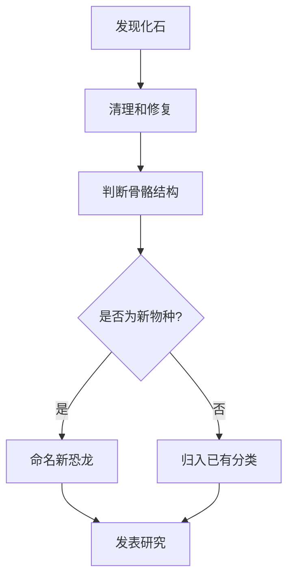
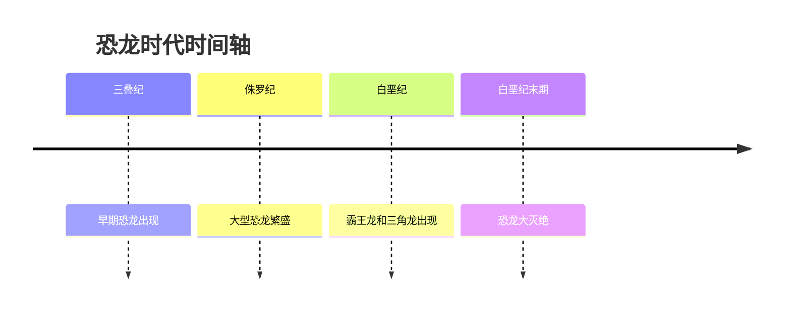
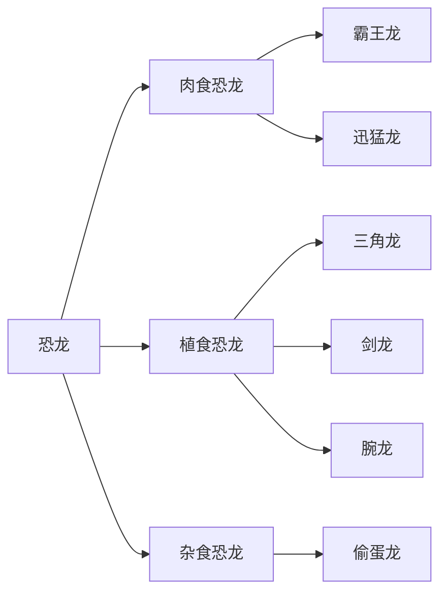

# Dinosaurs World

## 1. 介绍

欢迎来到 **Dinosaurs World**。

这里记录各种恐龙知识，包括：

- 恐龙分类
- 恐龙生活年代
- 恐龙体型对比
- 恐龙灭绝假说
- 恐龙化石发现

---

## 2. 加粗、斜体、删除线

**霸王龙 Tyrannosaurus Rex** 是最著名的肉食恐龙之一。

*三角龙 Triceratops* 拥有非常明显的三只角。

***腕龙 Brachiosaurus*** 是一种体型巨大的植食性恐龙。

~~恐龙都生活在同一个时代~~  
实际上，不同恐龙生活在不同地质时期。

---

## 3. 行内代码

在恐龙数据库中，可以用 `dinosaur.name` 表示恐龙名称。

例如：`Tyrannosaurus Rex`、`Triceratops`、`Velociraptor`。

---

## 4. 代码块

```js
const dinosaur = {
  name: "Tyrannosaurus Rex",
  period: "Late Cretaceous",
  diet: "Carnivore",
  length: "12 meters"
}

console.log(dinosaur.name)
```

```python
dinosaurs = ["T-Rex", "Triceratops", "Velociraptor"]

for dino in dinosaurs:
    print(dino)
```

```cpp
#include <iostream>
using namespace std;

int main() {
    cout << "Welcome to Dinosaurs World!" << endl;
    return 0;
}
```

---

## 5. 无序列表

- 肉食恐龙
  - 霸王龙
  - 迅猛龙
  - 异特龙
- 植食恐龙
  - 三角龙
  - 腕龙
  - 剑龙
- 杂食恐龙
  - 偷蛋龙

---

## 6. 有序列表

1. 发现恐龙化石
2. 清理化石表面
3. 判断化石所属部位
4. 对比已有化石资料
5. 推测恐龙种类和生活习性

---

## 7. 任务列表

- [x] 了解霸王龙
- [x] 了解三角龙
- [ ] 研究恐龙灭绝原因
- [ ] 制作恐龙时间轴
- [ ] 绘制恐龙关系图

---

## 8. 引用

> 恐龙曾经统治地球超过一亿年。
>
> 它们的故事，藏在岩石、化石和地层之中。

> 研究恐龙，不只是研究远古生物，也是在研究地球生命演化的历史。

---

## 9. 表格

| 恐龙名称 | 英文名 | 食性 | 生活时期 |
|---|---|---|---|
| 霸王龙 | Tyrannosaurus Rex | 肉食 | 白垩纪晚期 |
| 三角龙 | Triceratops | 植食 | 白垩纪晚期 |
| 剑龙 | Stegosaurus | 植食 | 侏罗纪晚期 |
| 迅猛龙 | Velociraptor | 肉食 | 白垩纪晚期 |
| 腕龙 | Brachiosaurus | 植食 | 侏罗纪晚期 |

---

## 10. 链接

[维基百科：恐龙](https://zh.wikipedia.org/wiki/%E6%81%90%E9%BE%99)

[维基百科：霸王龙](https://zh.wikipedia.org/wiki/%E9%9C%B8%E7%8E%8B%E9%BE%99)

---

## 11. 图片


也可以使用 HTML 控制图片大小：


---
## 12. 数学公式

如果一只恐龙的行走速度为 $v$，行走时间为 $t$，那么它移动的距离可以表示为：

$$
s = vt
$$

如果用 $L$ 表示恐龙身长，用 $H$ 表示恐龙身高，可以粗略定义一个体型比例：

$$
R = \frac{L}{H}
$$

例如，霸王龙身长约 $12$ 米，身高约 $4$ 米，则：

$$
R = \frac{12}{4} = 3
$$
---

## 13. 脚注

霸王龙是最著名的兽脚类恐龙之一。[^trex]

[^trex]: 霸王龙生活在白垩纪晚期，是一种大型肉食性恐龙。

---

## 14. 折叠内容

<details>
<summary>点击查看霸王龙简介</summary>

霸王龙，全名 Tyrannosaurus Rex，是一种大型肉食性恐龙。

它拥有强大的咬合力、粗壮的后肢和巨大的头骨。

```js
const trex = {
  name: "Tyrannosaurus Rex",
  diet: "Carnivore",
  period: "Late Cretaceous"
}
```

</details>

---

## 15. Callout 提示块

:::note

恐龙并不是全部都非常巨大，也有一些体型很小的恐龙。

:::

:::tip

记忆恐龙分类时，可以先区分肉食、植食和杂食。

:::

:::warning

不同 Markdown 渲染器对 Callout 的支持可能不同。

:::

:::danger

不要把翼龙、蛇颈龙直接归为恐龙，它们属于不同的爬行动物类群。

:::

---

## 16. Mermaid 流程图



---

## 17. Mermaid 时间轴



---

## 18. Mermaid 关系图



---

## 19. HTML 卡片

<div className="markdown-demo-card">

<h3>霸王龙 Tyrannosaurus Rex</h3>

<p>霸王龙是白垩纪晚期的大型肉食恐龙，以强大的咬合力闻名。</p>

<ul>
  <li>食性：肉食</li>
  <li>时期：白垩纪晚期</li>
  <li>体长：约 12 米</li>
</ul>

</div>

---

## 20. 键盘按键

按 <kbd>Ctrl</kbd> + <kbd>F</kbd> 搜索恐龙名称。

按 <kbd>Ctrl</kbd> + <kbd>S</kbd> 保存恐龙笔记。

---

## 21. 综合示例

# 我的恐龙研究笔记

## 今日研究对象

- [x] 霸王龙
- [x] 三角龙
- [ ] 剑龙
- [ ] 腕龙

## 重点记录

霸王龙是一种典型的肉食恐龙，生活在白垩纪晚期。

三角龙是一种植食恐龙，头部有明显的三只角和颈盾。

## 简单对比

| 名称 | 食性 | 特点 |
|---|---|---|
| 霸王龙 | 肉食 | 咬合力强 |
| 三角龙 | 植食 | 三只角和颈盾 |
| 剑龙 | 植食 | 背部骨板 |
| 腕龙 | 植食 | 长脖子 |

## 总结

> 恐龙的多样性非常高，不能简单地认为所有恐龙都巨大、凶猛或生活在同一个时代。

---

## 22. Docusaurus 高级代码块

### 22.1 带标题的代码块

```ts title="src/data/dinosaurs.ts"
export const dinosaurs = [
  {
    name: 'Tyrannosaurus Rex',
    period: 'Late Cretaceous',
    diet: 'Carnivore',
  },
  {
    name: 'Triceratops',
    period: 'Late Cretaceous',
    diet: 'Herbivore',
  },
];
```

### 22.2 显示行号

```ts showLineNumbers
type Dinosaur = {
  name: string;
  period: string;
  diet: 'Carnivore' | 'Herbivore' | 'Omnivore';
};

const trex: Dinosaur = {
  name: 'Tyrannosaurus Rex',
  period: 'Late Cretaceous',
  diet: 'Carnivore',
};
```

### 22.3 高亮指定几行

下面这个代码块会高亮第 2 行、第 5 到 7 行。

```ts {2,5-7}
function createDinosaur(name: string, period: string, diet: string) {
  const dinosaur = {
    name,
    period,
    diet,
  };

  return dinosaur;
}

createDinosaur('Tyrannosaurus Rex', 'Late Cretaceous', 'Carnivore');
```

### 22.4 标题、行号、高亮行一起使用

```ts {2,6-8} title="src/utils/createDinosaur.ts" showLineNumbers
export function createDinosaur(name: string, period: string, diet: string) {
  const dinosaur = {
    name,
    period,
    diet,
    discovered: true,
  };

  return dinosaur;
}
```

### 22.5 高亮下一行

```ts
function getDinosaurName() {
  // highlight-next-line
  const name = 'Tyrannosaurus Rex';

  return name;
}
```

### 22.6 高亮一段代码

```ts
function getDinosaurInfo() {
  const name = 'Triceratops';

  // highlight-start
  const period = 'Late Cretaceous';
  const diet = 'Herbivore';
  const horns = 3;
  // highlight-end

  return {
    name,
    period,
    diet,
    horns,
  };
}
```

---

## 23. Docusaurus 合并代码块 Tabs

### 23.1 JavaScript / TypeScript / Python 代码切换

<Tabs items={["JavaScript","TypeScript","Python"]}>
<Tab>

```js
const dinosaur = {
  name: 'Tyrannosaurus Rex',
  period: 'Late Cretaceous',
  diet: 'Carnivore',
};

console.log(dinosaur.name);
```

</Tab>
<Tab>

```ts
type Dinosaur = {
  name: string;
  period: string;
  diet: string;
};

const dinosaur: Dinosaur = {
  name: 'Tyrannosaurus Rex',
  period: 'Late Cretaceous',
  diet: 'Carnivore',
};

console.log(dinosaur.name);
```

</Tab>
<Tab>

```python
dinosaur = {
    "name": "Tyrannosaurus Rex",
    "period": "Late Cretaceous",
    "diet": "Carnivore",
}

print(dinosaur["name"])
```

</Tab>
</Tabs>

### 23.2 npm / pnpm / yarn 命令切换

<Tabs items={["npm","pnpm","Yarn"]}>
<Tab>

```bash
npm install
npm run start
```

</Tab>
<Tab>

```bash
pnpm install
pnpm start
```

</Tab>
<Tab>

```bash
yarn
yarn start
```

</Tab>
</Tabs>

### 23.3 同一个 groupId 会同步切换

上面选择了 `pnpm`，下面这个 Tabs 默认也会跟着切换到 `pnpm`。

<Tabs items={["npm","pnpm","Yarn"]}>
<Tab>

```bash
npm run build
```

</Tab>
<Tab>

```bash
pnpm build
```

</Tab>
<Tab>

```bash
yarn build
```

</Tab>
</Tabs>

### 23.4 不同系统命令切换

<Tabs items={["Windows","macOS","Linux"]}>
<Tab>

```powershell
Get-ChildItem
npm run dev
```

</Tab>
<Tab>

```bash
ls
npm run dev
```

</Tab>
<Tab>

```bash
ls
npm run dev
```

</Tab>
</Tabs>

---

## 24. Docusaurus 代码块测试区

### 24.1 测试行高亮

```tsx {4,8-11} title="src/components/DinosaurCard.tsx" showLineNumbers
type DinosaurCardProps = {
  name: string;
  period: string;
  diet: string;
};

export function DinosaurCard(props: DinosaurCardProps) {
  return (
    <article>
      <h2>{props.name}</h2>
      <p>{props.period}</p>
      <p>{props.diet}</p>
    </article>
  );
}
```

### 24.2 测试 diff 代码块

```diff
- const oldDinosaur = 'Unknown Dinosaur';
+ const newDinosaur = 'Tyrannosaurus Rex';
```

### 24.3 测试 JSON 代码块

```json title="dinosaurs.json"
{
  "dinosaurs": [
    {
      "name": "Tyrannosaurus Rex",
      "period": "Late Cretaceous",
      "diet": "Carnivore"
    },
    {
      "name": "Triceratops",
      "period": "Late Cretaceous",
      "diet": "Herbivore"
    }
  ]
}
```
