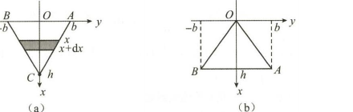
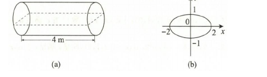

# 第三章 一元函数积分学及其应用

> 题干与原始解法以提供的《880高数做题本》与《880数一解析》为基准；明显识别/排版错误已结合原题 PDF 与解题逻辑校正。章末“知识点与技巧总结”为整理时补充。

## 基础题

### 选择题

<ExamQuestion>

1. 设 $f(x)$ 是连续函数，且 $f(x) \neq 0$，若 $\int x f(x) \, \mathrm{d}x = \arcsin x + C$，则 $\int \frac{\mathrm{d}x}{f(x)} = (\quad)$。

<ExamChoices>
<ExamOption>A. $\frac{1}{3}(1-x^2)^{\frac{3}{2}} + C$</ExamOption>
<ExamOption>B. $\frac{2}{3}(1-x^2)^{\frac{3}{2}} + C$</ExamOption>
<ExamOption>C. $-\frac{1}{3}(1-x^2)^{\frac{3}{2}} + C$</ExamOption>
<ExamOption>D. $-\frac{2}{3}(1-x^2)^{\frac{3}{2}} + C$</ExamOption>
</ExamChoices>

<ExamSolution>

<ExamAnswer>C</ExamAnswer>

<ExamExplanation>
**解析：** 已知等式 $\int x f(x) \mathrm{d}x = \arcsin x + C$，两边同时对 $x$ 求导，得
$$xf(x) = \frac{1}{\sqrt{1-x^2}},$$
故 $\frac{1}{f(x)} = x\sqrt{1-x^2}$，所以
$$\int \frac{\mathrm{d}x}{f(x)} = \int x\sqrt{1-x^2} \mathrm{d}x = -\frac{1}{2}\int \sqrt{1-x^2} \mathrm{d}(1-x^2) = -\frac{1}{3}(1-x^2)^{\frac{3}{2}} + C.$$
选项 C 正确。
</ExamExplanation>

</ExamSolution>

</ExamQuestion>

<ExamQuestion>

2. 设 $f(x)$ 是连续函数，$F(x)$ 是 $f(x)$ 的原函数，则 $(\quad)$。

<ExamChoices>
<ExamOption>A. 当 $f(x)$ 为奇函数时，$F(x)$ 必为偶函数</ExamOption>
<ExamOption>B. 当 $f(x)$ 为偶函数时，$F(x)$ 必为奇函数</ExamOption>
<ExamOption>C. 当 $f(x)$ 为周期函数时，$F(x)$ 必为周期函数</ExamOption>
<ExamOption>D. 当 $f(x)$ 为单调函数时，$F(x)$ 必为单调函数</ExamOption>
</ExamChoices>

<ExamSolution>

<ExamAnswer>A</ExamAnswer>

<ExamExplanation>
**解析：** 令 $F(x) = \int_a^x f(t)\mathrm{d}t$，当 $f(t)$ 是连续的奇函数时，$F(x)$ 是偶函数. 故选 A.
</ExamExplanation>

</ExamSolution>

</ExamQuestion>

<ExamQuestion>

3. 设 $\int_{-\infty}^{+\infty} f(x) \, \mathrm{d}x = a$ ($a$ 为常数)，$f(x)$ 为偶函数，$F(x) = \int_{-\infty}^{x} f(t) \, \mathrm{d}t$，则对任意 $x_0 \in (-\infty, +\infty)$，$F(-x_0) = (\quad)$。

<ExamChoices>
<ExamOption>A. $-F(x_0)$</ExamOption>
<ExamOption>B. $F(x_0)$</ExamOption>
<ExamOption>C. $\frac{a}{2} - \int_{0}^{x_0} f(x) \, \mathrm{d}x$</ExamOption>
<ExamOption>D. $a - \int_{0}^{x_0} f(x) \, \mathrm{d}x$</ExamOption>
</ExamChoices>

<ExamSolution>

<ExamAnswer>C</ExamAnswer>

<ExamExplanation>
**解析：** 由 $f(x)$ 为偶函数，且 $\int_{-\infty}^{+\infty} f(x)\mathrm{d}x = a$，知 $a = 2\int_{-\infty}^0 f(x)\mathrm{d}x$，即 $\int_{-\infty}^0 f(x)\mathrm{d}x = \frac{a}{2}$.
$$F(-x_0) = \int_{-\infty}^{-x_0} f(x)\mathrm{d}x = \int_{-\infty}^0 f(x)\mathrm{d}x + \int_0^{-x_0} f(x)\mathrm{d}x = \frac{a}{2} + \int_0^{-x_0} f(x)\mathrm{d}x,$$
又 $\int_0^{-x_0} f(x)\mathrm{d}x \overset{x=-u}{=} \int_0^{x_0} f(-u)(-\mathrm{d}u) = -\int_0^{x_0} f(x)\mathrm{d}x$，故 $F(-x_0) = \frac{a}{2} - \int_0^{x_0} f(x)\mathrm{d}x$.
选项 C 正确。
</ExamExplanation>

</ExamSolution>

</ExamQuestion>

<ExamQuestion>

4. 设 $F(x)$ 是 $\sin x^2$ 的一个原函数，则 $\mathrm{d}[F(x^2)] = (\quad)$。

<ExamChoices>
<ExamOption>A. $\sin x^4 \mathrm{d}x$</ExamOption>
<ExamOption>B. $\sin x^2 \mathrm{d}(x^2)$</ExamOption>
<ExamOption>C. $2x \sin x^2 \mathrm{d}x$</ExamOption>
<ExamOption>D. $2x \sin x^4 \mathrm{d}x$</ExamOption>
</ExamChoices>

<ExamSolution>

<ExamAnswer>D</ExamAnswer>

<ExamExplanation>
**解析：** 由原函数的定义，知
$$F'(t) = \sin t^2, \mathrm{d}[F(t)] = F'(t)\mathrm{d}t = \sin t^2 \mathrm{d}t,$$
令 $t = x^2$，得 $\mathrm{d}[F(x^2)] = \sin x^4 \mathrm{d}(x^2) = 2x\sin x^4 \mathrm{d}x$. 故选 D.
</ExamExplanation>

</ExamSolution>

</ExamQuestion>

<ExamQuestion>

5. 设

$$
f(x) = \begin{cases}
\sin x, & 0 \leqslant x < \pi, \\
2, & \pi \leqslant x \leqslant 2\pi,
\end{cases}
$$

$F(x) = \int_{0}^{x} f(t) \, \mathrm{d}t$，则 $(\quad)$。

<ExamChoices>
<ExamOption>A. $x = \pi$ 是 $F(x)$ 的跳跃间断点</ExamOption>
<ExamOption>B. $x = \pi$ 是 $F(x)$ 的可去间断点</ExamOption>
<ExamOption>C. $F(x)$ 在 $x = \pi$ 处连续但不可导</ExamOption>
<ExamOption>D. $F(x)$ 在 $x = \pi$ 处可导</ExamOption>
</ExamChoices>

<ExamSolution>

<ExamAnswer>C</ExamAnswer>

<ExamExplanation>
**解析：** $x = \pi$ 是 $f(x)$ 的跳跃间断点，故 $f(x)$ 可积，则 $F(x) = \int_0^x f(t)\mathrm{d}t$ 在 $x = \pi$ 处连续, 但不可导, 所以选项 C 正确。

**注：** ① 此题利用了结论：设 $F(x) = \int_0^x f(t)\mathrm{d}t, x \in [a,b]$, 则:
(i) $f(x)$ 在 $[a,b]$ 上可积 $\Rightarrow F(x)$ 在 $[a,b]$ 上连续;
(ii) $f(x)$ 在 $[a,b]$ 上连续 $\Rightarrow F(x)$ 在 $[a,b]$ 上可导.
② 若 $f(x)$ 在 $[a,b]$ 上只有有限个第一类间断点，则 $f(x)$ 在 $[a,b]$ 上可积.
③ 若 $f(x)$ 在 $[a,b]$ 上存在第二类间断点，则 $f(x)$ 没有原函数.
</ExamExplanation>

</ExamSolution>

</ExamQuestion>

<ExamQuestion>

6. 设

$$
f(x) = \begin{cases}
x^2 + 1, & x \leqslant 0, \\
\cos x, & x > 0,
\end{cases}
$$

的一个原函数为 $(\quad)$。

<ExamChoices>
<ExamOption>A. $F(x)=\begin{cases}\frac{1}{3}x^3+x,&x\leqslant 0,\\\sin x+1,&x>0\end{cases}$</ExamOption>
<ExamOption>B. $F(x)=\begin{cases}\frac{1}{3}x^3+x+1,&x\leqslant 0,\\\sin x+2,&x>0\end{cases}$</ExamOption>
<ExamOption>C. $F(x)=\begin{cases}\frac{1}{3}x^3+x+1,&x\leqslant 0,\\\sin x,&x>0\end{cases}$</ExamOption>
<ExamOption>D. $F(x)=\begin{cases}\frac{1}{3}x^3+x,&x\leqslant 0,\\\sin x,&x>0\end{cases}$</ExamOption>
</ExamChoices>

<ExamSolution>

<ExamAnswer>D</ExamAnswer>

<ExamExplanation>
**解析：** 当 $x \leqslant 0$ 时, $F(x) = \int (x^2+1)\mathrm{d}x = \frac{1}{3}x^3 + x + C_1$;
当 $x > 0$ 时, $F(x) = \int \cos x \mathrm{d}x = \sin x + C_2$.

由原函数 $F(x)$ 的连续性, 知
$$\lim_{x \to 0^-} F(x) = C_1, \quad \lim_{x \to 0^+} F(x) = C_2,$$
故 $C_1 = C_2$。令 $C_1 = C_2 = C$, 得
$$F(x) = \begin{cases} \frac{1}{3}x^3 + x + C, & x \leqslant 0, \\ \sin x + C, & x > 0. \end{cases}$$
取 $C = 0$, 知选项 D 正确。

**注：** 作为选择题, 可以利用 $F(x)$ 的连续性, 检查选项中 $F(x)$ 在 $x = 0$ 的左、右极限, 当 $\lim_{x \to 0^-} F(x) = \lim_{x \to 0^+} F(x)$ 时, 可得正确答案。
</ExamExplanation>

</ExamSolution>

</ExamQuestion>

<ExamQuestion>

7. $\lim_{n \to \infty} \sum_{k=1}^{n} \int_{k}^{k+1} \frac{\mathrm{d}x}{x\sqrt{x-1}} = (\quad)$.

<ExamChoices>
<ExamOption>A. $1$ \quad\quad\quad\quad</ExamOption>
<ExamOption>B. $\frac{\pi}{2}$ \quad\quad\quad\quad</ExamOption>
<ExamOption>C. $\pi$ \quad\quad\quad\quad</ExamOption>
<ExamOption>D. $2\pi$</ExamOption>
</ExamChoices>

<ExamSolution>

<ExamAnswer>C</ExamAnswer>

<ExamExplanation>
**解析：** 记 $a_n = \sum_{k=1}^n \int_k^{k+1} \frac{\mathrm{d}x}{x\sqrt{x-1}}$, 则 $a_n = \int_1^{n+1} \frac{\mathrm{d}x}{x\sqrt{x-1}}$。
故
$$\lim_{n \to \infty} a_n = \int_1^{+\infty} \frac{\mathrm{d}x}{x\sqrt{x-1}} = \int_1^2 \frac{\mathrm{d}x}{x\sqrt{x-1}} + \int_2^{+\infty} \frac{\mathrm{d}x}{x\sqrt{x-1}} \stackrel{\text{记}}{=} I_1 + I_2.$$
$$I_1 = \int_1^2 \frac{\mathrm{d}x}{x\sqrt{x-1}} \overset{\sqrt{x-1}=t}{x=t^2+1} \int_0^1 \frac{2t}{t(t^2+1)}\mathrm{d}t = \left. 2\arctan t \right|_0^1 = \frac{\pi}{2},$$
$$I_2 = \int_2^{+\infty} \frac{\mathrm{d}x}{x\sqrt{x-1}} \overset{\sqrt{x-1}=t}{x=t^2+1} \int_1^{+\infty} \frac{2t}{t(t^2+1)}\mathrm{d}t = \left. 2\arctan t \right|_1^{+\infty} = \frac{\pi}{2},$$
故 $\lim_{n \to \infty} a_n = I_1 + I_2 = \frac{\pi}{2} + \frac{\pi}{2} = \pi$。选项 C 正确。
</ExamExplanation>

</ExamSolution>

</ExamQuestion>

<ExamQuestion>

8. 设 $f(x)$ 在 $[0,1]$ 上连续，$f(x)>0, f'(x)<0, f''(x)>0$，记 $M=\int_{0}^{1} f(x)\mathrm{d}x, N=f(1)$，$P=\frac{1}{2}[f(0)+f(1)]$, 则 $(\quad)$.

<ExamChoices>
<ExamOption>A. $M<P<N$ \quad\quad</ExamOption>
<ExamOption>B. $N<M<P$ \quad\quad</ExamOption>
<ExamOption>C. $P<M<N$ \quad\quad</ExamOption>
<ExamOption>D. $P<N<M$</ExamOption>
</ExamChoices>

<ExamSolution>

<ExamAnswer>B</ExamAnswer>

<ExamExplanation>
**解析：** 由已知条件, 画出示意图, 如图 3-1 所示。由 $f'(x) < 0$, 知当 $x \in [0, 1)$ 时, $f(x) > f(1)$, 故
$$N = (1-0)f(1) < M = \int_0^1 f(x)\mathrm{d}x.$$
由 $f''(x) > 0$, 知 $P = \frac{1}{2}(1-0)[f(0)+f(1)] > \int_0^1 f(x)\mathrm{d}x = M$, 故选 B。
</ExamExplanation>

</ExamSolution>

</ExamQuestion>

<ExamQuestion>

9. 设 $f(x)$ 在 $[0, +\infty)$ 上连续，且 $f(x) > \int_{0}^{x} f(t)\mathrm{d}t (x \ge 0)$, 当 $0 < a < b$ 时, 下列选项中正确的是 $(\quad)$.

<ExamChoices>
<ExamOption>A. $\int_{0}^{b} f(x)\mathrm{d}x > \int_{0}^{a} f(x)\mathrm{d}x > \int_{0}^{\frac{a+b}{2}} f(x)\mathrm{d}x$</ExamOption>
<ExamOption>B. $\int_{0}^{a} f(x)\mathrm{d}x > \int_{0}^{b} f(x)\mathrm{d}x > \int_{0}^{\frac{a+b}{2}} f(x)\mathrm{d}x$</ExamOption>
<ExamOption>C. $\int_{0}^{a} f(x)\mathrm{d}x > \int_{0}^{\frac{a+b}{2}} f(x)\mathrm{d}x > \int_{0}^{b} f(x)\mathrm{d}x$</ExamOption>
<ExamOption>D. $\int_{0}^{b} f(x)\mathrm{d}x > \int_{0}^{\frac{a+b}{2}} f(x)\mathrm{d}x > \int_{0}^{a} f(x)\mathrm{d}x$</ExamOption>
</ExamChoices>

<ExamSolution>

<ExamAnswer>D</ExamAnswer>

<ExamExplanation>
**解析：** 令 $F(x) = \int_0^x f(t)\mathrm{d}t$, 由 $f(x)$ 连续, 知 $F(x)$ 可导, 且 $F'(x) = f(x), F(0) = 0$。
由 $f(x) > \int_0^x f(t)\mathrm{d}t$, 即 $F'(x) - F(x) > 0$, 有 $e^{-x}[F'(x) - F(x)] > 0$, 即 $[e^{-x}F(x)]' > 0$, 故 $e^{-x}F(x)$ 单调递增, 从而有
$$e^{-x}F(x) > e^{-x}F(x)\big|_{x=0} = F(0) = 0,$$
故 $F(x) > 0$。由 $F'(x) > F(x) > 0$, 知 $F(x)$ 单调递增, 故当 $0 < a < b$ 时, 有
$$\int_0^b f(x)\mathrm{d}x > \int_0^{\frac{a+b}{2}} f(x)\mathrm{d}x > \int_0^a f(x)\mathrm{d}x.$$
选项 D 正确。
</ExamExplanation>

</ExamSolution>

</ExamQuestion>

<ExamQuestion>

10. 设 $I_{1} = \int_{0}^{\pi} \frac{x\sin^{2}x}{1+\mathrm{e}^{\cos^{2}x}}\mathrm{d}x, I_{2} = \int_{0}^{\pi} \frac{\sin^{2}x}{1+\mathrm{e}^{\cos^{2}x}}\mathrm{d}x, I_{3} = \int_{0}^{\frac{\pi}{2}} \frac{\cos^{2}x}{1+\mathrm{e}^{\sin^{2}x}}\mathrm{d}x$, 则 $(\quad)$.

<ExamChoices>
<ExamOption>A. $I_{1} > I_{2} > I_{3}$ \quad\quad</ExamOption>
<ExamOption>B. $I_{3} > I_{2} > I_{1}$ \quad\quad</ExamOption>
<ExamOption>C. $I_{2} > I_{1} > I_{3}$ \quad\quad</ExamOption>
<ExamOption>D. $I_{3} > I_{1} > I_{2}$</ExamOption>
</ExamChoices>

<ExamSolution>

<ExamAnswer>A</ExamAnswer>

<ExamExplanation>
**解析：**
$$I_1 = \int_0^\pi \frac{x\sin^2 x}{1+\mathrm{e}^{\cos^2 x}}\mathrm{d}x \quad x = \frac{\pi}{2}-t \quad -\int_{\frac{\pi}{2}}^{-\frac{\pi}{2}} \frac{\left(\frac{\pi}{2}-t\right)\cos^2 t}{1+\mathrm{e}^{\sin^2 t}}\mathrm{d}t$$
$$= -\frac{\pi}{2}\int_{\frac{\pi}{2}}^{-\frac{\pi}{2}} \frac{\cos^2 t}{1+\mathrm{e}^{\sin^2 t}}\mathrm{d}t + \int_{-\frac{\pi}{2}}^{\frac{\pi}{2}} \frac{t\cos^2 t}{1+\mathrm{e}^{\sin^2 t}}\mathrm{d}t$$
$$= \pi \int_0^{\frac{\pi}{2}} \frac{\cos^2 t}{1+\mathrm{e}^{\sin^2 t}}\mathrm{d}t \quad (\text{利用被积函数的奇偶性}),$$

$$I_2 = \int_0^\pi \frac{\sin^2 x}{1 + e^{\cos^2 x}} \mathrm{d}x \xlongequal{x = \frac{\pi}{2} - t} \int_{-\frac{\pi}{2}}^{\frac{\pi}{2}} \frac{\cos^2 t}{1 + e^{\sin^2 t}} \mathrm{d}t = 2 \int_0^{\frac{\pi}{2}} \frac{\cos^2 t}{1 + e^{\sin^2 t}} \mathrm{d}t,$$

即 $I_1 = \pi I_3, I_2 = 2 I_3, I_3 > 0$，故 $I_1 > I_2 > I_3$。选项 A 正确。
</ExamExplanation>

</ExamSolution>

</ExamQuestion>

<ExamQuestion>

11. 设 $f(x)$ 在 $[0,1]$ 上是凹函数，且非负连续，$f(0)=0$，则下列选项中正确的是 $(\quad)$.

<ExamChoices>
<ExamOption>A. $4\int_{0}^{\frac{1}{2}} f(x)\mathrm{d}x \leqslant \int_{0}^{1} f(x)\mathrm{d}x$</ExamOption>
<ExamOption>B. $4\int_{0}^{\frac{1}{2}} f(x)\mathrm{d}x \geqslant \int_{0}^{1} f(x)\mathrm{d}x$</ExamOption>
<ExamOption>C. $8\int_{0}^{\frac{1}{2}} f(x)\mathrm{d}x \leqslant \int_{0}^{1} f(x)\mathrm{d}x$</ExamOption>
<ExamOption>D. $8\int_{0}^{\frac{1}{2}} f(x)\mathrm{d}x \geqslant \int_{0}^{1} f(x)\mathrm{d}x$</ExamOption>
</ExamChoices>

<ExamSolution>

<ExamAnswer>A</ExamAnswer>

<ExamExplanation>
**解析：** 由 $f(x)$ 在 $[0, 1]$ 上是凹函数，知对任意 $x_1, x_2 \in [0, 1]$，有

$$
f\left(\frac{x_1 + x_2}{2}\right) \leqslant \frac{1}{2} [f(x_1) + f(x_2)]
$$

于是

$$
\begin{aligned} \int_0^{\frac{1}{2}} f(x) \mathrm{d}x &= \frac{1}{2} \int_0^1 f\left(\frac{u}{2}\right) \mathrm{d}u = \frac{1}{2} \int_0^1 f\left(\frac{u + 0}{2}\right) \mathrm{d}u \\ &\leqslant \frac{1}{2} \int_0^1 \frac{1}{2} [f(u) + f(0)] \mathrm{d}u \\ &= \frac{1}{4} \int_0^1 f(u) \mathrm{d}u = \frac{1}{4} \int_0^1 f(x) \mathrm{d}x, \end{aligned}
$$

故选项 A 正确。
</ExamExplanation>

</ExamSolution>

</ExamQuestion>

<ExamQuestion>

12. 设 $\lim_{x \to 0} \frac{1}{\sin x - ax} \int_{b}^{x} \frac{t^{2}}{\sqrt{1+t^{2}}}\mathrm{d}t = c$，且 $c \neq 0$，则 $(\quad)$.

<ExamChoices>
<ExamOption>A. $a=1, b=0, c=-2$</ExamOption>
<ExamOption>B. $a=1, b=-2, c=-2$</ExamOption>
<ExamOption>C. $a=0, b=1, c=-2$</ExamOption>
<ExamOption>D. $a=1, b=1, c=1$</ExamOption>
</ExamChoices>

<ExamSolution>

<ExamAnswer>A</ExamAnswer>

<ExamExplanation>
**解析：** 当 $x \to 0$ 时，$\sin x - ax \to 0$，故 $\int_b^x \frac{t^2}{\sqrt{1+t^2}} \mathrm{d}t \to 0$，于是必有 $b = 0$。

若 $a \neq 1$，则当 $x \to 0$ 时，$\sin x - ax$ 与 $x$ 是同阶无穷小，$\int_0^x \frac{t^2}{\sqrt{1+t^2}} \mathrm{d}t$ 是关于 $x$ 的高阶无穷小，故必有 $c = 0$，与题设矛盾，所以 $a = 1$。由洛必达法则，有

$$
\begin{aligned}
\lim_{x \to 0} \frac{\int_0^x \frac{t^2}{\sqrt{1+t^2}} \mathrm{d}t}{\sin x - x} &= \lim_{x \to 0} \frac{\frac{x^2}{\sqrt{1+x^2}}}{\cos x - 1} = \lim_{x \to 0} \frac{\frac{x^2}{\sqrt{1+x^2}}}{-\frac{1}{2} x^2} = -2,
\end{aligned}
$$

故选 A.
</ExamExplanation>

</ExamSolution>

</ExamQuestion>

<ExamQuestion>

13. 设函数 $y = f(x)$ 由

```math
\begin{cases}
x = \int_0^t 2\mathrm{e}^{-u^2}\mathrm{d}u, \\
y = \int_0^t \sin(t-u)\mathrm{d}u
\end{cases}
```
确定，则当 $x \to 0$ 时，$f(x)$ 是 $x^2$ 的（ ）。

<ExamChoices>
<ExamOption>A. 高阶无穷小</ExamOption>
<ExamOption>B. 等价无穷小</ExamOption>
<ExamOption>C. 同阶但不等价无穷小</ExamOption>
<ExamOption>D. 低阶无穷小</ExamOption>
</ExamChoices>

<ExamSolution>

<ExamAnswer>C</ExamAnswer>

<ExamExplanation>
**解析：**

```math
y = \int_0^t \sin(t - u) \mathrm{d}u \xlongequal{t - u = s} \int_0^t \sin s \, \mathrm{d}s
```

```math
\frac{\mathrm{d}y}{\mathrm{d}x} = \frac{y_t'}{x_t'} = \frac{\sin t}{2e^{-t^2}} = \frac{1}{2} e^{t^2} \sin t
```

```math
\frac{\mathrm{d}^2 y}{\mathrm{d}x^2} = \frac{\left(\frac{1}{2} e^{t^2} \sin t\right)'_t}{x_t'} = \frac{1}{4} e^{2t^2} (2t \sin t + \cos t)
```

由 $x = \int_0^t 2e^{-u^2} \mathrm{d}u = 0$ 及 $2e^{-t^2} > 0$，知 $t = 0, y = 0$，即 $f(0) = 0$，故

```math
\left. \frac{\mathrm{d}y}{\mathrm{d}x} \right|_{x=0} = \left. \frac{\mathrm{d}y}{\mathrm{d}x} \right|_{t=0} = 0, \quad \left. \frac{\mathrm{d}^2 y}{\mathrm{d}x^2} \right|_{x=0} = \left. \frac{\mathrm{d}^2 y}{\mathrm{d}x^2} \right|_{t=0} = \frac{1}{4}
```

则由泰勒公式，有

```math
\begin{aligned}
f(x) &= f(0) + f'(0)x + \frac{f''(0)}{2!} x^2 + o(x^2) \\
&= 0 + 0 + \frac{\frac{1}{4}}{2} x^2 + o(x^2) \\
&= 0 + 0 + \frac{1}{4} x^2 + o(x^2).
\end{aligned}
```

故当 $x \to 0$ 时，$f(x)$ 与 $x^2$ 是同阶但不等价的无穷小。选项 C 正确。
</ExamExplanation>

</ExamSolution>

</ExamQuestion>

<ExamQuestion>

14. 下列反常积分中收敛的是（ ）。

<ExamChoices>
<ExamOption>A. $\int_1^{+\infty} \frac{\mathrm{d}x}{x^2\sqrt{1+x}}$</ExamOption>
<ExamOption>B. $\int_0^1 \frac{\mathrm{d}x}{\ln(1+x)}$</ExamOption>
<ExamOption>C. $\int_{-1}^1 \frac{\mathrm{d}x}{\sin x}$</ExamOption>
<ExamOption>D. $\int_{-\infty}^{+\infty} \frac{x}{\sqrt{1+x^2}}\mathrm{d}x$</ExamOption>
</ExamChoices>

<ExamSolution>

<ExamAnswer>A</ExamAnswer>

<ExamExplanation>
**解析：** 对于选项 A: 利用极限审敛法. 由

$$\lim_{x \to +\infty} x^{\frac{5}{2}} \frac{1}{x^2\sqrt{1+x}} = \lim_{x \to +\infty} \frac{1}{\sqrt{1+\frac{1}{x}}} = 1,$$

($\lambda = \frac{5}{2} > 1, 0 < l = 1 < +\infty$), 知积分收敛, 故选 A.

对于选项 B: $x = 0$ 是 $\frac{1}{\ln(1+x)}$ 的瑕点. 由

$$\lim_{x \to 0^+} (x - 0) \frac{1}{\ln(1+x)} = 1 \ (\lambda = 1, 0 < l = 1 < +\infty),$$

知积分发散.

对于选项 C: $x = 0$ 是 $\frac{1}{\sin x}$ 的瑕点. 由

$$\lim_{x \to 0^+} (x - 0) \frac{1}{\sin x} = 1 \ (\lambda = 1, 0 < l = 1 < +\infty),$$

知积分发散.

对于选项 D: $\int_{-\infty}^{+\infty} \frac{x}{\sqrt{1+x^2}} \mathrm{d}x = \int_{-\infty}^{1} \frac{x}{\sqrt{1+x^2}} \mathrm{d}x + \int_{1}^{+\infty} \frac{x}{\sqrt{1+x^2}} \mathrm{d}x$, 用定义法, 有

$$\lim_{a \to -\infty} \int_{a}^{1} \frac{x \mathrm{d}x}{\sqrt{1+x^2}} = \frac{1}{2} \lim_{a \to -\infty} \int_{a}^{1} \frac{d(1+x^2)}{\sqrt{1+x^2}} = \frac{1}{2} \cdot 2 \lim_{a \to -\infty} \sqrt{1+x^2} \Big|_a^1$$

$$= \lim_{a \to -\infty} (\sqrt{2} - \sqrt{1+a^2}) = -\infty,$$

故原积分发散.

**注：** ① 判别反常积分敛散性有两种方法:
(i) 定义法, 当积分计算较容易时, 选择定义法判别;
(ii) 反常积分的审敛法.
(a) 设 $I = \int_{a}^{+\infty} f(x)\mathrm{d}x, f(x)$ 非负连续, 则

$$\lim_{x \to +\infty} x^\lambda f(x) = l, \begin{cases} 0 \leqslant l < +\infty \text{ 且 } \lambda > 1, \text{收敛}, \\ 0 < l \leqslant +\infty \text{ 且 } \lambda \leqslant 1, \text{发散}. \end{cases}$$

(b) 设 $I = \int_{a}^{b} f(x)\mathrm{d}x, x = a$ 是 $f(x)$ 的瑕点, $f(x)$ 非负连续, 则

$$\lim_{x \to a^+} (x - a)^\lambda f(x) = l, \begin{cases} 0 \leqslant l < +\infty \text{ 且 } \lambda < 1, \text{收敛}, \\ 0 < l \leqslant +\infty \text{ 且 } \lambda \ge 1, \text{发散}. \end{cases}$$

② 两个常用结果:
(i) $\int_{1}^{+\infty} \frac{\mathrm{d}x}{x^p}, \begin{cases} p > 1, \text{收敛}, \\ p \leqslant 1, \text{发散}. \end{cases}$
(ii) $\int_{a}^{b} \frac{\mathrm{d}x}{(x-a)^p}, \begin{cases} p < 1, \text{收敛}, \\ p \geqslant 1, \text{发散}. \end{cases}$
</ExamExplanation>

</ExamSolution>

</ExamQuestion>

<ExamQuestion>

15. 已知 $\int_1^{+\infty} \left(\frac{2x^2+ax+b}{2x^2+bx} - 1\right)\mathrm{d}x = 1\ (b > 0)$，则（ ）。

<ExamChoices>
<ExamOption>A. $a = e - 1, b = e$</ExamOption>
<ExamOption>B. $a = b = 2(e - 1)$</ExamOption>
<ExamOption>C. $a = e, b = e - 1$</ExamOption>
<ExamOption>D. $a = b = 2e - 1$</ExamOption>
</ExamChoices>

<ExamSolution>

<ExamAnswer>B</ExamAnswer>

<ExamExplanation>
**解析：** 依题意, 有

$$\int_{1}^{+\infty} \left(\frac{2x^2 + ax + b}{2x^2 + bx} - 1\right) \mathrm{d}x = \int_{1}^{+\infty} \frac{(a-b)x + b}{2x^2 + bx} \mathrm{d}x.$$

当 $a - b \neq 0$ 时, $\lim_{x \to +\infty} x \cdot \frac{(a-b)x + b}{2x^2 + bx} = \frac{a-b}{2} \neq 0$.
由比较判别法, 知原反常积分发散, 而已知积分收敛, 故 $a - b = 0$, 于是有

$$1 = \int_{1}^{+\infty} \frac{b}{2x^2 + bx} \mathrm{d}x = \int_{1}^{+\infty} \left(\frac{1}{x} - \frac{2}{2x+b}\right) \mathrm{d}x = \left. \ln \frac{x}{2x+b} \right|_1^{+\infty} = \ln \frac{2+b}{2}.$$

故 $a = b = 2(e-1)$. 选项 B 正确.
</ExamExplanation>

</ExamSolution>

</ExamQuestion>

<ExamQuestion>

16. 已知积分 $I = \int_2^{+\infty} \left(\mathrm{e}^{\frac{\ln x}{x^a}} - 1\right)\mathrm{d}x$ 收敛，则 $a$ 的取值范围为（ ）。

<ExamChoices>
<ExamOption>A. $(-\infty, 0)$</ExamOption>
<ExamOption>B. $(0, 1]$</ExamOption>
<ExamOption>C. $(1, +\infty)$</ExamOption>
<ExamOption>D. $[1, +\infty)$</ExamOption>
</ExamChoices>

<ExamSolution>

<ExamAnswer>C</ExamAnswer>

<ExamExplanation>
**解析：** 当 $a \leqslant 0$ 时, $\lim_{x \to +\infty} \left(e^{\frac{\ln x}{x^a}} - 1\right) = +\infty$, 积分 $I$ 发散.
当 $a > 0$ 时, $e^{\frac{\ln x}{x^a}} - 1 \sim \frac{\ln x}{x^a} (x \to +\infty)$.
又当 $0 < a \leqslant 1$ 时, $\frac{\ln x}{x^a} > \frac{1}{x^a} (x \ge 3)$. 而 $\int_{3}^{+\infty} \frac{1}{x^a} \mathrm{d}x$ ($a \leqslant 1$) 发散, 故由反常积分的比较审敛法知, 积分 $I$ 发散.
当 $a > 1$ 时, 取 $\xi > 0$, 使得 $a - \xi > 1$, 则 $\lim_{x \to +\infty} x^{a-\xi} \cdot \frac{\ln x}{x^a} = \lim_{x \to +\infty} \frac{\ln x}{x^\xi} = 0$.
而 $\int_{2}^{+\infty} \frac{1}{x^{a-\xi}} \mathrm{d}x$ ($a - \xi > 1$) 收敛, 故积分 $I$ 收敛.
综上所述, $a$ 的取值范围为 $(1, +\infty)$. 选项 C 正确.
</ExamExplanation>

</ExamSolution>

</ExamQuestion>

### 填空题

<ExamQuestion>

1. 设 $F(x)$ 是 $f(x)$ 的一个原函数，$F\left(\frac{\pi}{4}\right) = 0$，当 $\frac{\pi}{4} < x < \frac{\pi}{2}$ 时，$F(x) > 0, F(x)f(x) = \frac{\ln(\tan x)}{\sin x\cos x}$，则 $f(x) = \underline{\quad\quad\quad}$。

<ExamSolution>

<ExamAnswer>$\frac{1}{\sin x \cos x}$</ExamAnswer>

<ExamExplanation>
**解析：** 由已知, 有 $F'(x) = f(x)$, 故 $2F(x)F'(x) = \frac{2\ln(\tan x)}{\sin x \cos x}$, 两边同时积分, 得
$$\int 2F(x)F'(x)\mathrm{d}x = \int \frac{2\ln(\tan x)}{\sin x \cos x}\mathrm{d}x,$$
故
$$F^2(x) = \int \frac{2\ln(\tan x)}{\sin x \cos x}\mathrm{d}x = [\ln(\tan x)]^2 + C.$$
将 $F\left(\frac{\pi}{4}\right) = 0$ 代入上式, 得 $C = 0$, 故 $F(x) = \sqrt{[\ln(\tan x)]^2} = \ln(\tan x)$, 所以
$$f(x) = F'(x) = [\ln(\tan x)]' = \frac{1}{\sin x \cos x}.$$
</ExamExplanation>

</ExamSolution>

</ExamQuestion>

<ExamQuestion>

2. 设对任意 $x$，有 $f(x+4) = f(x)$，且 $f'(x) = 1 + |x|, x \in (-2, 2], f(0) = 1$，则 $f(9) = \underline{\quad\quad\quad}$。

<ExamSolution>

<ExamAnswer>$\frac{5}{2}$</ExamAnswer>

<ExamExplanation>
**解析：** 由 $f(x+4) = f(x)$, 知 $f(9) = f(1)$, 而
$$f'(x) = 1 + |x| = \begin{cases} 1 - x, & -2 < x < 0, \\ 1 + x, & 0 \leqslant x \leqslant 2, \end{cases}$$
积分, 得
$$f(x) = \begin{cases} -\frac{x^2}{2} + x + C_1, & -2 < x < 0, \\ 1, & x = 0, \\ \frac{x^2}{2} + x + C_2, & 0 < x < 2. \end{cases}$$
因为 $f(x)$ 可导, 所以 $f(x)$ 在 $x = 0$ 处连续, 可得 $C_1 = C_2 = 1$, 故 $f(9) = f(1) = \frac{5}{2}$.
</ExamExplanation>

</ExamSolution>

</ExamQuestion>

<ExamQuestion>

3. 设 $F(x) = \int_0^x t f(x^2 - t^2) \mathrm{d}t$，$f(x)$ 在 $x = 0$ 某邻域内可导，且 $f(0) = 0, f'(0) = 1$，则 $\lim_{x \to 0} \frac{F(x)}{x^4} = \underline{\quad\quad\quad}$；

<ExamSolution>

<ExamAnswer>$\frac{1}{4}$</ExamAnswer>

<ExamExplanation>
**解析：** 依题意得
```math
\begin{aligned}
\lim_{x \to 0} \frac{F(x)}{x^4} &= \lim_{x \to 0} \frac{xf(x^2)}{4x^3} = \lim_{x \to 0} \frac{f(x^2)}{4x^2} \\
&= \frac{1}{4} \lim_{x \to 0} \frac{f(x^2) - f(0)}{x^2 - 0} = \frac{1}{4}f'(0) = \frac{1}{4}.
\end{aligned}
```

**注：** 错误做法:
```math
\lim_{x \to 0} \frac{f(x^2)}{4x^2} \underset{\text{法则}}{\overset{\text{洛必达}}{=}} \lim_{x \to 0} \frac{2xf'(x^2)}{8x} = \frac{1}{4}
```
由于没有 $f'(x)$ 连续的条件, 故 $\lim_{x \to 0} f'(x)$ 未必存在.
</ExamExplanation>

</ExamSolution>

</ExamQuestion>

<ExamQuestion>

4. 设 $f(x)$ 可导，对任意 $x,y$ 有 $f(x+y)=\int_{x}^{x+y} \frac{t(t^2+1)}{f(t)}dt + f(x)$，且 $f(1)=\sqrt{2}$，则 $f(x)=$ _______.

<ExamSolution>

<ExamAnswer>$\frac{\sqrt{2}}{2}(x^2+1)$</ExamAnswer>

<ExamExplanation>
**解析：** 已知等式
$$f(x+y) = \int_x^{x+y} \frac{t(t^2+1)}{f(t)}\mathrm{d}t + f(x),$$
令 $x=0$, 得
$$f(y) = \int_0^y \frac{t(t^2+1)}{f(t)}\mathrm{d}t + f(0),$$
即
$$f'(y) = \frac{y(y^2+1)}{f(y)},$$
$f'(y)f(y) = y(y^2+1)$. 上式两边积分, 有
$$\frac{1}{2}\int_1^x \mathrm{d}[f^2(y)] = \frac{1}{2}\int_1^x (y^2+1)\mathrm{d}(y^2+1),$$
解得
$$\frac{1}{2}f^2(x) - \frac{1}{2}(\sqrt{2})^2 = \frac{1}{4}(x^2+1)^2 - 1,$$
即
$$f(x) = \pm \frac{\sqrt{2}}{2}(x^2+1).$$
由 $f(1) = \sqrt{2}$, 知
$$f(x) = \frac{\sqrt{2}}{2}(x^2+1).$$
</ExamExplanation>

</ExamSolution>

</ExamQuestion>

<ExamQuestion>

5. 设 $f(x)$ 在 $[0, +\infty)$ 上可导，$f(0)=0$，$y=f(x)$ 的反函数为 $g(x)$，若 $\int_{x}^{x+f(x)} g(t-x)dt = x^2\ln(1+x)$，则 $f(1)=$ _______.

<ExamSolution>

<ExamAnswer>$3\ln 2 - 1$</ExamAnswer>

<ExamExplanation>
**解析：** 由
$$\int_x^{x+f(x)} g(t-x)\mathrm{d}t \xlongequal{t-x=u} \int_0^{f(x)} g(u)\mathrm{d}u,$$
得
$$\int_0^{f(x)} g(u)\mathrm{d}u = x^2\ln(1+x).$$
上式两边同时对 $x$ 求导, 得
$$g[f(x)]f'(x) = 2x\ln(1+x) + \frac{x^2}{1+x},$$
即
$$xf'(x) = 2x\ln(1+x) + \frac{x^2}{1+x}.$$
当 $x\neq 0$ 时,
$$f'(x) = 2\ln(1+x) + \frac{x}{1+x},$$
故
$$f(x) = \int \left[ 2\ln(1+x) + \frac{x}{1+x} \right]\mathrm{d}x = 2x\ln(1+x) - x + \ln(1+x) + C.$$
由 $\lim_{x\to 0^+} f(x) = f(0)$, 知 $C=0$. 故 $f(1) = 3\ln 2 - 1$.
</ExamExplanation>

</ExamSolution>

</ExamQuestion>

<ExamQuestion>

6. 极限 $\lim_{x\to 0} \frac{\int_{0}^{x}\left[\int_{0}^{u^2}\arctan(1+t)dt\right]du}{x(1-\cos x)}=$ _______.

<ExamSolution>

<ExamAnswer>$\frac{\pi}{6}$</ExamAnswer>

<ExamExplanation>
**解析：**
$$\lim_{x\to 0} \frac{\int_0^x \left[ \int_0^{u^2} \arctan(1+t)\mathrm{d}t \right]\mathrm{d}u}{x(1-\cos x)} = \lim_{x\to 0} \frac{\int_0^{x^2} \arctan(1+t)\mathrm{d}t}{\frac{3}{2}x^2} = \lim_{x\to 0} \frac{2x \cdot \arctan(1+x^2)}{3x} = \frac{\pi}{6}.$$
</ExamExplanation>

</ExamSolution>

</ExamQuestion>

<ExamQuestion>

7. $\lim_{x\to +\infty} \frac{\int_{0}^{x} |\sin t|dt}{x}=$ _______.

<ExamSolution>

<ExamAnswer>$\frac{2}{\pi}$</ExamAnswer>

<ExamExplanation>
**解析：** $|\sin t|$ 以 $\pi$ 为周期, 它在每个周期上的积分相等, 且
$$\int_0^\pi |\sin t|\mathrm{d}t = 2.$$
故当 $n\pi \leqslant x \leqslant (n+1)\pi$ 时, 有
$$2n = \int_0^{n\pi} |\sin t|\mathrm{d}t \leqslant \int_0^x |\sin t|\mathrm{d}t \leqslant \int_0^{(n+1)\pi} |\sin t|\mathrm{d}t = 2(n+1),$$
从而
$$\frac{2n}{(n+1)\pi} \leqslant \frac{\int_0^x |\sin t|\mathrm{d}t}{x} \leqslant \frac{2(n+1)}{n\pi}.$$
上式令 $n\to\infty$, 有
$$\lim_{x\to +\infty} \frac{\int_0^x |\sin t|\mathrm{d}t}{x} = \frac{2}{\pi}.$$
</ExamExplanation>

</ExamSolution>

</ExamQuestion>

<ExamQuestion>

8. 设 $\int_{1}^{+\infty} \frac{\mathrm{d}x}{x(a+x^3)} = \frac{1}{3}\ln 2 (a>0)$，则 $a=$ _______.

<ExamSolution>

<ExamAnswer>1</ExamAnswer>

<ExamExplanation>
**解析：**
```math
\int_1^{+\infty} \frac{\mathrm{d}x}{x(a+x^3)} = \frac{1}{a}\int_1^{+\infty} \left( \frac{1}{x} - \frac{x^2}{a+x^3} \right)\mathrm{d}x
```

```math
\begin{aligned}
&= \frac{1}{a} \left[ \int_{1}^{+\infty} \frac{1}{x} \, \mathrm{d}x - \frac{1}{3} \int_{1}^{+\infty} \frac{d(a + x^3)}{a + x^3} \right] \\
&= \frac{1}{a} \left[ \ln x - \frac{1}{3} \ln(a + x^3) \right] \Big|_{1}^{+\infty} \\
&= \frac{1}{a} \ln \frac{x}{(a + x^3)^{\frac{1}{3}}} \Big|_{1}^{+\infty} = \frac{1}{3a} \ln \frac{x^3}{a + x^3} \Big|_{1}^{+\infty} \\
&= \frac{1}{3a} \left( \lim_{x \to +\infty} \ln \frac{x^3}{a + x^3} - \ln \frac{1}{a + 1} \right) \\
&= \frac{1}{3a} \ln(a + 1) = \frac{1}{3} \ln 2,
\end{aligned}
```

故 $a = 1$.
</ExamExplanation>

</ExamSolution>

</ExamQuestion>

<ExamQuestion>

9. 函数 $y = \frac{x^2}{\sqrt{1-x^2}}$ 在 $\left[\frac{1}{2}, \frac{\sqrt{3}}{2}\right]$ 上的平均值为 _______.

<ExamSolution>

<ExamAnswer>$\frac{(\sqrt{3} + 1)\pi}{12}$</ExamAnswer>

<ExamExplanation>
**解析：** $\int_{\frac{1}{2}}^{\frac{\sqrt{3}}{2}} \frac{x^2}{\sqrt{1 - x^2}} \, \mathrm{d}x \overset{x = \sin t}{=} \int_{\frac{\pi}{6}}^{\frac{\pi}{3}} \sin^2 t \, \mathrm{d}t = \frac{1}{2} \int_{\frac{\pi}{6}}^{\frac{\pi}{3}} (1 - \cos 2t) \, \mathrm{d}t = \frac{\pi}{12},$

故平均值为 $\frac{\frac{\pi}{12}}{\frac{\sqrt{3}}{2} - \frac{1}{2}} = \frac{(\sqrt{3} + 1)\pi}{12}.$
</ExamExplanation>

</ExamSolution>

</ExamQuestion>

<ExamQuestion>

10. 设 $f(x) = \int_{0}^{a-x} e^{t(2a-t)}dt (a>0), x \in [0, a]$，则曲线 $y=f(x)$ 与两坐标轴所围成图形的面积为 _______.

<ExamSolution>

<ExamAnswer>$\frac{1}{2}(e^{a^2} - 1)$</ExamAnswer>

<ExamExplanation>
**解析：** 由 $f(x) = \int_{0}^{a-x} e^{t(2a-t)} \, \mathrm{d}t \, (a > 0)$, 当 $x \in [0, a]$ 时, $f(x) \geqslant 0$, $f(a) = 0$, $f(0) > 0$. 故所求面积为

```math
\begin{aligned}
S &= \int_{0}^{a} f(x) \, \mathrm{d}x = \int_{0}^{a} \left[ \int_{0}^{a-x} e^{t(2a-t)} \, \mathrm{d}t \right] \mathrm{d}x \\
&= x \int_{0}^{a-x} e^{t(2a-t)} \, \mathrm{d}t \Big|_{0}^{a} - \int_{0}^{a} x \left[ \int_{0}^{a-x} e^{t(2a-t)} \, \mathrm{d}t \right]' \mathrm{d}x \\
&= \int_{0}^{a} x e^{a^2 - x^2} \, \mathrm{d}x = -\frac{1}{2} \int_{0}^{a} e^{a^2 - x^2} \, d(a^2 - x^2) = -\frac{1}{2} e^{a^2 - x^2} \Big|_{0}^{a} = \frac{1}{2}(e^{a^2} - 1).
\end{aligned}
```
</ExamExplanation>

</ExamSolution>

</ExamQuestion>

<ExamQuestion>

11. 曲线 $y = \frac{\sqrt{x}}{1+x^2}$ 绕 $x$ 轴旋转一周所得的旋转体，将它在 $x=0$ 与 $x=\xi (\xi>0)$ 之间部分的体积记为 $V(\xi)$，且 $V(a) = \frac{1}{2} \lim_{\xi\to+\infty} V(\xi)$，则 $a=$ _______.

<ExamSolution>

<ExamAnswer>1</ExamAnswer>

<ExamExplanation>
**解析：** 依题设, $V(\xi) = \pi \int_{0}^{\xi} y^2 \, \mathrm{d}x = \pi \int_{0}^{\xi} \frac{x}{(1 + x^2)^2} \, \mathrm{d}x = \frac{\pi}{2} \left( -\frac{1}{1 + x^2} \right) \Big|_{0}^{\xi} = \frac{\pi}{2} \left( 1 - \frac{1}{1 + \xi^2} \right).$

又 $\lim_{\xi \to +\infty} V(\xi) = \frac{\pi}{2}$, $V(a) = \frac{\pi}{2} \left( 1 - \frac{1}{1 + a^2} \right)$,

由 $V(a) = \frac{1}{2} \lim_{\xi \to +\infty} V(\xi)$, 得 $\frac{\pi}{2} \left( 1 - \frac{1}{1 + a^2} \right) = \frac{\pi}{4}$, 解得 $a = \pm 1$, 又 $a > 0$, 故 $a = 1$.
</ExamExplanation>

</ExamSolution>

</ExamQuestion>

<ExamQuestion>

12. 曲线 $r = a\sin^3 \frac{\theta}{3} (a>0, 0\leqslant\theta\leqslant 3\pi)$ 的弧长 $s=$ _______.

<ExamSolution>

<ExamAnswer>$\frac{3\pi a}{2}$</ExamAnswer>

<ExamExplanation>
**解析：**

```math
\begin{aligned}
S &= \int_{0}^{3\pi} \sqrt{r^2 + {r'}^2} \, d\theta = \int_{0}^{3\pi} \sqrt{a^2 \sin^6 \frac{\theta}{3} + a^2 \sin^4 \frac{\theta}{3} \cos^2 \frac{\theta}{3}} \, d\theta \\
&= a \int_{0}^{3\pi} \sin^2 \frac{\theta}{3} \, d\theta \overset{t = \frac{\theta}{3}}{=} 3a \int_{0}^{\pi} \sin^2 t \, \mathrm{d}t = \frac{3\pi a}{2}.
\end{aligned}
```
</ExamExplanation>

</ExamSolution>

</ExamQuestion>

<ExamQuestion>

13. 曲线 $y = \int_{-\frac{\pi}{2}}^{x} \sqrt{\cos t} \, \mathrm{d}t$ 的全长 $s =$ _________.

<ExamSolution>

<ExamAnswer>4</ExamAnswer>

<ExamExplanation>
**解析：** 函数 $y = \int_{-\frac{\pi}{2}}^{x} \sqrt{\cos t} \, \mathrm{d}t$ 的定义域为 $\left[ -\frac{\pi}{2}, \frac{\pi}{2} \right]$, 全长

$$s = \int_{-\frac{\pi}{2}}^{\frac{\pi}{2}} \sqrt{1 + {y'}^2} \, \mathrm{d}x = \int_{-\frac{\pi}{2}}^{\frac{\pi}{2}} \sqrt{1 + \cos x} \, \mathrm{d}x = \int_{-\frac{\pi}{2}}^{\frac{\pi}{2}} \sqrt{2} \cos \frac{x}{2} \, \mathrm{d}x = 4.$$
</ExamExplanation>

</ExamSolution>

</ExamQuestion>

<ExamQuestion>

14. 设 $D$ 是由曲线 $y = \sin x + 1$ 与直线 $x = 0, x = \pi, y = 0$ 所围平面图形，则 $D$ 绕 $x$ 轴旋转一周所得旋转体的体积 $V =$ _________.

<ExamSolution>

<ExamAnswer>$\frac{3}{2}\pi^2 + 4\pi$</ExamAnswer>

<ExamExplanation>
**解析：** 如图 3-2 所示,
$$V = \int_{0}^{\pi} \pi(\sin x + 1)^2 \mathrm{d}x$$
$$= \pi \int_{0}^{\pi} \left(1 + 2\sin x + \frac{1 - \cos 2x}{2}\right) \mathrm{d}x$$
$$= \pi \left(\frac{3}{2}x - 2\cos x - \frac{1}{4}\sin 2x\right)\Big|_0^\pi = \frac{3}{2}\pi^2 + 4\pi.$$
</ExamExplanation>

</ExamSolution>

</ExamQuestion>

<ExamQuestion>

15. 设 $n$ 为正数，$\lim_{x \to 0} \left(\frac{n - x}{n + x}\right)^{\frac{2}{x}} = \int_{\frac{1}{n}}^{+\infty} x\mathrm{e}^{-4x} \, \mathrm{d}x$，则 $n =$ _________.

<ExamSolution>

<ExamAnswer>$\frac{4}{15}$</ExamAnswer>

<ExamExplanation>
**解析：**
$$\lim_{x\to 0} \left(\frac{n - x}{n + x}\right)^{\frac{2}{x}} = \lim_{x\to 0} \left[\left(1 - \frac{2x}{n + x}\right)^{-\frac{n+x}{2x}}\right]^{-\frac{4}{n+x}} = e^{-\frac{4}{n}},$$
$$\int_{\frac{1}{n}}^{+\infty} x e^{-4x} \mathrm{d}x = -\frac{1}{4}x e^{-4x}\Big|_{\frac{1}{n}}^{+\infty} + \frac{1}{4}\int_{\frac{1}{n}}^{+\infty} e^{-4x} \mathrm{d}x$$
$$= -\frac{1}{4n}e^{-\frac{4}{n}} - \frac{1}{16}e^{-4x}\Big|_{\frac{1}{n}}^{+\infty} = \frac{1}{4n}e^{-\frac{4}{n}} + \frac{1}{16}e^{-\frac{4}{n}},$$
故 $\left(\frac{1}{4n} + \frac{1}{16}\right)e^{-\frac{4}{n}} = e^{-\frac{4}{n}}$, 解得 $n = \frac{4}{15}$.
</ExamExplanation>

</ExamSolution>

</ExamQuestion>

<ExamQuestion>

16. 设质点以速度 $\sqrt{t}\mathrm{e}^{-\sqrt{t}} \, (t \ge 0) \, \mathrm{m/s}$ 做直线运动，则质点从开始运动到停止运动经过的路程为 _________ $\mathrm{m}$，它从 $t = 0$ 到 $t = 4 \, \mathrm{s}$ 时间段内的平均速度为 _________ $\mathrm{m/s}$。

<ExamSolution>

<ExamAnswer>$4; 1 - 5e^{-2}$</ExamAnswer>

<ExamExplanation>
**解析：** 依题设, 所求路程为
$$s = \int_{0}^{+\infty} \sqrt{t}e^{-\sqrt{t}} \mathrm{d}t \xlongequal{\sqrt{t} = u} \int_{0}^{+\infty} u e^{-u} \cdot 2u \mathrm{d}u = -2\int_{0}^{+\infty} u^2 d(e^{-u})$$
$$= -2\left(u^2 e^{-u}\Big|_0^{+\infty} - \int_{0}^{+\infty} 2u e^{-u} \mathrm{d}u\right) = -4\int_{0}^{+\infty} ud(e^{-u})$$
$$= -4\left(u e^{-u}\Big|_0^{+\infty} - \int_{0}^{+\infty} e^{-u} \mathrm{d}u\right) = -4e^{-u}\Big|_0^{+\infty} = 4(\text{m}),$$

所求平均速度为
$$\bar{v} = \frac{1}{4-0} \int_{0}^{4} \sqrt{t}e^{-\sqrt{t}} \mathrm{d}t \xlongequal{-\sqrt{t} = u} -\frac{1}{2}\int_{2}^{0} u^2 e^{u} \mathrm{d}u = \frac{1}{2}\int_{-2}^{0} u^2 d(e^u)$$
$$= \frac{1}{2}\left(u^2 e^u\Big|_{-2}^{0} - 2\int_{-2}^{0} u e^u \mathrm{d}u\right)$$
$$= \frac{1}{2}\left[-4e^{-2} - 2\int_{-2}^{0} ud(e^u)\right]$$
$$= -2e^{-2} - \left(u e^u\Big|_{-2}^{0} - \int_{-2}^{0} e^u \mathrm{d}u\right)$$
$$= -2e^{-2} - 2e^{-2} + e^u\Big|_{-2}^{0}$$
$$= 1 - 5e^{-2}(\text{m/s}).$$
</ExamExplanation>

</ExamSolution>

</ExamQuestion>

### 解答题

<ExamQuestion>

1. 求下列积分：

$(I) \int \frac{2^x \cdot 3^x}{9^x - 4^x} \, \mathrm{d}x$;

$(II) \int \frac{\mathrm{d}x}{x^2(1 - x^4)}$;

$(III) \int \frac{\mathrm{d}x}{x^4(1 + x^2)}$;

$(IV) \int \frac{\arctan x}{x^2(1 + x^2)} \, \mathrm{d}x$;

$(V) \int \frac{x + \ln(1 - x)}{x^2} \, \mathrm{d}x$.

<ExamSolution>

<ExamAnswer>见解析</ExamAnswer>

<ExamExplanation>
**解析：** (I)
$$\int \frac{2^x \cdot 3^x}{9^x - 4^x} \mathrm{d}x = \int \frac{6^x \mathrm{d}x}{4^x \left[\left(\frac{9}{4}\right)^x - 1\right]} = \int \frac{\left(\frac{3}{2}\right)^x \mathrm{d}x}{\left[\left(\frac{3}{2}\right)^x\right]^2 - 1}$$
$$= \frac{1}{\ln \frac{3}{2}} \int \frac{d\left[\left(\frac{3}{2}\right)^x\right]}{\left[\left(\frac{3}{2}\right)^x\right]^2 - 1} = \frac{1}{2\ln \frac{3}{2}} \ln \left|\frac{3^x - 2^x}{3^x + 2^x}\right| + C.$$

**注：**
$$\int \frac{\mathrm{d}x}{x^2 - 1} = \frac{1}{2}\ln\left|\frac{x - 1}{x + 1}\right| + C.$$

(II)
$$\int \frac{\mathrm{d}x}{x^2(1-x^4)} = \int \frac{x^2}{x^4(1-x^4)}\mathrm{d}x = \int x^2 \left(\frac{1}{x^4} + \frac{1}{1-x^4}\right)\mathrm{d}x$$
$$= \int \frac{1}{x^2}\mathrm{d}x + \int \frac{1+x^2-1}{1-x^4}\mathrm{d}x$$
$$= -\frac{1}{x} + \int \frac{\mathrm{d}x}{1-x^2} - \int \frac{\mathrm{d}x}{1-x^4}$$
$$= -\frac{1}{x} + \int \frac{\mathrm{d}x}{1-x^2} - \frac{1}{2}\int \left(\frac{1}{1-x^2} + \frac{1}{1+x^2}\right)\mathrm{d}x$$
$$= -\frac{1}{x} + \frac{1}{2}\int \frac{\mathrm{d}x}{1-x^2} - \frac{1}{2}\int \frac{\mathrm{d}x}{1+x^2}$$
$$= -\frac{1}{x} + \frac{1}{4}\ln\left|\frac{1+x}{1-x}\right| - \frac{1}{2}\arctan x + C.$$

(III) 利用倒代换, 令 $x = \frac{1}{t}$, 则
$$\int \frac{\mathrm{d}x}{x^4(1+x^2)} = -\int \frac{t^4}{1+t^2}\mathrm{d}t = -\int \frac{t^4-1+1}{1+t^2}\mathrm{d}t = -\int (t^2-1)\mathrm{d}t - \int \frac{\mathrm{d}t}{1+t^2}$$
$$= -\frac{1}{3}t^3 + t - \arctan t + C = -\frac{1}{3x^3} + \frac{1}{x} - \arctan \frac{1}{x} + C.$$

(IV) 考虑到 $\frac{1}{x^2(1+x^2)} = \frac{1}{x^2} - \frac{1}{1+x^2}$, 故
$$\int \frac{\arctan x}{x^2(1+x^2)}\mathrm{d}x = \int \frac{\arctan x}{x^2}\mathrm{d}x - \int \frac{\arctan x}{1+x^2}\mathrm{d}x$$
$$= -\int \arctan x\,\mathrm{d}\left(\frac{1}{x}\right) - \int \arctan x\,\mathrm{d}(\arctan x)$$
$$= -\frac{\arctan x}{x} + \int \frac{\mathrm{d}x}{x(1+x^2)} - \frac{1}{2}(\arctan x)^2$$
$$= -\frac{\arctan x}{x} + \frac{1}{2}\int \left(\frac{1}{x^2} - \frac{1}{1+x^2}\right)\mathrm{d}(x^2) - \frac{1}{2}(\arctan x)^2$$
$$= -\frac{\arctan x}{x} - \frac{1}{2}(\arctan x)^2 + \frac{1}{2}\ln\frac{x^2}{1+x^2} + C.$$

(V)
$$\int \frac{x+\ln(1-x)}{x^2}\mathrm{d}x = \int \frac{\mathrm{d}x}{x} + \int \frac{\ln(1-x)}{x^2}\mathrm{d}x$$
$$= \ln|x| - \int \ln(1-x)\mathrm{d}\left(\frac{1}{x}\right)$$
$$= \ln|x| - \frac{\ln(1-x)}{x} - \int \frac{\mathrm{d}x}{x(1-x)}$$
$$= \ln|x| - \frac{\ln(1-x)}{x} - \int \left(\frac{1}{x} + \frac{1}{1-x}\right)\mathrm{d}x$$
$$= \left(1 - \frac{1}{x}\right)\ln(1-x) + C.$$
</ExamExplanation>

</ExamSolution>

</ExamQuestion>

<ExamQuestion>

2. 求下列积分：

$(I) \int \frac{\mathrm{d}x}{x(1 + \sqrt{x})}$;

$(II) \int \frac{x\mathrm{e}^x}{\sqrt{\mathrm{e}^x - 1}} \, \mathrm{d}x$;

$(III) \int \frac{x^3}{\sqrt{1 + x^2}} \, \mathrm{d}x$;

$(IV) \int \frac{\mathrm{d}x}{(2x^2 + 1)\sqrt{1 + x^2}}$;

$(V) \int \frac{\arctan\sqrt{x - 1}}{x\sqrt{x - 1}} \, \mathrm{d}x$;

$(VI) \int \sqrt{\frac{x}{1 - x\sqrt{x}}} \, \mathrm{d}x$.

<ExamSolution>

<ExamAnswer>见解析</ExamAnswer>

<ExamExplanation>
**解析：** (I) 令 $\sqrt{x} = t$, 则 $x = t^2$, 故
$$I = \int \frac{\mathrm{d}x}{x(1+\sqrt{x})} = \int \frac{2t\,\mathrm{d}t}{t^2(1+t)} = 2\int \frac{\mathrm{d}t}{t(1+t)}$$
$$= 2\int \left(\frac{1}{t} - \frac{1}{1+t}\right)\mathrm{d}t = 2[\ln t - \ln(1+t)] + C$$
$$= 2[\ln\sqrt{x} - \ln(1+\sqrt{x})] + C = 2\ln\frac{\sqrt{x}}{1+\sqrt{x}} + C.$$

(II)
$$\int \frac{x\mathrm{e}^x}{\sqrt{\mathrm{e}^x-1}}\mathrm{d}x = 2\int x\,\mathrm{d}(\sqrt{\mathrm{e}^x-1}) = 2\left(x\sqrt{\mathrm{e}^x-1} - \int \sqrt{\mathrm{e}^x-1}\,\mathrm{d}x\right)$$

$= 2x\sqrt{\text{e}^x - 1} - 2\int\sqrt{\text{e}^x - 1}\text{d}x,$

令 $\sqrt{\text{e}^x - 1} = t$, 则 $x = \ln(1 + t^2)$, $\text{d}x = \frac{2t}{1 + t^2}\text{d}t$, 故
$$\int\sqrt{\text{e}^x - 1}\text{d}x = \int\frac{2t^2}{1 + t^2}\text{d}t = 2\int\frac{t^2 + 1 - 1}{1 + t^2}\text{d}t$$
$$= 2t - 2\int\frac{\text{d}t}{1 + t^2} = 2t - 2\arctan t + C,$$

所以原式 $= 2x\sqrt{\text{e}^x - 1} - 4\sqrt{\text{e}^x - 1} + 4\arctan\sqrt{\text{e}^x - 1} + C$.

(III) 令 $x = \tan t, t \in \left(-\frac{\pi}{2}, \frac{\pi}{2}\right)$, 则 $\text{d}x = \sec^2 t\text{d}t$, 故
$$I = \int\frac{x^3}{\sqrt{1 + x^2}}\text{d}x = \int\frac{\tan^3 t \cdot \sec^2 t}{\sec t}\text{d}t$$
$$= \int\tan^2 t\text{d}(\sec t) = \int(\sec^2 t - 1)\text{d}(\sec t)$$
$$= \frac{1}{3}\sec^3 t - \sec t + C.$$

如图 3-3 所示, $\sec t = \sqrt{1 + x^2}$, 于是
$$\text{原式} = \frac{1}{3}(1 + x^2)^{\frac{3}{2}} - (1 + x^2)^{\frac{1}{2}} + C.$$

**注：** 此题也可凑微分。
$$\int\frac{x^3}{\sqrt{1 + x^2}}\text{d}x = \int\frac{x^2 \cdot \text{d}(1 + x^2)}{2\sqrt{1 + x^2}} = \int(x^2 + 1 - 1)\text{d}(\sqrt{1 + x^2})$$
$$= \int(\sqrt{x^2 + 1})^2\text{d}(\sqrt{1 + x^2}) - \int\text{d}(\sqrt{1 + x^2})$$
$$= \frac{1}{3}(1 + x^2)^{\frac{3}{2}} - (1 + x^2)^{\frac{1}{2}} + C.$$

(IV) 令 $\tan t = x$, 则 $\text{d}x = \sec^2 t\text{d}t$, 故
$$I = \int\frac{\text{d}x}{(2x^2 + 1)\sqrt{1 + x^2}} = \int\frac{\text{d}t}{(2\tan^2 t + 1)\cos t}$$
$$= \int\frac{\cos t\text{d}t}{2\sin^2 t + \cos^2 t} = \int\frac{\text{d}(\sin t)}{1 + \sin^2 t} = \arctan(\sin t) + C.$$

又 $\sin t = \frac{x}{\sqrt{1 + x^2}}$, 故 $I = \arctan\frac{x}{\sqrt{1 + x^2}} + C$.

(V)
$$\int\frac{\arctan\sqrt{x - 1}}{x\sqrt{x - 1}}\text{d}x = 2\int\frac{\arctan\sqrt{x - 1}}{x}\text{d}(\sqrt{x - 1})$$
$$= 2\int\frac{\arctan\sqrt{x - 1}}{1 + (\sqrt{x - 1})^2}\text{d}(\sqrt{x - 1})$$
$$= 2\int\arctan\sqrt{x - 1}\text{d}(\arctan\sqrt{x - 1})$$
$$= (\arctan\sqrt{x - 1})^2 + C.$$

(VI)
$$\int\frac{x}{\sqrt{1 - x}\sqrt{x}}\text{d}x = \int\frac{\sqrt{x}}{\sqrt{1 - x}\sqrt{x}}\text{d}x = \frac{2}{3}\int\frac{\text{d}\left(x^{\frac{3}{2}}\right)}{\sqrt{1 - x^{\frac{3}{2}}}} = -\frac{2}{3}\int\frac{\text{d}\left(1 - x^{\frac{3}{2}}\right)}{\sqrt{1 - x^{\frac{3}{2}}}}$$
$$= -\frac{2}{3} \cdot 2\sqrt{1 - x^{\frac{3}{2}}} = -\frac{4}{3}\sqrt{1 - x}\sqrt{x} + C.$$
</ExamExplanation>

</ExamSolution>

</ExamQuestion>

<ExamQuestion>

3. 求下列积分：

$(I) \int \frac{\mathrm{d}x}{\sin^2 x \cos^4 x}$;

$(II) \int \frac{\mathrm{d}x}{1 + \sin x}$;

$(III) \int \frac{\sin x}{\sin x + \cos x} \mathrm{d}x$;

$(IV) \int \frac{3\sin x + \cos x}{\sin x + 2\cos x} \mathrm{d}x$;

$(V) \int \frac{\mathrm{d}x}{\sin 2x + 2\sin x}$;

$(VI) \int \frac{\mathrm{d}x}{a^2 \sin^2 x + b^2 \cos^2 x} (a^2+b^2>0)$.

<ExamSolution>

<ExamAnswer>见解析</ExamAnswer>

<ExamExplanation>
**解析：** (I)
```math
\begin{aligned}
\int \frac{1}{\sin^2 x \cos^4 x} \mathrm{d}x &= \int \frac{(\sin^2 x + \cos^2 x)^2}{\sin^2 x \cos^4 x} \mathrm{d}x \\
&= \int \left( \frac{\sin^2 x}{\cos^4 x} + \frac{2}{\cos^2 x} + \frac{1}{\sin^2 x} \right) \mathrm{d}x \\
&= \int \tan^2 x \mathrm{d}(\tan x) + 2\tan x - \cot x \\
&= \frac{1}{3}\tan^3 x + 2\tan x - \cot x + C.
\end{aligned}
```

**注：** 求解三角有理式积分首先考虑利用恒等变形、三角公式, 一般的方法是利用万能代换. 此题也可以分子分母同乘以 $\cos^2 x$, 得
```math
\begin{aligned}
\int \frac{1}{\sin^2 x \cos^4 x} \mathrm{d}x &= \int \frac{1}{\tan^2 x \cos^6 x} \mathrm{d}x = \int \frac{\sec^4 x}{\tan^2 x} \mathrm{d}(\tan x) \\
&= \int \frac{\tan^4 x + 2\tan^2 x + 1}{\tan^2 x} \mathrm{d}(\tan x) \\
&= \frac{1}{3}\tan^3 x + 2\tan x - \cot x + C.
\end{aligned}
```

(II) 分子、分母同时乘以 $(1 - \sin x)$, 再凑微分.
```math
\begin{aligned}
\int \frac{1}{1 + \sin x} \mathrm{d}x &= \int \frac{1 - \sin x}{\cos^2 x} \mathrm{d}x = \int \frac{1}{\cos^2 x} \mathrm{d}x + \int \frac{1}{\cos^2 x} \mathrm{d}(\cos x) \\
&= \tan x - \frac{1}{\cos x} + C.
\end{aligned}
```

**注：** 利用三角公式.
```math
\begin{aligned}
\int \frac{1}{1 + \sin x} \mathrm{d}x &= \int \frac{1}{1 + 2\sin\frac{x}{2}\cos\frac{x}{2}} \mathrm{d}x = \int \frac{\mathrm{d}x}{\left(\sin\frac{x}{2} + \cos\frac{x}{2}\right)^2} \\
&= \int \frac{\sec^2\frac{x}{2}}{\left(1 + \tan\frac{x}{2}\right)^2} \mathrm{d}x = 2\int \frac{\mathrm{d}\left(\tan\frac{x}{2}\right)}{\left(1 + \tan\frac{x}{2}\right)^2} = -\frac{2}{1 + \tan\frac{x}{2}} + C.
\end{aligned}
```

(III)
```math
\begin{aligned}
\int \frac{\sin x}{\sin x + \cos x} \mathrm{d}x &= \frac{1}{2}\int \frac{(\sin x + \cos x) + (\sin x - \cos x)}{\sin x + \cos x} \mathrm{d}x \\
&= \frac{1}{2}\int \mathrm{d}x - \frac{1}{2}\int \frac{\mathrm{d}(\sin x + \cos x)}{\sin x + \cos x} \\
&= \frac{1}{2}x - \frac{1}{2}\ln|\sin x + \cos x| + C.
\end{aligned}
```

**注：** 这里利用了
```math
f(x) = \frac{f(x) + f(-x)}{2} + \frac{f(x) - f(-x)}{2},
```
即 $f(x)$ 可以表示成一个偶函数与一个奇函数之和.

(IV) 考虑拆项凑微分. 令
```math
3\sin x + \cos x = A(\sin x + 2\cos x) + B(\cos x - 2\sin x),
```
比较两边系数, 可得 $A = 1, B = -1$, 故

```math
\int \frac{3\sin x + \cos x}{\sin x + 2\cos x}\mathrm{d}x = \int \frac{(\sin x + 2\cos x) - (\cos x - 2\sin x)}{\sin x + 2\cos x}\mathrm{d}x
```
```math
= \int \mathrm{d}x - \int \frac{\mathrm{d}(\sin x + 2\cos x)}{\sin x + 2\cos x}
```
```math
= x - \ln|\sin x + 2\cos x| + C.
```

(V) 用万能代换, 令 $\tan\frac{x}{2} = t$, 则
```math
\sin x = \frac{2t}{1 + t^2}, \quad \cos x = \frac{1 - t^2}{1 + t^2}, \quad \mathrm{d}x = \frac{2}{1 + t^2}\mathrm{d}t,
```
故
```math
\int \frac{\mathrm{d}x}{\sin 2x + 2\sin x} = \int \frac{\mathrm{d}x}{2\sin x\cos x + 2\sin x}
```
```math
= \int \frac{\frac{2}{1 + t^2}}{2 \cdot \frac{2t}{1 + t^2} \cdot \frac{1 - t^2}{1 + t^2} + 2 \cdot \frac{2t}{1 + t^2}}\mathrm{d}t
```
```math
= \frac{1}{4}\int \frac{1 + t^2}{t}\mathrm{d}t = \frac{1}{4}\int \frac{1}{t}\mathrm{d}t + \frac{1}{4}\int t\mathrm{d}t
```
```math
= \frac{1}{4}\ln|t| + \frac{1}{8}t^2 + C
```
```math
= \frac{1}{4}\ln\left|\tan\frac{x}{2}\right| + \frac{1}{8}\tan^2\frac{x}{2} + C.
```

(VI) 当 $a = 0, b \neq 0$ 时,
```math
\int \frac{\mathrm{d}x}{a^2\sin^2 x + b^2\cos^2 x} = \int \frac{\mathrm{d}x}{b^2\cos^2 x} = \frac{1}{b^2}\tan x + C;
```

当 $a \neq 0, b = 0$ 时,
```math
\int \frac{\mathrm{d}x}{a^2\sin^2 x + b^2\cos^2 x} = \int \frac{\mathrm{d}x}{a^2\sin^2 x} = -\frac{1}{a^2}\cot x + C;
```

当 $a \neq 0$ 且 $b \neq 0$ 时,
```math
\int \frac{\mathrm{d}x}{a^2\sin^2 x + b^2\cos^2 x} = \int \frac{\mathrm{d}x}{b^2\cos^2 x\left(1 + \frac{a^2}{b^2}\tan^2 x\right)}
```
```math
= \int \frac{1}{ab} \frac{1}{1 + \left(\frac{a}{b}\tan x\right)^2}\mathrm{d}\left(\frac{a}{b}\tan x\right)
```
```math
= \frac{1}{ab}\arctan\left(\frac{a}{b}\tan x\right) + C.
```
</ExamExplanation>

</ExamSolution>

</ExamQuestion>

<ExamQuestion>

4. 求下列积分：

$(I) \int \arctan\sqrt{x} \mathrm{d}x$;

$(II) \int \frac{\ln x}{(1-x)^2} \mathrm{d}x$;

$(III) \int \frac{x^2 \mathrm{e}^x}{(x+2)^2} \mathrm{d}x$;

$(IV) \int \sin(\ln x) \mathrm{d}x$;

$(V) \int \frac{1}{x^2} \sqrt{\frac{1-x}{1+x}} \mathrm{d}x$;

$(VI) \int \mathrm{e}^{2x}(1+\tan x)^2 \mathrm{d}x$.

<ExamSolution>

<ExamAnswer>见解析</ExamAnswer>

<ExamExplanation>
**解析：** (I) 用分部积分法.
```math
\int \arctan\sqrt{x}\,\mathrm{d}x = x\arctan\sqrt{x} - \int x \cdot \frac{1}{1 + x} \cdot \frac{1}{2\sqrt{x}}\mathrm{d}x
```
```math
= x\arctan\sqrt{x} - \frac{1}{2}\int \frac{x + 1 - 1}{\sqrt{x}(1 + x)}\mathrm{d}x
```
```math
= x\arctan\sqrt{x} - \int \frac{1}{2\sqrt{x}}\mathrm{d}x + \int \frac{\mathrm{d}(\sqrt{x})}{1 + (\sqrt{x})^2}
```
```math
= x\arctan\sqrt{x} - \sqrt{x} + \arctan\sqrt{x} + C.
```

(II)
```math
\int \frac{\ln x}{(1 - x)^2}\mathrm{d}x = -\int \ln x\,\mathrm{d}\left(\frac{1}{x - 1}\right) = -\frac{\ln x}{x - 1} + \int \frac{1}{x - 1} \cdot \frac{1}{x}\mathrm{d}x
```
```math
= -\frac{\ln x}{x - 1} + \int \left(\frac{1}{x - 1} - \frac{1}{x}\right)\mathrm{d}x
```

```math
= -\frac{\ln x}{x-1} + \ln|x-1| - \ln x + C.
```

$(\text{III})\quad \int \frac{x^2 e^x}{(x+2)^2}\mathrm{d}x = -\int x^2 e^x \mathrm{d}\left(\frac{1}{x+2}\right) = -x^2 e^x \cdot \frac{1}{x+2} + \int \frac{1}{x+2}\mathrm{d}(x^2 e^x)$
```math
= -\frac{x^2 e^x}{x+2} + \int \frac{x^2 e^x + 2xe^x}{x+2}\mathrm{d}x = -\frac{x^2 e^x}{x+2} + \int xe^x \mathrm{d}x
```
```math
= -\frac{x^2 e^x}{x+2} + xe^x - \int e^x \mathrm{d}x = -\frac{x^2 e^x}{x+2} + xe^x - e^x + C.
```

$(\text{IV})\quad$令 $\ln x = t$，则 $x = e^t$，$\mathrm{d}x = e^t \mathrm{d}t$。
```math
\int \sin(\ln x)\mathrm{d}x = \int \sin t \cdot e^t \mathrm{d}t = \int \sin t \mathrm{d}(e^t)
```
```math
= e^t \sin t - \int e^t \cos t \mathrm{d}t = e^t \sin t - \int \cos t \mathrm{d}(e^t)
```
```math
= e^t \sin t - \left(e^t \cos t + \int e^t \sin t \mathrm{d}t\right),
```

设 $I = \int e^t \sin t \mathrm{d}t$，则 $I = e^t \sin t - e^t \cos t - I$，即
```math
I = \frac{1}{2}(e^t \sin t - e^t \cos t) + C = \frac{1}{2}x[\sin(\ln x) - \cos(\ln x)] + C.
```

$(\text{V})\quad$令 $\sqrt{\frac{1-x}{1+x}} = t$，则 $x = \frac{1-t^2}{1+t^2}$，$\mathrm{d}x = -\frac{4t}{(1+t^2)^2}\mathrm{d}t$，故
```math
I = \int \frac{1}{x^2}\sqrt{\frac{1-x}{1+x}}\mathrm{d}x = -\int \frac{4t^2}{(1-t^2)^2}\mathrm{d}t
```
```math
= -2\int t \mathrm{d}\left(\frac{1}{1-t^2}\right) = -\frac{2t}{1-t^2} + 2\int \frac{1}{1-t^2}\mathrm{d}t
```
```math
= -\frac{2t}{1-t^2} + \ln\left|\frac{1+t}{1-t}\right| + C
```
```math
= -\frac{\sqrt{1-x^2}}{x} + \ln\left|\frac{\sqrt{1+x} + \sqrt{1-x}}{\sqrt{1+x} - \sqrt{1-x}}\right| + C.
```

**注：** 此题也可利用倒代换，令 $x = \frac{1}{t}$，则 $\mathrm{d}x = -\frac{1}{t^2}\mathrm{d}t$，故
```math
\int \frac{1}{x^2}\sqrt{\frac{1-x}{1+x}}\mathrm{d}x = -\int \sqrt{\frac{t-1}{t+1}}\mathrm{d}t,
```
再令 $\sqrt{\frac{t-1}{t+1}} = u$，去根号继续求解即可。

$(\text{VI})\quad I = \int e^{2x}(1+\tan x)^2 \mathrm{d}x = \int e^{2x}(1+2\tan x+\tan^2 x)\mathrm{d}x$
```math
= \int e^{2x}\sec^2 x \mathrm{d}x + 2\int e^{2x}\tan x \mathrm{d}x = \int e^{2x}\mathrm{d}(\tan x) + 2\int e^{2x}\tan x \mathrm{d}x
```
```math
= e^{2x}\tan x - 2\int e^{2x}\tan x \mathrm{d}x + 2\int e^{2x}\tan x \mathrm{d}x = e^{2x}\tan x + C.
```

**注：** 此题通过分部积分法消去 $2\int e^{2x}\tan x \mathrm{d}x$，这类问题一般也可凑微分。
```math
\int e^{2x}\sec^2 x \mathrm{d}x + 2\int e^{2x}\tan x \mathrm{d}x = \int (e^{2x}\sec^2 x + 2e^{2x}\tan x)\mathrm{d}x
```
```math
= \int \mathrm{d}(e^{2x}\tan x) = e^{2x}\tan x + C.
```
</ExamExplanation>

</ExamSolution>

</ExamQuestion>

<ExamQuestion>

5. 求下列积分：

$(I) \int_{-\frac{\pi}{4}}^{\frac{\pi}{4}} \left( x^2 \ln \frac{1+x}{1-x} - \cos x \right) \mathrm{d}x$;

$(II) \int_{-1}^{1} (2+\sin x)\sqrt{1-x^2} \mathrm{d}x$;

$(III) \int_{-2}^{2} (x+|x|) \mathrm{e}^{-|x|} \mathrm{d}x$;

$(IV) \int_{-1}^{1} \frac{2x^2+x(\mathrm{e}^x+\mathrm{e}^{-x})}{1+\sqrt{1-x^2}} \mathrm{d}x$.

<ExamSolution>

<ExamAnswer>见解析</ExamAnswer>

<ExamExplanation>
**解析：** (I) 在对称区间上积分，考查被积函数的奇偶性.
$\ln \frac{1+x}{1-x} = \ln(1+x) - \ln(1-x)$ 是奇函数, $\cos x$ 是偶函数, 故
$$I = \int_{-\frac{\pi}{4}}^{\frac{\pi}{4}} \left(x^2 \ln \frac{1+x}{1-x} - \cos x\right) \mathrm{d}x = 0 - 2 \int_{0}^{\frac{\pi}{4}} \cos x \, \mathrm{d}x = -\sqrt{2}.$$
$(\text{II}) \quad \int_{-1}^{1} (2 + \sin x) \sqrt{1 - x^2} \, \mathrm{d}x = 4 \int_{0}^{1} \sqrt{1 - x^2} \, \mathrm{d}x + 0 = 4 \cdot \frac{1}{4}\pi = \pi.$
$(\text{III}) \quad \int_{-2}^{2} (x + |x|) e^{-|x|} \, \mathrm{d}x = 0 + 2 \int_{0}^{2} |x| e^{-|x|} \, \mathrm{d}x = 2 \int_{0}^{2} x e^{-x} \, \mathrm{d}x$
$$= -2x e^{-x} \Big|_0^2 + 2 \int_{0}^{2} e^{-x} \, \mathrm{d}x = 2 - 6e^{-2}.$$
$(\text{IV})$ 由题可知, $\frac{2x^2}{1 + \sqrt{1 - x^2}}$ 是偶函数, $\frac{x(e^x + e^{-x})}{1 + \sqrt{1 - x^2}}$ 是奇函数, 故
$$\int_{-1}^{1} \frac{2x^2 + x(e^x + e^{-x})}{1 + \sqrt{1 - x^2}} \, \mathrm{d}x = 4 \int_{0}^{1} \frac{x^2}{1 + \sqrt{1 - x^2}} \, \mathrm{d}x + 0$$
$$= 4 \int_{0}^{1} \mathrm{d}x - 4 \int_{0}^{1} \sqrt{1 - x^2} \, \mathrm{d}x = 4 - \pi.$$
</ExamExplanation>

</ExamSolution>

</ExamQuestion>

<ExamQuestion>

6. 求下列积分：

$(I) \int_{0}^{2} (x-1)^2 \sqrt{2x-x^2} \mathrm{d}x$;

$(II) \int_{0}^{\pi} (\mathrm{e}^{-\cos x} - \mathrm{e}^{\cos x}) \mathrm{d}x$.

<ExamSolution>

<ExamAnswer>见解析</ExamAnswer>

<ExamExplanation>
**解析：** (I)
$$\int_{0}^{2} (x - 1)^2 \sqrt{2x - x^2} \, \mathrm{d}x = \int_{0}^{2} (x - 1)^2 \sqrt{1 - (x - 1)^2} \, \mathrm{d}x$$
$$\xlongequal{x - 1 = t} \int_{-1}^{1} t^2 \sqrt{1 - t^2} \, \mathrm{d}t = 2 \int_{0}^{1} t^2 \sqrt{1 - t^2} \, \mathrm{d}t$$
$$\xlongequal{t = \sin u} 2 \int_{0}^{\frac{\pi}{2}} \cos^2 u \sin^2 u \, \mathrm{d}u = 2 \int_{0}^{\frac{\pi}{2}} (1 - \sin^2 u) \sin^2 u \, \mathrm{d}u$$
$$= 2 \times \frac{1}{2} \times \frac{\pi}{2} - 2 \int_{0}^{\frac{\pi}{2}} \sin^4 u \, \mathrm{d}u = \frac{\pi}{2} - 2 \times \frac{3}{4} \times \frac{1}{2} \times \frac{\pi}{2}$$
$$= \frac{\pi}{8}.$$

$(\text{II})$
$$\int_{0}^{\pi} (e^{-\cos x} - e^{\cos x}) \mathrm{d}x \xlongequal{x = \frac{\pi}{2} + t} \int_{-\frac{\pi}{2}}^{\frac{\pi}{2}} (e^{\sin t} - e^{-\sin t}) \mathrm{d}t = 0.$$

**注：** $e^{\sin t} - e^{-\sin t}$ 是奇函数.
</ExamExplanation>

</ExamSolution>

</ExamQuestion>

<ExamQuestion>

7. 求下列积分：

$(I) \int_{-3}^{2} \min\{2, x^2\} \mathrm{d}x$;

$(II) \int_{-1}^{x} (1-|t|) \mathrm{d}t (x \geqslant -1)$;

$(III)\int_{-1}^{1}|x-y|\mathrm{e}^{x}\mathrm{d}x(|y|\leqslant 1)$; \quad $(IV)\int_{0}^{\pi}\sqrt{1-\sin x}\mathrm{d}x.$

<ExamSolution>

<ExamAnswer>见解析</ExamAnswer>

<ExamExplanation>
**解析：** (I)
$$\min\{2, x^2\} = \begin{cases} 2, & -3 \leqslant x \leqslant -\sqrt{2}, \\ x^2, & -\sqrt{2} < x < \sqrt{2}, \\ 2, & \sqrt{2} \leqslant x \leqslant 2, \end{cases}$$
故
$$\int_{-3}^{2} \min\{2, x^2\} \, \mathrm{d}x = \int_{-3}^{-\sqrt{2}} \min\{2, x^2\} \, \mathrm{d}x + \int_{-\sqrt{2}}^{\sqrt{2}} \min\{2, x^2\} \, \mathrm{d}x + \int_{\sqrt{2}}^{2} \min\{2, x^2\} \, \mathrm{d}x$$
$$= \int_{-3}^{-\sqrt{2}} 2 \, \mathrm{d}x + \int_{-\sqrt{2}}^{\sqrt{2}} x^2 \, \mathrm{d}x + \int_{\sqrt{2}}^{2} 2 \, \mathrm{d}x = 10 - \frac{8}{3}\sqrt{2}.$$

$(\text{II})$ 当 $-1 \leqslant x < 0$ 时,
$$\int_{-1}^{x} (1 - |t|) \, \mathrm{d}t = \int_{-1}^{x} (1 + t) \, \mathrm{d}t = \frac{(1+t)^2}{2} \Big|_{-1}^{x} = \frac{(1+x)^2}{2};$$
当 $x \geqslant 0$ 时, $\int_{-1}^{x} (1 - |t|) \, \mathrm{d}t = \int_{-1}^{0} (1 + t) \, \mathrm{d}t + \int_{0}^{x} (1 - t) \, \mathrm{d}t = 1 - \frac{1}{2}(1 - x)^2.$

**注：** 注意当 $x \geqslant 0$ 时, $\int_{-1}^{x} (1 - |t|) \, \mathrm{d}t \neq \int_{-1}^{x} (1 - t) \, \mathrm{d}t.$

(Ⅲ) 分段积分,去绝对值符号.
$$\int_{-1}^{1} |x - y| e^x \, \mathrm{d}x = \int_{-1}^{y} (y - x) e^x \, \mathrm{d}x + \int_{y}^{1} (x - y) e^x \, \mathrm{d}x$$
$$= (y - x) e^x \Big|_{-1}^{y} + \int_{-1}^{y} e^x \, \mathrm{d}x + (x - y) e^x \Big|_{y}^{1} - \int_{y}^{1} e^x \, \mathrm{d}x$$
$$= 2e^y - (y + 2)e^{-1} - ye.$$

(Ⅳ) $\int_{0}^{\pi} \sqrt{1 - \sin x} \, \mathrm{d}x = \int_{0}^{\pi} \left| \sin \frac{x}{2} - \cos \frac{x}{2} \right| \mathrm{d}x$
$$= \int_{0}^{\frac{\pi}{2}} \left( \cos \frac{x}{2} - \sin \frac{x}{2} \right) \mathrm{d}x + \int_{\frac{\pi}{2}}^{\pi} \left( \sin \frac{x}{2} - \cos \frac{x}{2} \right) \mathrm{d}x = 4(\sqrt{2} - 1).$$

**注：** 因为 $\sqrt{1 - \sin x}$ 在 $[0, \pi]$ 上关于直线 $x = \frac{\pi}{2}$ 对称,所以
$$I = \int_{0}^{\pi} \sqrt{1 - \sin x} \, \mathrm{d}x = 2 \int_{0}^{\frac{\pi}{2}} \sqrt{1 - \sin x} \, \mathrm{d}x = 2 \int_{0}^{\frac{\pi}{2}} \left( \cos \frac{x}{2} - \sin \frac{x}{2} \right) \mathrm{d}x$$
$$= 2 \left( 2\sin \frac{x}{2} \Big|_{0}^{\frac{\pi}{2}} + 2\cos \frac{x}{2} \Big|_{0}^{\frac{\pi}{2}} \right) = 4(\sqrt{2} - 1).$$
</ExamExplanation>

</ExamSolution>

</ExamQuestion>

<ExamQuestion>

8. 求下列积分：
$(I)\int_{-\frac{\pi}{2}}^{\frac{\pi}{2}}(x+\sin^2x)\cos^2x\mathrm{d}x$; \quad $(II)\int_{0}^{1}x(1-x^4)^{\frac{3}{2}}\mathrm{d}x$;

$(III)\int_{0}^{\pi}t\sin t\mathrm{d}t$; \quad $(IV)\int_{0}^{1}[\sqrt{2x-x^2}+\sqrt{(1-x^2)^3}]\mathrm{d}x.$

<ExamSolution>

<ExamAnswer>见解析</ExamAnswer>

<ExamExplanation>
**解析：** (I) 由题可知, $x\cos^2 x$ 是奇函数, $\sin^2 x \cos^2 x$ 为偶函数, 故
$$I = \int_{-\frac{\pi}{2}}^{\frac{\pi}{2}} (x + \sin^2 x) \cos^2 x \, \mathrm{d}x = 0 + 2 \int_{0}^{\frac{\pi}{2}} \sin^2 x \cos^2 x \, \mathrm{d}x$$
$$= 2 \int_{0}^{\frac{\pi}{2}} \sin^2 x (1 - \sin^2 x) \, \mathrm{d}x = 2 \int_{0}^{\frac{\pi}{2}} \sin^2 x \, \mathrm{d}x - 2 \int_{0}^{\frac{\pi}{2}} \sin^4 x \, \mathrm{d}x$$
$$= 2 \times \frac{1}{2} \times \frac{\pi}{2} - 2 \times \frac{3}{4} \times \frac{1}{2} \times \frac{\pi}{2} = \frac{\pi}{8}.$$

(Ⅱ) 令 $x^2 = \sin t$, 则 $2x \, \mathrm{d}x = \cos t \, \mathrm{d}t$, 故
$$\int_{0}^{1} x (1 - x^4)^{\frac{3}{2}} \, \mathrm{d}x = \frac{1}{2} \int_{0}^{\frac{\pi}{2}} \cos t \cdot \cos^3 t \, \mathrm{d}t = \frac{1}{2} \times \frac{3}{4} \times \frac{1}{2} \times \frac{\pi}{2} = \frac{3\pi}{32}.$$

(Ⅲ) $\int_{0}^{\pi} t \sin t \, \mathrm{d}t = - \int_{0}^{\pi} t \, d(\cos t) = (-t \cos t) \Big|_{0}^{\pi} + \int_{0}^{\pi} \cos t \, \mathrm{d}t = \pi.$

**注：** 利用结论 $\int_{0}^{\pi} x f(\sin x) \, \mathrm{d}x = \frac{\pi}{2} \int_{0}^{\pi} f(\sin x) \, \mathrm{d}x$, 有
$$\int_{0}^{\pi} x \sin^n x \, \mathrm{d}x = \frac{\pi}{2} \int_{0}^{\pi} \sin^n x \, \mathrm{d}x = \pi \int_{0}^{\frac{\pi}{2}} \sin^n x \, \mathrm{d}x$$
$$= \begin{cases} \dfrac{(n - 1)!!}{n!!} \cdot \frac{\pi^2}{2}, & n \text{为正偶数}, \\ \dfrac{(n - 1)!!}{n!!} \cdot \pi, & n \text{为大于 1 的正奇数}, \end{cases}$$

故 (Ⅲ) 可利用结论求解, 即 $\int_{0}^{\pi} t \sin t \, \mathrm{d}t = \frac{\pi}{2} \int_{0}^{\pi} \sin t \, \mathrm{d}t = \pi.$

(Ⅳ) $\int_{0}^{1} \sqrt{2x - x^2} \, \mathrm{d}x = \int_{0}^{1} \sqrt{1 - (x - 1)^2} \, \mathrm{d}x \xlongequal{x - 1 = t} \int_{-1}^{0} \sqrt{1 - t^2} \, \mathrm{d}t = \frac{1}{4}\pi,$

$$\int_{0}^{1} \sqrt{(1 - x^2)^3} \, \mathrm{d}x \xlongequal{x = \sin t} \int_{0}^{\frac{\pi}{2}} \cos^4 t \, \mathrm{d}t = \frac{3}{4} \times \frac{1}{2} \times \frac{\pi}{2} = \frac{3\pi}{16},$$

故原积分 $= \frac{\pi}{4} + \frac{3\pi}{16} = \frac{7\pi}{16}.$
</ExamExplanation>

</ExamSolution>

</ExamQuestion>

<ExamQuestion>

9. 求下列积分：
$(I)\int_{1}^{+\infty}\frac{\mathrm{d}x}{\mathrm{e}^{x}+1+\mathrm{e}^{3-x}}$; \quad $(II)\int_{\frac{1}{2}}^{\frac{3}{2}}\frac{\mathrm{d}x}{\sqrt{|x-x^2|}}$.

<ExamSolution>

<ExamAnswer>见解析</ExamAnswer>

<ExamExplanation>
**解析：** (I) 令 $x - 1 = t$, 则
$$\int_{1}^{+\infty} \frac{\mathrm{d}x}{e^{x+1} + e^{3-x}} = \int_{1}^{+\infty} \frac{\mathrm{d}x}{e^2(e^{x-1} + e^{1-x})} = \frac{1}{e^2} \int_{0}^{+\infty} \frac{\mathrm{d}t}{e^t + e^{-t}}$$

$$ = \frac{1}{\mathrm{e}^2} \int_0^{+\infty} \frac{\mathrm{e}^t}{1+\mathrm{e}^{2t}} \mathrm{d}t = \frac{1}{\mathrm{e}^2} \arctan \mathrm{e}^t \Big|_0^{+\infty} $$
$$ = \frac{1}{\mathrm{e}^2} \left(\frac{\pi}{2} - \frac{\pi}{4}\right) = \frac{\pi}{4\mathrm{e}^2}. $$

$(\text{II})$ 积分区间内 $x=1$ 是瑕点,在区间 $\left[\frac{1}{2}, 1\right)$ 和 $\left(1, \frac{3}{2}\right]$ 上分别计算积分.

$$ \int_{\frac{1}{2}}^{\frac{3}{2}} \frac{\mathrm{d}x}{\sqrt{|x - x^2|}} = \int_{\frac{1}{2}}^{1} \frac{\mathrm{d}x}{\sqrt{x - x^2}} + \int_{1}^{\frac{3}{2}} \frac{\mathrm{d}x}{\sqrt{x^2 - x}} $$
$$ = \int_{\frac{1}{2}}^{1} \frac{\mathrm{d}x}{\sqrt{\frac{1}{4} - \left(x - \frac{1}{2}\right)^2}} + \int_{1}^{\frac{3}{2}} \frac{\mathrm{d}x}{\sqrt{\left(x - \frac{1}{2}\right)^2 - \frac{1}{4}}} $$
$$ = \arcsin(2x - 1) \Big|_{\frac{1}{2}}^{1} + \ln \left[\left(x - \frac{1}{2}\right) + \sqrt{\left(x - \frac{1}{2}\right)^2 - \frac{1}{4}}\right] \Big|_{1}^{\frac{3}{2}} $$
$$ = \frac{\pi}{2} + \ln(2 + \sqrt{3}). $$

**注：** 积分公式:
$$ \int \frac{\mathrm{d}x}{\sqrt{a^2 - x^2}} = \arcsin \frac{x}{a} + C, $$
$$ \int \frac{\mathrm{d}x}{\sqrt{x^2 - a^2}} = \ln |x + \sqrt{x^2 - a^2}| + C. $$
</ExamExplanation>

</ExamSolution>

</ExamQuestion>

<ExamQuestion>

10. 设 $f(x)=\int_{0}^{\frac{\pi}{2}}|x-t|\sin t\mathrm{d}t, x\in(-\infty,+\infty)$, 求 $f(x)$ 的单调区间与极值.

<ExamSolution>

<ExamAnswer>见解析</ExamAnswer>

<ExamExplanation>
**解析：** 当 $x < 0$ 时,有
$$ f(x) = \int_0^{\frac{\pi}{2}} (t - x) \sin t \, \mathrm{d}t = \int_0^{\frac{\pi}{2}} t \sin t \, \mathrm{d}t - x \int_0^{\frac{\pi}{2}} \sin t \, \mathrm{d}t $$
$$ = -\left(t \cos t \Big|_0^{\frac{\pi}{2}} - \int_0^{\frac{\pi}{2}} \cos t \, \mathrm{d}t\right) - x(-\cos t) \Big|_0^{\frac{\pi}{2}} = 1 - x. $$

同理,当 $x > \frac{\pi}{2}$ 时, $f(x) = x - 1$. 当 $0 \leqslant x \leqslant \frac{\pi}{2}$ 时,
$$ f(x) = \int_0^x (x - t) \sin t \, \mathrm{d}t + \int_x^{\frac{\pi}{2}} (t - x) \sin t \, \mathrm{d}t = x - 2\sin x + 1. $$

故
$$ f(x) = \begin{cases} 1 - x, & x < 0, \\ x - 2\sin x + 1, & 0 \leqslant x \leqslant \frac{\pi}{2}, \\ x - 1, & x > \frac{\pi}{2}. \end{cases} $$

计算可知, $f'_{-}(0) = f'_{+}(0) = -1$, $f'\left(\frac{\pi}{2}\right) = f'_{+}\left(\frac{\pi}{2}\right) = 1$.

当 $x < 0$ 时, $f'(x) = -1$; 当 $x > \frac{\pi}{2}$ 时, $f'(x) = 1$; 当 $0 \leqslant x \leqslant \frac{\pi}{2}$ 时, 由 $f'(x) = 1 - 2\cos x = 0$,

得 $x = \frac{\pi}{3}$.

由 $f''\left(\frac{\pi}{3}\right) = \sqrt{3} > 0$, 知 $f\left(\frac{\pi}{3}\right) = \frac{\pi}{3} + 1 - \sqrt{3}$ 为极小值,无极大值.

单调减少区间为 $\left(-\infty, \frac{\pi}{3}\right)$, 单调增加区间为 $\left(\frac{\pi}{3}, +\infty\right)$.
</ExamExplanation>

</ExamSolution>

</ExamQuestion>

<ExamQuestion>

11. 设 $F(x)=\int_{0}^{\sin x}f(tx^2)\mathrm{d}t$, 其中 $f(x)$ 为连续函数, 求 $F'(x)$, 并讨论 $F'(x)$ 在 $x=0$ 处的连续性.

<ExamSolution>

<ExamAnswer>见解析</ExamAnswer>

<ExamExplanation>
**解析：** 当 $x \neq 0$ 时,
$$ F(x) = \frac{1}{x^2} \int_0^{\sin x} f(tx^2) \, \mathrm{d}(tx^2) \overset{tx^2=s}{=} \frac{1}{x^2} \int_0^{x^2 \sin x} f(s) \, \mathrm{d}s, $$

$$F'(x) = -\frac{2}{x^3} \int_0^{x^2\sin x} f(s)\mathrm{d}s + \frac{1}{x^2} f(x^2\sin x)(2x\sin x + x^2\cos x),$$

$$F'(0) = \lim_{x\to 0} \frac{F(x)}{x} = \lim_{x\to 0} \frac{\int_0^{x^2\sin x} f(s)\mathrm{d}s}{x^3} \underset{\text{法则}}{\overset{\text{洛必达}}{=}} \lim_{x\to 0} \frac{f(x^2\sin x)(2x\sin x + x^2\cos x)}{3x^2} = f(0),$$

即 $F(x)$ 在 $x=0$ 处可导.

故
$$F'(x) = \begin{cases} -\dfrac{2}{x^3} \int_0^{x^2\sin x} f(s)\mathrm{d}s + \dfrac{1}{x^2} f(x^2\sin x)(2x\sin x + x^2\cos x), & x \neq 0, \\ f(0), & x = 0. \end{cases}$$

$$\begin{aligned} \lim_{x\to 0} F'(x) &= \lim_{x\to 0} -\frac{2}{x^3} \int_0^{x^2\sin x} f(s)\mathrm{d}s + 3f(0) \\ &= \lim_{x\to 0} -\frac{2}{3x^2} f(x^2\sin x)(2x\sin x + x^2\cos x) + 3f(0) \\ &= -2\lim_{x\to 0} f(x^2\sin x) \cdot \lim_{x\to 0} \frac{2x\sin x + x^2\cos x}{3x^2} + 3f(0) \\ &= f(0). \end{aligned}$$

由 $\lim_{x\to 0} F'(x) = f(0) = F'(0)$, 知 $F'(x)$ 在 $x=0$ 处连续.
</ExamExplanation>

</ExamSolution>

</ExamQuestion>

<ExamQuestion>

12. 设 $f(x)$ 在 $[0,a]$ 上具有二阶导数 ($a>0$), 且 $f(x)>0, f''(x)>0$, 证明:
$\int_{0}^{a}f(x)\mathrm{d}x>af\left(\frac{a}{2}\right).$

<ExamSolution>

<ExamAnswer>见解析</ExamAnswer>

<ExamExplanation>
**证明：** 利用泰勒公式, 将 $f(x)$ 在 $x = \frac{a}{2}$ 处展开为
$$f(x) = f\left(\frac{a}{2}\right) + f'\left(\frac{a}{2}\right)\left(x - \frac{a}{2}\right) + \frac{f''(\xi)}{2!}\left(x - \frac{a}{2}\right)^2$$
$$> f\left(\frac{a}{2}\right) + f'\left(\frac{a}{2}\right)\left(x - \frac{a}{2}\right) \quad \left(\xi \text{介于} \frac{a}{2} \text{与 } x \text{ 之间}\right),$$
积分,得
$$\begin{aligned} \int_0^a f(x)\mathrm{d}x &> \int_0^a \left[ f\left(\frac{a}{2}\right) + f'\left(\frac{a}{2}\right)\left(x - \frac{a}{2}\right) \right] \mathrm{d}x \\ &= \left[ f\left(\frac{a}{2}\right) \cdot x + \frac{1}{2} f'\left(\frac{a}{2}\right) \left(x - \frac{a}{2}\right)^2 \right]\Big|_0^a = af\left(\frac{a}{2}\right). \end{aligned}$$
</ExamExplanation>

</ExamSolution>

</ExamQuestion>

<ExamQuestion>

13. 设 $f(x)$ 在 $[a,b]$ 上连续且单调增加, 证明: $\int_{a}^{b}xf(x)\mathrm{d}x\geqslant \frac{a+b}{2}\int_{a}^{b}f(x)\mathrm{d}x$.

<ExamSolution>

<ExamAnswer>见解析</ExamAnswer>

<ExamExplanation>
**证明：** 利用单调性证明. 令
$$F(x) = \int_a^x t f(t)\mathrm{d}t - \frac{a+x}{2} \int_a^x f(t)\mathrm{d}t, \quad a \leqslant x \leqslant b,$$
则
$$\begin{aligned} F'(x) &= x f(x) - \frac{1}{2} \int_a^x f(t)\mathrm{d}t - \frac{a+x}{2} f(x) \\ &= \frac{x-a}{2} f(x) - \frac{1}{2} \int_a^x f(t)\mathrm{d}t \\ &= \frac{x-a}{2} f(x) - \frac{1}{2} f(\xi)(x-a) \quad (\text{这里利用积分中值定理}) \\ &= \frac{x-a}{2} [f(x) - f(\xi)] \geqslant 0 \quad (\text{因 } f(x) \text{ 单调增加}), \end{aligned}$$
其中 $a \leqslant \xi \leqslant x$, 所以 $F(x)$ 单调增加, 故 $F(b) \ge F(a) = 0$, 即
$$\int_a^b x f(x)\mathrm{d}x \ge \frac{a+b}{2} \int_a^b f(x)\mathrm{d}x.$$
</ExamExplanation>

</ExamSolution>

</ExamQuestion>

<ExamQuestion>

14. 求 $f(x)=\int_{0}^{x}\frac{2t-1}{t^2-t+1}\mathrm{d}t$ 在 $[-1,1]$ 上的最大值与最小值.

<ExamSolution>

<ExamAnswer>见解析</ExamAnswer>

<ExamExplanation>
**解析：** 对 $f(x)$ 求导有 $f'(x) = \frac{2x-1}{x^2-x+1}$, 令 $f'(x) = 0$, 解得 $x = \frac{1}{2}$.
当 $-1 < x < \frac{1}{2}$ 时, $f'(x) < 0$; 当 $\frac{1}{2} < x < 1$ 时, $f'(x) > 0$. 又
$$f(1) = \int_0^1 \frac{2t-1}{t^2-t+1}\mathrm{d}t = \ln(t^2-t+1)\Big|_0^1 = 0,$$
$$f(-1) = \int_{-1}^0 \frac{2t-1}{t^2-t+1}\mathrm{d}t = \ln(t^2-t+1)\Big|_{-1}^0 = \ln 3,$$

$$f\left(\frac{1}{2}\right) = \int_{0}^{\frac{1}{2}} \frac{2t - 1}{t^2 - t + 1} \mathrm{d}t = \ln(t^2 - t + 1)\Big|_0^{\frac{1}{2}} = \ln \frac{3}{4},$$

故最小值为 $\ln\frac{3}{4}$，最大值为 $\ln 3$。
</ExamExplanation>

</ExamSolution>

</ExamQuestion>

<ExamQuestion>

15. 设曲线 $y = \sin x\left(0 \leqslant x \leqslant \frac{\pi}{2}\right)$，直线 $y = k(0 \leqslant k \leqslant 1)$ 与 $x = 0$ 所围面积为 $S_1$，$y = \sin x\left(0 \leqslant x \leqslant \frac{\pi}{2}\right)$，$y = k$ 与 $x = \frac{\pi}{2}$ 所围面积为 $S_2$，求 $S = S_1 + S_2$ 的最小值.

<ExamSolution>

<ExamAnswer>见解析</ExamAnswer>

<ExamExplanation>
**解析：** 由已知，如图 3-4 所示.

设 $\sin x = k \left(0 \leqslant x \leqslant \frac{\pi}{2}\right)$，依题意知，两个函数图形的交点是唯一的，则
$$S_1 = \int_{0}^{x} (k - \sin t)\mathrm{d}t = kx + \cos x - 1,$$
$$S_2 = \int_{x}^{\frac{\pi}{2}} (\sin t - k)\mathrm{d}t = \cos x + kx - \frac{1}{2}\pi k.$$

将 $k = \sin x$ 代入以上两式，得
$$S_1 = x\sin x + \cos x - 1, S_2 = \cos x + x\sin x - \frac{1}{2}\pi\sin x,$$

故
$$S = S_1 + S_2 = 2(x\sin x + \cos x) - \left(1 + \frac{\pi}{2}\sin x\right), 0 < x < \frac{\pi}{2},$$

则 $S' = 2x\cos x - \frac{\pi}{2}\cos x = 0$，得唯一驻点 $x = \frac{\pi}{4}$．又
$$S(0) = 1, S\left(\frac{\pi}{4}\right) = \sqrt{2} - 1, S\left(\frac{\pi}{2}\right) = \frac{\pi}{2} - 1,$$

所以 $S$ 的最小值为 $S\left(\frac{\pi}{4}\right) = \sqrt{2} - 1$。
</ExamExplanation>

</ExamSolution>

</ExamQuestion>

<ExamQuestion>

16. 设星形线 $\begin{cases} -x = a\cos^3 t, \\ -y = a\sin^3 t \end{cases}$（$0 \leqslant t \leqslant 2\pi, a > 0$），求：

(I) 所围面积 $A$;

(II) 弧长 $L$;

(III) 绕 $x$ 轴旋转一周所得体积 $V$ 和表面积 $S$.

<ExamSolution>

<ExamAnswer>见解析</ExamAnswer>

<ExamExplanation>
**解析：** (I) 星形线如图 3-5 所示.
$$A = 4 \int_{0}^{a} y\mathrm{d}x = 4 \int_{\frac{\pi}{2}}^{0} a\sin^3 t \cdot (-3a\cos^2 t \cdot \sin t)\mathrm{d}t$$
$$= 12 \int_{0}^{\frac{\pi}{2}} a^2 (\sin^4 t - \sin^6 t)\mathrm{d}t = \frac{3\pi a^2}{8}.$$

(II)
$$L = 4 \int_{0}^{\frac{\pi}{2}} \sqrt{{x'}^2(t) + {y'}^2(t)}\mathrm{d}t = 4 \int_{0}^{\frac{\pi}{2}} 3a\sin t\cos t\mathrm{d}t = 6a.$$

(III)
$$V = 2 \int_{0}^{a} \pi y^2\mathrm{d}x = 6\pi a^3 \int_{0}^{\frac{\pi}{2}} \sin^7 t (1 - \sin^2 t)\mathrm{d}t = \frac{32}{105}\pi a^3,$$
$$S = 2 \int_{0}^{\frac{\pi}{2}} 2\pi y \sqrt{{x'}^2(t) + {y'}^2(t)}\mathrm{d}t = 12\pi a^2 \int_{0}^{\frac{\pi}{2}} \sin^4 t \cdot \cos t\mathrm{d}t = \frac{12}{5}\pi a^2.$$

**注：** 参数方程所围区域图形，求其旋转体面积或体积，关键是在直角坐标系中写出面积或体积表达式，再将参数方程代入，相当于定积分的换元.

如参数方程 $x = x(t), y = y(t)$，设 $x = x(t)$ 的反函数为 $t = t(x)$，则面积为
$$A = \int_{a}^{b} y(t(x))\mathrm{d}x \stackrel{x = x(t)}{=} \int_{\alpha}^{\beta} y(t)\mathrm{d}[x(t)],$$
这里 $\alpha, \beta$ 是 $t$ 的积分限.
</ExamExplanation>

</ExamSolution>

</ExamQuestion>

<ExamQuestion>

17. 设立体图形的底是介于 $y = x^2 - 1$ 和 $y = 0$ 之间的平面区域，而它的垂直于 $x$ 轴的任一截面是等边三角形，求立体体积 $V$.

<ExamSolution>

<ExamAnswer>见解析</ExamAnswer>

<ExamExplanation>
**解析：** 依题意，立体如图 3-6 所示，先求垂直于 $x$ 轴截面的面积
$$A(x) = \frac{1}{2}(x^2 - 1)^2 \sin\frac{\pi}{3} = \frac{\sqrt{3}}{4}(x^2 - 1)^2,$$

故所求体积为
$$V = \int_{-1}^{1} A(x)\mathrm{d}x = \frac{\sqrt{3}}{4}\int_{-1}^{1} (x^2 - 1)^2\mathrm{d}x$$
$$= \frac{\sqrt{3}}{2}\int_{0}^{1} (x^2 - 1)^2\mathrm{d}x = \frac{\sqrt{3}}{2}\left(\frac{x^5}{5} - \frac{2}{3}x^3 + x\right)\Big|_0^1 = \frac{4}{15}\sqrt{3}.$$
</ExamExplanation>

</ExamSolution>

</ExamQuestion>

## 综合题

### 选择题

<ExamQuestion>

1. 设在 $(-1, 1)$ 内 $f(x)$ 是奇函数，$F(x)$ 是 $f(x)$ 在 $(-1, 1)$ 内的一个原函数，则在 $(-1, 1)$ 内 $f(x) + F(x) (\quad)$.

<ExamChoices>
<ExamOption>A. 是可导的偶函数</ExamOption>
<ExamOption>B. 是连续的奇函数</ExamOption>
<ExamOption>C. 存在原函数</ExamOption>
<ExamOption>D. 存在原函数且原函数为奇函数</ExamOption>
</ExamChoices>

<ExamSolution>

<ExamAnswer>C</ExamAnswer>

<ExamExplanation>
**解析：** 由 $F(x)$ 是 $f(x)$ 在 $(-1,1)$ 内的一个原函数,知 $F'(x)=f(x)$.因为 $F(x)$ 在 $(-1,1)$ 内连续,从而 $f(x)$ 在 $(-1,1)$ 内存在原函数,所以 $f(x)+F(x)$ 在 $(-1,1)$ 内存在原函数.选项 C 正确.
由 $F'(x)=f(x)$ 是奇函数,知 $F(x)$ 是连续的偶函数,但 $f(x)+F(x)$ 没有奇偶性.排除选项 D.
$f(x)$ 在 $(-1,1)$ 内存在原函数,但 $f(x)$ 在 $(-1,1)$ 内不一定连续.
例如:
$$F(x)= \begin{cases} x^2\cos\frac{1}{x}, & x\neq 0, \\ 0, & x=0, \end{cases}$$
$$F'(x)=f(x)= \begin{cases} 2x\cos\frac{1}{x}+\sin\frac{1}{x}, & x\neq 0, \\ 0, & x=0, \end{cases}$$
$f(x)$ 在 $x=0$ 处不连续,而 $F(x)$ 在 $(-1,1)$ 内连续.
因此 $f(x)+F(x)$ 在 $(-1,1)$ 内不连续.排除选项 A, B.
</ExamExplanation>

</ExamSolution>

</ExamQuestion>

<ExamQuestion>

2. 设 $f(x) = \lim_{n \to \infty} \frac{\ln(e^n + x^n)}{n} (x > 0)$，则 $F(x) = \int_{1}^{x} f(t) \mathrm{d}t$ 在区间 $[1, +\infty)$ 上 $(\quad)$.

<ExamChoices>
<ExamOption>A. 不连续</ExamOption>
<ExamOption>B. 连续但不可导</ExamOption>
<ExamOption>C. 可导但二阶不可导</ExamOption>
<ExamOption>D. 二阶可导</ExamOption>
</ExamChoices>

<ExamSolution>

<ExamAnswer>C</ExamAnswer>

<ExamExplanation>
**解析：** 当 $0<x\le \mathrm{e}$ 时,有
$$f(x)=\lim_{n\to\infty}\frac{\ln(\mathrm{e}^n+x^n)}{n}=\lim_{n\to\infty}\frac{\ln\left\{\mathrm{e}^n\left[1+\left(\frac{x}{\mathrm{e}}\right)^n\right]\right\}}{n}=\lim_{n\to\infty}\frac{n+\ln\left[1+\left(\frac{x}{\mathrm{e}}\right)^n\right]}{n}=1.$$
当 $x>\mathrm{e}$ 时,有
$$f(x)=\lim_{n\to\infty}\frac{\ln(\mathrm{e}^n+x^n)}{n}=\lim_{n\to\infty}\frac{\ln\left\{x^n\left[1+\left(\frac{\mathrm{e}}{x}\right)^n\right]\right\}}{n}=\lim_{n\to\infty}\frac{n\ln x+\ln\left[1+\left(\frac{\mathrm{e}}{x}\right)^n\right]}{n}=\ln x,$$
故
$$f(x)= \begin{cases} 1, & 0<x\le \mathrm{e}, \\ \ln x, & x>\mathrm{e}. \end{cases}$$
由于 $f(x)$ 在 $[1,+\infty)$ 上连续,所以 $F(x)=\int_1^x f(t)\mathrm{d}t$ 可导.
由
$$f'_{-}(\mathrm{e})=\lim_{x\to \mathrm{e}^{-}}\frac{f(x)-f(\mathrm{e})}{x-\mathrm{e}}=0,$$
$$f'_{+}(\mathrm{e})=\lim_{x\to \mathrm{e}^{+}}\frac{f(x)-f(\mathrm{e})}{x-\mathrm{e}}=\lim_{x\to \mathrm{e}^{+}}\frac{\ln x-1}{x-\mathrm{e}}=\frac{1}{\mathrm{e}},$$
知 $f(x)$ 在 $x=\mathrm{e}$ 处不可导,故 $F(x)=\int_1^x f(t)\mathrm{d}t$ 在区间 $[1,+\infty)$ 上二阶导数不存在.
选项 C 正确.
</ExamExplanation>

</ExamSolution>

</ExamQuestion>

<ExamQuestion>

3. 设 $I_1 = \int_{0}^{\frac{\pi}{2}} \sin(\sin x) \mathrm{d}x, I_2 = \int_{0}^{\frac{\pi}{2}} \cos(\sin x) \mathrm{d}x$，则 $(\quad)$.

<ExamChoices>
<ExamOption>A. $I_1 < 1 < I_2$</ExamOption>
<ExamOption>B. $I_2 < 1 < I_1$</ExamOption>
<ExamOption>C. $1 < I_1 < I_2$</ExamOption>
<ExamOption>D. $I_1 < I_2 < 1$</ExamOption>
</ExamChoices>

<ExamSolution>

<ExamAnswer>A</ExamAnswer>

<ExamExplanation>
**解析：** 因为 $x\in\left[0,\frac{\pi}{2}\right]$,所以在该区间上 $\sin x$ 单调增加,$\cos x$ 单调减少,而 $\sin x\le x$,故当 $x\in\left(0,\frac{\pi}{2}\right)$ 时,有 $\sin(\sin x)<\sin x, \cos(\sin x)>\cos x$,故
$$I_1=\int_0^{\frac{\pi}{2}}\sin(\sin x)\mathrm{d}x<\int_0^{\frac{\pi}{2}}\sin x\mathrm{d}x=-\cos x\Big|_0^{\frac{\pi}{2}}=1,$$
$$I_2=\int_0^{\frac{\pi}{2}}\cos(\sin x)\mathrm{d}x>\int_0^{\frac{\pi}{2}}\cos x\mathrm{d}x=\sin x\Big|_0^{\frac{\pi}{2}}=1.$$
综上可知,$I_1<1<I_2$,选项 A 正确.
</ExamExplanation>

</ExamSolution>

</ExamQuestion>

<ExamQuestion>

4. 设 $I_1 = \int_0^1 \ln(1+x)\mathrm{d}x, I_2 = \int_0^1 \frac{\arctan x}{1+x}\mathrm{d}x, I_3 = \int_0^1 \sqrt{\ln(1+x)}\mathrm{d}x$，则 $(\quad)$。

<ExamChoices>
<ExamOption>A. $I_3 > I_1 > I_2$</ExamOption>
<ExamOption>B. $I_3 > I_2 > I_1$</ExamOption>
<ExamOption>C. $I_1 > I_2 > I_3$</ExamOption>
<ExamOption>D. $I_2 > I_3 > I_1$</ExamOption>
</ExamChoices>

<ExamSolution>

<ExamAnswer>A</ExamAnswer>

<ExamExplanation>
**解析：** 在 $[0,1]$ 上,$0\le \ln(1+x)\le \ln 2<1$,故
$$\ln(1+x)\le \sqrt{\ln(1+x)},$$

从而 $I_1 < I_3$.
令 $f(x) = \ln(1+x) - \frac{\arctan x}{1+x}$，则
$$f'(x) = \frac{1}{1+x} - \frac{1}{(1+x)^2} \cdot \left(\frac{1+x}{1+x^2} - \arctan x\right)$$
$$= \frac{(1+x)x^2 + (1+x^2)\arctan x}{(1+x)^2(1+x^2)}.$$
当 $x \in [0, 1]$ 时，$f'(x) \ge 0$，故 $f(x)$ 单调增加；又 $f(0) = 0$，所以 $f(x) \ge f(0) = 0$，即
$$\ln(1+x) \ge \frac{\arctan x}{1+x}, \quad x \in [0, 1],$$
从而 $I_1 > I_2$.
综上所述，$I_3 > I_1 > I_2$，选项 A 正确。
</ExamExplanation>

</ExamSolution>

</ExamQuestion>

<ExamQuestion>

5. 设 $I_1 = \int_0^{\frac{\pi}{2}} \frac{\cos x}{1+x^2}\mathrm{d}x, I_2 = \int_0^{\frac{\pi}{2}} \frac{\sin x}{1+x^2}\mathrm{d}x, I_3 = \int_0^{\frac{\pi}{2}} \frac{\sin x}{(1+x)^2}\mathrm{d}x$，则 $(\quad)$。

<ExamChoices>
<ExamOption>A. $I_1 > I_2 > I_3$</ExamOption>
<ExamOption>B. $I_3 > I_2 > I_1$</ExamOption>
<ExamOption>C. $I_2 > I_1 > I_3$</ExamOption>
<ExamOption>D. $I_3 > I_1 > I_2$</ExamOption>
</ExamChoices>

<ExamSolution>

<ExamAnswer>A</ExamAnswer>

<ExamExplanation>
**解析：** 当 $x \in \left[0, \frac{\pi}{2}\right]$ 时，$(1+x)^2 = 1 + x^2 + 2x \ge 1 + x^2$，故
$$I_2 = \int_0^{\frac{\pi}{2}} \frac{\sin x}{1+x^2} \mathrm{d}x > \int_0^{\frac{\pi}{2}} \frac{\sin x}{(1+x)^2} \mathrm{d}x = I_3.$$
为比较 $I_1$ 与 $I_2$ 的大小，作差：
$$I_1 - I_2 = \int_0^{\frac{\pi}{2}} \frac{\cos x - \sin x}{1+x^2} \mathrm{d}x$$
$$= \int_0^{\frac{\pi}{4}} \frac{\cos x - \sin x}{1+x^2} \mathrm{d}x + \int_{\frac{\pi}{4}}^{\frac{\pi}{2}} \frac{\cos x - \sin x}{1+x^2} \mathrm{d}x.$$
又
$$\int_{\frac{\pi}{4}}^{\frac{\pi}{2}} \frac{\cos x - \sin x}{1+x^2} \mathrm{d}x \overset{x = \frac{\pi}{2} - t}{=} \int_{\frac{\pi}{4}}^0 \frac{\sin t - \cos t}{1 + \left(\frac{\pi}{2}-t\right)^2} (-\mathrm{d}t) = \int_0^{\frac{\pi}{4}} \frac{\sin t - \cos t}{1 + \left(\frac{\pi}{2}-t\right)^2} \mathrm{d}t,$$
故
$$I_1 - I_2 = \int_0^{\frac{\pi}{4}} (\cos x - \sin x) \left[ \frac{1}{1+x^2} - \frac{1}{1 + \left(\frac{\pi}{2}-x\right)^2} \right] \mathrm{d}x$$
$$= \int_0^{\frac{\pi}{4}} (\cos x - \sin x) \frac{\left(\frac{\pi}{2}-x\right)^2 - x^2}{(1+x^2)\left[1 + \left(\frac{\pi}{2}-x\right)^2\right]} \mathrm{d}x$$
当 $0 < x < \frac{\pi}{4}$ 时，$\cos x > \sin x$，$0 < x < \frac{\pi}{2} - x$，故 $I_1 - I_2 > 0$.
综上所述，$I_1 > I_2 > I_3$. 选项 A 正确。
</ExamExplanation>

</ExamSolution>

</ExamQuestion>

<ExamQuestion>

6. 设 $f(x)$ 在 $[0, 1]$ 上可导，$f(x) > 0, f'(x) < 0, F(x) = \int_0^x f(t)\mathrm{d}t$，则在 $x \in (0, 1)$ 内，有 $(\quad)$。

<ExamChoices>
<ExamOption>A. $x F(1) > 2 \int_0^1 F(x)\mathrm{d}x$</ExamOption>
<ExamOption>B. $F(1) > 2 \int_0^1 F(x)\mathrm{d}x$</ExamOption>
<ExamOption>C. $F(x) < 2 \int_0^1 F(x)\mathrm{d}x$</ExamOption>
<ExamOption>D. $F(x) > 2 \int_0^1 F(x)\mathrm{d}x$</ExamOption>
</ExamChoices>

<ExamSolution>

<ExamAnswer>C</ExamAnswer>

<ExamExplanation>
**解析：** 由已知，有 $F'(x) = f(x) > 0$，$F''(x) = f'(x) < 0$，且 $F(0) = 0$，
故 $y = F(x)$ 在 $[0, 1]$ 上单调递增，且是凸曲线，如图 3-7 所示.
$\overline{OA}$ 的方程为 $y = xF(1)$，$F(x) > xF(1), x \in (0, 1)$，
故
$$\int_0^1 F(x) \mathrm{d}x > \int_0^1 xF(1) \mathrm{d}x = \frac{1}{2} F(1),$$
即 $F(1) < 2\int_0^1 F(x) \mathrm{d}x$，可排除选项 B.
又 $F(x)$ 在 $[0, 1]$ 上单调递增，知 $F(1) > F(x), x \in (0, 1)$，故
$$2\int_0^1 F(x) \mathrm{d}x > F(1) > F(x)，\text{选项 C 正确，选项 D 不正确.}$$
由 $xF(1) < F(x) < F(1) < 2\int_0^1 F(x) \mathrm{d}x$，知选项 A 不正确.
</ExamExplanation>

</ExamSolution>

</ExamQuestion>

<ExamQuestion>

7. 设函数 $f(x)$ 在 $[0, a]$ ($a > 0$) 上有二阶连续导数，且 $f(0) = 0, f''(x) > 0$，则下列选项中正确的是 $(\quad)$。

<ExamChoices>
<ExamOption>A. $3 \int_0^a x f(x)\mathrm{d}x < 2 \int_0^a a f(x)\mathrm{d}x$</ExamOption>
<ExamOption>B. $3 \int_0^a x f(x)\mathrm{d}x > 2 \int_0^a a f(x)\mathrm{d}x$</ExamOption>
<ExamOption>C. $2 \int_0^a x f(x)\mathrm{d}x > 3 \int_0^a a f(x)\mathrm{d}x$</ExamOption>
<ExamOption>D. $2 \int_0^a x f(x)\mathrm{d}x < 3 \int_0^a a f(x)\mathrm{d}x$</ExamOption>
</ExamChoices>

<ExamSolution>

<ExamAnswer>B</ExamAnswer>

<ExamExplanation>
**解析：** 令 $F(t) = \int_0^t x f(x) \, \mathrm{d}x - \frac{2}{3} t \int_0^t f(x) \, \mathrm{d}x$, 则
$F'(t) = \frac{1}{3} t f(t) - \frac{2}{3} \int_0^t f(x) \, \mathrm{d}x$, $F'(0) = 0$,
$F''(t) = \frac{1}{3} t f'(t) - \frac{1}{3} f(t) = \frac{1}{3} t f'(t) - \frac{1}{3} [f(t) - f(0)]$
$= \frac{1}{3} t f'(t) - \frac{1}{3} t f'(\xi)$, $0 < \xi < t \leqslant a$.
由 $f''(x) > 0$, 知 $f'(t) > f'(\xi)$, 故 $F''(t) > 0$.
所以当 $t > 0$ 时, $F'(t) > F'(0) = 0$, $F(t)$ 单调递增.
又由 $F(0) = 0$, 知 $F(t) > F(0) = 0$, 令 $t = a$, 则 $F(a) > F(0) = 0$, 即
$$\int_0^a x f(x) \, \mathrm{d}x > \frac{2}{3} a \int_0^a f(x) \, \mathrm{d}x.$$

故选项 B 正确.
</ExamExplanation>

</ExamSolution>

</ExamQuestion>

<ExamQuestion>

8. 设 $f(x)$ 二阶可导，则下列结论中正确的是 $(\quad)$。

① 当 $f'(x) < 0$ 时，则 $\int_{-\pi}^{\pi} f(x)\sin x\mathrm{d}x < 0$；

② 当 $f'(x) < 0$ 时，则 $\int_{-\pi}^{\pi} f(x)\sin x\mathrm{d}x > 0$；

③ 当 $f''(x) > 0$ 时，则 $\int_{-\pi}^{\pi} f(x)\cos x\mathrm{d}x > 0$；

④ 当 $f''(x) > 0$ 时，则 $\int_{-\pi}^{\pi} f(x)\cos x\mathrm{d}x < 0$。

<ExamChoices>
<ExamOption>A. ②③</ExamOption>
<ExamOption>B. ①②</ExamOption>
<ExamOption>C. ②④</ExamOption>
<ExamOption>D. ①④</ExamOption>
</ExamChoices>

<ExamSolution>

<ExamAnswer>D</ExamAnswer>

<ExamExplanation>
**解析：** 依题意, 只需判别被积函数的正、负即可, 考虑到 $\sin x$ 在 $[0, \pi]$ 与 $[-\pi, 0]$ 上分别非负和非正, 有

```math
\int_{-\pi}^{\pi} f(x) \sin x \, \mathrm{d}x = \int_0^{\pi} f(x) \sin x \, \mathrm{d}x + \int_{-\pi}^0 f(x) \sin x \, \mathrm{d}x.
```

而


```math
\begin{aligned}
\int_{-\pi}^0 f(x) \sin x \, \mathrm{d}x &\overset{x = -u}{=} \int_{\pi}^0 f(-u) \sin(-u) (-\mathrm{d}u) \\
&= -\int_0^{\pi} f(-u) \sin u \, \mathrm{d}u = -\int_0^{\pi} f(-x) \sin x \, \mathrm{d}x,
\end{aligned}
```
故

```math
\int_{-\pi}^{\pi} f(x) \sin x \, \mathrm{d}x = \int_0^{\pi} [f(x) - f(-x)] \sin x \, \mathrm{d}x.
```
由 $f'(x) < 0$, 知 $f(x)$ 单调减少, 故当 $x \in [0, \pi]$ 时, 有 $f(x) \leqslant f(-x)$, 于是

```math
\int_{-\pi}^{\pi} f(x) \sin x \, \mathrm{d}x = \int_0^{\pi} [f(x) - f(-x)] \sin x \, \mathrm{d}x < 0,
```
故 ① 正确.
又

```math
\begin{aligned}
\int_{-\pi}^{\pi} f(x) \cos x \, \mathrm{d}x &= \int_{-\pi}^{\pi} f(x) \, \mathrm{d}(\sin x) = \left. f(x) \sin x \right|_{-\pi}^{\pi} - \int_{-\pi}^{\pi} f'(x) \sin x \, \mathrm{d}x \\
&= -\int_{-\pi}^{\pi} f'(x) \sin x \, \mathrm{d}x,
\end{aligned}
```
且由 $f''(x) > 0$, 知 $f'(x)$ 单调增加, 从而 $-f'(x)$ 单调减少. 由 ① 正确, 知

```math
\int_{-\pi}^{\pi} f(x) \cos x \, \mathrm{d}x = -\int_{-\pi}^{\pi} f'(x) \sin x \, \mathrm{d}x < 0,
```
故 ④ 正确, 从而选项 D 正确.

**注：** 作为选择题, 可用取特殊值法, 如对 ①② 取 $f(x) = -x$, 对于 ①④ 取 $f(x) = \mathrm{e}^x$.
</ExamExplanation>

</ExamSolution>

</ExamQuestion>

<ExamQuestion>

9. 设反常积分 $\int_1^{+\infty} x^k \left( \mathrm{e}^{-\cos\frac{1}{x}} - \mathrm{e}^{-1} \right) \mathrm{d}x$ 收敛，则下列选项中正确的是 $(\quad)$。

<ExamChoices>
<ExamOption>A. $k > -1$</ExamOption>
<ExamOption>B. $k < -1$</ExamOption>
<ExamOption>C. $k > 1$</ExamOption>
<ExamOption>D. $k < 1$</ExamOption>
</ExamChoices>

<ExamSolution>

<ExamAnswer>D</ExamAnswer>

<ExamExplanation>
**解析：**
$$e^{-\cos\frac{1}{x}} - e^{-1} = e^{-1}\left(e^{-\cos\frac{1}{x} + 1} - 1\right).$$
当 $x \to +\infty$ 时, $e^{-1}\left(e^{-\cos\frac{1}{x} + 1} - 1\right)$ 与 $e^{-1}\left(1 - \cos\frac{1}{x}\right)$ 是等价无穷小, 又 $1 - \cos\frac{1}{x}$ 与 $\frac{1}{2x^2}$ 是等价无穷小, 则 $x^k\left(e^{-\cos\frac{1}{x}} - e^{-1}\right)$ 与 $\frac{1}{2ex^{2-k}}$ 是等价无穷小.
当 $k < 1$ 时, $2 - k > 1$, 故 $\int_1^{+\infty} x^k\left(e^{-\cos\frac{1}{x}} - e^{-1}\right) \, \mathrm{d}x$ 收敛;
当 $k \ge 1$ 时, $2 - k \leqslant 1$, $\frac{1}{2ex^{2-k}}$ 是阶数不高于 $\frac{1}{x}$ 的无穷小, 故 $\int_1^{+\infty} x^k\left(e^{-\cos\frac{1}{x}} - e^{-1}\right) \, \mathrm{d}x$ 发散.
故选 D.

**注：** 结论：对于 $\int_a^{+\infty} \frac{1}{x^p} \, \mathrm{d}x \, (a > 0, p \text{为任意实数})$, 当 $p \leqslant 1$ 时, 发散; 当 $p > 1$ 时, 收敛于 $\frac{a^{1-p}}{p-1}$.
</ExamExplanation>

</ExamSolution>

</ExamQuestion>

<ExamQuestion>

10. 设螺线 $r=\theta (0\leqslant\theta\leqslant 2\pi)$ 与极轴所围区域的面积为 $A$，则 $A=$ ( )

<ExamChoices>
<ExamOption>A. $\lim\limits_{n\to\infty}\sum\limits_{i=1}^n \frac{4\pi^3 i^2}{n^3}$</ExamOption>
<ExamOption>B. $\lim\limits_{n\to\infty}\sum\limits_{i=1}^n \frac{4\pi^3 i^2}{n^2}$</ExamOption>
<ExamOption>C. $\lim\limits_{n\to\infty}\sum\limits_{i=1}^n \frac{8\pi^3 i^2}{n^3}$</ExamOption>
<ExamOption>D. $\lim\limits_{n\to\infty}\sum\limits_{i=1}^n \frac{2\pi^3 i^2}{n^2}$</ExamOption>
</ExamChoices>

<ExamSolution>

<ExamAnswer>A</ExamAnswer>

<ExamExplanation>
**解析：**由已知, $r = \theta \, (0 \leqslant \theta \leqslant 2\pi)$ 与极轴所围区域如图 3-8 所示. 将区间 $[0, 2\pi]$ $n$ 等分, 则
$$A = \int_0^{2\pi} \frac{1}{2} r^2(\theta) \, \mathrm{d}\theta$$
$$= \lim_{n \to \infty} \sum_{i=1}^n \frac{1}{2} r^2 \left(0 + \frac{2\pi - 0}{n} i\right) \frac{2\pi - 0}{n}$$
$$= \lim_{n \to \infty} \sum_{i=1}^n \frac{1}{2} \cdot \left(\frac{2\pi i}{n}\right)^2 \frac{2\pi}{n} = \lim_{n \to \infty} \sum_{i=1}^n \frac{4\pi^3 i^2}{n^3}.$$
故选 A.
</ExamExplanation>

</ExamSolution>

</ExamQuestion>

<ExamQuestion>

11. 设 $f(x)$ 有连续导数，$f(0)=0, f'(0)=6$，$\alpha(x)=\int_0^{x^3} f(t)\mathrm{d}t$，$ \beta(x)=\left[\int_0^x f(t)\mathrm{d}t\right]^3$，则当 $x\to 0$ 时，$\alpha(x)$ 与 $\beta(x)$ 是 ( ).

<ExamChoices>
<ExamOption>A. 同阶但非等价无穷小</ExamOption>
<ExamOption>B. 等价无穷小</ExamOption>
<ExamOption>C. 高阶无穷小</ExamOption>
<ExamOption>D. 低阶无穷小</ExamOption>
</ExamChoices>

<ExamSolution>

<ExamAnswer>A</ExamAnswer>

<ExamExplanation>
**解析：**令 $g(x) = \int_0^x f(t) \, \mathrm{d}t$, 则
$$g(x^3) = \int_0^{x^3} f(t) \, \mathrm{d}t, g'(x) = f(x), g''(x) = f'(x),$$
故
$$\lim_{x \to 0} \frac{g(x)}{x^2} = \lim_{x \to 0} \frac{g'(x)}{2x} = \lim_{x \to 0} \frac{g''(x)}{2} = \lim_{x \to 0} \frac{f'(x)}{2} = \frac{f'(0)}{2} = 3,$$
即有 $\lim_{x \to 0} \frac{g(x)}{3x^2} = 1$, 所以 $g(x) \sim 3x^2, g(x^3) \sim 3(x^3)^2 = 3x^6$, 故 $\lim_{x \to 0} \frac{\alpha(x)}{\beta(x)} = \lim_{x \to 0} \frac{3x^6}{(3x^2)^3} = \frac{1}{9}$. 故选 A.
</ExamExplanation>

</ExamSolution>

</ExamQuestion>

<ExamQuestion>

12. 已知方程 $\int_1^x \frac{\ln t}{1+t}\mathrm{d}t+\int_1^{\frac{1}{x}} \frac{\ln t}{1+t}\mathrm{d}t=a (x>0)$ 有实根，则 $a$ 的取值范围为 ( ).

<ExamChoices>
<ExamOption>A. $(0,+\infty)$</ExamOption>
<ExamOption>B. $[0,+\infty)$</ExamOption>
<ExamOption>C. $(0,1)$</ExamOption>
<ExamOption>D. $[1,+\infty)$</ExamOption>
</ExamChoices>

<ExamSolution>

<ExamAnswer>B</ExamAnswer>

<ExamExplanation>
**解析：**由 $\int_1^{\frac{1}{x}} \frac{\ln t}{1+t} \, \mathrm{d}t \xlongequal{\frac{1}{t}=u} \int_1^x \frac{\ln u}{u(1+u)} \, \mathrm{d}u = \int_1^x \frac{\ln t}{t} \, \mathrm{d}t - \int_1^x \frac{\ln t}{1+t} \, \mathrm{d}t$, 知
$$\int_1^{\frac{1}{x}} \frac{\ln t}{1+t} \, \mathrm{d}t + \int_1^x \frac{\ln t}{1+t} \, \mathrm{d}t = \int_1^x \frac{\ln t}{t} \, \mathrm{d}t = \int_1^x \ln t \, \mathrm{d}(\ln t) = \left. \frac{1}{2} \ln^2 t \right|_1^x = \frac{1}{2} \ln^2 x, \quad x > 0.$$
记 $g(x) = \frac{1}{2} \ln^2 x$, 则由 $g'(x) = \frac{\ln x}{x} = 0$, 得 $x = 1$.
因当 $0 < x < 1$ 时, $g'(x) < 0$; 当 $x > 1$ 时, $g'(x) > 0$, 故 $g(1) = 0$ 为 $g(x)$ 的极小值.
又 $\lim_{x \to 0^+} g(x) = \lim_{x \to 0^+} \frac{1}{2} \ln^2 x = +\infty$, $\lim_{x \to +\infty} g(x) = \lim_{x \to +\infty} \frac{1}{2} \ln^2 x = +\infty$, 故由原方程有实根, 知 $a \ge 0$.
选项 B 正确.
</ExamExplanation>

</ExamSolution>

</ExamQuestion>

<ExamQuestion>

13. 设反常积分 $\int_0^{+\infty} \frac{\ln(1+x)}{x^p}\mathrm{d}x$ 收敛，则 ( ).

<ExamChoices>
<ExamOption>A. $0<p<2$</ExamOption>
<ExamOption>B. $1<p<2$</ExamOption>
<ExamOption>C. $0<p\leqslant 1$</ExamOption>
<ExamOption>D. $p>1$</ExamOption>
</ExamChoices>

<ExamSolution>

<ExamAnswer>B</ExamAnswer>

<ExamExplanation>
**解析：**当 $p \leqslant 0$ 时, $\lim_{x \to +\infty} \frac{\ln(1+x)}{x^p} = +\infty$, 故 $\int_0^{+\infty} \frac{\ln(1+x)}{x^p} \, \mathrm{d}x$ 发散.
当 $p > 0$ 时,
$$\int_0^{+\infty} \frac{\ln(1+x)}{x^p} \, \mathrm{d}x = \int_0^1 \frac{\ln(1+x)}{x^p} \, \mathrm{d}x + \int_1^{+\infty} \frac{\ln(1+x)}{x^p} \, \mathrm{d}x \xlongequal{\text{记}} I_1 + I_2.$$
对于 $I_1$: 当 $x \to 0$ 时, $\frac{\ln(1+x)}{x^p}$ 与 $\frac{1}{x^{p-1}}$ 是等价无穷小, 故当 $p-1 \geqslant 1$ 时, $I_1$ 发散; 当 $p-1 < 1$ 时, $I_1$ 收敛. 故当 $0 < p < 2$ 时, $I_1$ 收敛.
对于 $I_2$: 当 $p > 1$ 时, 总存在 $\delta > 0$, 使得 $p - \delta > 1$. 由于
$$\lim_{x \to +\infty} x^{p-\delta} \cdot \frac{\ln(1+x)}{x^p} = \lim_{x \to +\infty} \frac{\ln(1+x)}{x^\delta} = 0,$$
故 $I_2$ 收敛.
当 $0 < p \leqslant 1$ 时, 由 $\lim_{x \to +\infty} x^p \cdot \frac{\ln(1+x)}{x^p} = +\infty, I_2$ 发散.
故 $I_2$ 收敛.

综上所述, 当 $1 < p < 2$ 时, 原积分收敛. 选项 B 正确.
</ExamExplanation>

</ExamSolution>

</ExamQuestion>

<ExamQuestion>

14. 设积分 $I=\int_1^{+\infty} \frac{\mathrm{d}x}{x^p\ln^q x} (p>0, q>0)$ 收敛，则 ( ).

<ExamChoices>
<ExamOption>A. $p>1$ 且 $q<1$</ExamOption>
<ExamOption>B. $p>1$ 且 $q>1$</ExamOption>
<ExamOption>C. $p<1$ 且 $q<1$</ExamOption>
<ExamOption>D. $p<1$ 且 $q>1$</ExamOption>
</ExamChoices>

<ExamSolution>

<ExamAnswer>A</ExamAnswer>

<ExamExplanation>
**解析：**
$$I = \int_1^{+\infty} \frac{\mathrm{d}x}{x^p \ln^q x} = \int_1^{\mathrm{e}} \frac{\mathrm{d}x}{x^p \ln^q x} + \int_{\mathrm{e}}^{+\infty} \frac{\mathrm{d}x}{x^p \ln^q x}$$

因为 $\ln x = \ln[1 + (x - 1)] \sim x - 1 (x \to 1^+)$, 所以 $\lim_{x \to 1^+} \frac{\frac{1}{x^p \ln^q x}}{\frac{1}{(x - 1)^q}} = 1$, 从而 $\int_1^{\mathrm{e}} \frac{\mathrm{d}x}{x^p \ln^q x}$ 与 $\int_1^{\mathrm{e}} \frac{\mathrm{d}x}{(x - 1)^q}$

敛散性相同, 故当 $q < 1$ 时, $\int_1^{\mathrm{e}} \frac{\mathrm{d}x}{x^p \ln^q x}$ 收敛.

当 $q < 1, p = 1$ 时, $\int_{\mathrm{e}}^{+\infty} \frac{\mathrm{d}x}{x \ln^q x} = \left. \frac{1}{1 - q} \ln^{1 - q} x \right|_{\mathrm{e}}^{+\infty} = \infty$, 故发散;

当 $q < 1, p < 1$ 时, 对 $\forall p < a < 1$, $\lim_{x \to +\infty} \frac{\frac{1}{x^p \ln^q x}}{\frac{1}{x^a}} = +\infty$, 且 $\int_{\mathrm{e}}^{+\infty} \frac{\mathrm{d}x}{x^a}$ 发散, 故 $\int_{\mathrm{e}}^{+\infty} \frac{\mathrm{d}x}{x^p \ln^q x}$ 发散;

当 $q < 1, p > 1$ 时, $\int_{\mathrm{e}}^{+\infty} \frac{\mathrm{d}x}{x^p \ln^q x} < \int_{\mathrm{e}}^{+\infty} \frac{\mathrm{d}x}{x^p}$, 故 $\int_{\mathrm{e}}^{+\infty} \frac{\mathrm{d}x}{x^p \ln^q x}$ 收敛.

综上所述, 当 $p > 1, q < 1$ 时, 积分收敛, 选项 A 正确.
</ExamExplanation>

</ExamSolution>

</ExamQuestion>

<ExamQuestion>

15. 设积分 $\int_0^{+\infty} \frac{x^{1-p}\arctan x}{2+x^p}\mathrm{d}x (p>0)$ 收敛，则 $p$ 的取值范围为 ( ).

<ExamChoices>
<ExamOption>A. $1<p<3$</ExamOption>
<ExamOption>B. $2<p<3$</ExamOption>
<ExamOption>C. $1\leqslant p<2$</ExamOption>
<ExamOption>D. $0<p<3$</ExamOption>
</ExamChoices>

<ExamSolution>

<ExamAnswer>A</ExamAnswer>

<ExamExplanation>
**解析：**
$$\int_0^{+\infty} \frac{x^{1 - p} \arctan x}{2 + x^p} \mathrm{d}x = \int_0^1 \frac{x^{1 - p} \arctan x}{2 + x^p} \mathrm{d}x + \int_1^{+\infty} \frac{x^{1 - p} \arctan x}{2 + x^p} \mathrm{d}x \stackrel{\text{记}}{=} I_1 + I_2$$

对于 $I_1$, $\lim_{x \to 0^+} x^{-(1 - p) - 1} \cdot \frac{x^{1 - p} \arctan x}{2 + x^p} = \lim_{x \to 0^+} \frac{1}{2 + x^p} = \frac{1}{2}$.

由比较审敛法, 知 $-(1 - p) - 1 < 1$, 即 $p < 3$ 时, $I_1$ 收敛.

对于 $I_2$, $\lim_{x \to +\infty} x^{p - (1 - p)} \cdot \frac{x^{1 - p} \arctan x}{2 + x^p} = \lim_{x \to +\infty} \frac{x^p \arctan x}{2 + x^p} = \frac{\pi}{2}$.

由比较审敛法, 知 $p - (1 - p) > 1$, 即 $p > 1$ 时, $I_2$ 收敛.

故当 $1 < p < 3$ 时, 原积分收敛. 选项 A 正确.
</ExamExplanation>

</ExamSolution>

</ExamQuestion>

<ExamQuestion>

16. 已知 $I=\int_0^{+\infty} \left(\frac{1}{\sqrt{x^2+4}}-\frac{a}{x+2}\right)\mathrm{d}x$ 收敛，则 ( ).

<ExamChoices>
<ExamOption>A. $a=1, I=\ln 4$</ExamOption>
<ExamOption>B. $a>1, I=\ln 2$</ExamOption>
<ExamOption>C. $a=1, I=\ln 2$</ExamOption>
<ExamOption>D. $a<1, I=\ln 4$</ExamOption>
</ExamChoices>

<ExamSolution>

<ExamAnswer>C</ExamAnswer>

<ExamExplanation>
**解析：**
$$I = \int_0^{+\infty} \left( \frac{1}{\sqrt{x^2 + 4}} - \frac{a}{x + 2} \right) \mathrm{d}x = \left[ \ln \left( x + \sqrt{x^2 + 4} \right) - a \ln (x + 2) \right]_0^{+\infty}$$

$$= \lim_{x \to +\infty} \ln \frac{x + \sqrt{x^2 + 4}}{(x + 2)^a} - \ln 2 + a \ln 2$$

当 $a > 1$ 时, $\lim_{x \to +\infty} \ln \frac{x + \sqrt{x^2 + 4}}{(x + 2)^a} = \infty$, 积分发散;

当 $a < 1$ 时, $\lim_{x \to +\infty} \ln \frac{x + \sqrt{x^2 + 4}}{(x + 2)^a} = \infty$, 积分发散;

当 $a = 1$ 时,

$$I = \ln \left[ \lim_{x \to +\infty} \frac{x + \sqrt{x^2 + 4}}{(x + 2)^a} \right] - 0 = \ln \left( \lim_{x \to +\infty} \frac{1 + \sqrt{1 + \frac{4}{x^2}}}{1 + \frac{2}{x}} \right) = \ln 2$$

故选项 C 正确.
</ExamExplanation>

</ExamSolution>

</ExamQuestion>

### 填空题

<ExamQuestion>

1. 设 $f(x)$ 在 $[a, b]$ 上连续，若 $x_0 \in [a, b], x \in [a, b]$，则极限 $\lim_{\Delta x \to 0} \frac{1}{\Delta x} \int_{x_0}^{x} [f(t + \Delta x) - f(t)] dt = $ _________.

<ExamSolution>

<ExamAnswer>$f(x) - f(x_0)$</ExamAnswer>

<ExamExplanation>
**解析：** 由于 $\int_{x_0}^x f(t + \Delta x) \mathrm{d}t \xrightarrow{t + \Delta x = u} \int_{x_0 + \Delta x}^{x + \Delta x} f(u) \mathrm{d}u$, 故

$$\lim_{\Delta x \to 0} \frac{1}{\Delta x} \int_{x_0}^x [f(t+\Delta x) - f(t)] \mathrm{d}t = \lim_{\Delta x \to 0} \frac{\int_{x_0+\Delta x}^{x+\Delta x} f(u)\mathrm{d}u - \int_{x_0}^x f(t)\mathrm{d}t}{\Delta x}$$
$$\overset{\text{洛必达}\\\text{法则}}{=} \lim_{\Delta x \to 0} [f(x+\Delta x) - f(x_0+\Delta x)]$$
$$= f(x) - f(x_0).$$

> **注：**① $\int_{x_0}^x f(t)\mathrm{d}t$ 不含 $\Delta x$, 对 $\Delta x \to 0$ 的极限而言为常数.
>
> ② $\lim_{\Delta x \to 0} \frac{1}{\Delta x} \int_{x_0}^x [f(t+\Delta x) - f(t)]\mathrm{d}t = \lim_{\Delta x \to 0} \int_{x_0}^x \frac{f(t+\Delta x) - f(t)}{\Delta x}\mathrm{d}t$
> $$= \int_{x_0}^x \lim_{\Delta x \to 0} \frac{f(t+\Delta x) - f(t)}{\Delta x}\mathrm{d}t = \int_{x_0}^x f'(t)\mathrm{d}t = f(x) - f(x_0).$$
>
> 以上解法是错误的,一般情况下,积分号与极限号不能任意交换.
</ExamExplanation>

</ExamSolution>

</ExamQuestion>

<ExamQuestion>

2. 设 $f(x)$ 在 $\left(0, \frac{\pi}{2}\right)$ 内可导，$f(x) > 0$， $\lim_{x \to 0^+} f(x) = 1$，且 $\lim_{t \to 0} \left[ \frac{f(x + t \sin x)}{f(x)} \right]^{\frac{1}{t}} = \mathrm{e}^{\frac{\sin x - x \cos x}{x}}$，则 $f(x) =$ _________.

<ExamSolution>

<ExamAnswer>$\dfrac{x}{\sin x}$</ExamAnswer>

<ExamExplanation>
**解析：** $\lim_{t \to 0} \left[ \frac{f(x+t\sin x)}{f(x)} \right]^{\frac{1}{t}} = e^{\lim_{t \to 0} \frac{1}{t} \ln \frac{f(x+t\sin x)}{f(x)}}$,

又 $\lim_{t \to 0} \frac{1}{t} \ln \frac{f(x+t\sin x)}{f(x)} = \lim_{t \to 0} \frac{\ln f(x+t\sin x) - \ln f(x)}{t\sin x} \cdot \sin x = [\ln f(x)]'\sin x$.

由已知,有
$$e^{[\ln f(x)]'\sin x} = e^{\frac{\sin x - x\cos x}{x}},$$

即 $[\ln f(x)]' = \frac{\sin x - x\cos x}{x\sin x}$.

上式两边积分,得
$$\ln f(x) = \int \left( \frac{1}{x} - \frac{\cos x}{\sin x} \right) \mathrm{d}x = \ln x - \ln \sin x + C_1,$$

解得 $f(x) = \frac{Cx}{\sin x}$. 由 $\lim_{x \to 0^+} f(x) = 1$,得 $C = 1$.

故 $f(x) = \frac{x}{\sin x}$.
</ExamExplanation>

</ExamSolution>

</ExamQuestion>

<ExamQuestion>

3. 双纽线 $(x^2+y^2)^2 = x^2-y^2$ 围成的平面图形的面积为 _________.

<ExamSolution>

<ExamAnswer>1</ExamAnswer>

<ExamExplanation>
**解析：** 双纽线的极坐标方程为
$$r^2 = \cos 2\theta \left( -\frac{\pi}{4} \leqslant \theta \leqslant \frac{\pi}{4}, \frac{3\pi}{4} \leqslant \theta \leqslant \frac{5\pi}{4} \right).$$

如图 3-9 所示,由对称性,知面积 $A$ 为
$$A = 4 \cdot \frac{1}{2} \int_0^{\frac{\pi}{4}} r^2 \mathrm{d}\theta = 2 \int_0^{\frac{\pi}{4}} \cos 2\theta \mathrm{d}\theta = 1.$$
</ExamExplanation>

</ExamSolution>

</ExamQuestion>

<ExamQuestion>

4. 心形线 $r = 1 + \cos\theta$ 的全长为 _________.

<ExamSolution>

<ExamAnswer>8</ExamAnswer>

<ExamExplanation>
**解析：** 由 $r = 1 + \cos \theta$, 有
$$\mathrm{d}s = \sqrt{r^2(\theta) + r'^2(\theta)}\,\mathrm{d}\theta = \sqrt{(1+\cos \theta)^2 + (-\sin \theta)^2}\,\mathrm{d}\theta$$
$$= 2 \left| \cos \frac{\theta}{2} \right| \mathrm{d}\theta,$$

故全长为 $s = 2 \int_0^{\pi} \sqrt{r^2(\theta) + r'^2(\theta)}\,\mathrm{d}\theta = 2 \int_0^{\pi} 2 \left| \cos \frac{\theta}{2} \right| \mathrm{d}\theta = 8 \int_0^{\pi} \cos \frac{\theta}{2} \mathrm{d}\left(\frac{\theta}{2}\right) = 8$.
</ExamExplanation>

</ExamSolution>

</ExamQuestion>

<ExamQuestion>

5. 曲线 $\theta = \frac{1}{2}\left(r + \frac{1}{r}\right)$ 在区间 $r \in [1, 3]$ 上的弧长为 _________.

<ExamSolution>

<ExamAnswer>$2 + \dfrac{1}{2}\ln 3$</ExamAnswer>

<ExamExplanation>
**解析：** 曲线 $\theta = \frac{1}{2} \left(r + \frac{1}{r}\right)$ 的参数方程为

```math
\begin{cases}
x = r\cos\left[\frac{1}{2}\left(r+\frac{1}{r}\right)\right], \\
y = r\sin\left[\frac{1}{2}\left(r+\frac{1}{r}\right)\right].
\end{cases}
```

所求弧长为

```math
s = \int_{1}^{3} \sqrt{x'^2(r)+y'^2(r)}\,\mathrm{d}r = \int_{1}^{3} \sqrt{1+\frac{1}{4}r^2\left(1-\frac{1}{r^2}\right)^2}\,\mathrm{d}r
```


```math
= \int_{1}^{3} \sqrt{\frac{1}{4}r^2+\frac{1}{2}+\frac{1}{4r^2}}\,\mathrm{d}r = \int_{1}^{3} \sqrt{\left(\frac{r}{2}+\frac{1}{2r}\right)^2}\,\mathrm{d}r
```


```math
= \int_{1}^{3} \left(\frac{r}{2}+\frac{1}{2r}\right)\,\mathrm{d}r = 2 + \frac{1}{2}\ln 3.
```
</ExamExplanation>

</ExamSolution>

</ExamQuestion>

<ExamQuestion>

6. 闭曲线 $(x^2+y^2)^3 = x^4+y^4$ 所围区域的面积 $S = $ _________.

<ExamSolution>

<ExamAnswer>$\displaystyle \frac{3}{4}\pi$</ExamAnswer>

<ExamExplanation>
**解析：** 由已知,闭曲线 $(x^2+y^2)^3 = x^4+y^4$ 关于 $x$ 轴、$y$ 轴均对称,其极坐标方程为

$$r = \sqrt{\cos^4\theta+\sin^4\theta}, \quad 0 \leqslant \theta \leqslant 2\pi.$$

故所求面积为

$$S = \frac{1}{2}\int_{0}^{2\pi} r^2(\theta)\,\mathrm{d}\theta = \frac{1}{2}\int_{0}^{2\pi} (\cos^4\theta + \sin^4\theta)\,\mathrm{d}\theta$$

$$= 2 \cdot \frac{1}{2}\int_{0}^{\pi} (\cos^4\theta + \sin^4\theta)\,\mathrm{d}\theta$$

$$= \int_{-\frac{\pi}{2}}^{\frac{\pi}{2}} (\cos^4\theta + \sin^4\theta)\,\mathrm{d}\theta$$

$$= 2\int_{0}^{\frac{\pi}{2}} (\cos^4\theta + \sin^4\theta)\,\mathrm{d}\theta = 4\int_{0}^{\frac{\pi}{2}} \sin^4\theta\,\mathrm{d}\theta$$

$$= 4 \times \frac{3}{4} \times \frac{1}{2} \times \frac{\pi}{2} = \frac{3}{4}\pi.$$
</ExamExplanation>

</ExamSolution>

</ExamQuestion>

<ExamQuestion>

7. 设 $f(x)$ 在 $(0, +\infty)$ 内可导，且 $f(1) = 3$，$f(x)$ 的反函数为 $g(x)$，且 $\int_{2}^{f(\ln x + 1)} g(t) dt = x \ln x$，则 $g'(3) = $ _________.

<ExamSolution>

<ExamAnswer>$1$</ExamAnswer>

<ExamExplanation>
**解析：** $\int_{2}^{f(\ln x+1)} g(t)\,\mathrm{d}t = x\ln x$ 两端同时对 $x$ 求导,得

$$g[f(\ln x+1)]f'(\ln x+1)\cdot \frac{1}{x} = \ln x + 1,$$

即 $(\ln x+1)f'(\ln x+1)\cdot \frac{1}{x} = \ln x + 1$, 故 $f'(\ln x+1) = x$.

令 $\ln x+1 = u$, 则 $x = e^{u-1}$, $f'(u) = e^{u-1}$, 积分得 $f(u) = e^{u-1}+C$, 由 $f(1) = 3$, 得 $C = 2$, 从而 $f(x) = e^{x-1}+2$.

由 $f(1) = 3$, 知 $g(3) = 1$, 且 $g'(3) = \frac{1}{f'(1)} = 1$.
</ExamExplanation>

</ExamSolution>

</ExamQuestion>

<ExamQuestion>

8. 设 $f(2) = \frac{1}{2}, f'(2) = 0$，且 $\int_{0}^{2} f(x) dx = 1$，则 $I = \int_{0}^{1} x^2 f''(2x) dx = $ _________.

<ExamSolution>

<ExamAnswer>$0$</ExamAnswer>

<ExamExplanation>
**解析：**
$$I = \int_{0}^{1} x^2 f''(2x)\,\mathrm{d}x = \frac{1}{2}\int_{0}^{1} x^2\mathrm{d}[f'(2x)]$$

$$= \frac{1}{2}\left[x^2f'(2x)\right]_{0}^{1} - \int_{0}^{1} 2xf'(2x)\,\mathrm{d}x$$

$$= -\frac{1}{2}\int_{0}^{1} x\mathrm{d}[f(2x)] = -\frac{1}{2}\left[xf(2x)\right]_{0}^{1} - \int_{0}^{1} f(2x)\,\mathrm{d}x$$

$$= \frac{1}{2}\int_{0}^{1} f(2x)\,\mathrm{d}x - \frac{1}{2}f(2) \stackrel{2x=t}{=} \frac{1}{4}\int_{0}^{2} f(t)\,\mathrm{d}t - \frac{1}{4} = 0.$$
</ExamExplanation>

</ExamSolution>

</ExamQuestion>

<ExamQuestion>

9. 设 $f(x)$ 在 $[0, +\infty)$ 上可导， $\ln(1+x)$ 是 $f(x)$ 的一个原函数，且 $F(x) = \lim_{t \to \infty} t^2 \left[ f\left(2x + \frac{1}{t}\right) - f(2x) \right] \sin \frac{x}{t}$，则 $F(x)$ 在 $[0, 1]$ 上的平均值为 _________.

<ExamSolution>

<ExamAnswer>$\displaystyle \frac{1}{6} - \frac{1}{4}\ln 3$</ExamAnswer>

<ExamExplanation>
**解析：**

```math
F(x) = \lim_{t\to\infty} t^2 \left[f\left(2x+\frac{1}{t}\right) - f(2x)\right]\sin\frac{x}{t}
```


```math
= \lim_{t \to 0} \frac{x \sin \frac{x}{t}}{\frac{x}{t}} \cdot \frac{f\left(2x+\frac{1}{t}\right)-f(2x)}{\frac{1}{t}} = xf'(2x).
```

由已知, 有 $\int f(x)\mathrm{d}x = \ln(1+x)+C$, 故 $f(x) = \frac{1}{1+x}$.

所求平均值为

```math
\begin{aligned}
\frac{1}{1-0}\int_0^1 F(x)\mathrm{d}x &= \int_0^1 xf'(2x)\mathrm{d}x = \frac{x}{2}f(2x)\Big|_0^1 - \frac{1}{2}\int_0^1 f(2x)\mathrm{d}x \\
&= \frac{1}{2}f(2) - \frac{1}{4}\int_0^2 f(t)\mathrm{d}t \\
&= \frac{1}{6} - \frac{1}{4}\ln(1+t)\Big|_0^2 = \frac{1}{6} - \frac{1}{4}\ln 3.
\end{aligned}
```
</ExamExplanation>

</ExamSolution>

</ExamQuestion>

<ExamQuestion>

10. 已知 $\int_{0}^{+\infty} \frac{\sin x}{x} \mathrm{d} x=\frac{\pi}{2}$，则 $I=\int_{0}^{+\infty} \frac{\sin ^{2} x}{x^{2}} \mathrm{d} x=$ ____________。

<ExamSolution>

<ExamAnswer>$\frac{\pi}{2}$</ExamAnswer>

<ExamExplanation>
**解析：**

```math
I = \int_0^{+\infty} \frac{\sin^2 x}{x^2}\mathrm{d}x = -\int_0^{+\infty} \sin^2 x d\left(\frac{1}{x}\right)
```


```math
= -\left. \frac{\sin^2 x}{x} \right|_0^{+\infty} + \int_0^{+\infty} \frac{2\sin x \cos x}{x}\mathrm{d}x
```


```math
= \int_0^{+\infty} \frac{\sin 2x}{x}\mathrm{d}x \overset{2x=t}{=} \int_0^{+\infty} \frac{\sin t}{t}\mathrm{d}t = \frac{\pi}{2}.
```
</ExamExplanation>

</ExamSolution>

</ExamQuestion>

<ExamQuestion>

11. $\int_{1}^{+\infty} \frac{1}{\sqrt{x}} \ln \frac{x+1}{x} \mathrm{d} x=$ ____________。

<ExamSolution>

<ExamAnswer>$\pi - 2\ln 2$</ExamAnswer>

<ExamExplanation>
**解析：** 因为

```math
\begin{aligned}
\int_1^{+\infty} \frac{1}{\sqrt{x}}\ln\frac{x+1}{x}\mathrm{d}x &= \lim_{b\to+\infty} \int_1^b \frac{1}{\sqrt{x}}\ln\frac{x+1}{x}\mathrm{d}x \\
&= \lim_{b\to+\infty} \left[ \int_1^b \frac{1}{\sqrt{x}}\ln(x+1)\mathrm{d}x - \int_1^b \frac{1}{\sqrt{x}}\ln x \mathrm{d}x \right],
\end{aligned}
```
又

```math
\begin{aligned}
\int_1^b \frac{1}{\sqrt{x}}\ln(x+1)\mathrm{d}x &= 2\sqrt{x}\ln(x+1)\Big|_1^b - 2\int_1^b \frac{\sqrt{x}}{x+1}\mathrm{d}x \\
&= 2\sqrt{b}\ln(b+1) - 2\ln 2 - (4\sqrt{b} - 4\arctan\sqrt{b} - 4 + \pi),
\end{aligned}
```


```math
\begin{aligned}
\int_1^b \frac{1}{\sqrt{x}}\ln x \mathrm{d}x &= 2\sqrt{x}\ln x\Big|_1^b - 2\int_1^b \frac{\sqrt{x}}{x}\mathrm{d}x = 2\sqrt{b}\ln b - 4\sqrt{b} + 4,
\end{aligned}
```
故

```math
\begin{aligned}
\int_1^{+\infty} \frac{1}{\sqrt{x}}\ln\frac{x+1}{x}\mathrm{d}x &= \lim_{b\to+\infty} \left( 2\sqrt{b}\ln\frac{b+1}{b} + 4\arctan\sqrt{b} - 2\ln 2 - \pi \right) = \pi - 2\ln 2.
\end{aligned}
```
</ExamExplanation>

</ExamSolution>

</ExamQuestion>

<ExamQuestion>

12. $\lim _{n \to \infty} \sum_{k=1}^{n}\left[\frac{k}{2 n^{2}+k}+\ln \left(\frac{n+k}{n}\right)^{\frac{1}{n}}\right]=$ ____________。

<ExamSolution>

<ExamAnswer>$2\ln 2 - \frac{3}{4}$</ExamAnswer>

<ExamExplanation>
**解析：** 记

```math
a_n = \sum_{k=1}^n \frac{k}{2n^2+k}, \quad b_n = \sum_{k=1}^n \ln\left(\frac{n+k}{n}\right)^{\frac{1}{n}},
```
因

```math
\frac{1}{2n^2+n} \cdot \frac{n(n+1)}{2} \leqslant a_n \leqslant \frac{1}{2n^2+1} \cdot \frac{n(n+1)}{2},
```


```math
\lim_{n\to\infty} \frac{1}{2n^2+n} \cdot \frac{n(n+1)}{2} = \frac{1}{4}, \quad \lim_{n\to\infty} \frac{1}{2n^2+1} \cdot \frac{n(n+1)}{2} = \frac{1}{4},
```
由夹逼准则, 知 $\lim_{n\to\infty} a_n = \frac{1}{4}$.
又

```math
\begin{aligned}
\lim_{n\to\infty} b_n &= \lim_{n\to\infty} \frac{1}{n}\sum_{k=1}^n \ln\left(1+\frac{k}{n}\right) = \int_0^1 \ln(1+x)\mathrm{d}x \\
&= x\ln(1+x)\Big|_0^1 - \int_0^1 \frac{x}{1+x}\mathrm{d}x
\end{aligned}
```

$= 2\ln 2 - 1$,

故原式 $= \frac{1}{4} + 2\ln 2 - 1 = 2\ln 2 - \frac{3}{4}$。
</ExamExplanation>

</ExamSolution>

</ExamQuestion>

<ExamQuestion>

13. $\lim _{x \to 0^{+}} \frac{1}{\ln \frac{1}{x}} \int_{x}^{+\infty} \frac{\mathrm{e}^{-t}}{t} \mathrm{d} t=$ ____________。

<ExamSolution>

<ExamAnswer>1</ExamAnswer>

<ExamExplanation>
**解析：** 由 $\lim_{x\to +\infty} x^2 \cdot \frac{e^{-x}}{x} = \lim_{x\to +\infty} \frac{x}{e^x} = 0$, 知 $\int_a^{+\infty} \frac{e^{-t}}{t} \mathrm{d}t$ 收敛 $(a > 0)$, 从而

```math
\int_a^{+\infty} \frac{e^{-t}}{t} \mathrm{d}t = C \quad (\text{常数}),
```
故

```math
\lim_{x\to 0^+} \frac{\int_a^{+\infty} \frac{e^{-t}}{t} \mathrm{d}t}{\ln \frac{1}{x}} = 0.
```


```math
\lim_{x\to 0^+} \frac{1}{\ln \frac{1}{x}} \int_x^{+\infty} \frac{e^{-t}}{t} \mathrm{d}t = \lim_{x\to 0^+} \frac{\int_x^{+\infty} \frac{e^{-t}}{t} \mathrm{d}t}{\ln \frac{1}{x}} = \lim_{x\to 0^+} \frac{\int_x^{a} \frac{e^{-t}}{t} \mathrm{d}t + \int_a^{+\infty} \frac{e^{-t}}{t} \mathrm{d}t}{\ln \frac{1}{x}} = \lim_{x\to 0^+} \frac{\int_x^{a} \frac{e^{-t}}{t} \mathrm{d}t}{\ln \frac{1}{x}} \overset{\text{洛必达}\atop\text{法则}}{=} \lim_{x\to 0^+} \frac{-\frac{e^{-x}}{x}}{-\frac{1}{x}} = 1.
```
</ExamExplanation>

</ExamSolution>

</ExamQuestion>

<ExamQuestion>

14. $\int_{1}^{2}\left[\frac{1}{x \ln ^{2} x}-\frac{1}{(x-1)^{2}}\right] \mathrm{d} x=$ ____________。

<ExamSolution>

<ExamAnswer>$\frac{3}{2} - \frac{1}{\ln 2}$</ExamAnswer>

<ExamExplanation>
**解析：** $x = 1$ 是奇点.

```math
\begin{aligned}
\int_1^2 \left[ \frac{1}{x\ln^2 x} - \frac{1}{(x-1)^2} \right] \mathrm{d}x &= \left( -\frac{1}{\ln x} + \frac{1}{x-1} \right)\Big|_1^2 \\
&= \left( -\frac{1}{\ln 2} + 1 \right) - \lim_{x\to 1^+} \left( -\frac{1}{\ln x} + \frac{1}{x-1} \right) \\
&= 1 - \frac{1}{\ln 2} - \lim_{x\to 1^+} \frac{\ln x - (x-1)}{(x-1)\ln x},
\end{aligned}
```
而

```math
\lim_{x\to 1^+} \frac{\ln x - (x-1)}{(x-1)\ln x} = \lim_{x\to 1^+} \frac{\frac{1}{x} - 1}{\ln x + \frac{x-1}{x}} = \lim_{x\to 1^+} \frac{-\frac{1}{x^2}}{\frac{1}{x} + \frac{1}{x^2}} = -\frac{1}{2},
```
故

```math
\text{原积分} = 1 - \frac{1}{\ln 2} + \frac{1}{2} = \frac{3}{2} - \frac{1}{\ln 2}.
```
</ExamExplanation>

</ExamSolution>

</ExamQuestion>

<ExamQuestion>

15. 设 $f(x)$ 满足 $\int_{0}^{x} f(t-x) \mathrm{d} t=x+\frac{1}{2} x^{2}+\ln |1-x|$，则 $y=f(x)$ 的斜渐近线方程为 ____________。

<ExamSolution>

<ExamAnswer>$y = -x + 1$</ExamAnswer>

<ExamExplanation>
**解析：** 由 $\int_0^x f(t-x) \mathrm{d}t \xlongequal{t-x=u} \int_{-x}^0 f(u) \mathrm{d}u$, 得
$$\int_{-x}^0 f(u) \mathrm{d}u = x + \frac{1}{2} x^2 + \ln|1-x|.$$
上式两边对 $x$ 求导, 得
$$f(-x) = 1 + x + \frac{-1}{1-x} = \frac{-x^2}{1-x},$$
故 $f(x) = \frac{-x^2}{1+x}$。

由 $\lim_{x\to\infty} \frac{f(x)}{x} = -1, \lim_{x\to\infty} [f(x) + x] = 1$, 知 $y = f(x)$ 的斜渐近线方程为 $y = -x + 1$。
</ExamExplanation>

</ExamSolution>

</ExamQuestion>

<ExamQuestion>

16. 已知曲线 $y=y(x)$ 上任一点 $(x, y)$ 处的切线斜率为 $\frac{1}{x \sqrt{x^{2}-1}}$，且曲线通过点 $(-2, 0)$，则该曲线方程为 $y=$ ____________。

<ExamSolution>

<ExamAnswer>$\arcsin \frac{1}{x} + \frac{\pi}{6} \quad (x < -1)$</ExamAnswer>

<ExamExplanation>
**解析：** 依题设, 知 $\frac{dy}{\mathrm{d}x} = \frac{1}{x\sqrt{x^2 - 1}}$, 故

```math
y = \int \frac{\mathrm{d}x}{x\sqrt{x^2 - 1}} = -\int \frac{\mathrm{d}x}{x^2 \sqrt{1 - \frac{1}{x^2}}} = \int \frac{d\left(\frac{1}{x}\right)}{\sqrt{1 - \left(\frac{1}{x}\right)^2}}
```

= \arcsin \frac{1}{x} + C \quad (x < -1).

由 $y(-2) = 0$, 得 $C = \frac{\pi}{6}$, 故所求曲线方程为 $y = \arcsin \frac{1}{x} + \frac{\pi}{6} \quad (x < -1)$.

**注：** $\frac{1}{x\sqrt{x^2-1}}$ 的定义域为 $(-\infty, -1) \cup (1, +\infty)$, 由于曲线通过点 $(-2, 0)$, 表明 $x \in (-\infty, -1)$, 所以如下解法是错误的:

```math
y = \int \frac{\mathrm{d}x}{x\sqrt{x^2-1}} = -\int \frac{\mathrm{d}\left(\frac{1}{x}\right)}{\sqrt{1-\left(\frac{1}{x}\right)^2}} = \arccos \frac{1}{x} + C.
```

由 $y(-2) = 0$, 得 $C = -\frac{2}{3}\pi$, 故 $y = \arccos \frac{1}{x} - \frac{2}{3}\pi$.
事实上,

```math
y = \begin{cases} \arcsin \frac{1}{x} + \frac{\pi}{6}, & x < -1, \\ \arccos \frac{1}{x} + C, & x > 1. \end{cases}
```
</ExamExplanation>

</ExamSolution>

</ExamQuestion>

<ExamQuestion>

17. 设 $f(t)=\lim _{n \to \infty} \sum_{i=1}^{n} \frac{t-1}{\left[n+(t-1)i\right] \sqrt{\frac{t-1}{n}} i} (t>1)$，则 $\lim _{t \to +\infty} f(t)=$ ____________。

<ExamSolution>

<ExamAnswer>$\pi$</ExamAnswer>

<ExamExplanation>
**解析：**

```math
f(t) = \lim_{n \to \infty} \sum_{i=1}^{n} \frac{t-1}{[n + (t-1)i] \sqrt{\frac{t-1}{n}i}} = \lim_{n \to \infty} \sum_{i=1}^{n} \frac{t-1}{n\left(1 + \frac{t-1}{n}i\right) \sqrt{1 + \frac{t-1}{n}i - 1}}
```


```math
= \lim_{n \to \infty} \sum_{i=1}^{n} \frac{\frac{t-1}{n}}{\left(1 + \frac{t-1}{n}i\right) \sqrt{1 + \frac{t-1}{n}i - 1}} = \int_{1}^{t} \frac{\mathrm{d}x}{x\sqrt{x-1}},
```

故

```math
\begin{aligned}
\lim_{t \to +\infty} f(t) &= \lim_{t \to +\infty} \int_{1}^{t} \frac{\mathrm{d}x}{x\sqrt{x-1}} = \int_{1}^{+\infty} \frac{\mathrm{d}x}{x\sqrt{x-1}} = \int_{1}^{2} \frac{\mathrm{d}x}{x\sqrt{x-1}} + \int_{2}^{+\infty} \frac{\mathrm{d}x}{x\sqrt{x-1}} \\
&= \lim_{\varepsilon \to 0^+} \int_{1+\varepsilon}^{2} \frac{2\mathrm{d}(\sqrt{x-1})}{1 + (\sqrt{x-1})^2} + \lim_{b \to +\infty} \int_{2}^{b} \frac{2\mathrm{d}(\sqrt{x-1})}{1 + (\sqrt{x-1})^2} \\
&= \lim_{\varepsilon \to 0^+} 2\arctan \sqrt{x-1} \Bigg|_{1+\varepsilon}^{2} + \lim_{b \to +\infty} 2\arctan \sqrt{x-1} \Bigg|_{2}^{b} \\
&= \lim_{\varepsilon \to 0^+} \left(\frac{\pi}{2} - 2\arctan \sqrt{\varepsilon}\right) + \lim_{b \to +\infty} 2\arctan \sqrt{b-1} - \frac{\pi}{2} \\
&= \frac{\pi}{2} - 0 + \pi - \frac{\pi}{2} = \pi.
\end{aligned}
```
</ExamExplanation>

</ExamSolution>

</ExamQuestion>

### 解答题

<ExamQuestion>

1. (I) 设 $f(x)=\int_{1}^{x} \frac{\mathrm{d} t}{\sqrt{1+t^{4}}}$，求 $I=\int_{0}^{1} x^{2} f(x) \mathrm{d} x$；

(II) 设 $f(x)=\int_{1}^{x^{2}} \mathrm{e}^{-t^{2}} \mathrm{d} t$，求 $I=\int_{0}^{1} x f(x) \mathrm{d} x$。

<ExamSolution>

<ExamAnswer>见解析</ExamAnswer>

<ExamExplanation>
**解析：** ( I )
```math
\begin{aligned}
I &= \int_{0}^{1} x^2 \frac{1}{\sqrt{1+x^4}} \mathrm{d}x = \int_{0}^{1} \frac{1}{\sqrt{1+x^4}} \mathrm{d}\left(\frac{x^3}{3}\right) \\
&= \left. \frac{1}{3} x^3 \frac{1}{\sqrt{1+x^4}} \right|_{0}^{1} - \frac{1}{3} \int_{0}^{1} \frac{x^3 \mathrm{d}x}{\sqrt{1+x^4}} \\
&= -\frac{1}{6} (1+x^4)^{\frac{1}{2}} \Bigg|_{0}^{1} = \frac{1}{6} (1 - \sqrt{2}).
\end{aligned}
```

( II )
```math
\begin{aligned}
I &= \int_{0}^{1} x f(x) \mathrm{d}x = \frac{1}{2} \int_{0}^{1} f(x) \mathrm{d}(x^2) = \left. \frac{1}{2} x^2 f(x) \right|_{0}^{1} - \frac{1}{2} \int_{0}^{1} x^2 f'(x) \mathrm{d}x \\
&= -\int_{0}^{1} x^3 \mathrm{e}^{-x^4} \mathrm{d}x = \left. \frac{1}{4} \mathrm{e}^{-x^4} \right|_{0}^{1} = \frac{1}{4} (\mathrm{e}^{-1} - 1),
\end{aligned}
```

这里 $f(1) = 0$。

**注：** 积分 $\int \frac{\mathrm{d}x}{\sqrt{1+x^4}}, \int \mathrm{e}^{\pm x^2}\mathrm{d}x, \int \frac{\sin x}{x}\mathrm{d}x, \int \frac{\cos x}{x}\mathrm{d}x$ 俗称“积不出来”，即原函数不能用初等函数表达。
</ExamExplanation>

</ExamSolution>

</ExamQuestion>

<ExamQuestion>

2. 设 $f(\sin^2 x) = \frac{x}{\sin x}$，求 $I = \int \frac{\sqrt{x}}{\sqrt{1-x}} f(x)\mathrm{d}x$。

<ExamSolution>

<ExamAnswer>见解析</ExamAnswer>

<ExamExplanation>
**解析：** 令 $\sin^2 x = t$, 则 $\sin x = \pm\sqrt{t}$, 由 $\sqrt{x}\geqslant 0, \sqrt{1-x}\geqslant 0$, 可知 $x\geqslant 0, 1-x\geqslant 0$, 故 $0\leqslant x\leqslant 1$, 所以 $\sin x\geqslant 0$。

取 $\sin x = \sqrt{t}$, 则 $x = \arcsin\sqrt{t}, f(t) = \frac{\arcsin\sqrt{t}}{\sqrt{t}}$, 故
$$I = \int \frac{\sqrt{x}}{\sqrt{1-x}}f(x)\mathrm{d}x = \int \frac{\sqrt{x}}{\sqrt{1-x}} \cdot \frac{\arcsin\sqrt{x}}{\sqrt{x}}\mathrm{d}x$$
$$= -\int \frac{\arcsin\sqrt{x}}{\sqrt{1-x}}\mathrm{d}(1-x) = -2\int \arcsin\sqrt{x}\mathrm{d}(\sqrt{1-x})$$
$$= -2\sqrt{1-x}\arcsin\sqrt{x} + 2\int \sqrt{1-x}\mathrm{d}(\arcsin\sqrt{x})$$
$$= -2\sqrt{1-x}\arcsin\sqrt{x} + 2\sqrt{x} + C.$$
</ExamExplanation>

</ExamSolution>

</ExamQuestion>

<ExamQuestion>

3. 计算积分 $I = \int \mathrm{e}^{\sin x} \cdot \frac{x\cos^3 x - \sin x}{\cos^2 x} \mathrm{d}x$。

<ExamSolution>

<ExamAnswer>见解析</ExamAnswer>

<ExamExplanation>
**解析：**
$$I = \int \mathrm{e}^{\sin x}\left(x\cos x - \frac{\sin x}{\cos^2 x}\right)\mathrm{d}x = \int x\cos x\,\mathrm{e}^{\sin x}\mathrm{d}x - \int \mathrm{e}^{\sin x}\cdot \frac{\sin x}{\cos^2 x}\mathrm{d}x$$
$$= \int x\,\mathrm{d}(\mathrm{e}^{\sin x}) + \int \mathrm{e}^{\sin x}\mathrm{d}\left(-\frac{1}{\cos x}\right) = x\mathrm{e}^{\sin x} - \int \mathrm{e}^{\sin x}\mathrm{d}x - \frac{\mathrm{e}^{\sin x}}{\cos x} + \int \mathrm{e}^{\sin x}\cos x \cdot \frac{1}{\cos x}\mathrm{d}x$$
$$= x\mathrm{e}^{\sin x} - \frac{\mathrm{e}^{\sin x}}{\cos x} + C.$$
</ExamExplanation>

</ExamSolution>

</ExamQuestion>

<ExamQuestion>

4. 计算 $I = \int \frac{\mathrm{e}^{-\sin x} \cdot \sin 2x}{\sin^4 \left(\frac{\pi}{4} - \frac{x}{2}\right)} \mathrm{d}x$。

<ExamSolution>

<ExamAnswer>见解析</ExamAnswer>

<ExamExplanation>
**解析：**
$$I = \int \frac{\mathrm{e}^{-\sin x}\cdot 2\sin x\cos x}{\left[\sin^2\left(\frac{\pi}{4}-\frac{x}{2}\right)\right]^2}\mathrm{d}x = \int \frac{\mathrm{e}^{-\sin x}\cdot 2\sin x\cos x}{\left[\frac{1-\cos\left(\frac{\pi}{2}-x\right)}{2}\right]^2}\mathrm{d}x$$
$$= 8\int \frac{\mathrm{e}^{-\sin x}(-\sin x)\mathrm{d}(-\sin x)}{(1-\sin x)^2} \quad -\sin x = u \quad -8\int \mathrm{e}^u \cdot \frac{u}{(1+u)^2}\mathrm{d}u$$
$$= 8\int \mathrm{e}^u \left[\frac{1}{1+u} - \frac{1}{(1+u)^2}\right]\mathrm{d}u = 8\left[\int \frac{\mathrm{e}^u}{1+u}\mathrm{d}u - \int \frac{\mathrm{e}^u}{(1+u)^2}\mathrm{d}u\right]$$
$$= 8\left(\int \frac{\mathrm{e}^u}{1+u}\mathrm{d}u + \frac{\mathrm{e}^u}{1+u} - \int \frac{\mathrm{e}^u}{1+u}\mathrm{d}u\right) + C$$
$$= \frac{8\mathrm{e}^u}{1+u} + C = \frac{8\mathrm{e}^{-\sin x}}{1-\sin x} + C.$$
</ExamExplanation>

</ExamSolution>

</ExamQuestion>

<ExamQuestion>

5. 设 $f(\ln x) = \frac{\ln(1+x)}{x}$，求 $I = \int f(x)\mathrm{d}x$。

<ExamSolution>

<ExamAnswer>见解析</ExamAnswer>

<ExamExplanation>
**解析：** 令 $\ln x = t$, 则 $x = \mathrm{e}^t$, 故 $f(t) = f(\ln x) = \frac{\ln(1+\mathrm{e}^t)}{\mathrm{e}^t}$,
$$I = \int f(x)\mathrm{d}x = \int \frac{\ln(1+\mathrm{e}^x)}{\mathrm{e}^x}\mathrm{d}x = -\int \ln(1+\mathrm{e}^x)\mathrm{d}(\mathrm{e}^{-x})$$
$$= -\mathrm{e}^{-x}\ln(1+\mathrm{e}^x) + \int \left(1 - \frac{\mathrm{e}^x}{1+\mathrm{e}^x}\right)\mathrm{d}x$$
$$= x - (1+\mathrm{e}^{-x})\ln(1+\mathrm{e}^x) + C.$$
</ExamExplanation>

</ExamSolution>

</ExamQuestion>

<ExamQuestion>

6. 设 $f'(x) = \arctan(x-1)^2$，$f(0) = 0$，求 $I = \int_0^1 f(x)\mathrm{d}x$。

<ExamSolution>

<ExamAnswer>见解析</ExamAnswer>

<ExamExplanation>
**解析：**
$$I = \int_0^1 f(x)\mathrm{d}x = xf(x)\Big|_0^1 - \int_0^1 xf'(x)\mathrm{d}x$$
$$= f(1) - \int_0^1 x\arctan(x-1)^2\mathrm{d}x$$
$$= f(1) - \int_0^1 (x - 1 + 1)\arctan(x-1)^2\mathrm{d}(x-1)$$
$$= f(1) - \int_0^1 (x - 1)\arctan(x-1)^2\mathrm{d}(x-1) - \int_0^1 \arctan(x-1)^2\mathrm{d}(x-1)$$

$$= f(1) - \int_{0}^{1} (x - 1) \arctan(x - 1)^2 \mathrm{d}(x - 1) - \int_{0}^{1} f'(x) \mathrm{d}x$$
$$= f(1) - \frac{1}{2} \int_{0}^{1} \arctan(x - 1)^2 \mathrm{d}[(x - 1)^2] - [f(1) - f(0)]$$
$$= -\frac{1}{2} (x - 1)^2 \arctan(x - 1)^2 \Big|_{0}^{1} + \frac{1}{2} \int_{0}^{1} \frac{(x - 1)^2 \cdot 2(x - 1)}{1 + (x - 1)^4} \mathrm{d}x$$
$$= \frac{\pi}{8} + \frac{1}{4} \int_{0}^{1} \frac{1}{1 + (x - 1)^4} \mathrm{d}[(x - 1)^4]$$
$$= \frac{\pi}{8} + \frac{1}{4} \ln[1 + (x - 1)^4] \Big|_{0}^{1} = \frac{\pi}{8} - \frac{1}{4} \ln 2.$$
</ExamExplanation>

</ExamSolution>

</ExamQuestion>

<ExamQuestion>

7. 求极限 $\lim_{x\to 0} \frac{\frac{1}{2} \int_0^2 x\sqrt{4-x^2u^2}\,\mathrm{d}u - 2x}{\sqrt{1+2x^3}-1}$。

<ExamSolution>

<ExamAnswer>见解析</ExamAnswer>

<ExamExplanation>
**解析：** 当 $x \to 0$ 时, $\sqrt{1 + 2x^3} - 1 \sim \frac{1}{2} \cdot 2x^3 = x^3$, 又
$$\frac{1}{2} \int_{0}^{x^2} x \sqrt{4 - x^2 u^2} \, \mathrm{d}u \xlongequal{xu = t} \frac{1}{2} \int_{0}^{2x} \sqrt{4 - t^2} \, \mathrm{d}t,$$
所以
$$\text{原式} = \lim_{x \to 0} \frac{\displaystyle \frac{1}{2} \int_{0}^{2x} \sqrt{4 - t^2} \, \mathrm{d}t - 2x}{x^3} = \lim_{x \to 0} \frac{\displaystyle \frac{1}{2} \sqrt{4 - 4x^2} \cdot 2 - 2}{3x^2}$$
$$= \lim_{x \to 0} \frac{2(\sqrt{1 - x^2} - 1)}{3x^2} = \lim_{x \to 0} \frac{2 \cdot \frac{1}{2}(-x^2)}{3x^2} = -\frac{1}{3}.$$
</ExamExplanation>

</ExamSolution>

</ExamQuestion>

<ExamQuestion>

8. 设 $f(x)$ 在 $(-\infty, 0]$ 上连续，且满足 $\int_0^x t f(t^2-x^2) \mathrm{d}t = \frac{x^2}{1+x^2} - \frac{1}{2} \ln(1+x^2)$，求函数 $f(x)$ 及其极值。

<ExamSolution>

<ExamAnswer>见解析</ExamAnswer>

<ExamExplanation>
**解析：** $\int_{0}^{x} t f(t^2 - x^2) \, \mathrm{d}t = \frac{1}{2} \int_{0}^{x} f(t^2 - x^2) \, \mathrm{d}(t^2 - x^2) \xlongequal{u = t^2 - x^2} \frac{1}{2} \int_{-x^2}^{0} f(u) \, \mathrm{d}u,$

即 $-\frac{1}{2} \int_{0}^{-x^2} f(u) \, \mathrm{d}u = \frac{x^2}{1 + x^2} - \frac{1}{2} \ln(1 + x^2).$

令 $t = -x^2$, 得
$$-\frac{1}{2} \int_{0}^{t} f(u) \, \mathrm{d}u = \frac{-t}{1 - t} - \frac{1}{2} \ln(1 - t),$$
两边同时对 $t$ 求导, 得
$$f(t) = \frac{2}{(1 - t)^2} - \frac{1}{1 - t} = \frac{1 + t}{(1 - t)^2}, \quad t \leqslant 0,$$
即
$$f(x) = \frac{1 + x}{(1 - x)^2}, \quad x \leqslant 0.$$
由 $f'(x) = \frac{x + 3}{(1 - x)^3}$, 知 $x = -3$ 为 $(-\infty, 0]$ 上的唯一一驻点, 且可判别当 $x = -3$ 时, $f(x)$ 取得极小值 $f(-3) = -\frac{1}{8}$。
</ExamExplanation>

</ExamSolution>

</ExamQuestion>

<ExamQuestion>

9. 设 $f(x)$ 在 $[1, +\infty)$ 上可导，$f(1) = 2$，且满足 $\lim_{t\to 0} \frac{f[(x+t)^2] - f(x^2+t)}{(2x-1)t} = 1 - 2\ln x$，求 $f(x)$ 及 $f(x)$ 的极值。

<ExamSolution>

<ExamAnswer>见解析</ExamAnswer>

<ExamExplanation>
**解析：** 由 $\lim_{t \to 0} \frac{f[(x + t)^2] - f(x^2 + t)}{(2x - 1)t} = 1 - 2\ln x$, 有
$$\lim_{t \to 0} \frac{f[(x + t)^2] - f(x^2 + t)}{t} = (2x - 1)(1 - 2\ln x),$$
而
$$\lim_{t \to 0} \frac{f[(x + t)^2] - f(x^2 + t)}{t} = \lim_{t \to 0} \frac{f[(x + t)^2] - f(x^2)}{t} - \lim_{t \to 0} \frac{f(x^2 + t) - f(x^2)}{t}$$
$$= f'(x^2) \cdot 2x - f'(x^2) = f'(x^2)(2x - 1),$$
故 $f'(x^2)(2x - 1) = (2x - 1)(1 - 2\ln x)$, 从而 $f'(x^2) = 1 - \ln x^2$, 于是 $f'(x) = 1 - \ln x$。
$$f(x) = \int (1 - \ln x) \, \mathrm{d}x = x - \int \ln x \, \mathrm{d}x = 2x - x \ln x + C,$$
由 $f(1) = 2$, 得 $C = 0$, 故 $f(x) = 2x - x \ln x$。
令 $f'(x) = 1 - \ln x = 0$, 得 $x = e$, 又由 $f''(e) = -\frac{1}{e} < 0$, 知 $f(e) = e$ 为 $f(x)$ 的极大值, 无极小值。

**注：** $\lim_{t \to 0} \frac{f[(x + t)^2] - f(x^2)}{t} = \lim_{t \to 0} \frac{f(x^2 + 2xt + t^2) - f(x^2)}{2xt + t^2} \cdot \frac{2xt + t^2}{t} = f'(x^2) \cdot 2x.$
</ExamExplanation>

</ExamSolution>

</ExamQuestion>

<ExamQuestion>

10. 计算 $\lim_{x\to 0} \frac{\int_0^{2x} \left|1-\frac{t}{x}\right| \sin t \mathrm{d}t}{x^2}$。

<ExamSolution>

<ExamAnswer>见解析</ExamAnswer>

<ExamExplanation>
**解析：**
```math
\quad \int_{0}^{2x} \left| 1 - \frac{t}{x} \right| \sin t \, \mathrm{d}t \xlongequal{\quad \frac{t}{x} = u \quad} x \int_{0}^{2} |1 - u| \sin(xu) \, \mathrm{d}u.
```
```math
\text{原式} = \lim_{x \to 0} \frac{x \int_{0}^{2} |1 - u| \sin(xu) \, \mathrm{d}u}{x^2}
```
```math
= \lim_{x \to 0} \frac{1}{x} \left[ \int_{0}^{1} (1 - u)\sin(xu) \, \mathrm{d}u + \int_{1}^{2} (u - 1)\sin(xu) \, \mathrm{d}u \right].
```
再利用分部积分法, 可得
```math
\text{原式} = \lim_{x \to 0} \frac{1}{x} \left( \frac{1 - \cos 2x}{x} + \frac{\sin 2x - 2\sin x}{x^2} \right)
```
```math
= \lim_{x \to 0} \left( \frac{1 - \cos 2x}{x^2} + \frac{\sin 2x - 2\sin x}{x^3} \right)
```
```math
= \lim_{x \to 0} \frac{\frac{1}{2} \cdot (2x)^2}{x^2} + \lim_{x \to 0} \frac{2(\cos x - 1)\sin x}{x^3} = 2 - 1 = 1.
```
</ExamExplanation>

</ExamSolution>

</ExamQuestion>

<ExamQuestion>

11. 设可导函数 $y=f(x)$ 由方程 $\mathrm{e}^{x-2y}-x^2y=1$ 确定，计算 $\lim_{x\to1^+}\frac{\sin(x-1)}{\sqrt{(x-1)^3}}\int_0^1 f(t\sqrt{x-1})\mathrm{d}t.$

<ExamSolution>

<ExamAnswer>见解析</ExamAnswer>

<ExamExplanation>
**解析：** 由 $e^{x - 2y} - x^2y = 1$, 知当 $x = 0$ 时, $y = 0$, 即 $f(0) = 0$.
等式 $e^{x - 2y} - x^2y = 1$ 两边对 $x$ 求导, 有
```math
e^{x - 2y}(1 - 2y') - 2xy - x^2y' = 0.
```
将 $x = 0, y = 0$ 代入上式, 得 $f'(0) = y'(0) = \frac{1}{2}$.
又 $\int_{0}^{1} f(t\sqrt{x - 1}) \, \mathrm{d}t \xlongequal{\quad t\sqrt{x - 1} = u \quad} \frac{1}{\sqrt{x - 1}} \int_{0}^{\sqrt{x - 1}} f(u) \, \mathrm{d}u$, 故
```math
\lim_{x \to 1^+} \frac{\sin(x - 1)}{\sqrt{(x - 1)^3}} \int_{0}^{1} f(t\sqrt{x - 1}) \, \mathrm{d}t = \lim_{x \to 1^+} \frac{\sin(x - 1)}{(x - 1)^2} \int_{0}^{\sqrt{x - 1}} f(u) \, \mathrm{d}u
```
```math
= \lim_{x \to 1^+} \frac{\sin(x - 1)}{x - 1} \cdot \frac{\int_{0}^{\sqrt{x - 1}} f(u) \, \mathrm{d}u}{x - 1}
```
```math
= \lim_{x \to 1^+} \frac{\int_{0}^{\sqrt{x - 1}} f(u) \, \mathrm{d}u}{x - 1} = \lim_{x \to 1^+} \frac{f(\sqrt{x - 1})}{2\sqrt{x - 1}}
```
```math
= \frac{1}{2} \lim_{x \to 1^+} \frac{f(\sqrt{x - 1}) - f(0)}{\sqrt{x - 1} - 0} = \frac{1}{2} f'(0) = \frac{1}{4}.
```
</ExamExplanation>

</ExamSolution>

</ExamQuestion>

<ExamQuestion>

12. 设 $f(x)$ 满足 $\mathrm{e}^{-x}-\frac{x^2}{2}=1+\int_0^x f(t-x)\mathrm{d}t$，求 $f(x)$ 在 $(-\infty, +\infty)$ 内的最值。

<ExamSolution>

<ExamAnswer>见解析</ExamAnswer>

<ExamExplanation>
**解析：**
```math
\quad \int_{0}^{x} f(t - x) \, \mathrm{d}t \xlongequal{\quad t - x = u \quad} \int_{-x}^{0} f(u) \, \mathrm{d}u.
```
由已知, 有 $e^x - \frac{x^2}{2} = 1 + \int_{-x}^{0} f(u) \, \mathrm{d}u$. 两边同时对 $x$ 求导, 得 $-e^x - x = f(-x)$, 于是
```math
f(x) = x - e^x, \quad x \in (-\infty, +\infty).
```
由 $f'(x) = 1 - e^x = 0$, 解得 $x = 0$. 当 $x > 0$ 时, $f'(x) < 0$; 当 $x < 0$ 时, $f'(x) > 0$, $f(0) = -1$ 为极大值.
又 $\lim_{x \to -\infty} f(x) = -\infty, \lim_{x \to +\infty} f(x) = -\infty$, 故在 $(-\infty, +\infty)$ 内 $f(x)$ 的最大值为 $f(0) = -1$, 没有最小值.
</ExamExplanation>

</ExamSolution>

</ExamQuestion>

<ExamQuestion>

13. 证明：$\lim_{n\to\infty}\int_0^1 \frac{x^n}{1+x}\mathrm{d}x=0.$

<ExamSolution>

<ExamAnswer>见解析</ExamAnswer>

<ExamExplanation>
**证明1：** 利用夹逼准则, 当 $x \in [0, 1]$ 时, 有 $0 \le \frac{x^n}{1 + x} \le x^n$.
根据定积分的性质, 得 $0 \le \int_{0}^{1} \frac{x^n}{1 + x} \, \mathrm{d}x \le \int_{0}^{1} x^n \, \mathrm{d}x = \frac{1}{n + 1}$, 故 $\lim_{n \to \infty} \int_{0}^{1} \frac{x^n}{1 + x} \, \mathrm{d}x = 0$.

$\text{证法2}\quad$ 利用推广的积分中值定理, 有
```math
\int_{0}^{1} \frac{x^n}{1 + x} \, \mathrm{d}x = \frac{1}{1 + \xi} \int_{0}^{1} x^n \, \mathrm{d}x = \frac{1}{(1 + \xi)(n + 1)} \quad (0 < \xi < 1),
```

故
```math
\lim_{n\to\infty}\int_{0}^{1}\frac{x^n}{1+x}\mathrm{d}x=\lim_{n\to\infty}\frac{1}{(1+\xi)(1+n)}=0.
```

**注：** 推广的积分中值定理：设 $f(x)$ 在 $[a,b]$ 上连续，$g(x)$ 在 $[a,b]$ 上可积且不变号，则至少存在一点 $\xi\in(a,b)$，使得
```math
\int_{a}^{b}f(x)g(x)\mathrm{d}x=f(\xi)\int_{a}^{b}g(x)\mathrm{d}x.
```
</ExamExplanation>

</ExamSolution>

</ExamQuestion>

<ExamQuestion>

14. 求极限 $\lim_{n\to\infty}\left(\frac{\frac{1}{2^n}}{n+1}+\frac{\frac{2}{2^n}}{n+\frac{1}{2}}+\cdots+\frac{\frac{n}{2^n}}{n+\frac{1}{n}}\right).$

<ExamSolution>

<ExamAnswer>见解析</ExamAnswer>

<ExamExplanation>
**解析：** 令 $x_n=\frac{2^{\frac{1}{n}}}{n+1}+\frac{2^{\frac{2}{n}}}{n+\frac{1}{2}}+\cdots+\frac{2^{\frac{n}{n}}}{n+\frac{1}{n}}$，则
$$\frac{n}{n+1}\left(2^{\frac{1}{n}}+2^{\frac{2}{n}}+\cdots+2^{\frac{n}{n}}\right)\frac{1}{n}\leqslant x_n\leqslant\frac{1}{n}\left(2^{\frac{1}{n}}+2^{\frac{2}{n}}+\cdots+2^{\frac{n}{n}}\right).$$
由定积分的定义，有 $\lim_{n\to\infty}\left(2^{\frac{1}{n}}+2^{\frac{2}{n}}+\cdots+2^{\frac{n}{n}}\right)\frac{1}{n}=\int_{0}^{1}2^{x}\mathrm{d}x=\left.\frac{2^{x}}{\ln 2}\right|_{0}^{1}=\frac{1}{\ln 2}$，而 $\lim_{n\to\infty}\frac{n}{n+1}=1$，由夹逼准则，知 $\lim_{n\to\infty}x_n=\frac{1}{\ln 2}$。
</ExamExplanation>

</ExamSolution>

</ExamQuestion>

<ExamQuestion>

15. 求极限 $\lim_{n\to\infty}\frac{1}{n}\sqrt[n]{n(n+1)(n+2)\cdots(2n-1)}.$

<ExamSolution>

<ExamAnswer>见解析</ExamAnswer>

<ExamExplanation>
**解析：** 令 $x_n=\frac{1}{n}\sqrt[n]{n(n+1)(n+2)\cdots(2n-1)}$，则
$$x_n=\sqrt[n]{\frac{n}{n}\cdot\frac{n+1}{n}\cdot\frac{n+2}{n}\cdot\ldots\cdot\frac{n+(n-1)}{n}},$$
即 $\ln x_n=\frac{1}{n}\sum_{k=0}^{n-1}\ln\left(1+\frac{k}{n}\right)$，故
$$\lim_{n\to\infty}\ln x_n=\lim_{n\to\infty}\frac{1}{n}\sum_{k=0}^{n-1}\ln\left(1+\frac{k}{n}\right)=\int_{0}^{1}\ln(1+x)\mathrm{d}x=2\ln 2-1=\ln\frac{4}{\mathrm{e}}.$$
综上可知，原极限 $=\frac{4}{\mathrm{e}}$。
</ExamExplanation>

</ExamSolution>

</ExamQuestion>

<ExamQuestion>

16. 设 $f(x)$ 是连续的偶函数，函数 $g(x)$ 连续，且满足 $g(x)\cdot g(-x)=1.$

$(I)$ 证明：$\int_{-a}^a \frac{f(x)}{1+g(x)}\mathrm{d}x=\int_0^a f(x)\mathrm{d}x;$

$(II)$ 计算 $\int_{-\frac{\pi}{4}}^{\frac{\pi}{4}} \frac{\mathrm{d}x}{(1+\mathrm{e}^x)\cos^2 x}.$

<ExamSolution>

<ExamAnswer>见解析</ExamAnswer>

<ExamExplanation>
**证明：** $(\mathrm{I})\int_{-a}^{a}\frac{f(x)}{1+g(x)}\mathrm{d}x=\int_{-a}^{0}\frac{f(x)}{1+g(x)}\mathrm{d}x+\int_{0}^{a}\frac{f(x)}{1+g(x)}\mathrm{d}x.$
又 $\int_{-a}^{0}\frac{f(x)}{1+g(x)}\mathrm{d}x\xlongequal{x=-t}\int_{a}^{0}\frac{f(-t)}{1+g(-t)}\mathrm{d}(-t)=\int_{0}^{a}\frac{f(-x)}{1+g(-x)}\mathrm{d}x.$
由 $g(x)\cdot g(-x)=1, f(-x)=f(x)$，有
$$\int_{-a}^{a}\frac{f(x)}{1+g(x)}\mathrm{d}x=\int_{0}^{a}\left[\frac{f(-x)}{1+g(-x)}+\frac{f(x)}{1+g(x)}\right]\mathrm{d}x$$
$$=\int_{0}^{a}\frac{f(x)[1+g(x)]+f(x)[1+g(-x)]}{[1+g(-x)][1+g(x)]}\mathrm{d}x$$
$$=\int_{0}^{a}\frac{f(x)[2+g(x)+g(-x)]}{2+g(x)+g(-x)}\mathrm{d}x$$
$$=\int_{0}^{a}f(x)\mathrm{d}x.$$
**解：** $(\mathrm{II})$ 取 $g(x)=\mathrm{e}^x, f(x)=\frac{1}{\cos^2 x}$，则
$g(x)\cdot g(-x)=\mathrm{e}^x\cdot\mathrm{e}^{-x}=1, f(-x)=f(x)$，
故
$$\int_{-\frac{\pi}{4}}^{\frac{\pi}{4}}\frac{\mathrm{d}x}{(1+\mathrm{e}^x)\cos^2 x}=\int_{0}^{\frac{\pi}{4}}\frac{\mathrm{d}x}{\cos^2 x}=\left.\tan x\right|_{0}^{\frac{\pi}{4}}=1.$$
</ExamExplanation>

</ExamSolution>

</ExamQuestion>

<ExamQuestion>

17. 设 $\int_0^{+\infty} f(x)\mathrm{d}x$ 收敛，且 $f(x)=\frac{1}{1+x^2}-\frac{\mathrm{e}^{-x}}{1+\mathrm{e}^x}\int_0^{+\infty} f(x)\mathrm{d}x$，求 $\int_0^{+\infty} f(x)\mathrm{d}x.$

<ExamSolution>

<ExamAnswer>见解析</ExamAnswer>

<ExamExplanation>
**解析：** 由于 $\int_{0}^{+\infty}f(x)\mathrm{d}x$ 收敛，记 $\int_{0}^{+\infty}f(x)\mathrm{d}x=A$ ($A$ 为常数)。
对已知等式两端分别积分，得
```math
A=\int_{0}^{+\infty}f(x)\mathrm{d}x=\int_{0}^{+\infty}\frac{1}{1+x^2}\mathrm{d}x-A\int_{0}^{+\infty}\frac{\mathrm{e}^{-x}}{1+\mathrm{e}^x}\mathrm{d}x,
```

其中 $\int_0^{+\infty} \frac{\mathrm{d}x}{1+x^2} = \arctan x \Big|_0^{+\infty} = \frac{\pi}{2}$. 又

```math
\begin{aligned}
\int_0^{+\infty} \frac{e^{-x}}{1+e^x} \mathrm{d}x &= \int_0^{+\infty} \frac{\mathrm{d}x}{e^x(1+e^x)} = \int_0^{+\infty} \left(\frac{1}{e^x} - \frac{1}{e^x+1}\right)\mathrm{d}x \\
&= -e^{-x} \Big|_0^{+\infty} - \int_0^{+\infty} \frac{e^{-x}}{1+e^x} \mathrm{d}x = 1 + \ln(1+e^{-x}) \Big|_0^{+\infty} = 1 - \ln 2,
\end{aligned}
```

故 $A = \frac{\pi}{2} - (1 - \ln 2)A$，解得 $A = \int_0^{+\infty} f(x)\mathrm{d}x = \frac{\pi}{2(2-\ln 2)}$.
</ExamExplanation>

</ExamSolution>

</ExamQuestion>

<ExamQuestion>

18. 设 $a_n=\int_0^\pi x\sin^n x\mathrm{d}x \ (n=1, 2, \cdots).$

$(I)$ 证明：$a_n=\frac{n-1}{n}a_{n-2} \ (n=3, 4, \cdots);$

$(II)$ 求 $\lim_{n\to\infty}\frac{a_n}{a_{n-1}}.$

<ExamSolution>

<ExamAnswer>见解析</ExamAnswer>

<ExamExplanation>
**证明：** $(\mathrm{I})$ $a_n = \int_0^\pi x \sin^n x \mathrm{d}x = -\int_0^\pi x \sin^{n-1} x \mathrm{d}(\cos x)$
$= (-x \sin^{n-1} x \cos x) \Big|_0^\pi + \int_0^\pi [\sin^{n-1} x + x(n-1)\sin^{n-2} x \cos x] \cos x \mathrm{d}x$
$= \int_0^\pi \sin^{n-1} x \mathrm{d}(\sin x) + (n-1)\int_0^\pi x \sin^{n-2} x (1-\sin^2 x)\mathrm{d}x$
$= \frac{1}{n} \sin^n x \Big|_0^\pi + (n-1)\int_0^\pi x \sin^{n-2} x \mathrm{d}x - (n-1)\int_0^\pi x \sin^n x \mathrm{d}x$
$= (n-1)a_{n-2} - (n-1)a_n$,

移项得 $a_n = \frac{n-1}{n}a_{n-2}$.

(II) 先证明数列 $\{a_n\}$ 单调递减.
$$a_{n+1} - a_n = \int_0^\pi x \sin^n x (\sin x - 1) \mathrm{d}x < 0,$$
(因在 $(0, \pi)$ 内, $x \sin^n x > 0, \sin x - 1 < 0$), 故 $\{a_n\}$ 单调递减, 从而 $a_n < a_{n-1} < a_{n-2}$. 又由 $a_n$ 的表达式知 $a_n > 0$, 故
$$\frac{n-1}{n} = \frac{a_n}{a_{n-2}} < \frac{a_n}{a_{n-1}} < \frac{a_n}{a_n} = 1.$$
而 $\lim_{n\to\infty} \frac{n-1}{n} = 1$, 由夹逼准则, 得
$$\lim_{n\to\infty} \frac{a_n}{a_{n-1}} = 1.$$
</ExamExplanation>

</ExamSolution>

</ExamQuestion>

<ExamQuestion>

19. $(I)$ 求积分 $I_n = \int \frac{1}{(x^2+a^2)^n} \mathrm{d}x (n \geqslant 1, a > 0)$ 的递推关系；

$(II)$ 计算 $I = \int \frac{3x+4}{(x^2+2x+2)^2} \mathrm{d}x$。

<ExamSolution>

<ExamAnswer>见解析</ExamAnswer>

<ExamExplanation>
**解析：** $(\mathrm{I})$ 当 $n \ge 1$ 时,
$$I_n = \int \frac{1}{(x^2+a^2)^n} \mathrm{d}x = \frac{x}{(x^2+a^2)^n} + \int \frac{2nx^2}{(x^2+a^2)^{n+1}} \mathrm{d}x$$
$$= \frac{x}{(x^2+a^2)^n} + 2n \int \frac{(x^2+a^2)-a^2}{(x^2+a^2)^{n+1}} \mathrm{d}x = \frac{x}{(x^2+a^2)^n} + 2nI_n - 2na^2 I_{n+1},$$
故
$$I_{n+1} = \frac{1}{2na^2} \left[(2n-1)I_n + \frac{x}{(x^2+a^2)^n}\right],$$
其中 $I_1 = \int \frac{1}{x^2+a^2} \mathrm{d}x = \frac{1}{a} \arctan \frac{x}{a} + C$.

$(\mathrm{II}) I = \int \frac{3x+4}{(x^2+2x+2)^2} \mathrm{d}x = \int \frac{\frac{3}{2}(2x+2)}{(x^2+2x+2)^2} \mathrm{d}x + \int \frac{1}{(x^2+2x+2)^2} \mathrm{d}x$
$$= -\frac{3}{2} \frac{1}{x^2+2x+2} + \int \frac{1}{[(x+1)^2+1]^2} \mathrm{d}(x+1)$$
$$= -\frac{3}{2} \frac{1}{(x+1)^2+1} + \int \left\{\frac{1}{(x+1)^2+1} - \frac{(x+1)^2}{[(x+1)^2+1]^2}\right\} \mathrm{d}(x+1)$$
$$= -\frac{3}{2} \frac{1}{(x+1)^2+1} + \int \frac{1}{1+(x+1)^2} \mathrm{d}(x+1) + \frac{1}{2} \int (x+1) \mathrm{d} \left[\frac{1}{(x+1)^2+1}\right]$$

$$= -\frac{3}{2}\frac{1}{(x+1)^2+1}+\arctan(x+1)+\frac{x+1}{2[(x+1)^2+1]}-\frac{1}{2}\arctan(x+1)+C$$

$$= \frac{x-2}{2(x^2+2x+2)}+\frac{1}{2}\arctan(x+1)+C.$$
</ExamExplanation>

</ExamSolution>

</ExamQuestion>

<ExamQuestion>

20. 证明：$f(x) = \int_0^x (t-t^2) \sin^{2n} t \mathrm{d}t (x > 0)$ 的最大值为 $f(1)$，且

$f(1) \leqslant \frac{1}{(2n+2)(2n+3)}$。

<ExamSolution>

<ExamAnswer>见解析</ExamAnswer>

<ExamExplanation>
**证明：** 由 $f'(x) = (x-x^2)\sin^{2n}x = 0$, 得驻点 $x_1=1, x_2=k\pi \, (k=1,2,\cdots)$.
在 $x=k\pi$ 两侧, $f'(x)<0$, 可知 $x=k\pi$ 不是极值点;
在 $x=1$ 两侧, $f'(x)$ 由正变为负, 故 $x=1$ 是唯一极大值点, 从而有 $f(x)$ 在 $(0,1]$ 上单调增加, 在 $[1, +\infty)$ 上单调减少, 即在 $x=1$ 处取最大值, 即 $f(1) = \int_0^1 (t-t^2)\sin^{2n}t\mathrm{d}t$ 是 $f(x)$ 在 $(0, +\infty)$ 内的最大值.

又
$$f(1) = \int_0^1 (t-t^2)\sin^{2n}t\mathrm{d}t \leqslant \int_0^1 (t-t^2)t^{2n}\mathrm{d}t$$
$$= \frac{1}{2n+2} - \frac{1}{2n+3} = \frac{1}{(2n+2)(2n+3)},$$
即 $f(1) \leqslant \frac{1}{(2n+2)(2n+3)}$, 故不等式成立.
</ExamExplanation>

</ExamSolution>

</ExamQuestion>

<ExamQuestion>

21. 设 $f(x)$ 在 $[a,b]$ 上二阶可导，且 $f''(x)>0$，证明：

$f\left(\frac{a+b}{2}\right) < \frac{1}{b-a} \int_a^b f(x) \mathrm{d}x < \frac{f(a)+f(b)}{2}$。

<ExamSolution>

<ExamAnswer>见解析</ExamAnswer>

<ExamExplanation>
**证明：** 由已知得, $y=f(x)$ 的图形如图 3-10 所示.
在点 $\left(\frac{a+b}{2}, f\left(\frac{a+b}{2}\right)\right)$ 处切线方程为
$$y = f\left(\frac{a+b}{2}\right) + f'\left(\frac{a+b}{2}\right)\left(x - \frac{a+b}{2}\right),$$
曲线的切线在曲线的下方, 故
$$f(x) \geqslant f\left(\frac{a+b}{2}\right) + f'\left(\frac{a+b}{2}\right)\left(x - \frac{a+b}{2}\right),$$
对上式两端分别积分, 得
$$\int_a^b f(x)\mathrm{d}x > f\left(\frac{a+b}{2}\right)(b-a) + f'\left(\frac{a+b}{2}\right)\cdot \int_a^b \left(x - \frac{a+b}{2}\right)\mathrm{d}x$$
$$= f\left(\frac{a+b}{2}\right)(b-a)+0,$$
即 $f\left(\frac{a+b}{2}\right) < \frac{1}{b-a}\int_a^b f(x)\mathrm{d}x$.

又 $\mathrm{AB}$ 直线段在曲线 $y=f(x)$ 上方, 故 $f(x) \leqslant f(a) + \frac{f(b)-f(a)}{b-a}\cdot(x-a)$,
对上式两端分别积分, 得
$$\int_a^b f(x)\mathrm{d}x < f(a)(b-a) + \frac{f(b)-f(a)}{b-a}\int_a^b (x-a)\mathrm{d}x$$
$$= \frac{f(a)+f(b)}{2}\cdot(b-a),$$
即 $\frac{1}{b-a}\int_a^b f(x)\mathrm{d}x < \frac{f(a)+f(b)}{2}$.

综上所述, 所证不等式成立.
</ExamExplanation>

</ExamSolution>

</ExamQuestion>

<ExamQuestion>

22. 设 $f(x)$ 在 $[a,b] (a<b)$ 上连续，且 $\int_a^b f(x) \mathrm{d}x = \int_a^b x f(x) \mathrm{d}x = 0$。证明：至少存在不同的 $\xi_1, \xi_2 \in (a,b)$，使得 $f(\xi_1) = f(\xi_2) = 0$。

<ExamSolution>

<ExamAnswer>见解析</ExamAnswer>

<ExamExplanation>
**证明：** 令 $F(x) = \int_a^x f(t)\mathrm{d}t$, 则 $F(a)=0, F(b)=0$. 又
$$\int_a^b xf(x)\mathrm{d}x = \int_a^b x\mathrm{d}[F(x)] = xF(x)\Big|_a^b - \int_a^b F(x)\mathrm{d}x = -\int_a^b F(x)\mathrm{d}x = 0,$$
由推广的积分中值定理, 得 $-\int_a^b F(x)\mathrm{d}x = -F(\xi)(b-a)=0 \, (a<\xi<b)$, 故 $F(\xi)=0$.
$F(x)$ 在 $[a,\xi], [\xi,b]$ 上应用罗尔定理, 有
$$F'(\xi_1)=0, F'(\xi_2)=0 \, (a<\xi_1<\xi, \xi<\xi_2<b),$$
即 $f(\xi_1)=0, f(\xi_2)=0$.

图 3-10

**注：** 此题也可采用反证法.
由已知条件存在 $\xi_1 \in (a,b)$, 使得 $f(\xi_1) = 0$, 否则对 $\forall x \in (a,b), f(x) \neq 0$, 则 $f(x)$ 在 $[a,b]$ 上恒正或恒负, 与 $\int_a^b f(x) \mathrm{d}x = 0$ 矛盾.
又存在 $\xi_2 \in (a,b), \xi_2 \neq \xi_1$, 使得 $f(\xi_2) = 0$, 否则 $(x-\xi_1)f(x)$ 在 $[a,\xi_1]$ 和 $[\xi_1,b]$ 上恒正或恒负, 则 $\int_a^b (x-\xi_1)f(x) \mathrm{d}x \neq 0$ 与 $\int_a^b x f(x) \mathrm{d}x - \xi_1 \int_a^b f(x) \mathrm{d}x = 0$ 矛盾, 故存在不同的 $\xi_1, \xi_2 \in (a,b)$, 使得 $f(\xi_1) = f(\xi_2) = 0$.
</ExamExplanation>

</ExamSolution>

</ExamQuestion>

<ExamQuestion>

23. 设 $y=f(x)$ 在 $[0,1]$ 上是非负连续函数。

$(I)$ 证明：存在 $x_0 \in (0,1)$，使得在 $[0,x_0]$ 上以 $f(x_0)$ 为高的矩形面积，等于在 $[x_0,1]$ 上以 $y=f(x)$ 为曲边的曲边梯形面积；

$(II)$ 又设 $f(x)$ 在 $(0,1)$ 内可导，且 $f'(x) > -\frac{2f(x)}{x}$，证明：$(I)$ 中的 $x_0$ 是唯一的。

<ExamSolution>

<ExamAnswer>见解析</ExamAnswer>

<ExamExplanation>
**证明：** (I) 依题设, 需证存在 $x_0 \in (0,1)$, 使得 $x_0 f(x_0) = \int_{x_0}^1 f(t) \mathrm{d}t$.

注意到
$$ \left[ x \int_x^1 f(t) \mathrm{d}t \right]' = \int_x^1 f(t) \mathrm{d}t - x f(x), $$

令辅助函数 $F(x) = x \int_x^1 f(t) \mathrm{d}t$, 则 $F(0) = F(1) = 0$.

由罗尔定理, 知存在一点 $x_0 \in (0,1)$, 使 $F'(x_0) = 0$, 即 $x_0 f(x_0) = \int_{x_0}^1 f(t) \mathrm{d}t$.

(II) 令 $\varphi(x) = \int_x^1 f(t) \mathrm{d}t - x f(x), x \in (0,1)$, 则
$$ \varphi'(x) = -f(x) - f(x) - x f'(x) = -2f(x) - x f'(x). $$

由已知条件 $f'(x) > -\frac{2f(x)}{x}$, 得 $\varphi'(x) < 0$, 即 $f(x)$ 在 $(0,1)$ 内严格单调减少, 故 (I) 中的 $x_0$ 是 $\varphi(x)$ 唯一零点.
</ExamExplanation>

</ExamSolution>

</ExamQuestion>

<ExamQuestion>

24. 设 $f(x)$ 在 $(-\infty, +\infty)$ 内连续，且满足 $f(x+T) = f(x), T > 0, f(-x) = f(x)$。

$(I)$ 证明：$\int_0^{nT} x f(x) \mathrm{d}x = \frac{n^2T}{2} \int_0^T f(x) \mathrm{d}x (n \text{为正整数})$；

$(II)$ 计算 $I = \int_0^{n\pi} x |\cos x| \mathrm{d}x$。

<ExamSolution>

<ExamAnswer>见解析</ExamAnswer>

<ExamExplanation>
**证明：** (I) 利用换元法.
$$ \int_0^{nT} x f(x) \mathrm{d}x \stackrel{x=nT-t}{=} nT \int_0^{nT} f(t) \mathrm{d}t - \int_0^{nT} t f(t) \mathrm{d}t, $$
移项得
$$ \int_0^{nT} x f(x) \mathrm{d}x = \frac{nT}{2} \int_0^{nT} f(t) \mathrm{d}t. $$
又 $f(x+T) = f(x)$, 故 $\int_0^{nT} f(x) \mathrm{d}x = n \int_0^T f(x) \mathrm{d}x$, 所以
$$ \int_0^{nT} x f(x) \mathrm{d}x = \frac{n^2 T}{2} \int_0^T f(x) \mathrm{d}x. $$

**解：** (II) $|\cos x|$ 是以 $\pi$ 为周期的偶函数, 由 (I) 知
$$ \begin{aligned} I &= \int_0^{n\pi} x |\cos x| \mathrm{d}x = \frac{n^2\pi}{2} \int_0^\pi |\cos x| \mathrm{d}x \\ &= \frac{n^2\pi}{2} \left[ \int_0^{\frac{\pi}{2}} \cos x \mathrm{d}x + \int_{\frac{\pi}{2}}^\pi (-\cos x) \mathrm{d}x \right] = n^2 \pi. \end{aligned} $$

**注：** 结论: 设 $f(x+T) = f(x)$, 则 $\int_0^{nT} f(x) \mathrm{d}x = n \int_0^T f(x) \mathrm{d}x$.
</ExamExplanation>

</ExamSolution>

</ExamQuestion>

<ExamQuestion>

25. 设曲线 $y = a\sqrt{x} (a > 0)$ 与 $y = \ln\sqrt{x}$ 在点 $(x_0, y_0)$ 处有公切线。求：

$(I)$ 常数 $a$ 及点 $(x_0, y_0)$；

$(II)$ 两曲线与 $x$ 轴所围图形绕 $x$ 轴旋转一周所得旋转体的体积。

<ExamSolution>

<ExamAnswer>见解析</ExamAnswer>

<ExamExplanation>
**解析：** (I) $y = a\sqrt{x}, y = \ln\sqrt{x}$ 的导数分别为
$$ y' = \frac{a}{2\sqrt{x}}, \quad y' = \frac{1}{\sqrt{x}} \cdot \frac{1}{2\sqrt{x}} = \frac{1}{2x}. $$

如图 3-11 所示, 由于两曲线在 $(x_0, y_0)$ 处有公切线, 则
$$ \begin{cases} a\sqrt{x_0} = \ln\sqrt{x_0}, \\ \frac{a}{2\sqrt{x_0}} = \frac{1}{2x_0}, \end{cases} $$

解得 $x_0 = e^2, a = e^{-1}$, 切点为 $(e^2, 1)$.

(II)
$$ \begin{aligned} V &= \int_0^{e^2} \pi \left( \frac{\sqrt{x}}{e} \right)^2 \mathrm{d}x - \int_1^{e^2} \pi (\ln\sqrt{x})^2 \mathrm{d}x \\ &= \frac{\pi}{e^2} \int_0^{e^2} x \mathrm{d}x - \frac{\pi}{4} \int_1^{e^2} (\ln x)^2 \mathrm{d}x. \end{aligned} $$

$$= \frac{\pi}{2}\mathrm{e}^2 - \frac{\pi}{4}[x(\ln x)^2 - 2x\ln x + 2x]\bigg|_1^2 = \frac{\pi}{2}\mathrm{e}^2 - \frac{\pi}{2}(\mathrm{e}^2 - 1) = \frac{\pi}{2}.$$
</ExamExplanation>

</ExamSolution>

</ExamQuestion>

<ExamQuestion>

26. 求曲线 $4y = \int_0^2 x\sqrt{12-x^2u^2}\,\mathrm{d}u$ ($x\geqslant 0$) 的全长。

<ExamSolution>

<ExamAnswer>见解析</ExamAnswer>

<ExamExplanation>
**解析：**
$$\int_0^2 x\sqrt{12-x^2u^2}\,\mathrm{d}u \xlongequal{xu=t} \int_0^{2x}\sqrt{12-t^2}\,\mathrm{d}t,$$
故 $4y = \int_0^{2x}\sqrt{12-t^2}\,\mathrm{d}t$. 两边对 $x$ 同时求导,得
$$y' = \frac{1}{4}\sqrt{12-4x^2}\cdot 2 = \sqrt{3-x^2}.$$
曲线的全长为
$$s = \int_0^{\sqrt{3}}\sqrt{1+y'^2}\,\mathrm{d}x = \int_0^{\sqrt{3}}\sqrt{4-x^2}\,\mathrm{d}x$$
$$x = 2\sin t \xlongequal{\quad} \int_0^{\frac{\pi}{3}}\sqrt{4-4\sin^2 t}\cdot 2\cos t\,\mathrm{d}t$$
$$= 4\int_0^{\frac{\pi}{3}}\cos^2 t\,\mathrm{d}t = 2\left(t+\frac{1}{2}\sin 2t\right)\bigg|_0^{\frac{\pi}{3}}$$
$$= 2\times\left(\frac{\pi}{3}+\frac{1}{2}\times\frac{\sqrt{3}}{2}\right) = \frac{2\pi}{3}+\frac{\sqrt{3}}{2}.$$
</ExamExplanation>

</ExamSolution>

</ExamQuestion>

<ExamQuestion>

27. 设平面图形 $D$ 由 $x^2+y^2\leqslant 2x$ 与 $y\geqslant x$ 确定，求图形 $D$ 绕直线 $x=2$ 旋转一周所得旋转体的体积。

<ExamSolution>

<ExamAnswer>见解析</ExamAnswer>

<ExamExplanation>
**解析：** 如图 3-12 所示, $D$ 的边界方程分别为
$$x = 1 - \sqrt{1-y^2}, x = y \ (0 \leqslant y \leqslant 1).$$
任取 $[y, y+\mathrm{d}y] \subset [0, 1]$, 则
$$\mathrm{d}V = \{\pi[2 - (1 - \sqrt{1-y^2})]^2 - \pi(2-y)^2\}\,\mathrm{d}y$$
$$= 2\pi[\sqrt{1-y^2} - (1-y)^2]\,\mathrm{d}y,$$
故 $V = \int_0^1 2\pi[\sqrt{1-y^2} - (1-y)^2]\,\mathrm{d}y$
$$= 2\pi\left[\frac{y}{2}\sqrt{1-y^2} + \frac{1}{2}\arcsin y + \frac{1}{3}(1-y)^3\right]\bigg|_0^1$$
$$= 2\pi\left(\frac{\pi}{4}-\frac{1}{3}\right).$$

**注：** 此题也可以计算如下:
$$V = 2\pi\int_0^1 \sqrt{1-y^2}\,\mathrm{d}y + 2\pi\int_0^1 (1-y)^2\mathrm{d}(1-y) = 2\pi\left(\frac{\pi}{4}-\frac{1}{3}\right).$$
</ExamExplanation>

</ExamSolution>

</ExamQuestion>

<ExamQuestion>

28. 求曲线 $y=\mathrm{e}^{-x}\sqrt{\sin x}$ ($x\geqslant 0$) 绕 $x$ 轴旋转所得旋转体的体积。

<ExamSolution>

<ExamAnswer>见解析</ExamAnswer>

<ExamExplanation>
**解析：** 先求 $f(x) = \mathrm{e}^{-x}\sqrt{\sin x}\ (x \ge 0)$ 的定义域.
由 $\sin x \ge 0$, 知 $x \in [2k\pi, (2k+1)\pi]\ (k = 0, 1, 2, \cdots)$, 如图 3-13 所示. 则所求体积为
```math
V = \sum_{k=0}^\infty \pi\int_{2k\pi}^{(2k+1)\pi} \mathrm{e}^{-2x}\sin x\,\mathrm{d}x \xlongequal{x = t + 2k\pi} \sum_{k=0}^\infty \pi\int_0^\pi \mathrm{e}^{-2(2k\pi+t)}\sin t\,\mathrm{d}t
```
```math
= \sum_{k=0}^\infty \pi\mathrm{e}^{-4k\pi}\int_0^\pi \mathrm{e}^{-2t}\sin t\,\mathrm{d}t = \frac{\pi(1+\mathrm{e}^{-2\pi})}{5}\cdot\sum_{k=0}^\infty \mathrm{e}^{-4k\pi} \quad \text{(等比级数求和)}
```
```math
= \frac{\pi(1+\mathrm{e}^{-2\pi})}{5}\cdot\frac{1}{1-\mathrm{e}^{-4\pi}} = \frac{\pi}{5(1-\mathrm{e}^{-2\pi})}.
```
</ExamExplanation>

</ExamSolution>

</ExamQuestion>

<ExamQuestion>

29. 设摆线的参数方程为 $x=a(t-\sin t),\ y=a(1-\cos t)$，其中 $0\leqslant t\leqslant 2\pi,\ a>0$。与 $x$ 轴所围平面图形为 $D$，求：
$(I)$ $D$ 绕 $x$ 轴、$y$ 轴各旋转一周所得旋转体的体积；
$(II)$ $D$ 绕直线 $y = 2a$ 旋转一周所得旋转体的体积。

<ExamSolution>

<ExamAnswer>见解析</ExamAnswer>

<ExamExplanation>
**解析：** (I) 如图 3-14 所示,

```math
V_x = \pi \int_0^{2\pi a} y^2 \mathrm{d}x = \pi \int_0^{2\pi} a^2(1 - \cos t)^2 \cdot a(1 - \cos t) \mathrm{d}t
```


```math
= \pi a^3 \int_0^{2\pi} (1 - \cos t)^3 \mathrm{d}t = 8\pi a^3 \int_0^{2\pi} \sin^6 \frac{t}{2} \mathrm{d}t
```


```math
= 32\pi a^3 \int_0^{\frac{\pi}{2}} \sin^6 u \mathrm{d}u = 5\pi^2 a^3,
```


```math
V_y = 2\pi \int_0^{2\pi a} x y \mathrm{d}x = 2\pi \int_0^{2\pi} a^3(t - \sin t)(1 - \cos t)^2 \mathrm{d}t
```


```math
= 2\pi a^3 \int_0^{2\pi} (t - 2t\cos t + t\cos^2 t - \sin t + 2\sin t\cos t - \sin t\cos^2 t)\mathrm{d}t = 6\pi^3 a^3.
```


$(\text{II}) \quad V_{y = 2a} = \pi(2a)^2 \cdot 2\pi a - \int_0^{2\pi a} \pi(2a - y)^2 \mathrm{d}x$

```math
= 8\pi^2 a^3 - \pi \int_0^{2\pi} [2a - a(1 - \cos t)]^2 \cdot a(1 - \cos t)\mathrm{d}t
```


```math
= 8\pi^2 a^3 - \pi a^3 \int_0^{2\pi} (1 + \cos t)^2(1 - \cos t)\mathrm{d}t
```


```math
= 8\pi^2 a^3 - \pi a^3 \int_0^{2\pi} \sin^2 t(1 + \cos t)\mathrm{d}t
```


```math
= 8\pi^2 a^3 - \pi^2 a^3 = 7\pi^2 a^3.
```

</ExamExplanation>

</ExamSolution>

</ExamQuestion>

<ExamQuestion>

30. 求圆 $(x - 2)^2 + y^2 = 1$ 绕 $y$ 轴旋转一周所得旋转体的表面积。

<ExamSolution>

<ExamAnswer>见解析</ExamAnswer>

<ExamExplanation>
**解析：** $(x - 2)^2 + y^2 = 1$ 的参数方程为

```math
\begin{cases}
x = 2 + \cos t, \\
y = \sin t,
\end{cases} \quad 0 \leqslant t \leqslant 2\pi.
```


所求表面积为

```math
S = 2\pi \int_0^{2\pi} x(t) \sqrt{{x'}^2(t) + {y'}^2(t)} \mathrm{d}t
```


```math
= 2\pi \int_0^{2\pi} (2 + \cos t) \sqrt{(-\sin t)^2 + \cos^2 t} \mathrm{d}t
```


```math
= 2\pi \int_0^{2\pi} (2 + \cos t)\mathrm{d}t = 8\pi^2.
```


**注：** 此题不宜用直角坐标下的公式求解. 公式如下：

```math
S_{\text{侧}} = \int_c^d 2\pi\varphi(y)\sqrt{1 + {\varphi'}^2(y)}\mathrm{d}y.
```

</ExamExplanation>

</ExamSolution>

</ExamQuestion>

<ExamQuestion>

31. 求双纽线 $r^2 = a^2 \cos 2\theta$ ($a > 0$) 绕极轴旋转所成旋转曲面的面积。

<ExamSolution>

<ExamAnswer>见解析</ExamAnswer>

<ExamExplanation>
**解析：** 双纽线如图 3-15 所示, 由对称性, 考虑 $\theta \in \left[0, \frac{\pi}{4}\right]$, 则
$$S_{\text{侧}} = 2 \times 2\pi \times \int_0^{\frac{\pi}{4}} r(\theta)\sin\theta \sqrt{r^2(\theta) + {r'}^2(\theta)}\mathrm{d}\theta.$$
由 $r^2 = a^2\cos 2\theta$, 得
$$2r \cdot r' = -2a^2\sin 2\theta,$$
故
$$r' = -\frac{a^2\sin 2\theta}{r},$$
$$r^2 + {r'}^2 = \frac{r^2 \cdot a^2\cos 2\theta}{r^2} + \frac{a^4\sin^2 2\theta}{r^2} = \frac{a^4\cos^2 2\theta}{r^2} + \frac{a^4\sin^2 2\theta}{r^2} = \frac{a^4}{r^2}.$$
故
$$S_{\text{侧}} = 4\pi \int_0^{\frac{\pi}{4}} r\sin\theta \cdot \frac{a^2}{r}\mathrm{d}\theta = 4\pi a^2(-\cos\theta)\Big|_0^{\frac{\pi}{4}}$$
$$= 4\pi a^2 \left(1 - \frac{\sqrt{2}}{2}\right) = 2\pi a^2(2 - \sqrt{2}).$$

**注：** $S_{\text{侧}} = 2\pi \int_a^b y \cdot \sqrt{1 + {y'}^2}\mathrm{d}x$.
</ExamExplanation>

</ExamSolution>

</ExamQuestion>

<ExamQuestion>

32. 设 $f(x) = x^n\sqrt{1-x^2}, x \in [0, 1]$ 与 $y = 0$ 所围平面区域的面积为 $S_n, g(x) = \sin^{\frac{n}{2}} x, x \in \left[0, \frac{\pi}{2}\right]$ 与 $y = 0$ 所围平面区域绕 $x$ 轴旋转一周所得体积为 $V_n$ ($n = 1, 2, \cdots$)，求极限 $\lim_{n \to \infty} \frac{\pi S_n}{V_n}$。

<ExamSolution>

<ExamAnswer>$0$</ExamAnswer>

<ExamExplanation>
**解析：** 由定义

$$V_n=\pi\int_0^{\frac{\pi}{2}}\sin^n x\,\mathrm{d}x.$$

又

$$\pi S_n=\pi\int_0^1x^n\sqrt{1-x^2}\,\mathrm{d}x.$$

令 $x=\sin t$，则

$$\pi S_n=\pi\int_0^{\frac{\pi}{2}}\sin^n t\cos^2t\,\mathrm{d}t=V_n-V_{n+2}.$$

由分部积分可得

$$V_{n+2}=\frac{n+1}{n+2}V_n.$$

因此

$$\frac{\pi S_n}{V_n}=1-\frac{V_{n+2}}{V_n}=\frac1{n+2}\to0.$$

**技巧：** 遇到 $x^n\sqrt{1-x^2}$，令 $x=\sin t$ 后可与 Wallis 型积分直接联系。
</ExamExplanation>

</ExamSolution>

</ExamQuestion>

<ExamQuestion>

33. 设曲线 $y = \sin x$ 在 $x \in [0, n\pi]$ ($n = 1, 2, \cdots$) 上与 $x$ 轴所围成的区域为 $D, D$ 绕 $y$ 轴旋转一周所得旋转体的体积为 $a_n$.
$(I)$ 求 $a_n$;
$(II)$ 求极限 $\lim_{n \to \infty} \sum_{k=1}^n \frac{2k\pi^2}{a_n} \sin \frac{k\pi}{2n}$.

<ExamSolution>

<ExamAnswer>$(I)\ a_n=2n^2\pi^2;\quad (II)\ \frac{4}{\pi^2}$</ExamAnswer>

<ExamExplanation>
**解析：**

$(I)$ 由旋转体的柱壳法，


```math
a_n=2\pi\int_0^{n\pi}x|\sin x|\,\mathrm{d}x.
```


作代换 $x=n\pi-t$，并利用 $|\sin(n\pi-t)|=|\sin t|$，得


```math
a_n=2n\pi^2\int_0^{n\pi}|\sin t|\,\mathrm{d}t-a_n.
```


而


```math
\int_0^{n\pi}|\sin t|\,\mathrm{d}t=2n,
```


故


```math
a_n=2n^2\pi^2.
```


$(II)$ 因而


```math
\sum_{k=1}^n\frac{2k\pi^2}{a_n}\sin\frac{k\pi}{2n}
=\sum_{k=1}^n\frac{k}{n^2}\sin\frac{k\pi}{2n}.
```


将其视为区间 $[0,\frac\pi2]$ 上的积分和，得


```math
\lim_{n\to\infty}\sum_{k=1}^n\frac{k}{n^2}\sin\frac{k\pi}{2n}
=\frac4{\pi^2}\int_0^{\frac\pi2}x\sin x\,\mathrm{d}x
=\frac4{\pi^2}.
```


**技巧：** “求和极限 + $k/n$”优先识别黎曼和。
</ExamExplanation>

</ExamSolution>

</ExamQuestion>

<ExamQuestion>

34. 将半径为 $R$ 的球沉入水中, 它与水面相切, 设球的密度与水的密度相等, 现将球从水中取出, 问至少需要做功多少?

<ExamSolution>

<ExamAnswer>$\frac{4}{3}\pi\rho gR^4$</ExamAnswer>

<ExamExplanation>
**解析：** 建立竖直坐标轴，设球的最低点为 $y=0$，则球面截面满足


```math
x^2+(y-R)^2=R^2.
```


取高度 $[y,y+\mathrm{d}y]$ 的薄片，其截面积为


```math
\pi x^2=\pi\bigl[R^2-(y-R)^2\bigr].
```


球在水中移动时，因球与水等密度，重力与浮力抵消；薄片离开水面后还需上升 $2R-y$。故功的微元为


```math
\mathrm{d}W=\rho g(2R-y)\pi\bigl[R^2-(y-R)^2\bigr]\,\mathrm{d}y.
```


于是


```math
W=\rho g\pi\int_0^{2R}(2R-y)\bigl[R^2-(y-R)^2\bigr]\,\mathrm{d}y
=\frac43\pi\rho gR^4.
```


**知识点：** 变力做功题的核心是“力的微元 × 位移”，若存在浮力要先判断合力。
</ExamExplanation>

</ExamSolution>

</ExamQuestion>

<ExamQuestion>

35. 设如图 $(a)$ 和 $(b)$ 所示为同一等腰三角形薄板, 已知其底为 $2b$、高为 $h$, 将其垂直放入静水中, 图 $(a)$ 是其底与水面相齐, 图 $(b)$ 是其顶点与水面相齐, 设图 $(a)$ 与图 $(b)$ 薄板一侧所受压力分别为 $P_1$ 和 $P_2$, 求 $\frac{P_2}{P_1}$.



<ExamSolution>

<ExamAnswer>$2$</ExamAnswer>

<ExamExplanation>
**解析：** 设水深方向坐标为 $x\in[0,h]$。

图 $(a)$ 中三角形在深度 $x$ 处的半宽为


```math
y=\frac{b(h-x)}{h},
```


故压力微元


```math
\mathrm{d}P_1=\rho gx\cdot 2y\,\mathrm{d}x
=\frac{2\rho gb}{h}x(h-x)\,\mathrm{d}x,
```


从而


```math
P_1=\frac13\rho gbh^2.
```


图 $(b)$ 中深度 $x$ 处半宽为 $y=\frac{bx}{h}$，于是


```math
\mathrm{d}P_2=\frac{2\rho gb}{h}x^2\,\mathrm{d}x,
```


```math
P_2=\frac23\rho gbh^2.
```


所以


```math
\frac{P_2}{P_1}=2.
```


**技巧：** 液体侧压力统一用“压强 $\rho gx$ × 水平条带面积”建立微元。
</ExamExplanation>

</ExamSolution>

</ExamQuestion>

<ExamQuestion>

36. 求曲线 $y = 3 - |x^2 - 1|$ 与 $x$ 轴围成封闭图形绕直线 $y = 3$ 旋转所得旋转体的体积.

<ExamSolution>

<ExamAnswer>见解析</ExamAnswer>

<ExamExplanation>
**解析：** 曲线的图形如图 3-18 所示.
由已知及对称性可知，只需考虑 $x \in [0, 2]$ 的情况，
$$y = 3 - |x^2 - 1| = \begin{cases} x^2 + 2, & 0 \leqslant x \leqslant 1, \\ 4 - x^2, & 1 < x \leqslant 2. \end{cases}$$
用微元法. 任取 $[x, x+\mathrm{d}x] \subset [0, 1], [0, 1]$ 上体积记为 $V_1, [1, 2]$ 上体
积记为 $V_2$，则 $\mathrm{d}V_1 = \pi \{3^2 - [3 - (x^2 + 2)]^2\}\mathrm{d}x$.
同理 $\mathrm{d}V_2 = \pi \{3^2 - [3 - (4 - x^2)]^2\}\mathrm{d}x$，故
$$V = 2(V_1 + V_2) = 2\pi \int_0^1 (8 + 2x^2 - x^4)\mathrm{d}x + 2\pi \int_1^2 (8 + 2x^2 - x^4)\mathrm{d}x$$
$$= \frac{448\pi}{15}.$$
</ExamExplanation>

</ExamSolution>

</ExamQuestion>

<ExamQuestion>

37. 设心形线 $r = 4(1 + \cos\theta)$ 与 $\theta = 0, \theta = \frac{\pi}{2}$ 所围图形为 $D$, 求 $D$ 绕极轴旋转一周所得旋转体的体积.

<ExamSolution>

<ExamAnswer>见解析</ExamAnswer>

<ExamExplanation>
**解析：** 心形线 $r = 4(1 + \cos\theta)$ 的参数方程为
$$\begin{cases} x = 4(1 + \cos\theta)\cos\theta, \\ y = 4(1 + \cos\theta)\sin\theta. \end{cases}$$
心形线的图形如图 3-19 所示, 则
$$V = \int_{-\frac{\pi}{2}}^{\frac{\pi}{2}} \pi y^2 \mathrm{d}x = \int_{-\frac{\pi}{2}}^{\frac{\pi}{2}} \pi \cdot 16(1 + \cos\theta)^2 \sin^2\theta \cdot 4(-\sin\theta - 2\sin\theta\cos\theta)\mathrm{d}\theta$$
$$= 64\pi \int_0^{\frac{\pi}{2}} (1 + \cos\theta)^2 \sin^3\theta (1 + 2\cos\theta)\mathrm{d}\theta = 160\pi.$$

**注：** 极坐标下计算旋转体体积: 先将极坐标方程化为参数方程,再用直角坐标下公式计算.
</ExamExplanation>

</ExamSolution>

</ExamQuestion>

<ExamQuestion>

38. 设 $D$ 位于曲线 $y = \frac{1}{x(\ln x)^{\alpha+1}}$ ($\alpha > 0, 2 \leqslant x < +\infty$) 下方, $x$ 轴上方的无界区域.求:

$(I)$ $D$ 的面积 $S(\alpha)$;

$(II)$ $S(\alpha)$ 的最小值.

<ExamSolution>

<ExamAnswer>见解析</ExamAnswer>

<ExamExplanation>
**解析：** (I) 依题设，
$$S(\alpha) = \int_2^{+\infty} \frac{\mathrm{d}x}{x(\ln x)^{\alpha+1}} = \int_2^{+\infty} (\ln x)^{-\alpha-1}\mathrm{d}(\ln x)$$
$$= \left. -\frac{1}{\alpha}(\ln x)^{-\alpha} \right|_2^{+\infty} = \frac{1}{\alpha(\ln 2)^\alpha}.$$
(II) 令 $f(\alpha) = \alpha (\ln 2)^\alpha$，则由
$$f'(\alpha) = (\ln 2)^\alpha + \alpha \cdot (\ln 2)^\alpha \cdot \ln(\ln 2) = (\ln 2)^\alpha [1 + \alpha\ln(\ln 2)] = 0,$$
得 $\alpha_0 = -\frac{1}{\ln(\ln 2)}$ 是唯一驻点.
当 $\alpha < -\frac{1}{\ln(\ln 2)}$ 时，$f'(\alpha) > 0$；当 $\alpha > -\frac{1}{\ln(\ln 2)}$ 时，$f'(\alpha) < 0$，故
$$f(\alpha_0) = -\frac{1}{\ln(\ln 2)} (\ln 2)^{-\frac{1}{\ln(\ln 2)}} = -\frac{1}{\ln(\ln 2)} \cdot \frac{1}{(\ln 2)^{\frac{1}{\ln(\ln 2)}}}$$

为最大值，所以 $S(\alpha)$ 的最小值为 $\frac{1}{f(\alpha_0)} = -\ln(\ln 2)\cdot(\ln 2)^{\frac{1}{\ln(\ln 2)}}$。
</ExamExplanation>

</ExamSolution>

</ExamQuestion>

<ExamQuestion>

39. 设 $f(x)$ 连续且严格单调递减.

$(I)$ 证明: 当 $x \in (0, 1)$ 时, 有 $x \int_0^1 f(t) dt < \int_0^x f(t) dt < x f(0)$;

$(II)$ 若 $\int_0^1 f(t) dt \geqslant 0, f(0) \leqslant 1, x_0 \in (0, 1), x_n = \int_0^{x_{n-1}} f(t) dt (n = 1, 2, \cdots)$.证明: $\lim_{n \to \infty} x_n$ 存在, 并求其值.

<ExamSolution>

<ExamAnswer>见解析</ExamAnswer>

<ExamExplanation>
**证明：** (I) 当 $x\in(0,1)$ 时，由 $f(x)$ 单调递减，有
$$\int_0^x f(t)\mathrm{d}t < \int_0^x f(0)\mathrm{d}t = xf(0).$$

令 $g(x) = \frac{\int_0^x f(t)\mathrm{d}t}{x}$，则有
$$g'(x) = \frac{xf(x) - \int_0^x f(t)\mathrm{d}t}{x^2} = \frac{xf(x) - xf(\xi)}{x^2}$$
$$= \frac{x[f(x) - f(\xi)]}{x^2} < 0,\quad 0 < \xi < x,$$
故 $g(x)$ 单调递减，从而有
$$g(x) = \frac{\int_0^x f(t)\mathrm{d}t}{x} > g(1) = \frac{\int_0^1 f(t)\mathrm{d}t}{1},$$
即 $x\int_0^1 f(t)\mathrm{d}t < \int_0^x f(t)\mathrm{d}t$。

(II) 先证明 $x_n\in(0,1)$。
当 $n=1$ 时，由 (I) 知
$$0 \leqslant x_0\int_0^1 f(t)\mathrm{d}t < x_1 = \int_0^{x_0} f(t)\mathrm{d}t < x_0 f(0) \leqslant x_0 < 1.$$
假设当 $n=k$ 时，有 $x_k\in(0,1)$，则当 $n=k+1$ 时，
$$0 \leqslant x_k\int_0^1 f(t)\mathrm{d}t < x_{k+1} = \int_0^{x_k} f(t)\mathrm{d}t < x_k f(0) \leqslant x_k < 1.$$
由数学归纳法，知 $x_n\in(0,1)$。
由 $x_n = \int_0^{x_{n-1}} f(t)\mathrm{d}t < x_{n-1}f(0) \leqslant x_{n-1}$，知 $\{x_n\}$ 单调递减，故 $\lim\limits_{n\to\infty} x_n$ 存在，记 $\lim\limits_{n\to\infty} x_n = a$，则 $a\geqslant 0$。由
$$x_n = \int_0^{x_{n-1}} f(t)\mathrm{d}t, \text{有 } a = \int_0^a f(t)\mathrm{d}t.$$
若 $a\in(0,1)$，则 $a = \int_0^a f(t)\mathrm{d}t < af(0) \leqslant a$ (矛盾)，故 $a=0$，即 $\lim\limits_{n\to\infty} x_n = 0$。
</ExamExplanation>

</ExamSolution>

</ExamQuestion>

<ExamQuestion>

40. 设有一质量为 $m$ 的均匀杆 $AB$, $A$、 $B$ 的坐标分别为 $\left(-\frac{l}{2}, 0\right)$ 与 $\left(\frac{l}{2}, 0\right)$, 单位质量的质点 $C$ 的坐标为 $(0, a)$ ($a > 0$).

$(I)$ 求杆 $AB$ 与质点 $C$ 的相互吸引力;

$(II)$ 当质点 $C$ 沿 $y$ 轴正向移向无穷远处时, 求克服吸引力所做的功.

<ExamSolution>

<ExamAnswer>见解析</ExamAnswer>

<ExamExplanation>
**解析：** (I) 依题设，杆 AB 与质点 C 如图 3-20 所示，根据对称性，引力 $F$ 是沿 $y$ 轴负向的。
杆 AB 的线密度为 $\frac{m}{l}$，位于 $[x, x+\mathrm{d}x]$ 上微元的质量为 $\frac{m}{l}\mathrm{d}x$。它与质点 C 的引力在 $y$ 轴方向的分力为
$$\mathrm{d}F = G\frac{1\cdot m\mathrm{d}x}{l(x^2+a^2)}\cdot\frac{a}{\sqrt{x^2+a^2}},$$
故引力为
$$F = \frac{Gma}{l}\int_{-\frac{l}{2}}^{\frac{l}{2}} \frac{\mathrm{d}x}{(x^2+a^2)^{\frac{3}{2}}} \xlongequal{x=a\tan t} \frac{2Gma}{l}\int_0^{\arctan\frac{l}{2a}} \frac{a\sec^2 t}{a^3\sec^3 t}\mathrm{d}t$$
$$= \frac{2Gm}{al}\sin\left(\arctan\frac{l}{2a}\right) = \frac{2Gm}{a\sqrt{4a^2+l^2}}, \text{其中 } G \text{ 为引力常数.}$$

(II) 由 (I) 知，当质点 $C$ 位于 $(0,y)$ 处时，引力的大小为 $\frac{2Gm}{y\sqrt{4y^2+l^2}}$，故
$$W = \int_a^{+\infty} \frac{2Gm}{y\sqrt{4y^2+l^2}}\mathrm{d}y$$
$$\frac{l}{y} = x \quad 2Gm\int_{\frac{l}{a}}^0 \frac{-\frac{l}{x^2}\mathrm{d}x}{\frac{l}{x}\sqrt{4\frac{l^2}{x^2}+l^2}} = 2Gm\int_0^{\frac{l}{a}} \frac{\mathrm{d}x}{\sqrt{4+x^2}}$$

$$=\left.\frac{2Gm}{l}\ln(x+\sqrt{4+x^2})\right|_0^{\frac{l}{a}}=\frac{2Gm}{l}\ln\frac{\sqrt{4a^2+l^2}+l}{2a}.$$
</ExamExplanation>

</ExamSolution>

</ExamQuestion>

<ExamQuestion>

41. 设非负函数 $f(x)$ 在区间 $[0,1]$ 上有连续的二阶导数，且 $f(0)=1, f''(x)<0$，证明：

$(I)$ 当 $x \in [0,1]$ 时，有 $\int_0^x f(t)\mathrm{d}t \ge \frac{1}{2}[xf(x)+x]$；

$(II)$ $\int_0^1 \left(\frac{2}{3}-x\right)f(x)\mathrm{d}x \ge \frac{1}{6}$。

<ExamSolution>

<ExamAnswer>见解析</ExamAnswer>

<ExamExplanation>
**证明：** (I) 令 $F(x)=\int_0^x f(t)\mathrm{d}t-\frac{1}{2}[xf(x)+x]$，则 $F(0)=0$。

只要证明 $F(x)\ge 0(x\in[0,1])$。利用单调性证明。当 $x\in(0,1)$ 时，
$$F'(x)=f(x)-\frac{1}{2}[f(x)+xf'(x)+1]=\frac{1}{2}[f(x)-1]-\frac{1}{2}xf'(x)$$
$$=\frac{1}{2}[f(x)-f(0)]-\frac{1}{2}xf'(x)=\frac{1}{2}xf'(\xi)-\frac{1}{2}xf'(x)$$
$$=\frac{1}{2}x[f'(\xi)-f'(x)],\quad 0<\xi<x.$$

由 $f''(x)<0$，知 $f'(x)$ 单调递减，故 $f'(\xi)>f'(x)$，从而 $F'(x)>0$，所以 $F(x)$ 单调递增。又 $F(0)=0$，故 $F(x)\ge F(0)=0$，所以不等式成立。

(II) 所证不等式 $\int_0^1\left(\frac{2}{3}-x\right)f(x)\mathrm{d}x\ge\frac{1}{6}$ 变形为
$$\int_0^1 f(x)\mathrm{d}x-\frac{3}{2}\int_0^1 xf(x)\mathrm{d}x\ge\frac{1}{4}.$$

应用分部积分法，有
$$\int_0^1 xf(x)\mathrm{d}x=\int_0^1 x\mathrm{d}\left[\int_0^x f(t)\mathrm{d}t\right]$$
$$=x\int_0^x f(t)\mathrm{d}t\Big|_0^1-\int_0^1\left[\int_0^x f(t)\mathrm{d}t\right]\mathrm{d}x$$
$$=\int_0^1 f(x)\mathrm{d}x-\int_0^1\left[\int_0^x f(t)\mathrm{d}t\right]\mathrm{d}x,$$

即
$$\int_0^1 f(x)\mathrm{d}x-\int_0^1 xf(x)\mathrm{d}x=\int_0^1\left[\int_0^x f(t)\mathrm{d}t\right]\mathrm{d}x.$$

由（I）知，
$$\int_0^1\left[\int_0^x f(t)\mathrm{d}t\right]\mathrm{d}x\ge\int_0^1\frac{1}{2}[xf(x)+x]\mathrm{d}x$$
$$=\frac{1}{2}\int_0^1 xf(x)\mathrm{d}x+\frac{1}{2}\int_0^1 x\mathrm{d}x$$
$$=\frac{1}{2}\int_0^1 xf(x)\mathrm{d}x+\frac{1}{4},$$

故
$$\int_0^1 f(x)\mathrm{d}x-\int_0^1 xf(x)\mathrm{d}x\ge\frac{1}{2}\int_0^1 xf(x)\mathrm{d}x+\frac{1}{4},$$

即
$$\int_0^1 f(x)\mathrm{d}x-\frac{3}{2}\int_0^1 xf(x)\mathrm{d}x\ge\frac{1}{4},$$

所以
$$\int_0^1\left(\frac{2}{3}-x\right)f(x)\mathrm{d}x\ge\frac{1}{6}.$$
</ExamExplanation>

</ExamSolution>

</ExamQuestion>

## 拓展题

### 解答题

<ExamQuestion>

1. 如图 $(a)$ 所示，在水平放置的椭圆底柱形容器内存放液体（密度为 $\rho$，单位：$\text{kg/m}^3$），容器长为 $4\text{m}$，椭圆方程为 $\frac{x^2}{4}+y^2=1$（单位：$\text{m}$），如图 $(b)$ 所示。

$(I)$ 当液面在过点 $(0,y)$（$-1 \le y \le 1$）处的水平线时，问容器内液体的体积是多少？

$(II)$ 当容器内充满了液体后，平均每分钟从容器顶端抽出 $0.16\text{m}^3$ 的液体，当液面降至 $y=0$ 处时，求液体下降的速度。

$(III)$ 问抽出全部液体需做多少功？



<ExamSolution>

<ExamAnswer>见解析</ExamAnswer>

<ExamExplanation>
**解析：** (I)
$$V=4\cdot 2\int_{-1}^y 2\sqrt{1-y^2}\mathrm{d}y\xlongequal{y=\sin t} 16\int_{-\frac{\pi}{2}}^{\arcsin y}\cos^2 t\mathrm{d}t$$
$$=8\arcsin y+8y\sqrt{1-y^2}+4\pi.$$

(II) 由于 $\frac{\mathrm{d}V}{\mathrm{d}t}=\frac{\mathrm{d}V}{\mathrm{d}y}\cdot\frac{\mathrm{d}y}{\mathrm{d}t}=16\sqrt{1-y^2}\cdot\frac{\mathrm{d}y}{\mathrm{d}t}$，故
$$\left.\frac{\mathrm{d}y}{\mathrm{d}t}\right|_{y=0}=\left.\frac{1}{16\sqrt{1-y^2}}\cdot\frac{\mathrm{d}V}{\mathrm{d}t}\right|_{y=0}=\frac{1}{16}\times 0.16=0.01(\mathrm{m/min}).$$

(III)

$$
\begin{aligned}
W &= 4\rho g \int_{-1}^{1} 4\sqrt{1 - y^2} \cdot (1 - y) \, \mathrm{d}y \\
&= 4\rho g \left( \int_{-1}^{1} 4\sqrt{1 - y^2} \, \mathrm{d}y - \int_{-1}^{1} 4\sqrt{1 - y^2} \cdot y \, \mathrm{d}y \right) \\
&= 4\rho g \int_{-1}^{1} 4\sqrt{1 - y^2} \, \mathrm{d}y - 0 = 8\rho g \pi (\text{J}).
\end{aligned}
$$

</ExamExplanation>

</ExamSolution>

</ExamQuestion>

<ExamQuestion>

2. 设 $f(x)$ 在 $[a,b]$ 上有二阶导数，且 $f(a)=f(b)=0, f''(x)<0$，证明：当 $x \in (a,b)$ 时，有 $0<f(x)<\frac{2}{b-a}\int_a^b f(x)\mathrm{d}x$。

<ExamSolution>

<ExamAnswer>见解析</ExamAnswer>

<ExamExplanation>
**证明：** 先证 $f(x) > 0$. 由 $f(a) = f(b) = 0$ 及罗尔定理,知存在 $x_0 \in (a,b)$,使得 $f'(x_0) = 0$, 由 $f''(x) < 0$,知 $f'(x)$ 单调递减,则当 $x \in (a,x_0)$ 时,$f'(x) > f'(x_0) = 0$,从而 $f(x)$ 单调递增,故 $f(x) > f(a) = 0$;当 $x \in (x_0,b)$ 时,$f'(x) < f'(x_0) = 0$,知 $f(x)$ 单调递减,故 $f(x) > f(b) = 0$,综上所述,当 $x \in (a,b)$ 时,$f(x) > 0$.

下证 $f(x) < \frac{2}{b - a} \int_a^b f(x) \, \mathrm{d}x$.

应用泰勒公式,将 $f(x)$ 在 $x = t \in (a,b)$ 处展开,有
$$f(x) = f(t) + f'(t)(x - t) + \frac{f''(\xi)}{2!} (x - t)^2,$$
其中 $\xi$ 介于 $x$ 与 $t$ 之间.

由 $f''(x) < 0$,知 $f''(\xi) < 0$,故 $f(x) < f(t) + f'(t)(x - t)$.
在 $[a,b]$ 上,上式两边同时对 $t$ 积分,得
$$\int_a^b f(x) \, \mathrm{d}t < \int_a^b f(t) \, \mathrm{d}t + \int_a^b f'(t)(x - t) \, \mathrm{d}t,$$
即
$$(b - a)f(x) < \int_a^b f(t) \, \mathrm{d}t + (x - t)f(t) \Big|_a^b + \int_a^b f(t) \, \mathrm{d}t = 2\int_a^b f(t) \, \mathrm{d}t,$$
故 $f(x) < \frac{2}{b - a} \int_a^b f(x) \, \mathrm{d}x$,所证不等式成立.
</ExamExplanation>

</ExamSolution>

</ExamQuestion>

<ExamQuestion>

3. 设 $f(x)$ 在 $[a,b]$ 上有连续的二阶导数。

$(I)$ 证明：$\int_a^b f(x)\mathrm{d}x = \frac{1}{2}(b-a)[f(a)+f(b)] + \frac{1}{2}\int_a^b (x-a)(x-b)f''(x)\mathrm{d}x$；

$(II)$ 记 $M = \max_{x \in [a,b]} \{|f''(x)|\}$，证明：$\left|\int_a^b f(x)\mathrm{d}x - \frac{1}{2}(b-a)[f(a)+f(b)]\right| \le \frac{(b-a)^3}{12}M$。

<ExamSolution>

<ExamAnswer>见解析</ExamAnswer>

<ExamExplanation>
**证明：** (I) $\int_a^b (x - a)(x - b)f''(x) \, \mathrm{d}x = \int_a^b (x - a)(x - b) \, \mathrm{d}f'(x)$

```math
= (x - a)(x - b)f'(x) \Big|_a^b - \int_a^b (2x - a - b)f'(x) \, \mathrm{d}x
```


```math
= \int_a^b (a + b - 2x)f'(x) \, \mathrm{d}x = \int_a^b (a + b - 2x) \, \mathrm{d}f(x)
```


```math
= (a + b - 2x)f(x) \Big|_a^b + 2\int_a^b f(x) \, \mathrm{d}x
```


```math
= (a - b)[f(a) + f(b)] + 2\int_a^b f(x) \, \mathrm{d}x.
```


故

```math
\int_a^b f(x) \, \mathrm{d}x = \frac{1}{2}(b - a)[f(a) + f(b)] + \frac{1}{2}\int_a^b (x - a)(x - b)f''(x) \, \mathrm{d}x.
```


(II) 证法1 由 (I) 有

```math
\left| \int_a^b f(x) \, \mathrm{d}x - \frac{1}{2}(b - a)[f(a) + f(b)] \right| = \left| \frac{1}{2}\int_a^b (x - a)(x - b)f''(x) \, \mathrm{d}x \right|
```


```math
\le \frac{1}{2}\int_a^b |x - a| \, |x - b| \, |f''(x)| \, \mathrm{d}x
```


```math
\le \frac{M}{2}\int_a^b (x - a)(b - x) \, \mathrm{d}x = \frac{M}{4}\int_a^b (b - x) \, \mathrm{d}(x - a)^2
```


```math
= \frac{M}{4} \left[ (b - x)(x - a)^2 \Big|_a^b + \int_a^b (x - a)^2 \, \mathrm{d}x \right]
```


```math
= \frac{M}{4} \cdot \frac{1}{3} (x - a)^3 \Big|_a^b = \frac{M}{4} \cdot \frac{1}{3} (b - a)^3 = \frac{(b - a)^3}{12} M.
```


证法2 应用泰勒公式证明.
将 $f(u)$ 在 $x \in (a,b)$ 处展开,再代入端点 $u = a, u = b$,有

```math
f(a) = f(x) + f'(x)(a - x) + \frac{f''(\xi_1)}{2!} (a - x)^2, \quad \text{①}
```


```math
f(b) = f(x) + f'(x)(b-x) + \frac{f''(\xi_2)}{2!}(b-x)^2, \tag{2}
```


其中 $\xi_1 \in (a,x)$, $\xi_2 \in (x,b)$。

①+②, 得


```math
f(a)+f(b) = 2f(x) + f'(x)(a+b-2x) + \frac{1}{2}f''(\xi_1)(a-x)^2 + \frac{1}{2}f''(\xi_2)(b-x)^2.
```


上式两边从 $a$ 到 $b$ 积分, 得


```math
\begin{aligned}
\int_a^b [f(a) + f(b)]\mathrm{d}x &= 2\int_a^b f(x)\mathrm{d}x + \int_a^b (a + b - 2x)f'(x)\mathrm{d}x + \\
&\quad \frac{1}{2}\int_a^b [f''(\xi_1)(a - x)^2 + f''(\xi_2)(b - x)^2]\mathrm{d}x,
\end{aligned} \tag{3}
```


而


```math
\begin{aligned}
\int_a^b [f(a) + f(b)]\mathrm{d}x &= (b - a)[f(a) + f(b)], \\
\int_a^b (a + b - 2x)f'(x)\mathrm{d}x &= \int_a^b (a + b - 2x)\mathrm{d}f(x) \\
&= (a + b - 2x)f(x)\Big|_a^b + 2\int_a^b f(x)\mathrm{d}x \\
&= (a - b)[f(a) + f(b)] + 2\int_a^b f(x)\mathrm{d}x.
\end{aligned}
```


将其代入 ③ 式, 整理可得


```math
\begin{aligned}
\left|\int_a^b f(x)\mathrm{d}x - \frac{1}{2}(b - a)[f(a) + f(b)]\right| &= \frac{1}{8}\left|\int_a^b [f''(\xi_1)(a - x)^2 + f''(\xi_2)(b - x)^2]\mathrm{d}x\right| \\
&\le \frac{1}{8}\left[\int_a^b |f''(\xi_1)|(a - x)^2\mathrm{d}x + \int_a^b |f''(\xi_2)|(b - x)^2\mathrm{d}x\right] \\
&\le \frac{M}{8}\left[\int_a^b (a - x)^2\mathrm{d}x + \int_a^b (b - x)^2\mathrm{d}x\right] \\
&= \frac{M}{8} \cdot \frac{2}{3}(b - a)^3 = \frac{(b - a)^3}{12}M.
\end{aligned}
```


**注：** 若 $f(x)\ge 0$, 则 $\left|\int_a^b f(x)\mathrm{d}x - \frac{1}{2}(b-a)[f(a)+f(b)]\right|\le \frac{(b-a)^3}{12}M$, 可看作用梯形的面积 $\frac{1}{2}(b-a)[f(a)+f(b)]$ 作为 $\int_a^b f(x)\mathrm{d}x$ 的近似值, 其绝对误差不超过 $\frac{(b-a)^3}{12}M$。
</ExamExplanation>

</ExamSolution>

</ExamQuestion>

<ExamQuestion>

4. 设 $f(x)$ 在 $[0,+\infty)$ 上有连续的二阶导数，且 $|f''(x)| \le 1$。

$(I)$ 证明：$\left|\int_0^1 f(x)\mathrm{d}x - f\left(\frac{1}{2}\right)\right| \le \frac{1}{24}$。

$(II)$ 若对任意的 $x \in [0,+\infty)$，有 $f(x)=f(x+1)$，$n$ 为正整数.证明：$\left|\int_0^n f(x)\mathrm{d}x\right| \le n\left[\frac{1}{6}+|f(0)|\right]$。

<ExamSolution>

<ExamAnswer>见解析</ExamAnswer>

<ExamExplanation>
**解析：** $(I) f(x)$ 在 $x = \frac{1}{2}$ 处的泰勒展开式为


```math
f(x) = f\left(\frac{1}{2}\right) + f'\left(\frac{1}{2}\right)\left(x - \frac{1}{2}\right) + \frac{f''(\xi)}{2!}\left(x - \frac{1}{2}\right)^2, \tag{1}
```


其中 $\xi$ 介于 $\frac{1}{2}$ 与 $x$ 之间.

① 式两边积分, 有


```math
\begin{aligned}
\int_0^1 f(x)\mathrm{d}x &= \int_0^1 f\left(\frac{1}{2}\right)\mathrm{d}x + \int_0^1 f'\left(\frac{1}{2}\right)\left(x - \frac{1}{2}\right)\mathrm{d}x + \int_0^1 \frac{f''(\xi)}{2!}\left(x - \frac{1}{2}\right)^2\mathrm{d}x \\
&= f\left(\frac{1}{2}\right) + 0 + \int_0^1 \frac{f''(\xi)}{2!}\left(x - \frac{1}{2}\right)^2\mathrm{d}x,
\end{aligned}
```


其中


```math
\int_0^1 f'\left(\frac{1}{2}\right)\left(x - \frac{1}{2}\right)\mathrm{d}x = \frac{1}{2}f'\left(\frac{1}{2}\right)\left(x - \frac{1}{2}\right)^2\Big|_0^1 = 0.
```


故


```math
\left|\int_0^1 f(x)\mathrm{d}x - f\left(\frac{1}{2}\right)\right| = \left|\int_0^1 \frac{f''(\xi)}{2!}\left(x - \frac{1}{2}\right)^2\mathrm{d}x\right| \le \frac{1}{2}\int_0^1 \left(x - \frac{1}{2}\right)^2\mathrm{d}x = \frac{1}{24}.
```


(II) 由 $f(x)=f(x+1)$，知 $f'(x)=f'(x+1)$。
当 $x=0$ 时，有 $f(0)=f(1),f'(0)=f'(1)$，且 $\int_{0}^{n}f(x)\mathrm{d}x=n\int_{0}^{1}f(x)\mathrm{d}x$。
利用泰勒公式，将 $f(x)$ 在 $x=0$ 与 $x=1$ 处分别展开，得

```math
f(x)=f(0)+f'(0)x+\frac{f''(\xi_1)}{2!}x^2,\quad \xi_1\text{介于}0\text{与}x\text{之间},
```


```math
f(x)=f(1)+f'(1)(x-1)+\frac{f''(\xi_2)}{2!}(x-1)^2,\quad \xi_2\text{介于}1\text{与}x\text{之间}.
```


上两式积分，得

```math
\int_{0}^{1}f(x)\mathrm{d}x=f(0)+\frac{1}{2}f'(0)+\frac{1}{2}\int_{0}^{1}f''(\xi_1)x^2\mathrm{d}x, \tag{1}
```


```math
\int_{0}^{1}f(x)\mathrm{d}x=f(1)-\frac{1}{2}f'(1)+\frac{1}{2}\int_{0}^{1}f''(\xi_2)(x-1)^2\mathrm{d}x. \tag{2}
```

</ExamExplanation>

</ExamSolution>

</ExamQuestion>

## 本章知识点与技巧总结

### 1. 不定积分：先识别结构，再选方法

- **第一换元法**：看到复合函数及其内层导数，如 $f(g(x))g'(x)$，优先令 $u=g(x)$。
- **第二换元法**：根式 $\sqrt{a^2-x^2}$、$\sqrt{x^2+a^2}$、$\sqrt{x^2-a^2}$ 常配三角代换。
- **分部积分**：常用口诀是“反对幂指三”，但真正原则是让剩余积分更简单；遇到 $\ln x$、反三角函数、含 $x$ 的乘积时尤其常用。
- 有理函数先做代数化简、因式分解和部分分式；三角有理式可配合万能代换或利用导数结构。

### 2. 定积分：对称性、周期性与区间变换

- 对称区间优先检查奇偶性；$\int_{-a}^{a}$ 常可直接化简。
- 对 $\int_0^a f(x)\,\mathrm{d}x$，代换 $x=a-t$ 常与原式相加，特别适合含 $x$ 与 $a-x$ 的结构。
- 周期函数在长区间上的积分，先拆成完整周期，再处理剩余区间。

### 3. 变上限积分与积分方程

- 若 $F(x)=\int_{\alpha(x)}^{\beta(x)}f(t)\,\mathrm{d}t$，则
  $$F'(x)=f(\beta(x))\beta'(x)-f(\alpha(x))\alpha'(x).$$
- 含未知函数的积分方程，常通过换元把积分上下限固定，再求导转化为微分方程。

### 4. 反常积分判敛

- 先找瑕点与无穷区间，再分别判断；多个瑕点必须逐段收敛。
- 常用比较：$\int_1^{\infty}x^{-p}\,\mathrm{d}x$ 在 $p>1$ 时收敛；$\int_0^1x^{-p}\,\mathrm{d}x$ 在 $p<1$ 时收敛。
- 含对数时重点比较 $\frac1{x^p(\ln x)^q}$ 在 $x\to\infty$ 或 $x\to1^+$ 的主导阶。

### 5. 面积、体积、弧长与旋转曲面

- 平面面积：直角坐标用 $\int (y_{\text{上}}-y_{\text{下}})\,\mathrm{d}x$；极坐标用 $\frac12\int r^2\,\mathrm{d}\theta$。
- 旋转体：垫片/圆环法适合垂直旋转轴切片；柱壳法适合平行旋转轴切片。
- 弧长：$y=f(x)$ 时 $s=\int\sqrt{1+y'^2}\,\mathrm{d}x$；极坐标时 $s=\int\sqrt{r^2+r'^2}\,\mathrm{d}\theta$。
- 旋转曲面面积中“$2\pi\times$ 到旋转轴的距离 $\times\mathrm{d}s$”最稳妥。

### 6. 物理应用：功、压力与引力

- **功**：$\mathrm{d}W=F(x)\,\mathrm{d}x$，先找随位置变化的力。
- **液体压力**：深度为 $x$ 处压强为 $\rho gx$，条带压力为 $\rho gx\cdot(\text{条带宽})\,\mathrm{d}x$。
- **引力**：先取质量微元，再利用对称性消去横向分量，只积累有效方向分量。

### 7. 极限与积分结合

- 积分和极限并存时，优先考虑积分中值定理、洛必达法则、等价无穷小和变量代换。
- 含 $\sum_{k=1}^{n}f(k/n)/n$ 的极限通常是黎曼和；先把它整理成 $\Delta x\sum f(x_k)$ 的标准形式。

### 8. 易错点

- 换元后必须同步修改积分上下限；不定积分则要换回原变量。
- 分部积分的符号最容易出错，建议始终写成 $\int u\,\mathrm{d}v=uv-\int v\,\mathrm{d}u$。
- 旋转体绕非坐标轴旋转时，要重新确认“半径”是到旋转轴的距离。
- 反常积分不能因为被积函数是奇函数就直接判为 $0$；必须先分别检查两侧是否收敛。
