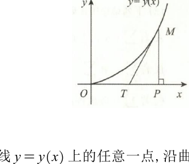

# 第七章 微分方程及其应用

> 题干与原始解法以提供的《880高数做题本》与《880数一解析》为基准；明显的公式、符号与转写问题结合原题 PDF 及解析逻辑校正。章末知识点与技巧总结为整理时补充。

## 基础题

### 选择题

<ExamQuestion>

1. 下列选项中（$C$ 为任意常数）是微分方程 $\frac{\mathrm{d}y}{\mathrm{d}x} + \frac{x}{y} = 0$ 的通解的是（ ）.

<ExamChoices>
<ExamOption>A. $x^2 + y^2 = C^2$</ExamOption>
<ExamOption>B. $x^2 - y^2 = C^2$</ExamOption>
<ExamOption>C. $x^2 + y^2 = C$</ExamOption>
<ExamOption>D. $x^2 - y^2 = C$</ExamOption>
</ExamChoices>

<ExamSolution>

<ExamAnswer>A</ExamAnswer>

<ExamExplanation>
**解析：** $\frac{\mathrm{d}y}{\mathrm{d}x}+\frac{x}{y}=0$ 为可分离变量方程,故 $y\mathrm{d}y+x\mathrm{d}x=0$,积分得 $x^2+y^2=C_1, C_1\geqslant 0$,即 $x^2+y^2=C^2$,故选 A.
</ExamExplanation>

</ExamSolution>

</ExamQuestion>

<ExamQuestion>

2. 设 $y' + P(x)y = 0$ 的一个特解为 $y = \cos 2x$，则该方程满足 $y(0) = 2$ 的特解为（ ）.

<ExamChoices>
<ExamOption>A. $2\cos x$</ExamOption>
<ExamOption>B. $2\cos 2x$</ExamOption>
<ExamOption>C. $\cos 2x$</ExamOption>
<ExamOption>D. $\cos 2x + 1$</ExamOption>
</ExamChoices>

<ExamSolution>

<ExamAnswer>B</ExamAnswer>

<ExamExplanation>
**解析：** 将 $y=\cos 2x$ 代入 $y^{\prime}+P(x)y=0$,解得 $P(x)=2\tan 2x$,故
$$y^{\prime}+(2\tan 2x)y=0,$$
解此一阶线性齐次微分方程,得 $y=Ce^{-\int P(x)\mathrm{d}x}=Ce^{-\int 2\tan 2x\mathrm{d}x}=C\cos 2x$.
由 $y(0)=2$,得 $C=2$,故 $y=2\cos 2x$,选项 B 正确.
</ExamExplanation>

</ExamSolution>

</ExamQuestion>

<ExamQuestion>

3. 微分方程 $y'' + 2y' - 3y = e^{-x} + x$ 的一个特解形式为（ ）.

<ExamChoices>
<ExamOption>A. $ae^{-x} + bx + c$</ExamOption>
<ExamOption>B. $axe^{-x} + x(bx + c)$</ExamOption>
<ExamOption>C. $axe^{-x} + bx + c$</ExamOption>
<ExamOption>D. $ae^x + x(bx + c)$</ExamOption>
</ExamChoices>

<ExamSolution>

<ExamAnswer>A</ExamAnswer>

<ExamExplanation>
**解析：** $y^{\prime\prime}+2y^{\prime}-3y=e^{-x}+x$ 的特解为两个微分方程 $y^{\prime\prime}+2y^{\prime}-3y=e^{-x}$ 与 $y^{\prime\prime}+2y^{\prime}-3y=x\cdot e^{0\cdot x}$ 的两个特解之和.
特征方程为 $r^2+2r-3=0$,得 $r_1=1, r_2=-3$, $\lambda=-1$ 与 $\lambda=0$ 均不是特征根,故 $y^{\prime\prime}+2y^{\prime}-3y=e^{-x}$ 有形如 $ae^{-x}$ 的特解, $y^{\prime\prime}+2y^{\prime}-3y=x$ 有形如 $bx+c$ 的特解,所以原方程的特解形式为 $ae^{-x}+bx+c$,选项 A 正确.
</ExamExplanation>

</ExamSolution>

</ExamQuestion>

<ExamQuestion>

4. 设 $y_1(x), y_2(x)$ 是 $y' + P(x)y = 0$ 的两个不同特解，其中 $P(x)$ 在 $(-\infty, +\infty)$ 内连续，且 $P(x)$ 不恒为 $0$，则下列结论中错误的是（ ）.

<ExamChoices>
<ExamOption>A. $y_1(x) - y_2(x) = \text{常数}$</ExamOption>
<ExamOption>B. $C[y_1(x) - y_2(x)]$ 是方程的通解</ExamOption>
<ExamOption>C. $y_1(x) - y_2(x)$ 在任一点不为 $0$</ExamOption>
<ExamOption>D. $\frac{y_2(x)}{y_1(x)} \equiv \text{常数}$ ($y_1(x) \neq 0$)</ExamOption>
</ExamChoices>

<ExamSolution>

<ExamAnswer>A</ExamAnswer>

<ExamExplanation>
**解析：** 依题意, $y_1(x)-y_2(x)$ 是 $y^{\prime}+P(x)y=0$ 的解.
当 $P(x)$ 不恒为 $0$ 时,非零常数不可能是 $y^{\prime}+P(x)y=0$ 的解,故选 A.
选项 D 正确,因为 $y^{\prime}+P(x)y=0$ 的通解为 $y=Ce^{-\int P(x)\mathrm{d}x}$,所以任意两个解相差一个常数因子.
选项 C 正确,因 $y^{\prime}+P(x)y=0$ 两个不同的解不能满足相同的初始条件.
事实上,假设存在 $x_0$,使得 $y_1(x_0)=y_2(x_0)$,令 $y_0(x)=y_1(x)-y_2(x)$,则 $y_0(x)$ 是该方程的解,且满足初始条件 $y_0(x_0)=0$,根据微分方程解的存在唯一性定理,知 $y_0(x)$ 恒为零,故 $y_1(x)=y_2(x)$,与已知条件矛盾.
</ExamExplanation>

</ExamSolution>

</ExamQuestion>

<ExamQuestion>

5. 设 $y_1(x), y_2(x), y_3(x)$ 是微分方程 $y'' + p(x)y' + q(x)y = f(x)$ 的三个线性无关的解，$f(x) \neq 0$，则该方程的通解为（ ）.

<ExamChoices>
<ExamOption>A. $C_1 y_1(x) + C_2 y_2(x) + y_3(x)$</ExamOption>
<ExamOption>B. $C_1 y_1(x) + (1 - 2C_1) y_2(x) + C_1 y_3(x)$</ExamOption>
<ExamOption>C. $(C_1 - C_2) y_1(x) + C_2 y_2(x) + y_3(x)$</ExamOption>
<ExamOption>D. $C_1 y_1(x) + C_2 y_2(x) + C_3 y_3(x)$ ($C_1 + C_2 + C_3 = 1$)</ExamOption>
</ExamChoices>

<ExamSolution>

<ExamAnswer>D</ExamAnswer>

<ExamExplanation>
**解析：** 由线性微分方程性质和结构,该方程的通解为
$$C_1[y_1(x)-y_3(x)]+C_2[y_2(x)-y_3(x)]+y_3(x),$$
即
$$C_1 y_1(x)+C_2 y_2(x)+(1-C_1-C_2)y_3(x).$$
令 $C_3=1-C_1-C_2$,则 $C_1+C_2+C_3=1$,故选 D.
</ExamExplanation>

</ExamSolution>

</ExamQuestion>

<ExamQuestion>

6. 设 $y_1 = e^{-x}, y_2 = 2x$ 是常系数齐次线性微分方程 $y''' + ay'' + by' + cy = 0$ 的两个解，则该方程的通解是（ ）.

<ExamChoices>
<ExamOption>A. $C_1 e^{-x} + C_2 + C_3 x$</ExamOption>
<ExamOption>B. $C_1 e^{-x} + C_2 e^x + C_3 x$</ExamOption>
<ExamOption>C. $C_1 e^{-x} + C_2 e^x + C_3$</ExamOption>
<ExamOption>D. $C_1 e^{-x} + C_2 x e^x + C_3$</ExamOption>
</ExamChoices>

<ExamSolution>

<ExamAnswer>A</ExamAnswer>

<ExamExplanation>
**解析：** 由 $y_1=e^{-x}$ 为方程的解,知 $r_1=-1$ 是该方程的一个特征根.
又 $y_2=2x$ 为方程的解,代入方程,有 $0+0+b\cdot 2+c\cdot 2x=0$,即 $b+cx=0$. 故 $c=0, b=0$.
由特征方程 $r^3+ar^2+br+c=r^3+ar^2=0$ 有特征根 $-1$,得 $a=1$,即 $r^3+r^2=0$,可解得 $r_2=r_3=0$.
故通解为 $C_1 e^{-x}+C_2 e^{0x}+C_3 x e^{0x}=C_1 e^{-x}+C_2+C_3 x$.
选项 A 正确.
</ExamExplanation>

</ExamSolution>

</ExamQuestion>

<ExamQuestion>

7. 设 $f(x)$ 在 $[0, +\infty)$ 上可导，$\lim_{x\to+\infty} f(x) = b$ ($b \neq 0$)，$y(x)$ 为方程 $y' + ay = f(x)$ ($a > 0$) 的任一解，则 $y = y(x)$ 有水平渐近线 (　　).

<ExamChoices>
<ExamOption>A. $y = ab$</ExamOption>
<ExamOption>B. $y = -ab$</ExamOption>
<ExamOption>C. $y = \frac{b}{a}$</ExamOption>
<ExamOption>D. $y = \frac{a}{b}$</ExamOption>
</ExamChoices>

<ExamSolution>

<ExamAnswer>C</ExamAnswer>

<ExamExplanation>
**解析：** 因 $y^{\prime}+ay=f(x)$ 的通解为 $y=e^{-ax}\left[\int_0^x f(t)e^{at}\mathrm{d}t+C\right]$, 故
$$\lim_{x\to +\infty}y(x)=\lim_{x\to +\infty}\left[Ce^{-ax}+e^{-ax}\int_0^x f(t)e^{at}\mathrm{d}t\right]$$

$$
\begin{aligned}
&= 0 + \lim_{x \to +\infty} \frac{\int_{0}^{x} f(t)e^{at} \, dt}{e^{ax}} \\
&= \lim_{x \to +\infty} \frac{f(x)e^{ax}}{ae^{ax}} = \frac{b}{a}.
\end{aligned}
$$

所以 $y = y(x)$ 有水平渐近线 $y = \frac{b}{a}$．选项 C 正确．
</ExamExplanation>

</ExamSolution>

</ExamQuestion>

### 填空题

<ExamQuestion>

1. 微分方程 $(1+y^2)\mathrm{d}x + (2x-1)y\mathrm{d}y = 0$ 的通解为 $\underline{\quad\quad\quad}$ .

<ExamSolution>

<ExamAnswer>$(2x - 1)(1 + y^2) = C$ ($C$ 为任意常数)．</ExamAnswer>

<ExamExplanation>
**解析：** 原方程可化为可分离变量方程 $\frac{dx}{2x - 1} + \frac{y \\mathrm{d}y}{1 + y^2} = 0$，积分可得
$$\frac{1}{2}\ln|2x - 1| + \frac{1}{2}\ln(1 + y^2) = \frac{1}{2}\ln C,$$
故通解为 $(2x - 1)(1 + y^2) = C$ ($C$ 为任意常数)．
</ExamExplanation>

</ExamSolution>

</ExamQuestion>

<ExamQuestion>

2. $y' = \frac{y}{x} + \tan\frac{y}{x}$ 满足 $y(1) = \frac{\pi}{6}$ 的特解为 $\underline{\quad\quad\quad}$ .

<ExamSolution>

<ExamAnswer>$\sin \frac{y}{x} = \frac{1}{2}x$</ExamAnswer>

<ExamExplanation>
**解析：** 原方程为齐次微分方程，令 $u = \frac{y}{x}$，即 $y = ux$，则
$$\frac{dy}{dx} = u + x \cdot \frac{du}{dx} = u + \tan u.$$

分离变量得 $\cot u \, du = \frac{dx}{x}$，积分得 $\ln|\sin u| = \ln|x| + C_1$，故
$$\sin u = \pm e^{C_1} \cdot x = Cx \, (C \neq 0),$$
即 $\sin \frac{y}{x} = Cx \, (C \neq 0)$．

又 $y = 0$ 也是原方程的解 ($y = 0$ 在分离变量过程中漏掉了)，故上面常数也可以为零，则原方程的通解为 $\sin \frac{y}{x} = Cx$ ($C$ 为任意常数)．

由 $y(1) = \frac{\pi}{6}$，得 $C = \frac{1}{2}$，故所求特解为 $\sin \frac{y}{x} = \frac{1}{2}x$．
</ExamExplanation>

</ExamSolution>

</ExamQuestion>

<ExamQuestion>

3. 微分方程 $y' - 6\frac{y}{x} + xy^2 = 0$ ($y$ 不为常函数) 的通解为 $\underline{\quad\quad\quad}$ .

<ExamSolution>

<ExamAnswer>$\frac{1}{y} = \frac{C}{x^6} + \frac{x^2}{8}$ ($C$ 为任意常数)．</ExamAnswer>

<ExamExplanation>
**解析：** 方程变形为 $y' - \frac{6}{x}y = -xy^2$，为 $n = 2$ 的伯努利方程．

令 $y^{-1} = z$，则 $\frac{dz}{dx} = -y^{-2}\frac{dy}{dx}$，代入原方程，得 $\frac{dz}{dx} + \frac{6}{x}z = x$，为一阶线性微分方程，解得 $z = \frac{C}{x^6} + \frac{x^2}{8}$，
即 $\frac{1}{y} = \frac{C}{x^6} + \frac{x^2}{8}$ 为通解，其中 $C$ 为任意常数．
</ExamExplanation>

</ExamSolution>

</ExamQuestion>

<ExamQuestion>

4. 微分方程 $\left(1+\mathrm{e}^{\frac{x}{y}}\right)\mathrm{d}x + \mathrm{e}^{\frac{x}{y}}\left(1-\frac{x}{y}\right)\mathrm{d}y = 0$ ($y>0$) 的通解为 $\underline{\quad\quad\quad}$ .

<ExamSolution>

<ExamAnswer>$x + ye^{\frac{x}{y}} = C$ ($C$ 为任意常数)．</ExamAnswer>

<ExamExplanation>
**解析：** 令 $P = 1 + e^{\frac{x}{y}}, Q = e^{\frac{x}{y}}\left(1 - \frac{x}{y}\right)$，则 $\frac{\partial P}{\partial y} = e^{\frac{x}{y}} \cdot \left(-\frac{x}{y^2}\right)$，$\frac{\partial Q}{\partial x} = e^{\frac{x}{y}}\left(-\frac{x}{y^2}\right)$，故 $\frac{\partial Q}{\partial x} = \frac{\partial P}{\partial y}$，原方程为全微分方程．通过凑微分法，求通解．

原方程变形为
$$dx + e^{\frac{x}{y}}dy + e^{\frac{x}{y}}\left(\frac{y \\mathrm{d}x - x \\mathrm{d}y}{y}\right) = 0,$$
即
$$dx + e^{\frac{x}{y}}dy + ye^{\frac{x}{y}}\left(\frac{y \\mathrm{d}x - x \\mathrm{d}y}{y^2}\right) = 0,$$
故
$$dx + e^{\frac{x}{y}}dy + ye^{\frac{x}{y}}d\left(\frac{x}{y}\right) = 0,$$
也即
$$dx + e^{\frac{x}{y}}dy + yd(e^{\frac{x}{y}}) = 0,$$
故
$$d\left(x + ye^{\frac{x}{y}}\right) = 0,$$
所以原方程的通解为 $x + ye^{\frac{x}{y}} = C$ ($C$ 为任意常数)．

**注：** 求全微分方程 $P(x, y)\mathrm{d}x + Q(x, y)\mathrm{d}y = 0$ 共有三种方法：
① 利用公式，$u(x, y) = \int_{x_0}^{x} P(x, y_0)\mathrm{d}x + \int_{y_0}^{y} Q(x, y)\mathrm{d}y = C$。
② 凑微分。
③ 利用积分，由 $\mathrm{d}u(x, y) = P(x, y)\mathrm{d}x + Q(x, y)\mathrm{d}y$，知 $\frac{\partial u}{\partial x} = P(x, y)$，$\frac{\partial u}{\partial y} = Q(x, y)$，通过积分求出 $u(x, y)$，则通解为 $u(x, y) = C$。
如本题，由 $\frac{\partial u}{\partial x} = 1 + e^{\frac{x}{y}}$，$\frac{\partial u}{\partial y} = e^{\frac{x}{y}}\left(1 - \frac{x}{y}\right)$，积分得
$$u = \int \left(1 + e^{\frac{x}{y}}\right)\mathrm{d}x + \varphi(y) = x + y e^{\frac{x}{y}} + \varphi(y)$$
又
$$\frac{\partial u}{\partial y} = e^{\frac{x}{y}} - \frac{x}{y} e^{\frac{x}{y}} + \varphi'(y) = e^{\frac{x}{y}}\left(1 - \frac{x}{y}\right)$$
故 $\varphi'(y) = 0$，所以 $\varphi(y) = C_1$，于是 $u(x, y) = x + y e^{\frac{x}{y}} + C_1$，所以通解为
$$u(x, y) = x + y e^{\frac{x}{y}} = C (C\text{为任意常数})$$
</ExamExplanation>

</ExamSolution>

</ExamQuestion>

<ExamQuestion>

5. 微分方程 $xy' = \sqrt{x^2+y^2} + y$ 的通解为 $\underline{\quad\quad\quad}$ .

<ExamSolution>

<ExamAnswer>$y + \sqrt{x^2 + y^2} = C x^2 (x > 0)$ 和 $-y + \sqrt{x^2 + y^2} = C (x < 0)$，其中 $C$ 为大于 $0$ 的常数</ExamAnswer>

<ExamExplanation>
**解析：** 方程变形为 $y' = \frac{\sqrt{x^2 + y^2}}{x} + \frac{y}{x}$。

当 $x > 0$ 时，方程化为 $y' = \sqrt{1 + \left(\frac{y}{x}\right)^2} + \frac{y}{x}$；

当 $x < 0$ 时，方程化为 $y' = -\sqrt{1 + \left(\frac{y}{x}\right)^2} + \frac{y}{x}$。

令 $\frac{y}{x} = u$，则 $\frac{\mathrm{d}y}{\mathrm{d}x} = u + x \frac{\mathrm{d}u}{\mathrm{d}x}$，方程变为 $\frac{\mathrm{d}u}{\sqrt{1 + u^2}} = \pm \frac{\mathrm{d}x}{x}$ 两种情形，积分可得 $y + \sqrt{x^2 + y^2} = C x^2 (x > 0)$ 和 $-y + \sqrt{x^2 + y^2} = C (x < 0)$，为原方程通解，其中 $C$ 为大于 $0$ 的常数。
</ExamExplanation>

</ExamSolution>

</ExamQuestion>

<ExamQuestion>

6. 方程 $y'' + 2y' + y = xe^x$ 满足 $y(0) = 0, y'(0) = 0$ 的特解为 $\underline{\quad\quad\quad}$ .

<ExamSolution>

<ExamAnswer>$y = \frac{1}{4} [(x + 1) e^{-x} + (x - 1) e^x]$</ExamAnswer>

<ExamExplanation>
**解析：** 特征方程为 $r^2 + 2r + 1 = 0$，$r_1 = r_2 = -1$，故对应齐次微分方程的通解为
$$y = C_1 e^{-x} + C_2 x e^{-x}$$
由非齐次项 $e^x$，知 $\lambda = 1$ 不是特征根，故令特解为 $y^* = (ax + b) e^x$，将 $y^*$ 代入原方程，比较系数得 $a = \frac{1}{4}, b = -\frac{1}{4}$，故通解为 $y = C_1 e^{-x} + C_2 x e^{-x} + \frac{1}{4} (x - 1) e^x$。

由 $y(0) = 0, y'(0) = 0$，得 $C_1 = \frac{1}{4}, C_2 = \frac{1}{4}$，故所求特解为
$$y = \frac{1}{4} [(x + 1) e^{-x} + (x - 1) e^x]$$
</ExamExplanation>

</ExamSolution>

</ExamQuestion>

<ExamQuestion>

7. 方程 $y'' - 3y' + 2y = 10\mathrm{e}^{-x}\sin x$ 满足当 $x\to+\infty$ 时，$y(x)\to0$ 的特解为 $\underline{\quad\quad\quad}$ .

<ExamSolution>

<ExamAnswer>$y = e^{-x} (\sin x + \cos x)$</ExamAnswer>

<ExamExplanation>
**解析：** 特征方程 $r^2 - 3r + 2 = 0$ 的特征根为 $r_1 = 1, r_2 = 2$，故对应的齐次微分方程的通解为 $y = C_1 e^x + C_2 e^{2x}$。

由非齐次项 $10 e^{-x} \sin x$，知 $-1 \pm \mathrm{i}$ 不是特征根，故令原方程的特解为 $y^* = e^{-x} (A \sin x + B \cos x)$，将其代入原方程，可解得 $A = B = 1$，所以原方程的通解为
$$y = C_1 e^x + C_2 e^{2x} + e^{-x} (\sin x + \cos x)$$
当 $x \to +\infty$ 时，$y(x) \to 0$，而 $e^x \to +\infty$，$e^{2x} \to +\infty$，因此有 $C_1 = C_2 = 0$，故所求特解为 $y = e^{-x} (\sin x + \cos x)$。
</ExamExplanation>

</ExamSolution>

</ExamQuestion>

<ExamQuestion>

8. 方程 $(1-x^2)y'' - xy' = 0$ 满足 $y(0) = 0, y'(0) = 1$ 的特解为 $\underline{\quad\quad\quad}$ .

<ExamSolution>

<ExamAnswer>$y = \arcsin x (-1 < x < 1)$</ExamAnswer>

<ExamExplanation>
**解析：** 已知方程为不显含 $y$ 的可降阶方程，令 $y' = p$，则 $y'' = p'$，原方程变为 $(1 - x^2) p' - xp = 0$，即

$p' - \frac{x}{1-x^2}p = 0 \, (x \neq \pm 1)$, 为一阶线性微分方程, 有 $p = C_1 e^{\int \frac{x}{1-x^2} \mathrm{d}x}$, 即 $p = C_1 e^{-\frac{1}{2}\ln(1-x^2)} = \frac{C_1}{\sqrt{1-x^2}}$.

由 $p(0) = y'(0) = 1$, 得 $C_1 = 1$, 故 $y = \int p(x) \mathrm{d}x = \int \frac{\mathrm{d}x}{\sqrt{1-x^2}} = \arcsin x + C_2$.

又由 $y(0) = 0$, 得 $C_2 = 0$, 所以 $y = \arcsin x \, (-1 < x < 1)$.

**注：** $\int \frac{x}{1-x^2}\mathrm{d}x = -\frac{1}{2}\ln|1-x^2|+C$, 由已知 $y(0)=0, y'(0)=1$, 意味着在 $(-1,1)$ 内求解, 故 $\int \frac{x}{1-x^2}\mathrm{d}x = -\frac{1}{2}\ln(1-x^2)+C$.
</ExamExplanation>

</ExamSolution>

</ExamQuestion>

<ExamQuestion>

9. 欧拉方程 $x^2y'' - xy' + y = 0$ ($x>0$) 满足 $y(1) = 1, y'(1) = 1$ 的解 $y(x) = \underline{\quad\quad\quad}$ .

<ExamSolution>

<ExamAnswer>$x(x > 0)$</ExamAnswer>

<ExamExplanation>
**解析：** 令 $x = e^t$, 则 $t = \ln x \, (x > 0)$.

将 $\frac{\mathrm{d}y}{\mathrm{d}x} = \frac{\mathrm{d}y}{\mathrm{d}t} \cdot \frac{\mathrm{d}t}{\mathrm{d}x} = \frac{1}{x} \cdot \frac{\mathrm{d}y}{\mathrm{d}t}$, 即 $x\frac{\mathrm{d}y}{\mathrm{d}x} = \frac{\mathrm{d}y}{\mathrm{d}t}$, 以及 $\frac{\mathrm{d}^2y}{\mathrm{d}x^2} = \frac{1}{x^2}\left(\frac{\mathrm{d}^2y}{\mathrm{d}t^2} - \frac{\mathrm{d}y}{\mathrm{d}t}\right)$, 即 $x^2\frac{\mathrm{d}^2y}{\mathrm{d}x^2} = \frac{\mathrm{d}^2y}{\mathrm{d}t^2} - \frac{\mathrm{d}y}{\mathrm{d}t}$ 代入 $x^2y'' - xy' + y = 0$, 得

$$\frac{\mathrm{d}^2y}{\mathrm{d}t^2} - 2\frac{\mathrm{d}y}{\mathrm{d}t} + y = 0,$$

解得 $y = C_1 e^t + C_2 t e^t = C_1 x + C_2 x \ln x \, (x > 0), C_1, C_2$ 为任意常数.

由 $y(1) = 1, y'(1) = 1$, 得 $c_1 = 1, c_2 = 0$.

故 $y(x) = x \, (x > 0)$.
</ExamExplanation>

</ExamSolution>

</ExamQuestion>

<ExamQuestion>

10. 设二阶线性非齐次微分方程 $y'' + p(x)y' + q(x)y = f(x)$ 有三个特解为 $x, \mathrm{e}^x, \mathrm{e}^{-x}$，则该方程的通解为 $\underline{\qquad\qquad\qquad}$。

<ExamSolution>

<ExamAnswer>$y = C_1(e^x - x) + C_2(e^{-x} - x) + x \, (C_1, C_2$ 为任意常数 $)$</ExamAnswer>

<ExamExplanation>
**解析：** 由线性微分方程解的性质及通解结构, 知 $y_1 = e^x - x, y_2 = e^{-x} - x$ 是对应齐次微分方程的两个线性无关的解, 故通解为 $y = C_1(e^x - x) + C_2(e^{-x} - x) + x \, (C_1, C_2$ 为任意常数 $)$.
</ExamExplanation>

</ExamSolution>

</ExamQuestion>

<ExamQuestion>

11. 设二阶常系数线性微分方程 $y'' + ay' + by = c\mathrm{e}^x$ 有特解 $y^* = \mathrm{e}^{-x}(1 + x\mathrm{e}^{2x})$，则该方程的通解为 $\underline{\qquad\qquad\qquad\qquad}$。

<ExamSolution>

<ExamAnswer>$y = C_1 e^{-x} + C_2 e^x + x e^x \, (C_1, C_2$ 为任意常数 $)$</ExamAnswer>

<ExamExplanation>
**解析：** 由特解 $y^* = e^{-x}(1 + x e^{2x}) = e^{-x} + x e^x$, 知该方程对应的齐次微分方程有特征根 $r_1 = -1, r_2 = 1$, 且 $x e^x$ 是其特解, 故该方程的通解为 $y = C_1 e^{-x} + C_2 e^x + x e^x \, (C_1, C_2$ 为任意常数 $)$.
</ExamExplanation>

</ExamSolution>

</ExamQuestion>

### 解答题

<ExamQuestion>

1. 求 $x^2 y'' - {y'}^2 = 0$ 过点 $P(1, 0)$，且在点 $P$ 与 $y = x - 1$ 相切的积分曲线。

<ExamSolution>

<ExamAnswer>见解析</ExamAnswer>

<ExamExplanation>
**解析：** 依题设, 有 $y(1) = 0, y'(1) = 1$.

方程 $x^2 y'' - y'^2 = 0$ 不显含 $y$, 令 $y' = p, y'' = p'$, 代入原方程, 得 $x^2 p' - p^2 = 0$, 分离变量并积分, 得

$$\frac{1}{p} = \frac{1}{x} + C_1.$$

由 $y'(1) = 1$, 得 $C_1 = 0$, 故 $p = \frac{\mathrm{d}y}{\mathrm{d}x} = x$, 积分得 $y = \frac{1}{2}x^2 + C_2$.

又由 $y(1) = 0$, 得 $C_2 = -\frac{1}{2}$, 故所求积分曲线为 $y = \frac{1}{2}(x^2 - 1)$.
</ExamExplanation>

</ExamSolution>

</ExamQuestion>

<ExamQuestion>

2. 求微分方程 $(x\cos y + \cos x)\dfrac{\mathrm{d}y}{\mathrm{d}x} - y\sin x + \sin y = 0$ 的通解。

<ExamSolution>

<ExamAnswer>见解析</ExamAnswer>

<ExamExplanation>
**解析：** 方程变形为 $(\sin y - y \sin x)\mathrm{d}x + (x \cos y + \cos x)\mathrm{d}y = 0$. 记

$P = \sin y - y \sin x$, $Q = x \cos y + \cos x$,

则有 $\frac{\partial Q}{\partial x} = \frac{\partial P}{\partial y} = \cos y - \sin x$, 故为全微分方程.

由

$$\frac{\partial u}{\partial x} = P(x, y) = \sin y - y \sin x, \quad \frac{\partial u}{\partial y} = Q(x, y) = x \cos y + \cos x,$$

积分, 得

$$
\begin{aligned}
u(x, y) &= \int \frac{\partial u}{\partial x}\mathrm{d}x + \varphi(y) = \int (\sin y - y \sin x)\mathrm{d}x + \varphi(y) \\
&= x \sin y + y \cos x + \varphi(y).
\end{aligned}
$$

由

$$\frac{\partial u}{\partial y} = x \cos y + \cos x + \varphi'(y) = x \cos y + \cos x,$$

得 $\varphi'(y) = 0$, 从而 $\varphi(y) = C_1$, 所以 $u(x, y) = x \sin y + y \cos x + C_1$, 故原方程的通解为 $x \sin y + y \cos x = C$.
</ExamExplanation>

</ExamSolution>

</ExamQuestion>

<ExamQuestion>

3. 设 $f(x)$ 是连续函数，且 $f(x) = \cos x - \int_0^x (x - t)f(t)\mathrm{d}t$，求 $f(x)$。

<ExamSolution>

<ExamAnswer>见解析</ExamAnswer>

<ExamExplanation>
**解析：** 已知等式变形为 $f(x) = \cos x - x \int_0^x f(t)\\mathrm{d}t + \int_0^x tf(t)\\mathrm{d}t$，两边同时对 $x$ 求导，得
$$f'(x) = -\sin x - \int_0^x f(t)\\mathrm{d}t - xf(x) + xf(x) = -\sin x - \int_0^x f(t)\\mathrm{d}t, \quad (1)$$
再对 $x$ 求导，得
$$f''(x) + f(x) = -\cos x. \quad (2)$$
对应齐次方程的特征方程为 $r^2 + 1 = 0$，得 $r = \pm \mathrm{i}$，故齐次方程的通解为
$$f(x) = C_1 \cos x + C_2 \sin x.$$
由非齐次项 $-\cos x$，知 $0 \pm \mathrm{i}$ 是特征根，故令特解为 $f^* = x(A \cos x + B \sin x)$，将其代入 $(2)$ 式，得 $A = 0, B = -\frac{1}{2}$，所以 $(2)$ 式的通解为 $f(x) = C_1 \cos x + C_2 \sin x - \frac{1}{2}x \sin x$。
又由已知等式及 $(1)$ 式，知 $f(0) = 1, f'(0) = 0$，故得 $C_1 = 1, C_2 = 0$，所以
$$f(x) = \cos x - \frac{1}{2}x \sin x.$$
</ExamExplanation>

</ExamSolution>

</ExamQuestion>

<ExamQuestion>

4. 设 $f(x)$ 可导，对任何实数 $x$，$y$ 满足 $f(x + y) = \mathrm{e}^x f(y) + \mathrm{e}^y f(x)$，且 $f'(0) = \mathrm{e}$，求 $f(x)$。

<ExamSolution>

<ExamAnswer>见解析</ExamAnswer>

<ExamExplanation>
**解析：** 由已知条件有 $f(0) = 0$，由导数定义有
$$f'(x) = \lim_{\Delta x \to 0} \frac{f(x + \Delta x) - f(x)}{\Delta x} = \lim_{\Delta x \to 0} \frac{e^x f(\Delta x) + f(x)(e^{\Delta x} - 1)}{\Delta x}$$
$$= \lim_{\Delta x \to 0} e^x \cdot \frac{f(\Delta x) - f(0)}{\Delta x} + \lim_{\Delta x \to 0} f(x) \cdot \frac{e^{\Delta x} - 1}{\Delta x}$$
$$= e^x f'(0) + f(x) = e^{x+1} + f(x),$$
即 $f'(x) - f(x) = e^{x+1}$，为一阶线性微分方程，故 $f(x) = e^{\int \\mathrm{d}x} \left[ \int e^{x+1} e^{-\int \\mathrm{d}x} \\mathrm{d}x + C \right] = x e^{x+1} + C e^x$。
又由 $f(0) = 0$，得 $C = 0$，所以 $f(x) = x e^{x+1}$。
</ExamExplanation>

</ExamSolution>

</ExamQuestion>

<ExamQuestion>

5. 求微分方程 $y'' + \dfrac{1}{2}{y'}^2 = 2y$ 满足 $y(0) = y'(0) = 2$ 的特解。

<ExamSolution>

<ExamAnswer>见解析</ExamAnswer>

<ExamExplanation>
**解析：** 已知方程为不显含 $x$ 的可降阶的二阶方程。
令 $y' = p$，则 $y'' = \frac{\mathrm{d}p}{\mathrm{d}y} \cdot \frac{\mathrm{d}y}{\mathrm{d}x} = p \frac{\mathrm{d}p}{\mathrm{d}y}$，代入原方程，得 $p \frac{\mathrm{d}p}{\mathrm{d}y} + \frac{1}{2} p^2 = 2y$，即 $\frac{\mathrm{d}(p^2)}{\mathrm{d}y} + p^2 = 4y$，是关于 $p^2$ 的一阶线性微分方程，其通解为
$$p^2 = e^{-\int \\mathrm{d}y} \left( \int 4y e^{\int \\mathrm{d}y} \\mathrm{d}y + C_1 \right) = e^{-y} \left( \int 4y e^y \\mathrm{d}y + C_1 \right)$$
$$= e^{-y}(4y e^y - 4e^y + C_1) = 4(y - 1) + C_1 e^{-y}.$$
由 $y(0) = 2, y'(0) = 2$，得 $C_1 = 0$，故 $p^2 = 4(y - 1)$，$p = \pm 2\sqrt{y - 1}$。取 $p = 2\sqrt{y - 1}$（因 $y'(0) = 2 > 0$），故 $\frac{\mathrm{d}y}{\mathrm{d}x} = 2\sqrt{y - 1}$，分离变量，得 $\frac{\mathrm{d}y}{\sqrt{y - 1}} = 2\mathrm{d}x$，积分得
$$\sqrt{y - 1} = x + C_2,$$
即 $y = (x + C_2)^2 + 1$。又由 $y'(0) = 2$，得 $C_2 = 1$，所求特解为 $y = (x + 1)^2 + 1$。
</ExamExplanation>

</ExamSolution>

</ExamQuestion>

<ExamQuestion>

6. 求微分方程 $y''' - y' = 0$ 的一条积分曲线，使此积分曲线在原点处有拐点，且以直线 $y = 2x$ 为切线。

<ExamSolution>

<ExamAnswer>见解析</ExamAnswer>

<ExamExplanation>
**解析：** 依题意，$y(0) = 0, y'(0) = 2, y''(0) = 0$。
$y''' - y' = 0$ 的特征方程为 $r^3 - r = 0$，得特征根为 $r_1 = 0, r_2 = 1, r_3 = -1$，故微分方程的通解为 $y = C_1 + C_2 e^x + C_3 e^{-x}$，故
$$y' = C_2 e^x - C_3 e^{-x}, \quad y'' = C_2 e^x + C_3 e^{-x}.$$
代入初始条件 $y(0) = 0, y'(0) = 2, y''(0) = 0$，得
$$C_1 + C_2 + C_3 = 0, \quad C_2 - C_3 = 2, \quad C_2 + C_3 = 0,$$
解得 $C_1 = 0, C_2 = 1, C_3 = -1$，故所求积分曲线为 $y = e^x - e^{-x}$。
</ExamExplanation>

</ExamSolution>

</ExamQuestion>

<ExamQuestion>

7. 设 $f(u)$ 有二阶连续导数，$z = f(\sqrt{x^2 + y^2})$ 满足 $\dfrac{\partial^2 z}{\partial x^2} + \dfrac{\partial^2 z}{\partial y^2} = x^2 + y^2$，求 $z$ 的表达式。

<ExamSolution>

<ExamAnswer>见解析</ExamAnswer>

<ExamExplanation>
**解析：** 令 $\sqrt{x^2 + y^2} = u$，则
```math
\frac{\partial z}{\partial x} = \frac{x}{u} f'(u), \quad \frac{\partial^2 z}{\partial x^2} = \frac{u - \frac{x^2}{u}}{u^2} f'(u) + \frac{x^2}{u^2} f''(u) = \frac{y^2}{u^3} f'(u) + \frac{x^2}{u^2} f''(u).
```
由 $z = f(\sqrt{x^2 + y^2})$ 关于 $x, y$ 具有轮换对称性，知 $\frac{\partial^2 z}{\partial y^2} = \frac{x^2}{u^3} f'(u) + \frac{y^2}{u^2} f''(u)$，将其代入 $\frac{\partial^2 z}{\partial x^2} + \frac{\partial^2 z}{\partial y^2} = x^2 + y^2$，得 $f''(u) + \frac{1}{u} f'(u) = u^2$，即 $u f''(u) + f'(u) = u^3$，$[u f'(u)]' = u^3$，积分得 $u f'(u) = \frac{1}{4}u^4 +$

$C_1$, 故 $f'(u) = \frac{1}{4}u^3 + \frac{C_1}{u}$, 积分得 $f(u) = \frac{1}{16}u^4 + C_1\ln u + C_2$, 故
```math
z = \frac{1}{16}(x^2+y^2)^2 + C_1\ln\sqrt{x^2+y^2} + C_2 \quad (C_1, C_2 \text{为任意常数}).
```
</ExamExplanation>

</ExamSolution>

</ExamQuestion>

<ExamQuestion>

8. 设 $f(u)$ 在 $(0, +\infty)$ 内具有二阶导数，$z = xf\left(\dfrac{y}{x}\right) + yf\left(\dfrac{y}{x}\right)$ 满足
```math
x \dfrac{\partial^2 z}{\partial x \partial y} + 2y \dfrac{\partial^2 z}{\partial y^2} = \dfrac{y}{x}, z(x, x) = x, \left.\dfrac{\partial z}{\partial x}\right|_{(x, x)} = -\dfrac{3}{2}.
```
求 $f(u)$。

<ExamSolution>

<ExamAnswer>见解析</ExamAnswer>

<ExamExplanation>
**解析：** 由 $z = xf\left(\frac{y}{x}\right) + yf\left(\frac{y}{x}\right)$, 可求得
```math
\begin{aligned}
\frac{\partial z}{\partial x} &= f\left(\frac{y}{x}\right) - \frac{y}{x}f'\left(\frac{y}{x}\right) - \frac{y^2}{x^2}f'\left(\frac{y}{x}\right), \\
\frac{\partial z}{\partial y} &= f'\left(\frac{y}{x}\right) + f\left(\frac{y}{x}\right) + \frac{y}{x}f'\left(\frac{y}{x}\right), \\
\frac{\partial^2 z}{\partial x \partial y} &= -\frac{y}{x^2}f''\left(\frac{y}{x}\right) - \frac{2y}{x^2}f'\left(\frac{y}{x}\right) - \frac{y^2}{x^3}f''\left(\frac{y}{x}\right), \\
\frac{\partial^2 z}{\partial y^2} &= \frac{1}{x}f''\left(\frac{y}{x}\right) + \frac{2}{x}f'\left(\frac{y}{x}\right) + \frac{y}{x^2}f''\left(\frac{y}{x}\right).
\end{aligned}
```
令 $\frac{y}{x} = u, x\frac{\partial^2 z}{\partial x \partial y} + 2y\frac{\partial^2 z}{\partial y^2} = \frac{y}{x}$ 可化为
```math
f''(u)(u+u^2) + 2uf'(u) = u,
```
即 $f''(u) + \frac{2}{1+u}f'(u) = \frac{1}{1+u}$ 为可降阶的高阶微分方程。
令 $f'(u) = p$, 则 $f''(u) = p'$, 则有
```math
\begin{aligned}
p' + \frac{2}{1+u}p &= \frac{1}{1+u}, \\
p &= e^{-\int \frac{2}{1+u}du} \left( \int \frac{1}{1+u} e^{\int \frac{2}{1+u}du} du + C_1 \right) \\
&= \frac{1}{2} + C_1(1+u)^{-2},
\end{aligned}
```
由 $z(x, x) = xf\left(\frac{x}{x}\right) + xf\left(\frac{x}{x}\right) = 2xf(1) = x$, 知 $f(1) = \frac{1}{2}$。
由 $\left.\frac{\partial z}{\partial x}\right|_{(x,x)} = f(1) - 1\cdot f'(1) - f'(1) = f(1) - 2f'(1) = -\frac{3}{2}$,
得 $f'(1) = 1$。
故 $1 = \frac{1}{2} + C_1(1+1)^{-2}$, 得 $C_1 = 2$。
```math
p = f'(u) = \frac{1}{2} + 2(1+u)^{-2},
```
对上式积分得 $f(u) = \frac{1}{2}u - \frac{2}{1+u} + C_2$。
由 $f(1) = \frac{1}{2}$, 得 $C_2 = 1$。
故 $f(u) = \frac{1}{2}u - \frac{2}{1+u} + 1$。
</ExamExplanation>

</ExamSolution>

</ExamQuestion>

<ExamQuestion>

9. 设 $L$ 是一条平面曲线，其上任意一点 $P(x,y)(x>0)$ 到原点的距离恒等于该点处的切线在 $y$ 轴上的截距，且 $L$ 过点 $\left(\frac{1}{2},0\right)$。求：

($I$) 曲线 $L$ 的方程；

($II$) $L$ 位于第一象限部分的一条切线，使该切线与 $L$ 以及两坐标轴所围的面积最小。

<ExamSolution>

<ExamAnswer>见解析</ExamAnswer>

<ExamExplanation>
**解析：** (I) 依题设, 曲线 $L$ 过点 $P(x,y)$ 的切线为 $Y - y = y'(X - x)$, 令 $X = 0$, 则切线在 $y$ 轴上的截距为 $y - xy'$。
由已知, $\sqrt{x^2+y^2} = y - xy'$, 即 $y' = \frac{y - \sqrt{x^2+y^2}}{x}$。
由 $x > 0$, 知 $y' = \frac{y}{x} - \sqrt{1 + \left(\frac{y}{x}\right)^2}$ 为齐次微分方程。令 $\frac{y}{x} = u$, 则 $y' = u + xu'$, 得 $u + xu' = u -$
$\sqrt{1+u^2}$, 为可分离变量的微分方程, $\frac{du}{\sqrt{1+u^2}} = -\frac{dx}{x}$, 积分并代回 $\frac{y}{x} = u$, 得 $y + \sqrt{x^2+y^2} = C$。又 $L$ 过

点 $\left(\frac{1}{2}, 0\right)$, 得 $C = \frac{1}{2}$, 于是曲线 $L$ 的方程为 $y + \sqrt{x^2 + y^2} = \frac{1}{2}$, 即 $y = \frac{1}{4} - x^2$.

($\text{II}$) 在第一象限内, $y = \frac{1}{4} - x^2$ 在点 $P(x, y)$ 处的切线方程为 $Y - \left(\frac{1}{4} - x^2\right) = -2x(X - x)$,

即 $Y = -2x \cdot X + x^2 + \frac{1}{4}$ $\left(0 < x \leqslant \frac{1}{2}\right)$, 它与 $x$ 轴、$y$ 轴的交点分别为 $\left(\frac{x^2 + \frac{1}{4}}{2x}, 0\right)$ 与 $\left(0, x^2 + \frac{1}{4}\right)$,

故所求面积为

$$A(x) = \frac{1}{2} \cdot \frac{\left(x^2 + \frac{1}{4}\right)^2}{2x} - \int_0^{\frac{1}{2}} \left(\frac{1}{4} - x^2\right) \mathrm{d}x,$$

则 $A'(x) = \frac{1}{4x^2} \left(x^2 + \frac{1}{4}\right) \left(3x^2 - \frac{1}{4}\right) = 0$, 得 $x = \frac{\sqrt{3}}{6}$.

当 $0 < x < \frac{\sqrt{3}}{6}$ 时, $A'(x) < 0$; 当 $x > \frac{\sqrt{3}}{6}$ 时, $A'(x) > 0$, 故 $x = \frac{\sqrt{3}}{6}$ 是 $A(x)$ 在 $\left(0, \frac{1}{2}\right]$ 上唯一的极小值点, 也是最小值点, 所求切线为 $Y = -2 \cdot \frac{\sqrt{3}}{6} X + \frac{3}{36} + \frac{1}{4}$, 即

$$Y = -\frac{\sqrt{3}}{3} X + \frac{1}{3}.$$
</ExamExplanation>

</ExamSolution>

</ExamQuestion>

<ExamQuestion>

10. 设 $\overset{\frown}{OA}$ 是连接 $O(0,0)$ 和 $A(1,1)$ 的一段向上凸的曲线弧，$P(x,y)$ 为 $\overset{\frown}{OA}$ 上任一点，曲线弧 $\overset{\frown}{OP}$ 与有向线段 $\overline{OP}$ 所围图形的面积为 $x^2$，求曲线弧 $\overset{\frown}{OA}$ 的方程。

<ExamSolution>

<ExamAnswer>见解析</ExamAnswer>

<ExamExplanation>
**解析：** 设曲线弧 $\overparen{OA}$ 的方程为 $y = y(x)$, 则 $\overparen{OP}$ 与 $\overparen{OP}$ 所围面积为

```math
\int_0^x \left[y(t) - \frac{y}{x} t\right] \mathrm{d}t = \int_0^x y(t) \mathrm{d}t - \frac{1}{2}xy.
```

依题意, $\int_0^x y(t) \mathrm{d}t - \frac{1}{2}xy = x^2$ $(x > 0)$, 两边同时对 $x$ 求导, 得 $y - \frac{1}{2}y - \frac{1}{2}xy' = 2x$, 即 $y' - \frac{1}{x}y = -4$, 为一阶线性微分方程, 其通解为 $y = x(\ln x^{-4} + C) = x(C - 4\ln x)$.

又由已知, 有 $y(1) = 1$, 可得 $C = 1$, 故所求方程为 $y = \begin{cases} x - 4x\ln x, & 0 < x \leqslant 1, \\ 0, & x = 0. \end{cases}$

**注：** ① $y = x - 4x\ln x$ 在 $x = 0$ 处无定义, 但由于当 $x \to 0^+$ 时, $x - 4x\ln x \to 0$, 故 $x = 0$ 是函数的可去间断点, 若令 $y(0) = 0$, 则积分曲线过原点.
② 依题意, 曲线过 $O(0, 0)$ 和 $A(1, 1)$, 若将 $y(0) = 0$ 作为初始条件, 则从通解中不能确定常数 $C$.
</ExamExplanation>

</ExamSolution>

</ExamQuestion>

<ExamQuestion>

11. 设 $f(x)$ 满足 $xf'(x)-f(x)=a(1-\ln x)+x^2(x>0,a\neq 0),f(1)=1-a$。

($I$) 求 $f(x)$ 的表达式；

($II$) 若方程 $f(x)=0$ 在 $x\in(0,+\infty)$ 内有唯一实根，求 $a$ 的取值范围。

<ExamSolution>

<ExamAnswer>见解析</ExamAnswer>

<ExamExplanation>
**解析：** (I) 已知方程变形为 $f'(x) - \frac{1}{x} f(x) = a\left(\frac{1}{x} - \frac{\ln x}{x}\right) + x$, 则该方程的通解为

```math
\begin{aligned}
f(x) &= e^{\int \frac{1}{x} \mathrm{d}x} \left\{ \int \left[a\left(\frac{1}{x} - \frac{\ln x}{x}\right) + x\right] e^{-\int \frac{1}{x} \mathrm{d}x} \mathrm{d}x + C \right\} \\
&= x \left\{ \int \left[a\left(\frac{1}{x} - \frac{\ln x}{x}\right) + x\right] \frac{1}{x} \mathrm{d}x + C \right\} \\
&= x \left[ \int a\left(\frac{1}{x^2} - \frac{\ln x}{x^2}\right) \mathrm{d}x + \int \mathrm{d}x + C \right] \\
&= x \left[ -\frac{a}{x} + a\left(\frac{\ln x}{x} + \frac{1}{x}\right) + x + C \right] \\
&= -a + a(\ln x + 1) + x^2 + Cx \\
&= a\ln x + x^2 + Cx.
\end{aligned}
```

由 $f(1) = 1 - a$, 得 $C = -a$, 故 $f(x) = a\ln x + x^2 - ax$.

(II) 由 (I) 知 $f(x) = 0$, 即 $\frac{1}{a} = \frac{x - \ln x}{x^2}$.

令 $g(x) = \frac{x - \ln x}{x^2}$，则 $g'(x) = \frac{2\ln x - x - 1}{x^3}$。

令 $h(x) = 2\ln x - x - 1$，则 $h'(x) = \frac{2}{x} - 1 = \frac{2 - x}{x}$。

当 $x \in (0, 2)$ 时，$h'(x) > 0$；当 $x \in (2, +\infty)$ 时，$h'(x) < 0$。
故 $x = 2$ 为 $h(x)$ 的极大值点，也是最大值点，最大值为 $h(2) = 2\ln 2 - 3 < 0$。
从而 $g'(x) < 0$，$g(x)$ 在 $(0, +\infty)$ 内单调递减。
又由 $\lim_{x \to 0^+} g(x) = +\infty$，$\lim_{x \to +\infty} g(x) = 0$，知 $g(x)$ 的值域为 $(0, +\infty)$。

故 $\frac{1}{a} > 0$，即 $a$ 的取值范围为 $(0, +\infty)$。
</ExamExplanation>

</ExamSolution>

</ExamQuestion>

## 综合题

### 选择题

<ExamQuestion>

1. 下列方程中，以 $y=C_1\mathrm{e}^x+C_2\cos x+C_3\sin x(C_1,C_2,C_3$ 为任意常数 $)$ 为通解的是 $(\quad)$。

<ExamChoices>
<ExamOption>A. $y'''-y''+y'-y=0$</ExamOption>
<ExamOption>B. $y'''+y''+y'-y=0$</ExamOption>
<ExamOption>C. $y'''+y''-y'-y=0$</ExamOption>
<ExamOption>D. $y'''-y''-y'-y=0$</ExamOption>
</ExamChoices>

<ExamSolution>

<ExamAnswer>A</ExamAnswer>

<ExamExplanation>
**解析：** 由通解 $y = C_1e^x + C_2\cos x + C_3\sin x$，知其特征根为 $r_1 = 1, r_2 = i, r_3 = -i$，故对应的特征方程为 $(r - 1)(r^2 + 1) = 0$，即 $r^3 - r^2 + r - 1 = 0$，故对应的微分方程为 $y''' - y'' + y' - y = 0$，选项 A 正确。
</ExamExplanation>

</ExamSolution>

</ExamQuestion>

<ExamQuestion>

2. 若二阶常系数线性齐次微分方程 $y''+py'+qy=0$ 的通解为 $y=C_1e^x+C_2xe^x$，则非齐次微分方程 $y''+py'+qy=x$ 满足 $y(0)=2,y'(0)=0$ 的特解为 $(\quad)$。

<ExamChoices>
<ExamOption>A. $xe^x-x-2$</ExamOption>
<ExamOption>B. $xe^x-x+2$</ExamOption>
<ExamOption>C. $-xe^x+x+2$</ExamOption>
<ExamOption>D. $-xe^x-x+2$</ExamOption>
</ExamChoices>

<ExamSolution>

<ExamAnswer>C</ExamAnswer>

<ExamExplanation>
**解析：** 由齐次微分方程的通解为 $y = C_1e^x + C_2xe^x$，知对应特征方程的根为 $r_1 = r_2 = 1$，其特征方程为 $(r - 1)^2 = 0$，即 $r^2 - 2r + 1 = 0$，故 $p = -2, q = 1$，所以非齐次微分方程为
$$y'' - 2y' + y = x \tag{1}$$

令特解 $y^* = ax + b$，代入 (1) 式，得 $-2a + ax + b = x$，解得 $a = 1, b = 2$，故 (1) 式的通解为
$$y = C_1e^x + C_2xe^x + x + 2.$$

由 $y(0) = 2, y'(0) = 0$，得 $C_1 = 0, C_2 = -1$，故 $y = -xe^x + x + 2$，选项 C 正确。
</ExamExplanation>

</ExamSolution>

</ExamQuestion>

<ExamQuestion>

3. 设 $C$ 为任意常数，则以 $y=\mathrm{e}^{Cx+x^2}$ 为通解的一阶微分方程为 $(\quad)$。

<ExamChoices>
<ExamOption>A. $xy'-y\ln y=x^2y$</ExamOption>
<ExamOption>B. $xy'+y\ln y=xy^2$</ExamOption>
<ExamOption>C. $xy'-y\ln y^2=xy$</ExamOption>
<ExamOption>D. $xy'+y\ln y=xy$</ExamOption>
</ExamChoices>

<ExamSolution>

<ExamAnswer>A</ExamAnswer>

<ExamExplanation>
**解析：** 由 $y = e^{Cx + x^2}$，有 $\ln y = x^2 + Cx$，即 $\frac{\ln y}{x} - x = C$，两端同时对 $x$ 求导，得
$$\frac{\frac{x}{y} \cdot y' - \ln y}{x^2} - 1 = 0,$$

化简，得 $xy' - y\ln y = x^2y$，选项 A 正确。
</ExamExplanation>

</ExamSolution>

</ExamQuestion>

<ExamQuestion>

4. 设 $y_1,y_2$ 是一阶线性非齐次微分方程 $y'+P(x)y=Q(x)$ 的两个解，若常数 $\lambda,\mu$ 使得 $\lambda y_1+\mu y_2$ 是该方程的解，$\lambda y_1-\mu y_2$ 是对应的齐次微分方程的解，则 $(\quad)$。

<ExamChoices>
<ExamOption>A. $\lambda=-\frac{1}{2},\mu=-\frac{1}{2}$</ExamOption>
<ExamOption>B. $\lambda=\frac{1}{2},\mu=\frac{1}{2}$</ExamOption>
<ExamOption>C. $\lambda=\frac{1}{3},\mu=\frac{2}{3}$</ExamOption>
<ExamOption>D. $\lambda=\frac{2}{3},\mu=\frac{2}{3}$</ExamOption>
</ExamChoices>

<ExamSolution>

<ExamAnswer>B</ExamAnswer>

<ExamExplanation>
**解析：** 由 $\lambda y_1 + \mu y_2$ 是 $y' + P(x)y = Q(x)$ 的解，知
$$(\lambda y_1 + \mu y_2)' + P(x)(\lambda y_1 + \mu y_2) = Q(x),$$
即
$$\lambda[y_1' + P(x)y_1] + \mu[y_2' + P(x)y_2] = Q(x),$$
即 $(\lambda + \mu)Q(x) = Q(x)$。由于 $Q(x) \neq 0$，故 $\lambda + \mu = 1$。

由 $\lambda y_1 - \mu y_2$ 是 $y' + P(x)y = 0$ 的解，知
$$ (\lambda y_1 - \mu y_2)' + P(x)(\lambda y_1 - \mu y_2) = 0, $$
即
$$ \lambda[y_1' + P(x)y_1] - \mu[y_2' + P(x)y_2] = 0, $$
即 $(\lambda - \mu)Q(x) = 0$。由于 $Q(x) \neq 0$，故 $\lambda - \mu = 0$，解得 $\lambda = \frac{1}{2}, \mu = \frac{1}{2}$，故选 B。

**注：** 设 $y_1, y_2$ 是 $y' + P(x)y = Q(x)$ 的解，则：

1. $k_1y_1 + k_2y_2$ 是非齐次微分方程 $y' + P(x)y = Q(x)$ 的解 $\iff k_1 + k_2 = 1$；
2. $k_1y_1 + k_2y_2$ 是对应齐次微分方程 $y' + P(x)y = 0$ 的解 $\iff k_1 + k_2 = 0$。

对 $n$ 阶线性微分方程有类似结果。
</ExamExplanation>

</ExamSolution>

</ExamQuestion>

<ExamQuestion>

5. 设 $y_1(x)$ 与 $y_2(x)$ 是非齐次微分方程 $y' + P(x)y = Q(x)$ 的两个解. 若 $\lambda y_1(x) + \mu y_2(x)$ 仍是该方程的解, 则 $e^{\lambda^3 + \mu^3}$ 的最小值为 $(\quad)$.

<ExamChoices>
<ExamOption>A. $e^{-1}$</ExamOption>
<ExamOption>B. $e^{\frac{1}{2}}$</ExamOption>
<ExamOption>C. $e^{\frac{1}{4}}$</ExamOption>
<ExamOption>D. $e^{\frac{1}{3}}$</ExamOption>
</ExamChoices>

<ExamSolution>

<ExamAnswer>C</ExamAnswer>

<ExamExplanation>
**解析：** 依题设 $\lambda y_1(x) + \mu y_2(x)$ 仍是非齐次微分方程 $y' + P(x)y = Q(x)$ 的解的充分必要条件是 $\lambda + \mu = 1$。要使 $e^{\lambda^3 + \mu^3}$ 取得最小值，只需求 $\lambda^3 + \mu^3$ 在条件 $\lambda + \mu = 1$ 下的最小值。

由 $\mu = 1-\lambda$, 有 $\lambda^3 + \mu^3 = \lambda^3 + (1-\lambda)^3 \overset{\text{记}}{=} f(\lambda)$, 则
$$f'(\lambda) = 3\lambda^2 + 3(1-\lambda)^2 \cdot (-1) = 3\left[\lambda^2 - (1-\lambda)^2\right]$$
$$= 3(2\lambda - 1).$$
由 $f'(\lambda) = 0$, 得 $\lambda = \frac{1}{2}$, 又由 $f''(\lambda) = 6 > 0$, 知 $f\left(\frac{1}{2}\right) = \left(\frac{1}{2}\right)^3 + \left(\frac{1}{2}\right)^3 = \frac{1}{4}$ 为 $\lambda^3 + \mu^3$ 的最小值.

选项 C 正确.
</ExamExplanation>

</ExamSolution>

</ExamQuestion>

<ExamQuestion>

6. 设 $y = y(x)$ 是 $y'' + ay' + by = 0$ 的解, 其中 $a, b$ 为正常数, 则 $(\quad)$.

<ExamChoices>
<ExamOption>A. $\lim_{x \to +\infty} y(x) = 0$</ExamOption>
<ExamOption>B. $\lim_{x \to +\infty} y(x) = +\infty$</ExamOption>
<ExamOption>C. $\lim_{x \to +\infty} y(x) = -\infty$</ExamOption>
<ExamOption>D. $\lim_{x \to +\infty} y(x)$ 不存在且不为 $\infty$</ExamOption>
</ExamChoices>

<ExamSolution>

<ExamAnswer>A</ExamAnswer>

<ExamExplanation>
**解析：** $y'' + ay' + by = 0$ 的特征方程为 $r^2 + ar + b = 0$, 特征根为 $r = \frac{-a \pm \sqrt{a^2 - 4b}}{2}$.

它或为相异实根或为重实根, 或为共轭复根. 无论哪种情形, 均有特征根的实部为负的.

而 $\lim_{x \to +\infty} e^{-ax} = 0$, $\lim_{x \to +\infty} x e^{-ax} = 0$, $\lim_{x \to +\infty} e^{-ax} \cos \beta x = 0$, $\lim_{x \to +\infty} e^{-ax} \sin \beta x = 0$, 其中 $\alpha > 0$ 为常数. 故对 $y'' + ay' + by = 0$ 的任一解 $y = y(x)$, 有 $\lim_{x \to +\infty} y(x) = 0$. 选项 A 正确.
</ExamExplanation>

</ExamSolution>

</ExamQuestion>

<ExamQuestion>

7. 设 $f(x)$ 是定义在 $\mathbb{R}$ 上的偶函数, 且 $f(x) + f'(x) = 2e^x$, 若 $a[f(x) - e^x] \leqslant x$ 在 $\mathbb{R}$ 上恒成立, 则 $a$ 的取值范围为 $(\quad)$.

<ExamChoices>
<ExamOption>A. $(-\infty, 0]$</ExamOption>
<ExamOption>B. $\left(-\infty, -\frac{1}{\mathrm{e}}\right]$</ExamOption>
<ExamOption>C. $(-\infty, -1]$</ExamOption>
<ExamOption>D. $(-\infty, -\mathrm{e}]$</ExamOption>
</ExamChoices>

<ExamSolution>

<ExamAnswer>B</ExamAnswer>

<ExamExplanation>
**解析：** 由已知, 有 $f(0) + f'(0) = 2$.

又由 $f(x)$ 在 $\mathbf{R}$ 上是偶函数, 知 $f'(x)$ 为奇函数, 故 $f'(0) = 0$, 从而 $f(0) = 2$.

解微分方程 $f(x) + f'(x) = 2e^x$, 有
$$f(x) = e^{-\int \\mathrm{d}x} \left( \int 2e^x \cdot e^{\int \\mathrm{d}x} \\mathrm{d}x + C \right)$$
$$= e^x + Ce^{-x}.$$

由 $f(0) = 2$, 得 $C = 1$, 故 $f(x) = e^x + e^{-x}$.

由 $a[f(x) - e^x] \leqslant x$, 得 $ae^{-x} \leqslant x$, 即 $a \leqslant xe^x$.

令 $g(x) = xe^x$, 则 $g'(x) = e^x(x + 1) = 0$, 得 $x = -1$.

当 $x \in (-\infty, -1)$ 时, $g'(x) < 0$; 当 $x \in (-1, +\infty)$ 时, $g'(x) > 0$.

故 $g(x)$ 的极小值为 $g(-1) = -\frac{1}{e}$, 即 $a \in \left(-\infty, -\frac{1}{e}\right]$.

选项 B 正确.
</ExamExplanation>

</ExamSolution>

</ExamQuestion>

### 填空题

<ExamQuestion>

1. 微分方程 $y' = \frac{y}{x + (y + 1)^2}$ ($y$ 不为常函数) 的通解为 _______.

<ExamSolution>

<ExamAnswer>$x = y\left(y + 2\ln y - \frac{1}{y} + C\right)$ ($C$ 为任意常数)</ExamAnswer>

<ExamExplanation>
**解析：** 原方程不是可分离变量方程, 不是线性微分方程, 也不是齐次微分方程, 需要变形为 $\frac{dx}{dy} - \frac{1}{y} x = \frac{(y + 1)^2}{y}$, 为一阶线性微分方程, 通解为
$$x = e^{-\int -\frac{1}{y} \\mathrm{d}y} \left[ \int \frac{(y + 1)^2}{y} \cdot e^{-\int \frac{1}{y} \\mathrm{d}y} \\mathrm{d}y + C \right] = y\left(y + 2\ln |y| - \frac{1}{y} + C\right) \text{ ($C$ 为任意常数).}$$
</ExamExplanation>

</ExamSolution>

</ExamQuestion>

<ExamQuestion>

2. 微分方程 $y'' - y = \sin x$ 满足 $y(0) = 0, y'(0) = \frac{3}{2}$ 的特解为 _______.

<ExamSolution>

<ExamAnswer>$y = e^x - e^{-x} - \frac{1}{2} \sin x$</ExamAnswer>

<ExamExplanation>
**解析：** 特征方程为 $r^2 - 1 = 0, r = \pm 1$. 又 $\sin x = e^{0x} \cdot \sin x, 0 \pm i$ 不是特征根, 故令原方程的特解为 $y^* = a\sin x + b\cos x$, 则 $(y^*)' = a\cos x - b\sin x$, $(y^*)'' = -a\sin x - b\cos x$, 代入原方程, 得
$$-a\sin x - b\cos x - (a\sin x + b\cos x) = \sin x,$$
即 $-2a\sin x - 2b\cos x = \sin x$, 比较 $\sin x$ 与 $\cos x$ 的两边系数, 得 $-2a = 1, -2b = 0$, 即 $a = -\frac{1}{2}, b = 0$.

所以原方程的通解为 $y = C_1 e^x + C_2 e^{-x} - \frac{1}{2} \sin x$.

由 $y(0) = 0, y'(0) = \frac{3}{2}$, 得 $C_1 + C_2 = 0, C_1 - C_2 = 2$, 解得 $C_1 = 1, C_2 = -1$, 所以特解为 $y = e^x - e^{-x} - \frac{1}{2} \sin x$.
</ExamExplanation>

</ExamSolution>

</ExamQuestion>

<ExamQuestion>

3. 微分方程 $y' = \frac{y^2 - x}{2y(x + 1)}$ 的通解为 _______.

<ExamSolution>

<ExamAnswer>$y^2 = C(x + 1) - (x + 1) \ln |x + 1| - 1$ ($C$ 为任意常数)</ExamAnswer>

<ExamExplanation>
**解析：** 原方程变形为 $2yy' - \frac{1}{1+x}y^2 = -\frac{1}{1+x}$。

由 $2yy' = (y^2)'$，令 $u = y^2$，则方程变为 $u' - \frac{1}{1+x}u = -\frac{1}{1+x}$，为一阶线性微分方程，其通解为
$$y^2 = u = e^{\int \frac{1}{1+x}dx} \left[ \int \left( -\frac{1}{1+x} \right) \cdot e^{-\int \frac{1}{1+x}dx} \\mathrm{d}x + C \right]$$
$$= (1+x) \left[ -\int \frac{x}{(1+x)^2} \\mathrm{d}x + C \right]$$
$$= C(x + 1) - (x + 1) \ln |x + 1| - 1 \ (C \text{为任意常数})$$
</ExamExplanation>

</ExamSolution>

</ExamQuestion>

<ExamQuestion>

4. 微分方程 $\frac{\mathrm{d}y}{\mathrm{d}x} = \frac{y - x}{y + x}$ 满足 $y(1) = 0$ 的特解为 _______.

<ExamSolution>

<ExamAnswer>$\frac{1}{2}\ln \left[ \left(\frac{y}{x}\right)^2 + 1 \right] + \arctan \frac{y}{x} + \ln x = 0$</ExamAnswer>

<ExamExplanation>
**解析：** 已知方程变形为 $\frac{dy}{dx} = \frac{\frac{y}{x} - 1}{\frac{y}{x} + 1}$，为一阶齐次微分方程。

令 $\frac{y}{x} = u$，则 $y = ux$，$\frac{dy}{dx} = x \frac{du}{dx} + u$，故 $u + x \frac{du}{dx} = \frac{u - 1}{u + 1}$，分离变量得
$$\frac{u + 1}{u^2 + 1} du = -\frac{dx}{x}$$

积分得
$$\frac{1}{2}\ln(u^2 + 1) + \arctan u = -\ln |x| + C.$$

由 $y(1) = 0$，得 $C = 0$，故所求特解为 $\frac{1}{2}\ln \left[ \left(\frac{y}{x}\right)^2 + 1 \right] + \arctan \frac{y}{x} + \ln x = 0$。
</ExamExplanation>

</ExamSolution>

</ExamQuestion>

<ExamQuestion>

5. 微分方程 $y'\sec^2 y + \frac{x}{1 + x^2} \tan y = x$ 满足 $y(0) = 0$ 的特解为 _______.

<ExamSolution>

<ExamAnswer>$\tan y = \frac{1}{3}\left(1 + x^2 - \frac{1}{\sqrt{1+x^2}}\right)$</ExamAnswer>

<ExamExplanation>
**解析：** 由 $(\tan y)' = y'\sec^2 y$，令 $u = \tan y$，则原方程变为 $u' + \frac{x}{1+x^2} u = x$，为一阶线性微分方程，故通解为
$$\tan y = u = e^{-\int \frac{x}{1+x^2} \\mathrm{d}x} \left( \int x e^{\int \frac{x}{1+x^2} \\mathrm{d}x} \\mathrm{d}x + C \right) = \frac{C}{\sqrt{1+x^2}} + \frac{1}{3}(1+x^2)$$

由 $y(0) = 0$，得 $C = -\frac{1}{3}$，故所求特解为 $\tan y = \frac{1}{3}\left(1 + x^2 - \frac{1}{\sqrt{1+x^2}}\right)$。

**注：** 这类利用导数去“找变量替换”的方法值得注意。
</ExamExplanation>

</ExamSolution>

</ExamQuestion>

<ExamQuestion>

6. 微分方程 $y'' + y = x + \cos x$ 的通解为 $\underline{\hspace{2cm}}$.

<ExamSolution>

<ExamAnswer>$y = C_1 \cos x + C_2 \sin x + x + \frac{1}{2}x \sin x$ ($C_1, C_2$ 为任意常数)</ExamAnswer>

<ExamExplanation>
**解析：** 特征方程为 $r^2 + 1 = 0$，得 $r = \pm i$，故对应齐次微分方程的通解为
$$y = C_1 \cos x + C_2 \sin x$$
令 $y'' + y = x$ 的特解为 $y_1^* = Ax$，则 $(y_1^*)' = A$，$(y_1^*)'' = 0$，故
$$0 + Ax = x, A = 1.$$

令 $y'' + y = \cos x$ 的特解为 $y_2^* = x(B \cos x + C \sin x)$，代入方程得 $B = 0, C = \frac{1}{2}$，故其特解为
$$y_2^* = \frac{1}{2}x \sin x$$，所以原方程的通解为
$$y = C_1 \cos x + C_2 \sin x + x + \frac{1}{2}x \sin x \ (C_1, C_2 \text{为任意常数}).$$
</ExamExplanation>

</ExamSolution>

</ExamQuestion>

<ExamQuestion>

7. 设函数 $y(x)$ 满足 $y'' + 2ay' + b^2 y = 0 \, (a > b > 0)$, 且 $y(0) = 1, y'(0) = 1$, 则 $\int_0^{+\infty} y(x)\,\mathrm{d}x = \underline{\hspace{2cm}}$.

<ExamSolution>

<ExamAnswer>$\frac{2a+1}{b^2}$</ExamAnswer>

<ExamExplanation>
**解析：** $y''+2ay'+b^2y=0$ 的特征方程为 $r^2+2ar+b^2=0$, 解得

```math
r_{1,2}=-a\pm\sqrt{a^2-b^2},
```

故方程的通解为

```math
y=C_1e^{r_1x}+C_2e^{r_2x} (C_1, C_2\text{为任意常数}).
```

由 $a>b>0$, 知 $r_1, r_2$ 均小于零, 故

```math
\lim_{x\to+\infty}y(x)=\lim_{x\to+\infty}(C_1e^{r_1x}+C_2e^{r_2x})=0,
```


```math
\lim_{x\to+\infty}y'(x)=\lim_{x\to+\infty}(C_1r_1e^{r_1x}+C_2r_2e^{r_2x})=0.
```

于是

```math
\begin{aligned}
\int_0^{+\infty}y(x)\\mathrm{d}x &= \int_0^{+\infty}\left[-\frac{1}{b^2}y''(x)-\frac{2a}{b^2}y'(x)\right]\\mathrm{d}x \\
&= -\left.\frac{1}{b^2}y'(x)\right|_0^{+\infty}-\left.\frac{2a}{b^2}y(x)\right|_0^{+\infty} \\
&= -\frac{1}{b^2}(0-1)-\frac{2a}{b^2}(0-1)=\frac{2a+1}{b^2}.
\end{aligned}
```

</ExamExplanation>

</ExamSolution>

</ExamQuestion>

<ExamQuestion>

8. 设微分方程 $y'' + ay' + y = 0$ 的每一个解 $y(x)$ 在 $[0, +\infty)$ 上都有界，则实数 $a$ 的取值范围为 $\underline{\hspace{2cm}}$.

<ExamSolution>

<ExamAnswer>$[0, +\infty)$</ExamAnswer>

<ExamExplanation>
**解析：** $y''+ay'+y=0$ 的特征方程为 $r^2+ar+1=0$.
当 $a\neq\pm2$ 时, 微分方程的通解为
$$y(x)=C_1e^{\frac{-a+\sqrt{a^2-4}}{2}x}+C_2e^{\frac{-a-\sqrt{a^2-4}}{2}x}.$$
当 $a^2-4>0$, 即 $a>2$ 或 $a<-2$ 时, 要使 $y(x)$ 在 $[0, +\infty)$ 上有界, 应有 $-a\pm\sqrt{a^2-4}<0$, 即 $a>2$.
当 $a^2-4<0$, 即 $-2<a<2$ 时, 要使 $y(x)$ 在 $[0, +\infty)$ 上有界, 应有 $-a\pm\sqrt{a^2-4}$ 的实部小于或等于零, 即 $-a\le0$, 故 $0\le a<2$.
当 $a=2$ 时, $y(x)=(C_1+C_2x)e^{-x}$ 在 $[0, +\infty)$ 上有界.
当 $a=-2$ 时, $y(x)=(C_1+C_2x)e^x$ 在 $[0, +\infty)$ 上无界.
综上所述, 当且仅当 $a\ge0$ 时, $y(x)$ 在 $[0, +\infty)$ 上有界, $a$ 的取值范围为 $[0, +\infty)$.
</ExamExplanation>

</ExamSolution>

</ExamQuestion>

<ExamQuestion>

9. 设 $f(x)$ 有连续导数，对任意 $a$ 满足 $f(x+a) = \int_x^{x+a} \frac{t(t^2+1)}{f(t)}\,\mathrm{d}t + f(x)$, 且 $f(1) = \sqrt{2}$, 则 $f(x) = \underline{\hspace{2cm}}$.

<ExamSolution>

<ExamAnswer>$\frac{\sqrt{2}}{2}(x^2+1)$</ExamAnswer>

<ExamExplanation>
**解析：** 将 $x=0$ 代入已知等式, 有
$$f(a)=\int_0^a\frac{t(t^2+1)}{f(t)}\\mathrm{d}t+f(0).$$
上式两端同时对 $a$ 求导, 得
$$f'(a)=\frac{a(a^2+1)}{f(a)},$$
故 $2f(a)f'(a)=2a+2a^3$, 积分, 得
$$\int 2f(a)f'(a)\text{d}a=\int(2a+2a^3)\text{d}a,$$
故 $[f(a)]^2=a^2+\frac{1}{2}a^4+C$.
由 $f(1)=\sqrt{2}$, 得 $C=\frac{1}{2}$, 故
$$f(x)=\frac{\sqrt{2}}{2}(x^2+1)$$
(由 $f(1)=\sqrt{2}$, 知开方取正).
</ExamExplanation>

</ExamSolution>

</ExamQuestion>

<ExamQuestion>

10. 设 $f(x)$ 有二阶连续导数，且 $f(x) = \int_0^x f(1-t)\,\mathrm{d}t + 1$, 则 $f(x) = \underline{\hspace{2cm}}$.

<ExamSolution>

<ExamAnswer>$\cos x+\frac{\cos 1}{1-\sin 1}\sin x$</ExamAnswer>

<ExamExplanation>
**解析：** 已知方程两边同时对 $x$ 求导, 得

```math
f'(x)=f(1-x) \quad \text{①}
```

两边再同时对 $x$ 求导, 得

```math
f''(x)=-f'(1-x) \quad \text{②}
```

由①式, 得 $f'(1-x)=f[1-(1-x)]=f(x)$, 代入②式, 得 $f''(x)=-f(x)$.
由原方程, 有 $f(0)=1$, 在①式中令 $x=0$, 得 $f'(0)=f(1)$.
解初值问题:

```math
\begin{cases}
f''(x)+f(x)=0, \\
f(0)=1, f'(0)=f(1),
\end{cases}
```

可得通解为 $f(x)=C_1\cos x+C_2\sin x$.

由 $f(0) = 1$, 得 $C_1 = 1$, 即 $f(x) = \cos x + C_2 \sin x$, 故 $f'(x) = -\sin x + C_2 \cos x$.
再由 $f'(0) = f(1)$, 得 $C_2 = \frac{\cos 1}{1 - \sin 1}$, 故 $f(x) = \cos x + \frac{\cos 1}{1 - \sin 1} \sin x$.
</ExamExplanation>

</ExamSolution>

</ExamQuestion>

### 解答题

<ExamQuestion>

1. 设 $y = y(x)$ 满足 $x^2 y' + y = x^2 \mathrm{e}^{\frac{1}{x}} \, (x > 0)$, 且 $y(1) = 3\mathrm{e}$.

$(I)$ 求 $y = y(x) \, (x > 0)$ 的全部渐近线方程；

$(II)$ 讨论曲线 $y = y(x) \, (x > 0)$ 与 $y = k \, (k > 0)$ 不同交点的个数.

<ExamSolution>

<ExamAnswer>见解析</ExamAnswer>

<ExamExplanation>
**解析：** (I) 已知方程化为 $y' + \frac{1}{x^2} y = e^{\frac{1}{x}}$, 为一阶线性微分方程,其通解为
$$y = e^{-\int \frac{1}{x^2} \\mathrm{d}x} \left( \int e^{\int \frac{1}{x^2} \\mathrm{d}x} \cdot e^{\frac{1}{x}} \\mathrm{d}x + C \right) = e^{\frac{1}{x}}(x + C).$$

由 $y(1) = 3e$, 得 $C = 2$, 故 $y = y(x) = (x + 2) e^{\frac{1}{x}}$.

由 $\lim_{x \to 0^+} (x + 2) e^{\frac{1}{x}} = +\infty$, $\lim_{x \to +\infty} (x + 2) e^{\frac{1}{x}} = +\infty$, 知 $x = 0$ 为铅直渐近线, 无水平渐近线.

又
$$\lim_{x \to +\infty} \frac{y(x)}{x} = \lim_{x \to +\infty} \frac{(x + 2) e^{\frac{1}{x}}}{x} = 1,$$
$$\lim_{x \to +\infty} [y(x) - x] = \lim_{x \to +\infty} [(x + 2) e^{\frac{1}{x}} - x]$$
$$= \lim_{x \to +\infty} \left[ x \left( e^{\frac{1}{x}} - 1 \right) + 2 e^{\frac{1}{x}} \right] = \lim_{x \to +\infty} x \cdot \frac{1}{x} + 2 = 3,$$

故 $y = x + 3$ 为斜渐近线.

(II) 依题设, 讨论方程 $(x + 2) e^{\frac{1}{x}} = k$ 不同实根的个数, 先求 $y(x) = (x + 2) e^{\frac{1}{x}}$ 的极值.
由 $y'(x) = \frac{(x - 2)(x + 1)}{x^2} e^{\frac{1}{x}} = 0$, 得 $x_1 = -1$ (舍去), $x_2 = 2$, 且 $y''(x) = \frac{5x + 2}{x^4} e^{\frac{1}{x}}$, $y''(2) = \frac{3}{4} e^{\frac{1}{2}} > 0$, 于是 $y(2) = 4 e^{\frac{1}{2}}$ 为极小值.

又
$$\lim_{x \to 0^+} (x + 2) e^{\frac{1}{x}} = +\infty, \quad \lim_{x \to +\infty} (x + 2) e^{\frac{1}{x}} = +\infty,$$
所以:
① 当 $k > 4 e^{\frac{1}{2}}$ 时, 方程有两个不同的实根, 交点个数为 2;
② 当 $k = 4 e^{\frac{1}{2}}$ 时, 方程仅有一个实根, 交点个数为 1;
③ 当 $k < 4 e^{\frac{1}{2}}$ 时, 方程没有实根, 交点个数为 0.
</ExamExplanation>

</ExamSolution>

</ExamQuestion>

<ExamQuestion>

2. 利用变量替换 $x = \sin t, y = y(t) \, \left(0 < t < \frac{\pi}{2}\right)$ 化简方程 $(1 - x^2)\frac{\mathrm{d}^2 y}{\mathrm{d}x^2} - x\frac{\mathrm{d}y}{\mathrm{d}x} + y = 0$, 并求该方程的通解.

<ExamSolution>

<ExamAnswer>见解析</ExamAnswer>

<ExamExplanation>
**解析：** 由 $x = \sin t, y = y(t)$ 及复合函数求导法则, 有
$$\frac{dy}{dx} = \frac{dy}{dt} \cdot \frac{dt}{dx} = \frac{1}{\cos t} \frac{dy}{dt},$$
$$\frac{d^2 y}{dx^2} = \frac{d}{dx} \left( \frac{dy}{dx} \right) = \frac{d}{dt} \left( \frac{1}{\cos t} \frac{dy}{dt} \right) \cdot \frac{dt}{dx}$$
$$= \left( \frac{\sin t}{\cos^2 t} \frac{dy}{dt} + \frac{1}{\cos t} \frac{d^2 y}{dt^2} \right) \frac{1}{\cos t} = \frac{1}{\cos^2 t} \frac{d^2 y}{dt^2} + \frac{\sin t}{\cos^3 t} \frac{dy}{dt}.$$

将 $\frac{dy}{dx}, \frac{d^2 y}{dx^2}$ 代入原方程化简为
$$\frac{d^2 y}{dt^2} + y = 0 \quad ①$$
特征方程为 $r^2 + 1 = 0, r = \pm i$, 故方程 ① 的通解为 $y = C_1 \cos t + C_2 \sin t$.
由 $x = \sin t \left( 0 < t < \frac{\pi}{2} \right)$, 知 $\cos t = \sqrt{1 - x^2}$, 所以原方程的通解为
$$y = C_1 \sqrt{1 - x^2} + C_2 x \quad (C_1, C_2 \text{为任意常数}).$$
</ExamExplanation>

</ExamSolution>

</ExamQuestion>

<ExamQuestion>

3. 设微分方程 $\frac{\mathrm{d}^2 y}{\mathrm{d}x^2} + \frac{\mathrm{d}y}{\mathrm{d}x} + \mathrm{e}^{-2x}y = \mathrm{e}^{-3x}$.

$(I)$ 利用变换 $t = \mathrm{e}^{-x}$ 将微分方程化为 $y$ 关于 $t$ 的方程，并求原方程的通解 $y(x)$；

$(II)$ 若 $(I)$ 中的 $y(x)$ 满足 $\lim\limits_{x \to +\infty} y(x) = 1, y(0) = 1$, 求 $y(x)$.

<ExamSolution>

<ExamAnswer>见解析</ExamAnswer>

<ExamExplanation>
**解析：** (I) 由 $t = e^{-x}$, 有
$$\frac{dy}{dx} = \frac{dy}{dt} \cdot \frac{dt}{dx} = -e^{-x} \frac{dy}{dt} = -t \frac{dy}{dt},$$
$$\frac{d^2 y}{dx^2} = -\frac{d}{dt} \left( t \frac{dy}{dt} \right) \cdot \frac{dt}{dx} = t \frac{dy}{dt} + t^2 \frac{d^2 y}{dt^2},$$

代入原微分方程,化简得
$$\frac{\mathrm{d}^2 y}{\mathrm{d} t^2} + y = t. \tag{1}$$

方程 ① 为二阶常系数线性非齐次微分方程, $\frac{\mathrm{d}^2 y}{\mathrm{d} t^2} + y = 0$ 的特征方程为 $r^2 + 1 = 0$, 得 $r_1 = i, r_2 = -i$.

令方程 ① 的特解为 $y^* = at + b$, 代入方程 ①, 得 $a = 1, b = 0$, 故方程 ① 的通解为
$$y = C_1 \cos t + C_2 \sin t + t.$$

原方程的通解为
$$y = C_1 \cos e^{-x} + C_2 \sin e^{-x} + e^{-x} \quad (C_1, C_2 \text{ 为任意常数}).$$

$(\text{II})$ 由 $\lim_{x \to +\infty} y(x) = \lim_{x \to +\infty} (C_1 \cos e^{-x} + C_2 \sin e^{-x} + e^{-x}) = C_1 = 1$, 且 $y(0) = \cos 1 + C_2 \sin 1 + 1 = 1$, 得 $C_2 = -\frac{\cos 1}{\sin 1} = -\cot 1$, 故
$$y(x) = \cos e^{-x} - \cot 1 \cdot \sin e^{-x} + e^{-x}.$$
</ExamExplanation>

</ExamSolution>

</ExamQuestion>

<ExamQuestion>

4. 设 $y'' + (4x + \mathrm{e}^{2y})y'^3 = 0$.

$(I)$ 若视 $x$ 为因变量，$y$ 为自变量，试化简该方程；

$(II)$ 求该方程的通解。

<ExamSolution>

<ExamAnswer>见解析</ExamAnswer>

<ExamExplanation>
**解析：** $(\text{I})$ 由互为反函数的导数关系式, 有 $y'(x) = \frac{1}{x'(y)}$, 两边同时对 $x$ 求导, 得
$$y''(x) = \left[ \frac{1}{x'(y)} \right]' \cdot \frac{1}{x'(y)} = -\frac{x''(y)}{[x'(y)]^3} \quad (x'(y) \neq 0),$$

故原方程为 $-\frac{x''(y)}{[x'(y)]^3} + (4x + e^{2y}) \frac{1}{[x'(y)]^3} = 0$, 即 $x''(y) - 4x(y) = e^{2y}$. $\tag{1}$

$(\text{II})$ ① 式为二阶常系数非齐次线性微分方程, 特征方程为 $r^2 - 4 = 0$, 解得 $r_1 = -2, r_2 = 2$.

又由 $e^{2y}$ 知 $\lambda = 2$ 是单特征根, 令特解为 $x^* = y \cdot A \cdot e^{2y}$, 代入 ① 式, 可求得 $A = \frac{1}{4}$, 故方程 ① 的通解为 $x(y) = C_1 e^{-2y} + C_2 e^{2y} + \frac{1}{4} y e^{2y} \quad (C_1, C_2 \text{ 为任意常数})$.
</ExamExplanation>

</ExamSolution>

</ExamQuestion>

<ExamQuestion>

5. 设 $f(x)$ 有二阶连续导数，且 $f(1) = 1, f'(1) = 2$，求 $u(x,y)$，使得
$$\mathrm{d}u = -6yf(x)\mathrm{d}x + [x^2f'(x) - 4xf(x)]\mathrm{d}y.$$

<ExamSolution>

<ExamAnswer>见解析</ExamAnswer>

<ExamExplanation>
**解析：** 令 $P = -6yf(x)$, $Q = x^2 f'(x) - 4xf(x)$, 依题意, 有 $\frac{\partial Q}{\partial x} = \frac{\partial P}{\partial y}$, 即
$$x^2 f''(x) - 2x f'(x) + 2f(x) = 0$$

为欧拉方程.
令 $x = e^t$, 则上面方程化为
$$f''(t) - 3f'(t) + 2f(t) = 0, \tag{1}$$

为二阶常系数齐次微分方程, 其特征方程为 $r^2 - 3r + 2 = 0$, 解得 $r_1 = 1, r_2 = 2$, 故方程 ① 的通解为 $f(t) = C_1 e^t + C_2 e^{2t}$, 所以 $f(x) = C_1 x + C_2 x^2$.

由 $f(1) = 1, f'(1) = 2$, 得 $C_1 = 0, C_2 = 1$, 故 $f(x) = x^2, f'(x) = 2x$, 从而
$$\mathrm{d}u = -6x^2 y \, \mathrm{d}x - 2x^3 \, \mathrm{d}y.$$

利用公式, 有
$$u(x, y) = \int_1^x -6x^2 y \, \mathrm{d}x + \int_0^y 0 \, \mathrm{d}y = -2x^3 y,$$

所求 $u(x, y) = -2x^3 y + C$ ($C$ 为任意常数).
</ExamExplanation>

</ExamSolution>

</ExamQuestion>

<ExamQuestion>

6. 设 $f(x), g(x)$ 满足 $f'(x) = g(x), g(x) = \int_0^x [1 - f(t)]\mathrm{d}t + 1$，且 $f(0) = 1$，求
$$I = \int_0^{\frac{\pi}{2}} \mathrm{e}^{-x}[g(x) - f(x)]\mathrm{d}x.$$

<ExamSolution>

<ExamAnswer>见解析</ExamAnswer>

<ExamExplanation>
**解析：** 由已知, 有 $f''(x) = g'(x) = 1 - f(x)$, $f'(0) = g(0) = 1$, 故
$$\begin{cases} f''(x) + f(x) = 1, \\ f(0) = f'(0) = 1. \end{cases}$$

解上述方程, 得 $f(x) = C_1 \cos x + C_2 \sin x + 1$.
由 $f(0) = f'(0) = 1$, 得 $C_1 = 0$, $C_2 = 1$, 故 $f(x) = \sin x + 1$, 所以
$$\begin{aligned} I &= \int_0^{\frac{\pi}{2}} e^{-x} [g(x) - f(x)] \, \mathrm{d}x = \int_0^{\frac{\pi}{2}} e^{-x} [f'(x) - f(x)] \, \mathrm{d}x \\ &= \int_0^{\frac{\pi}{2}} \mathrm{d}[e^{-x} f(x)] = e^{-x} f(x) \Big|_0^{\frac{\pi}{2}} = 2e^{-\frac{\pi}{2}} - 1. \end{aligned}$$
</ExamExplanation>

</ExamSolution>

</ExamQuestion>

<ExamQuestion>

7. 设 $y = y(x)$ 有一阶连续导数，$y(0) = 1$，且满足 $y'(x) + 3\int_0^x y'(t)\mathrm{d}t + 2x\int_0^1 y(xu)\mathrm{d}u + \mathrm{e}^{-x} = 0$，求 $y = y(x)$。

<ExamSolution>

<ExamAnswer>见解析</ExamAnswer>

<ExamExplanation>
**解析：**
$$\int_0^1 y(xu) \, \mathrm{d}u \overset{xu = t}{=} \int_0^x y(t) \frac{1}{x} \, \mathrm{d}t = \frac{1}{x} \int_0^x y(t) \, \mathrm{d}t,$$

故原方程化为
$$y'(x) + 3\int_0^x y'(t)\,\mathrm{d}t + 2\int_0^x y(t)\,\mathrm{d}t + e^{-x} = 0, \tag{1}$$
①式两边同时对 $x$ 求导，得
$$y''(x) + 3y'(x) + 2y(x) = e^{-x}, \tag{2}$$
且 $y(0) = 1, y'(0) = -1$，特征方程为 $r^2 + 3r + 2 = 0$，得 $r_1 = -1, r_2 = -2$。令特解 $y^* = Axe^{-x}$，代入方程 ② 可得 $A = 1$，故方程 ② 的通解为 $y = C_1e^{-x} + C_2e^{-2x} + xe^{-x}$。
又由 $y(0) = 1, y'(0) = -1$，得 $C_1 = 0, C_2 = 1$，故 $y = y(x) = e^{-2x} + xe^{-x}$。
</ExamExplanation>

</ExamSolution>

</ExamQuestion>

<ExamQuestion>

8. 设 $f(x)$ 满足 $f'(x) = \frac{1}{x}f(x) + x\cos x (x > 0)$，且 $\lim_{x \to 0^+} \frac{f(x)}{x} = 0$.

$(I)$ 求 $f(x)$ 的表达式；

$(II)$ 若 $y = f(x)$ 在 $[0, n\pi]$ 上与 $x$ 轴所围图形的面积为 $A_n (n = 1, 2, \cdots)$，求 $\lim_{n \to \infty} \frac{A_n}{(n+1)^2}$。

<ExamSolution>

<ExamAnswer>见解析</ExamAnswer>

<ExamExplanation>
**解析：** (I) 由已知，

```math
f'(x) - \frac{1}{x}f(x) = x\cos x \quad (x > 0)
```

解一阶线性微分方程，有

```math
\begin{aligned}
f(x) &= e^{\int \frac{1}{x}\,\mathrm{d}x} \left( \int x\cos x \cdot e^{-\int \frac{1}{x}\,\mathrm{d}x}\,\mathrm{d}x + C \right) \\
&= x \left( \int x\cos x \cdot x^{-1}\,\mathrm{d}x + C \right) \\
&= x(\sin x + C).
\end{aligned}
```

由 $\lim_{x\to 0^+} \frac{f(x)}{x} = \lim_{x\to 0^+} \frac{x(\sin x + C)}{x} = C = 0$，知 $f(x) = x\sin x$。
(II) 依题设，有

```math
\begin{aligned}
A_n &= \int_0^{n\pi} |f(x)|\,\mathrm{d}x = \int_0^{n\pi} x |\sin x|\,\mathrm{d}x. \\
\int_0^{n\pi} x |\sin x|\,\mathrm{d}x &\xlongequal{x = n\pi - t} \int_0^{n\pi} (n\pi - t) |\sin t|\,\mathrm{d}t \\
&= n\pi \int_0^{n\pi} |\sin t|\,\mathrm{d}t - \int_0^{n\pi} t |\sin t|\,\mathrm{d}t \\
&= n\pi \int_0^{n\pi} |\sin x|\,\mathrm{d}x - \int_0^{n\pi} x |\sin x|\,\mathrm{d}x,
\end{aligned}
```

移项，得

```math
\int_0^{n\pi} x |\sin x|\,\mathrm{d}x = \frac{n\pi}{2} \int_0^{n\pi} |\sin x|\,\mathrm{d}x.
```
因 $|\sin x|$ 以 $\pi$ 为周期，所以

```math
\int_0^{n\pi} x |\sin x|\,\mathrm{d}x = \frac{n\pi}{2} \cdot n \int_0^\pi \sin x\,\mathrm{d}x = n^2\pi.
```
故 $\lim_{n\to\infty} \frac{A_n}{(n+1)^2} = \lim_{n\to\infty} \frac{n^2\pi}{(n+1)^2} = \pi$。
</ExamExplanation>

</ExamSolution>

</ExamQuestion>

<ExamQuestion>

9. 设 $f(t)$ 有二阶连续导数，$f(1) = f'(1) = 1$，在 $x > 0$ 的平面区域内，存在函数 $u(x,y)$，使得

```math
\mathrm{d}u(x,y) = \left[\frac{y^2}{x} + xf\left(\frac{y}{x}\right)\right]\mathrm{d}x + \left[y - xf'\left(\frac{y}{x}\right)\right]\mathrm{d}y.
```

求 $f(t)$ 及 $f(t)$ 的极值。

<ExamSolution>

<ExamAnswer>见解析</ExamAnswer>

<ExamExplanation>
**解析：** 由已知，

```math
\frac{\partial u}{\partial x} = \frac{y^2}{x} + xf\left(\frac{y}{x}\right)
```

```math
\frac{\partial u}{\partial y} = y - xf'\left(\frac{y}{x}\right)
```

故

```math
\begin{aligned}
\frac{\partial^2 u}{\partial x \partial y} &= \frac{2y}{x} + f'\left(\frac{y}{x}\right), \\
\frac{\partial^2 u}{\partial y \partial x} &= \frac{y}{x}f''\left(\frac{y}{x}\right) - f'\left(\frac{y}{x}\right).
\end{aligned}
```

由已知，$u(x,y)$ 有二阶连续偏导数，故

```math
\frac{2y}{x} + f'\left(\frac{y}{x}\right) = \frac{y}{x}f''\left(\frac{y}{x}\right) - f'\left(\frac{y}{x}\right).
```
令 $\frac{y}{x} = t$，当 $t = 0$ 时，$f'(t) = 0$；当 $t \neq 0$ 时，$f''(t) - \frac{2}{t}f'(t) = 2$，为可降阶微分方程。
令 $f'(t) = p$，则 $p' - \frac{2}{t}p = 2$，解得

```math
p = e^{\int \frac{2}{t}\,\mathrm{d}t} \left( \int 2e^{-\int \frac{2}{t}\,\mathrm{d}t}\,\mathrm{d}t + C_1 \right) = C_1 t^2 - 2t.
```
由 $f'(1) = p(1) = 1$，得 $C_1 = 3$，故

```math
f(t) = \int (3t^2 - 2t)\,\mathrm{d}t = t^3 - t^2 + C_2.
```
由 $f(1) = 1$，得 $C_2 = 1$，所以 $f(t) = t^3 - t^2 + 1\ (t \neq 0)$。
综上所述，有 $f(t) = t^3 - t^2 + 1$。
令 $f'(t) = 3t^2 - 2t = 0$，得 $t = 0, t = \frac{2}{3}$。由 $f''(t) = 6t - 2$，知

$f''(0) = -2 < 0, \quad f''\left(\frac{2}{3}\right) = 2 > 0,$

故 $f(0) = 1$ 为极大值，$f\left(\frac{2}{3}\right) = \frac{23}{27}$ 为极小值.
</ExamExplanation>

</ExamSolution>

</ExamQuestion>

<ExamQuestion>

10. 设 $f(t)$ 在 $(0, +\infty)$ 内有二阶连续导数，记 $g(x,y) = f\left(\frac{y}{x}\right)$。若 $g(x,y)$ 满足
$$x^3 \frac{\partial^2 g}{\partial x^2} + x^2y \frac{\partial^2 g}{\partial x\partial y} + xy^2 \frac{\partial^2 g}{\partial y^2} = y, \text{ 且 } g(y,y) = 1, \left. \frac{\partial g}{\partial y} \right|_{(y,y)} = \frac{2}{y},$$
求 $f(t)$。

<ExamSolution>

<ExamAnswer>见解析</ExamAnswer>

<ExamExplanation>
**解析：** 由 $g(x,y) = f\left(\frac{y}{x}\right)$，有
$$\frac{\partial g}{\partial x} = f'\left(\frac{y}{x}\right)\left(-\frac{y}{x^2}\right), \quad \frac{\partial g}{\partial y} = f'\left(\frac{y}{x}\right)\frac{1}{x},$$
$$\frac{\partial^2 g}{\partial x^2} = f''\left(\frac{y}{x}\right) \cdot \frac{y^2}{x^4} + \frac{2y}{x^3} f'\left(\frac{y}{x}\right),$$
$$\frac{\partial^2 g}{\partial x \partial y} = f''\left(\frac{y}{x}\right) \cdot \frac{1}{x} \cdot \left(-\frac{y}{x^2}\right) + f'\left(\frac{y}{x}\right) \cdot \left(-\frac{1}{x^2}\right),$$
$$\frac{\partial^2 g}{\partial y^2} = f''\left(\frac{y}{x}\right)\frac{1}{x^2}.$$
$$x^3 \frac{\partial^2 g}{\partial x^2} + x^2 y \frac{\partial^2 g}{\partial x \partial y} + xy^2 \frac{\partial^2 g}{\partial y^2} = y$$

变形为
$$x^2 \frac{\partial^2 g}{\partial x^2} + xy \frac{\partial^2 g}{\partial x \partial y} + y^2 \frac{\partial^2 g}{\partial y^2} = \frac{y}{x} \quad \text{①}$$

将 $\frac{\partial^2 g}{\partial x^2}, \frac{\partial^2 g}{\partial x \partial y}, \frac{\partial^2 g}{\partial y^2}$ 代入 ① 式化简得
$$\frac{y^2}{x^2} f''\left(\frac{y}{x}\right) + \frac{y}{x} f'\left(\frac{y}{x}\right) = \frac{y}{x}.$$

令 $\frac{y}{x} = t$，得 $t^2 f''(t) + tf'(t) = t$，即 $f''(t) + \frac{1}{t}f'(t) = \frac{1}{t}$ 为可降阶微分方程.

令 $p = f'(t)$，有 $p' + \frac{1}{t}p = \frac{1}{t}$，解一阶线性微分方程，得
$$p = e^{-\int \frac{1}{t} dt} \left( \int \frac{1}{t} e^{\int \frac{1}{t} dt} dt + C_1 \right) = \frac{1}{t}(t + C_1) = 1 + \frac{C_1}{t}.$$

由 $\left. \frac{\partial g}{\partial y} \right|_{(x,y)} = f'\left(\frac{y}{x}\right)\frac{1}{x}, \left. \frac{\partial g}{\partial y} \right|_{(y,y)} = f'(1)\frac{1}{y} = \frac{2}{y}$，得 $f'(1) = 2$，故 $C_1 = 1, p = 1 + \frac{1}{t}$，即 $f'(t) = 1 + \frac{1}{t}$，积分得

$$f(t) = t + \ln t + C_2.$$

由 $g(y,y) = 1$，得 $f(1) = 1, C_2 = 0$，故
$$f(t) = t + \ln t.$$
</ExamExplanation>

</ExamSolution>

</ExamQuestion>

<ExamQuestion>

11. 设 $f(x)$ 在 $[0, 1]$ 上有连续导数，$f(0) = 1, f'_{+}(0) = 1$，且

```math
\iint_{D} f''(x+y) \mathrm{d}x\mathrm{d}y = \iint_{D} [f(x+y) + (x-y)^3] \mathrm{d}x\mathrm{d}y,
```

其中 $D$ 为顶点 $(0,0)$、$(t,0)$、$(0,t)$ 围成的三角形，且 $0<t\leqslant1$，求 $f(x)$。

<ExamSolution>

<ExamAnswer>见解析</ExamAnswer>

<ExamExplanation>
**解析：** $D$ 关于直线 $y = x$ 对称，则

```math
\iint_D [f(x+y) + (x-y)^3] \, \\mathrm{d}x\\mathrm{d}y
```


```math
= \iint_D f(x+y) \, \\mathrm{d}x\\mathrm{d}y + \iint_D (x-y)^3 \, \\mathrm{d}x\\mathrm{d}y.
```


```math
\iint_D (x-y)^3 \, \\mathrm{d}x\\mathrm{d}y = \frac{1}{2} \iint_D [(x-y)^3 + (y-x)^3] \, \\mathrm{d}x\\mathrm{d}y = 0,
```


```math
\iint_D f(x+y) \, \\mathrm{d}x\\mathrm{d}y = \int_0^t \\mathrm{d}x \int_0^{t-x} f(x+y) \\mathrm{d}y \xlongequal{x+y=u} \int_0^t \\mathrm{d}x \int_x^t f(u) du
```

交换积分顺序

```math
\int_0^t du \int_0^u f(u) \\mathrm{d}x = \int_0^t uf(u) du,
```


```math
\iint_D f''(x+y) \, \\mathrm{d}x\\mathrm{d}y = \int_0^t \\mathrm{d}x \int_0^{t-x} f''(x+y) \\mathrm{d}y \xlongequal{x+y=u} \int_0^t \\mathrm{d}x \int_x^t f''(u) du = \int_0^t du \int_0^u f''(u) \\mathrm{d}x
```


```math
\begin{aligned}
&= \int_0^t [f'(t) - f'(x)] \, \mathrm{d}x = tf'(t) - \int_0^t f'(x) \, \mathrm{d}x \\
&= tf'(t) - [f(t) - f(0)],
\end{aligned}
```


故


```math
tf'(t) - [f(t) - f(0)] = \int_0^t u f(u) \, \mathrm{d}u.
```


上式两边同时对 $t$ 求导, 得 $f''(t) - f(t) = 0$, 解微分方程, 得 $f(t) = C_1 e^{-t} + C_2 e^t$.

由 $f(x)$ 在 $[0, 1]$ 上有连续导数, 知

```math
\lim_{x \to 0^+} (C_1 e^{-x} + C_2 e^x) = C_1 + C_2 = 1,
```


```math
\lim_{x \to 0^+} f'(x) = \lim_{x \to 0^+} (-C_1 e^{-x} + C_2 e^x) = -C_1 + C_2 = 1,
```

故 $C_1 = 0, C_2 = 1, f(x) = e^x$.
</ExamExplanation>

</ExamSolution>

</ExamQuestion>

<ExamQuestion>

12. 设 $f(x)$ 满足 $f'(x) + f(x) = \mathrm{e}^{-x}$，$f(0) = 0$。

(I) 求 $y=f(x)$ 的极值与拐点；

(II) 当 $0 < x_1 < 1 < x_2$ 时，有 $f(x_1) = f(x_2)$，证明：$x_1 + x_2 > 2$。

<ExamSolution>

<ExamAnswer>见解析</ExamAnswer>

<ExamExplanation>
**解析：** $(\text{I}) f'(x) + f(x) = e^{-x}$ 的通解为
$$f(x) = e^{-\int \mathrm{d}x} \left( \int e^{-x} \cdot e^{\int \mathrm{d}x} \, \mathrm{d}x + C \right) = e^{-x}(x + C).$$

由 $f(0) = 0$, 得 $C = 0$, 故 $f(x) = x e^{-x}$.

由 $f'(x) = e^{-x}(1 - x), f''(x) = -e^{-x}(2 - x)$, 得 $x = 1$ 为 $f(x)$ 的唯一驻点, 且 $f''(1) = -e^{-1} < 0$, $f(1) = \frac{1}{e}$ 为极大值.

由 $f''(x) = 0$, 得 $x = 2$. 当 $x < 2$ 时, $f''(x) < 0$; 当 $x > 2$ 时, $f''(x) > 0$, 故 $(2, 2e^{-2})$ 为拐点.

**证明：** $(\text{II})$ 由 $f(x_1) = f(x_2)$, 知 $x_1 e^{-x_1} = x_2 e^{-x_2}$, 即
$$\frac{x_2}{x_1} = e^{x_2 - x_1}, \quad x_2 - x_1 = \ln \frac{x_2}{x_1}, \quad \frac{x_2 - x_1}{\ln \frac{x_2}{x_1}} = 1.$$

要证 $x_1 + x_2 > 2$, 只需证 $x_1 + x_2 > \frac{2(x_2 - x_1)}{\ln \frac{x_2}{x_1}}$, 即
$$\ln \frac{x_2}{x_1} > \frac{2(x_2 - x_1)}{x_1 + x_2} = \frac{2\left(\frac{x_2}{x_1} - 1\right)}{1 + \frac{x_2}{x_1}}.$$

令 $\frac{x_2}{x_1} = t$, 则 $t > 1$.

令 $g(t) = \ln t - \frac{2(t - 1)}{t + 1}$, 则 $g'(t) = \frac{1}{t} - \frac{4}{(t + 1)^2} = \frac{(t - 1)^2}{t(t + 1)^2} > 0$, 所以 $g(t)$ 单调递增, 从而 $g(t) > g(1) = 0$. 故 $x_1 + x_2 > 2$.
</ExamExplanation>

</ExamSolution>

</ExamQuestion>

<ExamQuestion>

13. 设上凸曲线 $y=y(x)\,(y>0)$ 上任一点 $M(x,y)$ 处的切线与 $x$ 轴交于点 $N$，且满足 $|OM| = |ON|$，$y(0)=1, y'(x)>0$，求 $y=y(x)$。

<ExamSolution>

<ExamAnswer>见解析</ExamAnswer>

<ExamExplanation>
**解析：** 依题设, 上凸曲线 $y = y(x), y'(x) > 0$, 过点 $M$ 作 $x$ 轴的垂线 $MP$,  则

```math
\frac{\mathrm{d}y}{\mathrm{d}x} = \frac{|MP|}{|NP|}, \quad |MP| = y, \quad |NP| = \sqrt{x^2 + y^2} + x.
```


故 $y(x)$ 满足的微分方程为

```math
\begin{cases}
\dfrac{\mathrm{d}y}{\mathrm{d}x} = \dfrac{y}{x + \sqrt{x^2 + y^2}}, \\
y(0) = 1,
\end{cases}
```

变形为

```math
\frac{\mathrm{d}x}{\mathrm{d}y} = \frac{x + \sqrt{x^2 + y^2}}{y} = \frac{x}{y} + \sqrt{1 + \left(\frac{x}{y}\right)^2}.
```


令 $\frac{x}{y} = u$, 代入上式, 得


```math
u + y \frac{\mathrm{d}u}{\mathrm{d}y} = u + \sqrt{1 + u^2},
```


即 $\displaystyle\frac{\mathrm{d}u}{\sqrt{1+u^2}} = \frac{\mathrm{d}y}{y}$，两边积分，得


```math
\ln(u + \sqrt{1 + u^2}) = \ln y + C_1,
```


故 $u + \sqrt{1 + u^2} = C_2 y \ (C_2 = e^{C_1} > 0)$。将 $\displaystyle\frac{x}{y} = u$ 代入并化简，得 $1 = C_2^2 y^2 - 2 C_2 x$，由 $y(0) = 1$，得 $C_2 = 1$。

所求 $y(x) = \sqrt{1 + 2x} \left(x > -\frac{1}{2}\right)$。
</ExamExplanation>

</ExamSolution>

</ExamQuestion>

<ExamQuestion>

14. 设 $y=y(x)$ 是向上凸的连续曲线，其上任一点 $(x,y)$ 处的曲率为 $\frac{1}{\sqrt{1+y'^2}}$，且此曲线上点 $(0,1)$ 处的切线方程为 $y=x+1$，求该曲线的方程。

<ExamSolution>

<ExamAnswer>见解析</ExamAnswer>

<ExamExplanation>
**解析：** 由已知，$y'' < 0$，于是曲率为
$$K = \frac{|y''|}{\left(1 + {y'}^2\right)^{\frac{3}{2}}} = \frac{-y''}{\left(1 + {y'}^2\right)^{\frac{3}{2}}} = \frac{1}{\sqrt{1 + {y'}^2}},$$
化简得 $y'' = -(1 + {y'}^2)$。

由已知，$y(0) = 1, y'(0) = 1$。令 $y' = p, y'' = \frac{\mathrm{d}p}{\mathrm{d}x}$，代入上面的方程，得 $\displaystyle\frac{\mathrm{d}p}{1 + p^2} = -\mathrm{d}x$，积分得 $p = \tan(C_1 - x)$。

由 $y'(0) = 1$，得 $C_1 = \frac{\pi}{4}$，故

$$\frac{\mathrm{d}y}{\mathrm{d}x} = \tan\left(\frac{\pi}{4} - x\right) \left(-\frac{\pi}{4} < x < \frac{3\pi}{4}\right),$$

积分得 $y = \ln\left|\cos\left(\frac{\pi}{4} - x\right)\right| + C_2$，再由 $y(0) = 1$，得 $C_2 = 1 + \frac{1}{2}\ln 2$，故所求曲线为

$$y = \ln\left[\cos\left(\frac{\pi}{4} - x\right)\right] + 1 + \frac{1}{2}\ln 2, \ -\frac{\pi}{4} < x < \frac{3\pi}{4}.$$
</ExamExplanation>

</ExamSolution>

</ExamQuestion>

<ExamQuestion>

15. 设在第一象限内的曲线 $y=y(x)$ 满足 $y(0) = 0$，且 $y'(x) > 0$，曲线上任一点 $M(x,y)$ 处的切线段为 $\overline{MT}$，点 $M$ 到 $x$ 轴的垂线为 $\overline{PM}$，如下图所示，$\triangle PMT$ 的面积与曲边三角形 $OPM$ 的面积之比恒为常数 $k \left(k > \frac{1}{2}\right)$。求 $y=y(x)$。



<ExamSolution>

<ExamAnswer>见解析</ExamAnswer>

<ExamExplanation>
**解析：** 设曲线上点 $M(x,y)$ 到 $x$ 轴的垂足为 $P$，切线与 $x$ 轴交于 $T$。由切线斜率

$$y'(x)=\frac{|PM|}{|TP|}=\frac{y}{|TP|},$$

得

$$|TP|=\frac{y}{y'}.$$

因此

$$S_{\triangle PMT}=\frac12|PM|\cdot|TP|=\frac{y^2}{2y'},$$

而曲边三角形 $OPM$ 的面积为

$$S_{OPM}=\int_0^x y(t)\,\mathrm dt.$$

由题设面积之比恒为 $k$，应有

$$\frac{y^2}{2y'}=k\int_0^x y(t)\,\mathrm dt. \tag{1}$$

对 (1) 两边求导，整理得

$$yy''+2(k-1){y'}^2=0.$$

令 $p=y'$，则 $y''=p\,\dfrac{\mathrm dp}{\mathrm dy}$，于是

$$yp\frac{\mathrm dp}{\mathrm dy}+2(k-1)p^2=0.$$

因 $p>0$，约去 $p$ 并分离变量：

$$\frac{\mathrm dp}{p}=2(1-k)\frac{\mathrm dy}{y}.$$

积分得

$$p=C_1y^{2(1-k)},\qquad C_1>0.$$

即

$$\frac{\mathrm dy}{\mathrm dx}=C_1y^{2(1-k)}.$$

再次分离变量并积分：

$$\frac{1}{2k-1}y^{2k-1}=C_1x+C_2.$$

由 $y(0)=0$ 且 $k>\frac12$，得 $C_2=0$，故

$$y^{2k-1}=(2k-1)C_1x.$$

于是

$$\boxed{y=Cx^{\frac{1}{2k-1}}},\qquad C>0.$$

**易错点：** 原解析在由面积比写出积分关系时多写了一个系数 $2$；其后得到的微分方程对应的其实是上式 (1)，这里已按一致的推导修正。
</ExamExplanation>

</ExamSolution>

</ExamQuestion>

<ExamQuestion>

16. 设 $y(x)$ 在 $[0, +\infty)$ 上有二阶连续导数，点 $P(x,y) (x>0)$ 为凹曲线 $y=y(x)$ 上的任意一点，沿曲线从点 $(0,1)$ 到点 $P(x,y)$ 的弧长在数值上等于该曲线在点 $P(x,y)$ 处的切线的斜率，且曲线在点 $(0,1)$ 处有水平切线。

(I) 求 $y=y(x)$ 的表达式；

(II) 求曲线 $y=y(x)$ 从点 $\left(\ln 2, \frac{5}{4}\right)$ 到点 $\left(\ln 3, \frac{5}{3}\right)$ 的一段弧长。

<ExamSolution>

<ExamAnswer>见解析</ExamAnswer>

<ExamExplanation>
**解析：** (I) 由 $y=y(x)$ 在点 $(0,1)$ 处有水平切线，知 $y(0)=1, y'(0)=0$。
由已知，$y''(x)>0$，从而当 $x>0$ 时，$y'(x)>y'(0)=0$。
依题设，

```math
\int_0^x \sqrt{1+y'^2(t)}\,dt = y'(x).
```

① 式两端同时对 $x$ 求导，得 $\sqrt{1+y'^2(x)}=y''(x)$，即 $1+y'^2=(y'')^2$，其不显含 $y$ 的可降阶方程。
令 $y'=p, y''=p'=\frac{dp}{dx}$，则 $1+p^2=\left(\frac{dp}{dx}\right)^2$，即 $\frac{dp}{dx}=\sqrt{1+p^2}$。该式分离变量后两边积分，有 $\int \mathrm{d}x = \int \frac{1}{\sqrt{1+p^2}}\,dp$，可得

```math
\begin{aligned}
x &= \ln\left(p+\sqrt{1+p^2}\right)+\ln e^{C_1} = \ln e^{C_1}\left(p+\sqrt{1+p^2}\right) \\
&= \ln C_1\left(p+\sqrt{1+p^2}\right) \quad \left(C_1=e^{C_1}>0\right).
\end{aligned}
```

解得

```math
p+\sqrt{1+p^2}=C_2e^x \quad \left(C_2=\frac{1}{C_1}\right). \quad \text{②}
```

② 式变形，得

```math
\sqrt{1+p^2}-p = \frac{1}{C_2}e^{-x}. \quad \text{③}
```

② - ③ 得

```math
y'=p=\frac{1}{2}\left(C_2e^x - \frac{1}{C_2}e^{-x}\right).
```

由 $y'(0)=0$，得 $C_2=1$（负根舍去）。故

```math
y'=\frac{1}{2}\left(e^x - e^{-x}\right).
```

上式两边积分，得 $y=\frac{1}{2}\left(e^x + e^{-x}\right)+C_3$。
由 $y(0)=1$，得 $C_3=0$，所求函数为 $y=\frac{1}{2}\left(e^x + e^{-x}\right)$。

(II) 由 (I) 中的 ① 式知，所求弧长为

```math
\begin{aligned}
s &= \int_{\ln 2}^{\ln 3} \sqrt{1+y'^2}\,dx = \left. y'(x) \right|_{x=\ln 3} - \left. y'(x) \right|_{x=\ln 2} \\
&= \frac{1}{2}\left(e^{\ln 3} - e^{-\ln 3}\right) - \frac{1}{2}\left(e^{\ln 2} - e^{-\ln 2}\right) \\
&= \frac{1}{2}\left(3 - \frac{1}{3}\right) - \frac{1}{2}\left(2 - \frac{1}{2}\right) = \frac{7}{12}.
\end{aligned}
```

</ExamExplanation>

</ExamSolution>

</ExamQuestion>

<ExamQuestion>

17. 一架质量为 $4.5\mathrm{t}$ 的歼击机以 $600\mathrm{km/h}$ 的航速开始着陆，在减速伞的作用下滑跑 $500\mathrm{m}$ 后速度减为 $100\mathrm{km/h}$，设减速伞的阻力与飞机的速度成正比，忽略飞机所受的其他外力，求减速伞的阻力系数.若保障飞机安全着陆，跑道长度至少应为多少？

<ExamSolution>

<ExamAnswer>见解析</ExamAnswer>

<ExamExplanation>
**解析：** 由牛顿第二定律，知 $F_{\text{阻}} = ma$，故由已知条件，有 $-kv = m\frac{dv}{dt}$。又
$$\frac{dv}{dt} = \frac{dv}{dx} \cdot \frac{dx}{dt} = v \cdot \frac{dv}{dx} \quad (x \text{表示位移}),$$
故 $-kv = m \cdot v \frac{dv}{dx}$，即 $dv = -\frac{k}{m}dx$，积分得

$$v = v_0 - \frac{k}{m}x, \quad ①$$

故 $k = \frac{m(v_0 - v)}{x}$。

将 $m = 4\ 500\text{ kg}, v_0 = 600\text{ km/h}, v = 100\text{ km/h}, x = 0.5\text{ km}$ 代入上式，得 $k = 4.5 \times 10^6\text{ kg/h}$。

由 ① 式有 $v = 600 - \frac{4.5 \times 10^6}{4\ 500} \cdot x$，令 $v = 0$，解得 $x = 0.6\text{ km}$，即跑道至少应为 $600\text{ m}$。
</ExamExplanation>

</ExamSolution>

</ExamQuestion>

## 拓展题

### 解答题

<ExamQuestion>

1. 设环境保持恒定温度 $20^\circ\text{C}$，有一物体的温度在 $10\text{s}$ 内从 $100^\circ\text{C}$ 降到 $60^\circ\text{C}$，若物体温度下降的速度与该物体与环境温度之差成正比，问此物体从 $100^\circ\text{C}$ 降到 $25^\circ\text{C}$ 需要多少时间？

<ExamSolution>

<ExamAnswer>见解析</ExamAnswer>

<ExamExplanation>
**解析：** 依题意，设该物体温度为 $T(t)$，则
$$\frac{\mathrm{d}T(t)}{\mathrm{d}t} = -k[T(t) - 20]\ (k > 0),$$

即 $\frac{\mathrm{d}T(t)}{\mathrm{d}t} + kT(t) = 20k$。

解一阶线性微分方程，得通解为 $T(t) = 20 + Ce^{-kt}$。

由初始条件 $T(0) = 100$，得 $C = 80$，故 $T(t) = 20 + 80e^{-kt}$。

又由 $T(10) = 20 + 80e^{-10k} = 60$，解得 $k = \frac{1}{10}\ln 2$，故
$$T(t) = 20 + 80 \cdot 2^{-0.1t}.$$

由 $T(t) = 25$，即 $2^{-0.1t} = \frac{1}{16}$，解得 $t = 40$，故物体从 $100\text{ ℃}$ 降到 $25\text{ ℃}$ 需要 $40\text{ s}$。
</ExamExplanation>

</ExamSolution>

</ExamQuestion>

<ExamQuestion>

2. 设全微分方程为 $[xy(x+y)-f(x)y]\mathrm{d}x+[x^2y+f'(x)]\mathrm{d}y=0$，其中 $f(x)$ 有二阶连续导数，且 $f(0)=0, f'(0)=1$，求 $f(x)$ 及全微分方程的通解。

<ExamSolution>

<ExamAnswer>见解析</ExamAnswer>

<ExamExplanation>
**解析：** 已知方程为全微分方程，记
$$P = xy(x + y) - f(x)y, Q = x^2y + f'(x),$$

则由 $\frac{\partial Q}{\partial x} = \frac{\partial P}{\partial y}$，得
$$f''(x) + f(x) = x^2. \quad ①$$

由齐次方程 $f''(x) + f(x) = 0$，得特征方程为 $r^2 + 1 = 0$，解得 $r = \pm \mathrm{i}$，故其通解为
$$y = C_1 \cos x + C_2 \sin x.$$

由于 $x^2 \mathrm{e}^{0 \cdot x}$，且 $\lambda = 0$ 不是特征根，故令方程 ① 的特解为
$$y^* = x^0 \cdot (ax^2 + bx + c),$$

代入 ① 式，可求得 $a = 1, b = 0, c = -2$，故 $y^* = x^2 - 2$，从而方程 ① 的通解为
$$f(x) = C_1 \cos x + C_2 \sin x + x^2 - 2.$$

由 $f(0) = 0, f'(0) = 1$，得 $C_1 = 2, C_2 = 1$，故
$$f(x) = 2 \cos x + \sin x + x^2 - 2. \quad ②$$

由 ② 式，可知全微分方程为
$$[xy^2 - (2\cos x + \sin x)y + 2y]\mathrm{d}x + (-2\sin x + \cos x + 2x + x^2y)\mathrm{d}y = 0.$$

由于
$$[xy^2 - (2\cos x + \sin x)y + 2y]\mathrm{d}x + (-2\sin x + \cos x + 2x + x^2y)\mathrm{d}y$$
$$= \mathrm{d}\left(\frac{x^2y^2}{2}\right) + \mathrm{d}(2xy) - \mathrm{d}(2y\sin x) + \mathrm{d}(y\cos x)$$
$$= \mathrm{d}\left(\frac{x^2y^2}{2} + 2xy - 2y\sin x + y\cos x\right) = 0,$$

故全微分方程通解为
$$\frac{x^2y^2}{2} + 2xy - 2y\sin x + y\cos x = C \quad (C\text{ 为任意常数}).$$
</ExamExplanation>

</ExamSolution>

</ExamQuestion>

## 本章知识点与技巧总结

### 1. 一阶微分方程先识别类型

- **可分离变量**：优先整理成 $g(y)\,\mathrm dy=f(x)\,\mathrm dx$，分离时注意是否除掉了可能为零的解。
- **齐次方程**：出现 $y/x$ 或 $x/y$ 时，常令 $u=y/x$（或反过来把 $x$ 看作 $y$ 的函数）。
- **一阶线性方程**：$y'+P(x)y=Q(x)$，积分因子法的核心公式为 $y=e^{-\int P\,\mathrm dx}\left(\int Qe^{\int P\,\mathrm dx}\,\mathrm dx+C\right)$。
- **伯努利方程**：$y'+P(x)y=Q(x)y^n$，令 $z=y^{1-n}$ 化为线性方程。

### 2. 全微分方程的判断与求解

- 对 $P(x,y)\,\mathrm dx+Q(x,y)\,\mathrm dy=0$，先验算 $P_y=Q_x$。
- 成立后可用凑微分，也可设 $\mathrm du=P\,\mathrm dx+Q\,\mathrm dy$，由偏导逐项积分求势函数 $u(x,y)$。

### 3. 高阶方程常用“降阶”思路

- **不显含 $y$**：令 $p=y'$，则 $y''=p'$。
- **不显含 $x$**：令 $p(y)=y'$，则 $y''=p\,\mathrm dp/\mathrm dy$。
- 欧拉方程可令 $x=e^t$，把变系数方程化为常系数方程。

### 4. 常系数线性方程：特征根决定齐次解

- 实单根 $r$ 对应 $Ce^{rx}$；$m$ 重根对应 $e^{rx}(C_0+C_1x+\cdots+C_{m-1}x^{m-1})$。
- 共轭复根 $\alpha\pm i\beta$ 对应 $e^{\alpha x}(C_1\cos\beta x+C_2\sin\beta x)$。
- 求非齐次特解时，若试探形式与齐次解重复，就乘适当次数的 $x$。

### 5. 积分方程与函数方程：先“微分化”

- 含 $\int_0^x$ 的关系通常先对 $x$ 求导，把积分项降为函数值；必要时再求一次导数，化成常微分方程。
- 求导后必须回到原式补足初值或约束，否则可能引入多余解。

### 6. 几何与物理应用题的建模模板

- **切线/截距问题**：先用切线方程把几何长度表示成 $x,y,y'$，再建立微分方程。
- **弧长/曲率问题**：熟记 $\mathrm ds=\sqrt{1+y'^2}\,\mathrm dx$ 与 $K=\dfrac{|y''|}{(1+y'^2)^{3/2}}$。
- **牛顿冷却、阻力问题**：先写“变化率 = 常数 × 状态差/速度”的微分方程，再由给定数据确定常数。

### 7. 本章高频易错点

- “通解”与“特解”不要混淆；非齐次方程的任意两个特解之差是对应齐次方程的解。
- 分离变量时除以 $y$、$p$、$\sin u$ 等量，要检查被除掉的零解是否也是原方程的解。
- 初值条件不仅用来定积分常数，还常用于选择平方根正负号、确定解所在区间。
- 几何面积关系中系数最容易丢失；先把三角形面积、曲边面积分别写清，再取比值。
