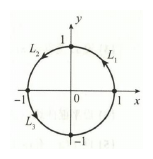

# 第九章 曲线积分与曲面积分

## 基础题

### 选择题

<ExamQuestion>

1. 设 $L$ 为圆周 $x^2+y^2=2x$，则 $I=\int_L x\mathrm{d}s=(\quad)$.

<ExamChoices>
<ExamOption>A. $2\pi$ \quad</ExamOption>
<ExamOption>B. $\pi$ \quad</ExamOption>
<ExamOption>C. $1$ \quad</ExamOption>
<ExamOption>D. $0$</ExamOption>
</ExamChoices>

<ExamSolution>

<ExamAnswer>A</ExamAnswer>

<ExamExplanation>
**解析：** $L$ 的参数方程为 $\begin{cases} x = \cos t + 1, \\ y = \sin t, \end{cases}$ 则 $\mathrm{d}s = \sqrt{{x'_t}^2 + {y'_t}^2} \,\mathrm dt = \,\mathrm dt$, 故
$$
I = \int_L x \, \mathrm{d}s = \int_0^{2\pi} (1 + \cos t) \,\mathrm dt = 2\pi,
$$
选项 A 正确。

**注：** 也可利用质心(形心)坐标 $\bar{x} = 1$, 则
$$
\int_L x \, \mathrm{d}s = \bar{x} \cdot \int_L \mathrm{d}s = 1 \times 2\pi = 2\pi \left(\int_L \mathrm{d}s \text{表示圆周长}\right).
$$
</ExamExplanation>

</ExamSolution>

</ExamQuestion>

<ExamQuestion>

2. 设 $S$ 为球面 $(x-a)^2+(y-b)^2+(z-c)^2=1(a,b,c \text{ 均大于零})$, 则 $I=\iint_S (x+y+z)\,\mathrm dS=(\quad)$.

<ExamChoices>
<ExamOption>A. $4\pi$ \quad</ExamOption>
<ExamOption>B. $4\pi(a+b+c)$ \quad</ExamOption>
<ExamOption>C. $0$ \quad</ExamOption>
<ExamOption>D. $\frac{4}{3}\pi(a+b+c)$</ExamOption>
</ExamChoices>

<ExamSolution>

<ExamAnswer>B</ExamAnswer>

<ExamExplanation>
**解析：** 注意到 $S$ 分别关于平面 $x = a, y = b, z = c$ 对称, 则
$$
\begin{aligned} I &= \iint_S (x + y + z) \,\mathrm dS = \iint_S [(x - a) + (y - b) + (z - c)] \,\mathrm dS + \iint_S (a + b + c) \,\mathrm dS \\ &= 0 + (a + b + c) \iint_S \,\mathrm dS = 4\pi (a + b + c), \end{aligned}
$$
故选 B.

**注：** $\iint_S \,\mathrm dS$ 表示球面的表面积.
</ExamExplanation>

</ExamSolution>

</ExamQuestion>

<ExamQuestion>

3. 设 $S: x^2+y^2+z^2=R^2(z\geqslant 0)$，$S_1$ 为 $S$ 在第一卦限的部分，则 $(\quad)$.

<ExamChoices>
<ExamOption>A. $\iint_S x\,\mathrm dS=4\iint_{S_1} x\,\mathrm dS$ \quad</ExamOption>
<ExamOption>B. $\iint_S y\,\mathrm dS=4\iint_{S_1} y\,\mathrm dS$</ExamOption>
<ExamOption>C. $\iint_S z\,\mathrm dS=4\iint_{S_1} z\,\mathrm dS$ \quad</ExamOption>
<ExamOption>D. $\iint_S xyz\,\mathrm dS=4\iint_{S_1} xyz\,\mathrm dS$</ExamOption>
</ExamChoices>

<ExamSolution>

<ExamAnswer>C</ExamAnswer>

<ExamExplanation>
**解析：** 由 $z = z(x, y)$, 知 $z$ 关于 $x, y$ 均为偶函数, 故 $\iint_S z \, \,\mathrm dS = 4 \iint_{S_1} z \, \,\mathrm dS$.

由 $S$ 关于 $xOz$ 面, $yOz$ 面均对称, 知 $\iint_S x \, \,\mathrm dS = 0, \iint_S y \, \,\mathrm dS = 0, \iint_S xyz \, \,\mathrm dS = 0$, 而 $\iint_{S_1} x \, \,\mathrm dS > 0, \iint_{S_1} y \, \,\mathrm dS > 0$,
$$
\iint_{S_1} xyz \, \,\mathrm dS > 0, \text{故排除选项 A, B, D, 选项 C 正确。}
$$
</ExamExplanation>

</ExamSolution>

</ExamQuestion>

<ExamQuestion>

4. 设 $D=\{(x,y)\mid (x-1)^2+(y-1)^2\leqslant 2\}, L$ 为 $D$ 的边界曲线，取顺时针方向，$I_1=\int_L x\,\mathrm dx+\frac{(x+y)^2}{8}\,\mathrm dy$,

$I_2=\int_L x\,\mathrm dx+\frac{(x-y)^2}{8}\,\mathrm dy$, $I_3=\int_L \frac{(x+y)^2}{8}\,\mathrm dx+y\,\mathrm dy$, 则 $(\quad)$.

<ExamChoices>
<ExamOption>A. $I_1>I_2>I_3$ \quad</ExamOption>
<ExamOption>B. $I_3>I_2>I_1$ \quad</ExamOption>
<ExamOption>C. $I_2>I_3>I_1$ \quad</ExamOption>
<ExamOption>D. $I_2>I_1>I_3$</ExamOption>
</ExamChoices>

<ExamSolution>

<ExamAnswer>B</ExamAnswer>

<ExamExplanation>
**解析：** 对区域 $D$，
当 $(x, y) \in D$ 时, $0 \leqslant x + y \leqslant 4$.
应用格林公式, 有
$$
\begin{aligned} I_1 &= -\iint_D \frac{x + y}{4} \, \,\mathrm dx\,\mathrm dy < 0, \quad I_3 = \iint_D \frac{x + y}{4} \, \,\mathrm dx\,\mathrm dy > 0, \\ I_2 &= -\iint_D \frac{x - y}{4} \, \,\mathrm dx\,\mathrm dy = -\frac{1}{4} \cdot \frac{1}{2} \iint_D (x - y + y - x) \, \,\mathrm dx\,\mathrm dy = 0 \\ &\quad (D \text{ 关于直线 } y = x \text{ 对称}). \end{aligned}
$$

综上所述, $I_1 < I_2 < I_3$. 选项 B 正确。
</ExamExplanation>

</ExamSolution>

</ExamQuestion>

### 填空题

<ExamQuestion>

1. 设 $S$ 为平面 $x+y+z=4$ 被圆柱面 $x^2+y^2=1$ 截出的有限部分，则 $I=\iint_S z\,\mathrm dS=$ $\underline{\quad\quad\quad\quad}$ .

<ExamSolution>

<ExamAnswer>$4\sqrt{3}\pi$.</ExamAnswer>

<ExamExplanation>
**解析：** 由 $S: z = 4 - x - y$, 得 $z_x' = -1, z_y' = -1$, 则 $\,\mathrm dS = \sqrt{1 + z_x'^2 + z_y'^2}\;\,\mathrm dx\,\mathrm dy = \sqrt{3}\;\,\mathrm dx\,\mathrm dy$,
故

$$
\begin{aligned}
\iint_S z\,\mathrm dS &= \iint_{D_{xy}} (4 - x - y) \cdot \sqrt{3}\;\,\mathrm dx\,\mathrm dy \\
&= \sqrt{3} \int_0^{2\pi}\mathrm{d}\theta \int_0^1 (4 - r\cos\theta - r\sin\theta)r\mathrm{d}r \\
&= 4\sqrt{3}\pi \quad (D_{xy}: x^2 + y^2 \leqslant 1).
\end{aligned}
$$

</ExamExplanation>

</ExamSolution>

</ExamQuestion>

<ExamQuestion>

2. 设 $L$ 为 $x^2+y^2=R^2(y\geqslant 0)$ 上由点 $A\left(-\frac{R}{\sqrt{2}}, \frac{R}{\sqrt{2}}\right)$ 到点 $B(R,0)$ 的一段弧，则 $\int_L y\mathrm{d}s=$ $\underline{\quad\quad\quad\quad}$ , $\int_L y\,\mathrm dx=$ $\underline{\quad\quad\quad\quad}$ .

<ExamSolution>

<ExamAnswer>$\dfrac{2+\sqrt{2}}{2}R^2, \dfrac{3\pi+2}{8}R^2$.</ExamAnswer>

<ExamExplanation>
**解析：** 弧 $\overset{\frown}{AB}$ ，取 $x$ 为参数, 则弧 $\overset{\frown}{AB}$ 的方程为

$$
\begin{cases}
x = x, \\
y = \sqrt{R^2 - x^2}
\end{cases}
\left(-\frac{R}{\sqrt{2}} \leqslant x \leqslant R\right).
$$

$\mathrm{d}s = \sqrt{1 + y'^2}\;\,\mathrm dx = \frac{R}{\sqrt{R^2 - x^2}}\;\,\mathrm dx$,
故

$$
\begin{aligned}
\int_L y\mathrm{d}s &= \int_{-\frac{R}{\sqrt{2}}}^R \sqrt{R^2 - x^2} \cdot \frac{R}{\sqrt{R^2 - x^2}}\;\,\mathrm dx = \left(1 + \frac{1}{\sqrt{2}}\right)R^2 = \frac{2+\sqrt{2}}{2}R^2, \\
\int_L y\,\mathrm dx &= \int_{-\frac{R}{\sqrt{2}}}^R \sqrt{R^2 - x^2}\;\,\mathrm dx \overset{x = R\cos t}{=} -R^2 \int_{\frac{3\pi}{4}}^0 \sin^2 t\,\mathrm dt \\
&= R^2 \int_0^{\frac{3\pi}{4}} \frac{1 - \cos 2t}{2}\;\,\mathrm dt = \left(\frac{3\pi}{8} + \frac{1}{4}\right)R^2 = \frac{3\pi + 2}{8}R^2.
\end{aligned}
$$

**注：** 本题若取 $y$ 为参数, 由图 9-2 知, 曲线上的点与 $y$ 不是一一对应的, 则应将曲线 $L$ 分为 $\overset{\frown}{AC}$ 和 $\overset{\frown}{CB}$ 两段分别积分.
</ExamExplanation>

</ExamSolution>

</ExamQuestion>

<ExamQuestion>

3. 设 $L$ 为球面 $x^2+y^2+z^2=R^2$ 与平面 $x+y+z=0$ 的交线，则 $I=\oint_L (z+x^2)\mathrm{d}s=$ $\underline{\quad\quad\quad\quad}$ .

<ExamSolution>

<ExamAnswer>$\dfrac{2\pi R^3}{3}$.</ExamAnswer>

<ExamExplanation>
**解析：** 由于曲线 $L$: $\begin{cases} x^2 + y^2 + z^2 = R^2 \\ x + y + z = 0 \end{cases}$ 关于直线 $x = y = z$ 对称, 所以

$$
\begin{aligned}
\oint_L x^2\mathrm{d}s &= \frac{1}{3}\oint_L (x^2 + y^2 + z^2)\mathrm{d}s = \frac{1}{3}\oint_L R^2\mathrm{d}s, \\
\oint_L z\mathrm{d}s &= \frac{1}{3}\oint_L (x + y + z)\mathrm{d}s = \frac{1}{3}\oint_L 0\mathrm{d}s = 0,
\end{aligned}
$$

故

$$
I = \oint_L (z + x^2)\mathrm{d}s = 0 + \frac{1}{3}\oint_L R^2\mathrm{d}s = \frac{R^2}{3} \cdot 2\pi R = \frac{2\pi R^3}{3}.
$$

</ExamExplanation>

</ExamSolution>

</ExamQuestion>

<ExamQuestion>

4. 设曲线 $L$ 为 $x^2+y^2+z^2=\frac{9}{2}$ 与 $x+z=1$ 的交线，则 $I=\oint_L (x^2+y^2+z^2)\mathrm{d}s=$ _________。

<ExamSolution>

<ExamAnswer>$18\pi$.</ExamAnswer>

<ExamExplanation>
**解析：** 在交线 $L$ 上恒有
$$
x^2+y^2+z^2=\frac92,
$$
因此
$$
I=\frac92\oint_L\mathrm ds.
$$
由 $z=1-x$ 代入球面方程，得
$$
x^2+y^2+(1-x)^2=\frac92,
$$
即
$$
\frac{\left(x-\frac12\right)^2}{2}+\frac{y^2}{4}=1.
$$
可参数化为
$$
x=\frac12+\sqrt2\cos t,\qquad
y=2\sin t,\qquad
z=\frac12-\sqrt2\cos t,
\qquad 0\le t\le2\pi.
$$
于是
$$
\mathrm ds
=\sqrt{(-\sqrt2\sin t)^2+(2\cos t)^2+(\sqrt2\sin t)^2}\,\mathrm dt
=2\,\mathrm dt.
$$
故交线长度为 $4\pi$，从而
$$
I=\frac92\cdot4\pi=18\pi.
$$
</ExamExplanation>

</ExamSolution>

</ExamQuestion>

<ExamQuestion>

5. 设曲面 $S: |x|+|y|+|z|=1$，则 $I=\iint_S (x+y+|z|)\,\mathrm dS=$ _________。

<ExamSolution>

<ExamAnswer>$\frac{4\sqrt{3}}{3}.$</ExamAnswer>

<ExamExplanation>
**解析：** 由 $S$ 关于 $yOz$ 面、$xOy$ 面对称，$x$ 与 $y$ 是奇函数，故
$$
\iint_S x{\mathrm{d}}S = \iint_S y{\mathrm{d}}S = 0.
$$
又 $S$ 关于直线 $x = y = z$ 对称，由轮换性，知
$$
I=\iint_S (x+y+|z|)\,\mathrm dS
$$
$$
= 0 + 0 + \frac{1}{3}\iint_S (|x|+|y|+|z|)\,\mathrm dS
$$
$$
= \frac{1}{3}\iint_S \,\mathrm dS.
$$

$S$ 由八块等边三角形组成，等边三角形边长为 $\sqrt{2}$ ，故 $S$ 的面积为
$$
8 \cdot \frac{1}{2} \cdot (\sqrt{2})^2 \cdot \sin\frac{\pi}{3} = 4\sqrt{3},
$$
所以 $I = \frac{1}{3} \times 4\sqrt{3} = \frac{4\sqrt{3}}{3}.$
</ExamExplanation>

</ExamSolution>

</ExamQuestion>

<ExamQuestion>

6. 设 $\Sigma: (x-a)^2+(y-a)^2+(z-a)^2=2a^2(a>0)$，则 $I=\iint_\Sigma (x+y+z-\sqrt{3}a)\,\mathrm dS=$ _________。

<ExamSolution>

<ExamAnswer>$8(3 - \sqrt{3})\pi a^3.$</ExamAnswer>

<ExamExplanation>
**解析：** 解法1 $\Sigma$ 上任一点 $(x, y, z)$ 处的单位外法向量为
$$
n^0 = \{\cos\alpha, \cos\beta, \cos\gamma\} = \frac{1}{\sqrt{(x - a)^2 + (y - a)^2 + (z - a)^2}} \cdot \{x - a, y - a, z - a\}
$$
$$
= \frac{1}{\sqrt{2}a}\{x - a, y - a, z - a\},
$$
则
$$
I = \iint_{\Sigma} (x + y + z - \sqrt{3}a)\,{\mathrm{d}}S = \iint_{\Sigma} [(x - a) + (y - a) + (z - a) + (3 - \sqrt{3})a]\,{\mathrm{d}}S
$$
$$
= \sqrt{2}a\iint_{\Sigma} (\cos\alpha + \cos\beta + \cos\gamma)\,{\mathrm{d}}S + (3 - \sqrt{3})a\iint_{\Sigma} {\mathrm{d}}S
$$
$$
= \sqrt{2}a\iint_{\Sigma} ({\mathrm{d}}y{\mathrm{d}}z + {\mathrm{d}}z{\mathrm{d}}x + {\mathrm{d}}x{\mathrm{d}}y) + (3 - \sqrt{3})a \cdot 8\pi a^2
$$
$$
\overset{\text{高斯公式}}{=} \sqrt{2}a\iiint_V 0\,{\mathrm{d}}V + 8(3 - \sqrt{3})\pi a^3
$$
$$
= 8(3 - \sqrt{3})\pi a^3.
$$

解法2 利用对称性
$$
I = \iint_{\Sigma} (x + y + z - \sqrt{3}a)\,{\mathrm{d}}S
$$
$$
= \iint_{\Sigma} [(x - a) + (y - a) + (z - a) + (3 - \sqrt{3})a]\,{\mathrm{d}}S
$$
$$
= 0 + 0 + 0 + \iint_{\Sigma} (3 - \sqrt{3})a\,{\mathrm{d}}S
$$
$$
= (3 - \sqrt{3})a \cdot 8\pi a^2 = 8(3 - \sqrt{3})\pi a^3,
$$
其中 $\iint_{\Sigma} (x - a){\mathrm{d}}S = \iint_{\Sigma} (y - a){\mathrm{d}}S = \iint_{\Sigma} (z - a){\mathrm{d}}S = 0.$
</ExamExplanation>

</ExamSolution>

</ExamQuestion>

<ExamQuestion>

7. 设 $L$ 为点 $(1,-1,2)$ 到点 $(2,1,3)$ 的直线段，则 $I=\int_L (x^2+y^2+z^2)\mathrm{d}s=$ _________。

<ExamSolution>

<ExamAnswer>$9\sqrt{6}$</ExamAnswer>

<ExamExplanation>
**解析：** 两点连线 $L$ 的方向向量为 $S = (1, 2, 1)$, 故 $L$ 的方程为

$$
\frac{x - 1}{1} = \frac{y + 1}{2} = \frac{z - 2}{1}, 1 \leqslant x \leqslant 2,
$$

其参数方程为

$$
\left\{\begin{array}{l}
x = 1 + t, \\
y = -1 + 2t, (0 \leqslant t \leqslant 1), \\
z = 2 + t
\end{array}\right.
$$

则 $\mathrm{d}s = \sqrt{{x'}^2(t) + {y'}^2(t) + {z'}^2(t)}\,\mathrm dt = \sqrt{6}\,\mathrm dt$, 故

$$
\begin{aligned}
I &= \int_L (x^2 + y^2 + z^2)\,\mathrm{d}s = \int_0^1 \sqrt{6}\left[(1 + t)^2 + (-1 + 2t)^2 + (2 + t)^2\right]\,\mathrm dt \\
&= \sqrt{6} \int_0^1 (6 + 2t + 6t^2)\,\mathrm dt = 9\sqrt{6}.
\end{aligned}
$$

</ExamExplanation>

</ExamSolution>

</ExamQuestion>

<ExamQuestion>

8. 设曲线 $L$ 为上半圆周 $y=\sqrt{1-x^2}$，则 $\int_L (x-y)^2\mathrm{e}^{x^2+y^2}\mathrm{d}s=$ _________。

<ExamSolution>

<ExamAnswer>$\pi e$</ExamAnswer>

<ExamExplanation>
**解析：** 将曲线 $L$ 的方程代入被积函数, 得
$$
\int_L (x - y)^2 e^{x^2 + y^2}\,\mathrm{d}s = \int_L (1 - 2xy) e\,\mathrm{d}s = e \int_L \mathrm{d}s - 2e \int_L xy\,\mathrm{d}s.
$$
又 $L$ 关于 $y$ 轴对称, $xy$ 关于 $x$ 是奇函数, 故 $\int_L xy\,\mathrm{d}s = 0$, 从而
$$
\int_L (x - y)^2 e^{x^2 + y^2}\,\mathrm{d}s = e \int_L \mathrm{d}s + 0 = \pi e.
$$
</ExamExplanation>

</ExamSolution>

</ExamQuestion>

<ExamQuestion>

9. 设立体 $\Omega$ 为 $x^2+y^2+z^2\leqslant 2z$，其密度 $\rho(x,y,z)=x^2$，则 $\Omega$ 的质量为 _________。

<ExamSolution>

<ExamAnswer>$\frac{4}{15}\pi$</ExamAnswer>

<ExamExplanation>
**解析：** [解法1] $\Omega$ 的质量为

$$
\begin{aligned}
m &= \iiint_\Omega x^2\,\mathrm dV = \int_{-1}^1 \,\mathrm dx \iint_{D_x} x^2\,\mathrm dy\,\mathrm dz = \int_{-1}^1 \pi x^2(1 - x^2)\,\mathrm dx \\
&= 2 \int_0^1 \pi x^2(1 - x^2)\,\mathrm dx = 2\pi \left(\frac{1}{3} - \frac{1}{5}\right) = \frac{4}{15}\pi.
\end{aligned}
$$

[解法2] 利用球面坐标计算:

$$
\begin{aligned}
m &= \int_0^{2\pi} \mathrm{d}\theta \int_0^{\frac{\pi}{2}} \mathrm{d}\varphi \int_0^{2\cos\varphi} r^2 \sin^2\varphi \cos^2\theta \cdot r^2 \sin\varphi\,\mathrm{d}r \\
&= \int_0^{2\pi} \cos^2\theta\,\mathrm{d}\theta \int_0^{\frac{\pi}{2}} \sin^3\varphi \cdot \frac{1}{5}r^5 \Big|_0^{2\cos\varphi}\,\mathrm{d}\varphi \\
&= \pi \cdot \frac{32}{5} \int_0^{\frac{\pi}{2}} (1 - \cos^2\varphi)\cos^5\varphi\,\mathrm{d}(-\cos\varphi) \\
&= \frac{32\pi}{5} \left(\frac{1}{6} - \frac{1}{8}\right) = \frac{4}{15}\pi.
\end{aligned}
$$

</ExamExplanation>

</ExamSolution>

</ExamQuestion>

### 解答题

<ExamQuestion>

1. 设 $L$ 为由 $r=a(a>0)$，$\theta=0$ 和 $\theta=\frac{\pi}{4}$ 所围凸平面区域的边界，$(r,\theta)$ 为极坐标，计算 $I=\int_L \mathrm{e}^{\sqrt{x^2+y^2}}\mathrm{d}s$。

<ExamSolution>

<ExamAnswer>见解析</ExamAnswer>

<ExamExplanation>
**解析：** 计算第一型曲线积分时要化为定积分, 关键是正确写出积分曲线的参数方程.

$L$ 由的 $L_1, L_2, L_3$ 三条曲线构成.

$L_1: \left\{\begin{array}{l}y = 0, \\ x = x,\end{array}\right.$ 因 $\mathrm{d}s = \,\mathrm dx$, 则 $\int_{L_1} e^{\sqrt{x^2+y^2}}\,\mathrm{d}s = \int_0^a e^x\,\mathrm dx = e^a - 1$;

$L_2: \left\{\begin{array}{l}x = a\cos t, \\ y = a\sin t\end{array}\right. \left(0 \leqslant t \leqslant \frac{\pi}{4}\right)$, 则
$$
\int_{L_2} e^{\sqrt{x^2+y^2}}\,\mathrm{d}s = \int_0^{\frac{\pi}{4}} e^a \sqrt{a^2\sin^2 t + a^2\cos^2 t}\,\mathrm dt = \frac{\pi}{4}a e^a;
$$

$L_3: \left\{\begin{array}{l}y = x, \\ x = x,\end{array}\right.$ $\mathrm{d}s = \sqrt{1^2 + 1^2}\,\mathrm dx = \sqrt{2}\,\mathrm dx$, 则
$$
\int_{L_3} e^{\sqrt{x^2+y^2}}\,\mathrm{d}s = \int_0^{\frac{\sqrt{2}}{2}a} e^{\sqrt{2}x} \cdot \sqrt{2}\,\mathrm dx = e^a - 1,
$$

故 $I = e^a - 1 + \frac{\pi}{4}a e^a + e^a - 1 = \left(\frac{\pi}{4}a + 2\right)e^a - 2.$

**注：** 计算第一型曲线积分 $\int_L f(x, y, z) \mathrm{d}s$ 应掌握：
① 计算公式，写出 $L$ 的参数方程，化为定积分计算，即“变量参数化，计算定积分，上限大于下限”；
② 将 $L$ 的方程代入被积函数化简；
③ 对称性包括奇偶性和轮换对称性（与二重积分、三重积分对称性类似）。
</ExamExplanation>

</ExamSolution>

</ExamQuestion>

<ExamQuestion>

2. 设 $L$ 为 $\left(x-\frac{1}{2}\right)^2+y^2=\frac{1}{4}(y\geqslant 0)$ 上从点 $O(0,0)$ 到点 $A(1,0)$ 的一段弧，计算
$$
I=\int_L \left[3+(2-\sqrt{2})y+\mathrm{e}^x\sin y\right]\,\mathrm dx+(\sqrt{2}x+\mathrm{e}^x\cos y)\,\mathrm dy.
$$

<ExamSolution>

<ExamAnswer>见解析</ExamAnswer>

<ExamExplanation>
**解析：** 记 $P = 3 + (2 - \sqrt{2})y + e^x \sin y, Q = \sqrt{2}x + e^x \cos y$，则
$$
\frac{\partial Q}{\partial x} - \frac{\partial P}{\partial y} = 2\sqrt{2} - 2.
$$
加线段 $\overline{AO}$：$\begin{cases} y = 0, \\ x = x, \end{cases}$ $L$ 与线段 $\overline{AO}$ 构成闭区域 $D$。利用格林公式，得
$$
I = -\iint_D \left(\frac{\partial Q}{\partial x} - \frac{\partial P}{\partial y}\right) \,\mathrm dx\,\mathrm dy - \int_{\overline{AO}} [3 + (2 - \sqrt{2})y + e^x \sin y]\,\mathrm dx + (\sqrt{2}x + e^x \cos y)\,\mathrm dy
$$
$$
= -\iint_D (2\sqrt{2} - 2)\,\mathrm dx\,\mathrm dy + \int_0^1 3\,\mathrm dx = (2 - 2\sqrt{2}) \times \frac{1}{2} \times \pi \times \left(\frac{1}{2}\right)^2 + 3 = \frac{(1 - \sqrt{2})\pi}{4} + 3.
$$

**注：** 此题在利用格林公式时，由于 $L + \overline{AO}$ 是顺时针方向，所以应取“$-”$号。
</ExamExplanation>

</ExamSolution>

</ExamQuestion>

<ExamQuestion>

3. 计算积分 $I=\oint_L \frac{x\,\mathrm dy-y\,\mathrm dx}{x^2+y^2}$，其中

(I) $L$ 为 $(x+2)^2+(y-2)^2=1$，取逆时针方向；

(II) $L$ 为 $x^2+y^2=1$，取逆时针方向；

(III) $L$ 为 $\frac{x^2}{a^2}+\frac{y^2}{b^2}=1$，取逆时针方向。

<ExamSolution>

<ExamAnswer>见解析</ExamAnswer>

<ExamExplanation>
**解析：** (I) 记 $P = \frac{-y}{x^2 + y^2}, Q = \frac{x}{x^2 + y^2}$，则 $P$ 与 $Q$ 在 $D_1: (x+2)^2 + (y-2)^2 \leqslant 1$ 上有一阶连续偏导数，且
$$
\frac{\partial Q}{\partial x}-\frac{\partial P}{\partial y}=0.
$$
由格林公式，得
$$
I = \oint_L \frac{x\,\mathrm dy - y\,\mathrm dx}{x^2 + y^2} = \iint_{D_1} \left(\frac{\partial Q}{\partial x} - \frac{\partial P}{\partial y}\right)\,\mathrm dx\,\mathrm dy = 0.
$$

(II) 由于 $P$ 与 $Q$ 及 $\frac{\partial Q}{\partial x}$ 和 $\frac{\partial P}{\partial y}$ 在 $x^2 + y^2 < 1$ 内的点 $(0,0)$ 处没有定义，所以不能直接利用格林公式，直接利用 $L$ 的参数方程 $\begin{cases} x = \cos t, \\ y = \sin t, \end{cases}$ 计算，得
$$
I = \oint_L \frac{x\,\mathrm dy - y\,\mathrm dx}{x^2 + y^2} = \int_0^{2\pi} \frac{\cos^2 t + \sin^2 t}{1} \,\mathrm dt = 2\pi.
$$

(III) 由于 $P$ 与 $Q$ 及 $\frac{\partial Q}{\partial x}$ 和 $\frac{\partial P}{\partial y}$ 在椭圆 $\frac{x^2}{a^2} + \frac{y^2}{b^2} < 1$ 内的点 $(0,0)$ 处没有定义，故不能直接利用格林公式。
考虑在 $L: \frac{x^2}{a^2} + \frac{y^2}{b^2} = 1$ 内作一个半径充分小的圆 $L_r: \begin{cases} x = r\cos t, \\ y = r\sin t, \end{cases}$ 取顺时针方向，$|r| \ll 1 (0 \leqslant t \leqslant 2\pi)$，挖去点 $(0,0)$，在 $L + L_r^-$ 所围的区域 $D_2$ 上用格林公式，得
$$
\oint_{L + L_r^-} \frac{x\,\mathrm dy - y\,\mathrm dx}{x^2 + y^2} = \iint_{D_2} \left(\frac{\partial Q}{\partial x} - \frac{\partial P}{\partial y}\right)\,\mathrm dx\,\mathrm dy = \iint_{D_2} 0\,\mathrm dx\,\mathrm dy = 0,
$$
故
$$
I = \oint_L \frac{x\,\mathrm dy - y\,\mathrm dx}{x^2 + y^2} = \oint_{L_r} \frac{x\,\mathrm dy - y\,\mathrm dx}{x^2 + y^2} = \int_0^{2\pi} \frac{r^2(\cos^2 t + \sin^2 t)}{r^2} \,\mathrm dt = 2\pi,
$$
其中 $L_r$ 为逆时针方向。
</ExamExplanation>

</ExamSolution>

</ExamQuestion>

<ExamQuestion>

4. 设 $L:x^2+y^2=R^2(R>1)$，取逆时针方向，计算 $I=\oint_L \frac{x\,\mathrm dy-y\,\mathrm dx}{4x^2+9y^2}$。

<ExamSolution>

<ExamAnswer>见解析</ExamAnswer>

<ExamExplanation>
**解析：** 记 $P = \frac{-y}{4x^2 + 9y^2}, Q = \frac{x}{4x^2 + 9y^2}$，则 $\frac{\partial Q}{\partial x}=\frac{\partial P}{\partial y}=\frac{9y^2-4x^2}{(4x^2+9y^2)^2},\quad \frac{\partial Q}{\partial x}-\frac{\partial P}{\partial y}=0.$
由于 $P$ 与 $Q$ 及 $\frac{\partial Q}{\partial x}$ 和 $\frac{\partial P}{\partial y}$ 在 $x^2 + y^2 < R^2$ 内的点 $(0,0)$ 处没有定义，不能直接利用格林公式，考虑到被

积分表达式的分母为 $4x^2+9y^2$, 在 $x^2+y^2=R^2$ 内部作一个小的椭圆：

$$
L_r: \begin{cases} x = \frac{1}{2} r \cos t, \\ y = \frac{1}{3} r \sin t, \end{cases}
$$

$r$ 充分小, 取顺时针方向, 则在 $L+L_r$ 所围区域 $D$ 上用格林公式, 有

$$
\oint_{L+L_r} \frac{x\,\mathrm dy - y\,\mathrm dx}{4x^2+9y^2} = \iint_D \left(\frac{\partial Q}{\partial x} - \frac{\partial P}{\partial y}\right)\,\mathrm dx\,\mathrm dy = 0,
$$

故

$$
\begin{aligned}
I &= \oint_L \frac{x\,\mathrm dy - y\,\mathrm dx}{4x^2+9y^2} = \oint_{L_r} \frac{x\,\mathrm dy - y\,\mathrm dx}{4x^2+9y^2} \\
&= \frac{1}{r^2} \oint_{L_r} x\,\mathrm dy - y\,\mathrm dx = \int_0^{2\pi} \frac{1}{6}(\cos^2 t + \sin^2 t)\,\mathrm dt = \frac{\pi}{3},
\end{aligned}
$$

其中 $L$ 为逆时针方向。
</ExamExplanation>

</ExamSolution>

</ExamQuestion>

<ExamQuestion>

5. 设曲线 $L:x^2+y^2=R^2(R>0)$，取逆时针方向，问 $R$ 为何值时，积分 $I(R)=\oint_L y^3\,\mathrm dx+(3x-x^3)\,\mathrm dy$ 取得最大值，并求最大值。

<ExamSolution>

<ExamAnswer>见解析</ExamAnswer>

<ExamExplanation>
**解析：** $L$ 为闭曲线, 利用格林公式, 记 $P = y^3, Q = 3x - x^3$,

$$
\begin{aligned}
I(R) &= \oint_L y^3\,\mathrm dx + (3x - x^3)\,\mathrm dy = \iint_D (3 - 3x^2 - 3y^2)\,\mathrm dx\,\mathrm dy \\
&= 3\iint_D (1 - x^2 - y^2)\,\mathrm dx\,\mathrm dy = 3\int_0^{2\pi}\mathrm{d}\theta\int_0^R (1 - r^2)r\,\mathrm{d}r \\
&= 6\pi \left(\frac{r^2}{2} - \frac{r^4}{4}\right)\Bigg|_0^R = 3\pi \left(R^2 - \frac{R^4}{2}\right).
\end{aligned}
$$

由 $\frac{\mathrm{d}[I(R)]}{\mathrm{d}R} = 6\pi(R - R^3) = 0$, 得 $R = 1$, 且

$$
\left.\frac{\mathrm{d}^2[I(R)]}{\mathrm{d}R^2}\right|_{R=1} = 6\pi(1 - 3R^2)\Big|_{R=1} = -12\pi < 0,
$$

故 $R = 1$ 是唯一极大值点, 也是最大值点, 最大值为 $I(1) = \frac{3}{2}\pi$.
</ExamExplanation>

</ExamSolution>

</ExamQuestion>

<ExamQuestion>

6. 设平面力场为 $\boldsymbol{F}=(2xy^3-y^2\cos x)\boldsymbol{i}+(1-2y\sin x+3x^2y^2)\boldsymbol{j}$，求质点在 $\boldsymbol{F}$ 作用下，沿 $L:2x=\pi y^2$ 从点 $O(0,0)$ 到点 $A\left(\frac{\pi}{2}, 1\right)$ 所做的功 $W$。

<ExamSolution>

<ExamAnswer>见解析</ExamAnswer>

<ExamExplanation>
**解析：** 依题意, 有

$$
W=\int_L \mathbf F\cdot\mathrm d\mathbf r = \int_L (2xy^3 - y^2\cos x)\,\mathrm dx + (1 - 2y\sin x + 3x^2y^2)\,\mathrm dy.
$$

选取 $y$ 为参数, 则 $L: \begin{cases} x = \frac{\pi}{2} y^2, \\ y = y, \end{cases}$ $y$ 从 $0$ 到 $1$, 故

$$
W = \int_0^1 \left[\left(2 \cdot \frac{\pi}{2} \cdot y^2 \cdot y^3 - y^2 \cdot \cos \frac{\pi}{2}y^2\right)\pi y + 1 - 2y\sin \frac{\pi}{2}y^2 + 3 \cdot \left(\frac{\pi}{2}\right)^2 y^4 \cdot y^2\right]\,\mathrm dy
$$

$$
= \frac{\pi^2}{4}.
$$

</ExamExplanation>

</ExamSolution>

</ExamQuestion>

<ExamQuestion>

7. 计算 $I=\int_L \frac{x\,\mathrm dy-y\,\mathrm dx}{x^2+y^2}$，其中 $L$ 是从点 $A(1,1)$ 沿直线到点 $B(-1,0)$，再沿曲线 $y=x^2-1$ 到点 $C(1,0)$。

<ExamSolution>

<ExamAnswer>见解析</ExamAnswer>

<ExamExplanation>
**解析：** 解法1 因为 $\frac{\partial Q}{\partial x} = \frac{\partial P}{\partial y} = \frac{y^2 - x^2}{(x^2 + y^2)^2}$, 所以不含点 $(0,0)$ 的区域内, 积分与路径无关。 取

$$
AD: \begin{cases} y = 1, \\ x = x, \end{cases} \quad DB: \begin{cases} x = -1, \\ y = y, \end{cases} \quad BEC: \begin{cases} x = \cos t, \\ y = \sin t, \end{cases}
$$

故

$$
\begin{aligned}
I &= \int_1^{-1} \frac{-\,\mathrm dx}{1+x^2} + \int_1^0 \frac{-\,\mathrm dy}{1+y^2} + \int_\pi^{2\pi} \frac{\cos^2 t + \sin^2 t}{1}\,\mathrm dt \\
&= -\left(\frac{\pi}{4} - \frac{\pi}{4}\right) - \left(0 - \frac{\pi}{4}\right) + (2\pi - \pi) \\
&= \frac{7\pi}{4}.
\end{aligned}
$$

解法2 用格林公式。
连接 $\overline{CA}$: $\begin{cases} x = 1, \\ y = y, \end{cases}$ $l: \begin{cases} x = \delta \cos t, \\ y = \delta \sin t, \end{cases}$ ($\delta$ 充分小) 取顺时针方向, 则

$$
I = \int_L \frac{x\,dy - y\,dx}{x^2 + y^2} = \oint_{\overset{\frown}{ABECA}} \frac{x\,dy - y\,dx}{x^2 + y^2} - \int_{\overline{CA}} - \oint_{l_{\text{顺}}},
$$

$$
\oint_{\overset{\frown}{ABECA}} \frac{x\,dy - y\,dx}{x^2 + y^2} = \iint_D \left(\frac{\partial Q}{\partial x} - \frac{\partial P}{\partial y}\right)\,dx\,dy = 0,
$$

故

$$
I = \oint_{l_{\text{逆}}} - \int_{\overline{CA}} = \int_0^{2\pi} \frac{\delta^2}{\delta^2}\,dt - \int_0^1 \frac{dy}{1+y^2} = 2\pi - \frac{\pi}{4} = \frac{7\pi}{4}.
$$

**注：** 解法1利用积分与路径无关,不能取 $\overline{CA}$ 的原因是闭环线 $\widehat{ABEC} + \overline{CA}$ 中含 $(0,0)$, 而 $\frac{\partial Q}{\partial x} = \frac{\partial P}{\partial y} = \frac{y^2 - x^2}{(x^2 + y^2)^2}$ 在点 $(0,0)$ 处没有意义。
</ExamExplanation>

</ExamSolution>

</ExamQuestion>

<ExamQuestion>

8. 设 $P(x,y)=\frac{x\left(\sqrt{x^2+y^2}\right)^k}{y}, Q(x,y)=-\frac{x^2\left(\sqrt{x^2+y^2}\right)^k}{y^2}, D=\{(x,y)\mid y>0\}$。

$(I)$ 若积分 $I=\int_L P\,\mathrm dx+Q\,\mathrm dy$ 在 $D$ 内与路径无关，求 $k$ 的值；

$(II)$ 在 $D$ 内求函数 $u(x,y)$，使得 $\mathrm{d}u=P\,\mathrm dx+Q\,\mathrm dy$，并计算 $I=\int_{(1,1)}^{(2,2)} P\,\mathrm dx+Q\,\mathrm dy$。

<ExamSolution>

<ExamAnswer>见解析</ExamAnswer>

<ExamExplanation>
**解析：** (I) 由于 $D$ 是单连通区域, 且 $P(x,y), Q(x,y)$ 在 $D$ 内有连续偏导数, 故
$$
\int_L P\,dx + Q\,dy \text{ 在 } D \text{ 内与路径无关} \Rightarrow \frac{\partial Q}{\partial x} = \frac{\partial P}{\partial y},
$$
即
$$
-\frac{2x}{y^2}(\sqrt{x^2+y^2})^k - \frac{x^2}{y^2}k(\sqrt{x^2+y^2})^{k-1} \cdot \frac{x}{\sqrt{x^2+y^2}}
$$
$$
= -\frac{x}{y^2}(\sqrt{x^2+y^2})^k + \frac{x}{y}k(\sqrt{x^2+y^2})^{k-1} \cdot \frac{y}{\sqrt{x^2+y^2}},
$$
等式两边同时除以 $\frac{x}{y^2}(\sqrt{x^2+y^2})^{k-2}$, 得 $-2(x^2+y^2) - kx^2 = -(x^2+y^2) + ky^2$, 即 $(k+1)(x^2+y^2) = 0$, 解得 $k = -1$.

(II) 由 (I) 知, 当 $k = -1$ 时, 存在 $u(x,y)$, 使得 $du = P\,dx + Q\,dy$. 用积分求 $u(x,y)$.
由 $\frac{\partial u}{\partial x} = P(x,y) = \frac{x}{y\sqrt{x^2+y^2}}$, 可知
$$
u(x,y) = \int \frac{x}{y\sqrt{x^2+y^2}}\,dx + \varphi_1(y) = \frac{\sqrt{x^2+y^2}}{y} + \varphi(y),
$$
其中 $\varphi(y) = \varphi_1(y) + C_1$. 又因为
$$
\frac{\partial u}{\partial y} = -\frac{1}{y^2}\sqrt{x^2+y^2} + \frac{1}{y} \cdot \frac{y}{\sqrt{x^2+y^2}} + \varphi'(y)
$$
$$
= \frac{-(x^2+y^2) + y^2}{y^2\sqrt{x^2+y^2}} + \varphi'(y)
$$
$$
= \frac{-x^2}{y^2\sqrt{x^2+y^2}} + \varphi'(y) = Q(x,y),
$$
所以 $\varphi'(y) = 0$, 即 $\varphi(y) = C$, 从而有
$$
u(x,y) = \frac{\sqrt{x^2+y^2}}{y} + C \ (C \text{ 为任意常数}).
$$
$$
I = \int_{(1,1)}^{(2,2)} P\,dx + Q\,dy = u(x,y)\Big|_{(1,1)}^{(2,2)} = \left(\frac{\sqrt{x^2+y^2}}{y} + C\right)\Big|_{(1,1)}^{(2,2)} = 0.
$$
</ExamExplanation>

</ExamSolution>

</ExamQuestion>

<ExamQuestion>

9. 设曲线 $L$ 为 $z=4-x^2-y^2$ 与 $z=3$ 的交线，从 $z$ 轴正向看是逆时针方向，计算 $I=\oint_L x^2y^3\,\mathrm dx+z\,\mathrm dy+y\,\mathrm dz$。

<ExamSolution>

<ExamAnswer>见解析</ExamAnswer>

<ExamExplanation>
**解析：** 解法1  曲线 $L$: $\begin{cases} x^2 + y^2 = 1, \\ z = 3, \end{cases}$ 消去 $z$, 得
$\begin{cases} x^2 + y^2 = 1, \\ z = 3, \end{cases}$ 故其参数方程为 $\begin{cases} x = \cos t, \\ y = \sin t, \\ z = 3, \end{cases} (0 \leqslant t \leqslant 2\pi)$.
$$
I = \oint_L x^2y^3\,dx + z\,dy + y\,dz
$$
$$
= \int_0^{2\pi} [\cos^2 t \sin^3 t(-\sin t) + 3\cos t + 0]\,dt = -\frac{\pi}{8}.
$$

解法2 利用斯托克斯公式, 考虑 $L$ 在平面 $z=3$ 上, 则

$$
I = \oint_L x^2 y^3 \,\mathrm dx + z\,\mathrm dy + y\,\mathrm dz = \iint_S
\begin{vmatrix}
\cos\alpha & \cos\beta & \cos\gamma \\
\frac{\partial}{\partial x} & \frac{\partial}{\partial y} & \frac{\partial}{\partial z} \\
x^2 y^3 & z & y
\end{vmatrix}
\,\mathrm dS.
$$

由 $z=3$, 知单位法向量为 $(\cos\alpha,\cos\beta,\cos\gamma) = (0,0,1)$, 故

$$
I = \iint_S
\begin{vmatrix}
0 & 0 & 1 \\
\frac{\partial}{\partial x} & \frac{\partial}{\partial y} & \frac{\partial}{\partial z} \\
x^2 y^3 & z & y
\end{vmatrix}
\,\mathrm dS = -\iint_S 3x^2 y^2 \,\mathrm dS.
$$

对 $S: z=3$, 有 $\,\mathrm dS = \sqrt{1 + z_x^{\prime 2} + z_y^{\prime 2}}\,\mathrm dx\,\mathrm dy = \,\mathrm dx\,\mathrm dy$, 故

$$
\begin{aligned}
I &= -\iint_{D_{xy}} 3x^2 y^2 \,\mathrm dx\,\mathrm dy = -3\int_0^{2\pi}\mathrm{d}\theta \int_0^1 r^2\cos^2\theta \cdot r^2\sin^2\theta \cdot r\mathrm{d}r \\
&= -3\int_0^{2\pi} \cos^2\theta\sin^2\theta\mathrm{d}\theta \int_0^1 r^5\mathrm{d}r = -\frac{1}{2}\int_0^{2\pi} (1 - \sin^2\theta)\sin^2\theta\mathrm{d}\theta \\
&= -\frac{1}{2}\left(\int_0^{2\pi} \sin^2\theta\mathrm{d}\theta - \int_0^{2\pi} \sin^4\theta\mathrm{d}\theta\right) = -\frac{\pi}{8},
\end{aligned}
$$

其中 $D_{xy}: x^2 + y^2 \le 1$.

**注：** ① 计算空间曲线积分有两种方法:
(i) 利用参数方程化为定积分计算;
(ii) 对于空间闭曲线 $L$, 可利用斯托克斯公式.
② 结论:

$$
\int_0^{2\pi} \sin^n\theta\mathrm{d}\theta = 4\int_0^{\frac{\pi}{2}} \sin^n\theta\mathrm{d}\theta,
$$

如 $\int_0^{2\pi} \sin^2\theta\mathrm{d}\theta = 4\int_0^{\frac{\pi}{2}} \sin^2\theta\mathrm{d}\theta$, $\int_0^{2\pi} \sin^4\theta\mathrm{d}\theta = 4\int_0^{\frac{\pi}{2}} \sin^4\theta\mathrm{d}\theta$.
③ 此题也可将 $z=3$ 代入被积表达式, 消去 $\,\mathrm dz$, 化为平面曲线积分:

$$
I = \oint_L x^2 y^3 \,\mathrm dx + z\,\mathrm dy + y\,\mathrm dz = \oint_{L_1} x^2 y^3 \,\mathrm dx + 3\,\mathrm dy \quad (L_1: x^2 + y^2 = 1).
$$

由格林公式, 知 $I = \oint_{L_1} x^2 y^3 \,\mathrm dx + 3\,\mathrm dy = -\iint_{D_{xy}} 3x^2 y^2 \,\mathrm dx\,\mathrm dy = -\frac{\pi}{8}$.
</ExamExplanation>

</ExamSolution>

</ExamQuestion>

<ExamQuestion>

10. 设曲线 $L$ 为锥面 $z=\sqrt{x^2+y^2}$ 与圆柱面 $x^2+y^2=2x$ 的交线，从 $z$ 轴正向往负向看去，$L$ 为逆时针方向，计算 $I=\int_L (y^2+z^2)\,\mathrm dx+(z^2-x^2)\,\mathrm dy+(x^2+y^2)\,\mathrm dz$。

<ExamSolution>

<ExamAnswer>见解析</ExamAnswer>

<ExamExplanation>
**解析：** 依题设,  记 $L$ 所围的曲面部分为 $\Sigma$, 按 $L$ 的方向与右手法则, 取 $\Sigma$ 的法向量朝上.
先利用曲线 $L$ 的方程简化被积函数, 再利用斯托克斯公式, 得

$$
\begin{aligned}
I &= \int_L (y^2 + z^2)\,\mathrm dx + (z^2 - x^2)\,\mathrm dy + (x^2 + y^2)\,\mathrm dz \\
&= \int_L (x^2 + 2y^2)\,\mathrm dx + y^2\,\mathrm dy + 2x\,\mathrm dz \\
&= \iint_\Sigma
\begin{vmatrix}
\,\mathrm dy\,\mathrm dz & \,\mathrm dz\,\mathrm dx & \,\mathrm dx\,\mathrm dy \\
\frac{\partial}{\partial x} & \frac{\partial}{\partial y} & \frac{\partial}{\partial z} \\
x^2 + 2y^2 & y^2 & 2x
\end{vmatrix} \\
&= -2\iint_\Sigma \,\mathrm dz\,\mathrm dx - 4\iint_\Sigma y\,\mathrm dx\,\mathrm dy.
\end{aligned}
$$

由 $\Sigma$ 关于 $xOz$ 坐标面对称, 被积函数 $1$ 关于 $y$ 是偶函数, 知 $\iint_\Sigma \,\mathrm dz\,\mathrm dx = 0$.
记 $\Sigma$ 在 $xOy$ 坐标面上的投影区域为 $D_{xy}$, 则 $D_{xy} = \{(x,y) \mid (x-1)^2 + y^2 \le 1\}$.

故 $I = -4 \iint_{\Sigma} y \, \,\mathrm dx\,\mathrm dy = -4 \iint_{D_{xy}} y \, \,\mathrm dx\,\mathrm dy$。由于 $y$ 是奇函数，故 $I = 0$。
</ExamExplanation>

</ExamSolution>

</ExamQuestion>

<ExamQuestion>

11. 设曲面 $S$ 为上半圆锥 $z=\sqrt{x^2+y^2}$ 被圆柱面 $x^2+y^2=2ax(a>0)$ 所截出的有限部分，计算 $I=\iint_S (x^2y+yz^2+z^2x)\,\mathrm dS$。

<ExamSolution>

<ExamAnswer>见解析</ExamAnswer>

<ExamExplanation>
**解析：** 曲面 $S$ 关于 $xOz$ 面对称，$x^2y$ 和 $yz^2$ 关于 $y$ 是奇函数，故

$$
\iint_S x^2y \, \,\mathrm dS = \iint_S yz^2 \, \,\mathrm dS = 0.
$$

由 $z = \sqrt{x^2 + y^2}$，得 $\,\mathrm dS = \sqrt{1 + z_x^{\prime 2} + z_y^{\prime 2}} \, \,\mathrm dx\,\mathrm dy = \sqrt{2} \, \,\mathrm dx\,\mathrm dy$，
故

$$
\begin{aligned}
I &= \iint_S (x^2y + yz^2 + z^2x) \, \,\mathrm dS \\
&= 0 + 0 + \iint_S z^2x \, \,\mathrm dS = \sqrt{2} \iint_{D_{xy}} x(x^2 + y^2) \, \,\mathrm dx\,\mathrm dy \\
&= \sqrt{2} \int_{-\frac{\pi}{2}}^{\frac{\pi}{2}} \mathrm{d}\theta \int_0^{2a\cos\theta} r\cos\theta \cdot r^2 \cdot r \, \mathrm{d}r = \sqrt{2} \int_{-\frac{\pi}{2}}^{\frac{\pi}{2}} \cos\theta \, \mathrm{d}\theta \int_0^{2a\cos\theta} r^4 \, \mathrm{d}r \\
&= \frac{\sqrt{2}}{5} \int_{-\frac{\pi}{2}}^{\frac{\pi}{2}} \cos\theta \cdot (2a)^5 \cdot \cos^5\theta \, \mathrm{d}\theta = \frac{\sqrt{2} \cdot (2a)^5}{5} \cdot 2 \int_0^{\frac{\pi}{2}} \cos^6\theta \, \mathrm{d}\theta \\
&= \frac{\sqrt{2}(2a)^5}{5} \cdot 2 \cdot \frac{5}{6} \cdot \frac{3}{4} \cdot \frac{1}{2} \cdot \frac{\pi}{2} = 2\sqrt{2}a^5\pi.
\end{aligned}
$$

</ExamExplanation>

</ExamSolution>

</ExamQuestion>

<ExamQuestion>

12. 设 $S$ 为 $z=x^2+y^2$ 介于 $z=0$ 与 $z=1$ 之间部分的下侧，计算 $I=\iint_S x^2\,\mathrm dy\,\mathrm dz+z\,\mathrm dx\,\mathrm dy$。

<ExamSolution>

<ExamAnswer>见解析</ExamAnswer>

<ExamExplanation>
**解析：** 曲面可写成 $z=x^2+y^2$，其在 $xOy$ 面上的投影为
$$
D=\{(x,y)\mid x^2+y^2\le1\}.
$$
取下侧时，可取有向面积元
$$
\mathrm d\mathbf S=(2x,2y,-1)\,\mathrm dx\,\mathrm dy.
$$
原积分对应向量场 $\mathbf F=(x^2,0,z)$，因此
$$
\begin{aligned}
I
&=\iint_D (x^2,0,z)\cdot(2x,2y,-1)\,\mathrm dx\,\mathrm dy\\
&=\iint_D\bigl(2x^3-x^2-y^2\bigr)\,\mathrm dx\,\mathrm dy.
\end{aligned}
$$
由于 $D$ 关于 $y$ 轴对称，$\iint_D x^3\,\mathrm dx\,\mathrm dy=0$，故
$$
I=-\iint_D(x^2+y^2)\,\mathrm dx\,\mathrm dy
=-\int_0^{2\pi}\!\mathrm d\theta\int_0^1 r^3\,\mathrm dr
=-\frac{\pi}{2}.
$$
</ExamExplanation>

</ExamSolution>

</ExamQuestion>

<ExamQuestion>

13. 设 $S$ 为曲面 $4-y=x^2+z^2$ 上 $y\ge0$ 的部分，取外侧，计算
$$
I=\iint_S yz\,\mathrm dy\,\mathrm dz+(x^2+z^2)y\,\mathrm dz\,\mathrm dx+xy\,\mathrm dx\,\mathrm dy.
$$

<ExamSolution>

<ExamAnswer>见解析</ExamAnswer>

<ExamExplanation>
**解析：** 添加辅助面 $S_1: \begin{cases} y = 0, \\ x^2 + z^2 \leqslant 4, \end{cases}$ 取左侧，在 $S_1$ 上，$\iint_{S_1} yz \, \,\mathrm dy\,\mathrm dz + (x^2 + z^2)y \, \,\mathrm dz\,\mathrm dx + xy \, \,\mathrm dx\,\mathrm dy = 0$。

利用高斯公式, 有
$$
I = \iint_{S+S_1} y z \, \,\mathrm dy\,\mathrm dz + (x^2 + z^2) y \, \,\mathrm dz\,\mathrm dx + x y \, \,\mathrm dx\,\mathrm dy - \iint_{S_1} y z \, \,\mathrm dy\,\mathrm dz + (x^2 + z^2) y \, \,\mathrm dz\,\mathrm dx + x y \, \,\mathrm dx\,\mathrm dy
$$
$$
= \iiint_V (x^2 + z^2) \, \,\mathrm dV \overset{\text{先二后一}}{=} \int_0^4 \,\mathrm dy \int_0^{2\pi} \mathrm{d}\theta \int_0^{\sqrt{4-y}} r^2 \cdot r \, \mathrm{d}r
$$
$$
= \frac{\pi}{4} \int_0^4 (4-y)^2 \, \,\mathrm dy = \frac{32}{3} \pi.
$$
</ExamExplanation>

</ExamSolution>

</ExamQuestion>

<ExamQuestion>

14. 设曲面为 $z=\sqrt{x^2+y^2}$ 介于 $z=1$ 与 $z=2$ 之间的部分，取上侧，计算
$$
I=\iint_S xz^2\,\mathrm dy\,\mathrm dz+y^2\,\mathrm dz\,\mathrm dx+zx\,\mathrm dx\,\mathrm dy.
$$

<ExamSolution>

<ExamAnswer>见解析</ExamAnswer>

<ExamExplanation>
**解析：** 记 $r=\sqrt{x^2+y^2}$。曲面为 $z=r$，其在 $xOy$ 面上的投影区域为
$$
D=\{(x,y)\mid 1\le x^2+y^2\le4\}.
$$
曲面取上侧，有向面积元可写为
$$
\mathrm d\mathbf S=\left(-\frac{x}{r},-\frac{y}{r},1\right)\mathrm dx\,\mathrm dy.
$$
令
$$
\mathbf F=(xz^2,y^2,zx),
$$
则在 $z=r$ 上
$$
\begin{aligned}
I
&=\iint_D\left[xr^2\left(-\frac{x}{r}\right)+y^2\left(-\frac{y}{r}\right)+rx\right]\mathrm dx\,\mathrm dy\\
&=\iint_D\left(-x^2r-\frac{y^3}{r}+xr\right)\mathrm dx\,\mathrm dy.
\end{aligned}
$$
其中后两项关于投影区域积分均为 $0$，于是
$$
\begin{aligned}
I
&=-\int_0^{2\pi}\!\cos^2\theta\,\mathrm d\theta\int_1^2 r^4\,\mathrm dr\\
&=-\pi\cdot\frac{2^5-1}{5}
=-\frac{31\pi}{5}.
\end{aligned}
$$
</ExamExplanation>

</ExamSolution>

</ExamQuestion>

<ExamQuestion>

15. 设 $S$ 是 $x^2+y^2=1, z=-1, z=1$ 所围成的圆柱体的全表面，计算 $I=\iint_{S_{\text{外}}} \frac{x\,\mathrm dy\,\mathrm dz+z^2\,\mathrm dx\,\mathrm dy}{x^2+y^2+z^2}$ ($S_{\text{外}}$ 表示外侧)。

<ExamSolution>

<ExamAnswer>见解析</ExamAnswer>

<ExamExplanation>
**解析：** 将圆柱体全表面分为上底、下底和侧面。上、下底面上的 $x\,\mathrm dy\,\mathrm dz$ 项均为 $0$；$z^2\,\mathrm dx\,\mathrm dy$ 项因两底面的定向相反而互相抵消。

在侧面 $x^2+y^2=1$ 上取参数
$$
x=\cos\theta,\qquad y=\sin\theta,\qquad -1\le z\le1,
$$
其外单位法向量为 $(\cos\theta,\sin\theta,0)$，且 $\mathrm dS=\mathrm d\theta\,\mathrm dz$。侧面上 $z^2\,\mathrm dx\,\mathrm dy$ 项为 $0$，故
$$
\begin{aligned}
I
&=\int_{-1}^{1}\!\mathrm dz\int_0^{2\pi}
\frac{x\cos\theta}{1+z^2}\,\mathrm d\theta\\
&=\int_{-1}^{1}\frac{\mathrm dz}{1+z^2}
\int_0^{2\pi}\cos^2\theta\,\mathrm d\theta\\
&=\frac{\pi}{2}\cdot\pi
=\frac{\pi^2}{2}.
\end{aligned}
$$
</ExamExplanation>

</ExamSolution>

</ExamQuestion>

<ExamQuestion>

16. 一个体积为 $V$，表面积为 $S$ (不含底面) 的雪堆，融化速度为 $\frac{\,\mathrm dV}{\,\mathrm dt}=-aS$，其中 $a>0$ 为常数，设在融化期间雪堆的形状保持为 $z=h-\frac{x^2+y^2}{h}$ ($z>0$)，其中 $h=h(t)$，问一个高度为 $h_0$ ($h_0>0$) 的雪堆全部融化需要多长时间？

<ExamSolution>

<ExamAnswer>见解析</ExamAnswer>

<ExamExplanation>
**解析：** 当雪堆的高度为 $h$ 时,其体积为 $V = \int_{0}^{h} \pi(h^2 - hz) \,\mathrm dz = \frac{\pi h^3}{2}$.

其表面积为

$$
\begin{aligned}
S &= \iint_{x^2+y^2 \leqslant h^2} \sqrt{1 + {z'}_x^2 + {z'}_y^2} \,\mathrm dx\,\mathrm dy = \iint_{x^2+y^2 \leqslant h^2} \sqrt{1 + \frac{4x^2}{h^2} + \frac{4y^2}{h^2}} \,\mathrm dx\,\mathrm dy \\
&= \iint_{x^2+y^2 \leqslant h^2} \frac{\sqrt{h^2 + 4x^2 + 4y^2}}{h} \,\mathrm dx\,\mathrm dy = \frac{1}{h} \int_{0}^{2\pi} \mathrm{d}\theta \int_{0}^{h} \sqrt{h^2 + 4r^2} r \,\mathrm{d}r = \frac{\pi h^2}{6}(5\sqrt{5} - 1).
\end{aligned}
$$

将 $V$ 和 $S$ 的表达式代入 $\frac{\,\mathrm dV}{\,\mathrm dt} = -aS$, 得 $\frac{\mathrm{d}h}{\,\mathrm dt} = -\frac{a}{9}(5\sqrt{5} - 1)$, 积分得
$$
h = -\frac{a}{9}(5\sqrt{5} - 1)t + C.
$$

由 $\left.h\right|_{t=0} = h_0$, 得 $C = h_0$, 故 $h = -\frac{a}{9}(5\sqrt{5} - 1)t + h_0$.

雪堆全部融化,即 $h = 0$, 所需时间为 $t = \frac{9h_0}{a(5\sqrt{5} - 1)} = \frac{9h_0(5\sqrt{5} + 1)}{124a}$.
</ExamExplanation>

</ExamSolution>

</ExamQuestion>

## 综合题

### 选择题

<ExamQuestion>

1. 设曲线 $L$ 为 $x^2+y^2=1$，取逆时针方向，$f(x,y)>0$，$f(x,-y)=f(x,y)$。$L_1$，$L_2$，$L_3$ 如图 9 所示，记 $I_1=\int_{L_1} f(x,y)\,\mathrm dx$，$I_2=\int_{L_2} f(x,y)\mathrm{d}s$，$I_3=\int_{L_3} f(x,y)\,\mathrm dx$，则（）。

<ExamChoices>
<ExamOption>A. $I_1>I_2>I_3$</ExamOption>
<ExamOption>B. $I_2>I_3>I_1$</ExamOption>
<ExamOption>C. $I_3>I_2>I_1$</ExamOption>
<ExamOption>D. $I_2>I_1>I_3$</ExamOption>
</ExamChoices>

<ExamSolution>

<ExamAnswer>B</ExamAnswer>

<ExamExplanation>
**解析：** 由曲线积分的定义,知
$$
I_1 = \int_{L_1} f(x, y) \,\mathrm dx = \lim_{\lambda \to 0} \sum_{i=1}^{n} f(\xi_i, \eta_i) \Delta x_i < 0 (\text{因 } f(\xi_i, \eta_i) > 0, \Delta x_i < 0),
$$
$$
I_3 = \int_{L_3} f(x, y) \,\mathrm dx = \lim_{\lambda \to 0} \sum_{i=1}^{n} f(\xi_i, \eta_i) \Delta x_i > 0 (\text{因 } f(\xi_i, \eta_i) > 0, \Delta x_i > 0),
$$
$$
I_2 = \int_{L_2} f(x, y) \mathrm{d}s = \lim_{\lambda \to 0} \sum_{i=1}^{n} f(\xi_i, \eta_i) \Delta s_i > I_3 (\text{因 } \Delta s_i = \sqrt{(\Delta x_i)^2 + (\Delta y_i)^2} \ge |\Delta x_i|),
$$
故 $I_2 > I_3 > I_1$, 选项 B 正确.
</ExamExplanation>

</ExamSolution>

</ExamQuestion>

<ExamQuestion>

2. 设 $L$ 为闭曲线 $|x|+|y|=1$，取逆时针方向，则 $I=\oint_L \frac{ax\,\mathrm dy-by\,\mathrm dx}{|x|+|y|}=(\quad)$。

<ExamChoices>
<ExamOption>A. $8(a+b)$</ExamOption>
<ExamOption>B. $2(a+b)$</ExamOption>
<ExamOption>C. $8(a-b)$</ExamOption>
<ExamOption>D. $2(a-b)$</ExamOption>
</ExamChoices>

<ExamSolution>

<ExamAnswer>B</ExamAnswer>

<ExamExplanation>
**解析：** 由 $L: |x| + |y| = 1$,知
$$
I = \oint_{L} \frac{ax \,\mathrm dy - by \,\mathrm dx}{|x| + |y|} = \oint_{L} ax \,\mathrm dy - by \,\mathrm dx,
$$
则问题转化为求 $I = \oint_{L} ax \,\mathrm dy - by \,\mathrm dx$.

记 $D$ 为 $|x|+|y|\le 1$，应用格林公式，得
$$
I = \oint_L ax\,\mathrm dy - by\,\mathrm dx = \iint_D (a+b)\,\mathrm dx\,\mathrm dy = (a+b)\cdot(\sqrt{2})^2 = 2(a+b).
$$
故选 B.

**注：** 这里将 $L: |x|+|y|=1$ 代入被积表达式是曲线积分计算中常用的技巧。
</ExamExplanation>

</ExamSolution>

</ExamQuestion>

<ExamQuestion>

3. 设 $L$ 为平面光滑简单闭曲线，取逆时针方向，$L$ 所围区域的面积为 $S$，则（）。

<ExamChoices>
<ExamOption>A. $S=\oint_L y\,\mathrm dy-x\,\mathrm dx$</ExamOption>
<ExamOption>B. $S=\frac{1}{2}\oint_L x\,\mathrm dy-y\,\mathrm dx$</ExamOption>
<ExamOption>C. $S=\oint_L x\,\mathrm dy-y\,\mathrm dx$</ExamOption>
<ExamOption>D. $S=\frac{1}{2}\oint_L y\,\mathrm dy-x\,\mathrm dx$</ExamOption>
</ExamChoices>

<ExamSolution>

<ExamAnswer>B</ExamAnswer>

<ExamExplanation>
**解析：** 由格林公式，知
$$
\iint_D \left(\frac{\partial Q}{\partial x} - \frac{\partial P}{\partial y}\right)\,\mathrm dx\,\mathrm dy = \oint_L P\,\mathrm dx + Q\,\mathrm dy.
$$
取 $P = -y, Q = x$，则 $2\iint_D \,\mathrm dx\,\mathrm dy = \oint_L x\,\mathrm dy - y\,\mathrm dx$，即面积为
$$
S = \iint_D \,\mathrm dx\,\mathrm dy = \frac{1}{2}\oint_L x\,\mathrm dy - y\,\mathrm dx.
$$
故选 B.

**注：** 简单闭曲线表示无重点的闭曲线，如

简单闭曲线 \quad\quad\quad\quad 不是简单闭曲线
</ExamExplanation>

</ExamSolution>

</ExamQuestion>

<ExamQuestion>

4. 设 $\Sigma$ 为曲面 $z=\sqrt{x^2+y^2}$ 的下侧，$P=P(x,y,z)$，$Q=Q(x,y,z)$ 均为连续函数，则 $\iint_\Sigma P\,\mathrm dy\,\mathrm dz-Q\,\mathrm dz\,\mathrm dx=(\quad)$

<ExamChoices>
<ExamOption>A. $\iint_\Sigma \left(-\frac{x}{z}P+\frac{y}{z}Q\right)\,\mathrm dx\,\mathrm dy$</ExamOption>
<ExamOption>B. $\iint_\Sigma \left(-\frac{x}{z}P-\frac{y}{z}Q\right)\,\mathrm dx\,\mathrm dy$</ExamOption>
<ExamOption>C. $\iint_\Sigma \left(\frac{x}{z}P-\frac{y}{z}Q\right)\,\mathrm dx\,\mathrm dy$</ExamOption>
<ExamOption>D. $\iint_\Sigma \left(\frac{x}{z}P+\frac{y}{z}Q\right)\,\mathrm dx\,\mathrm dy$</ExamOption>
</ExamChoices>

<ExamSolution>

<ExamAnswer>A</ExamAnswer>

<ExamExplanation>
**解析：** 依题设，曲面 $z = \sqrt{x^2+y^2}$ 的法向量为
$$
\boldsymbol{n} = (z_x', z_y', -1) = \left(\frac{x}{\sqrt{x^2+y^2}}, \frac{y}{\sqrt{x^2+y^2}}, -1\right) = \left(\frac{x}{z}, \frac{y}{z}, -1\right),
$$
其方向余弦为 $\cos\alpha = \frac{x}{\sqrt{2}z}, \cos\beta = \frac{y}{\sqrt{2}z}, \cos\gamma = \frac{-1}{\sqrt{2}}$。
由转换公式 $\frac{\,\mathrm dy\,\mathrm dz}{\cos\alpha} = \frac{\,\mathrm dz\,\mathrm dx}{\cos\beta} = \frac{\,\mathrm dx\,\mathrm dy}{\cos\gamma}$，有
$$
\,\mathrm dy\,\mathrm dz = \frac{\cos\alpha}{\cos\gamma}\,\mathrm dx\,\mathrm dy = -\frac{x}{z}\,\mathrm dx\,\mathrm dy, \quad \,\mathrm dz\,\mathrm dx = \frac{\cos\beta}{\cos\gamma}\,\mathrm dx\,\mathrm dy = -\frac{y}{z}\,\mathrm dx\,\mathrm dy.
$$
故 $\iint_\Sigma P\,\mathrm dy\,\mathrm dz - Q\,\mathrm dz\,\mathrm dx = \iint_\Sigma \left(-\frac{x}{z}P + \frac{y}{z}Q\right)\,\mathrm dx\,\mathrm dy$。选项 A 正确。
</ExamExplanation>

</ExamSolution>

</ExamQuestion>

### 填空题

<ExamQuestion>

1. 设 $L: x^2+y^2=1$，则 $I=\oint_L \left[\left(x+\frac{1}{2}\right)^2+\left(\frac{y}{2}+1\right)^2\right]\mathrm{d}s=$______。

<ExamSolution>

<ExamAnswer>$\frac{15}{4}\pi$.</ExamAnswer>

<ExamExplanation>
**解析：**
$$
I = \oint_L \left[\left(x+\frac{1}{2}\right)^2 + \left(\frac{y}{2}+1\right)^2\right]\mathrm{d}s = \oint_L \left[\left(x^2+\frac{1}{4}y^2+\frac{5}{4}\right) + (x+y)\right]\mathrm{d}s.
$$
由平面曲线 $x^2+y^2=1$ 关于 $x$ 轴、$y$ 轴均对称，知 $\oint_L x\,\mathrm{d}s = \oint_L y\,\mathrm{d}s = 0$。
所以
$$
I = \oint_L \left(x^2+\frac{1}{4}y^2+\frac{5}{4}\right)\mathrm{d}s \underset{\text{对称性}}{\overset{\text{轮换}}{=}} \oint_L \left(\frac{x^2+y^2}{2} + \frac{x^2+y^2}{8}\right)\mathrm{d}s + \frac{5}{4}\oint_L \mathrm{d}s
$$
$$
= \oint_L \left(\frac{1}{2} + \frac{1}{8}\right)\mathrm{d}s + \frac{5}{4}\cdot 2\pi = \frac{5}{4}\pi + \frac{5}{2}\pi = \frac{15}{4}\pi.
$$
</ExamExplanation>

</ExamSolution>

</ExamQuestion>

<ExamQuestion>

2. 设 $L: x^2 + y^2 = R^2$，取顺时针方向，则 $I = \oint_L \frac{e^{x^2} - x^2y}{x^2 + y^2} \,\mathrm dx + \frac{xy^2 - e^{y^2}}{x^2 + y^2} \,\mathrm dy = \underline{\quad\quad\quad\quad}$。

<ExamSolution>

<ExamAnswer>$-\frac{\pi R^2}{2}$.</ExamAnswer>

<ExamExplanation>
**解析：** 沿闭曲线 $L$ 的积分，考虑用格林公式. 先将 $L: x^2+y^2=R^2$ 代入被积函数，去掉被积函数中无定义的点 $(0,0)$，则
$$
I = \frac{1}{R^2} \oint_L (e^{x^2} - x^2 y)\,\mathrm dx + (xy^2 - e^{y^2})\,\mathrm dy
$$
$$
\overset{\text{格林公式}}{=} -\frac{1}{R^2} \iint_D (x^2 + y^2)\,\mathrm dx\,\mathrm dy
$$
$$
= -\frac{1}{R^2} \int_0^{2\pi} \mathrm{d}\theta \int_0^R r^2 \cdot r\mathrm{d}r = -\frac{\pi R^2}{2}.
$$

**注：** $L$ 为顺时针方向，用格林公式需加一个负号.
</ExamExplanation>

</ExamSolution>

</ExamQuestion>

<ExamQuestion>

3. 设积分 $I = \int_L F(x, y)(y\,\mathrm dx + x\,\mathrm dy)$ 与路径无关，且 $F(x, y) = 0$ 确定的隐函数的图形过点 $(1, 2)$ 且与坐标轴无交点，其中 $F(x, y)$ 可微，则 $F(x, y) = 0$ 确定的隐函数为 $\underline{\quad\quad\quad\quad}$。

<ExamSolution>

<ExamAnswer>$xy = 2$.</ExamAnswer>

<ExamExplanation>
**解析：** 依题设，记 $P(x, y) = F(x, y)y, Q(x, y) = F(x, y)x$，则 $\frac{\partial Q}{\partial x} = \frac{\partial P}{\partial y}$，即
$$
F(x, y) + x F_x'(x, y) = F(x, y) + y F_y'(x, y),
$$
整理得
$$
\frac{F_x'(x,y)}{F_y'(x,y)}=\frac{y}{x},\qquad \frac{\,\mathrm dy}{\,\mathrm dx}=-\frac{F_x'}{F_y'}=-\frac{y}{x},
$$
故 $\int \frac{\,\mathrm dy}{y} = -\int \frac{\,\mathrm dx}{x}$，得 $\ln |y| = -\ln |x| + \ln e^{C_1}$，所以 $xy = C (C = \pm e^{C_1})$，又过点 $(1,2)$，得 $C = 2$.
综上可知，所求函数为 $xy = 2$.

**注：** 设 $F(x, y) = 0$ 确定的隐函数为 $y = y(x)$，则 $\frac{\,\mathrm dy}{\,\mathrm dx} = -\frac{F_x'(x, y)}{F_y'(x, y)}$.
</ExamExplanation>

</ExamSolution>

</ExamQuestion>

<ExamQuestion>

4. 设曲面 $S: x^2 + y^2 + z^2 = 2x$，其密度为 $\rho = x^2 + y^2 + z^2$，则曲面 $S$ 的质量 $m = \underline{\quad\quad\quad\quad}$。

<ExamSolution>

<ExamAnswer>$8\pi$.</ExamAnswer>

<ExamExplanation>
**解析：**
$$
m = \iint_S (x^2 + y^2 + z^2)\,\mathrm dS
$$
$$
= \iint_S 2x\,\mathrm dS = \iint_S 2(x - 1)\,\mathrm dS + \iint_S 2\,\mathrm dS = 0 + 2 \times 4\pi \times 1^2 = 8\pi (\text{利用球面面积}).
$$

**注：** ① $S: x^2 + y^2 + z^2 = 2x$，即 $(x - 1)^2 + y^2 + z^2 = 1$ 关于平面 $x = 1$ 对称，$2(x - 1)$ 关于 $(x - 1)$ 是奇函数，故 $\iint_S 2(x - 1)\,\mathrm dS = 0$.
② 计算 $\iint_S x\,\mathrm dS$ (被积函数为一次函数).
应注意利用奇偶性(包括“平移”，如上例),有时还可利用质心(形心)坐标:
$$
\bar{x} = \frac{\iint_S x\rho\,\mathrm dS}{\iint_S \rho\,\mathrm dS} = \frac{\iint_S x\,\mathrm dS}{\iint_S \,\mathrm dS},
$$
则 $\iint_S x\,\mathrm dS = \bar{x} \cdot \iint_S \,\mathrm dS$.
对二重积分、三重积分、第一型曲线积分、第一型曲面积分都有类似解决方法.
</ExamExplanation>

</ExamSolution>

</ExamQuestion>

<ExamQuestion>

5. 设光滑有向曲面 $S$ 的边界曲线为光滑有向闭曲线 $L$，方向符合右手法则，则 $I = \oint_L \mathrm{grad}\sin(x + y + z) \cdot \mathrm{d}\mathbf{s} = \underline{\quad\quad\quad\quad}$。

<ExamSolution>

<ExamAnswer>$0$.</ExamAnswer>

<ExamExplanation>
**解析：**
$$
\operatorname{grad}\sin(x+y+z)
=\bigl(\cos(x+y+z),\cos(x+y+z),\cos(x+y+z)\bigr).
$$
因此被积表达式就是全微分
$$
\mathrm d\bigl[\sin(x+y+z)\bigr].
$$
沿闭曲线积分为
$$
I=\oint_L \mathrm d\bigl[\sin(x+y+z)\bigr]=0.
$$
</ExamExplanation>

</ExamSolution>

</ExamQuestion>

<ExamQuestion>

6. 向量场 $\mathbf{A}(x, y, z) = (x + y + z)\mathbf{i} + xy\mathbf{j} + z\mathbf{k}$ 在点 $P(1, 1, 1)$ 处的旋度 $\mathrm{rot}\mathbf{A} = \underline{\quad\quad\quad}$，$\mathrm{div}\mathbf{A} = \underline{\quad\quad\quad}$。

<ExamSolution>

<ExamAnswer>$\operatorname{rot}\mathbf A=\mathbf j,\quad \operatorname{div}\mathbf A=3$.</ExamAnswer>

<ExamExplanation>
**解析：**
$$
\operatorname{rot}\mathbf{A} = \begin{vmatrix} \mathbf{i} & \mathbf{j} & \mathbf{k} \\ \dfrac{\partial}{\partial x} & \dfrac{\partial}{\partial y} & \dfrac{\partial}{\partial z} \\ P & Q & R \end{vmatrix} = \begin{vmatrix} \mathbf{i} & \mathbf{j} & \mathbf{k} \\ \dfrac{\partial}{\partial x} & \dfrac{\partial}{\partial y} & \dfrac{\partial}{\partial z} \\ x+y+z & xy & z \end{vmatrix} = \mathbf{j} + (y-1)\mathbf{k},
$$

在点 $P(1,1,1)$ 处，有 $\operatorname{rot}\mathbf{A} = \mathbf{j}$。
$$
\operatorname{div}\mathbf{A} = \frac{\partial P}{\partial x} + \frac{\partial Q}{\partial y} + \frac{\partial R}{\partial z} = 1 + x + 1 = 2+x,
$$

故在点 $P(1,1,1)$ 处，$\operatorname{div}\mathbf{A} = 2+1 = 3$。
</ExamExplanation>

</ExamSolution>

</ExamQuestion>

<ExamQuestion>

7. 设位置向量 $\mathbf r=(x,y,z)$，$\mathbf n$ 为球面 $S$ 的外单位法向量，其中：

$$
x^2+y^2+z^2=1.
$$

求曲面积分：

$$
\iint_S \mathbf r\cdot\mathbf n\,\mathrm dS
$$

<ExamSolution>

<ExamAnswer>$4\pi$</ExamAnswer>

<ExamExplanation>
**解析：** 单位球面 $x^2+y^2+z^2=1$ 的外单位法向量为
$$
\mathbf n=(x,y,z)=\mathbf r.
$$
因此
$$
\mathbf r\cdot\mathbf n=x^2+y^2+z^2=1,
$$
从而
$$
\iint_S \mathbf r\cdot\mathbf n\,\mathrm dS
=\iint_S 1\,\mathrm dS
=4\pi.
$$
</ExamExplanation>

</ExamSolution>

</ExamQuestion>

### 解答题

<ExamQuestion>

1. 设 $f(x)$ 有二阶连续导数，$f(0) = 0$，$f'(0) = 1$，曲线积分
$$
I = \int_L [xe^{2x} - 6f(x)]\sin y \,\mathrm dx - [5f(x) - f'(x)]\cos y \,\mathrm dy
$$
与路径无关，求 $f(x)$ 的表达式。

<ExamSolution>

<ExamAnswer>见解析</ExamAnswer>

<ExamExplanation>
**解析：** 记 $P = [x\mathrm{e}^{2x} - 6f(x)]\sin y$，$Q = -[5f(x) - f'(x)]\cdot\cos y$，依题意，有 $\dfrac{\partial Q}{\partial x} = \dfrac{\partial P}{\partial y}$，且 $\cos y \neq 0$，故
$$
f''(x) - 5f'(x) + 6f(x) = x\mathrm{e}^{2x}. \quad (1)
$$

①式对应次齐次微分方程的特征方程为 $r^2 - 5r + 6 = 0$，解得 $r_1 = 2, r_2 = 3$。令非齐次微分方程的特解为
$$
f^* = x(a_0 x + a_1)\mathrm{e}^{2x},
$$

代入①式可解得 $a_0 = -\frac{1}{2}, a_1 = -1$，故方程①的通解为
$$
f(x) = C_1 \mathrm{e}^{2x} + C_2 \mathrm{e}^{3x} - \frac{1}{2}x(x+2)\mathrm{e}^{2x}.
$$

又由 $f(0) = 0, f'(0) = 1$，得 $C_1 = -2, C_2 = 2$，故
$$
f(x) = -2\mathrm{e}^{2x} + 2\mathrm{e}^{3x} - \frac{x}{2}(x+2)\mathrm{e}^{2x}.
$$
</ExamExplanation>

</ExamSolution>

</ExamQuestion>

<ExamQuestion>

2. 设 $f(x, y)$ 在 $\frac{x^2}{4} + y^2 \le 1$ 上有二阶偏导数，$L$ 为 $\frac{x^2}{4} + y^2 = 1$，取顺时针方向，计算
$$
I = \oint_L [-3y + f_x'(x, y)]\,\mathrm dx + f_y'(x, y)\,\mathrm dy
$$

<ExamSolution>

<ExamAnswer>见解析</ExamAnswer>

<ExamExplanation>
**解析：** 将积分拆开：
$$
I=\oint_L(-3y)\,\mathrm dx+\oint_L\bigl(f_x\,\mathrm dx+f_y\,\mathrm dy\bigr).
$$
第二项为闭曲线上的全微分积分，故为 $0$。设椭圆所围区域为 $D$，其面积为
$$
S_D=\pi\cdot2\cdot1=2\pi.
$$
由于 $L$ 取顺时针方向，由格林公式
$$
\oint_L(-3y)\,\mathrm dx
=-\iint_D\left(0-\frac{\partial(-3y)}{\partial y}\right)\mathrm dx\,\mathrm dy
=-3S_D=-6\pi.
$$
故
$$
I=-6\pi.
$$
</ExamExplanation>

</ExamSolution>

</ExamQuestion>

<ExamQuestion>

3. 设 $L$ 为 $y = \pi\cos x$ 从 $A(\pi, -\pi)$ 到 $B(-\pi, -\pi)$ 的曲线，计算 $I = \int_L \frac{(x+y)\,\mathrm dx - (x-y)\,\mathrm dy}{x^2+y^2}$。

<ExamSolution>

<ExamAnswer>见解析</ExamAnswer>

<ExamExplanation>
**解析：** 记
$$
P=\frac{x+y}{x^2+y^2},\qquad Q=\frac{y-x}{x^2+y^2}.
$$
在不含原点的区域内有 $Q_x=P_y$。原曲线从 $A$ 到 $B$ 绕原点的上方通过，可改取同一不穿过原点的折线路径
$$
A(\pi,-\pi)\to C(\pi,\pi)\to D(-\pi,\pi)\to B(-\pi,-\pi).
$$
于是
$$
\begin{aligned}
I
&=\int_{-\pi}^{\pi}\frac{y-\pi}{\pi^2+y^2}\,\mathrm dy
+\int_{\pi}^{-\pi}\frac{x+\pi}{x^2+\pi^2}\,\mathrm dx
+\int_{\pi}^{-\pi}\frac{y+\pi}{\pi^2+y^2}\,\mathrm dy\\
&=-\frac{\pi}{2}-\frac{\pi}{2}-\frac{\pi}{2}
=-\frac{3\pi}{2}.
\end{aligned}
$$
这里不能直接用线段 $AB$ 替换原路径，因为由原曲线与线段 $AB$ 围成的区域含有奇点 $(0,0)$。
</ExamExplanation>

</ExamSolution>

</ExamQuestion>

<ExamQuestion>

4. 设平面曲线 $L$ 为 $|\ln x| + |\ln y| = 1$，取逆时针方向，计算 $I = \oint_L \frac{-y\,\mathrm dx + x\,\mathrm dy}{|\ln x| + |\ln y|}$。

<ExamSolution>

<ExamAnswer>见解析</ExamAnswer>

<ExamExplanation>
**解析：** 平面曲线 $L:|\ln x|+|\ln y|=1$ 为第一象限内的闭曲线，设 $L$ 围成的区域为 $D$. ：
当 $x\ge 1$ 且 $y\ge 1$ 时，$L$ 为 $\ln x+\ln y=1$, 即 $xy=\mathrm{e}$；
当 $x\ge 1$ 且 $0<y<1$ 时，$L$ 为 $\ln x-\ln y=1$, 即 $y=\frac{1}{\mathrm{e}}x$；
当 $0<x<1$ 且 $y\ge 1$ 时，$L$ 为 $-\ln x+\ln y=1$, 即 $y=\mathrm{e}x$；
当 $0<x<1$ 且 $0<y<1$ 时，$L$ 为 $-\ln x-\ln y=1$, 即 $xy=\frac{1}{\mathrm{e}}$.

将 $|\ln x|+|\ln y|=1$ 代入被积函数, 有

$$
\begin{aligned}
I &= \oint_L \frac{-y\,\mathrm dx+x\,\mathrm dy}{|\ln x|+|\ln y|} = \oint_L -y\,\mathrm dx+x\,\mathrm dy \\
&\overset{\text{格林}}{\underset{\text{公式}}{=}} \iint_D \left(\frac{\partial Q}{\partial x} - \frac{\partial P}{\partial y}\right)\,\mathrm dx\,\mathrm dy = \iint_D (1+1)\,\mathrm dx\,\mathrm dy \\
&= 2\int_{\arctan\frac{1}{\mathrm{e}}}^{\arctan\mathrm{e}} \mathrm{d}\theta \int_{\frac{1}{\sqrt{\mathrm{e}\sin\theta\cos\theta}}}^{\sqrt{\frac{\mathrm{e}}{\sin\theta\cos\theta}}} r\mathrm{d}r \\
&= 2\int_{\arctan\frac{1}{\mathrm{e}}}^{\arctan\mathrm{e}} \left.\frac{1}{2}r^2\right|_{\frac{1}{\sqrt{\mathrm{e}\sin\theta\cos\theta}}}^{\sqrt{\frac{\mathrm{e}}{\sin\theta\cos\theta}}} \mathrm{d}\theta \\
&= \int_{\arctan\frac{1}{\mathrm{e}}}^{\arctan\mathrm{e}} \left(\mathrm{e} - \frac{1}{\mathrm{e}}\right)\frac{\mathrm{d}\theta}{\sin\theta\cos\theta} \\
&= \left(\mathrm{e} - \frac{1}{\mathrm{e}}\right)\int_{\arctan\frac{1}{\mathrm{e}}}^{\arctan\mathrm{e}} \frac{\mathrm{d}(\tan\theta)}{\tan\theta} \\
&= \left(\mathrm{e} - \frac{1}{\mathrm{e}}\right)\left.\ln(\tan\theta)\right|_{\arctan\frac{1}{\mathrm{e}}}^{\arctan\mathrm{e}} = 2\left(\mathrm{e} - \frac{1}{\mathrm{e}}\right).
\end{aligned}
$$

</ExamExplanation>

</ExamSolution>

</ExamQuestion>

<ExamQuestion>

5. 设 $f(x)$ 有连续导数，$L$ 为从点 $A(2, 2\pi)$ 沿 $(x-1)^2 + (y-\pi)^2 = 1 + \pi^2$ 的上半圆周到点 $O(0, 0)$ 的一段弧，计算 $I=\int_L f'(x)\sin y\,\mathrm dx+[f(x)\cos y-\pi x]\,\mathrm dy$。

<ExamSolution>

<ExamAnswer>见解析</ExamAnswer>

<ExamExplanation>
**解析：** 利用格林公式求解.
记 $P = f'(x)\sin y, Q = f(x)\cos y - \pi x$, 则 $\frac{\partial Q}{\partial x} - \frac{\partial P}{\partial y} = -\pi$.
 添加线段 $\widehat{OA}$，其方程为 $y=\pi x$，则

$$
I = \oint_{L+\widehat{OA}} f'(x)\sin y\,\mathrm dx + [f(x)\cos y - \pi x]\,\mathrm dy - \int_{\widehat{OA}} f'(x)\sin y\,\mathrm dx + [f(x)\cos y - \pi x]\,\mathrm dy.
$$

而

$$
\begin{aligned}
\oint_{L+\widehat{OA}} & f'(x)\sin y\,\mathrm dx + [f(x)\cos y - \pi x]\,\mathrm dy \\
&= \iint_D (-\pi)\,\mathrm dx\,\mathrm dy = -\pi \iint_D \,\mathrm dx\,\mathrm dy = -\pi \cdot \frac{1}{2} \cdot \pi(1+\pi^2) = -\frac{\pi^2}{2}(1+\pi^2),
\end{aligned}
$$

其中 $D$ 为 $\widehat{AO}$ 与 $\widehat{OA}$ 所围半圆区域. 又

$$
\begin{aligned}
&\quad \int_{\widehat{OA}} f'(x)\sin y\,\mathrm dx + [f(x)\cos y - \pi x]\,\mathrm dy \\
&= \int_{\widehat{OA}} f'(x)\sin y\,\mathrm dx + f(x)\cos y\,\mathrm dy - \int_{\widehat{OA}} \pi x\,\mathrm dy \\
&= \int_{\widehat{OA}} \mathrm{d}[f(x)\sin y] - \int_{0}^{2} \pi \cdot x\mathrm{d}(\pi x) \\
&= \int_{0}^{2} \mathrm{d}[f(x)\sin\pi x] - 2\pi^2 = \left. f(x)\sin\pi x \right|_0^2 - 2\pi^2 \\
&= 0 - 2\pi^2 = -2\pi^2,
\end{aligned}
$$

故

$$
I = -\frac{\pi^2}{2}(1+\pi^2) + 2\pi^2 = \frac{\pi^2}{2}(3-\pi^2).
$$

</ExamExplanation>

</ExamSolution>

</ExamQuestion>

<ExamQuestion>

6. 设 $f(y)$ 有连续导数，$f(0) = 0$，曲线 $\overparen{OA}$ 的极坐标方程为 $r = a(1-\cos\theta), a>0, 0\leqslant\theta\leqslant\pi$，$O(0, 0)$ 与 $A$ 分别对应于 $\theta = 0$ 与 $\theta = \pi$，计算 $I = \int_{\overparen{OA}} [f(y)\mathrm{e}^x - \pi y]\,\mathrm dx + [f'(y)\mathrm{e}^x - \pi]\,\mathrm dy$。

<ExamSolution>

<ExamAnswer>见解析</ExamAnswer>

<ExamExplanation>
**解析：** 记 $P = f(y)\mathrm{e}^x - \pi y, Q = f'(y)\mathrm{e}^x - \pi$, 则 $\frac{\partial Q}{\partial x} - \frac{\partial P}{\partial y} = \pi$.

设曲线 $\overparen{OA}$ 与线段 $\overline{AO}$ 所围区域为 $D$,
$$
\overparen{AO}: \begin{cases} y = 0, \\ x = x \end{cases} (-2a \leqslant x \leqslant 0).
$$

利用格林公式,得
$$
\oint_{\overparen{OA}+\overparen{AO}} P\,\mathrm dx + Q\,\mathrm dy = \iint_D \left(\frac{\partial Q}{\partial x} - \frac{\partial P}{\partial y}\right)\,\mathrm dx\,\mathrm dy = \pi\iint_D \,\mathrm dx\,\mathrm dy
$$
$$
= \frac{\pi}{2}\int_0^\pi r^2\mathrm{d}\theta = \frac{a^2\pi}{2}\int_0^\pi (1 - \cos\theta)^2\mathrm{d}\theta
$$
$$
= \frac{a^2\pi}{2}\int_0^\pi \left(\frac{3}{2} - 2\cos\theta + \frac{1}{2}\cos 2\theta\right)\mathrm{d}\theta = \frac{3\pi^2 a^2}{4}.
$$

又
$$
\int_{\overparen{AO}} P\,\mathrm dx + Q\,\mathrm dy = \int_{-2a}^{0} P(x, 0)\,\mathrm dx = \int_{-2a}^{0} f(0)e^x\,\mathrm dx = 0,
$$

故 $I = \frac{3}{4}\pi^2 a^2.$
</ExamExplanation>

</ExamSolution>

</ExamQuestion>

<ExamQuestion>

7. 设 $f(x)$ 在 $(-\infty, +\infty)$ 内有连续导数，$L$ 为从点 $A\left(3, \frac{2}{3}\right)$ 到点 $B(1, 2)$ 的直线段，计算
$$
I = \int_L \frac{1+y^2 f(xy)}{y}\,\mathrm dx + \frac{x}{y^2}[y^2 f(xy) - 1]\,\mathrm dy
$$

<ExamSolution>

<ExamAnswer>见解析</ExamAnswer>

<ExamExplanation>
**解析：** 令 $F$ 为 $f$ 的一个原函数，即 $F'(u)=f(u)$。注意到
$$
\mathrm d\left(\frac{x}{y}\right)=\frac{1}{y}\,\mathrm dx-\frac{x}{y^2}\,\mathrm dy,
$$
且
$$
\mathrm dF(xy)=y f(xy)\,\mathrm dx+x f(xy)\,\mathrm dy.
$$
因此原被积表达式可直接写成
$$
\frac{1+y^2f(xy)}{y}\,\mathrm dx
+\frac{x}{y^2}[y^2f(xy)-1]\,\mathrm dy
=\mathrm d\left[\frac{x}{y}+F(xy)\right].
$$
故积分与路径无关，且端点 $A,B$ 都满足 $xy=2$，于是
$$
\begin{aligned}
I
&=\left[\frac{x}{y}+F(xy)\right]_A^B\\
&=\left(\frac12+F(2)\right)-\left(\frac{9}{2}+F(2)\right)
=-4.
\end{aligned}
$$
</ExamExplanation>

</ExamSolution>

</ExamQuestion>

<ExamQuestion>

8. 设在 $D = \{(x, y) \mid y > 0\}$ 内，$f(x, y)$ 有一阶连续偏导数，$f(x, y) \neq 0$，且对任意 $t > 0$，有 $f(tx, ty) = t^2 f(x, y)$，证明：对 $D$ 内的任意分段光滑的有向简单闭曲线 $L$，都有 $\oint_L \frac{y}{f(x, y)}\,\mathrm dx - \frac{x}{f(x, y)}\,\mathrm dy = 0$。

<ExamSolution>

<ExamAnswer>见解析</ExamAnswer>

<ExamExplanation>
**解析：** 由齐次条件
$$
f(tx,ty)=t^2f(x,y)
$$
两边对 $t$ 求导并令 $t=1$，得到欧拉公式
$$
xf_x+yf_y=2f.
$$
令
$$
P=\frac{y}{f},\qquad Q=-\frac{x}{f}.
$$
则
$$
Q_x-P_y
=\frac{xf_x+yf_y-2f}{f^2}=0.
$$
任意题设中的简单闭曲线 $L$ 及其内部区域均位于半平面 $y>0$ 内，因此可用格林公式：
$$
\oint_L \frac{y}{f(x,y)}\,\mathrm dx-\frac{x}{f(x,y)}\,\mathrm dy
=\iint_{D_L}(Q_x-P_y)\,\mathrm dx\,\mathrm dy=0.
$$
</ExamExplanation>

</ExamSolution>

</ExamQuestion>

<ExamQuestion>

9. 设曲面 $\Sigma: z = x^2 + y^2 (z \leqslant 1)$ 与平面 $z = 1$ 所围均匀立体为 $V$，$M$ 为 $\Sigma$ 上一动点，当曲面 $\Sigma$ 在点 $M$ 处的切平面与 $V$ 的质心距离最近时，点 $M$ 的轨迹方程记为 $L$。

$(I)$ 求 $V$ 的质心坐标；

$(II)$ 求曲线 $L$，并计算 $I = \int_L x\,\mathrm dy - y\,\mathrm dx + z\,\mathrm dz$，从 $Oz$ 轴的正向往负向看去，$L$ 取逆时针方向。

<ExamSolution>

<ExamAnswer>见解析</ExamAnswer>

<ExamExplanation>
**解析：** (I) 由已知, 均匀立体 $V$  设 $V$ 的密度为常数 $\rho$. 由对称性, 知 $V$ 的质心坐标为 $(0, 0, \bar{z})$, 则

$$
\bar{z} = \frac{\rho \iiint_V z\,\mathrm dV}{\rho \iiint_V \,\mathrm dV} = \frac{\iiint_V z\,\mathrm dV}{\iiint_V \,\mathrm dV},
$$

$$
\iiint_V \,\mathrm dV = \int_0^1 \,\mathrm dz \iint\limits_{D_z} \,\mathrm dx\,\mathrm dy = \int_0^1 \pi z \,\mathrm dz = \frac{\pi}{2},
$$

$$
\iiint_V z\,\mathrm dV = \int_0^1 \,\mathrm dz \iint\limits_{D_z} z\,\mathrm dx\,\mathrm dy = \int_0^1 \pi z^2 \,\mathrm dz = \frac{\pi}{3}.
$$

故所求质心坐标为 $\left(0, 0, \frac{2}{3}\right)$.

(图 9-21)

(II) 设 $M$ 的坐标为 $(x, y, z)$, 则 $M$ 处切平面的法向量为 $\boldsymbol{n} = (2x, 2y, -1)$, 故切平面方程为

$$
Z - z + 2x(X - x) + 2y(Y - y) = 0,
$$

即

$$
2x \cdot X + 2y \cdot Y - Z - (x^2 + y^2) = 0.
$$

$V$ 的质心到此切平面的距离为

$$
d = \frac{x^2 + y^2 + \frac{2}{3}}{\sqrt{1 + 4x^2 + 4y^2}} = \frac{x^2 + y^2 + \frac{2}{3}}{\sqrt{1 + 4x^2 + 4y^2}}.
$$

下面求 $d$ 的最小值.
令 $x^2 + y^2 = u$, 则 $d$ 转化为关于 $u$ 的一元函数, 且 $d = \frac{\frac{2}{3} + u}{\sqrt{1 + 4u}}, u \in [0, 1]$, 求导得

$$
d'(u) = \frac{\sqrt{1 + 4u} - \left(\frac{2}{3} + u\right) \cdot 2(1 + 4u)^{-\frac{1}{2}}}{1 + 4u} = \frac{2u - \frac{1}{3}}{(1 + 4u)^{\frac{3}{2}}}.
$$

当 $u = \frac{1}{6}$ 时, $d'(u) = 0$; 当 $0 \leqslant u < \frac{1}{6}$ 时, $d'(u) < 0$; 当 $\frac{1}{6} < u \leqslant 1$ 时, $d'(u) > 0$.
故 $u = \frac{1}{6}$ 为 $d(u)$ 的唯一极小值点, 也是最小值点. 此时 $x^2 + y^2 = \frac{1}{6}$, 所求轨迹方程 $L$ 为

$$
\begin{cases}
x^2 + y^2 = \frac{1}{6}, \\
z = \frac{1}{6}.
\end{cases}
$$

$L$ 的参数方程为 $x = \sqrt{\frac{1}{6}} \cos t$, $y = \sqrt{\frac{1}{6}} \sin t$, $z = \frac{1}{6}$.

$$
\begin{aligned}
I &= \int_L x\,\mathrm dy - y\,\mathrm dx + z\,\mathrm dz \\
&= \int_0^{2\pi} \left[ \sqrt{\frac{1}{6}} \cos t \cdot \sqrt{\frac{1}{6}} \cos t - \sqrt{\frac{1}{6}} \sin t \left(-\sqrt{\frac{1}{6}} \sin t\right) + 0 \right] \,\mathrm dt
\end{aligned}
$$

$$
= \int_0^{2\pi} \frac{1}{6} \,\mathrm dt = \frac{\pi}{3}.
$$

</ExamExplanation>

</ExamSolution>

</ExamQuestion>

<ExamQuestion>

10. 设曲面 $S$ 为由圆柱面 $x^2 + y^2 = R^2$、平面 $z = 0$ 和 $z - x = R (R>0)$ 所围立体的表面，计算 $I = \iint_S z\,\mathrm dS$。

<ExamSolution>

<ExamAnswer>见解析</ExamAnswer>

<ExamExplanation>
**解析：** 依题设, 曲面 $S$ 可分成三个曲面, 即
$S_1: z - x = R, S_2: z = 0, S_3: x^2 + y^2 = R^2,$
则
$$
I = \iint_S z\,\mathrm dS = \iint_{S_1} z\,\mathrm dS + \iint_{S_2} z\,\mathrm dS + \iint_{S_3} z\,\mathrm dS.
$$

$$
\iint_{S_1} z\,\mathrm dS = \iint_{D_{xy}} (R + x)\sqrt{1 + z_x^{\prime 2} + z_y^{\prime 2}}\,\mathrm dx\,\mathrm dy
$$
$$
= \iint_{D_{xy}} \sqrt{2} (R + x)\,\mathrm dx\,\mathrm dy
$$
$$
= \sqrt{2} \int_0^{2\pi}\mathrm{d}\theta \int_0^R (R + r\cos\theta)r\mathrm{d}r
$$
$$
= \sqrt{2} \int_0^{2\pi} \left( \frac{1}{2}R^3 + \frac{1}{3}R^3\cos\theta \right)\mathrm{d}\theta
$$
$$
= \sqrt{2}\pi R^3 \quad (D_{xy}: x^2 + y^2 \le R^2).
$$

将 $S_3$ 分两块, 其方程分别为 $y = \sqrt{R^2 - x^2}, y = -\sqrt{R^2 - x^2}$,
将其投影到 $xOz$ 面上, $D_{xz}$ 为三角形的区域, 又 $\,\mathrm dS = \sqrt{1 + y_x^{\prime 2} + y_z^{\prime 2}}\,\mathrm dx\,\mathrm dz = \frac{R}{\sqrt{R^2 - x^2}}\,\mathrm dx\,\mathrm dz$, 由对称性,知

$$
\begin{aligned}
\iint_{S_3} z\,\mathrm dS &= 2 \iint_{D_{xz}} z \cdot \frac{R}{\sqrt{R^2 - x^2}}\,\mathrm dx\,\mathrm dz = 2\int_{-R}^R \frac{R}{\sqrt{R^2 - x^2}}\,\mathrm dx \int_0^{R+x} z\,\mathrm dz \\
&= \int_{-R}^R \frac{R}{\sqrt{R^2 - x^2}} (R + x)^2\,\mathrm dx \overset{x = R\sin t}{=} R^3 \int_{-\frac{\pi}{2}}^{\frac{\pi}{2}} (1 + \sin t)^2\,\mathrm dt \\
&= \frac{3\pi R^3}{2}.
\end{aligned}
$$

显然在平面 $S_2: z = 0$ 上, $\iint_{S_2} z\,\mathrm dS = 0$,
故
$$
I = \sqrt{2}\pi R^3 + 0 + \frac{3\pi R^3}{2} = \pi R^3 \left(\sqrt{2} + \frac{3}{2}\right).
$$
</ExamExplanation>

</ExamSolution>

</ExamQuestion>

<ExamQuestion>

11. 设球面为 $x^2+y^2+z^2=R^2$，柱面为 $x^2+y^2=Rx\,(R>0)$，球面在柱体内的面积为 $S_1$，柱面在球体内的面积为 $S_2$，求 $\frac{S_1}{S_2}$。

<ExamSolution>

<ExamAnswer>见解析</ExamAnswer>

<ExamExplanation>
**解析：** 先求球面位于柱体内的面积 $S_1$。取上半球
$$
z=\sqrt{R^2-x^2-y^2},
$$
其面积元为
$$
\mathrm dS=\frac{R}{\sqrt{R^2-x^2-y^2}}\,\mathrm dx\,\mathrm dy.
$$
柱体在 $xOy$ 面上的截面为 $x^2+y^2\le Rx$。用极坐标表示为
$$
-\frac{\pi}{2}\le\theta\le\frac{\pi}{2},\qquad 0\le r\le R\cos\theta.
$$
利用上下半球对称性，
$$
\begin{aligned}
S_1
&=2R\int_{-\pi/2}^{\pi/2}\!\mathrm d\theta
\int_0^{R\cos\theta}\frac{r\,\mathrm dr}{\sqrt{R^2-r^2}}\\
&=2R^2\int_{-\pi/2}^{\pi/2}(1-|\sin\theta|)\,\mathrm d\theta\\
&=2R^2(\pi-2).
\end{aligned}
$$

再求柱面位于球体内的面积 $S_2$。将柱面参数化为
$$
x=\frac R2(1+\cos\theta),\qquad y=\frac R2\sin\theta,
\qquad 0\le\theta\le2\pi.
$$
柱面的面积元为
$$
\mathrm dS=\frac R2\,\mathrm d\theta\,\mathrm dz.
$$
由球面条件
$$
z^2\le R^2-x^2-y^2=R^2-Rx
=R^2\sin^2\frac\theta2,
$$
故
$$
-R\sin\frac\theta2\le z\le R\sin\frac\theta2
\qquad(0\le\theta\le2\pi).
$$
于是
$$
S_2=\int_0^{2\pi}\frac R2\cdot2R\sin\frac\theta2\,\mathrm d\theta=4R^2.
$$
因此
$$
\frac{S_1}{S_2}=\frac{2R^2(\pi-2)}{4R^2}=\frac{\pi-2}{2}.
$$
</ExamExplanation>

</ExamSolution>

</ExamQuestion>

<ExamQuestion>

12. 设薄片型物体 $S$ 为圆锥面 $z=\sqrt{x^2+y^2}$ 被柱面 $z^2=2x$ 割下的有限部分，其上任一点的密度为 $\mu(x,y,z)=9\sqrt{x^2+y^2+z^2}$，记圆锥面与柱面的交线为 $C$。求：
$(I)$ $C$ 在 $xOy$ 面上的投影曲线方程；
$(II)$ $S$ 的质量。

<ExamSolution>

<ExamAnswer>见解析</ExamAnswer>

<ExamExplanation>
**解析：** (I) 由已知, $C$ 的方程为 $\begin{cases} z = \sqrt{x^2 + y^2}, \\ z^2 = 2x, \end{cases}$ 消去 $z$, 得 $x^2 + y^2 = 2x$, 故 $C$ 在 $xOy$ 面上的投影曲线方程为
$$
\begin{cases} x^2 + y^2 = 2x, \\ z = 0. \end{cases}
$$

(II) $S$ 的质量为
$$
m = \iint_S \mu(x, y, z)\;\,\mathrm dS = \iint_S 9\sqrt{x^2 + y^2 + z^2}\;\,\mathrm dS
$$
$$
= \iint_D 9\sqrt{2}\sqrt{x^2 + y^2} \cdot \sqrt{2}\;\,\mathrm dx\,\mathrm dy \quad (D: x^2 + y^2 \leqslant 2x)
$$
$$
= 18\int_{-\frac{\pi}{2}}^{\frac{\pi}{2}}\mathrm{d}\theta\int_0^{2\cos\theta} r \cdot r\,\mathrm{d}r = 64.
$$
</ExamExplanation>

</ExamSolution>

</ExamQuestion>

<ExamQuestion>

13. 在半径为 $a$ 的球表面上取一点，以该点为球心作半径为 $R$ 的球，问 $R$ 为何值时，该球位于定球内的表面积最大？

<ExamSolution>

<ExamAnswer>见解析</ExamAnswer>

<ExamExplanation>
**解析：** 设 $S_0: x^2 + y^2 + z^2 = a^2$, 在 $S_0$ 上取点 $P(0, 0, a)$, 则球面方程 $S_1$ 为
$$
x^2 + y^2 + (z - a)^2 = R^2,
$$
. 由
$$
\begin{cases} x^2 + y^2 + z^2 = a^2, \\ x^2 + y^2 + (z - a)^2 = R^2, \end{cases}
$$
可得 $z = a - \frac{R^2}{2a}$, 故所求内部曲面在 $xOy$ 上的投影区域为 $D: x^2 + y^2 \leqslant R^2 - \frac{R^4}{4a^2}$.

内部曲面记为 $S$, 则 $S: z = a - \sqrt{R^2 - x^2 - y^2}$, 故
$$
\,\mathrm dS = \sqrt{1 + z'^2_x + z'^2_y} \, \,\mathrm dx\,\mathrm dy = \frac{R}{\sqrt{R^2 - x^2 - y^2}} \, \,\mathrm dx\,\mathrm dy.
$$

所求表面积为
$$
A = \iint_D \frac{R}{\sqrt{R^2 - x^2 - y^2}} \, \,\mathrm dx\,\mathrm dy = R \int_0^{2\pi} \mathrm{d}\theta \int_0^{\sqrt{R^2 - \frac{R^4}{4a^2}}} \frac{r}{\sqrt{R^2 - r^2}} \, \mathrm{d}r = 2\pi \left( R^2 - \frac{R^3}{2a} \right).
$$
令 $\frac{\mathrm{d}A}{\mathrm{d}R} = 2\pi \left( 2R - \frac{3R^2}{2a} \right) = 0$, 得 $R = \frac{4a}{3}$, 此时表面积最大。
</ExamExplanation>

</ExamSolution>

</ExamQuestion>

<ExamQuestion>

14. 设立体 $\Omega$ 由曲面 $\Sigma:x^2+y^2=-2x(z-1)\,(0\leqslant z\leqslant 1)$ 与平面 $z=0$ 围成。$\Omega$ 的密度 $\rho=1$。
$(I)$ 求 $\Omega$ 的形心坐标 $\bar{x}$；
$(II)$ 计算 $I=\iint_\Sigma \frac{2x^2}{\sqrt{4x^4+(x^2+y^2)^2}}\,\mathrm dS$。

<ExamSolution>

<ExamAnswer>见解析</ExamAnswer>

<ExamExplanation>
**解析：** (I) 固定 $z\in[0,1]$，截面满足
$$
x^2+y^2=2x(1-z),
$$
即
$$
[x-(1-z)]^2+y^2=(1-z)^2.
$$
因此该截面是圆心为 $(1-z,0)$、半径为 $1-z$ 的圆盘。立体体积为
$$
V=\int_0^1\pi(1-z)^2\,\mathrm dz=\frac\pi3.
$$
关于 $yOz$ 面的一阶矩为
$$
\iiint_\Omega x\,\mathrm dV
=\int_0^1 (1-z)\cdot\pi(1-z)^2\,\mathrm dz
=\frac\pi4.
$$
故
$$
\bar x=\frac{\iiint_\Omega x\,\mathrm dV}{V}=\frac34.
$$

(II) 由曲面方程
$$
z=1-\frac{x^2+y^2}{2x},
$$
有
$$
z_x=\frac{y^2-x^2}{2x^2},\qquad z_y=-\frac yx.
$$
于是
$$
\mathrm dS
=\sqrt{1+z_x^2+z_y^2}\,\mathrm dx\,\mathrm dy
=\frac{\sqrt{4x^4+(x^2+y^2)^2}}{2x^2}\,\mathrm dx\,\mathrm dy.
$$
曲面在 $xOy$ 面上的投影为圆盘
$$
D=\{(x,y)\mid x^2+y^2\le2x\},
$$
其半径为 $1$。因此
$$
I=\iint_D1\,\mathrm dx\,\mathrm dy=\pi.
$$
</ExamExplanation>

</ExamSolution>

</ExamQuestion>

<ExamQuestion>

15. 设 $f(u)$ 有连续导数，$S$ 为 $z=\sqrt{x^2+y^2}$ 与两个半球面 $z=\sqrt{1-x^2-y^2}, z=\sqrt{4-x^2-y^2}$ 所围立体的全表面的外侧，计算

$$
I=\iint_S \left[\frac{1}{y+3}f\left(\frac{x+4}{y+3}\right)+3xy^2\right]\,\mathrm dy\,\mathrm dz+\left[\frac{1}{x+4}f\left(\frac{x+4}{y+3}\right)+3x^2y\right]\,\mathrm dz\,\mathrm dx+z^3\,\mathrm dx\,\mathrm dy
$$

<ExamSolution>

<ExamAnswer>见解析</ExamAnswer>

<ExamExplanation>
**解析：** 令

$$
P = \frac{1}{y + 3} f \left( \frac{x + 4}{y + 3} \right) + 3xy^2,
Q = \frac{1}{x + 4} f \left( \frac{x + 4}{y + 3} \right) + 3x^2y,
R = z^3.
$$
 所求积分满足高斯公式的条件. 利用高斯公式, 有

$$
\begin{aligned}
I &= \iiint_V \left( \frac{\partial P}{\partial x} + \frac{\partial Q}{\partial y} + \frac{\partial R}{\partial z} \right) \,\mathrm dV = 3 \iiint_V (x^2 + y^2 + z^2) \,\mathrm dV \\
&\text{球坐标} \\
&= 3 \int_0^{2\pi} \mathrm{d}\theta \int_0^{\pi/4} \sin\varphi \, \mathrm{d}\varphi \int_1^2 r^4 \, \mathrm{d}r \\
&= \frac{93}{5} (2 - \sqrt{2}) \pi.
\end{aligned}
$$

</ExamExplanation>

</ExamSolution>

</ExamQuestion>

<ExamQuestion>

16. 已知点 $A(0,0,0)$ 与 $B(0,1,1)$，$\Sigma$ 是由直线 $AB$ 绕 $z$ 轴旋转一周所得锥面在 $1\leqslant z\leqslant2$ 部分的内侧，$f(x)$ 可导。
$(I)$ 求曲面 $\Sigma$ 的方程；
$(II)$ 计算 $I=\iint_\Sigma \left[xf\left(\frac{x}{y}\right)+x\right]\,\mathrm dy\,\mathrm dz+\left[yf\left(\frac{x}{y}\right)+y\right]\,\mathrm dz\,\mathrm dx+\left[zf\left(\frac{x}{y}\right)+4z\right]\,\mathrm dx\,\mathrm dy$。

<ExamSolution>

<ExamAnswer>见解析</ExamAnswer>

<ExamExplanation>
**解析：** (I) 直线 $AB$ 可写为
$$
x=0,\qquad y=z.
$$
绕 $z$ 轴旋转后得到圆锥面
$$
x^2+y^2=z^2.
$$
结合题设范围，
$$
\Sigma:\quad z=\sqrt{x^2+y^2},\qquad 1\le z\le2.
$$

(II) 曲面取内侧，可取有向面积元
$$
\mathrm d\mathbf S
=\left(-\frac{x}{z},-\frac{y}{z},1\right)\mathrm dx\,\mathrm dy.
$$
令原积分中的三个系数分别为
$$
P=xf\left(\frac xy\right)+x,\quad
Q=yf\left(\frac xy\right)+y,\quad
R=zf\left(\frac xy\right)+4z.
$$
则在 $x^2+y^2=z^2$ 上
$$
\begin{aligned}
P\left(-\frac{x}{z}\right)+Q\left(-\frac{y}{z}\right)+R
&=-\frac{x^2+y^2}{z}f\left(\frac xy\right)-\frac{x^2+y^2}{z}
+zf\left(\frac xy\right)+4z\\
&=3z.
\end{aligned}
$$
投影区域为圆环 $1\le x^2+y^2\le4$，故
$$
\begin{aligned}
I
&=3\iint_D\sqrt{x^2+y^2}\,\mathrm dx\,\mathrm dy\\
&=3\int_0^{2\pi}\!\mathrm d\theta\int_1^2 r^2\,\mathrm dr
=14\pi.
\end{aligned}
$$
</ExamExplanation>

</ExamSolution>

</ExamQuestion>

<ExamQuestion>

17. 设 $\Sigma$ 是直线
$$
\begin{cases}
x=0, \\
y=0
\end{cases}
$$
绕直线 $L: x=y=z$ 旋转一周所得的曲面，$L_1$ 为 $\Sigma$ 与平面 $x+y+z=1$ 的交线，$L_1$ 的正向与 $\mathbf{n}=(1,1,1)$ 满足右手法则。

$(I)$ 求曲面 $\Sigma$ 的方程；

$(II)$ 计算 $I=\oint_{L_1} z\,\mathrm dx + x\,\mathrm dy + y\,\mathrm dz$.

<ExamSolution>

<ExamAnswer>见解析</ExamAnswer>

<ExamExplanation>
**解析：** （I）设点 $M(x,y,z)$ 为 $\Sigma$ 上任意一点，依题设，$M$ 可视为 $z$ 轴上点 $M_0(0,0,z_0)$ 绕旋转轴 $L$ 旋转所得。
由于 $L: x=y=z$ 的方向向量为 $(1,1,1)$，故 $L$ 垂直于平面 $x+y+z=z_0$，则点 $M$ 到 $L$ 的距离的平方等于点 $M_0$ 到 $L$ 的距离的平方. 由点到直线的距离公式，有
$$
\frac{\|(1,1,1)\times(0,0,z_0)\|^2}{(\sqrt{3})^2} = \frac{\|(1,1,1)\times(x,y,z)\|^2}{(\sqrt{3})^2}. \quad ①
$$

又
$$
(1,1,1) \times (0,0,z_0) = \begin{vmatrix} \bm{i} & \bm{j} & \bm{k} \\ 1 & 1 & 1 \\ 0 & 0 & z_0 \end{vmatrix} = z_0\bm{i} - z_0\bm{j},
$$
$$
(1,1,1) \times (x,y,z) = \begin{vmatrix} \bm{i} & \bm{j} & \bm{k} \\ 1 & 1 & 1 \\ x & y & z \end{vmatrix} = (z-y)\bm{i} + (x-z)\bm{j} + (y-x)\bm{k},
$$
$$
\|(1,1,1) \times (0,0,z_0)\|^2 = 2{z_0}^2,
$$
$$
\|(1,1,1) \times (x,y,z)\|^2 = (z-y)^2 + (x-z)^2 + (y-x)^2,
$$
故由 ① 式可得
$$
(z-y)^2 + (x-z)^2 + (y-x)^2 = 2{z_0}^2. \quad (2)
$$

又 $z_0 = x + y + z$，将其代入 ② 式，得
$$
(z-y)^2 + (x-z)^2 + (y-x)^2 = 2(x+y+z)^2.
$$
上式化简整理，得曲面 $\Sigma$ 是圆锥面，其方程为
$$
yz + xz + xy = 0.
$$

(II) 由 (I) 知，$\Sigma$ 与平面 $x+y+z=1$ 的交线 $L_1$ 是圆锥体的底面圆周，记 $\Sigma_1$ 为 $x+y+z=1$ 被 $\Sigma$ 所截得的有限部分，由已知，$\Sigma_1$ 取上侧，.

由斯托克斯公式，有
$$
I = \oint_{L_1} z\,dx + x\,dy + y\,dz = \iint_{\Sigma_1} \begin{vmatrix} dy\,dz & dz\,dx & dx\,dy \\ \frac{\partial}{\partial x} & \frac{\partial}{\partial y} & \frac{\partial}{\partial z} \\ z & x & y \end{vmatrix}
$$
$$
= \iint_{\Sigma_1} dy\,dz + dz\,dx + dx\,dy.
$$

$\Sigma_1$ 的方向余弦为 $\cos\alpha = \cos\beta = \cos\gamma = \frac{1}{\sqrt{3}}$，由转换公式
$$
\frac{dy\,dz}{\cos\alpha} = \frac{dz\,dx}{\cos\beta} = \frac{dx\,dy}{\cos\gamma} = dS,
$$
知 $dy\,dz = dz\,dx = dx\,dy, dx\,dy = \frac{1}{\sqrt{3}}dS$.

故 $I = 3\iint_{\Sigma_1} dx\,dy = 3 \cdot \frac{1}{\sqrt{3}}\iint_{\Sigma_1} dS = \frac{3}{\sqrt{3}} \times \Sigma_1$ 的面积.

又 $\Sigma_1$ 的面积为平面 $x+y+z=1$ 上圆的面积，圆心为 $x+y+z=1$ 与 $x=y=z$ 的交点，所得圆心坐标为 $\left(\frac{1}{3}, \frac{1}{3}, \frac{1}{3}\right)$，其半径为 $(0,0,1)$ 到点 $\left(\frac{1}{3}, \frac{1}{3}, \frac{1}{3}\right)$ 的距离，即
$$
\sqrt{\left(\frac{1}{3}\right)^2 + \left(\frac{1}{3}\right)^2 + \left(1-\frac{1}{3}\right)^2} = \sqrt{\frac{2}{3}},
$$

故
$$
I = \frac{3}{\sqrt{3}} \times \pi \cdot \left(\sqrt{\frac{2}{3}}\right)^2 = \frac{2\sqrt{3}\pi}{3}.
$$

**注：** ① 设 $P_0(x_0, y_0, z_0)$，直线 $L: \frac{x-x_1}{m} = \frac{y-y_1}{n} = \frac{z-z_1}{p}$，则 $P_0$ 到直线 $L$ 的距离为
$$
d = \frac{\|\bm{s} \times \overrightarrow{P_1P_0}\|}{\|\bm{s}\|},
$$
其中 $\bm{s} = (m, n, p)$，$P_1(x_1, y_1, z_1) \in L$.
事实上，有
$$
d = \|\overrightarrow{P_1P_0}\| \sin\theta = \frac{\|\overrightarrow{P_1P_0}\| \|\bm{s}\| \sin\theta}{\|\bm{s}\|} = \frac{\|\bm{s} \times \overrightarrow{P_1P_0}\|}{\|\bm{s}\|}.
$$
求点到直线的距离是考研大纲要求的内容。

(2) 方程 $yz + xz + xy = 0$ 表示圆锥面.
二次型 $f(x, y, z) = yz + xz + xy$ 的矩阵为
$$
A = \begin{pmatrix} 0 & \dfrac{1}{2} & \dfrac{1}{2} \\ \dfrac{1}{2} & 0 & \dfrac{1}{2} \\ \dfrac{1}{2} & \dfrac{1}{2} & 0 \end{pmatrix}.
$$
由
$$
|\lambda E - A| = \begin{vmatrix} \lambda & -\dfrac{1}{2} & -\dfrac{1}{2} \\ -\dfrac{1}{2} & \lambda & -\dfrac{1}{2} \\ -\dfrac{1}{2} & -\dfrac{1}{2} & \lambda \end{vmatrix} = \left(\lambda + \dfrac{1}{2}\right)^2 (\lambda - 1) = 0,
$$
得 $A$ 的特征值为 $\lambda_1 = \lambda_2 = -\dfrac{1}{2}, \lambda_3 = 1$, 故 $f$ 在正交变换下的标准形为
$$
f = -\dfrac{1}{2} X^2 - \dfrac{1}{2} Y^2 + Z^2.
$$
由于正交变换不改变曲面的几何图形, 所以 $f = 0$ 在正交变换下化为
$$
X^2 + Y^2 = 2Z^2,
$$
是圆锥面.
</ExamExplanation>

</ExamSolution>

</ExamQuestion>

<ExamQuestion>

18. 设曲面 $S: z=\sqrt{R^2-x^2-y^2}$ ($R>0$)，取下侧，计算 $I=\iint_S \frac{Rx\,\mathrm dy\,\mathrm dz+(R+z)^2\,\mathrm dx\,\mathrm dy}{\sqrt{x^2+y^2+z^2}}$.

<ExamSolution>

<ExamAnswer>见解析</ExamAnswer>

<ExamExplanation>
**解析：** 由于被积表达式在点 $(0, 0, 0)$ 处没有意义, 先将曲面 $S: z = \sqrt{R^2 - x^2 - y^2}$ 代入化简, 得

$$
I = \frac{1}{R} \iint_S R x \, dy \, dz + (R + z)^2 \, dx \, dy.
$$

为了利用高斯公式，添加辅助面 $S_1$，其位于 $z=0$ 且投影区域为圆盘 $x^2+y^2\leqslant R^2$，取上侧，故

$$
\begin{aligned}
&\frac{1}{R} \iint_{S+S_1} R x \, dy \, dz + (R + z)^2 \, dx \, dy \\
&= -\frac{1}{R} \iiint_V (R + 2R + 2z) \, dV = -\frac{1}{R} \iiint_V (3R + 2z) \, dV \\
&= -\frac{1}{R} \cdot 3R \cdot \frac{4}{3} \pi R^3 \cdot \frac{1}{2} - \frac{2}{R} \iiint_V z \, dV \\
&= -2\pi R^3 - \frac{2}{R} \int_0^{2\pi} d\theta \int_0^{\frac{\pi}{2}} d\varphi \int_0^R r \cos\varphi \cdot r^2 \sin\varphi \, dr \\
&= -2\pi R^3 - \frac{1}{2} \pi R^3 = -\frac{5}{2} \pi R^3.
\end{aligned}
$$

又由于

$$
\frac{1}{R} \iint_{S_1} R x \, dy \, dz + (R + z)^2 \, dx \, dy = 0 + \frac{1}{R} \iint_{x^2 + y^2 \leqslant R^2} R^2 \, dx \, dy = \frac{1}{R} R^2 \cdot \pi R^2 = \pi R^3,
$$

故 $I = \iint_{S+S_1} - \iint_{S_1} = -\dfrac{5}{2} \pi R^3 - \pi R^3 = -\dfrac{7}{2} \pi R^3.$
</ExamExplanation>

</ExamSolution>

</ExamQuestion>

<ExamQuestion>

19. 设 $S$ 为椭球面 $x^2+2y^2+3z^2=1$ 外侧，计算 $I=\iint_S \frac{x\,\mathrm dy\,\mathrm dz+y\,\mathrm dz\,\mathrm dx+z\,\mathrm dx\,\mathrm dy}{(x^2+y^2+z^2)^{\frac{3}{2}}}$.

<ExamSolution>

<ExamAnswer>见解析</ExamAnswer>

<ExamExplanation>
**解析：** 令
$$
\mathbf F=\frac{(x,y,z)}{(x^2+y^2+z^2)^{3/2}}.
$$
在原点以外有
$$
\nabla\cdot\mathbf F=0.
$$
在椭球内部挖去以原点为球心、半径为 $r$ 的小球。对剩余区域应用高斯公式：外边界为椭球面 $S$，内边界小球面取指向球心的一侧，因此
$$
\iint_S\mathbf F\cdot\mathbf n\,\mathrm dS
=\iint_{S_r}\mathbf F\cdot\mathbf n_r\,\mathrm dS,
$$
其中 $\mathbf n_r$ 为小球面的外单位法向量。小球面上
$$
\mathbf F=\frac{\mathbf n_r}{r^2},
$$
故
$$
I=\iint_{S_r}\frac1{r^2}\,\mathrm dS
=\frac1{r^2}\cdot4\pi r^2
=4\pi.
$$
</ExamExplanation>

</ExamSolution>

</ExamQuestion>

<ExamQuestion>

20. 设 $\Omega$ 为球域 $x^2+(y-t)^2+z^2\leqslant t^2$（$t>0$），$\Omega$ 的边界曲面记为 $\Sigma$，取外侧，$f(u)$ 在 $\Omega$ 上可导，且 $f(0)=1, I(t)=\iint_{\Sigma} xf(z)\,\mathrm dy\,\mathrm dz+zf(x)\,\mathrm dz\,\mathrm dx+xf(y)\,\mathrm dx\,\mathrm dy$. 计算 $\lim_{t\to 0^+} \frac{I(t)}{t^3}$.

<ExamSolution>

<ExamAnswer>见解析</ExamAnswer>

<ExamExplanation>
**解析：** 由高斯公式，
$$
\begin{aligned}
I(t)
&=\iiint_\Omega\left[
\frac{\partial(xf(z))}{\partial x}
+\frac{\partial(zf(x))}{\partial y}
+\frac{\partial(xf(y))}{\partial z}
\right]\mathrm dV\\
&=\iiint_\Omega f(z)\,\mathrm dV.
\end{aligned}
$$
固定 $z$ 时，球域截面的面积为 $\pi(t^2-z^2)$，故
$$
I(t)=\pi\int_{-t}^{t}f(z)(t^2-z^2)\,\mathrm dz.
$$
令 $z=tu$，则
$$
\frac{I(t)}{t^3}
=\pi\int_{-1}^{1}f(tu)(1-u^2)\,\mathrm du.
$$
由 $f$ 在 $0$ 处连续且 $f(0)=1$，当 $t\to0^+$ 时
$$
\lim_{t\to0^+}\frac{I(t)}{t^3}
=\pi\int_{-1}^{1}(1-u^2)\,\mathrm du
=\frac{4\pi}{3}.
$$
</ExamExplanation>

</ExamSolution>

</ExamQuestion>

<ExamQuestion>

21. 设 $\Sigma$ 为曲面 $z=2-x^2-y^2$ ($x \geqslant 0, y \geqslant 0$) 被柱面 $x^2+y^2=1$ 所截出部分的上侧，计算 $I=\iint_{\Sigma} yz\,\mathrm dx\,\mathrm dy+zx\,\mathrm dy\,\mathrm dz+xy\,\mathrm dz\,\mathrm dx$.

<ExamSolution>

<ExamAnswer>见解析</ExamAnswer>

<ExamExplanation>
**解析：** 曲面取上侧，写成 $z=2-x^2-y^2$ 后，有向面积元为
$$
\mathrm d\mathbf S=(2x,2y,1)\,\mathrm dx\,\mathrm dy.
$$
投影区域为第一象限内的单位四分之一圆盘
$$
D=\{(x,y)\mid x\ge0,\ y\ge0,\ x^2+y^2\le1\}.
$$
原积分对应向量场
$$
\mathbf F=(zx,xy,yz),
$$
故
$$
I=\iint_D\bigl(2x^2z+2xy^2+yz\bigr)\,\mathrm dx\,\mathrm dy,
\qquad z=2-x^2-y^2.
$$
令 $x=r\cos\theta$、$y=r\sin\theta$，$0\le r\le1$、$0\le\theta\le\pi/2$。分三项计算：
$$
\begin{aligned}
\iint_D2x^2z\,\mathrm dA
&=\frac{\pi}{6},\\
\iint_D yz\,\mathrm dA
&=\int_0^{\pi/2}\!\sin\theta\,\mathrm d\theta
\int_0^1(2r^2-r^4)\,\mathrm dr
=\frac{7}{15},\\
\iint_D2xy^2\,\mathrm dA
&=2\int_0^{\pi/2}\cos\theta\sin^2\theta\,\mathrm d\theta
\int_0^1r^4\,\mathrm dr
=\frac{2}{15}.
\end{aligned}
$$
因此
$$
I=\frac{\pi}{6}+\frac{7}{15}+\frac{2}{15}
=\frac{\pi}{6}+\frac35.
$$
</ExamExplanation>

</ExamSolution>

</ExamQuestion>

<ExamQuestion>

22. 在球面 $z=\sqrt{1-x^2-y^2}, x \geqslant 0, y \geqslant 0$ 上，取以 $M_1(1,0,0), M_2(0,1,0), M_3\left(\frac{\sqrt{2}}{2}, 0, \frac{\sqrt{2}}{2}\right)$ 为顶点的球面三角形 $\Sigma$，$\Sigma$ 的法向量的方向余弦 $\cos\gamma > 0$，计算 $I=\iint_{\Sigma} \frac{x\,\mathrm dy\,\mathrm dz+z\,\mathrm dx\,\mathrm dy}{x^2+y^2+z^2}$.

<ExamSolution>

<ExamAnswer>见解析</ExamAnswer>

<ExamExplanation>
**解析：** 由 $z = \sqrt{1 - x^2 - y^2}$ 代入被积表达式, 有
$$
I = \iint_{\Sigma} \frac{x\,\mathrm dy\,\mathrm dz + z\,\mathrm dx\,\mathrm dy}{x^2 + y^2 + z^2} = \iint_{\Sigma} x\,\mathrm dy\,\mathrm dz + z\,\mathrm dx\,\mathrm dy.
$$

由已知可得, $\Sigma: z = \sqrt{1 - x^2 - y^2}$ 的外法向量为
$$
\mathbf{n} = \left(\frac{x}{\sqrt{1 - x^2 - y^2}}, \frac{y}{\sqrt{1 - x^2 - y^2}}, 1\right).
$$

故其方向余弦为
$$
\cos\alpha = x, \quad \cos\beta = y, \quad \cos\gamma = \sqrt{1 - x^2 - y^2} = z,
$$

用投影法, $\,\mathrm dy\,\mathrm dz = \frac{\cos\alpha}{\cos\gamma}\,\mathrm dx\,\mathrm dy = \frac{x}{z}\,\mathrm dx\,\mathrm dy$, 则
$$
I = \iint_{\Sigma} \left(x \cdot \frac{x}{z} + z\right)\,\mathrm dx\,\mathrm dy.
$$

球面上经过 $M_2, M_3$ 的大圆弧 $\widehat{M_2 M_3}$ 的方程为
$$
\begin{cases}
x^2 + y^2 + z^2 = 1, \\
x = z
\end{cases}
$$

$\widehat{M_2 M_3}$ 在 $xOy$ 面上的投影曲线为
$$
\begin{cases}
2x^2 + y^2 = 1, \\
z = 0,
\end{cases}
$$

故 $\Sigma$ 在 $xOy$ 面上的投影区域为
$$
D_{xy} = \left\{(x, y) \;\middle|\; \sqrt{\frac{1-y^2}{2}} \leqslant x \leqslant \sqrt{1-y^2}, 0 \leqslant y \leqslant 1\right\}.
$$

于是
$$
I = \iint_{\Sigma} \left(\frac{x^2}{z} + z\right)\,\mathrm dx\,\mathrm dy = \iint_{D_{xy}} \left(\frac{x^2}{\sqrt{1 - x^2 - y^2}} + \sqrt{1 - x^2 - y^2}\right)\,\mathrm dx\,\mathrm dy
$$
$$
= \int_{0}^{1}\,\mathrm dy \int_{\sqrt{\frac{1-y^2}{2}}}^{\sqrt{1-y^2}} \frac{1-y^2}{\sqrt{1 - x^2 - y^2}}\,\mathrm dx = \int_{0}^{1} (1-y^2)\arcsin\frac{x}{\sqrt{1-y^2}}\Bigg|_{\sqrt{\frac{1-y^2}{2}}}^{\sqrt{1-y^2}}\,\mathrm dy
$$
$$
= \int_{0}^{1} (1-y^2)\left(\frac{\pi}{2} - \frac{\pi}{4}\right)\,\mathrm dy = \frac{\pi}{6}.
$$
</ExamExplanation>

</ExamSolution>

</ExamQuestion>

<ExamQuestion>

23. 设曲面 $S$ 为球面 $x^2+y^2+z^2=4z$ 与锥面 $z=\frac{\sqrt{x^2+y^2}}{\sqrt{3}}$ 所围，且位于锥面上方部分的立体表面，流速场为 $A(x,y,z)=\left(\frac{1}{3}x^3+x^2y+x^2z,\frac{1}{3}y^3+y^2z,\frac{1}{3}z^3\right)$，求 $A(x,y,z)$ 从曲面 $S$ 内部流向外部的流量 $\Phi$.

<ExamSolution>

<ExamAnswer>见解析</ExamAnswer>

<ExamExplanation>
**解析：** 依题意, 流量为
$$
\Phi = \iint_S \left(\frac{1}{3}x^3 + x^2y + x^2z\right)\,\mathrm dy\,\mathrm dz + \left(\frac{1}{3}y^3 + y^2z\right)\,\mathrm dz\,\mathrm dx + \frac{1}{3}z^3\,\mathrm dx\,\mathrm dy.
$$

利用高斯公式, 得

$$
\begin{aligned}
\Phi &= \iiint_V (x^2 + 2xy + 2xz + y^2 + 2yz + z^2)\,\mathrm dV \\
&= \iiint_V (x^2 + y^2 + z^2)\,\mathrm dV + 2\iiint_V (xy + xz + yz)\,\mathrm dV.
\end{aligned}
$$

由 $V$ 关于 $xOz$ 面、$yOz$ 面对称，$xy$ 与 $yz$ 关于 $y$ 是奇函数，$xz$ 关于 $x$ 是奇函数，知
$$
2\iiint_V (xy + xz + yz)\,\mathrm dV = 0,
$$
故
$$
\Phi = \iiint_V (x^2 + y^2 + z^2)\,\mathrm dV
$$
$$
\Phi=\int_0^{2\pi}\mathrm{d}\theta \int_0^{\frac{\pi}{3}}\mathrm{d}\varphi \int_0^{4\cos\varphi} r^2 \cdot r^2\sin\varphi\,\mathrm{d}r = \frac{336\pi}{5}.
$$

**注：** $x^2 + y^2 + z^2 = 4z$ 化为球面坐标为 $r = 4\cos\varphi$, $z = \frac{\sqrt{x^2 + y^2}}{\sqrt{3}}$, 即 $z^2 = \frac{1}{3}(x^2 + y^2) (z \ge 0)$, 化为球面坐标为 $r^2\cos^2\varphi = \frac{1}{3}r^2\sin^2\varphi$, 即 $\tan\varphi = \sqrt{3}$, 故 $\varphi = \frac{\pi}{3}$.
</ExamExplanation>

</ExamSolution>

</ExamQuestion>

<ExamQuestion>

24. 设 $\Sigma:x^2+y^2+z^2=2y$，计算 $I=\iint_\Sigma(x^2+2y^2+3z^2)\,\mathrm dS$。

<ExamSolution>

<ExamAnswer>见解析</ExamAnswer>

<ExamExplanation>
**解析：** 球面可写为
$$
x^2+(y-1)^2+z^2=1.
$$
令 $u=x,\ v=y-1,\ w=z$，则在单位球面 $u^2+v^2+w^2=1$ 上
$$
x^2+2y^2+3z^2=u^2+2v^2+3w^2+4v+2.
$$
由球面对称性，
$$
\iint_\Sigma v\,\mathrm dS=0,
$$
且
$$
\iint_\Sigma u^2\,\mathrm dS
=\iint_\Sigma v^2\,\mathrm dS
=\iint_\Sigma w^2\,\mathrm dS
=\frac13\iint_\Sigma1\,\mathrm dS
=\frac{4\pi}{3}.
$$
因此
$$
I=(1+2+3)\frac{4\pi}{3}+2\cdot4\pi=16\pi.
$$
</ExamExplanation>

</ExamSolution>

</ExamQuestion>

<ExamQuestion>

25. 设平面力 $F(x,y)=(P(x,y),Q(x,y))$, 其中 $P(x,y)=f(x)+y[\mathrm{e}^{-x}-f'(x)]$, $Q(x,y)=f'(x)$, $f(x)$ 有二阶连续导数, 且 $f'(0)=0$.

$(I)$ 若力 $F$ 对运动质点所做的功与质点运动路径无关, 求 $f(x)$;

$(II)$ 在 $(I)$ 的基础上, 若 $L$ 是从点 $A(-1,1)$ 到点 $B(1,0)$ 的光滑有向曲线, 且 $\int_L P(x,y)\,\mathrm dx+Q(x,y)\,\mathrm dy=\frac{4}{\mathrm{e}}$, 求 $f(x)$ 的极值.

<ExamSolution>

<ExamAnswer>见解析</ExamAnswer>

<ExamExplanation>
**解析：** (I) 依题设, $\int_L P\,\mathrm dx + Q\,\mathrm dy$ 在全平面与路径无关, 则 $\frac{\partial Q}{\partial x} = \frac{\partial P}{\partial y}$, 即 $f''(x) = e^{-x} - f'(x)$.
解微分方程
$$
\begin{cases}
f''(x) + f'(x) = e^{-x}, \\
f'(0) = 0.
\end{cases} \quad (1)
$$
由特征方程 $r^2 + r = 0$, 得 $r_1 = 0, r_2 = -1$.
令特解 $f^* = Axe^{-x}$, 代入方程组 $(1)$, 可得 $A = -1$. 故方程组 $(1)$ 的通解为
$$
f(x) = C_1 + C_2 e^{-x} - x e^{-x}.
$$

由 $f'(0)=0$, 得 $C_2=-1$, 故 $f(x)=-(x+1)\mathrm{e}^{-x}+C_1$.
( $\text{II}$ ) 由 $f''(x)=\mathrm{e}^{-x}-f'(x)$, 得
$$
\begin{aligned}
\int_L P\,\mathrm dx + Q\,\mathrm dy &= \int_L [f(x)+y(\mathrm{e}^{-x}-f'(x))]\,\mathrm dx + f'(x)\,\mathrm dy \\
&= \int_L [f(x)+yf''(x)]\,\mathrm dx + f'(x)\,\mathrm dy \\
&= \int_L f(x)\,\mathrm dx + \int_L y\,\mathrm{d}f'(x) + f'(x)\,\mathrm dy \\
&= \int_{-1}^1 f(x)\,\mathrm dx + yf'(x)\Big|_{(-1,1)}^{(1,0)} \\
&= \int_{-1}^1 [-(x+1)\mathrm{e}^{-x}+C_1]\,\mathrm dx - f'(-1) \\
&= \int_{-1}^1 (x+1)\mathrm{d}\mathrm{e}^{-x} + 2C_1 + \mathrm{e} \\
&= (x+1)\mathrm{e}^{-x}\Big|_{-1}^1 + \mathrm{e}^{-x}\Big|_{-1}^1 + 2C_1 + \mathrm{e} \\
&= \frac{3}{\mathrm{e}} + 2C_1 \\
&= \frac{4}{\mathrm{e}},
\end{aligned}
$$
解得 $C_1=\frac{1}{2\mathrm{e}}$, 故 $f(x)=-(x+1)\mathrm{e}^{-x}+\frac{1}{2\mathrm{e}}$.
由 $f'(x)=x\mathrm{e}^{-x}=0$, 得 $x=0$, $f''(x)=\mathrm{e}^{-x}(1-x)$, $f''(0)=1>0$.
故 $f(x)$ 的极小值为 $f(0)=-1+\frac{1}{2\mathrm{e}}$, 无极大值.
</ExamExplanation>

</ExamSolution>

</ExamQuestion>

## 拓展题

### 解答题

<ExamQuestion>

1. 设 $f(x,y)$ 在 $D=\{(x,y)\mid x^2+y^2\leqslant 1\}$ 上有二阶连续偏导数, 且 $\frac{\partial^2 f}{\partial x^2}+\frac{\partial^2 f}{\partial y^2}=\mathrm{e}^{-(x^2+y^2)}$, 计算 $I=\iint_D \left(x\frac{\partial f}{\partial x}+y\frac{\partial f}{\partial y}\right)\,\mathrm dx\,\mathrm dy$.

<ExamSolution>

<ExamAnswer>见解析</ExamAnswer>

<ExamExplanation>
**解析：** 用极坐标表示原积分：
$$
I=\int_0^1 r\,\mathrm dr\int_0^{2\pi}
\bigl(f_x r\cos\theta+f_y r\sin\theta\bigr)\,\mathrm d\theta.
$$
对固定的 $r$，记
$$
L_r:x^2+y^2=r^2,
$$
取逆时针方向，$D_r$ 为其内部圆盘。由于
$$
\mathrm dx=-r\sin\theta\,\mathrm d\theta,
\qquad
\mathrm dy=r\cos\theta\,\mathrm d\theta,
$$
有
$$
\int_0^{2\pi}
\bigl(f_x r\cos\theta+f_y r\sin\theta\bigr)\,\mathrm d\theta
=\oint_{L_r}(-f_y\,\mathrm dx+f_x\,\mathrm dy).
$$
由格林公式，
$$
\begin{aligned}
\oint_{L_r}(-f_y\,\mathrm dx+f_x\,\mathrm dy)
&=\iint_{D_r}(f_{xx}+f_{yy})\,\mathrm dA\\
&=\iint_{D_r}e^{-(x^2+y^2)}\,\mathrm dA\\
&=\pi(1-e^{-r^2}).
\end{aligned}
$$
于是
$$
I=\pi\int_0^1r(1-e^{-r^2})\,\mathrm dr
=\frac{\pi}{2e}.
$$
</ExamExplanation>

</ExamSolution>

</ExamQuestion>

<ExamQuestion>

2. 设 $\Sigma$ 为光滑闭曲面, 取外侧 $I=\iint_{\Sigma}(x^3-x)\,\mathrm dy\,\mathrm dz+(y^3-y)\,\mathrm dz\,\mathrm dx+(z^3-z)\,\mathrm dx\,\mathrm dy$.

$(I)$ 确定曲面 $\Sigma$ 使得 $I$ 最小, 并求 $I$ 的最小值;

$(II)$ 若满足 $(I)$ 的曲面 $\Sigma$ 被锥面 $z=\sqrt{x^2+y^2}$ 所截且位于锥面上方部分为 $\Sigma_1$, 求曲面 $\Sigma_1$ 的面积.

<ExamSolution>

<ExamAnswer>见解析</ExamAnswer>

<ExamExplanation>
**解析：** (I) 设 $\Sigma$ 围成的立体为 $V$, 由高斯公式, 有
$$
I = 3\iiint_V (x^2+y^2+z^2-1)\,\mathrm dV.
$$
为使 $I$ 达到最小, 要求 $V$ 是使得 $x^2+y^2+z^2-1 \leqslant 0$ 的最大空间区域, 故 $V = \{(x,y,z) \mid x^2+y^2+z^2 \leqslant 1\}$. 所以, $V$ 是球体, $\Sigma$ 为球体的表面, 此时 $I$ 最小,其最小值为

$$
I = 3\iiint_V (x^2 + y^2 + z^2 - 1)\,\mathrm dV \overset{\text{球面坐标}}{=} 3\int_0^{2\pi} \mathrm{d}\theta \int_0^\pi \mathrm{d}\varphi \int_0^1 r^2 r^2 \sin\varphi \mathrm{d}r - 3\iiint_V \,\mathrm dV
$$
$$
= \frac{12\pi}{5} - 3 \times \frac{4}{3}\pi \times 1^2 = -\frac{8\pi}{5}.
$$

(Ⅱ) 曲面 $\Sigma_1$ 的面积为
$$
S = \iint_{\Sigma_1} \,\mathrm dS = \iint_{D_1} \sqrt{1 + {z'_x}^2 + {z'_y}^2} \,\mathrm dx\,\mathrm dy.
$$

由 $z = \sqrt{1 - x^2 - y^2}$，计算可得 $\sqrt{1 + {z'_x}^2 + {z'_y}^2} = \frac{1}{\sqrt{1 - x^2 - y^2}}.$

记 $D_1$ 为 $\Sigma_1$ 在 $xOy$ 面上的投影区域，则
$$
S = \iint_{D_1} \frac{1}{\sqrt{1 - x^2 - y^2}} \,\mathrm dx\,\mathrm dy = \int_0^{2\pi} \mathrm{d}\theta \int_0^{\frac{\sqrt{2}}{2}} \frac{1}{\sqrt{1 - r^2}} \cdot r\mathrm{d}r = (2 - \sqrt{2})\pi.
$$
</ExamExplanation>

</ExamSolution>

</ExamQuestion>
