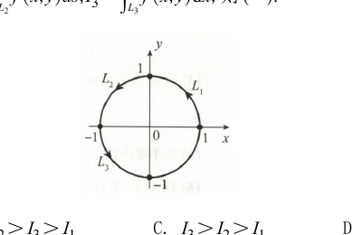

# 第九章 曲线积分与曲面积分

> 本章依据《880高数做题本》与《880数一解析》整理。已结合原题 PDF 校勘明显 OCR / 排印冲突，解析保留必要推导并补充关键知识点与技巧；公式统一使用美元符号语法。

## 基础题

### 一、选择题

<ExamQuestion>

**(1)** 设 $L$ 为圆周 $x^2+y^2=2x$，则 $I=\int_L x\mathrm{d}s=(\quad)$.

<ExamChoices>
<ExamOption>A. $2\pi$</ExamOption>
<ExamOption>B. $\pi$</ExamOption>
<ExamOption>C. $1$</ExamOption>
<ExamOption>D. $0$</ExamOption>
</ExamChoices>

<ExamSolution>

<ExamAnswer>A</ExamAnswer>

<ExamExplanation>
**解：** $L$ 的参数方程为 $\begin{cases} x = \cos t + 1, \\ y = \sin t, \end{cases}$ 则 $\mathrm{d}s = \sqrt{{x'_t}^2 + {y'_t}^2} \mathrm{d}t = \mathrm{d}t$, 故
$$I = \int_L x \, \mathrm{d}s = \int_0^{2\pi} (1 + \cos t) \mathrm{d}t = 2\pi,$$
选项 A 正确。

**注：** 也可利用质心(形心)坐标 $\bar{x} = 1$, 则
$$\int_L x \, \mathrm{d}s = \bar{x} \cdot \int_L \mathrm{d}s = 1 \times 2\pi = 2\pi \left(\int_L \mathrm{d}s \text{表示圆周长}\right).$$

**知识点：** 曲线积分与曲面积分的关键是先判断积分类型，再选择参数化、格林公式、斯托克斯公式或高斯公式。

**技巧总结：** 先处理“方向”和“投影/参数化”两个信息，再动手计算，能避免大多数符号与正负号错误。
</ExamExplanation>

</ExamSolution>

</ExamQuestion>

---

<ExamQuestion>

**(2)** 设 $S$ 为球面 $(x-a)^2+(y-b)^2+(z-c)^2=1(a,b,c \text{ 均大于零})$, 则 $I=\iint_S (x+y+z)\mathrm{d}S=(\quad)$.

<ExamChoices>
<ExamOption>A. $4\pi$</ExamOption>
<ExamOption>B. $4\pi(a+b+c)$</ExamOption>
<ExamOption>C. $0$</ExamOption>
<ExamOption>D. $\frac{4}{3}\pi(a+b+c)$</ExamOption>
</ExamChoices>

<ExamSolution>

<ExamAnswer>B</ExamAnswer>

<ExamExplanation>
**解：** 注意到 $S$ 分别关于平面 $x = a, y = b, z = c$ 对称, 则
$$\begin{aligned} I &= \iint_S (x + y + z) \mathrm{d}S = \iint_S [(x - a) + (y - b) + (z - c)] \mathrm{d}S + \iint_S (a + b + c) \mathrm{d}S \\ &= 0 + (a + b + c) \iint_S \mathrm{d}S = 4\pi (a + b + c), \end{aligned}$$
故选 B.

**注：** $\iint_S \mathrm{d}S$ 表示球面的表面积.

**知识点：** 第一类曲面（或曲线）积分本质是按面积（或弧长）加权，常用参数化、投影法与对称性化简。

**技巧总结：** 遇到球面、圆锥面、旋转曲面先观察对称性；奇函数项往往可直接积分为 $0$。
</ExamExplanation>

</ExamSolution>

</ExamQuestion>

---

<ExamQuestion>

**(3)** 设 $S: x^2+y^2+z^2=R^2(z\geqslant 0)$，$S_1$ 为 $S$ 在第一卦限的部分，则 $(\quad)$.

<ExamChoices>
<ExamOption>A. $\iint_S x\mathrm{d}S=4\iint_{S_1} x\mathrm{d}S$</ExamOption>
<ExamOption>B. $\iint_S y\mathrm{d}S=4\iint_{S_1} y\mathrm{d}S$</ExamOption>
<ExamOption>C. $\iint_S z\mathrm{d}S=4\iint_{S_1} z\mathrm{d}S$</ExamOption>
<ExamOption>D. $\iint_S xyz\mathrm{d}S=4\iint_{S_1} xyz\mathrm{d}S$</ExamOption>
</ExamChoices>

<ExamSolution>

<ExamAnswer>C</ExamAnswer>

<ExamExplanation>
**解：** 由 $z = z(x, y)$, 知 $z$ 关于 $x, y$ 均为偶函数, 故 $\iint_S z \, \mathrm{d}S = 4 \iint_{S_1} z \, \mathrm{d}S$.

由 $S$ 关于 $xOz$ 面, $yOz$ 面均对称, 知 $\iint_S x \, \mathrm{d}S = 0, \iint_S y \, \mathrm{d}S = 0, \iint_S xyz \, \mathrm{d}S = 0$, 而 $\iint_{S_1} x \, \mathrm{d}S > 0, \iint_{S_1} y \, \mathrm{d}S > 0$,
$$\iint_{S_1} xyz \, \mathrm{d}S > 0, \text{故排除选项 A, B, D, 选项 C 正确。}$$

**知识点：** 第一类曲面（或曲线）积分本质是按面积（或弧长）加权，常用参数化、投影法与对称性化简。

**技巧总结：** 遇到球面、圆锥面、旋转曲面先观察对称性；奇函数项往往可直接积分为 $0$。
</ExamExplanation>

</ExamSolution>

</ExamQuestion>

---

<ExamQuestion>

**(4)** 设 $D=\{(x,y)\mid (x-1)^2+(y-1)^2\leqslant 2\}, L$ 为 $D$ 的边界曲线，取顺时针方向，$I_1=\int_L x\mathrm{d}x+\frac{(x+y)^2}{8}\mathrm{d}y$,

$I_2=\int_L x\mathrm{d}x+\frac{(x-y)^2}{8}\mathrm{d}y, I_3=\int_L \frac{(x+y)^2}{8}\mathrm{d}x+y\mathrm{d}y$, 则 $(\quad)$.

<ExamChoices>
<ExamOption>A. $I_1>I_2>I_3$</ExamOption>
<ExamOption>B. $I_3>I_2>I_1$</ExamOption>
<ExamOption>C. $I_2>I_3>I_1$</ExamOption>
<ExamOption>D. $I_2>I_1>I_3$</ExamOption>
</ExamChoices>

<ExamSolution>

<ExamAnswer>B</ExamAnswer>

<ExamExplanation>
**解：** 区域 $D$ 如图 9-1 所示.
当 $(x, y) \in D$ 时, $0 \leqslant x + y \leqslant 4$.
应用格林公式, 有
$$\begin{aligned} I_1 &= -\iint_D \frac{x + y}{4} \, \mathrm{d}x\mathrm{d}y < 0, \quad I_3 = \iint_D \frac{x + y}{4} \, \mathrm{d}x\mathrm{d}y > 0, \\ I_2 &= -\iint_D \frac{x - y}{4} \, \mathrm{d}x\mathrm{d}y = -\frac{1}{4} \cdot \frac{1}{2} \iint_D (x - y + y - x) \, \mathrm{d}x\mathrm{d}y = 0 \\ &\quad (D \text{ 关于直线 } y = x \text{ 对称}). \end{aligned}$$

综上所述, $I_1 < I_2 < I_3$. 选项 B 正确。

**知识点：** 平面第二类曲线积分常用格林公式把闭曲线积分化为二重积分；非闭曲线可补线段闭合，路径无关则优先找势函数。

**技巧总结：** 先检查积分路径是否闭合、方向是否为逆时针；顺时针使用格林公式时整体要变号。
</ExamExplanation>

</ExamSolution>

</ExamQuestion>
### 二、填空题

<ExamQuestion>

**(1)** 设 $S$ 为平面 $x+y+z=4$ 被圆柱面 $x^2+y^2=1$ 截出的有限部分，则 $I=\iint_S z\mathrm{d}S=$ $\underline{\quad\quad\quad\quad}$ .

<ExamSolution>

<ExamAnswer>$4\sqrt{3}\pi$.</ExamAnswer>

<ExamExplanation>
**解：** 由 $S: z = 4 - x - y$, 得 $z_x' = -1, z_y' = -1$, 则 $\mathrm{d}S = \sqrt{1 + z_x'^2 + z_y'^2}\;\mathrm{d}x\mathrm{d}y = \sqrt{3}\;\mathrm{d}x\mathrm{d}y$,
故
$$
\begin{aligned}
\iint_S z\mathrm{d}S &= \iint_{D_{xy}} (4 - x - y) \cdot \sqrt{3}\;\mathrm{d}x\mathrm{d}y \\
&= \sqrt{3} \int_0^{2\pi}\mathrm{d}\theta \int_0^1 (4 - r\cos\theta - r\sin\theta)r\mathrm{d}r \\
&= 4\sqrt{3}\pi \quad (D_{xy}: x^2 + y^2 \leqslant 1).
\end{aligned}
$$

**知识点：** 第一类曲面（或曲线）积分本质是按面积（或弧长）加权，常用参数化、投影法与对称性化简。

**技巧总结：** 遇到球面、圆锥面、旋转曲面先观察对称性；奇函数项往往可直接积分为 $0$。
</ExamExplanation>

</ExamSolution>

</ExamQuestion>

---

<ExamQuestion>

**(2)** 设 $L$ 为 $x^2+y^2=R^2(y\geqslant 0)$ 上由点 $A\left(-\frac{R}{\sqrt{2}}, \frac{R}{\sqrt{2}}\right)$ 到点 $B(R,0)$ 的一段弧，则 $\int_L y\mathrm{d}s=$ $\underline{\quad\quad\quad\quad}$ , $\int_L y\mathrm{d}x=$ $\underline{\quad\quad\quad\quad}$ .

<ExamSolution>

<ExamAnswer>$\dfrac{2+\sqrt{2}}{2}R^2, \dfrac{3\pi+2}{8}R^2$.</ExamAnswer>

<ExamExplanation>
**解：** 弧 $\overset{\frown}{AB}$ 的图形如图 9-2 所示, 取 $x$ 为参数, 则弧 $\overset{\frown}{AB}$ 的方程为
$$
\begin{cases}
x = x, \\
y = \sqrt{R^2 - x^2}
\end{cases}
\left(-\frac{R}{\sqrt{2}} \leqslant x \leqslant R\right).
$$
$\mathrm{d}s = \sqrt{1 + y'^2}\;\mathrm{d}x = \frac{R}{\sqrt{R^2 - x^2}}\;\mathrm{d}x$,
故
$$
\begin{aligned}
\int_L y\mathrm{d}s &= \int_{-\frac{R}{\sqrt{2}}}^R \sqrt{R^2 - x^2} \cdot \frac{R}{\sqrt{R^2 - x^2}}\;\mathrm{d}x = \left(1 + \frac{1}{\sqrt{2}}\right)R^2 = \frac{2+\sqrt{2}}{2}R^2, \\
\int_L y\mathrm{d}x &= \int_{-\frac{R}{\sqrt{2}}}^R \sqrt{R^2 - x^2}\;\mathrm{d}x \overset{x = R\cos t}{=} -R^2 \int_{\frac{3\pi}{4}}^0 \sin^2 t\mathrm{d}t \\
&= R^2 \int_0^{\frac{3\pi}{4}} \frac{1 - \cos 2t}{2}\;\mathrm{d}t = \left(\frac{3\pi}{8} + \frac{1}{4}\right)R^2 = \frac{3\pi + 2}{8}R^2.
\end{aligned}
$$
**注：** 本题若取 $y$ 为参数, 由图 9-2 知, 曲线上的点与 $y$ 不是一一对应的, 则应将曲线 $L$ 分为 $\overset{\frown}{AC}$ 和 $\overset{\frown}{CB}$ 两段分别积分.

**知识点：** 曲线积分与曲面积分的关键是先判断积分类型，再选择参数化、格林公式、斯托克斯公式或高斯公式。

**技巧总结：** 先处理“方向”和“投影/参数化”两个信息，再动手计算，能避免大多数符号与正负号错误。
</ExamExplanation>

</ExamSolution>

</ExamQuestion>

---

<ExamQuestion>

**(3)** 设 $L$ 为球面 $x^2+y^2+z^2=R^2$ 与平面 $x+y+z=0$ 的交线，则 $I=\oint_L (z+x^2)\mathrm{d}s=$ $\underline{\quad\quad\quad\quad}$ .

<ExamSolution>

<ExamAnswer>$\dfrac{2\pi R^3}{3}$.</ExamAnswer>

<ExamExplanation>
**解：** 由于曲线 $L$: $\begin{cases} x^2 + y^2 + z^2 = R^2 \\ x + y + z = 0 \end{cases}$ 关于直线 $x = y = z$ 对称, 所以
$$
\begin{aligned}
\oint_L x^2\mathrm{d}s &= \frac{1}{3}\oint_L (x^2 + y^2 + z^2)\mathrm{d}s = \frac{1}{3}\oint_L R^2\mathrm{d}s, \\
\oint_L z\mathrm{d}s &= \frac{1}{3}\oint_L (x + y + z)\mathrm{d}s = \frac{1}{3}\oint_L 0\mathrm{d}s = 0,
\end{aligned}
$$
故
$$
I = \oint_L (z + x^2)\mathrm{d}s = 0 + \frac{1}{3}\oint_L R^2\mathrm{d}s = \frac{R^2}{3} \cdot 2\pi R = \frac{2\pi R^3}{3}.
$$

**知识点：** 曲线积分与曲面积分的关键是先判断积分类型，再选择参数化、格林公式、斯托克斯公式或高斯公式。

**技巧总结：** 先处理“方向”和“投影/参数化”两个信息，再动手计算，能避免大多数符号与正负号错误。
</ExamExplanation>

</ExamSolution>

</ExamQuestion>

---

<ExamQuestion>

**(4)** 设曲线 $L$ 为 $x^2+y^2+z^2=\frac{9}{2}$ 与 $x+z=1$ 的交线，则 $I=\oint_L (x^2+y^2+z^2)\mathrm{d}s=$ _________。

<ExamSolution>

<ExamAnswer>$18\pi$.</ExamAnswer>

<ExamExplanation>
**解：** 将 $x^2 + y^2 + z^2 = \frac{9}{2}$ 代入被积函数, 得 $I = \oint_L (x^2 + y^2 + z^2)\mathrm{d}s = \frac{9}{2}\oint_L \mathrm{d}s$.
交线 $L$ 的弧长不易直接计算, 考虑写出 $L$ 的参数式, 将 $L$: $\begin{cases} x^2 + y^2 + z^2 = \frac{9}{2} \\ x + z = 1 \end{cases}$ 变形为
$$
\begin{cases}
\left(x - \dfrac{1}{2}\right)^2 + \dfrac{y^2}{4} = 1, \\
x + z = 1.
\end{cases}
$$
令 $\dfrac{x - \dfrac{1}{2}}{\dfrac{\sqrt{2}}{2}} = \cos t, \dfrac{y}{2} = \sin t$, 则 $z = 1 - x = \frac{1}{2} - \sqrt{2}\cos t$, 即

$$x = \frac{1}{2} + \sqrt{2}\cos t, y = 2\sin t, z = \frac{1}{2} - \sqrt{2}\cos t \, (0 \leqslant t \leqslant 2\pi).$$
$${\rm d}s = \sqrt{{x'}^2(t) + {y'}^2(t) + {z'}^2(t)}\,{\rm d}t = \sqrt{(-\sqrt{2}\sin t)^2 + (2\cos t)^2 + (\sqrt{2}\sin t)^2}\,{\rm d}t = 2{\rm d}t,$$
故
$$I = \oint_L (x^2 + y^2 + z^2){\rm d}s = \frac{9}{2}\int_0^{2\pi} 2{\rm d}t = 18\pi.$$

**知识点：** 曲线积分与曲面积分的关键是先判断积分类型，再选择参数化、格林公式、斯托克斯公式或高斯公式。

**技巧总结：** 先处理“方向”和“投影/参数化”两个信息，再动手计算，能避免大多数符号与正负号错误。
</ExamExplanation>

</ExamSolution>

</ExamQuestion>

---

<ExamQuestion>

**(5)** 设曲面 $S: |x|+|y|+|z|=1$，则 $I=\iint_S (x+y+|z|)\mathrm{d}S=$ _________。

<ExamSolution>

<ExamAnswer>$\frac{4\sqrt{3}}{3}.$</ExamAnswer>

<ExamExplanation>
**解：** 由 $S$ 关于 $yOz$ 面、$xOy$ 面对称，$x$ 与 $y$ 是奇函数，故
$$\iint_S x{\rm d}S = \iint_S y{\rm d}S = 0.$$
又 $S$ 关于直线 $x = y = z$ 对称，由轮换性，知
$$I = \oint_S (x + y + |z|){\rm d}S$$
$$= 0 + 0 + \frac{1}{3}\oint_S (|x| + |y| + |z|){\rm d}S$$
$$= \frac{1}{3}\oint_S {\rm d}S.$$

$S$ 由八块等边三角形组成，等边三角形边长为 $\sqrt{2}$ (见图 9-3)，故 $S$ 的面积为
$$8 \cdot \frac{1}{2} \cdot (\sqrt{2})^2 \cdot \sin\frac{\pi}{3} = 4\sqrt{3},$$
所以 $I = \frac{1}{3} \times 4\sqrt{3} = \frac{4\sqrt{3}}{3}.$

**知识点：** 第一类曲面（或曲线）积分本质是按面积（或弧长）加权，常用参数化、投影法与对称性化简。

**技巧总结：** 遇到球面、圆锥面、旋转曲面先观察对称性；奇函数项往往可直接积分为 $0$。
</ExamExplanation>

</ExamSolution>

</ExamQuestion>

---

<ExamQuestion>

**(6)** 设 $\Sigma: (x-a)^2+(y-a)^2+(z-a)^2=2a^2(a>0)$，则 $I=\iint_\Sigma (x+y+z-\sqrt{3}a)\mathrm{d}S=$ _________。

<ExamSolution>

<ExamAnswer>见解析</ExamAnswer>

<ExamExplanation>
**解：** $8(3 - \sqrt{3})\pi a^3.$

解法1 $\Sigma$ 上任一点 $(x, y, z)$ 处的单位外法向量为
$$n^0 = \{\cos\alpha, \cos\beta, \cos\gamma\} = \frac{1}{\sqrt{(x - a)^2 + (y - a)^2 + (z - a)^2}} \cdot \{x - a, y - a, z - a\}$$
$$= \frac{1}{\sqrt{2}a}\{x - a, y - a, z - a\},$$
则
$$I = \iint_{\Sigma} (x + y + z - \sqrt{3}a)\,{\rm d}S = \iint_{\Sigma} [(x - a) + (y - a) + (z - a) + (3 - \sqrt{3})a]\,{\rm d}S$$
$$= \sqrt{2}a\iint_{\Sigma} (\cos\alpha + \cos\beta + \cos\gamma)\,{\rm d}S + (3 - \sqrt{3})a\iint_{\Sigma} {\rm d}S$$
$$= \sqrt{2}a\iint_{\Sigma} ({\rm d}y{\rm d}z + {\rm d}z{\rm d}x + {\rm d}x{\rm d}y) + (3 - \sqrt{3})a \cdot 8\pi a^2$$
$$\overset{\text{高斯公式}}{=} \sqrt{2}a\iiint_V 0\,{\rm d}V + 8(3 - \sqrt{3})\pi a^3$$
$$= 8(3 - \sqrt{3})\pi a^3.$$

解法2 利用对称性
$$I = \iint_{\Sigma} (x + y + z - \sqrt{3}a)\,{\rm d}S$$
$$= \iint_{\Sigma} [(x - a) + (y - a) + (z - a) + (3 - \sqrt{3})a]\,{\rm d}S$$
$$= 0 + 0 + 0 + \iint_{\Sigma} (3 - \sqrt{3})a\,{\rm d}S$$
$$= (3 - \sqrt{3})a \cdot 8\pi a^2 = 8(3 - \sqrt{3})\pi a^3,$$
其中 $\iint_{\Sigma} (x - a){\rm d}S = \iint_{\Sigma} (y - a){\rm d}S = \iint_{\Sigma} (z - a){\rm d}S = 0.$

**知识点：** 第二类曲面积分在闭曲面上优先考虑高斯公式，将通量化为散度的三重积分。

**技巧总结：** 若被积场在区域内有奇点，应先挖去小球或作适当辅助面，再分别处理附加曲面的通量。
</ExamExplanation>

</ExamSolution>

</ExamQuestion>

---

<ExamQuestion>

**(7)** 设 $L$ 为点 $(1,-1,2)$ 到点 $(2,1,3)$ 的直线段，则 $I=\int_L (x^2+y^2+z^2)\mathrm{d}s=$ _________。

<ExamSolution>

<ExamAnswer>$9\sqrt{6}$</ExamAnswer>

<ExamExplanation>
**解：** 两点连线 $L$ 的方向向量为 $S = (1, 2, 1)$, 故 $L$ 的方程为
$$\frac{x - 1}{1} = \frac{y + 1}{2} = \frac{z - 2}{1}, 1 \leqslant x \leqslant 2,$$
其参数方程为
$$\left\{\begin{array}{l}
x = 1 + t, \\
y = -1 + 2t, (0 \leqslant t \leqslant 1), \\
z = 2 + t
\end{array}\right.$$
则 $\text{d}s = \sqrt{{x'}^2(t) + {y'}^2(t) + {z'}^2(t)}\,\text{d}t = \sqrt{6}\,\text{d}t$, 故
$$
\begin{aligned}
I &= \int_L (x^2 + y^2 + z^2)\,\text{d}s = \int_0^1 \sqrt{6}\left[(1 + t)^2 + (-1 + 2t)^2 + (2 + t)^2\right]\text{d}t \\
&= \sqrt{6} \int_0^1 (6 + 2t + 6t^2)\text{d}t = 9\sqrt{6}.
\end{aligned}
$$

**知识点：** 曲线积分与曲面积分的关键是先判断积分类型，再选择参数化、格林公式、斯托克斯公式或高斯公式。

**技巧总结：** 先处理“方向”和“投影/参数化”两个信息，再动手计算，能避免大多数符号与正负号错误。
</ExamExplanation>

</ExamSolution>

</ExamQuestion>

---

<ExamQuestion>

**(8)** 设曲线 $L$ 为上半圆周 $y=\sqrt{1-x^2}$，则 $\int_L (x-y)^2\mathrm{e}^{x^2+y^2}\mathrm{d}s=$ _________。

<ExamSolution>

<ExamAnswer>$\pi e$</ExamAnswer>

<ExamExplanation>
**解：** 将曲线 $L$ 的方程代入被积函数, 得
$$\int_L (x - y)^2 e^{x^2 + y^2}\,\text{d}s = \int_L (1 - 2xy) e\,\text{d}s = e \int_L \text{d}s - 2e \int_L xy\,\text{d}s.$$
又 $L$ 关于 $y$ 轴对称, $xy$ 关于 $x$ 是奇函数, 故 $\int_L xy\,\text{d}s = 0$, 从而
$$\int_L (x - y)^2 e^{x^2 + y^2}\,\text{d}s = e \int_L \text{d}s + 0 = \pi e.$$

**知识点：** 曲线积分与曲面积分的关键是先判断积分类型，再选择参数化、格林公式、斯托克斯公式或高斯公式。

**技巧总结：** 先处理“方向”和“投影/参数化”两个信息，再动手计算，能避免大多数符号与正负号错误。
</ExamExplanation>

</ExamSolution>

</ExamQuestion>

---

<ExamQuestion>

**(9)** 设立体 $\Omega$ 为 $x^2+y^2+z^2\leqslant 2z$，其密度 $\rho(x,y,z)=x^2$，则 $\Omega$ 的质量为 _________。

<ExamSolution>

<ExamAnswer>见解析</ExamAnswer>

<ExamExplanation>
**解：** $\frac{4}{15}\pi$。

[解法1] $\Omega$ 的质量为
$$
\begin{aligned}
m &= \iiint_\Omega x^2\,\text{d}V = \int_{-1}^1 \text{d}x \iint_{D_x} x^2\,\text{d}y\,\text{d}z = \int_{-1}^1 \pi x^2(1 - x^2)\,\text{d}x \\
&= 2 \int_0^1 \pi x^2(1 - x^2)\,\text{d}x = 2\pi \left(\frac{1}{3} - \frac{1}{5}\right) = \frac{4}{15}\pi.
\end{aligned}
$$

[解法2] 利用球面坐标计算:
$$
\begin{aligned}
m &= \int_0^{2\pi} \text{d}\theta \int_0^{\frac{\pi}{2}} \text{d}\varphi \int_0^{2\cos\varphi} r^2 \sin\varphi \cos^2\theta \cdot r^2 \sin\varphi\,\text{d}r \\
&= \int_0^{2\pi} \cos^2\theta\,\text{d}\theta \int_0^{\frac{\pi}{2}} \sin^3\varphi \cdot \frac{1}{5}r^5 \Big|_0^{2\cos\varphi}\,\text{d}\varphi \\
&= \pi \cdot \frac{32}{5} \int_0^{\frac{\pi}{2}} (1 - \cos^2\varphi)\cos^5\varphi\,\text{d}(-\cos\varphi) \\
&= \frac{32\pi}{5} \left(\frac{1}{6} - \frac{1}{8}\right) = \frac{4}{15}\pi.
\end{aligned}
$$

**知识点：** 第一类曲面（或曲线）积分本质是按面积（或弧长）加权，常用参数化、投影法与对称性化简。

**技巧总结：** 遇到球面、圆锥面、旋转曲面先观察对称性；奇函数项往往可直接积分为 $0$。
</ExamExplanation>

</ExamSolution>

</ExamQuestion>
### 三、解答题

<ExamQuestion>

**(1)** 设 $L$ 为由 $r=a(a>0)$，$\theta=0$ 和 $\theta=\frac{\pi}{4}$ 所围凸平面区域的边界，$(r,\theta)$ 为极坐标，计算 $I=\int_L \mathrm{e}^{\sqrt{x^2+y^2}}\mathrm{d}s$。

<ExamSolution>

<ExamAnswer>见解析</ExamAnswer>

<ExamExplanation>
**解：** 计算第一型曲线积分时要化为定积分, 关键是正确写出积分曲线的参数方程.

$L$ 由如图 9-4 所示的 $L_1, L_2, L_3$ 三条曲线构成.

$L_1: \left\{\begin{array}{l}y = 0, \\ x = x,\end{array}\right.$ 因 $\text{d}s = \text{d}x$, 则 $\int_{L_1} e^{\sqrt{x^2+y^2}}\,\text{d}s = \int_0^a e^x\,\text{d}x = e^a - 1$;

$L_2: \left\{\begin{array}{l}x = a\cos t, \\ y = a\sin t\end{array}\right. \left(0 \leqslant t \leqslant \frac{\pi}{4}\right)$, 则
$$\int_{L_2} e^{\sqrt{x^2+y^2}}\,\text{d}s = \int_0^{\frac{\pi}{4}} e^a \sqrt{a^2\sin^2 t + a^2\cos^2 t}\,\text{d}t = \frac{\pi}{4}a e^a;$$

$L_3: \left\{\begin{array}{l}y = x, \\ x = x,\end{array}\right.$ $\text{d}s = \sqrt{1^2 + 1^2}\,\text{d}x = \sqrt{2}\,\text{d}x$, 则
$$\int_{L_3} e^{\sqrt{x^2+y^2}}\,\text{d}s = \int_0^{\frac{\sqrt{2}}{2}a} e^{\sqrt{2}x} \cdot \sqrt{2}\,\text{d}x = e^a - 1,$$

故 $I = e^x - 1 + \frac{\pi}{4}a e^x + e^x - 1 = \left(\frac{\pi}{4}a + 2\right)e^x - 2.$

**注：** 计算第一型曲线积分 $\int_L f(x, y, z) \mathrm{d}s$ 应掌握：
① 计算公式，写出 $L$ 的参数方程，化为定积分计算，即“变量参数化，计算定积分，上限大于下限”；
② 将 $L$ 的方程代入被积函数化简；
③ 对称性包括奇偶性和轮换对称性（与二重积分、三重积分对称性类似）。

**知识点：** 曲线积分与曲面积分的关键是先判断积分类型，再选择参数化、格林公式、斯托克斯公式或高斯公式。

**技巧总结：** 先处理“方向”和“投影/参数化”两个信息，再动手计算，能避免大多数符号与正负号错误。
</ExamExplanation>

</ExamSolution>

</ExamQuestion>

---

<ExamQuestion>

**(2)** 设 $L$ 为 $\left(x-\frac{1}{2}\right)^2+y^2=\frac{1}{4}(y\geqslant 0)$ 上从点 $O(0,0)$ 到点 $A(1,0)$ 的一段弧，计算
$$I=\int_L \left[3+(2-\sqrt{2})y+\mathrm{e}^x\sin y\right]\mathrm{d}x+(\sqrt{2}x+\mathrm{e}^x\cos y)\mathrm{d}y.$$

<ExamSolution>

<ExamAnswer>见解析</ExamAnswer>

<ExamExplanation>
**解：** 记 $P = 3 + (2 - \sqrt{2})y + e^x \sin y, Q = \sqrt{2}x + e^x \cos y$，则
$$\frac{\partial Q}{\partial x} - \frac{\partial P}{\partial y} = 2\sqrt{2} - 2.$$
加线段 $\overline{AO}$：$\begin{cases} y = 0, \\ x = x, \end{cases}$ 如图 9-5 所示，$L$ 与线段 $\overline{AO}$ 构成闭区域 $D$。利用格林公式，得
$$I = -\iint_D \left(\frac{\partial Q}{\partial x} - \frac{\partial P}{\partial y}\right) \mathrm{d}x\mathrm{d}y - \int_{\overline{AO}} [3 + (2 - \sqrt{2})y + e^x \sin y]\mathrm{d}x + (\sqrt{2}x + e^x \cos y)\mathrm{d}y$$
$$= -\iint_D (2\sqrt{2} - 2)\mathrm{d}x\mathrm{d}y + \int_0^1 3\mathrm{d}x = (2 - 2\sqrt{2}) \times \frac{1}{2} \times \pi \times \left(\frac{1}{2}\right)^2 + 3 = \frac{(1 - \sqrt{2})\pi}{4} + 3.$$

**注：** 此题在利用格林公式时，由于 $L + \overline{AO}$ 是顺时针方向，所以应取“$-”$号。

**知识点：** 平面第二类曲线积分常用格林公式把闭曲线积分化为二重积分；非闭曲线可补线段闭合，路径无关则优先找势函数。

**技巧总结：** 先检查积分路径是否闭合、方向是否为逆时针；顺时针使用格林公式时整体要变号。
</ExamExplanation>

</ExamSolution>

</ExamQuestion>

---

<ExamQuestion>

**(3)** 计算积分 $I=\oint_L \frac{x\mathrm{d}y-y\mathrm{d}x}{x^2+y^2}$，其中

(I) $L$ 为 $(x+2)^2+(y-2)^2=1$，取逆时针方向；

(II) $L$ 为 $x^2+y^2=1$，取逆时针方向；

(III) $L$ 为 $\frac{x^2}{a^2}+\frac{y^2}{b^2}=1$，取逆时针方向。

<ExamSolution>

<ExamAnswer>见解析</ExamAnswer>

<ExamExplanation>
**解：** (I) 记 $P = \frac{-y}{x^2 + y^2}, Q = \frac{x}{x^2 + y^2}$，则 $P$ 与 $Q$ 在 $D_1: (x+2)^2 + (y-2)^2 \leqslant 1$ 上有一阶连续偏导数，且
$$\frac{\partial Q}{\partial x} - \frac{\partial P}{\partial y} = \frac{y^2 - x^2}{(x^2 + y^2)^2}.$$
由格林公式，得
$$I = \oint_L \frac{x\mathrm{d}y - y\mathrm{d}x}{x^2 + y^2} = \iint_{D_1} \left(\frac{\partial Q}{\partial x} - \frac{\partial P}{\partial y}\right)\mathrm{d}x\mathrm{d}y = 0.$$

(II) 由于 $P$ 与 $Q$ 及 $\frac{\partial Q}{\partial x}$ 和 $\frac{\partial P}{\partial y}$ 在 $x^2 + y^2 < 1$ 内的点 $(0,0)$ 处没有定义，所以不能直接利用格林公式，直接利用 $L$ 的参数方程 $\begin{cases} x = \cos t, \\ y = \sin t, \end{cases}$ 计算，得
$$I = \oint_L \frac{x\mathrm{d}y - y\mathrm{d}x}{x^2 + y^2} = \int_0^{2\pi} \frac{\cos^2 t + \sin^2 t}{1} \mathrm{d}t = 2\pi.$$

(III) 由于 $P$ 与 $Q$ 及 $\frac{\partial Q}{\partial x}$ 和 $\frac{\partial P}{\partial y}$ 在椭圆 $\frac{x^2}{a^2} + \frac{y^2}{b^2} < 1$ 内的点 $(0,0)$ 处没有定义，故不能直接利用格林公式。
考虑在 $L: \frac{x^2}{a^2} + \frac{y^2}{b^2} = 1$ 内作一个半径充分小的圆 $L_r: \begin{cases} x = r\cos t, \\ y = r\sin t, \end{cases}$ 取顺时针方向，$|r| \ll 1 (0 \leqslant t \leqslant 2\pi)$，挖去点 $(0,0)$，在 $L + L_r^-$ 所围的区域 $D_2$ 上用格林公式，得
$$\oint_{L + L_r^-} \frac{x\mathrm{d}y - y\mathrm{d}x}{x^2 + y^2} = \iint_{D_2} \left(\frac{\partial Q}{\partial x} - \frac{\partial P}{\partial y}\right)\mathrm{d}x\mathrm{d}y = \iint_{D_2} 0\mathrm{d}x\mathrm{d}y = 0,$$
故
$$I = \oint_L \frac{x\mathrm{d}y - y\mathrm{d}x}{x^2 + y^2} = \oint_{L_r} \frac{x\mathrm{d}y - y\mathrm{d}x}{x^2 + y^2} = \int_0^{2\pi} \frac{r^2(\cos^2 t + \sin^2 t)}{r^2} \mathrm{d}t = 2\pi,$$
其中 $L_r$ 为逆时针方向。

**知识点：** 平面第二类曲线积分常用格林公式把闭曲线积分化为二重积分；非闭曲线可补线段闭合，路径无关则优先找势函数。

**技巧总结：** 先检查积分路径是否闭合、方向是否为逆时针；顺时针使用格林公式时整体要变号。
</ExamExplanation>

</ExamSolution>

</ExamQuestion>

---

<ExamQuestion>

**(4)** 设 $L:x^2+y^2=R^2(R>1)$，取逆时针方向，计算 $I=\oint_L \frac{x\mathrm{d}y-y\mathrm{d}x}{4x^2+9y^2}$。

<ExamSolution>

<ExamAnswer>见解析</ExamAnswer>

<ExamExplanation>
**解：** 记 $P = \frac{-y}{4x^2 + 9y^2}, Q = \frac{x}{4x^2 + 9y^2}$，则 $\frac{\partial Q}{\partial x} - \frac{\partial P}{\partial y} = \frac{9y^2 - 4x^2}{(4x^2 + 9y^2)^2}.$
由于 $P$ 与 $Q$ 及 $\frac{\partial Q}{\partial x}$ 和 $\frac{\partial P}{\partial y}$ 在 $x^2 + y^2 < R^2$ 内的点 $(0,0)$ 处没有定义，不能直接利用格林公式，考虑到被

积分表达式的分母为 $4x^2+9y^2$, 在 $x^2+y^2=R^2$ 内部作一个小的椭圆：
$$L_r: \begin{cases} x = \frac{1}{2} r \cos t, \\ y = \frac{1}{3} r \sin t, \end{cases}$$
$r$ 充分小, 取顺时针方向, 则在 $L+L_r$ 所围区域 $D$ 上用格林公式, 有
$$\oint_{L+L_r} \frac{x\,\mathrm{d}y - y\,\mathrm{d}x}{4x^2+9y^2} = \iint_D \left(\frac{\partial Q}{\partial x} - \frac{\partial P}{\partial y}\right)\mathrm{d}x\mathrm{d}y = 0,$$
故
$$\begin{aligned}
I &= \oint_L \frac{x\,\mathrm{d}y - y\,\mathrm{d}x}{4x^2+9y^2} = \oint_{L_r} \frac{x\,\mathrm{d}y - y\,\mathrm{d}x}{4x^2+9y^2} \\
&= \frac{1}{r^2} \oint_{L_r} x\,\mathrm{d}y - y\,\mathrm{d}x = \int_0^{2\pi} \frac{1}{6}(\cos^2 t + \sin^2 t)\,\mathrm{d}t = \frac{\pi}{3},
\end{aligned}$$
其中 $L$ 为逆时针方向。

**知识点：** 平面第二类曲线积分常用格林公式把闭曲线积分化为二重积分；非闭曲线可补线段闭合，路径无关则优先找势函数。

**技巧总结：** 先检查积分路径是否闭合、方向是否为逆时针；顺时针使用格林公式时整体要变号。
</ExamExplanation>

</ExamSolution>

</ExamQuestion>

---

<ExamQuestion>

**(5)** 设曲线 $L:x^2+y^2=R^2(R>0)$，取逆时针方向，问 $R$ 为何值时，积分 $I(R)=\oint_L y^3\mathrm{d}x+(3x-x^3)\mathrm{d}y$ 取得最大值，并求最大值。

<ExamSolution>

<ExamAnswer>见解析</ExamAnswer>

<ExamExplanation>
**解：** $L$ 为闭曲线, 利用格林公式, 记 $P = y^3, Q = 3x - x^3$,
$$\begin{aligned}
I(R) &= \oint_L y^3\,\mathrm{d}x + (3x - x^3)\mathrm{d}y = \iint_D (3 - 3x^2 - 3y^2)\,\mathrm{d}x\mathrm{d}y \\
&= 3\iint_D (1 - x^2 - y^2)\,\mathrm{d}x\mathrm{d}y = 3\int_0^{2\pi}\mathrm{d}\theta\int_0^R (1 - r^2)r\,\mathrm{d}r \\
&= 6\pi \left(\frac{r^2}{2} - \frac{r^4}{4}\right)\Bigg|_0^R = 3\pi \left(R^2 - \frac{R^4}{2}\right).
\end{aligned}$$
由 $\frac{\mathrm{d}[I(R)]}{\mathrm{d}R} = 6\pi(R - R^3) = 0$, 得 $R = 1$, 且
$$\left.\frac{\mathrm{d}^2[I(R)]}{\mathrm{d}R^2}\right|_{R=1} = 6\pi(1 - 3R^2)\Big|_{R=1} = -12\pi < 0,$$
故 $R = 1$ 是唯一极大值点, 也是最大值点, 最大值为 $I(1) = \frac{3}{2}\pi$.

**知识点：** 平面第二类曲线积分常用格林公式把闭曲线积分化为二重积分；非闭曲线可补线段闭合，路径无关则优先找势函数。

**技巧总结：** 先检查积分路径是否闭合、方向是否为逆时针；顺时针使用格林公式时整体要变号。
</ExamExplanation>

</ExamSolution>

</ExamQuestion>

---

<ExamQuestion>

**(6)** 设平面力场为 $\boldsymbol{F}=(2xy^3-y^2\cos x)\boldsymbol{i}+(1-2y\sin x+3x^2y^2)\boldsymbol{j}$，求质点在 $\boldsymbol{F}$ 作用下，沿 $L:2x=\pi y^2$ 从点 $O(0,0)$ 到点 $A\left(\frac{\pi}{2}, 1\right)$ 所做的功 $W$。

<ExamSolution>

<ExamAnswer>见解析</ExamAnswer>

<ExamExplanation>
**解：** 依题意, 有
$$W = \int_L \mathbf{F} \cdot \mathrm{d}\mathbf{S} = \int_L (2xy^3 - y^2\cos x)\mathrm{d}x + (1 - 2y\sin x + 3x^2y^2)\mathrm{d}y.$$
选取 $y$ 为参数, 则 $L: \begin{cases} x = \frac{\pi}{2} y^2, \\ y = y, \end{cases}$ $y$ 从 $0$ 到 $1$, 故
$$W = \int_0^1 \left[\left(2 \cdot \frac{\pi}{2} \cdot y^2 \cdot y^3 - y^2 \cdot \cos \frac{\pi}{2}y^2\right)\pi y + 1 - 2y\sin \frac{\pi}{2}y^2 + 3 \cdot \left(\frac{\pi}{2}\right)^2 y^4 \cdot y^2\right]\mathrm{d}y$$
$$= \frac{\pi^2}{4}.$$

**知识点：** 曲线积分与曲面积分的关键是先判断积分类型，再选择参数化、格林公式、斯托克斯公式或高斯公式。

**技巧总结：** 先处理“方向”和“投影/参数化”两个信息，再动手计算，能避免大多数符号与正负号错误。
</ExamExplanation>

</ExamSolution>

</ExamQuestion>

---

<ExamQuestion>

**(7)** 计算 $I=\int_L \frac{x\mathrm{d}y-y\mathrm{d}x}{x^2+y^2}$，其中 $L$ 是从点 $A(1,1)$ 沿直线到点 $B(-1,0)$，再沿曲线 $y=x^2-1$ 到点 $C(1,0)$。

<ExamSolution>

<ExamAnswer>见解析</ExamAnswer>

<ExamExplanation>
**解：** 解法1 因为 $\frac{\partial Q}{\partial x} = \frac{\partial P}{\partial y} = \frac{y^2 - x^2}{(x^2 + y^2)^2}$, 所以不含点 $(0,0)$ 的区域内, 积分与路径无关。如图 9-6 所示, 取
$$AD: \begin{cases} y = 1, \\ x = x, \end{cases} \quad DB: \begin{cases} x = -1, \\ y = y, \end{cases} \quad BEC: \begin{cases} x = \cos t, \\ y = \sin t, \end{cases}$$
故
$$\begin{aligned}
I &= \int_1^{-1} \frac{-\mathrm{d}x}{1+x^2} + \int_1^0 \frac{-\mathrm{d}y}{1+y^2} + \int_\pi^{2\pi} \frac{\cos^2 t + \sin^2 t}{1}\mathrm{d}t \\
&= -\left(\frac{\pi}{4} - \frac{\pi}{4}\right) - \left(0 - \frac{\pi}{4}\right) + (2\pi - \pi) \\
&= \frac{7\pi}{4}.
\end{aligned}$$

解法2 用格林公式。
连接 $\overline{CA}$: $\begin{cases} x = 1, \\ y = y, \end{cases}$ $l: \begin{cases} x = \delta \cos t, \\ y = \delta \sin t, \end{cases}$ ($\delta$ 充分小) 取顺时针方向, 则

$$I = \int_L \frac{x\,\mathrm{d}y - y\,\mathrm{d}x}{x^2 + y^2} = \oint_{\overset{\frown}{ABECA}} \frac{x\,\mathrm{d}y - y\,\mathrm{d}x}{x^2 + y^2} - \int_{\overline{CA}} - \oint_{l_{\text{顺}}},$$
$$\oint_{\overset{\frown}{ABECA}} \frac{x\,\mathrm{d}y - y\,\mathrm{d}x}{x^2 + y^2} = \iint_D \left(\frac{\partial Q}{\partial x} - \frac{\partial P}{\partial y}\right)\,\mathrm{d}x\,\mathrm{d}y = 0,$$
故
$$I = \oint_{l_{\text{逆}}} - \int_{\overline{CA}} = \int_0^{2\pi} \frac{\delta^2}{\delta^2}\,\mathrm{d}t - \int_0^1 \frac{\mathrm{d}y}{1+y^2} = 2\pi - \frac{\pi}{4} = \frac{7\pi}{4}.$$

**注：** 解法1利用积分与路径无关,不能取 $\overline{CA}$ 的原因是闭环线 $\widehat{ABEC} + \overline{CA}$ 中含 $(0,0)$, 而 $\frac{\partial Q}{\partial x} = \frac{\partial P}{\partial y} = \frac{y^2 - x^2}{(x^2 + y^2)^2}$ 在点 $(0,0)$ 处没有意义。

**知识点：** 平面第二类曲线积分常用格林公式把闭曲线积分化为二重积分；非闭曲线可补线段闭合，路径无关则优先找势函数。

**技巧总结：** 先检查积分路径是否闭合、方向是否为逆时针；顺时针使用格林公式时整体要变号。
</ExamExplanation>

</ExamSolution>

</ExamQuestion>

---

<ExamQuestion>

**(8)** 设 $P(x,y)=\frac{x\left(\sqrt{x^2+y^2}\right)^k}{y}, Q(x,y)=-\frac{x^2\left(\sqrt{x^2+y^2}\right)^k}{y^2}, D=\{(x,y)\mid y>0\}$。

$(I)$ 若积分 $I=\int_L P\mathrm{d}x+Q\mathrm{d}y$ 在 $D$ 内与路径无关，求 $k$ 的值；

$(II)$ 在 $D$ 内求函数 $u(x,y)$，使得 $\mathrm{d}u=P\mathrm{d}x+Q\mathrm{d}y$，并计算 $I=\int_{(1,1)}^{(2,2)} P\mathrm{d}x+Q\mathrm{d}y$。

<ExamSolution>

<ExamAnswer>见解析</ExamAnswer>

<ExamExplanation>
**解：** (I) 由于 $D$ 是单连通区域, 且 $P(x,y), Q(x,y)$ 在 $D$ 内有连续偏导数, 故
$$\int_L P\,\mathrm{d}x + Q\,\mathrm{d}y \text{ 在 } D \text{ 内与路径无关} \Rightarrow \frac{\partial Q}{\partial x} = \frac{\partial P}{\partial y},$$
即
$$-\frac{2x}{y^2}(\sqrt{x^2+y^2})^k - \frac{x^2}{y^2}k(\sqrt{x^2+y^2})^{k-1} \cdot \frac{x}{\sqrt{x^2+y^2}}$$
$$= -\frac{x}{y^2}(\sqrt{x^2+y^2})^k + \frac{x}{y}k(\sqrt{x^2+y^2})^{k-1} \cdot \frac{y}{\sqrt{x^2+y^2}},$$
等式两边同时除以 $\frac{x}{y^2}(\sqrt{x^2+y^2})^{k-2}$, 得 $-2(x^2+y^2) - kx^2 = -(x^2+y^2) + ky^2$, 即 $(k+1)(x^2+y^2) = 0$, 解得 $k = -1$.

(II) 由 (I) 知, 当 $k = -1$ 时, 存在 $u(x,y)$, 使得 $\mathrm{d}u = P\,\mathrm{d}x + Q\,\mathrm{d}y$. 用积分求 $u(x,y)$.
由 $\frac{\partial u}{\partial x} = P(x,y) = \frac{x}{y\sqrt{x^2+y^2}}$, 可知
$$u(x,y) = \int \frac{x}{y\sqrt{x^2+y^2}}\,\mathrm{d}x + \varphi_1(y) = \frac{\sqrt{x^2+y^2}}{y} + \varphi(y),$$
其中 $\varphi(y) = \varphi_1(y) + C_1$. 又因为
$$\frac{\partial u}{\partial y} = -\frac{1}{y^2}\sqrt{x^2+y^2} + \frac{1}{y} \cdot \frac{y}{\sqrt{x^2+y^2}} + \varphi'(y)$$
$$= \frac{-(x^2+y^2) + y^2}{y^2\sqrt{x^2+y^2}} + \varphi'(y)$$
$$= \frac{-x^2}{y^2\sqrt{x^2+y^2}} + \varphi'(y) = Q(x,y),$$
所以 $\varphi'(y) = 0$, 即 $\varphi(y) = C$, 从而有
$$u(x,y) = \frac{\sqrt{x^2+y^2}}{y} + C \ (C \text{ 为任意常数}).$$
$$I = \int_{(1,1)}^{(2,2)} P\,\mathrm{d}x + Q\,\mathrm{d}y = u(x,y)\Big|_{(1,1)}^{(2,2)} = \left(\frac{\sqrt{x^2+y^2}}{y} + C\right)\Big|_{(1,1)}^{(2,2)} = 0.$$

**知识点：** 在单连通区域内，若 $P_y=Q_x$，则 $P\,\mathrm{d}x+Q\,\mathrm{d}y$ 为全微分，积分与路径无关。

**技巧总结：** 求势函数时先对 $P$ 关于 $x$ 积分，再用 $u_y=Q$ 确定只含 $y$ 的补项，通常最稳妥。
</ExamExplanation>

</ExamSolution>

</ExamQuestion>

---

<ExamQuestion>

**(9)** 设曲线 $L$ 为 $z=4-x^2-y^2$ 与 $z=3$ 的交线，从 $z$ 轴正向看是逆时针方向，计算 $I=\oint_L x^2y^3\mathrm{d}x+z\mathrm{d}y+y\mathrm{d}z$。

<ExamSolution>

<ExamAnswer>见解析</ExamAnswer>

<ExamExplanation>
**解：** 解法1 如图 9-7 所示, 曲线 $L$: $\begin{cases} x^2 + y^2 = 1, \\ z = 3, \end{cases}$ 消去 $z$, 得
$\begin{cases} x^2 + y^2 = 1, \\ z = 3, \end{cases}$ 故其参数方程为 $\begin{cases} x = \cos t, \\ y = \sin t, \\ z = 3, \end{cases} (0 \leqslant t \leqslant 2\pi)$.
$$I = \oint_L x^2y^3\,\mathrm{d}x + z\,\mathrm{d}y + y\,\mathrm{d}z$$
$$= \int_0^{2\pi} [\cos^2 t \sin^3 t(-\sin t) + 3\cos t + 0]\,\mathrm{d}t = -\frac{\pi}{8}.$$

解法2 利用斯托克斯公式, 考虑 $L$ 在平面 $z=3$ 上, 则
$$
I = \oint_L x^2 y^3 \mathrm{d}x + z\mathrm{d}y + y\mathrm{d}z = \iint_S
\begin{vmatrix}
\cos\alpha & \cos\beta & \cos\gamma \\
\frac{\partial}{\partial x} & \frac{\partial}{\partial y} & \frac{\partial}{\partial z} \\
x^2 y^3 & z & y
\end{vmatrix}
\mathrm{d}S.
$$
由 $z=3$, 知单位法向量为 $(\cos\alpha,\cos\beta,\cos\gamma) = (0,0,1)$, 故
$$
I = \iint_S
\begin{vmatrix}
0 & 0 & 1 \\
\frac{\partial}{\partial x} & \frac{\partial}{\partial y} & \frac{\partial}{\partial z} \\
x^2 y^3 & z & y
\end{vmatrix}
\mathrm{d}S = -\iint_S 3x^2 y^2 \mathrm{d}S.
$$
对 $S: z=3$, 有 $\mathrm{d}S = \sqrt{1 + z_x^{\prime 2} + z_y^{\prime 2}}\mathrm{d}x\mathrm{d}y = \mathrm{d}x\mathrm{d}y$, 故
$$
\begin{aligned}
I &= -\iint_{D_{xy}} 3x^2 y^2 \mathrm{d}x\mathrm{d}y = -3\int_0^{2\pi}\mathrm{d}\theta \int_0^1 r^2\cos^2\theta \cdot r^2\sin^2\theta \cdot r\mathrm{d}r \\
&= -3\int_0^{2\pi} \cos^2\theta\sin^2\theta\mathrm{d}\theta \int_0^1 r^5\mathrm{d}r = -\frac{1}{2}\int_0^{2\pi} (1 - \sin^2\theta)\sin^2\theta\mathrm{d}\theta \\
&= -\frac{1}{2}\left(\int_0^{2\pi} \sin^2\theta\mathrm{d}\theta - \int_0^{2\pi} \sin^4\theta\mathrm{d}\theta\right) = -\frac{\pi}{8},
\end{aligned}
$$
其中 $D_{xy}: x^2 + y^2 \le 1$.

**注：** ① 计算空间曲线积分有两种方法:
(i) 利用参数方程化为定积分计算;
(ii) 对于空间闭曲线 $L$, 可利用斯托克斯公式.
② 结论:
$$
\int_0^{2\pi} \sin^n\theta\mathrm{d}\theta = 4\int_0^{\frac{\pi}{2}} \sin^n\theta\mathrm{d}\theta,
$$
如 $\int_0^{2\pi} \sin^2\theta\mathrm{d}\theta = 4\int_0^{\frac{\pi}{2}} \sin^2\theta\mathrm{d}\theta$, $\int_0^{2\pi} \sin^4\theta\mathrm{d}\theta = 4\int_0^{\frac{\pi}{2}} \sin^4\theta\mathrm{d}\theta$ (见《2027 考研数学高等数学辅导讲义》).
③ 此题也可将 $z=3$ 代入被积表达式, 消去 $\mathrm{d}z$, 化为平面曲线积分:
$$
I = \oint_L x^2 y^3 \mathrm{d}x + z\mathrm{d}y + y\mathrm{d}z = \oint_{L_1} x^2 y^3 \mathrm{d}x + 3\mathrm{d}y \quad (L_1: x^2 + y^2 = 1).
$$
由格林公式, 知 $I = \oint_{L_1} x^2 y^3 \mathrm{d}x + 3\mathrm{d}y = -\iint_{D_{xy}} 3x^2 y^2 \mathrm{d}x\mathrm{d}y = -\frac{\pi}{8}$.

**知识点：** 平面第二类曲线积分常用格林公式把闭曲线积分化为二重积分；非闭曲线可补线段闭合，路径无关则优先找势函数。

**技巧总结：** 先检查积分路径是否闭合、方向是否为逆时针；顺时针使用格林公式时整体要变号。
</ExamExplanation>

</ExamSolution>

</ExamQuestion>

---

<ExamQuestion>

**(10)** 设曲线 $L$ 为锥面 $z=\sqrt{x^2+y^2}$ 与圆柱面 $x^2+y^2=2x$ 的交线，从 $z$ 轴正向往负向看去，$L$ 为逆时针方向，计算 $I=\int_L (y^2+z^2)\mathrm{d}x+(z^2-x^2)\mathrm{d}y+(x^2+y^2)\mathrm{d}z$。

<ExamSolution>

<ExamAnswer>见解析</ExamAnswer>

<ExamExplanation>
**解：** 依题设, 如图 9-8 所示, 记 $L$ 所围的曲面部分为 $\Sigma$, 按 $L$ 的方向与右手法则, 取 $\Sigma$ 的法向量朝上.
先利用曲线 $L$ 的方程简化被积函数, 再利用斯托克斯公式, 得
$$
\begin{aligned}
I &= \int_L (y^2 + z^2)\mathrm{d}x + (z^2 - x^2)\mathrm{d}y + (x^2 + y^2)\mathrm{d}z \\
&= \int_L (x^2 + 2y^2)\mathrm{d}x + y^2\mathrm{d}y + 2x\mathrm{d}z \\
&= \iint_\Sigma
\begin{vmatrix}
\mathrm{d}y\mathrm{d}z & \mathrm{d}z\mathrm{d}x & \mathrm{d}x\mathrm{d}y \\
\frac{\partial}{\partial x} & \frac{\partial}{\partial y} & \frac{\partial}{\partial z} \\
x^2 + 2y^2 & y^2 & 2x
\end{vmatrix} \\
&= -2\iint_\Sigma \mathrm{d}z\mathrm{d}x - 4\iint_\Sigma y\mathrm{d}x\mathrm{d}y.
\end{aligned}
$$
由 $\Sigma$ 关于 $xOz$ 坐标面对称, 被积函数 $1$ 关于 $y$ 是偶函数, 知 $\iint_\Sigma \mathrm{d}z\mathrm{d}x = 0$.
记 $\Sigma$ 在 $xOy$ 坐标面上的投影区域为 $D_{xy}$, 则 $D_{xy} = \{(x,y) \mid (x-1)^2 + y^2 \le 1\}$.

故 $I = -4 \iint_{\Sigma} y \, \mathrm{d}x\mathrm{d}y = -4 \iint_{D_{xy}} y \, \mathrm{d}x\mathrm{d}y$。由于 $y$ 是奇函数，故 $I = 0$。

**知识点：** 空间闭合曲线上的第二类曲线积分可用斯托克斯公式转化为跨越曲面的旋度通量。

**技巧总结：** 曲线方向与曲面法向必须满足右手法则；选取最简单的跨越曲面通常能大幅降低计算量。
</ExamExplanation>

</ExamSolution>

</ExamQuestion>

---

<ExamQuestion>

**(11)** 设曲面 $S$ 为上半圆锥 $z=\sqrt{x^2+y^2}$ 被圆柱面 $x^2+y^2=2ax(a>0)$ 所截出的有限部分，计算 $I=\iint_S (x^2y+yz^2+z^2x)\,\mathrm{d}S$。

<ExamSolution>

<ExamAnswer>见解析</ExamAnswer>

<ExamExplanation>
**解：** 如图 9-9 所示，曲面 $S$ 关于 $xOz$ 面对称，$x^2y$ 和 $yz^2$ 关于 $y$ 是奇函数，故
$$\iint_S x^2y \, \mathrm{d}S = \iint_S yz^2 \, \mathrm{d}S = 0.$$

由 $z = \sqrt{x^2 + y^2}$，得 $\mathrm{d}S = \sqrt{1 + z_x^{\prime 2} + z_y^{\prime 2}} \, \mathrm{d}x\mathrm{d}y = \sqrt{2} \, \mathrm{d}x\mathrm{d}y$，
故
$$\begin{aligned}
I &= \iint_S (x^2y + yz^2 + z^2x) \, \mathrm{d}S \\
&= 0 + 0 + \iint_S z^2x \, \mathrm{d}S = \sqrt{2} \iint_{D_{xy}} x(x^2 + y^2) \, \mathrm{d}x\mathrm{d}y \\
&= \sqrt{2} \int_{-\frac{\pi}{2}}^{\frac{\pi}{2}} \mathrm{d}\theta \int_0^{2a\cos\theta} r\cos\theta \cdot r^2 \cdot r \, \mathrm{d}r = \sqrt{2} \int_{-\frac{\pi}{2}}^{\frac{\pi}{2}} \cos\theta \, \mathrm{d}\theta \int_0^{2a\cos\theta} r^4 \, \mathrm{d}r \\
&= \frac{\sqrt{2}}{5} \int_{-\frac{\pi}{2}}^{\frac{\pi}{2}} \cos\theta \cdot (2a)^5 \cdot \cos^5\theta \, \mathrm{d}\theta = \frac{\sqrt{2} \cdot (2a)^5}{5} \cdot 2 \int_0^{\frac{\pi}{2}} \cos^6\theta \, \mathrm{d}\theta \\
&= \frac{\sqrt{2}(2a)^5}{5} \cdot 2 \cdot \frac{5}{6} \cdot \frac{3}{4} \cdot \frac{1}{2} \cdot \frac{\pi}{2} = 2\sqrt{2}a^5\pi.
\end{aligned}$$

**知识点：** 第一类曲面（或曲线）积分本质是按面积（或弧长）加权，常用参数化、投影法与对称性化简。

**技巧总结：** 遇到球面、圆锥面、旋转曲面先观察对称性；奇函数项往往可直接积分为 $0$。
</ExamExplanation>

</ExamSolution>

</ExamQuestion>

---

<ExamQuestion>

**(12)** 设 $S$ 为 $z=x^2+y^2$ 介于 $z=0$ 与 $z=1$ 之间部分的下侧，计算 $I=\iint_S x^2\mathrm{d}y\mathrm{d}z+z\mathrm{d}x\mathrm{d}y$。

<ExamSolution>

<ExamAnswer>见解析</ExamAnswer>

<ExamExplanation>
**解：** 解法1 如图 9-10 所示，利用高斯公式.
添加曲面 $S_1: z = 1 \; (x^2 + y^2 \leqslant 1)$，取上侧，有
$$I = \oint_{S+S_1} x^2y \, \mathrm{d}y\mathrm{d}z + z \, \mathrm{d}x\mathrm{d}y - \iint_{S_1} x^2y \, \mathrm{d}y\mathrm{d}z + z \, \mathrm{d}x\mathrm{d}y$$

由于 $\oint_{S+S_1} x^2y \, \mathrm{d}y\mathrm{d}z + z \, \mathrm{d}x\mathrm{d}y = \iiint_V (2x + 1) \, \mathrm{d}V$
$$\text{柱面坐标} \quad \int_0^{2\pi} \mathrm{d}\theta \int_0^1 r \, \mathrm{d}r \int_{r^2}^1 (2r\cos\theta + 1) \, \mathrm{d}z = \frac{\pi}{2},$$

$$\iint_{S_1} x^2y \, \mathrm{d}y\mathrm{d}z + z \, \mathrm{d}x\mathrm{d}y = \iint_{D_{xy}} 1 \, \mathrm{d}x\mathrm{d}y = \int_0^{2\pi} \mathrm{d}\theta \int_0^1 r \, \mathrm{d}r = \pi,$$

其中 $D_{xy} = \{(x, y) \mid x^2 + y^2 \leqslant 1\}$，故 $I = \frac{\pi}{2} - \pi = -\frac{\pi}{2}$。

(12) 解法2 投影法. $S: z = x^2 + y^2$ 下侧的法向量为 $\boldsymbol{n} = (2x, 2y, -1)$，方向余弦为
$$\cos\alpha = \frac{2x}{\sqrt{(2x)^2 + (2y)^2 + (-1)^2}}, \quad \cos\gamma = \frac{-1}{\sqrt{(2x)^2 + (2y)^2 + (-1)^2}}.$$

由
$$\frac{\mathrm{d}y\mathrm{d}z}{\cos\alpha} = \frac{\mathrm{d}z\mathrm{d}x}{\cos\beta} = \frac{\mathrm{d}x\mathrm{d}y}{\cos\gamma} = \mathrm{d}S \text{ (转换公式)},$$
可知
$$\mathrm{d}y\mathrm{d}z = \frac{\cos\alpha}{\cos\gamma} \, \mathrm{d}x\mathrm{d}y = (-2x) \, \mathrm{d}x\mathrm{d}y,$$

故
$$I = \iint_S x^2y \, \mathrm{d}y\mathrm{d}z + z \, \mathrm{d}x\mathrm{d}y = \iint_S [x^2 \cdot (-2x) + z] \, \mathrm{d}x\mathrm{d}y = -\iint_{D_{xy}} (-2x^3 + x^2 + y^2) \, \mathrm{d}x\mathrm{d}y.$$

其中 $D_{xy} = \{(x, y) \mid x^2 + y^2 \leqslant 1\}, x^3$ 为奇函数，从而
$$I = 2 \iint_{D_{xy}} x^3 \, \mathrm{d}x\mathrm{d}y - \iint_{D_{xy}} (x^2 + y^2) \, \mathrm{d}x\mathrm{d}y = 0 - \int_0^{2\pi} \mathrm{d}\theta \int_0^1 r^2 \cdot r \, \mathrm{d}r = -\frac{\pi}{2}.$$

**注：** 此题若取 $S: z = x^2 + y^2$ 上侧，则法向量取 $\boldsymbol{n} = (-2x, -2y, 1)$。

**知识点：** 第二类曲面积分在闭曲面上优先考虑高斯公式，将通量化为散度的三重积分。

**技巧总结：** 若被积场在区域内有奇点，应先挖去小球或作适当辅助面，再分别处理附加曲面的通量。
</ExamExplanation>

</ExamSolution>

</ExamQuestion>

---

<ExamQuestion>

**(13)** 设 $S$ 为曲面 $4-y=x^2+z^2$ 上 $y\ge0$ 的部分，取外侧，计算
$$I=\iint_S yz\mathrm{d}y\mathrm{d}z+(x^2+z^2)y\mathrm{d}z\mathrm{d}x+xy\mathrm{d}x\mathrm{d}y.$$

<ExamSolution>

<ExamAnswer>见解析</ExamAnswer>

<ExamExplanation>
**解：** 如图 9-11 所示，添加辅助面 $S_1: \begin{cases} y = 0, \\ x^2 + z^2 \leqslant 4, \end{cases}$ 取左侧，在 $S_1$ 上，$\iint_{S_1} yz \, \mathrm{d}y\mathrm{d}z + (x^2 + z^2)y \, \mathrm{d}z\mathrm{d}x + xy \, \mathrm{d}x\mathrm{d}y = 0$。

利用高斯公式, 有
$$I = \oint_{S+S_1} y z \, \mathrm{d}y\mathrm{d}z + (x^2 + z^2) y \, \mathrm{d}z\mathrm{d}x + x y \, \mathrm{d}x\mathrm{d}y - \iint_{S_1} y z \, \mathrm{d}y\mathrm{d}z + (x^2 + z^2) y \, \mathrm{d}z\mathrm{d}x + x y \, \mathrm{d}x\mathrm{d}y$$
$$= \iiint_V (x^2 + z^2) \, \mathrm{d}V \overset{\text{先二后一}}{=} \int_0^4 \mathrm{d}y \int_0^{2\pi} \mathrm{d}\theta \int_0^{\sqrt{4-y}} r^2 \cdot r \, \mathrm{d}r$$
$$= \frac{\pi}{4} \int_0^4 (4-y)^2 \, \mathrm{d}y = \frac{32}{3} \pi.$$

**知识点：** 第二类曲面积分在闭曲面上优先考虑高斯公式，将通量化为散度的三重积分。

**技巧总结：** 若被积场在区域内有奇点，应先挖去小球或作适当辅助面，再分别处理附加曲面的通量。
</ExamExplanation>

</ExamSolution>

</ExamQuestion>

---

<ExamQuestion>

**(14)** 设曲面为 $z=\sqrt{x^2+y^2}$ 介于 $z=1$ 与 $z=2$ 之间的部分，取上侧，计算
$$I=\iint_S xz^2\mathrm{d}y\mathrm{d}z+y^2\mathrm{d}z\mathrm{d}x+zx\mathrm{d}x\mathrm{d}y.$$

<ExamSolution>

<ExamAnswer>见解析</ExamAnswer>

<ExamExplanation>
**解：** 如图 9-12 所示, 为了利用高斯公式, 添加辅助面
$$S_1: \begin{cases} z = 2, \\ x^2 + y^2 \leqslant 4, \end{cases} \text{取下侧}; \quad S_2: \begin{cases} z = 1, \\ x^2 + y^2 \leqslant 1, \end{cases} \text{取上侧},$$
则
$$I = \oint_{S+S_1+S_2} - \iint_{S_1} - \iint_{S_2}$$
而
$$\oint_{S+S_1+S_2} x z^2 \, \mathrm{d}y\mathrm{d}z + y^2 \, \mathrm{d}z\mathrm{d}x + z x \, \mathrm{d}x\mathrm{d}y$$
$$= - \iiint_V (z^2 + 2y + x) \, \mathrm{d}x\mathrm{d}y\mathrm{d}z = - \int_1^2 z^2 \, \mathrm{d}z \iint_{D_z} \mathrm{d}x\mathrm{d}y$$
$$= - \int_1^2 z^2 \cdot \pi z^2 \, \mathrm{d}z = - \frac{31\pi}{5} \text{ (这里利用了 } 2y \text{ 与 } x \text{ 是奇函数)}$$

又
$$\iint_{S_1} x z^2 \, \mathrm{d}y\mathrm{d}z + y^2 \, \mathrm{d}z\mathrm{d}x + z x \, \mathrm{d}x\mathrm{d}y = 0 + 0 + \iint_{x^2+y^2 \leqslant 4} 2 x \, \mathrm{d}x\mathrm{d}y = 0 + 0 + 0 = 0,$$
$$\iint_{S_2} x z^2 \, \mathrm{d}y\mathrm{d}z + y^2 \, \mathrm{d}z\mathrm{d}x + z x \, \mathrm{d}x\mathrm{d}y = 0 + 0 + \iint_{x^2+y^2 \leqslant 1} x \, \mathrm{d}x\mathrm{d}y = 0 + 0 + 0 = 0,$$
故
$$I = -\frac{31\pi}{5}.$$

**注：** $\iint_{S_1} x z^2 \, \mathrm{d}y\mathrm{d}z + y^2 \, \mathrm{d}z\mathrm{d}x + z x \, \mathrm{d}x\mathrm{d}y = \iint_{S_1} x z^2 \, \mathrm{d}y\mathrm{d}z + \iint_{S_1} y^2 \, \mathrm{d}z\mathrm{d}x + \iint_{S_1} z x \, \mathrm{d}x\mathrm{d}y \overset{\text{记}}{=} I_1 + I_2 + I_3$.
计算 $I_1$,
$$I_1 = \iint_{S_1} x z^2 \, \mathrm{d}y\mathrm{d}z = \iint_{D_{yz}} x \cdot z^2 \, \mathrm{d}y\mathrm{d}z.$$
由于 $S_1$ 投影到 $yOz$ 面是一条线段, 故 $I_1 = 0$. 同理,
$$I_2 = \iint_{S_1} y^2 \, \mathrm{d}z\mathrm{d}x = 0.$$

**知识点：** 第二类曲面积分在闭曲面上优先考虑高斯公式，将通量化为散度的三重积分。

**技巧总结：** 若被积场在区域内有奇点，应先挖去小球或作适当辅助面，再分别处理附加曲面的通量。
</ExamExplanation>

</ExamSolution>

</ExamQuestion>

---

<ExamQuestion>

**(15)** 设 $S$ 是 $x^2+y^2=1, z=-1, z=1$ 所围成的圆柱体的全表面，计算 $I=\oint_{S_{\text{外}}} \frac{xz\mathrm{d}y\mathrm{d}z+z^2\mathrm{d}x\mathrm{d}y}{x^2+y^2+z^2}$ ($S_{\text{外}}$ 表示外侧)。

<ExamSolution>

<ExamAnswer>见解析</ExamAnswer>

<ExamExplanation>
**解：** 因为原点包含在 $S$ 的内部, 所以不能直接用高斯公式, 用投影法
(公式), 由于 $S_{\text{外}} = S_1 + S_2 + S_3$ (见图 9-13), 则
$$I = \oint_{S_{\text{外}}} - \iint_{S_1} - \iint_{S_2} - \iint_{S_3}$$
分别计算如下:
$$\text{(I)} \quad \iint_{S_1} \frac{x \, \mathrm{d}y\mathrm{d}z}{x^2 + y^2 + z^2} = \iint_{S_2} \frac{x \, \mathrm{d}y\mathrm{d}z}{x^2 + y^2 + z^2} = 0;$$
$$\text{(II)} \quad \iint_{S_1} \frac{z^2 \, \mathrm{d}x\mathrm{d}y}{x^2 + y^2 + z^2} + \iint_{S_2} \frac{z^2 \, \mathrm{d}x\mathrm{d}y}{x^2 + y^2 + z^2}$$
$$= \iint_{D_{xy}} \frac{\mathrm{d}x\mathrm{d}y}{x^2 + y^2 + 1} + \left( - \iint_{D_{xy}} \frac{\mathrm{d}x\mathrm{d}y}{x^2 + y^2 + 1} \right) = 0,$$
其中 $D_{xy}: x^2 + y^2 \leqslant 1$;

$(\text{III}) \iint_{S_3} \frac{z^2 \mathrm{d}x\,\mathrm{d}y}{x^2 + y^2 + z^2} = 0;$

$$
\begin{aligned}
(\text{IV}) \iint_{S_3} \frac{x \mathrm{d}y\,\mathrm{d}z}{x^2 + y^2 + z^2} &= \iint_{S_{3\text{前}}} \frac{x \mathrm{d}y\,\mathrm{d}z}{x^2 + y^2 + z^2} + \iint_{S_{3\text{后}}} \frac{x \mathrm{d}y\,\mathrm{d}z}{x^2 + y^2 + z^2} \\
&= \iint_{D_3} \frac{\sqrt{1 - y^2}}{1 + z^2} \mathrm{d}y\,\mathrm{d}z - \iint_{D_3} \left(-\frac{\sqrt{1 - y^2}}{1 + z^2}\right) \mathrm{d}y\,\mathrm{d}z \\
&= 2 \iint_{D_3} \frac{\sqrt{1 - y^2}}{1 + z^2} \mathrm{d}y\,\mathrm{d}z = 2 \int_{-1}^{1} \sqrt{1 - y^2} \,\mathrm{d}y \int_{-1}^{1} \frac{\mathrm{d}z}{1 + z^2} \\
&= \frac{\pi^2}{2} (D_3: -1 \leqslant y \leqslant 1, -1 \leqslant z \leqslant 1).
\end{aligned}
$$

综上所述, $I = \frac{\pi^2}{2}$.

**知识点：** 第二类曲面积分在闭曲面上优先考虑高斯公式，将通量化为散度的三重积分。

**技巧总结：** 若被积场在区域内有奇点，应先挖去小球或作适当辅助面，再分别处理附加曲面的通量。
</ExamExplanation>

</ExamSolution>

</ExamQuestion>

---

<ExamQuestion>

**(16)** 一个体积为 $V$，表面积为 $S$ (不含底面) 的雪堆，融化速度为 $\frac{\mathrm{d}V}{\mathrm{d}t}=-aS$，其中 $a>0$ 为常数，设在融化期间雪堆的形状保持为 $z=h-\frac{x^2+y^2}{h}$ ($z>0$)，其中 $h=h(t)$，问一个高度为 $h_0$ ($h_0>0$) 的雪堆全部融化需要多长时间？

<ExamSolution>

<ExamAnswer>见解析</ExamAnswer>

<ExamExplanation>
**解：** 当雪堆的高度为 $h$ 时,其体积为 $V = \int_{0}^{h} \pi(h^2 - hz) \,\mathrm{d}z = \frac{\pi h^3}{2}$.

其表面积为
$$
\begin{aligned}
S &= \iint_{x^2+y^2 \leqslant h^2} \sqrt{1 + {z'}_x^2 + {z'}_y^2} \,\mathrm{d}x\,\mathrm{d}y = \iint_{x^2+y^2 \leqslant h^2} \sqrt{1 + \frac{4x^2}{h^2} + \frac{4y^2}{h^2}} \,\mathrm{d}x\,\mathrm{d}y \\
&= \iint_{x^2+y^2 \leqslant h^2} \frac{\sqrt{h^2 + 4x^2 + 4y^2}}{h} \,\mathrm{d}x\,\mathrm{d}y = \frac{1}{h} \int_{0}^{2\pi} \mathrm{d}\theta \int_{0}^{h} \sqrt{h^2 + 4r^2} r \,\mathrm{d}r = \frac{\pi h^2}{6}(5\sqrt{5} - 1).
\end{aligned}
$$

将 $V$ 和 $S$ 的表达式代入 $\frac{\mathrm{d}V}{\mathrm{d}t} = -aS$, 得 $\frac{\mathrm{d}h}{\mathrm{d}t} = -\frac{a}{9}(5\sqrt{5} - 1)$, 积分得
$$h = -\frac{a}{9}(5\sqrt{5} - 1)t + C.$$

由 $\left.h\right|_{t=0} = h_0$, 得 $C = h_0$, 故 $h = -\frac{a}{9}(5\sqrt{5} - 1)t + h_0$.

雪堆全部融化,即 $h = 0$, 所需时间为 $t = \frac{9h_0}{a(5\sqrt{5} - 1)} = \frac{9h_0(5\sqrt{5} + 1)}{124a}$.

**知识点：** 第一类曲面（或曲线）积分本质是按面积（或弧长）加权，常用参数化、投影法与对称性化简。

**技巧总结：** 遇到球面、圆锥面、旋转曲面先观察对称性；奇函数项往往可直接积分为 $0$。
</ExamExplanation>

</ExamSolution>

</ExamQuestion>

## 综合题

### 一、选择题

<ExamQuestion>

**(1)** 设曲线 $L$ 为 $x^2+y^2=1$，取逆时针方向，$f(x,y)>0$，$f(x,-y)=f(x,y)$。$L_1$，$L_2$，$L_3$ 如图 9 所示，记 $I_1=\int_{L_1} f(x,y)\mathrm{d}x$，$I_2=\int_{L_2} f(x,y)\mathrm{d}s$，$I_3=\int_{L_3} f(x,y)\mathrm{d}x$，则（ ）。

<ExamChoices>
<ExamOption>A. $I_1>I_2>I_3$</ExamOption>
<ExamOption>B. $I_2>I_3>I_1$</ExamOption>
<ExamOption>C. $I_3>I_2>I_1$</ExamOption>
<ExamOption>D. $I_2>I_1>I_3$</ExamOption>
</ExamChoices>

<ExamSolution>

<ExamAnswer>B</ExamAnswer>

<ExamExplanation>
**解：** 如图 9-14 所示,由曲线积分的定义,知
$$I_1 = \int_{L_1} f(x, y) \mathrm{d}x = \lim_{\lambda \to 0} \sum_{i=1}^{n} f(\xi_i, \eta_i) \Delta x_i < 0 (\text{因 } f(\xi_i, \eta_i) > 0, \Delta x_i < 0),$$
$$I_3 = \int_{L_3} f(x, y) \mathrm{d}x = \lim_{\lambda \to 0} \sum_{i=1}^{n} f(\xi_i, \eta_i) \Delta x_i > 0 (\text{因 } f(\xi_i, \eta_i) > 0, \Delta x_i > 0),$$
$$I_2 = \int_{L_2} f(x, y) \mathrm{d}s = \lim_{\lambda \to 0} \sum_{i=1}^{n} f(\xi_i, \eta_i) \Delta s_i > I_3 (\text{因 } \Delta s_i = \sqrt{(\Delta x_i)^2 + (\Delta y_i)^2} \ge |\Delta x_i|),$$
故 $I_2 > I_3 > I_1$, 选项 B 正确.

**知识点：** 曲线积分与曲面积分的关键是先判断积分类型，再选择参数化、格林公式、斯托克斯公式或高斯公式。

**技巧总结：** 先处理“方向”和“投影/参数化”两个信息，再动手计算，能避免大多数符号与正负号错误。
</ExamExplanation>

</ExamSolution>

</ExamQuestion>

---

<ExamQuestion>

**(2)** 设 $L$ 为闭曲线 $|x|+|y|=1$，取逆时针方向，则 $I=\oint_L \frac{ax\mathrm{d}y-by\mathrm{d}x}{|x|+|y|}=(\quad)$。

<ExamChoices>
<ExamOption>A. $8(a+b)$</ExamOption>
<ExamOption>B. $2(a+b)$</ExamOption>
<ExamOption>C. $8(a-b)$</ExamOption>
<ExamOption>D. $2(a-b)$</ExamOption>
</ExamChoices>

<ExamSolution>

<ExamAnswer>B</ExamAnswer>

<ExamExplanation>
**解：** 由 $L: |x| + |y| = 1$,知
$$I = \oint_{L} \frac{ax \mathrm{d}y - by \mathrm{d}x}{|x| + |y|} = \oint_{L} ax \mathrm{d}y - by \mathrm{d}x,$$
则问题转化为求 $I = \oint_{L} ax \mathrm{d}y - by \mathrm{d}x$.

如图 9-15 所示，记 $D$ 为 $|x|+|y|\le 1$，应用格林公式，得
$$I = \oint_L ax\,\mathrm{d}y - by\,\mathrm{d}x = \iint_D (a+b)\,\mathrm{d}x\,\mathrm{d}y = (a+b)\cdot(\sqrt{2})^2 = 2(a+b).$$
故选 B.

**注：** 这里将 $L: |x|+|y|=1$ 代入被积表达式是曲线积分计算中常用的技巧。

**知识点：** 平面第二类曲线积分常用格林公式把闭曲线积分化为二重积分；非闭曲线可补线段闭合，路径无关则优先找势函数。

**技巧总结：** 先检查积分路径是否闭合、方向是否为逆时针；顺时针使用格林公式时整体要变号。
</ExamExplanation>

</ExamSolution>

</ExamQuestion>

---

<ExamQuestion>

**(3)** 设 $L$ 为平面光滑简单闭曲线，取逆时针方向，$L$ 所围区域的面积为 $S$，则（ ）。

<ExamChoices>
<ExamOption>A. $S=\oint_L y\mathrm{d}y-x\mathrm{d}x$</ExamOption>
<ExamOption>B. $S=\frac{1}{2}\oint_L x\mathrm{d}y-y\mathrm{d}x$</ExamOption>
<ExamOption>C. $S=\oint_L x\mathrm{d}y-y\mathrm{d}x$</ExamOption>
<ExamOption>D. $S=\frac{1}{2}\oint_L y\mathrm{d}y-x\mathrm{d}x$</ExamOption>
</ExamChoices>

<ExamSolution>

<ExamAnswer>B</ExamAnswer>

<ExamExplanation>
**解：** 由格林公式，知
$$\iint_D \left(\frac{\partial Q}{\partial x} - \frac{\partial P}{\partial y}\right)\,\mathrm{d}x\,\mathrm{d}y = \oint_L P\,\mathrm{d}x + Q\,\mathrm{d}y.$$
取 $P = -y, Q = x$，则 $2\iint_D \mathrm{d}x\,\mathrm{d}y = \oint_L x\,\mathrm{d}y - y\,\mathrm{d}x$，即面积为
$$S = \iint_D \mathrm{d}x\,\mathrm{d}y = \frac{1}{2}\oint_L x\,\mathrm{d}y - y\,\mathrm{d}x.$$
故选 B.

**注：** 简单闭曲线表示无重点的闭曲线，如

简单闭曲线 \quad\quad\quad\quad 不是简单闭曲线

**知识点：** 平面第二类曲线积分常用格林公式把闭曲线积分化为二重积分；非闭曲线可补线段闭合，路径无关则优先找势函数。

**技巧总结：** 先检查积分路径是否闭合、方向是否为逆时针；顺时针使用格林公式时整体要变号。
</ExamExplanation>

</ExamSolution>

</ExamQuestion>

---

<ExamQuestion>

**(4)** 设 $\Sigma$ 为曲面 $z=\sqrt{x^2+y^2}$ 的下侧，$P=P(x,y,z)$，$Q=Q(x,y,z)$ 均为连续函数，则 $\iint_\Sigma P\mathrm{d}y\mathrm{d}z-Q\mathrm{d}z\mathrm{d}x=(\quad)$

<ExamChoices>
<ExamOption>A. $\iint_\Sigma \left(-\frac{x}{z}P+\frac{y}{z}Q\right)\mathrm{d}x\mathrm{d}y$</ExamOption>
<ExamOption>B. $\iint_\Sigma \left(-\frac{x}{z}P-\frac{y}{z}Q\right)\mathrm{d}x\mathrm{d}y$</ExamOption>
<ExamOption>C. $\iint_\Sigma \left(\frac{x}{z}P-\frac{y}{z}Q\right)\mathrm{d}x\mathrm{d}y$</ExamOption>
<ExamOption>D. $\iint_\Sigma \left(\frac{x}{z}P+\frac{y}{z}Q\right)\mathrm{d}x\mathrm{d}y$</ExamOption>
</ExamChoices>

<ExamSolution>

<ExamAnswer>A</ExamAnswer>

<ExamExplanation>
**解：** 依题设，曲面 $z = \sqrt{x^2+y^2}$ 的法向量为
$$\boldsymbol{n} = (z_x', z_y', -1) = \left(\frac{x}{\sqrt{x^2+y^2}}, \frac{y}{\sqrt{x^2+y^2}}, -1\right) = \left(\frac{x}{z}, \frac{y}{z}, -1\right),$$
其方向余弦为 $\cos\alpha = \frac{x}{\sqrt{2}z}, \cos\beta = \frac{y}{\sqrt{2}z}, \cos\gamma = \frac{-1}{\sqrt{2}}$。
由转换公式 $\frac{\mathrm{d}y\mathrm{d}z}{\cos\alpha} = \frac{\mathrm{d}z\mathrm{d}x}{\cos\beta} = \frac{\mathrm{d}x\mathrm{d}y}{\cos\gamma}$，有
$$\mathrm{d}y\mathrm{d}z = \frac{\cos\alpha}{\cos\gamma}\mathrm{d}x\mathrm{d}y = -\frac{x}{z}\mathrm{d}x\mathrm{d}y, \quad \mathrm{d}z\mathrm{d}x = \frac{\cos\beta}{\cos\gamma}\mathrm{d}x\mathrm{d}y = -\frac{y}{z}\mathrm{d}x\mathrm{d}y.$$
故 $\iint_\Sigma P\,\mathrm{d}y\mathrm{d}z - Q\,\mathrm{d}z\mathrm{d}x = \iint_\Sigma \left(-\frac{x}{z}P + \frac{y}{z}Q\right)\mathrm{d}x\mathrm{d}y$。选项 A 正确。

**知识点：** 曲线积分与曲面积分的关键是先判断积分类型，再选择参数化、格林公式、斯托克斯公式或高斯公式。

**技巧总结：** 先处理“方向”和“投影/参数化”两个信息，再动手计算，能避免大多数符号与正负号错误。
</ExamExplanation>

</ExamSolution>

</ExamQuestion>
### 二、填空题

<ExamQuestion>

**(1)** 设 $L: x^2+y^2=1$，则 $I=\oint_L \left[\left(x+\frac{1}{2}\right)^2+\left(\frac{y}{2}+1\right)^2\right]\mathrm{d}s=$______。

<ExamSolution>

<ExamAnswer>$\frac{15}{4}\pi$.</ExamAnswer>

<ExamExplanation>
**解：** $$I = \oint_L \left[\left(x+\frac{1}{2}\right)^2 + \left(\frac{y}{2}+1\right)^2\right]\mathrm{d}s = \oint_L \left[\left(x^2+\frac{1}{4}y^2+\frac{5}{4}\right) + (x+y)\right]\mathrm{d}s.$$
由平面曲线 $x^2+y^2=1$ 关于 $x$ 轴、$y$ 轴均对称，知 $\oint_L x\,\mathrm{d}s = \oint_L y\,\mathrm{d}s = 0$。
所以
$$I = \oint_L \left(x^2+\frac{1}{4}y^2+\frac{5}{4}\right)\mathrm{d}s \underset{\text{对称性}}{\overset{\text{轮换}}{=}} \oint_L \left(\frac{x^2+y^2}{2} + \frac{x^2+y^2}{8}\right)\mathrm{d}s + \frac{5}{4}\oint_L \mathrm{d}s$$
$$= \oint_L \left(\frac{1}{2} + \frac{1}{8}\right)\mathrm{d}s + \frac{5}{4}\cdot 2\pi = \frac{5}{4}\pi + \frac{5}{2}\pi = \frac{15}{4}\pi.$$

**知识点：** 曲线积分与曲面积分的关键是先判断积分类型，再选择参数化、格林公式、斯托克斯公式或高斯公式。

**技巧总结：** 先处理“方向”和“投影/参数化”两个信息，再动手计算，能避免大多数符号与正负号错误。
</ExamExplanation>

</ExamSolution>

</ExamQuestion>

---

<ExamQuestion>

**(2)** 设 $L: x^2 + y^2 = R^2$，取顺时针方向，则 $I = \oint_L \frac{e^{x^2} - x^2y}{x^2 + y^2} \mathrm{d}x + \frac{xy^2 - e^{y^2}}{x^2 + y^2} \mathrm{d}y = \underline{\quad\quad\quad\quad}$。

<ExamSolution>

<ExamAnswer>见解析</ExamAnswer>

<ExamExplanation>
**解：** $-\frac{\pi R^2}{2}$.

**解** 沿闭曲线 $L$ 的积分，考虑用格林公式. 先将 $L: x^2+y^2=R^2$ 代入被积函数，去掉被积函数中无定义的点 $(0,0)$，则
$$I = \frac{1}{R^2} \oint_L (e^{x^2} - x^2 y)\mathrm{d}x + (xy^2 - e^{y^2})\mathrm{d}y$$
$$\overset{\text{格林公式}}{=} -\frac{1}{R^2} \iint_D (x^2 + y^2)\mathrm{d}x\mathrm{d}y$$
$$= -\frac{1}{R^2} \int_0^{2\pi} \mathrm{d}\theta \int_0^R r^2 \cdot r\mathrm{d}r = -\frac{\pi R^2}{2}.$$

**注：** $L$ 为顺时针方向，用格林公式需加一个负号.

**知识点：** 平面第二类曲线积分常用格林公式把闭曲线积分化为二重积分；非闭曲线可补线段闭合，路径无关则优先找势函数。

**技巧总结：** 先检查积分路径是否闭合、方向是否为逆时针；顺时针使用格林公式时整体要变号。
</ExamExplanation>

</ExamSolution>

</ExamQuestion>

---

<ExamQuestion>

**(3)** 设积分 $I = \int_L F(x, y)(y\mathrm{d}x + x\mathrm{d}y)$ 与路径无关，且 $F(x, y) = 0$ 确定的隐函数的图形过点 $(1, 2)$ 且与坐标轴无交点，其中 $F(x, y)$ 可微，则 $F(x, y) = 0$ 确定的隐函数为 $\underline{\quad\quad\quad\quad}$。

<ExamSolution>

<ExamAnswer>见解析</ExamAnswer>

<ExamExplanation>
**解：** $xy = 2$.

**解** 依题设，记 $P(x, y) = F(x, y)y, Q(x, y) = F(x, y)x$，则 $\frac{\partial Q}{\partial x} = \frac{\partial P}{\partial y}$，即
$$F(x, y) + x F_x'(x, y) = F(x, y) + y F_y'(x, y),$$
整理得
$$\frac{F_x'(x, y)}{F_y'(x, y)} = -\frac{y}{x} = \frac{\mathrm{d}y}{\mathrm{d}x},$$
故 $\int \frac{\mathrm{d}y}{y} = -\int \frac{\mathrm{d}x}{x}$，得 $\ln |y| = -\ln |x| + \ln e^{C_1}$，所以 $xy = C (C = \pm e^{C_1})$，又过点 $(1,2)$，得 $C = 2$.
综上可知，所求函数为 $xy = 2$.

**注：** 设 $F(x, y) = 0$ 确定的隐函数为 $y = y(x)$，则 $\frac{\mathrm{d}y}{\mathrm{d}x} = -\frac{F_x'(x, y)}{F_y'(x, y)}$.

**知识点：** 在单连通区域内，若 $P_y=Q_x$，则 $P\,\mathrm{d}x+Q\,\mathrm{d}y$ 为全微分，积分与路径无关。

**技巧总结：** 求势函数时先对 $P$ 关于 $x$ 积分，再用 $u_y=Q$ 确定只含 $y$ 的补项，通常最稳妥。
</ExamExplanation>

</ExamSolution>

</ExamQuestion>

---

<ExamQuestion>

**(4)** 设曲面 $S: x^2 + y^2 + z^2 = 2x$，其密度为 $\rho = x^2 + y^2 + z^2$，则曲面 $S$ 的质量 $m = \underline{\quad\quad\quad\quad}$。

<ExamSolution>

<ExamAnswer>见解析</ExamAnswer>

<ExamExplanation>
**解：** $8\pi$.

**解**
$$m = \iint_S (x^2 + y^2 + z^2)\mathrm{d}S$$
$$= \iint_S 2x\mathrm{d}S = \iint_S 2(x - 1)\mathrm{d}S + \iint_S 2\mathrm{d}S = 0 + 2 \times 4\pi \times 1^2 = 8\pi (\text{利用球面面积}).$$

**注：** ① $S: x^2 + y^2 + z^2 = 2x$，即 $(x - 1)^2 + y^2 + z^2 = 1$ 关于平面 $x = 1$ 对称，$2(x - 1)$ 关于 $(x - 1)$ 是奇函数，故 $\iint_S 2(x - 1)\mathrm{d}S = 0$.
② 计算 $\iint_S x\mathrm{d}S$ (被积函数为一次函数).
应注意利用奇偶性(包括“平移”，如上例),有时还可利用质心(形心)坐标:
$$\bar{x} = \frac{\iint_S x\rho\mathrm{d}S}{\iint_S \rho\mathrm{d}S} = \frac{\iint_S x\mathrm{d}S}{\iint_S \mathrm{d}S},$$
则 $\iint_S x\mathrm{d}S = \bar{x} \cdot \iint_S \mathrm{d}S$.
对二重积分、三重积分、第一型曲线积分、第一型曲面积分都有类似解决方法.

**知识点：** 第一类曲面（或曲线）积分本质是按面积（或弧长）加权，常用参数化、投影法与对称性化简。

**技巧总结：** 遇到球面、圆锥面、旋转曲面先观察对称性；奇函数项往往可直接积分为 $0$。
</ExamExplanation>

</ExamSolution>

</ExamQuestion>

---

<ExamQuestion>

**(5)** 设光滑有向曲面 $S$ 的边界曲线为光滑有向闭曲线 $L$，方向符合右手法则，则 $I = \oint_L \mathrm{grad}\sin(x + y + z) \cdot \mathrm{d}\mathbf{s} = \underline{\quad\quad\quad\quad}$。

<ExamSolution>

<ExamAnswer>见解析</ExamAnswer>

<ExamExplanation>
**解：** $0$.

**解** $\operatorname{grad} \sin(x + y + z) = (\cos(x + y + z), \cos(x + y + z), \cos(x + y + z))$.
由斯托克斯公式，有

$$I = \oint_L \cos(x+y+z)\,\mathrm{d}x + \cos(x+y+z)\,\mathrm{d}y + \cos(x+y+z)\,\mathrm{d}z$$
$$= \oint_S \begin{vmatrix} \dfrac{\mathrm{d}y\mathrm{d}z}{\partial x} & \dfrac{\mathrm{d}z\mathrm{d}x}{\partial y} & \dfrac{\mathrm{d}x\mathrm{d}y}{\partial z} \\ \cos(x+y+z) & \cos(x+y+z) & \cos(x+y+z) \end{vmatrix} = 0.$$

**知识点：** 空间闭合曲线上的第二类曲线积分可用斯托克斯公式转化为跨越曲面的旋度通量。

**技巧总结：** 曲线方向与曲面法向必须满足右手法则；选取最简单的跨越曲面通常能大幅降低计算量。
</ExamExplanation>

</ExamSolution>

</ExamQuestion>

---

<ExamQuestion>

**(6)** 向量场 $\mathbf{A}(x, y, z) = (x + y + z)\mathbf{i} + xy\mathbf{j} + zk$ 在点 $P(1, 1, 1)$ 处的旋度 $\mathrm{rot}\mathbf{A} = \underline{\quad\quad\quad}$，$\mathrm{div}\mathbf{A} = \underline{\quad\quad\quad}$。

<ExamSolution>

<ExamAnswer></ExamAnswer>

<ExamExplanation>
**解：** $$\operatorname{rot}\mathbf{A} = \begin{vmatrix} \mathbf{i} & \mathbf{j} & \mathbf{k} \\ \dfrac{\partial}{\partial x} & \dfrac{\partial}{\partial y} & \dfrac{\partial}{\partial z} \\ P & Q & R \end{vmatrix} = \begin{vmatrix} \mathbf{i} & \mathbf{j} & \mathbf{k} \\ \dfrac{\partial}{\partial x} & \dfrac{\partial}{\partial y} & \dfrac{\partial}{\partial z} \\ x+y+z & xy & z \end{vmatrix} = \mathbf{j} + (y-1)\mathbf{k},$$

在点 $P(1,1,1)$ 处，有 $\operatorname{rot}\mathbf{A} = \mathbf{j}$。
$$\operatorname{div}\mathbf{A} = \frac{\partial P}{\partial x} + \frac{\partial Q}{\partial y} + \frac{\partial R}{\partial z} = 1 + x + 1 = 2+x,$$

故在点 $P(1,1,1)$ 处，$\operatorname{div}\mathbf{A} = 2+1 = 3$。

**知识点：** 梯度、旋度、散度分别对应标量场最快增长方向、向量场局部旋转与源汇强度。

**技巧总结：** 计算时先写出分量再逐项求偏导；旋度可用行列式记忆，散度是三个同名偏导之和。
</ExamExplanation>

</ExamSolution>

</ExamQuestion>

---

<ExamQuestion>

**(7)** 设 $\gamma = x\mathbf{i} + y\mathbf{j} + z\mathbf{k}$，$\mathbf{n}$ 为球面 $S: x^2 + y^2 + z^2 = 1$ 的外单位法向量，则 $\iint_S \gamma \cdot \mathbf{n} \mathrm{d}S = \underline{\quad\quad\quad\quad}$。

<ExamSolution>

<ExamAnswer>$4\pi$</ExamAnswer>

<ExamExplanation>
**解：** 令 $F(x,y,z) = x^2 + y^2 + z^2 - 1$，则外法向量为
$$(F_x', F_y', F_z') = (2x, 2y, 2z),$$

故外单位法向量为
$$\mathbf{n} = \left( \frac{2x}{\sqrt{(2x)^2 + (2y)^2 + (2z)^2}}, \frac{2y}{\sqrt{(2x)^2 + (2y)^2 + (2z)^2}}, \frac{2z}{\sqrt{(2x)^2 + (2y)^2 + (2z)^2}} \right)$$
$$= (x, y, z) = x\mathbf{i} + y\mathbf{j} + z\mathbf{k},$$

从而
$$\begin{aligned}
\iint_S \mathbf{r}\cdot\mathbf{n}\,\mathrm{d}S &= \iint_S (x\mathbf{i} + y\mathbf{j} + z\mathbf{k}) \cdot (x\mathbf{i} + y\mathbf{j} + z\mathbf{k})\,\mathrm{d}S \\
&= \iint_S (x^2 + y^2 + z^2)\,\mathrm{d}S = \iint_S 1\,\mathrm{d}S = 4\pi \times 1^2 = 4\pi.
\end{aligned}$$

这里 $x^2 + y^2 + z^2 = 1$，$\iint_S \mathrm{d}S$ 表示球面 $S$ 的表面积。

**知识点：** 第一类曲面（或曲线）积分本质是按面积（或弧长）加权，常用参数化、投影法与对称性化简。

**技巧总结：** 遇到球面、圆锥面、旋转曲面先观察对称性；奇函数项往往可直接积分为 $0$。
</ExamExplanation>

</ExamSolution>

</ExamQuestion>
### 三、解答题

<ExamQuestion>

**(1)** 设 $f(x)$ 有二阶连续导数，$f(0) = 0$，$f'(0) = 1$，曲线积分
$$I = \int_L [xe^{2x} - 6f(x)]\sin y \mathrm{d}x - [5f(x) - f'(x)]\cos y \mathrm{d}y$$
与路径无关，求 $f(x)$ 的表达式。

<ExamSolution>

<ExamAnswer>见解析</ExamAnswer>

<ExamExplanation>
**解：** 记 $P = [x\mathrm{e}^{2x} - 6f(x)]\sin y$，$Q = -[5f(x) - f'(x)]\cdot\cos y$，依题意，有 $\dfrac{\partial Q}{\partial x} = \dfrac{\partial P}{\partial y}$，且 $\cos y \neq 0$，故
$$f''(x) - 5f'(x) + 6f(x) = x\mathrm{e}^{2x}. \quad \textcircled{1}$$

①式对应次齐次微分方程的特征方程为 $r^2 - 5r + 6 = 0$，解得 $r_1 = 2, r_2 = 3$。令非齐次微分方程的特解为
$$f^* = x(a_0 x + a_1)\mathrm{e}^{2x},$$

代入①式可解得 $a_0 = -\frac{1}{2}, a_1 = -1$，故方程①的通解为
$$f(x) = C_1 \mathrm{e}^{2x} + C_2 \mathrm{e}^{3x} - \frac{1}{2}x(x+2)\mathrm{e}^{2x}.$$

又由 $f(0) = 0, f'(0) = 1$，得 $C_1 = -2, C_2 = 2$，故
$$f(x) = -2\mathrm{e}^{2x} + 2\mathrm{e}^{3x} - \frac{x}{2}(x+2)\mathrm{e}^{2x}.$$

**知识点：** 平面第二类曲线积分常用格林公式把闭曲线积分化为二重积分；非闭曲线可补线段闭合，路径无关则优先找势函数。

**技巧总结：** 先检查积分路径是否闭合、方向是否为逆时针；顺时针使用格林公式时整体要变号。
</ExamExplanation>

</ExamSolution>

</ExamQuestion>

---

<ExamQuestion>

**(2)** 设 $f(x, y)$ 在 $\frac{x^2}{4} + y^2 \le 1$ 上有二阶偏导数，$L$ 为 $\frac{x^2}{4} + y^2 = 1$，取顺时针方向，计算
$$I = \oint_L [-3y + f_x'(x, y)]\mathrm{d}x + f_y'(x, y)\mathrm{d}y$$

<ExamSolution>

<ExamAnswer>见解析</ExamAnswer>

<ExamExplanation>
**解：** 设 $L$ 的参数方程为 $\begin{cases} x = 2\cos t, \\ y = \sin t, \end{cases}$ 则
$$\begin{aligned}
I &= \oint_L -3y\,\mathrm{d}x + \oint_L f'_x(x,y)\,\mathrm{d}x + f'_y(x,y)\,\mathrm{d}y \\
&= -\int_0^{2\pi} (-3\sin t)\mathrm{d}(2\cos t) + \oint_L \mathrm{d}[f(x,y)] \\
&= -6\pi + 0 = -6\pi.
\end{aligned}$$

**注：** $\oint_L \mathrm{d}[f(x, y)] = 0$ 是利用了积分与路径无关的等价命题。

**知识点：** 曲线积分与曲面积分的关键是先判断积分类型，再选择参数化、格林公式、斯托克斯公式或高斯公式。

**技巧总结：** 先处理“方向”和“投影/参数化”两个信息，再动手计算，能避免大多数符号与正负号错误。
</ExamExplanation>

</ExamSolution>

</ExamQuestion>

---

<ExamQuestion>

**(3)** 设 $L$ 为 $y = \pi\cos x$ 从 $A(\pi, -\pi)$ 到 $B(-\pi, -\pi)$ 的曲线，计算 $I = \int_L \frac{(x+y)\mathrm{d}x - (x-y)\mathrm{d}y}{x^2+y^2}$。

<ExamSolution>

<ExamAnswer>见解析</ExamAnswer>

<ExamExplanation>
**解：** 解法1 记 $P = \frac{x + y}{x^2 + y^2}, Q = \frac{x - y}{x^2 + y^2}$，则
$$\frac{\partial Q}{\partial x} = \frac{\partial P}{\partial y} = \frac{x^2 - y^2 - 2xy}{(x^2 + y^2)^2}$$
故在不含点 $(0, 0)$ 在内的单连通区域积分与路径无关。
选择折线 $\text{ACDB}$，如图 9-16 所示，其中
$$\text{AC}: \begin{cases} x = \pi, \\ y = y, \end{cases} \quad \text{CD}: \begin{cases} y = \pi, \\ x = x, \end{cases} \quad \text{DB}: \begin{cases} x = -\pi, \\ y = y, \end{cases}$$

![图 9-16]

故
$$
\begin{aligned}
I &= \int_{\text{AC}} + \int_{\text{CD}} + \int_{\text{DB}} \\
&= \int_{-\pi}^{\pi} \frac{-(\pi - y)\mathrm{d}y}{\pi^2 + y^2} + \int_{\pi}^{-\pi} \frac{(\pi + x)\mathrm{d}x}{\pi^2 + x^2} + \int_{-\pi}^{\pi} \frac{-(-\pi - y)}{\pi^2 + y^2}\mathrm{d}y \\
&= -\frac{3}{2}\pi.
\end{aligned}
$$

解法2 利用格林公式求解。
如图 9-16 所示，作辅助线 $\overline{\text{BA}}: \begin{cases} y = -\pi, \\ x = x, \end{cases}$ $L_1: \begin{cases} x = \delta \cos t, \\ y = \delta \sin t, \end{cases}$ $\delta$ 充分小，取顺时针方向，则
$$I = \oint_{L + \text{BA} + L_1} - \int_{\text{BA}} - \int_{L_1},$$
$$\oint_{L + \text{BA} + L_1} \frac{(x + y)\mathrm{d}x - (x - y)\mathrm{d}y}{x^2 + y^2} \overset{\text{格林公式}}{=} \iint_D \left( \frac{\partial Q}{\partial x} - \frac{\partial P}{\partial y} \right) \mathrm{d}x\mathrm{d}y = 0,$$
其中 $D$ 为 $L + \text{BA} + L_1$ 构成的复连通区域。
$$
\begin{aligned}
&\int_{\text{BA}} \frac{(x + y)\mathrm{d}x - (x - y)\mathrm{d}y}{x^2 + y^2} \\
&= \int_{-\pi}^{\pi} \frac{(x - \pi)\mathrm{d}x}{x^2 + \pi^2} = \frac{1}{2} \int_{-\pi}^{\pi} \frac{\mathrm{d}(x^2 + \pi^2)}{x^2 + \pi^2} - \pi \int_{-\pi}^{\pi} \frac{\mathrm{d}x}{x^2 + \pi^2} \\
&= \left. \frac{1}{2}\ln(x^2 + \pi^2) \right|_{-\pi}^{\pi} - \left. \pi \cdot \frac{1}{\pi} \arctan \frac{x}{\pi} \right|_{-\pi}^{\pi} = -\frac{\pi}{2},
\end{aligned}
$$
$$
\begin{aligned}
&\int_{L_1} \frac{(x + y)\mathrm{d}x - (x - y)\mathrm{d}y}{x^2 + y^2} \\
&= \int_{2\pi}^{0} \frac{(\delta \cos t + \delta \sin t)(-\delta \sin t) - (\delta \cos t - \delta \sin t)\delta \cos t}{\delta^2 \cos^2 t + \delta^2 \sin^2 t} \mathrm{d}t \\
&= -\int_{2\pi}^{0} \mathrm{d}t = 2\pi,
\end{aligned}
$$
故 $I = 0 - \left(-\frac{\pi}{2}\right) - 2\pi = -\frac{3}{2}\pi$。

**注：** 如下解法是错误的：
由 $\frac{\partial Q}{\partial x} = \frac{\partial P}{\partial y}$，连接 $\overline{\text{AB}}: \begin{cases} y = -\pi, \\ x = x, \end{cases}$ 则
$$I = \int_L \frac{(x + y)\mathrm{d}x - (x - y)\mathrm{d}y}{x^2 + y^2} = \int_{\pi}^{-\pi} \frac{(x - \pi)\mathrm{d}x}{x^2 + \pi^2} = \frac{\pi}{2}.$$
因为 $\overline{\text{AB}}$ 与 $y = \pi \cos x$ 所围区域 $D$ 内含奇点 $(0, 0)$，所以 $D$ 不是单连通区域，不能说明积分与路径无关。

**知识点：** 平面第二类曲线积分常用格林公式把闭曲线积分化为二重积分；非闭曲线可补线段闭合，路径无关则优先找势函数。

**技巧总结：** 先检查积分路径是否闭合、方向是否为逆时针；顺时针使用格林公式时整体要变号。
</ExamExplanation>

</ExamSolution>

</ExamQuestion>

---

<ExamQuestion>

**(4)** 设平面曲线 $L$ 为 $|\ln x| + |\ln y| = 1$，取逆时针方向，计算 $I = \oint_L \frac{-y\mathrm{d}x + x\mathrm{d}y}{|\ln x| + |\ln y|}$。

<ExamSolution>

<ExamAnswer>见解析</ExamAnswer>

<ExamExplanation>
**解：** 平面曲线 $L:|\ln x|+|\ln y|=1$ 为第一象限内的闭曲线，设 $L$ 围成的区域为 $D$. 如图 9-17 所示：
当 $x\ge 1$ 且 $y\ge 1$ 时，$L$ 为 $\ln x+\ln y=1$, 即 $xy=\mathrm{e}$；
当 $x\ge 1$ 且 $0<y<1$ 时，$L$ 为 $\ln x-\ln y=1$, 即 $y=\frac{1}{\mathrm{e}}x$；
当 $0<x<1$ 且 $y\ge 1$ 时，$L$ 为 $-\ln x+\ln y=1$, 即 $y=\mathrm{e}x$；
当 $0<x<1$ 且 $0<y<1$ 时，$L$ 为 $-\ln x-\ln y=1$, 即 $xy=\frac{1}{\mathrm{e}}$.

将 $|\ln x|+|\ln y|=1$ 代入被积函数, 有
$$
\begin{aligned}
I &= \oint_L \frac{-y\mathrm{d}x+x\mathrm{d}y}{|\ln x|+|\ln y|} = \oint_L -y\mathrm{d}x+x\mathrm{d}y \\
&\overset{\text{格林}}{\underset{\text{公式}}{=}} \iint_D \left(\frac{\partial Q}{\partial x} - \frac{\partial P}{\partial y}\right)\mathrm{d}x\mathrm{d}y = \iint_D (1+1)\mathrm{d}x\mathrm{d}y \\
&= 2\int_{\arctan\frac{1}{\mathrm{e}}}^{\arctan\mathrm{e}} \mathrm{d}\theta \int_{\frac{1}{\sqrt{\mathrm{e}\sin\theta\cos\theta}}}^{\sqrt{\frac{\mathrm{e}}{\sin\theta\cos\theta}}} r\mathrm{d}r \\
&= 2\int_{\arctan\frac{1}{\mathrm{e}}}^{\arctan\mathrm{e}} \left.\frac{1}{2}r^2\right|_{\frac{1}{\sqrt{\mathrm{e}\sin\theta\cos\theta}}}^{\sqrt{\frac{\mathrm{e}}{\sin\theta\cos\theta}}} \mathrm{d}\theta \\
&= \int_{\arctan\frac{1}{\mathrm{e}}}^{\arctan\mathrm{e}} \left(\mathrm{e} - \frac{1}{\mathrm{e}}\right)\frac{\mathrm{d}\theta}{\sin\theta\cos\theta} \\
&= \left(\mathrm{e} - \frac{1}{\mathrm{e}}\right)\int_{\arctan\frac{1}{\mathrm{e}}}^{\arctan\mathrm{e}} \frac{\mathrm{d}(\tan\theta)}{\tan\theta} \\
&= \left(\mathrm{e} - \frac{1}{\mathrm{e}}\right)\left.\ln(\tan\theta)\right|_{\arctan\frac{1}{\mathrm{e}}}^{\arctan\mathrm{e}} = 2\left(\mathrm{e} - \frac{1}{\mathrm{e}}\right).
\end{aligned}
$$

**知识点：** 平面第二类曲线积分常用格林公式把闭曲线积分化为二重积分；非闭曲线可补线段闭合，路径无关则优先找势函数。

**技巧总结：** 先检查积分路径是否闭合、方向是否为逆时针；顺时针使用格林公式时整体要变号。
</ExamExplanation>

</ExamSolution>

</ExamQuestion>

---

<ExamQuestion>

**(5)** 设 $f(x)$ 有连续导数，$L$ 为从点 $A(2,2\pi)$ 沿圆 $(x-1)^2+(y-\pi)^2=1+\pi^2$ 的上半圆周到点 $O(0,0)$ 的一段弧，计算 $I=\int_L f'(x)\sin y\,\mathrm{d}x+[f(x)\cos y-\pi x]\,\mathrm{d}y$。

<ExamSolution>

<ExamAnswer>见解析</ExamAnswer>

<ExamExplanation>
**解：** 利用格林公式求解.
记 $P = f'(x)\sin y, Q = f(x)\cos y - \pi x$, 则 $\frac{\partial Q}{\partial x} - \frac{\partial P}{\partial y} = -\pi$.
如图 9-18 所示, 添加线段 $\widehat{OA}$: $\begin{cases} y = \pi x, \\ x = x, \end{cases}$ 则
$$
I = \oint_{L+\widehat{OA}} f'(x)\sin y\mathrm{d}x + [f(x)\cos y - \pi x]\mathrm{d}y - \int_{\widehat{OA}} f'(x)\sin y\mathrm{d}x + [f(x)\cos y - \pi x]\mathrm{d}y.
$$
而
$$
\begin{aligned}
\oint_{L+\widehat{OA}} & f'(x)\sin y\mathrm{d}x + [f(x)\cos y - \pi x]\mathrm{d}y \\
&= \iint_D (-\pi)\mathrm{d}x\mathrm{d}y = -\pi \iint_D \mathrm{d}x\mathrm{d}y = -\pi \cdot \frac{1}{2} \cdot \pi(1+\pi^2) = -\frac{\pi^2}{2}(1+\pi^2),
\end{aligned}
$$
其中 $D$ 为 $\widehat{AO}$ 与 $\widehat{OA}$ 所围半圆区域. 又
$$
\begin{aligned}
&\quad \int_{\widehat{OA}} f'(x)\sin y\mathrm{d}x + [f(x)\cos y - \pi x]\mathrm{d}y \\
&= \int_{\widehat{OA}} f'(x)\sin y\mathrm{d}x + f(x)\cos y\mathrm{d}y - \int_{\widehat{OA}} \pi x\mathrm{d}y \\
&= \int_{\widehat{OA}} \mathrm{d}[f(x)\sin y] - \int_{0}^{2} \pi \cdot x\mathrm{d}(\pi x) \\
&= \int_{0}^{2} \mathrm{d}[f(x)\sin\pi x] - 2\pi^2 = \left. f(x)\sin\pi x \right|_0^2 - 2\pi^2 \\
&= 0 - 2\pi^2 = -2\pi^2,
\end{aligned}
$$
故
$$
I = -\frac{\pi^2}{2}(1+\pi^2) + 2\pi^2 = \frac{\pi^2}{2}(3-\pi^2).
$$

**知识点：** 平面第二类曲线积分常用格林公式把闭曲线积分化为二重积分；非闭曲线可补线段闭合，路径无关则优先找势函数。

**技巧总结：** 先检查积分路径是否闭合、方向是否为逆时针；顺时针使用格林公式时整体要变号。
</ExamExplanation>

</ExamSolution>

</ExamQuestion>

---

<ExamQuestion>

**(6)** 设 $f(y)$ 有连续导数，$f(0) = 0$，曲线 $\overparen{OA}$ 的极坐标方程为 $r = a(1-\cos\theta), a>0, 0\leqslant\theta\leqslant\pi$，$O(0, 0)$ 与 $A$ 分别对应于 $\theta = 0$ 与 $\theta = \pi$，计算 $I = \int_{\overparen{OA}} [f(y)\mathrm{e}^x - \pi y]\mathrm{d}x + [f'(y)\mathrm{e}^x - \pi]\mathrm{d}y$。

<ExamSolution>

<ExamAnswer>见解析</ExamAnswer>

<ExamExplanation>
**解：** 记 $P = f(y)\mathrm{e}^x - \pi y, Q = f'(y)\mathrm{e}^x - \pi$, 则 $\frac{\partial Q}{\partial x} - \frac{\partial P}{\partial y} = \pi$.

设曲线 $\overparen{OA}$ 与线段 $\overline{AO}$ 所围区域为 $D$, 如图 9-19 所示,
$$\overparen{AO}: \begin{cases} y = 0, \\ x = x \end{cases} (-2a \leqslant x \leqslant 0).$$

利用格林公式,得
$$\oint_{\overparen{OA}+\overparen{AO}} P\mathrm{d}x + Q\mathrm{d}y = \iint_D \left(\frac{\partial Q}{\partial x} - \frac{\partial P}{\partial y}\right)\mathrm{d}x\mathrm{d}y = \pi\iint_D \mathrm{d}x\mathrm{d}y$$
$$= \frac{\pi}{2}\int_0^\pi r^2\mathrm{d}\theta = \frac{a^2\pi}{2}\int_0^\pi (1 - \cos\theta)^2\mathrm{d}\theta$$
$$= \frac{a^2\pi}{2}\int_0^\pi \left(\frac{3}{2} - 2\cos\theta + \frac{1}{2}\cos 2\theta\right)\mathrm{d}\theta = \frac{3\pi^2 a^2}{4}.$$

又
$$\int_{\overparen{AO}} P\mathrm{d}x + Q\mathrm{d}y = \int_{-2a}^{0} P(x, 0)\mathrm{d}x = \int_{-2a}^{0} f(0)e^x\mathrm{d}x = 0,$$

故 $I = \frac{3}{4}\pi^2 a^2.$

**知识点：** 平面第二类曲线积分常用格林公式把闭曲线积分化为二重积分；非闭曲线可补线段闭合，路径无关则优先找势函数。

**技巧总结：** 先检查积分路径是否闭合、方向是否为逆时针；顺时针使用格林公式时整体要变号。
</ExamExplanation>

</ExamSolution>

</ExamQuestion>

---

<ExamQuestion>

**(7)** 设 $f(x)$ 在 $(-\infty, +\infty)$ 内有连续导数，$L$ 为从点 $A\left(3, \frac{2}{3}\right)$ 到点 $B(1, 2)$ 的直线段，计算
$$I = \int_L \frac{1+y^2 f(xy)}{y}\mathrm{d}x + \frac{x}{y^2}[y^2 f(xy) - 1]\mathrm{d}y$$

<ExamSolution>

<ExamAnswer>见解析</ExamAnswer>

<ExamExplanation>
**解：** 解法1 记 $P = \frac{1 + y^2 f(xy)}{y}, Q = \frac{x}{y^2}[y^2 f(xy) - 1]$, 则
$$\frac{\partial Q}{\partial x} - \frac{\partial P}{\partial y} = f(xy) + xyf'(xy) - \frac{1}{y^2} \quad (y \neq 0),$$
故当 $y \neq 0$ 时,积分与路径无关.

取折线 $\overparen{AC} + \overparen{CB}$, $A\left(3, \frac{2}{3}\right), C\left(1, \frac{2}{3}\right), B(1, 2)$, 如图 9-20 所示,
$$\overparen{AC}: \begin{cases} y = \frac{2}{3}, \\ x = x, \end{cases} \quad \overparen{CB}: \begin{cases} x = 1, \\ y = y, \end{cases}$$

故
$$I = \int_L \frac{1 + y^2 f(xy)}{y}\mathrm{d}x + \frac{x}{y^2}[y^2 f(xy) - 1]\mathrm{d}y$$
$$= \int_1^3 \frac{3}{2}\left[1 + \frac{4}{9}f\left(\frac{2}{3}x\right)\right]\mathrm{d}x + \int_{\frac{2}{3}}^2 \left[f(y) - \frac{1}{y^2}\right]\mathrm{d}y$$
$$= \frac{3}{2}\int_1^3 \mathrm{d}x + \frac{2}{3}\int_1^3 f\left(\frac{2}{3}x\right)\mathrm{d}x + \int_{\frac{2}{3}}^2 f(y)\mathrm{d}y - \int_{\frac{2}{3}}^2 \frac{1}{y^2}\mathrm{d}y$$
$$= \frac{3}{2}(3 - 1) + \int_{\frac{2}{3}}^2 f(t)\mathrm{d}t + \int_{\frac{2}{3}}^2 f(y)\mathrm{d}y + \frac{1}{2} - \frac{3}{2} = -4.$$

这里 $\frac{2}{3}\int_1^3 f\left(\frac{2}{3}x\right)\mathrm{d}x \xlongequal{\dfrac{2x}{3} = t} \int_{\frac{2}{3}}^2 f(t)\mathrm{d}t.$

解法2 取积分路径为 $xy = 2$, 则
$$I = \int_{\frac{2}{3}}^2 \left[\frac{1 + y^2 f(2)}{y}\left(-\frac{2}{y^2}\right) + \frac{2}{y^3}[y^2 f(2) - 1]\right]\mathrm{d}y = \int_{\frac{2}{3}}^2 \frac{-4}{y^3}\mathrm{d}y = -4.$$

**注：** 对于第二型曲线积分(平面),当积分与路径无关时,可选简单路径积分,如折线、圆周等.

**知识点：** 平面第二类曲线积分常用格林公式把闭曲线积分化为二重积分；非闭曲线可补线段闭合，路径无关则优先找势函数。

**技巧总结：** 先检查积分路径是否闭合、方向是否为逆时针；顺时针使用格林公式时整体要变号。
</ExamExplanation>

</ExamSolution>

</ExamQuestion>

---

<ExamQuestion>

**(8)** 设在 $D = \{(x, y) \mid y > 0\}$ 内，$f(x, y)$ 有一阶连续偏导数，$f(x, y) \neq 0$，且对任意 $t > 0$，有 $f(tx, ty) = t^2 f(x, y)$，证明：对 $D$ 内的任意分段光滑的有向简单闭曲线 $L$，都有 $\oint_L \frac{y}{f(x, y)}\mathrm{d}x - \frac{x}{f(x, y)}\mathrm{d}y = 0$。

<ExamSolution>

<ExamAnswer>见解析</ExamAnswer>

<ExamExplanation>
**证明：** 令 $P = \frac{y}{f(x, y)}, Q = -\frac{x}{f(x, y)}$, 依题意,有
$$\oint_L \frac{y}{f(x, y)}\mathrm{d}x - \frac{x}{f(x, y)}\mathrm{d}y = 0 \iff \frac{\partial Q}{\partial x} = \frac{\partial P}{\partial y},$$
即
$$\frac{\partial}{\partial x}\left[-\frac{x}{f(x, y)}\right] = \frac{\partial}{\partial y}\left[\frac{y}{f(x, y)}\right],$$
$$\frac{xf'_x(x, y) + yf'_y(x, y) - 2f(x, y)}{[f(x, y)]^2} = 0,$$
从而
$$xf'_x(x, y) + yf'_y(x, y) - 2f(x, y) = 0,$$

故原问题转化为证 ① 式成立.
在已知等式 $f(tx, ty) = t^2 f(x, y)$ 两边同时对 $t$ 求导,得
$$ x f_1'(tx, ty) + y f_2'(tx, ty) = 2tf(x, y), $$
令 $t=1$, 得
$$ x f_1'(x, y) + y f_2'(x, y) = 2f(x, y), $$
即
$$ x f_x'(x, y) + y f_y'(x, y) - 2f(x, y) = 0. $$
故所证结论成立.

**注：** 满足 $f(tx, ty) = t^k f(x, y)$ 的函数 $f(x, y)$, 称为 $k$ 次齐次函数. 本题若条件为 $f(tx, ty) = t^{-2} f(x, y)$, 则有 $\oint_L yf(x, y)\mathrm{d}x - xf(x, y)\mathrm{d}y = 0$ (本题为数学一真题).

**知识点：** 曲线积分与曲面积分的关键是先判断积分类型，再选择参数化、格林公式、斯托克斯公式或高斯公式。

**技巧总结：** 先处理“方向”和“投影/参数化”两个信息，再动手计算，能避免大多数符号与正负号错误。
</ExamExplanation>

</ExamSolution>

</ExamQuestion>

---

<ExamQuestion>

**(9)** 设曲面 $\Sigma: z = x^2 + y^2 (z \leqslant 1)$ 与平面 $z = 1$ 所围均匀立体为 $V$，$M$ 为 $\Sigma$ 上一动点，当曲面 $\Sigma$ 在点 $M$ 处的切平面与 $V$ 的质心距离最近时，点 $M$ 的轨迹方程记为 $L$。

$(I)$ 求 $V$ 的质心坐标；

$(II)$ 求曲线 $L$，并计算 $I = \int_L x\mathrm{d}y - y\mathrm{d}x + z\mathrm{d}z$，从 $Oz$ 轴的正向往负向看去，$L$ 取逆时针方向。

<ExamSolution>

<ExamAnswer>见解析</ExamAnswer>

<ExamExplanation>
**解：** (I) 由已知, 均匀立体 $V$ 如图 9-21 所示, 设 $V$ 的密度为常数 $\rho$. 由对称性, 知 $V$ 的质心坐标为 $(0, 0, \bar{z})$, 则
$$ \bar{z} = \frac{\rho \iint\limits_V z\mathrm{d}V}{\rho \iint\limits_V \mathrm{d}V} = \frac{\iint\limits_V z\mathrm{d}V}{\iint\limits_V \mathrm{d}V}, $$
$$ \iint\limits_V \mathrm{d}V = \int_0^1 \mathrm{d}z \iint\limits_{D_z} \mathrm{d}x\mathrm{d}y = \int_0^1 \pi z \mathrm{d}z = \frac{\pi}{2}, $$
$$ \iint\limits_V z\mathrm{d}V = \int_0^1 \mathrm{d}z \iint\limits_{D_z} z\mathrm{d}x\mathrm{d}y = \int_0^1 \pi z^2 \mathrm{d}z = \frac{\pi}{3}. $$
故所求质心坐标为 $\left(0, 0, \frac{2}{3}\right)$.

(II) 设 $M$ 的坐标为 $(x, y, z)$, 则 $M$ 处切平面的法向量为 $\boldsymbol{n} = (2x, 2y, -1)$, 故切平面方程为
$$ Z - z + 2x(X - x) + 2y(Y - y) = 0, $$
即
$$ 2x \cdot X + 2y \cdot Y - Z - (x^2 + y^2) = 0. $$
$V$ 的质心到此切平面的距离为
$$ d = \frac{x^2 + y^2 + \frac{2}{3}}{\sqrt{1 + 4x^2 + 4y^2}} = \frac{x^2 + y^2 + \frac{2}{3}}{\sqrt{1 + 4x^2 + 4y^2}}. $$
下面求 $d$ 的最小值.
令 $x^2 + y^2 = u$, 则 $d$ 转化为关于 $u$ 的一元函数, 且 $d = \frac{\frac{2}{3} + u}{\sqrt{1 + 4u}}, u \in [0, 1]$, 求导得
$$ d'(u) = \frac{\sqrt{1 + 4u} - \left(\frac{2}{3} + u\right) \cdot 2(1 + 4u)^{-\frac{1}{2}}}{1 + 4u} = \frac{2u - \frac{1}{3}}{(1 + 4u)^{\frac{3}{2}}}. $$
当 $u = \frac{1}{6}$ 时, $d'(u) = 0$; 当 $0 \leqslant u < \frac{1}{6}$ 时, $d'(u) < 0$; 当 $\frac{1}{6} < u \leqslant 1$ 时, $d'(u) > 0$.
故 $u = \frac{1}{6}$ 为 $d(u)$ 的唯一极小值点, 也是最小值点. 此时 $x^2 + y^2 = \frac{1}{6}$, 所求轨迹方程 $L$ 为
$$
\begin{cases}
x^2 + y^2 = \frac{1}{6}, \\
z = \frac{1}{6}.
\end{cases}
$$
$L$ 的参数方程为 $x = \sqrt{\frac{1}{6}} \cos t$, $y = \sqrt{\frac{1}{6}} \sin t$, $z = \frac{1}{6}$.
$$
\begin{aligned}
I &= \int_L x\mathrm{d}y - y\mathrm{d}x + z\mathrm{d}z \\
&= \int_0^{2\pi} \left[ \sqrt{\frac{1}{6}} \cos t \cdot \sqrt{\frac{1}{6}} \cos t - \sqrt{\frac{1}{6}} \sin t \left(-\sqrt{\frac{1}{6}} \sin t\right) + 0 \right] \mathrm{d}t
\end{aligned}
$$

$$= \int_0^{2\pi} \frac{1}{6} \text{d}t = \frac{\pi}{3}.$$

**知识点：** 曲线积分与曲面积分的关键是先判断积分类型，再选择参数化、格林公式、斯托克斯公式或高斯公式。

**技巧总结：** 先处理“方向”和“投影/参数化”两个信息，再动手计算，能避免大多数符号与正负号错误。
</ExamExplanation>

</ExamSolution>

</ExamQuestion>

---

<ExamQuestion>

**(10)** 设曲面 $S$ 为由圆柱面 $x^2 + y^2 = R^2$、平面 $z = 0$ 和 $z - x = R (R>0)$ 所围立体的表面，计算 $I = \iint_S z\mathrm{d}S$。

<ExamSolution>

<ExamAnswer>见解析</ExamAnswer>

<ExamExplanation>
**解：** 依题设, 曲面 $S$ 可分成三个曲面(见图 9-22), 即
$S_1: z - x = R, S_2: z = 0, S_3: x^2 + y^2 = R^2,$
则
$$I = \iint_S z\text{d}S = \iint_{S_1} z\text{d}S + \iint_{S_2} z\text{d}S + \iint_{S_3} z\text{d}S.$$

$$\iint_{S_1} z\text{d}S = \iint_{D_{xy}} (R + x)\sqrt{1 + z_x^{\prime 2} + z_y^{\prime 2}}\,\text{d}x\text{d}y$$
$$= \iint_{D_{xy}} \sqrt{2} (R + x)\,\text{d}x\text{d}y$$
$$= \sqrt{2} \int_0^{2\pi}\text{d}\theta \int_0^R (R + r\cos\theta)r\text{d}r$$
$$= \sqrt{2} \int_0^{2\pi} \left( \frac{1}{2}R^3 + \frac{1}{3}R^3\cos\theta \right)\text{d}\theta$$
$$= \sqrt{2}\pi R^3 \quad (D_{xy}: x^2 + y^2 \le R^2).$$

将 $S_3$ 分两块, 其方程分别为 $y = \sqrt{R^2 - x^2}, y = -\sqrt{R^2 - x^2}$,
将其投影到 $xOz$ 面上, $D_{xz}$ 为三角形的区域, 又 $\text{d}S = \sqrt{1 + y_x^{\prime 2} + y_z^{\prime 2}}\,\text{d}x\text{d}z = \frac{R}{\sqrt{R^2 - x^2}}\text{d}x\text{d}z$, 由对称性,知

$$\begin{aligned}
\iint_{S_3} z\text{d}S &= 2 \iint_{D_{xz}} z \cdot \frac{R}{\sqrt{R^2 - x^2}}\text{d}x\text{d}z = 2\int_{-R}^R \frac{R}{\sqrt{R^2 - x^2}}\text{d}x \int_0^{R+x} z\text{d}z \\
&= \int_{-R}^R \frac{R}{\sqrt{R^2 - x^2}} (R + x)^2\text{d}x \overset{x = R\sin t}{=} R^3 \int_{-\frac{\pi}{2}}^{\frac{\pi}{2}} (1 + \sin t)^2\text{d}t \\
&= \frac{3\pi R^3}{2}.
\end{aligned}$$

显然在平面 $S_2: z = 0$ 上, $\iint_{S_2} z\text{d}S = 0$,
故
$$I = \sqrt{2}\pi R^3 + 0 + \frac{3\pi R^3}{2} = \pi R^3 \left(\sqrt{2} + \frac{3}{2}\right).$$

**知识点：** 第一类曲面（或曲线）积分本质是按面积（或弧长）加权，常用参数化、投影法与对称性化简。

**技巧总结：** 遇到球面、圆锥面、旋转曲面先观察对称性；奇函数项往往可直接积分为 $0$。
</ExamExplanation>

</ExamSolution>

</ExamQuestion>

---

<ExamQuestion>

**(11)** 设球面为 $x^2+y^2+z^2=R^2$，柱面为 $x^2+y^2=Rx\,(R>0)$，球面在柱体内的面积为 $S_1$，柱面在球体内的面积为 $S_2$，求 $\frac{S_1}{S_2}$。

<ExamSolution>

<ExamAnswer>见解析</ExamAnswer>

<ExamExplanation>
**解：** 由对称性,知求 $S_1$ 只需考虑 $z \ge 0$ 的部分(见图 9-23).
由 $z = \sqrt{R^2 - x^2 - y^2}$, 知
$$\text{d}S = \sqrt{1 + z_x^{\prime 2} + z_y^{\prime 2}}\,\text{d}x\text{d}y$$
$$= \sqrt{1 + \left(\frac{-x}{\sqrt{R^2 - x^2 - y^2}}\right)^2 + \left(\frac{-y}{\sqrt{R^2 - x^2 - y^2}}\right)^2}\text{d}x\text{d}y$$
$$= \frac{R}{\sqrt{R^2 - x^2 - y^2}}\text{d}x\text{d}y,$$
故
$$S_1 = 2 \iint_{S_1^+} \text{d}S = 2 \iint_{D_{xy}} \sqrt{1 + z_x^{\prime 2} + z_y^{\prime 2}}\,\text{d}x\text{d}y$$
$$= 2 \iint_{D_{xy}} \frac{R}{\sqrt{R^2 - x^2 - y^2}}\text{d}x\text{d}y$$
$$= 2R \int_{-\frac{\pi}{2}}^{\frac{\pi}{2}}\text{d}\theta \int_0^{R\cos\theta} \frac{1}{\sqrt{R^2 - r^2}}r\text{d}r = 2R^2(\pi - 2),$$

其中 $S_1^+$ 为球面在柱体内且 $z \ge 0$ 的曲面.
求 $S_2$ 只需考虑 $y \ge 0, z \ge 0$ 的部分, 由 $x^2 + y^2 = Rx$, 知 $y = \sqrt{Rx - x^2}$. 又

$$\mathrm{d}S = \sqrt{1 + y_x'^2 + y_z'^2}\;\mathrm{d}x\,\mathrm{d}z = \sqrt{1 + \left(\frac{R - 2x}{2\sqrt{Rx - x^2}}\right)^2 + 0^2}\;\mathrm{d}x\,\mathrm{d}z$$
$$= \frac{R}{2\sqrt{Rx - x^2}}\;\mathrm{d}x\,\mathrm{d}z,$$

故
$$S_2 = \iint_{S_2^+}\mathrm{d}S = \iint_{S_2^+}\sqrt{1 + y_x'^2 + y_z'^2}\;\mathrm{d}x\,\mathrm{d}z$$
$$= \iint_{D_{xz}} \frac{R}{2\sqrt{Rx - x^2}}\;\mathrm{d}x\,\mathrm{d}z = 2\int_0^R\mathrm{d}z\int_0^{\frac{R^2-z^2}{R}} \frac{R}{\sqrt{Rx - x^2}}\;\mathrm{d}x$$
$$= 2R\int_0^R\mathrm{d}z\int_0^{\frac{R^2-z^2}{R}} \frac{\mathrm{d}\left(\frac{2}{R}x - 1\right)}{\sqrt{1 - \left(\frac{2}{R}x - 1\right)^2}}$$
$$= 2R\int_0^R \left[\frac{\pi}{2} + \arcsin\left(1 - \frac{2z^2}{R^2}\right)\right]\mathrm{d}z$$
$$= -2R\int_0^R z \cdot \frac{1}{\sqrt{1 - \left(1 - \frac{2z^2}{R^2}\right)^2}} \cdot \left(-\frac{4z}{R^2}\right)\mathrm{d}z$$
$$= 4R\int_0^R \frac{z}{\sqrt{R^2 - z^2}}\;\mathrm{d}z = 4R^2,$$

其中 $S_2^+$ 为柱面在球体内且 $y \ge 0, z \ge 0$ 的曲面. 所以
$$\frac{S_1}{S_2} = \frac{2R^2(\pi - 2)}{4R^2} = \frac{1}{2}(\pi - 2).$$

**注：** 由交线 $\begin{cases} x^2 + y^2 + z^2 = R^2, \\ x^2 + y^2 = Rx, \end{cases}$ 得 $Rx + z^2 = R^2$, 即 $x = \frac{R^2 - z^2}{R}$.

**知识点：** 第一类曲面（或曲线）积分本质是按面积（或弧长）加权，常用参数化、投影法与对称性化简。

**技巧总结：** 遇到球面、圆锥面、旋转曲面先观察对称性；奇函数项往往可直接积分为 $0$。
</ExamExplanation>

</ExamSolution>

</ExamQuestion>

---

<ExamQuestion>

**(12)** 设薄片型物体 $S$ 为圆锥面 $z=\sqrt{x^2+y^2}$ 被柱面 $z^2=2x$ 割下的有限部分，其上任一点的密度为 $\mu(x,y,z)=9\sqrt{x^2+y^2+z^2}$，记圆锥面与柱面的交线为 $C$。求：
$(I)$ $C$ 在 $xOy$ 面上的投影曲线方程；
$(II)$ $S$ 的质量。

<ExamSolution>

<ExamAnswer>见解析</ExamAnswer>

<ExamExplanation>
**解：** (I) 由已知, $C$ 的方程为 $\begin{cases} z = \sqrt{x^2 + y^2}, \\ z^2 = 2x, \end{cases}$ 消去 $z$, 得 $x^2 + y^2 = 2x$, 故 $C$ 在 $xOy$ 面上的投影曲线方程为
$$\begin{cases} x^2 + y^2 = 2x, \\ z = 0. \end{cases}$$

(II) $S$ 的质量为
$$m = \iint_S \mu(x, y, z)\;\mathrm{d}S = \iint_S 9\sqrt{x^2 + y^2 + z^2}\;\mathrm{d}S$$
$$= \iint_D 9\sqrt{2}\sqrt{x^2 + y^2} \cdot \sqrt{2}\;\mathrm{d}x\,\mathrm{d}y \quad (D: x^2 + y^2 \leqslant 2x)$$
$$= 18\int_{-\frac{\pi}{2}}^{\frac{\pi}{2}}\mathrm{d}\theta\int_0^{2\cos\theta} r \cdot r\,\mathrm{d}r = 64.$$

**知识点：** 第一类曲面（或曲线）积分本质是按面积（或弧长）加权，常用参数化、投影法与对称性化简。

**技巧总结：** 遇到球面、圆锥面、旋转曲面先观察对称性；奇函数项往往可直接积分为 $0$。
</ExamExplanation>

</ExamSolution>

</ExamQuestion>

---

<ExamQuestion>

**(13)** 在半径为 $a$ 的球表面上取一点，以该点为球心作半径为 $R$ 的球，问 $R$ 为何值时，该球位于定球内的表面积最大？

<ExamSolution>

<ExamAnswer>见解析</ExamAnswer>

<ExamExplanation>
**解：** 设 $S_0: x^2 + y^2 + z^2 = a^2$, 在 $S_0$ 上取点 $P(0, 0, a)$, 则球面方程 $S_1$ 为
$$x^2 + y^2 + (z - a)^2 = R^2,$$
如图 9-24 所示. 由
$$\begin{cases} x^2 + y^2 + z^2 = a^2, \\ x^2 + y^2 + (z - a)^2 = R^2, \end{cases}$$
可得 $z = a - \frac{R^2}{2a}$, 故所求内部曲面在 $xOy$ 上的投影区域为 $D: x^2 + y^2 \leqslant R^2 - \frac{R^4}{4a^2}$.

内部曲面记为 $S$, 则 $S: z = a - \sqrt{R^2 - x^2 - y^2}$, 故
$$ \mathrm{d}S = \sqrt{1 + z'^2_x + z'^2_y} \, \mathrm{d}x\,\mathrm{d}y = \frac{R}{\sqrt{R^2 - x^2 - y^2}} \, \mathrm{d}x\,\mathrm{d}y. $$

所求表面积为
$$ A = \iint_D \frac{R}{\sqrt{R^2 - x^2 - y^2}} \, \mathrm{d}x\,\mathrm{d}y = R \int_0^{2\pi} \mathrm{d}\theta \int_0^{\sqrt{R^2 - \frac{R^4}{4a^2}}} \frac{r}{\sqrt{R^2 - r^2}} \, \mathrm{d}r = 2\pi \left( R^2 - \frac{R^3}{2a} \right). $$
令 $\frac{\mathrm{d}A}{\mathrm{d}R} = 2\pi \left( 2R - \frac{3R^2}{2a} \right) = 0$, 得 $R = \frac{4a}{3}$, 此时表面积最大。

**知识点：** 第一类曲面（或曲线）积分本质是按面积（或弧长）加权，常用参数化、投影法与对称性化简。

**技巧总结：** 遇到球面、圆锥面、旋转曲面先观察对称性；奇函数项往往可直接积分为 $0$。
</ExamExplanation>

</ExamSolution>

</ExamQuestion>

---

<ExamQuestion>

**(14)** 设立体 $\Omega$ 由曲面 $\Sigma:x^2+y^2=-2x(z-1)\,(0\leqslant z\leqslant 1)$ 与平面 $z=0$ 围成。$\Omega$ 的密度 $\rho=1$。
$(I)$ 求 $\Omega$ 的形心坐标 $\bar{x}$；
$(II)$ 计算 $I=\iint_\Sigma \frac{2x^2}{\sqrt{4x^4+(x^2+y^2)^2}}\mathrm{d}S$。

<ExamSolution>

<ExamAnswer>见解析</ExamAnswer>

<ExamExplanation>
**解：** $(\text{I}) \, \Sigma: x^2 + y^2 = -2x \, (z - 1)$ 为锥面，立体 $\Omega$ 如图 9-25 所示，则

$$ \bar{x} = \frac{\iiint_\Omega x \, \mathrm{d}v}{\iiint_\Omega \mathrm{d}v}, $$

其中 $\iiint_\Omega \mathrm{d}v = \frac{1}{3} \cdot \pi \cdot 1^2 \cdot 1 = \frac{\pi}{3}$.

设 $D_{xy} = \{ (x, y) \mid x^2 + y^2 \leqslant 2x \}$, 则
$$
\begin{aligned}
\iiint_\Omega x \, \mathrm{d}v &= \iint_{D_{xy}} x \, \mathrm{d}x\,\mathrm{d}y \int_0^{\frac{x^2+y^2}{2x}} \mathrm{d}z = \frac{1}{2} \iint_{D_{xy}} (2x - x^2 - y^2) \, \mathrm{d}x\,\mathrm{d}y \\
&= \frac{1}{2} \int_{-\frac{\pi}{2}}^{\frac{\pi}{2}} \mathrm{d}\theta \int_0^{2\cos\theta} (2r\cos\theta - r^2) \, r\,\mathrm{d}r \\
&= \frac{1}{2} \int_{-\frac{\pi}{2}}^{\frac{\pi}{2}} \left( \frac{2}{3} \cdot 8\cos^4\theta - \frac{1}{4} \cdot 16\cos^4\theta \right) \mathrm{d}\theta \\
&= \frac{1}{2} \cdot \frac{8}{3} \int_{-\frac{\pi}{2}}^{\frac{\pi}{2}} \cos^4\theta \, \mathrm{d}\theta = \frac{1}{2} \cdot \frac{8}{3} \cdot \frac{3}{4} \cdot \frac{1}{2} \cdot \pi = \frac{\pi}{4}.
\end{aligned}
$$
故 $\bar{x} = \frac{3}{4}$.

$(\text{II})$ 由 $x^2 + y^2 = -2x \, (z - 1)$, 得 $z = 1 - \frac{x^2 + y^2}{2x}$, 则 $z'_x = \frac{y^2 - x^2}{2x^2}$, $z'_y = -\frac{y}{x}$, 故
$$
\begin{aligned}
\mathrm{d}S &= \sqrt{1 + z'^2_x + z'^2_y} \, \mathrm{d}x\,\mathrm{d}y = \sqrt{1 + \left( \frac{y^2 - x^2}{2x^2} \right)^2 + \left( -\frac{y}{x} \right)^2} \, \mathrm{d}x\,\mathrm{d}y \\
&= \frac{\sqrt{4x^4 + (x^2 + y^2)^2}}{2x^2} \, \mathrm{d}x\,\mathrm{d}y,
\end{aligned}
$$
$$ I = \iint_\Sigma \frac{2x^2}{\sqrt{4x^4 + (x^2 + y^2)^2}} \, \mathrm{d}S = \iint_{D_{xy}} \mathrm{d}x\,\mathrm{d}y = \pi \cdot 1^2 = \pi. $$

**知识点：** 第一类曲面（或曲线）积分本质是按面积（或弧长）加权，常用参数化、投影法与对称性化简。

**技巧总结：** 遇到球面、圆锥面、旋转曲面先观察对称性；奇函数项往往可直接积分为 $0$。
</ExamExplanation>

</ExamSolution>

</ExamQuestion>

---

<ExamQuestion>

**(15)** 设 $f(u)$ 有连续导数，$S$ 为 $z=\sqrt{x^2+y^2}$ 与两个半球面 $z=\sqrt{1-x^2-y^2}, z=\sqrt{4-x^2-y^2}$ 所围立体的全表面的外侧，计算 $I=\oint_S \left[\frac{1}{y+3}f\left(\frac{x+4}{y+3}\right)+3xy^2\right]\mathrm{d}y\mathrm{d}z+\left[\frac{1}{x+4}f\left(\frac{x+4}{y+3}\right)+3x^2y\right]\mathrm{d}z\mathrm{d}x+z^3\mathrm{d}x\mathrm{d}y$。

<ExamSolution>

<ExamAnswer>见解析</ExamAnswer>

<ExamExplanation>
**解：** 令 $P = \frac{1}{y + 3} f \left( \frac{x + 4}{y + 3} \right) + 3xy^2$,
$Q = \frac{1}{x + 4} f \left( \frac{x + 4}{y + 3} \right) + 3x^2y$,
$R = z^3$.
如图 9-26 所示, 所求积分满足高斯公式的条件. 利用高斯公式, 有

$$
\begin{aligned}
I &= \iiint_V \left( \frac{\partial P}{\partial x} + \frac{\partial Q}{\partial y} + \frac{\partial R}{\partial z} \right) \mathrm{d}V = 3 \iiint_V (x^2 + y^2 + z^2) \mathrm{d}V \\
&\text{球坐标} \\
&= 3 \int_0^{2\pi} \mathrm{d}\theta \int_0^\frac{\pi}{4} \sin\varphi \, \mathrm{d}\varphi \int_1^2 r^4 \, \mathrm{d}r \\
&= \frac{93}{5} (2 - \sqrt{2}) \pi.
\end{aligned}
$$

**知识点：** 第二类曲面积分在闭曲面上优先考虑高斯公式，将通量化为散度的三重积分。

**技巧总结：** 若被积场在区域内有奇点，应先挖去小球或作适当辅助面，再分别处理附加曲面的通量。
</ExamExplanation>

</ExamSolution>

</ExamQuestion>

---

<ExamQuestion>

**(16)** 已知点 $A(0,0,0)$ 与 $B(0,1,1)$，$\Sigma$ 是由直线 $AB$ 绕 $z$ 轴旋转一周所得的旋转曲面（介于 $z=1$ 与 $z=2$ 之间部分的内侧），$f(x)$ 可导。
$(I)$ 求曲面 $\Sigma$ 的方程；
$(II)$ 计算 $I=\iint_\Sigma \left[xf\left(\frac{x}{y}\right)+x\right]\mathrm{d}y\mathrm{d}z+\left[yf\left(\frac{x}{y}\right)+y\right]\mathrm{d}z\mathrm{d}x+\left[zf\left(\frac{x}{y}\right)+4z\right]\mathrm{d}x\mathrm{d}y$。

<ExamSolution>

<ExamAnswer>见解析</ExamAnswer>

<ExamExplanation>
> **校勘说明：** 原题 PDF 写作“直线段 $\overline{AB}$”，但同时指定曲面为 $1\le z\le2$，二者不相容。结合原解析的参数化与积分上下限，本题按“过 $A,B$ 的直线 $AB$ 绕 $z$ 轴旋转，并取 $1\le z\le2$ 的部分”理解。

**解：** （I）直线 $AB$ 的方程为
$$ \frac{x-0}{0}=\frac{y-0}{1}=\frac{z-0}{1}=t, $$
其参数式方程为 $x=0, y=t, z=t$, 故直线 $AB$ 绕 $z$ 轴旋转一周所得曲面 $\Sigma$ 为
$$ x^2+y^2=0^2+t^2=z^2 \quad (1\leqslant z\leqslant 2), $$
即 $z=\sqrt{x^2+y^2} \ (1\leqslant z\leqslant 2)$.

（II）$\Sigma$ 如图 9-27 所示，用投影法，令 $F(x,y,z)=z-\sqrt{x^2+y^2}$，则法向量为
$$ \boldsymbol{n}=(F'_x, F'_y, F'_z)=\left(\frac{-x}{\sqrt{x^2+y^2}}, \frac{-y}{\sqrt{x^2+y^2}}, 1\right)=\left(-\frac{x}{z}, -\frac{y}{z}, 1\right). $$
由 $\frac{\mathrm{d}y\mathrm{d}z}{\cos\alpha}=\frac{\mathrm{d}z\mathrm{d}x}{\cos\beta}=\frac{\mathrm{d}x\mathrm{d}y}{\cos\gamma}$, $\cos\alpha, \cos\beta, \cos\gamma$ 为 $\boldsymbol{n}$ 的方向余弦，得
$$ \cos\alpha = \frac{-\frac{x}{z}}{\sqrt{\left(-\frac{x}{z}\right)^2+\left(-\frac{y}{z}\right)^2+1^2}}, $$
$$ \cos\beta = \frac{-\frac{y}{z}}{\sqrt{\left(-\frac{x}{z}\right)^2+\left(-\frac{y}{z}\right)^2+1^2}}, $$
$$ \cos\gamma = \frac{1}{\sqrt{\left(-\frac{x}{z}\right)^2+\left(-\frac{y}{z}\right)^2+1^2}}, $$
则
$$ \mathrm{d}y\mathrm{d}z = \frac{\cos\alpha}{\cos\gamma}\mathrm{d}x\mathrm{d}y = \left(-\frac{x}{z}\right)\mathrm{d}x\mathrm{d}y, $$
$$ \mathrm{d}z\mathrm{d}x = \frac{\cos\beta}{\cos\gamma}\mathrm{d}x\mathrm{d}y = \left(-\frac{y}{z}\right)\mathrm{d}x\mathrm{d}y. $$
故
$$ \begin{aligned} I &= \iint_{\Sigma} \left[ xf\left(\frac{x}{y}\right) + x \right] \mathrm{d}y\mathrm{d}z + \iint_{\Sigma} \left[ yf\left(\frac{x}{y}\right) + y \right] \mathrm{d}z\mathrm{d}x + \iint_{\Sigma} \left[ zf\left(\frac{x}{y}\right) + 4z \right] \mathrm{d}x\mathrm{d}y \\ &= \iint_{\Sigma} \left[ xf\left(\frac{x}{y}\right)\cdot\left(-\frac{x}{z}\right) - \frac{x^2}{z} + yf\left(\frac{x}{y}\right)\cdot\left(-\frac{y}{z}\right) - \frac{y^2}{z} + zf\left(\frac{x}{y}\right) + 4z \right] \mathrm{d}x\mathrm{d}y \\ &= \iint_{\Sigma} \left[ -\frac{(x^2+y^2)}{z}f\left(\frac{x}{y}\right) - \frac{x^2+y^2}{z} + zf\left(\frac{x}{y}\right) + 4z \right] \mathrm{d}x\mathrm{d}y \\ &= \iint_{\Sigma} \left[ -\frac{z^2}{z}f\left(\frac{x}{y}\right) - z + zf\left(\frac{x}{y}\right) + 4z \right] \mathrm{d}x\mathrm{d}y \\ &= \iint_{\Sigma} 3z\mathrm{d}x\mathrm{d}y = 3\iint_{D_{xy}} \sqrt{x^2+y^2}\mathrm{d}x\mathrm{d}y, \end{aligned} $$
其中 $D_{xy}$ 如图 9-28 所示，于是
$$ \begin{aligned} I &= 3\iint_{D_{xy}} \sqrt{x^2+y^2}\mathrm{d}x\mathrm{d}y = 3\int_{0}^{2\pi}\mathrm{d}\theta\int_{1}^{2}r\cdot r\mathrm{d}r \\ &= 3\cdot 2\pi\cdot \frac{r^3}{3}\Bigg|_{1}^{2} = 14\pi. \end{aligned} $$

**知识点：** 曲线积分与曲面积分的关键是先判断积分类型，再选择参数化、格林公式、斯托克斯公式或高斯公式。

**技巧总结：** 先处理“方向”和“投影/参数化”两个信息，再动手计算，能避免大多数符号与正负号错误。
</ExamExplanation>

</ExamSolution>

</ExamQuestion>

---

<ExamQuestion>

**(17)** 设 $\Sigma$ 是直线
$$\begin{cases}
x=0, \\
y=0
\end{cases}$$
绕直线 $L: x=y=z$ 旋转一周所得的曲面，$L_1$ 为 $\Sigma$ 与平面 $x+y+z=1$ 的交线，$L_1$ 的正向与 $\bm{n}=(1,1,1)$ 满足右手法则。

$(I)$ 求曲面 $\Sigma$ 的方程；

$(II)$ 计算 $I=\oint_{L_1} z\mathrm{d}x + x\mathrm{d}y + y\mathrm{d}z$.

<ExamSolution>

<ExamAnswer>见解析</ExamAnswer>

<ExamExplanation>
**解：** （I）设点 $M(x,y,z)$ 为 $\Sigma$ 上任意一点，依题设，$M$ 可视为 $z$ 轴上点 $M_0(0,0,z_0)$ 绕旋转轴 $L$ 旋转所得。
由于 $L: x=y=z$ 的方向向量为 $(1,1,1)$，故 $L$ 垂直于平面 $x+y+z=z_0$，则点 $M$ 到 $L$ 的距离的平方等于点 $M_0$ 到 $L$ 的距离的平方. 由点到直线的距离公式，有
$$ \frac{\|(1,1,1)\times(0,0,z_0)\|^2}{(\sqrt{3})^2} = \frac{\|(1,1,1)\times(x,y,z)\|^2}{(\sqrt{3})^2}. \quad ① $$

又
$$(1,1,1) \times (0,0,z_0) = \begin{vmatrix} \bm{i} & \bm{j} & \bm{k} \\ 1 & 1 & 1 \\ 0 & 0 & z_0 \end{vmatrix} = z_0\bm{i} - z_0\bm{j},$$
$$(1,1,1) \times (x,y,z) = \begin{vmatrix} \bm{i} & \bm{j} & \bm{k} \\ 1 & 1 & 1 \\ x & y & z \end{vmatrix} = (z-y)\bm{i} + (x-z)\bm{j} + (y-x)\bm{k},$$
$$\|(1,1,1) \times (0,0,z_0)\|^2 = 2{z_0}^2,$$
$$\|(1,1,1) \times (x,y,z)\|^2 = (z-y)^2 + (x-z)^2 + (y-x)^2,$$
故由 ① 式可得
$$(z-y)^2 + (x-z)^2 + (y-x)^2 = 2{z_0}^2. \quad \textcircled{2}$$

又 $z_0 = x + y + z$，将其代入 ② 式，得
$$(z-y)^2 + (x-z)^2 + (y-x)^2 = 2(x+y+z)^2.$$
上式化简整理，得曲面 $\Sigma$ 是圆锥面，其方程为
$$yz + xz + xy = 0.$$

(II) 由 (I) 知，$\Sigma$ 与平面 $x+y+z=1$ 的交线 $L_1$ 是圆锥体的底面圆周，记 $\Sigma_1$ 为 $x+y+z=1$ 被 $\Sigma$ 所截得的有限部分，由已知，$\Sigma_1$ 取上侧，如图 9-29 所示.

由斯托克斯公式，有
$$I = \oint_{L_1} z\,\mathrm{d}x + x\,\mathrm{d}y + y\,\mathrm{d}z = \iint_{\Sigma_1} \begin{vmatrix} \mathrm{d}y\,\mathrm{d}z & \mathrm{d}z\,\mathrm{d}x & \mathrm{d}x\,\mathrm{d}y \\ \frac{\partial}{\partial x} & \frac{\partial}{\partial y} & \frac{\partial}{\partial z} \\ z & x & y \end{vmatrix}$$
$$= \iint_{\Sigma_1} \mathrm{d}y\,\mathrm{d}z + \mathrm{d}z\,\mathrm{d}x + \mathrm{d}x\,\mathrm{d}y.$$

$\Sigma_1$ 的方向余弦为 $\cos\alpha = \cos\beta = \cos\gamma = \frac{1}{\sqrt{3}}$，由转换公式
$$\frac{\mathrm{d}y\,\mathrm{d}z}{\cos\alpha} = \frac{\mathrm{d}z\,\mathrm{d}x}{\cos\beta} = \frac{\mathrm{d}x\,\mathrm{d}y}{\cos\gamma} = dS,$$
知 $\mathrm{d}y\,\mathrm{d}z = \mathrm{d}z\,\mathrm{d}x = \mathrm{d}x\,\mathrm{d}y, \mathrm{d}x\,\mathrm{d}y = \frac{1}{\sqrt{3}}\mathrm{d}S$.

故 $I = 3\iint_{\Sigma_1} \mathrm{d}x\,\mathrm{d}y = 3 \cdot \frac{1}{\sqrt{3}}\iint_{\Sigma_1} dS = \frac{3}{\sqrt{3}} \times \Sigma_1$ 的面积.

又 $\Sigma_1$ 的面积为平面 $x+y+z=1$ 上圆的面积，圆心为 $x+y+z=1$ 与 $x=y=z$ 的交点，所得圆心坐标为 $\left(\frac{1}{3}, \frac{1}{3}, \frac{1}{3}\right)$，其半径为 $(0,0,1)$ 到点 $\left(\frac{1}{3}, \frac{1}{3}, \frac{1}{3}\right)$ 的距离，即
$$\sqrt{\left(\frac{1}{3}\right)^2 + \left(\frac{1}{3}\right)^2 + \left(1-\frac{1}{3}\right)^2} = \sqrt{\frac{2}{3}},$$

故
$$I = \frac{3}{\sqrt{3}} \times \pi \cdot \left(\sqrt{\frac{2}{3}}\right)^2 = \frac{2\sqrt{3}\pi}{3}.$$

**注：** ① 设 $P_0(x_0, y_0, z_0)$，直线 $L: \frac{x-x_1}{m} = \frac{y-y_1}{n} = \frac{z-z_1}{p}$，则 $P_0$ 到直线 $L$ 的距离为
$$d = \frac{\|\bm{s} \times \overrightarrow{P_1P_0}\|}{\|\bm{s}\|},$$
其中 $\bm{s} = (m, n, p)$，$P_1(x_1, y_1, z_1) \in L$.
事实上，如图 9-30 所示，有
$$d = \|\overrightarrow{P_1P_0}\| \sin\theta = \frac{\|\overrightarrow{P_1P_0}\| \|\bm{s}\| \sin\theta}{\|\bm{s}\|} = \frac{\|\bm{s} \times \overrightarrow{P_1P_0}\|}{\|\bm{s}\|}.$$
求点到直线的距离是考研大纲要求的内容。

(2) 方程 $yz + xz + xy = 0$ 表示圆锥面.
二次型 $f(x, y, z) = yz + xz + xy$ 的矩阵为
$$A = \begin{pmatrix} 0 & \dfrac{1}{2} & \dfrac{1}{2} \\ \dfrac{1}{2} & 0 & \dfrac{1}{2} \\ \dfrac{1}{2} & \dfrac{1}{2} & 0 \end{pmatrix}.$$
由
$$|\lambda E - A| = \begin{vmatrix} \lambda & -\dfrac{1}{2} & -\dfrac{1}{2} \\ -\dfrac{1}{2} & \lambda & -\dfrac{1}{2} \\ -\dfrac{1}{2} & -\dfrac{1}{2} & \lambda \end{vmatrix} = \left(\lambda + \dfrac{1}{2}\right)^2 (\lambda - 1) = 0,$$
得 $A$ 的特征值为 $\lambda_1 = \lambda_2 = -\dfrac{1}{2}, \lambda_3 = 1$, 故 $f$ 在正交变换下的标准形为
$$f = -\dfrac{1}{2} X^2 - \dfrac{1}{2} Y^2 + Z^2.$$
由于正交变换不改变曲面的几何图形, 所以 $f = 0$ 在正交变换下化为
$$X^2 + Y^2 = 2Z^2,$$
是圆锥面.

**知识点：** 空间闭合曲线上的第二类曲线积分可用斯托克斯公式转化为跨越曲面的旋度通量。

**技巧总结：** 曲线方向与曲面法向必须满足右手法则；选取最简单的跨越曲面通常能大幅降低计算量。
</ExamExplanation>

</ExamSolution>

</ExamQuestion>

---

<ExamQuestion>

**(18)** 设曲面 $S: z=\sqrt{R^2-x^2-y^2}$ ($R>0$)，取下侧，计算 $I=\iint_S \frac{Rx\mathrm{d}y\mathrm{d}z+(R+z)^2\mathrm{d}x\mathrm{d}y}{\sqrt{x^2+y^2+z^2}}$.

<ExamSolution>

<ExamAnswer>见解析</ExamAnswer>

<ExamExplanation>
**解：** 由于被积表达式在点 $(0, 0, 0)$ 处没有意义, 先将曲面 $S: z = \sqrt{R^2 - x^2 - y^2}$ 代入化简, 得
$$I = \frac{1}{R} \iint_S R x \, \mathrm{d}y \, \mathrm{d}z + (R + z)^2 \, \mathrm{d}x \, \mathrm{d}y.$$
为了利用高斯公式, 添加辅助面 $S_1: \begin{cases} z = 0, \\ x^2 + y^2 \leqslant R^2, \end{cases}$ 取上侧, 如图 9-31 所示, 故
$$
\begin{aligned}
&\frac{1}{R} \iint_{S+S_1} R x \, \mathrm{d}y \, \mathrm{d}z + (R + z)^2 \, \mathrm{d}x \, \mathrm{d}y \\
&= -\frac{1}{R} \iiint_V (R + 2R + 2z) \, dV = -\frac{1}{R} \iiint_V (3R + 2z) \, dV \\
&= -\frac{1}{R} \cdot 3R \cdot \frac{4}{3} \pi R^3 \cdot \frac{1}{2} - \frac{2}{R} \iiint_V z \, dV \\
&\xlongequal{\text{球坐标}} -2\pi R^3 - \frac{2}{R} \int_0^{2\pi} d\theta \int_0^{\frac{\pi}{2}} d\varphi \int_0^R r \cos\varphi \cdot r^2 \sin\varphi \, \mathrm{d}r \\
&= -2\pi R^3 - \frac{1}{2} \pi R^3 = -\frac{5}{2} \pi R^3.
\end{aligned}
$$
又由于
$$\frac{1}{R} \iint_{S_1} R x \, \mathrm{d}y \, \mathrm{d}z + (R + z)^2 \, \mathrm{d}x \, \mathrm{d}y = 0 + \frac{1}{R} \iint_{x^2 + y^2 \leqslant R^2} R^2 \, \mathrm{d}x \, \mathrm{d}y = \frac{1}{R} R^2 \cdot \pi R^2 = \pi R^3,$$
故 $I = \oint_{S+S_1} - \iint_{S_1} = -\dfrac{5}{2} \pi R^3 - \pi R^3 = -\dfrac{7}{2} \pi R^3.$

**知识点：** 第二类曲面积分在闭曲面上优先考虑高斯公式，将通量化为散度的三重积分。

**技巧总结：** 若被积场在区域内有奇点，应先挖去小球或作适当辅助面，再分别处理附加曲面的通量。
</ExamExplanation>

</ExamSolution>

</ExamQuestion>

---

<ExamQuestion>

**(19)** 设 $S$ 为椭球面 $x^2+2y^2+3z^2=1$ 外侧，计算 $I=\oiint_S \frac{x\mathrm{d}y\mathrm{d}z+y\mathrm{d}z\mathrm{d}x+z\mathrm{d}x\mathrm{d}y}{(x^2+y^2+z^2)^{\frac{3}{2}}}$.

<ExamSolution>

<ExamAnswer>见解析</ExamAnswer>

<ExamExplanation>
**解：** 被积函数较烦琐, 又不能代入 $S$ 的方程化简, 考虑到 $(x^2 + y^2 + z^2)^{\frac{3}{2}}$ 在原点 $(0, 0, 0)$ 处为零, 挖去原点, 作球面 $S_1: x^2 + y^2 + z^2 = r^2$ ($r$ 充分小), 取内侧, $V$ 表示 $S$ 与 $S_1$ 所围空间区域, 应用高斯公式,

记
$$ P = \frac{x}{(x^2 + y^2 + z^2)^{\frac{3}{2}}}, Q = \frac{y}{(x^2 + y^2 + z^2)^{\frac{3}{2}}}, R = \frac{z}{(x^2 + y^2 + z^2)^{\frac{3}{2}}}, $$
计算可得在 $V_r$ 中, 有 $\frac{\partial P}{\partial x} + \frac{\partial Q}{\partial y} + \frac{\partial R}{\partial z} = 0$, 故
$$ \iint_{S + S_1} \frac{x \, \mathrm{d}y \, \mathrm{d}z + y \, \mathrm{d}z \, \mathrm{d}x + z \, \mathrm{d}x \, \mathrm{d}y}{(x^2 + y^2 + z^2)^{\frac{3}{2}}} = \iiint_{V_r} \left( \frac{\partial P}{\partial x} + \frac{\partial Q}{\partial y} + \frac{\partial R}{\partial z} \right) dV = 0. $$
于是
$$
\begin{aligned}
I &= \iint_S \frac{x \, \mathrm{d}y \, \mathrm{d}z + y \, \mathrm{d}z \, \mathrm{d}x + z \, \mathrm{d}x \, \mathrm{d}y}{(x^2 + y^2 + z^2)^{\frac{3}{2}}} = - \iint_{S_1^-} \frac{x \, \mathrm{d}y \, \mathrm{d}z + y \, \mathrm{d}z \, \mathrm{d}x + z \, \mathrm{d}x \, \mathrm{d}y}{(x^2 + y^2 + z^2)^{\frac{3}{2}}} \\
&= \iint_{S_1^-} \frac{x \, \mathrm{d}y \, \mathrm{d}z + y \, \mathrm{d}z \, \mathrm{d}x + z \, \mathrm{d}x \, \mathrm{d}y}{(x^2 + y^2 + z^2)^{\frac{3}{2}}} \\
&\overset{(*)}{=} \iint_{S_1^-} \frac{1}{r^2} dS = \frac{1}{r^2} \cdot 4\pi r^2 = 4\pi (S_1^- \text{为 } S_1 \text{的外侧}).
\end{aligned}
$$

**注：** (1) $(\ast)$ 利用两类积分之间的关系:
$$ \iint_S P \, \mathrm{d}y \, \mathrm{d}z + Q \, \mathrm{d}z \, \mathrm{d}x + R \, \mathrm{d}x \, \mathrm{d}y = \iint_S (P \cos\alpha + Q \cos\beta + R \cos\gamma) dS. $$
因为 $S_1: x^2 + y^2 + z^2 = r^2$ 的法向量为 $\boldsymbol{n} = (2x, 2y, 2z)$, 所以
$$
\begin{aligned}
\cos\alpha &= \frac{x}{\sqrt{x^2 + y^2 + z^2}} = \frac{x}{r}, \\
\cos\beta &= \frac{y}{\sqrt{x^2 + y^2 + z^2}} = \frac{y}{r}, \\
\cos\gamma &= \frac{z}{\sqrt{x^2 + y^2 + z^2}} = \frac{z}{r},
\end{aligned}
$$
故
$$
\begin{aligned}
&\iint_{S_1^-} \frac{x}{(x^2 + y^2 + z^2)^{\frac{3}{2}}} \mathrm{d}y \, \mathrm{d}z + \frac{y}{(x^2 + y^2 + z^2)^{\frac{3}{2}}} \mathrm{d}z \, \mathrm{d}x + \frac{z}{(x^2 + y^2 + z^2)^{\frac{3}{2}}} \mathrm{d}x \, \mathrm{d}y \\
&= \iint_{S_1^-} \left( \frac{1}{r^2} \cos^2\alpha + \frac{1}{r^2} \cos^2\beta + \frac{1}{r^2} \cos^2\gamma \right) dS = \iint_{S_1^-} \frac{1}{r^2} (\cos^2\alpha + \cos^2\beta + \cos^2\gamma) dS \\
&= \iint_{S_1^-} \frac{1}{r^2} dS.
\end{aligned}
$$
(2) 计算 $\iint_{S_1^-} \frac{x \, \mathrm{d}y \, \mathrm{d}z + y \, \mathrm{d}z \, \mathrm{d}x + z \, \mathrm{d}x \, \mathrm{d}y}{(x^2 + y^2 + z^2)^{\frac{3}{2}}}$ 时, 也可代入 $S_1^-$ 的方程 $x^2 + y^2 + z^2 = r^2$, 化简得
$$ \iint_{S_1^-} \frac{x \, \mathrm{d}y \, \mathrm{d}z + y \, \mathrm{d}z \, \mathrm{d}x + z \, \mathrm{d}x \, \mathrm{d}y}{(x^2 + y^2 + z^2)^{\frac{3}{2}}} = \frac{1}{r^3} \iint_{S_1^-} x \, \mathrm{d}y \, \mathrm{d}z + y \, \mathrm{d}z \, \mathrm{d}x + z \, \mathrm{d}x \, \mathrm{d}y $$
高斯公式 $\frac{1}{r^3} \iiint_{V} (1 + 1 + 1) dV = \frac{1}{r^3} \cdot 3 \cdot \frac{4}{3}\pi r^3 = 4\pi$.

**知识点：** 第二类曲面积分在闭曲面上优先考虑高斯公式，将通量化为散度的三重积分。

**技巧总结：** 若被积场在区域内有奇点，应先挖去小球或作适当辅助面，再分别处理附加曲面的通量。
</ExamExplanation>

</ExamSolution>

</ExamQuestion>

---

<ExamQuestion>

**(20)** 设 $\Omega=\{(x,y,z)\mid x^2+y^2+z^2 \leqslant 2ty, t>0\}$，$\Omega$ 的边界曲面记为 $\Sigma$，取外侧，$f(u)$ 可导，且 $f(0)=1, I(t)=\oiint_{\Sigma} xf(z)\mathrm{d}y\mathrm{d}z+zf(x)\mathrm{d}z\mathrm{d}x+xf(y)\mathrm{d}x\mathrm{d}y$. 计算 $\lim_{t\to 0^+} \frac{I(t)}{t^3}$.

<ExamSolution>

<ExamAnswer>见解析</ExamAnswer>

<ExamExplanation>
**解：** $\Omega$ 可变形为 $x^2 + (y - t)^2 + z^2 \leqslant t^2$.
由高斯公式, 有
$$
\begin{aligned}
I(t) &= \iiint_{\Omega} \left[ \frac{\partial (xf(z))}{\partial x} + \frac{\partial (zf(x))}{\partial y} + \frac{\partial (xf(y))}{\partial z} \right] dV \\
&= \iiint_{\Omega} f(z) dV.
\end{aligned}
$$

选择“先二后一”计算三重积分，有
$$I(t) = \int_{-t}^{t} \mathrm{d}z \iint_{D_z} f(z) \, \mathrm{d}x \, \mathrm{d}y = \int_{-t}^{t} \left[ f(z) \iint_{D_z} \mathrm{d}x \, \mathrm{d}y \right] \mathrm{d}z,$$
其中 $D_z$ 的面积为 $\pi(t^2 - z^2)$，则 $I(t) = \pi \int_{-t}^{t} f(z)(t^2 - z^2) \, \mathrm{d}z$，
$$
\lim_{t \to 0^+} \frac{I(t)}{t^3} = \lim_{t \to 0^+} \frac{\pi \left[ t^2 \int_{-t}^{t} f(z) \, \mathrm{d}z - \int_{-t}^{t} z^2 f(z) \, \mathrm{d}z \right]}{t^3}
$$
$$
= \pi \lim_{t \to 0^+} \frac{\int_{-t}^{t} f(z) \, \mathrm{d}z}{t} - \pi \lim_{t \to 0^+} \frac{\int_{-t}^{t} z^2 f(z) \, \mathrm{d}z}{t^3}
$$
$$
\frac{\text{洛必达}}{\text{法则}} \quad \pi \lim_{t \to 0^+} [f(t) + f(-t)] - \pi \lim_{t \to 0^+} \frac{t^2 f(t) + t^2 f(-t)}{3t^2}
$$
$$
= f(0) \left( 2\pi - \frac{2}{3}\pi \right) = \frac{4}{3}\pi f(0) = \frac{4}{3}\pi.
$$

**知识点：** 第二类曲面积分在闭曲面上优先考虑高斯公式，将通量化为散度的三重积分。

**技巧总结：** 若被积场在区域内有奇点，应先挖去小球或作适当辅助面，再分别处理附加曲面的通量。
</ExamExplanation>

</ExamSolution>

</ExamQuestion>

---

<ExamQuestion>

**(21)** 设 $\Sigma$ 为曲面 $z=2-x^2-y^2$ ($x \geqslant 0, y \geqslant 0$) 被柱面 $x^2+y^2=1$ 所截出部分的上侧，计算 $I=\iint_{\Sigma} yz\mathrm{d}x\mathrm{d}y+zx\mathrm{d}y\mathrm{d}z+xy\mathrm{d}z\mathrm{d}x$.

<ExamSolution>

<ExamAnswer>见解析</ExamAnswer>

<ExamExplanation>
**解：** 如图 9-32 所示，用投影法.
$\Sigma$ 在 $xOy$ 面上的投影区域为
$$D = \{(x, y) \mid x^2 + y^2 \leqslant 1, x \geqslant 0, y \geqslant 0\} .$$
由已知，$\Sigma$ 的法向量为 $\boldsymbol{n} = (2x, 2y, 1)$，方向余弦为
$$
\begin{aligned}
\cos \alpha &= \frac{2x}{\sqrt{(2x)^2 + (2y)^2 + 1}}, \\
\cos \beta &= \frac{2y}{\sqrt{(2x)^2 + (2y)^2 + 1}}, \\
\cos \gamma &= \frac{1}{\sqrt{(2x)^2 + (2y)^2 + 1}}.
\end{aligned}
$$
由转换公式
$$
\frac{\mathrm{d}y \, \mathrm{d}z}{\cos \alpha} = \frac{\mathrm{d}z \, \mathrm{d}x}{\cos \beta} = \frac{\mathrm{d}x \, \mathrm{d}y}{\cos \gamma},
$$
有
$$
\mathrm{d}y \, \mathrm{d}z = \frac{\cos \alpha}{\cos \gamma} \, \mathrm{d}x \, \mathrm{d}y = 2x \, \mathrm{d}x \, \mathrm{d}y,
$$
$$
\mathrm{d}z \, \mathrm{d}x = \frac{\cos \beta}{\cos \gamma} \, \mathrm{d}x \, \mathrm{d}y = 2y \, \mathrm{d}x \, \mathrm{d}y.
$$
将其代入原积分，得
$$
\begin{aligned}
I &= \iint_{\Sigma} yz \, \mathrm{d}x \, \mathrm{d}y + zx \cdot 2x \, \mathrm{d}x \, \mathrm{d}y + xy \cdot 2y \, \mathrm{d}x \, \mathrm{d}y \\
&= \iint_{\Sigma} (yz + 2x^2 z + 2xy^2) \, \mathrm{d}x \, \mathrm{d}y \\
&= \iint_{D} [y(2 - x^2 - y^2) + 2x^2(2 - x^2 - y^2) + 2xy^2] \, \mathrm{d}x \, \mathrm{d}y \\
&= 2 \iint_{D} x^2(2 - x^2 - y^2) \, \mathrm{d}x \, \mathrm{d}y + \iint_{D} (2y - x^2 y - y^3 + 2xy^2) \, \mathrm{d}x \, \mathrm{d}y \\
&\text{记} \\
&\quad = I_1 + I_2.
\end{aligned}
$$
由二重积分的轮换对称性，有
$$
\begin{aligned}
I_1 &= 4 \iint_{D} x^2 \, \mathrm{d}x \, \mathrm{d}y - 2 \iint_{D} x^2(x^2 + y^2) \, \mathrm{d}x \, \mathrm{d}y \\
&= 2 \iint_{D} (x^2 + y^2) \, \mathrm{d}x \, \mathrm{d}y - \iint_{D} (x^2 + y^2)^2 \, \mathrm{d}x \, \mathrm{d}y
\end{aligned}
$$

$$\begin{aligned}
&= 2\int_{0}^{\frac{\pi}{2}}\mathrm{d}\theta \int_{0}^{1} r^2 \cdot r\mathrm{d}r - \int_{0}^{\frac{\pi}{2}}\mathrm{d}\theta \int_{0}^{1} r^5\mathrm{d}r \\
&= \frac{\pi}{4} - \frac{\pi}{12} = \frac{\pi}{6},
\end{aligned}$$

而
$$I_2 = \iint_D (2y - y^3 + xy^2)\mathrm{d}x\mathrm{d}y$$
$$= 2\int_{0}^{\frac{\pi}{2}}\mathrm{d}\theta \int_{0}^{1} r^2\sin\theta\mathrm{d}r - \int_{0}^{\frac{\pi}{2}}\mathrm{d}\theta \int_{0}^{1} r^4\sin^3\theta\mathrm{d}r + \int_{0}^{\frac{\pi}{2}}\mathrm{d}\theta \int_{0}^{1} r^4\sin^2\theta\cos\theta\mathrm{d}r$$
$$= \frac{2}{3} - \frac{2}{15} + \frac{1}{15} = \frac{3}{5},$$

故 $I = I_1 + I_2 = \frac{\pi}{6} + \frac{3}{5}$。

**知识点：** 曲线积分与曲面积分的关键是先判断积分类型，再选择参数化、格林公式、斯托克斯公式或高斯公式。

**技巧总结：** 先处理“方向”和“投影/参数化”两个信息，再动手计算，能避免大多数符号与正负号错误。
</ExamExplanation>

</ExamSolution>

</ExamQuestion>

---

<ExamQuestion>

**(22)** 在球面 $z=\sqrt{1-x^2-y^2}, x \geqslant 0, y \geqslant 0$ 上，取以 $M_1(1,0,0), M_2(0,1,0), M_3\left(\frac{\sqrt{2}}{2}, 0, \frac{\sqrt{2}}{2}\right)$ 为顶点的球面三角形 $\Sigma$，$\Sigma$ 的法向量的方向余弦 $\cos\gamma > 0$，计算 $I=\iint_{\Sigma} \frac{x\mathrm{d}y\mathrm{d}z+z\mathrm{d}x\mathrm{d}y}{x^2+y^2+z^2}$.

<ExamSolution>

<ExamAnswer>见解析</ExamAnswer>

<ExamExplanation>
**解：** 由 $z = \sqrt{1 - x^2 - y^2}$ 代入被积表达式, 有
$$I = \iint_{\Sigma} \frac{x\mathrm{d}y\mathrm{d}z + z\mathrm{d}x\mathrm{d}y}{x^2 + y^2 + z^2} = \iint_{\Sigma} x\mathrm{d}y\mathrm{d}z + z\mathrm{d}x\mathrm{d}y.$$

由已知可得, $\Sigma: z = \sqrt{1 - x^2 - y^2}$ 的外法向量为
$$\bm{n} = \left(\frac{x}{\sqrt{1 - x^2 - y^2}}, \frac{y}{\sqrt{1 - x^2 - y^2}}, 1\right).$$

故其方向余弦为
$$\cos\alpha = x, \quad \cos\beta = y, \quad \cos\gamma = \sqrt{1 - x^2 - y^2} = z,$$

用投影法, $\mathrm{d}y\mathrm{d}z = \frac{\cos\alpha}{\cos\gamma}\mathrm{d}x\mathrm{d}y = \frac{x}{z}\mathrm{d}x\mathrm{d}y$, 则
$$I = \iint_{\Sigma} \left(x \cdot \frac{x}{z} + z\right)\mathrm{d}x\mathrm{d}y.$$

球面上经过 $M_2, M_3$ 的大圆弧 $\widehat{M_2 M_3}$ 的方程为
$$\begin{cases}
x^2 + y^2 + z^2 = 1, \\
x = z
\end{cases}$$

$\widehat{M_2 M_3}$ 在 $xOy$ 面上的投影曲线为
$$\begin{cases}
2x^2 + y^2 = 1, \\
z = 0,
\end{cases}$$

故 $\Sigma$ 在 $xOy$ 面上的投影区域(见图 9-33)为
$$D_{xy} = \left\{(x, y) \;\middle|\; \sqrt{\frac{1-y^2}{2}} \leqslant x \leqslant \sqrt{1-y^2}, 0 \leqslant y \leqslant 1\right\}.$$

于是
$$I = \iint_{\Sigma} \left(\frac{x^2}{z} + z\right)\mathrm{d}x\mathrm{d}y = \iint_{D_{xy}} \left(\frac{x^2}{\sqrt{1 - x^2 - y^2}} + \sqrt{1 - x^2 - y^2}\right)\mathrm{d}x\mathrm{d}y$$
$$= \int_{0}^{1}\mathrm{d}y \int_{\sqrt{\frac{1-y^2}{2}}}^{\sqrt{1-y^2}} \frac{1-y^2}{\sqrt{1 - x^2 - y^2}}\mathrm{d}x = \int_{0}^{1} (1-y^2)\arcsin\frac{x}{\sqrt{1-y^2}}\Bigg|_{\sqrt{\frac{1-y^2}{2}}}^{\sqrt{1-y^2}}\mathrm{d}y$$
$$= \int_{0}^{1} (1-y^2)\left(\frac{\pi}{2} - \frac{\pi}{4}\right)\mathrm{d}y = \frac{\pi}{6}.$$

**知识点：** 曲线积分与曲面积分的关键是先判断积分类型，再选择参数化、格林公式、斯托克斯公式或高斯公式。

**技巧总结：** 先处理“方向”和“投影/参数化”两个信息，再动手计算，能避免大多数符号与正负号错误。
</ExamExplanation>

</ExamSolution>

</ExamQuestion>

---

<ExamQuestion>

**(23)** 设曲面 $S$ 为球面 $x^2+y^2+z^2=4z$ 与锥面 $z=\frac{\sqrt{x^2+y^2}}{\sqrt{3}}$ 所围，且位于锥面上方部分的立体表面，流速场为 $A(x,y,z)=\left(\frac{1}{3}x^3+x^2y+x^2z,\frac{1}{3}y^3+y^2z,\frac{1}{3}z^3\right)$，求 $A(x,y,z)$ 从曲面 $S$ 内部流向外部的流量 $\Phi$.

<ExamSolution>

<ExamAnswer>见解析</ExamAnswer>

<ExamExplanation>
**解：** 依题意, 流量为
$$\Phi = \iint_S \left(\frac{1}{3}x^3 + x^2y + x^2z\right)\mathrm{d}y\mathrm{d}z + \left(\frac{1}{3}y^3 + y^2z\right)\mathrm{d}z\mathrm{d}x + \frac{1}{3}z^3\mathrm{d}x\mathrm{d}y.$$

利用高斯公式, 得

$$\begin{aligned}
\Phi &= \iiint_V (x^2 + 2xy + 2xz + y^2 + 2yz + z^2)\mathrm{d}V \\
&= \iiint_V (x^2 + y^2 + z^2)\mathrm{d}V + 2\iiint_V (xy + xz + yz)\mathrm{d}V.
\end{aligned}$$

如图 9-34 所示，由 $V$ 关于 $xOz$ 面、$yOz$ 面对称，$xy$ 与 $yz$ 关于 $y$ 是奇函数，$xz$ 关于 $x$ 是奇函数，知
$$2\iiint_V (xy + xz + yz)\mathrm{d}V = 0,$$
故
$$\Phi = \iiint_V (x^2 + y^2 + z^2)\mathrm{d}V$$
$$\text{球坐标} \int_0^{2\pi}\mathrm{d}\theta \int_0^{\frac{\pi}{3}}\mathrm{d}\varphi \int_0^{4\cos\varphi} r^2 \cdot r^2\sin\varphi\,\mathrm{d}r = \frac{336\pi}{5}.$$

**注：** $x^2 + y^2 + z^2 = 4z$ 化为球面坐标为 $r = 4\cos\varphi$, $z = \frac{\sqrt{x^2 + y^2}}{\sqrt{3}}$, 即 $z^2 = \frac{1}{3}(x^2 + y^2) (z \ge 0)$, 化为球面坐标为 $r^2\cos^2\varphi = \frac{1}{3}r^2\sin^2\varphi$, 即 $\tan\varphi = \sqrt{3}$, 故 $\varphi = \frac{\pi}{3}$.

**知识点：** 第二类曲面积分在闭曲面上优先考虑高斯公式，将通量化为散度的三重积分。

**技巧总结：** 若被积场在区域内有奇点，应先挖去小球或作适当辅助面，再分别处理附加曲面的通量。
</ExamExplanation>

</ExamSolution>

</ExamQuestion>

---

<ExamQuestion>

**(24)** 设 $\Sigma: x^2+y^2+z^2=2y$, 计算 $I=\iint_{\Sigma}(x^2+2y^2+3z^2)\mathrm{d}S$.

<ExamSolution>

<ExamAnswer>见解析</ExamAnswer>

<ExamExplanation>
**解：** 先转化为第二型曲面积分,再用高斯公式.
令 $F(x,y,z) = x^2 + y^2 + z^2 - 2y$, 则 $\Sigma$ 在点 $(x,y,z)$ 处的外法线向量为 $n = (2x, 2y - 2, 2z)$, 其方向余弦为
$$\cos\alpha = \frac{x}{\sqrt{x^2 + (y-1)^2 + z^2}} = x, \cos\beta = \frac{y-1}{\sqrt{x^2 + (y-1)^2 + z^2}} = y - 1,$$
$$\cos\gamma = \frac{z}{\sqrt{x^2 + (y-1)^2 + z^2}} = z.$$
(由 $(x,y,z) \in \Sigma$, 知 $x^2 + (y-1)^2 + z^2 = 1$).

$$\begin{aligned}
I &= \iint_\Sigma (x \cdot x + 2y^2 - 2 + 2 + 3z \cdot z)\mathrm{d}S \\
&= \iint_\Sigma [x\cos\alpha + 2(y+1)(y-1) + 3z\cos\gamma]\mathrm{d}S + 2\iint_\Sigma \mathrm{d}S \\
&= \iint_\Sigma [x\cos\alpha + 2(y+1)\cos\gamma + 3z\cos\gamma]\mathrm{d}S + 2\iint_\Sigma \mathrm{d}S \\
&= \iint_{\Sigma_{\text{外}}} x\,\mathrm{d}y\mathrm{d}z + 2(y+1)\,\mathrm{d}z\mathrm{d}x + 3z\,\mathrm{d}x\mathrm{d}y + 2 \cdot 4\pi \cdot 1^2 \\
&\xlongequal{\text{高斯公式}} \iiint_V (1 + 2 + 3)\mathrm{d}V + 8\pi (\text{其中 } V \text{ 为 } \Sigma \text{ 所围球体}) \\
&= 6 \cdot \frac{4}{3}\pi \cdot 1^3 + 8\pi = 16\pi.
\end{aligned}$$

**注：** 此题也可用第一型曲面积分的计算公式来计算。

**知识点：** 第二类曲面积分在闭曲面上优先考虑高斯公式，将通量化为散度的三重积分。

**技巧总结：** 若被积场在区域内有奇点，应先挖去小球或作适当辅助面，再分别处理附加曲面的通量。
</ExamExplanation>

</ExamSolution>

</ExamQuestion>

---

<ExamQuestion>

**(25)** 设平面力 $F(x,y)=(P(x,y),Q(x,y))$, 其中 $P(x,y)=f(x)+y[\mathrm{e}^{-x}-f'(x)]$, $Q(x,y)=f'(x)$, $f(x)$ 有二阶连续导数, 且 $f'(0)=0$.

$(I)$ 若力 $F$ 对运动质点所做的功与质点运动路径无关, 求 $f(x)$;

$(II)$ 在 $(I)$ 的基础上, 若 $L$ 是从点 $A(-1,1)$ 到点 $B(1,0)$ 的光滑有向曲线, 且 $\int_L P(x,y)\mathrm{d}x+Q(x,y)\mathrm{d}y=\frac{4}{\mathrm{e}}$, 求 $f(x)$ 的极值.

<ExamSolution>

<ExamAnswer>见解析</ExamAnswer>

<ExamExplanation>
**解：** (I) 依题设, $\int_L P\,\mathrm{d}x + Q\,\mathrm{d}y$ 在全平面与路径无关, 则 $\frac{\partial Q}{\partial x} = \frac{\partial P}{\partial y}$, 即 $f''(x) = e^{-x} - f'(x)$.
解微分方程
$$\begin{cases}
f''(x) + f'(x) = e^{-x}, \\
f'(0) = 0.
\end{cases} \quad \textcircled{1}$$
由特征方程 $r^2 + r = 0$, 得 $r_1 = 0, r_2 = -1$.
令特解 $f^* = Axe^{-x}$, 代入方程组 $\textcircled{1}$, 可得 $A = -1$. 故方程组 $\textcircled{1}$ 的通解为
$$f(x) = C_1 + C_2 e^{-x} - x e^{-x}.$$

由 $f'(0)=0$, 得 $C_2=-1$, 故 $f(x)=-(x+1)\mathrm{e}^{-x}+C_1$.
( $\text{II}$ ) 由 $f''(x)=\mathrm{e}^{-x}-f'(x)$, 得
$$\begin{aligned}
\int_L P\mathrm{d}x + Q\mathrm{d}y &= \int_L [f(x)+y(\mathrm{e}^{-x}-f'(x))]\,\mathrm{d}x + f'(x)\mathrm{d}y \\
&= \int_L [f(x)+yf''(x)]\,\mathrm{d}x + f'(x)\mathrm{d}y \\
&= \int_L f(x)\,\mathrm{d}x + \int_L y\,\mathrm{d}f'(x) + f'(x)\mathrm{d}y \\
&= \int_{-1}^1 f(x)\,\mathrm{d}x + yf'(x)\Big|_{(-1,1)}^{(1,0)} \\
&= \int_{-1}^1 [-(x+1)\mathrm{e}^{-x}+C_1]\,\mathrm{d}x - f'(-1) \\
&= \int_{-1}^1 (x+1)\mathrm{d}\mathrm{e}^{-x} + 2C_1 + \mathrm{e} \\
&= (x+1)\mathrm{e}^{-x}\Big|_{-1}^1 + \mathrm{e}^{-x}\Big|_{-1}^1 + 2C_1 + \mathrm{e} \\
&= \frac{3}{\mathrm{e}} + 2C_1 \\
&= \frac{4}{\mathrm{e}},
\end{aligned}$$
解得 $C_1=\frac{1}{2\mathrm{e}}$, 故 $f(x)=-(x+1)\mathrm{e}^{-x}+\frac{1}{2\mathrm{e}}$.
由 $f'(x)=x\mathrm{e}^{-x}=0$, 得 $x=0$, $f''(x)=\mathrm{e}^{-x}(1-x)$, $f''(0)=1>0$.
故 $f(x)$ 的极小值为 $f(0)=-1+\frac{1}{2\mathrm{e}}$, 无极大值.

**知识点：** 在单连通区域内，若 $P_y=Q_x$，则 $P\,\mathrm{d}x+Q\,\mathrm{d}y$ 为全微分，积分与路径无关。

**技巧总结：** 求势函数时先对 $P$ 关于 $x$ 积分，再用 $u_y=Q$ 确定只含 $y$ 的补项，通常最稳妥。
</ExamExplanation>

</ExamSolution>

</ExamQuestion>

## 拓展题

### 解答题

<ExamQuestion>

**(1)** 设 $f(x,y)$ 在 $D=\{(x,y)\mid x^2+y^2\leqslant 1\}$ 上有二阶连续偏导数, 且 $\frac{\partial^2 f}{\partial x^2}+\frac{\partial^2 f}{\partial y^2}=\mathrm{e}^{-(x^2+y^2)}$, 计算 $I=\iint_D \left(x\frac{\partial f}{\partial x}+y\frac{\partial f}{\partial y}\right)\mathrm{d}x\mathrm{d}y$.

<ExamSolution>

<ExamAnswer>见解析</ExamAnswer>

<ExamExplanation>
**解：** 积分区域 $D$ 如图 9-35 所示.
$$I = \iint_D \left(x \frac{\partial f}{\partial x} + y \frac{\partial f}{\partial y}\right)\,\mathrm{d}x\,\mathrm{d}y$$
$$\text{极坐标} = \int_0^{2\pi}\mathrm{d}\theta \int_0^1 (f'_x \cdot r\cos\theta + f'_y \cdot r\sin\theta) r\,\mathrm{d}r$$
$$= \int_0^1 r\,\mathrm{d}r \int_0^{2\pi} (f'_x \cdot r\cos\theta + f'_y \cdot r\sin\theta)\,\mathrm{d}\theta.$$
设 $L_r: x^2+y^2=r^2 (0 \leqslant r \leqslant 1)$, 取逆时针, $D_r: x^2+y^2 \leqslant r^2$, 则
$$\int_0^{2\pi} (f'_x \cdot r\cos\theta + f'_y \cdot r\sin\theta)\,\mathrm{d}\theta$$
$$= \int_{L_r} -f'_x\,\mathrm{d}x + f'_y\,\mathrm{d}y = \iint_{D_r} \left(\frac{\partial^2 f}{\partial x^2} + \frac{\partial^2 f}{\partial y^2}\right)\,\mathrm{d}x\,\mathrm{d}y$$
$$= \iint_{D_r} \mathrm{e}^{-(x^2+y^2)}\,\mathrm{d}x\,\mathrm{d}y = \pi(1-\mathrm{e}^{-r^2}),$$
故
$$I = \iint_D \left(x \frac{\partial f}{\partial x} + y \frac{\partial f}{\partial y}\right)\,\mathrm{d}x\,\mathrm{d}y = \int_0^1 \pi r(1-\mathrm{e}^{-r^2})\,\mathrm{d}r = \frac{\pi}{2\mathrm{e}}.$$

**知识点：** 曲线积分与曲面积分的关键是先判断积分类型，再选择参数化、格林公式、斯托克斯公式或高斯公式。

**技巧总结：** 先处理“方向”和“投影/参数化”两个信息，再动手计算，能避免大多数符号与正负号错误。
</ExamExplanation>

</ExamSolution>

</ExamQuestion>

---

<ExamQuestion>

**(2)** 设 $\Sigma$ 为光滑闭曲面, 取外侧 $I=\iint_{\Sigma}(x^3-x)\mathrm{d}y\mathrm{d}z+(y^3-y)\mathrm{d}z\mathrm{d}x+(z^3-z)\mathrm{d}x\mathrm{d}y$.

$(I)$ 确定曲面 $\Sigma$ 使得 $I$ 最小, 并求 $I$ 的最小值;

$(II)$ 若满足 $(I)$ 的曲面 $\Sigma$ 被锥面 $z=\sqrt{x^2+y^2}$ 所截且位于锥面上方部分为 $\Sigma_1$, 求曲面 $\Sigma_1$ 的面积.

<ExamSolution>

<ExamAnswer>见解析</ExamAnswer>

<ExamExplanation>
**解：** (I) 设 $\Sigma$ 围成的立体为 $V$, 由高斯公式, 有
$$I = 3\iiint_V (x^2+y^2+z^2-1)\,\mathrm{d}V.$$
为使 $I$ 达到最小, 要求 $V$ 是使得 $x^2+y^2+z^2-1 \leqslant 0$ 的最大空间区域, 故 $V = \{(x,y,z) \mid x^2+y^2+z^2 \leqslant 1\}$. 所以, $V$ 是球体, $\Sigma$ 为球体的表面, 此时 $I$ 最小,其最小值为

$$I = 3\iiint_V (x^2 + y^2 + z^2 - 1)\mathrm{d}V \overset{\text{球面坐标}}{=} 3\int_0^{2\pi} \mathrm{d}\theta \int_0^\pi \mathrm{d}\varphi \int_0^1 r^2 r^2 \sin\varphi \mathrm{d}r - 3\iiint_V \mathrm{d}V$$
$$= \frac{12\pi}{5} - 3 \times \frac{4}{3}\pi \times 1^2 = -\frac{8\pi}{5}.$$

(Ⅱ) 曲面 $\Sigma_1$ 的面积为
$$S = \iint_{\Sigma_1} \mathrm{d}S = \iint_{D_1} \sqrt{1 + {z'_x}^2 + {z'_y}^2} \mathrm{d}x\mathrm{d}y.$$

由 $z = \sqrt{1 - x^2 - y^2}$，计算可得 $\sqrt{1 + {z'_x}^2 + {z'_y}^2} = \frac{1}{\sqrt{1 - x^2 - y^2}}.$

记 $D_1$ 为 $\Sigma_1$ 在 $xOy$ 面上的投影区域，则
$$S = \iint_{D_1} \frac{1}{\sqrt{1 - x^2 - y^2}} \mathrm{d}x\mathrm{d}y = \int_0^{2\pi} \mathrm{d}\theta \int_0^{\frac{\sqrt{2}}{2}} \frac{1}{\sqrt{1 - r^2}} \cdot r\mathrm{d}r = (2 - \sqrt{2})\pi.$$

**知识点：** 第二类曲面积分在闭曲面上优先考虑高斯公式，将通量化为散度的三重积分。

**技巧总结：** 若被积场在区域内有奇点，应先挖去小球或作适当辅助面，再分别处理附加曲面的通量。
</ExamExplanation>

</ExamSolution>

</ExamQuestion>
