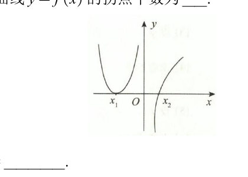
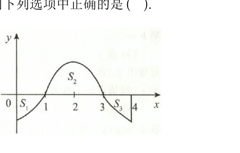
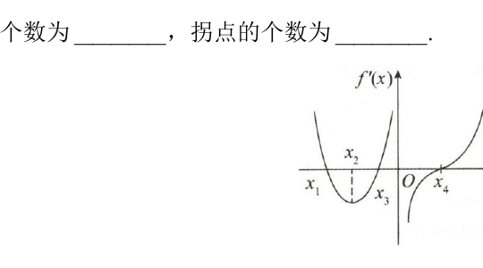

# 第二章 一元函数微分学及其应用

> 本章依据《880高数做题本》与《880数一解析》整理。对明显 OCR / 转写错误作了校勘，并补回原题中 MD 缺失的必要图形；解析以原解答为基础，压缩重复表述并补充关键知识点与技巧。

## 基础题

### 一、选择题

<ExamQuestion>

**(1)** 设 $f(x) = \begin{cases} \dfrac{1 - \cos x}{\sqrt{x}}, & x > 0, \\ x^2 \cdot \varphi(x), & x \leqslant 0, \end{cases}$ 其中 $\varphi(x)$ 是有界函数，则 $f(x)$ 在 $x = 0$ 处（ ）。

<ExamChoices>
<ExamOption>A. 可导</ExamOption>
<ExamOption>B. 连续, 但不可导</ExamOption>
<ExamOption>C. 极限存在, 但不连续</ExamOption>
<ExamOption>D. 极限不存在</ExamOption>
</ExamChoices>

<ExamSolution>

<ExamAnswer>A</ExamAnswer>

<ExamExplanation>
$$\lim_{x\to 0^+} f(x) = \lim_{x\to 0^+} \frac{1-\cos x}{\sqrt{x}} = \lim_{x\to 0^+} \frac{\frac{1}{2}x^2}{\sqrt{x}} = 0,$$
$$\lim_{x\to 0^-} f(x) = \lim_{x\to 0^-} x^2 \cdot \varphi(x) = 0,$$
而 $f(0)=0$, 故 $f(x)$ 在 $x=0$ 处连续.
$$f'_{+}(0) = \lim_{x\to 0^+} \frac{f(x)-f(0)}{x-0} = \lim_{x\to 0^+} \frac{1-\cos x}{x\sqrt{x}} = \lim_{x\to 0^+} \frac{\frac{1}{2}x^2}{x\sqrt{x}} = 0,$$
$$f'_{-}(0) = \lim_{x\to 0^-} \frac{f(x)-f(0)}{x-0} = \lim_{x\to 0^-} \frac{x^2\varphi(x)}{x} = 0,$$
故 $f'_{+}(0) = f'_{-}(0) = 0$, 所以 $f'(0)=0$, 选项 A 正确.

**技巧总结：** 判断某点可导时，优先回到差商定义；含绝对值、分段或参数表示时尤其要分别比较左右导数。
</ExamExplanation>

</ExamSolution>

</ExamQuestion>

---

<ExamQuestion>

**(2)** 设 $f'(x)$ 存在，$a$，$b$ 为任意实数，则 $\lim_{\Delta x \to 0} \dfrac{f(x + a\Delta x) - f(x - b\Delta x)}{\Delta x} = (\quad)$。

<ExamChoices>
<ExamOption>A. $(a + b)f'(x)$</ExamOption>
<ExamOption>B. $(a - b)f'(x)$</ExamOption>
<ExamOption>C. $af'(x)$</ExamOption>
<ExamOption>D. $bf'(x)$</ExamOption>
</ExamChoices>

<ExamSolution>

<ExamAnswer>A</ExamAnswer>

<ExamExplanation>
$$\lim_{\Delta x\to 0} \frac{f(x+a\Delta x)-f(x-b\Delta x)}{\Delta x}$$
$$= \lim_{\Delta x\to 0} a \cdot \frac{f(x+a\Delta x)-f(x)}{a\Delta x} + \lim_{\Delta x\to 0} b \cdot \frac{f(x-b\Delta x)-f(x)}{-b\Delta x}$$
$$= af'(x) + bf'(x) = (a+b)f'(x).$$
故选 A.

**技巧总结：** 本题先识别所考定理与局部结构，再选择导数定义、单调性、泰勒展开或中值定理，避免直接进行冗长运算。
</ExamExplanation>

</ExamSolution>

</ExamQuestion>

---

<ExamQuestion>

**(3)** 下列函数中，在 $x = 0$ 处不可导的是（ ）。

<ExamChoices>
<ExamOption>A. $f(x) = |x|\sin|x|$</ExamOption>
<ExamOption>B. $f(x) = |x|\sin\sqrt{|x|}$</ExamOption>
<ExamOption>C. $f(x) = \cos|x|$</ExamOption>
<ExamOption>D. $f(x) = \cos\sqrt{|x|}$</ExamOption>
</ExamChoices>

<ExamSolution>

<ExamAnswer>D</ExamAnswer>

<ExamExplanation>
$$f'_{+}(0) = \lim_{x\to 0^+} \frac{\cos\sqrt{|x|}-1}{x} = \lim_{x\to 0^+} \frac{-\frac{1}{2}|x|}{x} = -\frac{1}{2},$$
$$f'_{-}(0) = \lim_{x\to 0^-} \frac{\cos\sqrt{|x|}-1}{x} = \lim_{x\to 0^-} \frac{-\frac{1}{2}|x|}{x} = \frac{1}{2},$$
故 $f(x)=\cos\sqrt{|x|}$ 在 $x=0$ 处不可导, 选项 D 正确.

**技巧总结：** 判断某点可导时，优先回到差商定义；含绝对值、分段或参数表示时尤其要分别比较左右导数。
</ExamExplanation>

</ExamSolution>

</ExamQuestion>

---

<ExamQuestion>

**(4)** 设
$$f(x) = \begin{cases} a\sqrt{x}, & 0 \leqslant x \leqslant b, \\ \ln x, & x > b \end{cases}$$
在 $(0, +\infty)$ 内可导，在 $x = 0$ 处右连续，则（ ）。

<ExamChoices>
<ExamOption>A. $a = \dfrac{2}{\mathrm{e}}, b = \mathrm{e}^2$</ExamOption>
<ExamOption>B. $a = \dfrac{2}{\mathrm{e}}, b = \mathrm{e}$</ExamOption>
<ExamOption>C. $a = \dfrac{1}{\mathrm{e}}, b = \mathrm{e}^2$</ExamOption>
<ExamOption>D. $a = \dfrac{1}{\mathrm{e}}, b = \mathrm{e}$</ExamOption>
</ExamChoices>

<ExamSolution>

<ExamAnswer>A</ExamAnswer>

<ExamExplanation>
若 $b=0$, 则
$$f(x) = \begin{cases} 0, & x=0, \\ \ln x, & x>0. \end{cases}$$
由于 $f(x)$ 在 $x=0$ 处不是右连续, 故 $b=0$ 不满足条件, 从而 $b>0$.
由于 $f(x)$ 在 $x=b$ 处可导, 知 $f(x)$ 在 $x=b$ 处连续, 故
$$\lim_{x\to b^+} f(x) = \lim_{x\to b^-} f(x) = f(b),$$
即
$$\ln b = a\sqrt{b}.$$
又
$$f'_{-}(b) = \lim_{\Delta x\to 0^-} \frac{f(b+\Delta x)-f(b)}{\Delta x} = \lim_{\Delta x\to 0^-} \frac{a\sqrt{b+\Delta x}-a\sqrt{b}}{\Delta x}$$
$$= a \lim_{\Delta x\to 0^-} \frac{\Delta x}{\Delta x(\sqrt{b+\Delta x}+\sqrt{b})} = \frac{a}{2\sqrt{b}},$$

$$f'_+(b) = \lim_{\Delta x \to 0^+} \frac{f(b+\Delta x) - f(b)}{\Delta x} = \lim_{\Delta x \to 0^+} \frac{\ln(b+\Delta x) - \ln b}{\Delta x}$$
$$= \lim_{\Delta x \to 0^+} \frac{\ln(\Delta x + b) - \ln b}{\Delta x} = \lim_{\Delta x \to 0^+} \frac{1}{b+\Delta x} = \frac{1}{b},$$

由 $f'_-(b) = f'_+(b)$, 得

$$\frac{a}{2\sqrt{b}} = \frac{1}{b} \tag{2}$$

解①、②式, 得 $a = \frac{2}{e}, b = e^2$. 选项 A 正确。

**技巧总结：** 判断某点可导时，优先回到差商定义；含绝对值、分段或参数表示时尤其要分别比较左右导数。
</ExamExplanation>

</ExamSolution>

</ExamQuestion>

---

<ExamQuestion>

**(5)** 设 $f(-x) = -f(x)$，且在 $(0, +\infty)$ 内，$f'(x) > 0, f''(x) > 0$，则 $f(x)$ 在 $(-\infty, 0)$ 内必有（ ）。

<ExamChoices>
<ExamOption>A. $f'(x) < 0, f''(x) < 0$</ExamOption>
<ExamOption>B. $f'(x) < 0, f''(x) > 0$</ExamOption>
<ExamOption>C. $f'(x) > 0, f''(x) < 0$</ExamOption>
<ExamOption>D. $f'(x) > 0, f''(x) > 0$</ExamOption>
</ExamChoices>

<ExamSolution>

<ExamAnswer>C</ExamAnswer>

<ExamExplanation>
由已知, 得 $f(x)$ 是奇函数, 故 $f'(x)$ 是偶函数, $f''(x)$ 是奇函数, 从而由 $f'(x)>0, x\in(0,+\infty)$, 可知当 $x\in(-\infty,0)$ 时, $f'(x)>0$; 由 $f''(x)>0, x\in(0,+\infty)$, 可知当 $x\in(-\infty,0)$ 时, $f''(x)<0$, 故选 C.

**技巧总结：** 本题先识别所考定理与局部结构，再选择导数定义、单调性、泰勒展开或中值定理，避免直接进行冗长运算。
</ExamExplanation>

</ExamSolution>

</ExamQuestion>

---

<ExamQuestion>

**(6)** 设 $f(x)$ 在 $[-1, 1]$ 上二阶可导，且 $f''(x) > 0, \int_{-1}^{1} f(x)\mathrm{d}x = 2$，则 $f(0)$ 的取值范围为（ ）。

<ExamChoices>
<ExamOption>A. $(-\infty, 0]$</ExamOption>
<ExamOption>B. $(0, +\infty)$</ExamOption>
<ExamOption>C. $(-\infty, 1)$</ExamOption>
<ExamOption>D. $(1, +\infty)$</ExamOption>
</ExamChoices>

<ExamSolution>

<ExamAnswer>C</ExamAnswer>

<ExamExplanation>
应用泰勒公式, $f(x)$ 在 $x=0$ 处展开为
$$f(x) = f(0) + f'(0)(x-0) + \frac{f''(\xi)}{2!}(x-0)^2 \geqslant f(0) + f'(0)x,$$
其中 $\xi$ 介于 $0$ 与 $x$ 之间, 故
$$\int_{-1}^{1} f(x)\,\mathrm{d}x > \int_{-1}^{1} [f(0) + f'(0)x]\,\mathrm{d}x = 2f(0),$$
所以, $f(0) < \frac{1}{2}\int_{-1}^{1} f(x)\,\mathrm{d}x = 1$, 选项 C 正确。

**技巧总结：** 判断某点可导时，优先回到差商定义；含绝对值、分段或参数表示时尤其要分别比较左右导数。
</ExamExplanation>

</ExamSolution>

</ExamQuestion>

---

<ExamQuestion>

**(7)** 设 $f(x)$ 在 $x=0$ 的某邻域内连续， $f(0)=0,\lim_{x\to0}\frac{f(x)}{1-\cos x}=2$，则 $f(x)$ 在 $x=0$ 处 $(\quad)$.

<ExamChoices>
<ExamOption>A. 不可导</ExamOption>
<ExamOption>B. 可导且 $f'(0)\neq0$</ExamOption>
<ExamOption>C. 有极小值</ExamOption>
<ExamOption>D. 有极大值</ExamOption>
</ExamChoices>

<ExamSolution>

<ExamAnswer>C</ExamAnswer>

<ExamExplanation>
$$f'(0) = \lim_{x\to 0} \frac{f(x)-f(0)}{x-0} = \lim_{x\to 0} \frac{f(x)}{x} = \lim_{x\to 0} \frac{f(x)}{1-\cos x} \cdot \frac{1-\cos x}{x}$$
$$= 2\lim_{x\to 0} \frac{1-\cos x}{x} = 2\lim_{x\to 0} \frac{\frac{1}{2}x^2}{x} = 0,$$
故可排除选项 A 和 B.
再由 $\lim_{x\to 0}\frac{f(x)}{1-\cos x} = 2 > 0$, 由保号性及 $1-\cos x > 0$, 知在 $x=0$ 的某邻域内有 $f(x)>0=f(0)$, 故 $f(0)$ 为极小值, 选项 C 正确。

**技巧总结：** 判断某点可导时，优先回到差商定义；含绝对值、分段或参数表示时尤其要分别比较左右导数。
</ExamExplanation>

</ExamSolution>

</ExamQuestion>

---

<ExamQuestion>

**(8)** $y=(x-1)^2(x-3)^2$ 的拐点个数为 $(\quad)$.

<ExamChoices>
<ExamOption>A. $0$</ExamOption>
<ExamOption>B. $1$</ExamOption>
<ExamOption>C. $2$</ExamOption>
<ExamOption>D. $3$</ExamOption>
</ExamChoices>

<ExamSolution>

<ExamAnswer>C</ExamAnswer>

<ExamExplanation>
$$y' = [(x-1)^2(x-3)^2]' = 4(x-1)(x-2)(x-3),$$
则 $y''$ 是二次函数, 故 $y''$ 最多只有两个零点. 由罗尔定理, 知 $y''$ 在 $(1,2)$ 和 $(2,3)$ 内各有一个零点, 且 $y''$ 在其零点两侧变号, 故有 2 个拐点, 选项 C 正确。

**技巧总结：** 拐点的本质是曲线凹凸性发生改变；$f''(x)=0$ 只是候选条件，还需检查两侧符号。
</ExamExplanation>

</ExamSolution>

</ExamQuestion>

---

<ExamQuestion>

**(9)** 设 $f'(x_0)=f''(x_0)=0$ ， $f'''(x_0)>0$，则下列选项中正确的是 $(\quad)$.

<ExamChoices>
<ExamOption>A. $x_0$ 是 $f(x)$ 的极值点</ExamOption>
<ExamOption>B. $f(x_0)$ 是 $f(x)$ 的极大值</ExamOption>
<ExamOption>C. $f(x_0)$ 是 $f(x)$ 的极小值</ExamOption>
<ExamOption>D. $(x_0,f(x_0))$ 是 $y=f(x)$ 的拐点</ExamOption>
</ExamChoices>

<ExamSolution>

<ExamAnswer>D</ExamAnswer>

<ExamExplanation>
由 $f''(x_0) = 0$ 及已知条件, 有
$$f'''(x_0) = \lim_{x\to x_0} \frac{f''(x)-f''(x_0)}{x-x_0} = \lim_{x\to x_0} \frac{f''(x)}{x-x_0} > 0.$$
由极限的保号性, 可知当 $x>x_0$ 时, $f''(x)>0$; 当 $x<x_0$ 时, $f''(x)<0$, 即在 $x_0$ 两侧 $f''(x)$ 变号, 故 $(x_0, f(x_0))$ 是 $y=f(x)$ 的拐点, 选项 D 正确。

**注：** 选项 A 不正确, 例如 $f(x)=x^3$, 有 $f'(0)=f''(0)=0, f'''(0)=6\neq 0$, 但 $x=0$ 不是 $f(x)=x^3$ 的极值点.

**技巧总结：** 拐点的本质是曲线凹凸性发生改变；$f''(x)=0$ 只是候选条件，还需检查两侧符号。
</ExamExplanation>

</ExamSolution>

</ExamQuestion>

---

<ExamQuestion>

**(10)** 设 $f(x)$ 有一阶连续导数，$F(x)=f(x)(1+|\sin x|)$，则 $f(0)=0$ 是 $F(x)$ 在 $x=0$ 处可导的 $(\quad)$.

<ExamChoices>
<ExamOption>A. 必要非充分条件</ExamOption>
<ExamOption>B. 充分非必要条件</ExamOption>
<ExamOption>C. 充分必要条件</ExamOption>
<ExamOption>D. 既非充分又非必要条件</ExamOption>
</ExamChoices>

<ExamSolution>

<ExamAnswer>C</ExamAnswer>

<ExamExplanation>
利用导数的定义, 有
$$F'_+(0) = \lim_{x\to 0^+} \frac{F(x)-F(0)}{x-0} = \lim_{x\to 0^+} \frac{f(x)(1+|\sin x|) - f(0)}{x}$$

$$= \lim_{x\to 0^+} \frac{f(x)-f(0)}{x} + \lim_{x\to 0^+} \frac{f(x)\sin x}{x} = f'_+(0) + f(0).$$

同理,可得 $F'_{-}(0) = f'_{-}(0) - f(0)$,故
$$F(x) \text{ 在 } x=0 \text{ 处可导} \iff F'_{-}(0) = F'_{+}(0) \iff f(0) = 0,$$
故选 C.

**技巧总结：** 判断某点可导时，优先回到差商定义；含绝对值、分段或参数表示时尤其要分别比较左右导数。
</ExamExplanation>

</ExamSolution>

</ExamQuestion>

---

<ExamQuestion>

**(11)** 设 $f(x)$ 在 $x=a$ 处连续，则 $f(x)$ 在 $x=a$ 处可导的一个充分条件是 $(\quad)$.

<ExamChoices>
<ExamOption>A. $\lim_{x\to\infty}|x|\left[f\left(a+\frac{1}{|x|}\right)-f(a)\right]$ 存在</ExamOption>
<ExamOption>B. $\lim_{x\to0}\frac{f(a+x^3)-f(a)}{x^2}$ 存在</ExamOption>
<ExamOption>C. $\lim_{\Delta x\to0}\frac{f(a+\Delta x)-f(a-\Delta x)}{2\Delta x}$ 存在</ExamOption>
<ExamOption>D. $\lim_{x\to0}\frac{f(a+x^3)-f(a)}{\tan x^3}$ 存在</ExamOption>
</ExamChoices>

<ExamSolution>

<ExamAnswer>D</ExamAnswer>

<ExamExplanation>
$\lim_{x\to 0} \frac{f(a+x^3)-f(a)}{\tan x^3} = \lim_{x\to 0} \frac{f(a+x^3)-f(a)}{x^3} = f'(a)$, 故选项 D 正确.

对于选项 A,
$$\lim_{x\to\infty} |x| \left[ f\left(a + \frac{1}{|x|}\right) - f(a) \right]$$
$$= \lim_{x\to\infty} \frac{f\left(a + \frac{1}{|x|}\right) - f(a)}{\frac{1}{|x|}} \stackrel{\frac{1}{|x|} = \Delta x}{=} \lim_{\Delta x\to 0^+} \frac{f(a+\Delta x)-f(a)}{\Delta x} = f'(a),$$
故排除选项 A.

对于选项 B, $\lim_{x\to 0} \frac{f(a+x^3)-f(a)}{x^2} = \lim_{x\to 0} \frac{f(a+x^3)-f(a)}{x^3} \cdot x$ 存在, 有可能 $\lim_{x\to 0} \frac{f(a+x^3)-f(a)}{x^3}$ 为 $\infty$ (因 $0\cdot\infty$ 型极限可能存在), 故排除选项 B.

对于选项 C,
$$\lim_{\Delta x\to 0} \frac{f(a+\Delta x) - f(a-\Delta x)}{2\Delta x}$$
$$= \lim_{\Delta x\to 0} \left[ \frac{f(a+\Delta x)-f(a)}{\Delta x} \cdot \frac{1}{2} + \frac{f(a-\Delta x)-f(a)}{-\Delta x} \cdot \frac{1}{2} \right]$$
存在不能确定 $\lim_{\Delta x\to 0} \frac{f(a+\Delta x)-f(a)}{\Delta x}$ 与 $\lim_{\Delta x\to 0} \frac{f(a-\Delta x)-f(a)}{-\Delta x}$ 均存在. 故排除选项 C.

**技巧总结：** 判断某点可导时，优先回到差商定义；含绝对值、分段或参数表示时尤其要分别比较左右导数。
</ExamExplanation>

</ExamSolution>

</ExamQuestion>

---

<ExamQuestion>

**(12)** 设 $f(x)$ 连续，且 $f'(x_0)>0$，则存在 $\delta>0$，使得 $(\quad)$.

<ExamChoices>
<ExamOption>A. 对任意 $x\in(x_0-\delta,x_0)$，有 $f(x)>f(x_0)$</ExamOption>
<ExamOption>B. 对任意 $x\in(x_0,x_0+\delta)$，有 $f(x)>f(x_0)$</ExamOption>
<ExamOption>C. $f(x)$ 在 $(x_0-\delta,x_0)$ 内单调减少</ExamOption>
<ExamOption>D. $f(x)$ 在 $(x_0,x_0+\delta)$ 内单调增加</ExamOption>
</ExamChoices>

<ExamSolution>

<ExamAnswer>B</ExamAnswer>

<ExamExplanation>
依题设, 有
$$f'(x_0) = \lim_{x\to x_0^+} \frac{f(x)-f(x_0)}{x-x_0} > 0,$$
故由极限的保号性知, 对 $x \in (x_0, x_0+\delta)$, 有 $f(x) > f(x_0)$, 即选项 B 正确.
同理,
$$f'(x_0) = \lim_{x\to x_0^-} \frac{f(x)-f(x_0)}{x-x_0} > 0, x \in (x_0-\delta, x_0),$$
有 $f(x) < f(x_0)$, 故选项 A 错误.
对于选项 C 和 D, 由 $f'(x_0) > 0$, 不能推出 $f(x)$ 在 $(x_0-\delta, x_0)$ 与 $(x_0, x_0+\delta)$ 内的单调性.

**技巧总结：** 本题先识别所考定理与局部结构，再选择导数定义、单调性、泰勒展开或中值定理，避免直接进行冗长运算。
</ExamExplanation>

</ExamSolution>

</ExamQuestion>

---

<ExamQuestion>

**(13)** 已知 $y=x^3+ax^2+bx+c$ 在 $x=-2$ 处取得极值，且与直线 $y=-3x+3$ 相切于点 $(1,0)$，则 $(\quad)$.

<ExamChoices>
<ExamOption>A. $a=1, b=-8, c=6$</ExamOption>
<ExamOption>B. $a=-1, b=-8, c=-6$</ExamOption>
<ExamOption>C. $a=1, b=8, c=-6$</ExamOption>
<ExamOption>D. $a=-1, b=8, c=-6$</ExamOption>
</ExamChoices>

<ExamSolution>

<ExamAnswer>A</ExamAnswer>

<ExamExplanation>
由已知, 得 $y'(-2)=0, y'(1)=-3, y(1)=0$, 即
$$\begin{cases}
\left. (x^3 + ax^2 + bx + c)' \right|_{x=-2} = 0, \\
\left. (x^3 + ax^2 + bx + c)' \right|_{x=1} = -3, \\
\left. (x^3 + ax^2 + bx + c) \right|_{x=1} = 0,
\end{cases}$$
即
$$\begin{cases}
12 - 4a + b = 0, \\
3 + 2a + b = -3, \\
1 + a + b + c = 0,
\end{cases}$$
解得 $a=1, b=-8, c=6$. 故选 A.

**技巧总结：** 极值问题先找驻点与不可导点，再用一阶导数变号；只满足 $f'(x_0)=0$ 并不能保证是极值点。
</ExamExplanation>

</ExamSolution>

</ExamQuestion>

---

<ExamQuestion>

**(14)** 下列选项中正确的是（ ）.

<ExamChoices>
<ExamOption>A. 设 $f(x)$ 在 $(-a, a)$ ($a>0$) 内为偶函数，则 $x=0$ 是 $f(x)$ 的极值点</ExamOption>
<ExamOption>B. 设 $x_0 \in (a, b)$，$(a, b)$ 上的函数 $f(x)$ 满足：当 $x \in (a, x_0)$ 时，$f'(x) > 0$，当 $x \in (x_0, b)$ 时，$f'(x) < 0$，则 $f(x)$ 在 $x_0$ 处取得最大值</ExamOption>
<ExamOption>C. 设 $f(x)$ 在 $x=x_0$ 处取得极大值，则存在 $x_0$ 的邻域 $(x_0-\sigma, x_0+\sigma)$，使得 $f(x)$ 在 $(x_0-\sigma, x_0)$ 内单调递增，在 $(x_0, x_0+\sigma)$ 内单调递减</ExamOption>
<ExamOption>D. 设 $f(x)$ 在 $(-a, a)$ ($a>0$) 内可导且为偶函数，则 $f'(0) = 0$</ExamOption>
</ExamChoices>

<ExamSolution>

<ExamAnswer>D</ExamAnswer>

<ExamExplanation>
若 $f(x)$ 在 $(-a, a)$ 内可导且为偶函数, 则 $f'(x)$ 在 $(-a, a)$ 内为奇函数, 从而 $\forall x \in (-a, a)$, 有 $f'(-x) = -f'(x)$.
令 $x=0$, 得 $f'(0) = -f'(0)$, 故 $f'(0) = 0$. 选项 D 正确.

对于选项 B: $y = f(x)$ 的图形如图 2-1 所示，但 $f(x)$ 在 $(a, b)$ 内无最大值.

对于选项 A: 如
$$f(x) = \begin{cases}
x^3 \sin \frac{1}{x}, & x \neq 0, \\
0, & x = 0
\end{cases}$$
是偶函数，但 $x = 0$ 不是 $f(x)$ 的极值点.

对于选项 C: 如
$$f(x) = \begin{cases}
1 - x^2\left(1 + \sin\frac{1}{x}\right), & x \neq 0, \\
1, & x = 0
\end{cases}$$
是 $f(x)$ 的极值点.

$$f'(x) = \begin{cases}
-2x\left(1 + \sin\frac{1}{x}\right) + \cos\frac{1}{x}, & x \neq 0, \\
0, & x = 0
\end{cases}$$

令 $x_n = \frac{1}{n\pi}$，当 $n \to \pm\infty$ 时，$x_n \to 0$，$f'(x_n) = \frac{-2}{n\pi} + (-1)^n$.
无论 $\sigma$ 取多么小，$f(x)$ 在 $(0, \sigma)$ 内不单调递减，在 $(-\sigma, 0)$ 内不单调递增.

**技巧总结：** 极值问题先找驻点与不可导点，再用一阶导数变号；只满足 $f'(x_0)=0$ 并不能保证是极值点。
</ExamExplanation>

</ExamSolution>

</ExamQuestion>

---

<ExamQuestion>

**(15)** 设可导函数 $y=y(x)$ 由 $$\begin{cases} x=\arctan t, \\ y=\ln(1-t^2) - \sin y \end{cases}$$ 确定，则（ ）.

<ExamChoices>
<ExamOption>A. $x=0$ 是 $y=y(x)$ 的极小值点</ExamOption>
<ExamOption>B. $x=0$ 是 $y=y(x)$ 的极大值点</ExamOption>
<ExamOption>C. 在 $x=0$ 的邻域 $(-\delta, 0)$ ($\delta>0$) 内，$y=y(x)$ 单调递减</ExamOption>
<ExamOption>D. 在 $x=0$ 的邻域 $(0, \delta)$ ($\delta>0$) 内，$y=y(x)$ 单调递增</ExamOption>
</ExamChoices>

<ExamSolution>

<ExamAnswer>B</ExamAnswer>

<ExamExplanation>
由 $x = \arctan t$, 得 $\frac{\mathrm{d}x}{\mathrm{d}t} = \frac{1}{1 + t^2}$. $y = \ln(1 - t^2) - \sin y$ 两边同时对 $t$ 求导, 得
$$\frac{\mathrm{d}y}{\mathrm{d}t} = \frac{-2t}{1 - t^2} - \cos y \frac{\mathrm{d}y}{\mathrm{d}t},$$
解得
$$\frac{\mathrm{d}y}{\mathrm{d}t} = \frac{-2t}{(1 - t^2)(1 + \cos y)}.$$
当 $x = 0$ 时, 由 $x = \arctan t$, 知 $t = 0$, 且当 $x > 0 (< 0)$ 时, 有 $t > 0 (< 0)$.
由 $y = \ln(1 - t^2) - \sin y$ 知, 当 $x = 0$, 即 $t = 0$ 时, 有 $y = 0$. 故在 $x = 0$ 的邻域 $(-\delta, \delta) (\delta > 0)$ 内, 有
$$\frac{\mathrm{d}y}{\mathrm{d}x} = \frac{\mathrm{d}y}{\mathrm{d}t} \cdot \frac{\mathrm{d}t}{\mathrm{d}x} = \frac{-2t(1 + t^2)}{(1 - t^2)(1 + \cos y)} \begin{cases} > 0, & -\delta < x < 0, \\ = 0, & x = 0, \\ < 0, & 0 < x < \delta. \end{cases}$$
综上所述, $x = 0$ 是 $y = y(x)$ 的极大值点. 选项 B 正确.

**技巧总结：** 判断某点可导时，优先回到差商定义；含绝对值、分段或参数表示时尤其要分别比较左右导数。
</ExamExplanation>

</ExamSolution>

</ExamQuestion>

---

<ExamQuestion>

**(16)** 曲线 $y = \frac{1}{|x|-1} + \ln(1+\mathrm{e}^{-x})$ 的渐近线的条数为（ ）.

<ExamChoices>
<ExamOption>A. 1</ExamOption>
<ExamOption>B. 2</ExamOption>
<ExamOption>C. 3</ExamOption>
<ExamOption>D. 4</ExamOption>
</ExamChoices>

<ExamSolution>

<ExamAnswer>D</ExamAnswer>

<ExamExplanation>
当 $x = \pm 1$ 时, 函数没有定义, 且当 $x \to 1$ 时, $y \to \infty$, 故 $x = 1$ 为铅直渐近线. 同理, $x = -1$ 为铅直渐近线.
由 $\lim_{x \to +\infty} y = \lim_{x \to +\infty} \left[\frac{1}{x - 1} + \ln(1 + e^{-x})\right] = 0$, 知有水平渐近线 $y = 0$.
又
$$\begin{aligned}
\lim_{x \to -\infty} \frac{y}{x} &= \lim_{x \to -\infty} \left[\frac{1}{x(|x| - 1)} + \frac{\ln(1 + e^{-x})}{x}\right] = 0 + \lim_{x \to -\infty} \frac{e^{-x}}{1 + e^{-x}} = -1, \\
\lim_{x \to -\infty} (y + x) &= \lim_{x \to -\infty} \left[\frac{1}{|x| - 1} + \ln(1 + e^{-x}) + x\right] \\
&= \lim_{x \to -\infty} [\ln(1 + e^{-x}) + \ln e^x] \\
&= \lim_{x \to -\infty} \ln[(1 + e^{-x}) \cdot e^x] = \lim_{x \to -\infty} \ln(e^x + 1) = 0,
\end{aligned}$$
故 $y = -x$ 为斜渐近线. 选项 D 正确.

**技巧总结：** 求渐近线时分别检查垂直渐近线、水平渐近线和斜渐近线；斜渐近线可用 $a=\lim f(x)/x$、$b=\lim[f(x)-ax]$。
</ExamExplanation>

</ExamSolution>

</ExamQuestion>

---

<ExamQuestion>

**(17)** 设 $f(x)$ 为连续函数，且 $\lim_{x \to +\infty} \mathrm{e}^x [1+x+f(x)]$ 存在，则曲线 $y=f(x)$ 有斜渐近线（ ）.

<ExamChoices>
<ExamOption>A. $y=x$</ExamOption>
<ExamOption>B. $y=-x$</ExamOption>
<ExamOption>C. $y=x+1$</ExamOption>
<ExamOption>D. $y=-x-1$</ExamOption>
</ExamChoices>

<ExamSolution>

<ExamAnswer>D</ExamAnswer>

<ExamExplanation>
由 $\lim_{x \to +\infty} e^x [1 + x + f(x)] = \lim_{x \to +\infty} \frac{1 + x + f(x)}{e^{-x}}$ 存在, 知
$$\lim_{x \to +\infty} [f(x) + x + 1] = \lim_{x \to +\infty} [f(x) - (-x - 1)] = 0,$$
故 $y = f(x)$ 有斜渐近线 $y = -x - 1$. 故选 D.

**注：** 设曲线 $y = f(x)$ 有斜渐近线 $y = kx + b$.
如图 2-2 所示, $P(x, y)$ 为 $y = f(x)$ 上任一点, 由斜渐近线的定义, 知 $P(x, y)$ 到直线 $y = kx + b$ 的距离 $|PM|$ 趋于零 $(x \to \infty)$, 从而 $|PN| \to 0$ $(x \to \infty)$. 故有
$$\lim_{x \to \infty} [f(x) - (kx + b)] = 0.$$

**技巧总结：** 求渐近线时分别检查垂直渐近线、水平渐近线和斜渐近线；斜渐近线可用 $a=\lim f(x)/x$、$b=\lim[f(x)-ax]$。
</ExamExplanation>

</ExamSolution>

</ExamQuestion>

---

### 二、填空题

<ExamQuestion>

**(1)** 设 $f(x)$ 连续，$\lim_{x \to 0} \frac{\ln[f(x+1)+\mathrm{e}^{x^2}]}{x} = 1$，则 $\lim_{x \to 0} \frac{f[(1+\tan x)^2] - f(1+\tan x)}{x} = \underline{\hspace{2cm}}$ .

<ExamSolution>

<ExamAnswer>1</ExamAnswer>

<ExamExplanation>
由
$$\begin{aligned}
\lim_{x \to 0} \frac{\ln[f(x + 1) + e^{x^2}]}{x} &= \lim_{x \to 0} \frac{\ln[f(x + 1) + e^{x^2} + 1 - 1]}{x} \\
&= \lim_{x \to 0} \frac{f(x + 1) + e^{x^2} - 1}{x} = \lim_{x \to 0} \frac{f(x + 1)}{x} + 0 = 1,
\end{aligned}$$
知 $\lim_{x \to 0} \frac{f(x + 1)}{x} = 1$. 由 $f(x)$ 连续, 知 $f(1) = 0$, 故
$$\begin{aligned}
f'(1) &= \lim_{x \to 0} \frac{f(x + 1) - f(1)}{x} = 1, \\
\lim_{x \to 0} &\frac{f[(1 + \tan x)^2] - f(1 + \tan x)}{x} \\
&= \lim_{x \to 0} \frac{f[(1 + \tan x)^2] - f(1)}{x} - \lim_{x \to 0} \frac{f(1 + \tan x) - f(1)}{x} \\
&= \lim_{x \to 0} \frac{f(1 + 2\tan x + \tan^2 x) - f(1)}{2\tan x + \tan^2 x} \cdot \frac{2\tan x + \tan^2 x}{x} \\
&\quad - \lim_{x \to 0} \frac{f(1 + \tan x) - f(1)}{\tan x} \cdot \frac{\tan x}{x} \\
&= 2f'(1) - f'(1) \\
&= f'(1) = 1.
\end{aligned}$$

**技巧总结：** 本题先识别所考定理与局部结构，再选择导数定义、单调性、泰勒展开或中值定理，避免直接进行冗长运算。
</ExamExplanation>

</ExamSolution>

</ExamQuestion>

---

<ExamQuestion>

**(2)** 设 $y=f(x)$ 由方程 $x = \int_1^{y-x} \sin^2\left(\frac{\pi t}{4}\right) dt$ 确定，则 $\lim_{n \to \infty} n \left[f\left(\frac{1}{n}\right) - 1\right] = \underline{\hspace{2cm}}$ .

<ExamSolution>

<ExamAnswer>3</ExamAnswer>

<ExamExplanation>
$x = \int_{1}^{y - x} \sin^2 \left(\frac{\pi t}{4}\right) dt$ 两边同时对 $x$ 求导, 得
$$1 = (y' - 1) \cdot \sin^2 \left[\frac{\pi}{4}(y - x)\right],$$
解得
$$y' = \csc^2 \left[\frac{\pi}{4}(y - x)\right] + 1.$$
又由已知得, 当 $x = 0$ 时, $y = 1$, 即 $f(0) = 1$, 故 $y'\Big|_{x = 0} = 3$, 于是
$$\lim_{n \to \infty} n \left[f\left(\frac{1}{n}\right) - 1\right] = \lim_{n \to \infty} \frac{f\left(\frac{1}{n}\right) - f(0)}{\frac{1}{n}} = f'(0) = 3.$$

**技巧总结：** 本题先识别所考定理与局部结构，再选择导数定义、单调性、泰勒展开或中值定理，避免直接进行冗长运算。
</ExamExplanation>

</ExamSolution>

</ExamQuestion>

---

<ExamQuestion>

**(3)** 设函数 $f(x)$ 有连续导数，且 $\lim_{x\to 0}\left[\frac{\sin x}{x^2}+\frac{f(x)}{x}\right]=2$，则 $f(x)$ 的一阶麦克劳林展开式为 _______.

<ExamSolution>

<ExamAnswer>$f(x) = -1 + 2x + o(x)$</ExamAnswer>

<ExamExplanation>
由
$$\lim_{x \to 0} \left[ \frac{\sin x}{x^2} + \frac{f(x)}{x} \right] = \lim_{x \to 0} \frac{\sin x + x f(x)}{x^2} = 2,$$
知 $\sin x + x f(x)$ 与 $2x^2$ 是等价无穷小.
又由于
$$\begin{aligned}
\sin x + x f(x) &= [x + o(x^2)] + x [f(0) + f'(0)x + o(x)] \\
&= [1 + f(0)] x + f'(0)x^2 + o(x^2),
\end{aligned}$$
故 $f(0) = -1, f'(0) = 2$, 所以
$$f(x) = f(0) + f'(0)x + o(x) = -1 + 2x + o(x).$$

**技巧总结：** 判断某点可导时，优先回到差商定义；含绝对值、分段或参数表示时尤其要分别比较左右导数。
</ExamExplanation>

</ExamSolution>

</ExamQuestion>

---

<ExamQuestion>

**(4)** 设函数 $f(x)$ 在 $(-\infty, +\infty)$ 内连续，$f''(x)$ 的图形如图所示，则曲线 $y=f(x)$ 的拐点个数为 _______.

<ExamSolution>

<ExamAnswer>$2$</ExamAnswer>

<ExamExplanation>
由 $f''(x)$ 的图形可知, $f''(x_1) = f''(x_2) = 0, f''(0)$ 不存在, 在 $x = x_1$ 的两侧二阶导数不变号, 故不是拐点. 在 $x = 0, x = x_2$ 两侧二阶导数变号, 所以 $y = f(x)$ 有 $2$ 个拐点.

**技巧总结：** 拐点的本质是曲线凹凸性发生改变；$f''(x)=0$ 只是候选条件，还需检查两侧符号。
</ExamExplanation>

</ExamSolution>

</ExamQuestion>

---

<ExamQuestion>

**(5)** 设 $f'(0)$ 存在，$f(0)=0$，且 $\lim_{x\to 0}\left[1+\frac{1-\cos f(x)}{\sin x}\right]^{\frac{1}{x}}=\mathrm{e}$，则 $f'(0)=$ _______.

<ExamSolution>

<ExamAnswer>$\pm \sqrt{2}$</ExamAnswer>

<ExamExplanation>
依题设, 有
$$\lim_{x \to 0} \left[ 1 + \frac{1 - \cos f(x)}{\sin x} \right]^{\frac{1}{x}} = \lim_{x \to 0} \left\{ \left[ 1 + \frac{1 - \cos f(x)}{\sin x} \right]^{\frac{\sin x}{1 - \cos f(x)}} \right\}^{\frac{1 - \cos f(x)}{x \sin x}} = \mathrm{e},$$
故 $\lim_{x \to 0} \frac{1 - \cos f(x)}{x \sin x} = 1$.
又当 $x \to 0$ 时, $\sin x \sim x, 1 - \cos f(x) \sim \frac{1}{2} f^2(x)$, 且 $f'(0)$ 存在, 故
$$1 = \lim_{x \to 0} \frac{1 - \cos f(x)}{x \sin x} = \frac{1}{2} \lim_{x \to 0} \frac{f^2(x)}{x^2} = \frac{1}{2} \lim_{x \to 0} \frac{f(x)}{x} \cdot \lim_{x \to 0} \frac{f(x)}{x} = \frac{1}{2} f'(0) \cdot f'(0),$$
解得 $f'(0) = \pm \sqrt{2}$.

**技巧总结：** 本题先识别所考定理与局部结构，再选择导数定义、单调性、泰勒展开或中值定理，避免直接进行冗长运算。
</ExamExplanation>

</ExamSolution>

</ExamQuestion>

---

<ExamQuestion>

**(6)** 当 $x\to 0$ 时，$\mathrm{e}^x+\ln(1-x)-1$ 与 $x^n$ 是同阶无穷小，则 $n=$ _______.

<ExamSolution>

<ExamAnswer>$3$</ExamAnswer>

<ExamExplanation>
$$\begin{aligned}
e^x &= 1 + x + \frac{1}{2}x^2 + \frac{1}{6}x^3 + o(x^3), \\
\ln(1 - x) &= -x - \frac{1}{2}x^2 - \frac{1}{3}x^3 + o(x^3),
\end{aligned}$$
故 $e^x + \ln(1 - x) - 1 = 1 + x + \frac{1}{2}x^2 + \frac{1}{6}x^3 - x - \frac{1}{2}x^2 - \frac{1}{3}x^3 - 1 + o(x^3) = -\frac{1}{6}x^3 + o(x^3)$,
所以 $n = 3$.

**技巧总结：** 本题先识别所考定理与局部结构，再选择导数定义、单调性、泰勒展开或中值定理，避免直接进行冗长运算。
</ExamExplanation>

</ExamSolution>

</ExamQuestion>

---

<ExamQuestion>

**(7)** 设 $f(x)=n^2\mathrm{e}^{\frac{x}{n}}-(1+n)x$ 在 $x=x_n$ 处有水平切线，则 $\lim_{n\to\infty}x_n=$ _______.

<ExamSolution>

<ExamAnswer>$\mathrm{e}$</ExamAnswer>

<ExamExplanation>
对 $f(x)$ 求导, 得 $f'(x) = n \mathrm{e}^{\frac{x}{n}} - (1 + n)$. 依题意, 有
$$f'(x_n) = n \mathrm{e}^{\frac{x_n}{n}} - (1 + n) = 0,$$
解得 $x_n = n \ln\left(1 + \frac{1}{n}\right)$, 故 $\lim_{n \to \infty} \mathrm{e}^{x_n} = \lim_{n \to \infty} \mathrm{e}^{n \ln\left(1 + \frac{1}{n}\right)} = \mathrm{e}$.

**技巧总结：** 本题先识别所考定理与局部结构，再选择导数定义、单调性、泰勒展开或中值定理，避免直接进行冗长运算。
</ExamExplanation>

</ExamSolution>

</ExamQuestion>

---

<ExamQuestion>

**(8)** 设 $y=f(x)$ 由参数方程
$$\begin{cases}
x=t^2+1, \\
y=4t-t^2
\end{cases} (t\ge 0)$$
确定，则 $\lim_{n\to\infty}n\left[f\left(\frac{2n+1}{n}\right)-3\right]=$ _______.

<ExamSolution>

<ExamAnswer>$1$</ExamAnswer>

<ExamExplanation>
$$\lim_{n \to \infty} n \left[ f\left(\frac{2n + 1}{n}\right) - 3 \right] = \lim_{n \to \infty} \frac{f\left(2 + \frac{1}{n}\right) - 3}{\frac{1}{n}}.$$
由已知, 当 $x = 2$ 时, $t = 1, y = 3$, 故
$$\text{原极限} = \lim_{n \to \infty} \frac{f\left(2 + \frac{1}{n}\right) - f(2)}{\frac{1}{n}} = f'(2),$$
而 $\left. \frac{\mathrm{d}y}{\mathrm{d}x} \right|_{x=2} = \left. \frac{4 - 2t}{2t} \right|_{t=1} = 1$, 故原式 $= f'(2) = 1$.

**技巧总结：** 参数方程求导使用 $\frac{dy}{dx}=\frac{dy/dt}{dx/dt}$；二阶导数再对 $t$ 求导并除以 $dx/dt$。
</ExamExplanation>

</ExamSolution>

</ExamQuestion>

---

<ExamQuestion>

**(9)** 设 $\frac{\mathrm{d}}{\mathrm{d}x}[f(x^3)]=\frac{1}{x}$，则 $f'(x)=$ _______.

<ExamSolution>

<ExamAnswer>$\frac{1}{3x}$</ExamAnswer>

<ExamExplanation>
$\frac{\mathrm{d}}{\mathrm{d}x}[f(x^3)] = 3x^2 \cdot f'(x^3) = \frac{1}{x}$,

得 $f'(x^3) = \frac{1}{3x^3}$, 所以 $f'(x) = \frac{1}{3x}$.

**技巧总结：** 本题先识别所考定理与局部结构，再选择导数定义、单调性、泰勒展开或中值定理，避免直接进行冗长运算。
</ExamExplanation>

</ExamSolution>

</ExamQuestion>

---

<ExamQuestion>

**(10)** 设 $f(x)=\ln(\sqrt{1+x^2}-x)$，则 $f^{(5)}(0)=$ _______.

<ExamSolution>

<ExamAnswer>$-9$</ExamAnswer>

<ExamExplanation>
由 $f(x) = \ln(\sqrt{1+x^2} - x)$, 可求得 $f'(x) = -\frac{1}{\sqrt{1+x^2}}$.

令 $g(x) = -\frac{1}{\sqrt{1+x^2}} = -(1+x^2)^{-\frac{1}{2}}$, $g(x)$ 在 $x = 0$ 处的麦克劳林展开式为

$$g(x) = -(1+x^2)^{-\frac{1}{2}} = -\left[1 - \frac{1}{2}x^2 + \frac{-\frac{1}{2}\left(-\frac{1}{2}-1\right)x^4}{2!} + o(x^4)\right]$$

$$= -1 + \frac{1}{2}x^2 - \frac{3}{8}x^4 - o(x^4),$$

则 $g^{(4)}(0) = 4! \times \left(-\frac{3}{8}\right) = -9$. 故 $f^{(5)}(0) = -9$.

**技巧总结：** 本题先识别所考定理与局部结构，再选择导数定义、单调性、泰勒展开或中值定理，避免直接进行冗长运算。
</ExamExplanation>

</ExamSolution>

</ExamQuestion>

---

<ExamQuestion>

**(11)** 设 $y=y(x)$ 由参数方程
$$\begin{cases}
x=\dfrac{t}{1+t^3}, \\
y=\dfrac{t^2}{1+t^3}
\end{cases}$$
确定，则曲线 $y=y(x)$ 的斜渐近线方程为 _______.

<ExamSolution>

<ExamAnswer>$x + y + \frac{1}{3} = 0$</ExamAnswer>

<ExamExplanation>
由已知可得, 当且仅当 $t \to -1$ 时, $x \to \infty$. 故

$$\begin{aligned}
k &= \lim_{x \to \infty} \frac{y}{x} = \lim_{t \to -1} \frac{t^2}{1+t^3} \cdot \frac{1+t^3}{t} = \lim_{t \to -1} t = -1, \\
b &= \lim_{x \to \infty} (y - kx) = \lim_{t \to -1} \left(\frac{t^2}{1+t^3} + \frac{t}{1+t^3}\right) \\
&= \lim_{t \to -1} \frac{t(t+1)}{(t+1)(t^2 - t + 1)} = \lim_{t \to -1} \frac{t}{t^2 - t + 1} = -\frac{1}{3}.
\end{aligned}$$

故所求斜渐近线方程为 $y = -x - \frac{1}{3}$, 即 $x + y + \frac{1}{3} = 0$.

**技巧总结：** 求渐近线时分别检查垂直渐近线、水平渐近线和斜渐近线；斜渐近线可用 $a=\lim f(x)/x$、$b=\lim[f(x)-ax]$。
</ExamExplanation>

</ExamSolution>

</ExamQuestion>

---

<ExamQuestion>

**(12)** 设 $\lim_{x\to+\infty} (\sqrt{ax^2-x+3}-2x)=b$，其中 $a,b$ 为常数，$a>0$，则曲线 $y=\sqrt{ax^2-x+3}$ 在 $(0,+\infty)$ 内的斜渐近线方程为 ________。

<ExamSolution>

<ExamAnswer>$y = 2x - \frac{1}{4}$</ExamAnswer>

<ExamExplanation>
由已知, 有

$$\lim_{x \to +\infty} (\sqrt{ax^2 - x + 3} - 2x) = \lim_{x \to +\infty} x \left(\sqrt{a - \frac{1}{x} + \frac{3}{x^2}} - 2\right) = b,$$

故 $\lim_{x \to +\infty} \left(\sqrt{a - \frac{1}{x} + \frac{3}{x^2}} - 2\right) = 0$, 即 $\sqrt{a} = 2, a = 4$.

将 $a = 4$ 代入原式, 并有理化, 得

$$\begin{aligned}
b &= \lim_{x \to +\infty} (\sqrt{4x^2 - x + 3} - 2x) = \lim_{x \to +\infty} \frac{-x + 3}{\sqrt{4x^2 - x + 3} + 2x} \\
&= \lim_{x \to +\infty} \frac{-1 + \frac{3}{x}}{\sqrt{4 - \frac{1}{x} + \frac{3}{x^2}} + 2} = -\frac{1}{4},
\end{aligned}$$

所以

$$\lim_{x \to +\infty} \left(\sqrt{4x^2 - x + 3} - 2x + \frac{1}{4}\right) = \lim_{x \to +\infty} \left[\sqrt{4x^2 - x + 3} - \left(2x - \frac{1}{4}\right)\right] = 0.$$

故斜渐近线方程为 $y = 2x - \frac{1}{4}$.

**技巧总结：** 求渐近线时分别检查垂直渐近线、水平渐近线和斜渐近线；斜渐近线可用 $a=\lim f(x)/x$、$b=\lim[f(x)-ax]$。
</ExamExplanation>

</ExamSolution>

</ExamQuestion>

---

<ExamQuestion>

**(13)** 设 $f(x)=\cos|x|+x^2|x|$ 在 $x=0$ 处存在的最高阶导数的阶数为 ________。

<ExamSolution>

<ExamAnswer>2</ExamAnswer>

<ExamExplanation>
在 $x = 0$ 的邻域内, $\cos |x| = \cos x, x^2 |x|$ 在 $x = 0$ 处二阶可导, 三阶不可导, 故阶数为 2.

**技巧总结：** 判断某点可导时，优先回到差商定义；含绝对值、分段或参数表示时尤其要分别比较左右导数。
</ExamExplanation>

</ExamSolution>

</ExamQuestion>

---

<ExamQuestion>

**(14)** 曲线 $x=a\cos^3 t, y=a\sin^3 t (a>0)$ 在 $t=\frac{\pi}{4}$ 处的曲率 = ________。

<ExamSolution>

<ExamAnswer>$\dfrac{2}{3a}$</ExamAnswer>

<ExamExplanation>
由参数方程求导可得，在给定参数处先计算一阶导数和二阶导数，再代入曲率公式。将 t 等于 π/4 代入后，曲率为 2/(3a)。

**技巧总结：** 曲率题先求 $y'$、$y''$（参数方程先转成对 $x$ 的导数），再代入曲率公式；曲率圆还要结合凹向判断圆心方向。
</ExamExplanation>

</ExamSolution>

</ExamQuestion>

---

<ExamQuestion>

**(15)** 设 $f(x)$ 有二阶连续导数，当 $x\to 0$ 时，$2\sin x+xf(x)$ 是比 $x^3$ 高阶的无穷小，则曲线 $y=f(x)$ 在点 $(0,-2)$ 处的曲率圆方程为 ________。

<ExamSolution>

<ExamAnswer>$x^2 + \left(y + \frac{1}{2}\right)^2 = \frac{9}{4}$</ExamAnswer>

<ExamExplanation>
由已知, $\lim\limits_{x \to 0} \frac{2\sin x + xf(x)}{x^3} = 0$, 故
$$\frac{2\sin x + xf(x)}{x^3} = \alpha \quad (\text{当 } x \to 0 \text{ 时}, \alpha \to 0),$$
即 $xf(x) = x^3\alpha - 2\sin x$. 又 $\sin x = x - \frac{1}{6}x^3 + o(x^3)$, 故
$$f(x) = -2\frac{\sin x}{x} + o(x^2) = -2\left(1 - \frac{1}{6}x^2\right) + o(x^2) = -2 + \frac{1}{3}x^2 + o(x^2).$$
由泰勒公式的唯一性, 得
$$f(0) = -2, \quad f'(0) = 0, \quad f''(0) = \frac{2}{3}.$$
$y = f(x)$ 在点 $(0, -2)$ 处的曲率半径为
$$R = \frac{[1 + {f'}^2(0)]^{\frac{3}{2}}}{|f''(0)|} = \frac{3}{2}.$$
由 $f''(0) = \frac{2}{3} > 0$ 及 $f''(x)$ 连续, 知在 $x = 0$ 的邻域内有 $f''(x) > 0$. 由曲率圆在点 $(0, -2)$ 处与 $y = f(x)$ 有相同的凹向, 知 $y = f(x)$ 在点 $(0, -2)$ 处的曲率圆方程为
$$x^2 + \left(y + \frac{1}{2}\right)^2 = \frac{9}{4}.$$

**技巧总结：** 曲率题先求 $y'$、$y''$（参数方程先转成对 $x$ 的导数），再代入曲率公式；曲率圆还要结合凹向判断圆心方向。
</ExamExplanation>

</ExamSolution>

</ExamQuestion>

---

<ExamQuestion>

**(16)** 设 $f(x)$ 在 $(-\infty,+\infty)$ 内有定义，且对任意的 $x,y$，有 $f(x+y)-f(x)=[f(x)-1]y+\alpha(y)$，其中 $\lim_{y\to 0}\frac{\alpha(y)}{y}=0$，且 $f(0)=2$，则 $f(x)=$ ________。

<ExamSolution>

<ExamAnswer>$e^x + 1$</ExamAnswer>

<ExamExplanation>
由已知条件, 视 $y$ 为 $\Delta x$, 知 $f(x)$ 在点 $x$ 处可微, 且 $\mathrm{d}[f(x)] = [f(x) - 1]\mathrm{d}x$, 故 $\mathrm{d}x = \frac{1}{f(x) - 1}\mathrm{d}[f(x)]$. 两边积分, 得
$$x = \ln |f(x) - 1| + C.$$
由 $f(0) = 2$, 得 $C = 0$, 故 $f(x) = e^x + 1$.

**技巧总结：** 本题先识别所考定理与局部结构，再选择导数定义、单调性、泰勒展开或中值定理，避免直接进行冗长运算。
</ExamExplanation>

</ExamSolution>

</ExamQuestion>

---

<ExamQuestion>

**(17)** 设函数 $y=y(x)$ 由方程 $\arctan\frac{x}{y}=\ln\sqrt{\frac{x^2+y^2}{2}}+\frac{\pi}{4}\ (x>0,y>0)$ 确定，则 $y(x)$ 的极大值为 ________。

<ExamSolution>

<ExamAnswer>1</ExamAnswer>

<ExamExplanation>
已知方程为
$$\arctan \frac{x}{y} = \frac{1}{2}\ln(x^2 + y^2) - \frac{1}{2}\ln 2 + \frac{\pi}{4}.$$
上式两边同时对 $x$ 求导, 得
$$\frac{1}{1 + \left(\frac{x}{y}\right)^2} \cdot \frac{y - xy'}{y^2} = \frac{1}{2} \cdot \frac{2x + 2yy'}{x^2 + y^2},$$
即 $y' = \frac{-x + y}{x + y}$. 令 $y' = 0$, 得 $x = y$, 代入原方程可求得 $x = 1, y = 1$, 故 $y'(1) = 0$.

由 $y' = \frac{-x + y}{x + y}$，即 $(x + y)y' = -x + y$，两边同时对 $x$ 求导，得
$$(1 + y')y' + (x + y)y'' = -1 + y'.$$
将 $x = 1, y = 1, y'(1) = 0$ 代入上式，得 $y''(1) = -\frac{1}{2} < 0$，故 $y(x)$ 的极大值为 $y(1) = 1$.

**技巧总结：** 本题先识别所考定理与局部结构，再选择导数定义、单调性、泰勒展开或中值定理，避免直接进行冗长运算。
</ExamExplanation>

</ExamSolution>

</ExamQuestion>

---

### 三、解答题

<ExamQuestion>

**(1)** 计算下列函数的导数：

$(I)\ y=2^{|\sin x|}$；

$(II)\ y=\ln|\tan x+\sec x|$；

$(III)\ y=(1+x^2)^{\sin x}$；

$(IV)\ y=\ln\frac{1}{\sqrt{x}+\sqrt{x^2+1}}$。

<ExamSolution>

<ExamAnswer>见解析</ExamAnswer>

<ExamExplanation>
( I ) 由 $|\sin x| = \sqrt{\sin^2 x}$，有 $y = 2^{|\sin x|} = 2^{\sqrt{\sin^2 x}}$，则
$$y' = 2^{\sqrt{\sin^2 x}} \cdot (\ln 2) \cdot (\sqrt{\sin^2 x})' = 2^{\sqrt{\sin^2 x}} \cdot (\ln 2) \cdot \frac{2\sin x \cos x}{2\sqrt{\sin^2 x}}$$
$$= 2^{|\sin x|} \cdot (\ln 2) \cdot \sin 2x \cdot \frac{1}{2|\sin x|} \quad (\sin x \neq 0).$$

**注：** 当 $\sin x = 0$ 时，$y = 2^{|\sin x|}$ 的左、右导数值分别存在，且异号。

( II )
$$y' = \frac{1}{\tan x + \sec x} \cdot (\tan x + \sec x)'$$
$$= \frac{1}{\tan x + \sec x} \cdot (\sec^2 x + \sec x \tan x) = \sec x.$$

**注：** $(\ln |x|)' = \frac{1}{x} \quad (x \neq 0)$.

( III ) 取对数，有 $\ln |y| = \ln(1 + x^2) \sin x$.
两边同时对 $x$ 求导，得 $\frac{1}{y} \cdot y' = \ln(1 + x^2) \cos x + \frac{2x \sin x}{1 + x^2}$，故
$$y' = (1 + x^2)^{\sin x} \left[ \ln(1 + x^2) \cos x + \frac{2x \sin x}{1 + x^2} \right].$$

( IV ) 利用对数的性质，化简后再求导.
$$y = \ln \frac{1}{\sqrt{x + \sqrt{x^2 + 1}}} = -\frac{1}{2} \ln(x + \sqrt{x^2 + 1}),$$
$$y' = -\frac{1}{2} \cdot \frac{1}{x + \sqrt{x^2 + 1}} \cdot (x + \sqrt{x^2 + 1})'$$
$$= -\frac{1}{2} \cdot \frac{1}{x + \sqrt{x^2 + 1}} \cdot \left(1 + \frac{2x}{2\sqrt{x^2 + 1}}\right) = -\frac{1}{2\sqrt{x^2 + 1}}.$$

**技巧总结：** 判断某点可导时，优先回到差商定义；含绝对值、分段或参数表示时尤其要分别比较左右导数。
</ExamExplanation>

</ExamSolution>

</ExamQuestion>

---

<ExamQuestion>

**(2)** 设 $y=y(x)$ 由方程 $\sqrt{x^2+y^2}=\mathrm{e}^{\arctan\frac{y}{x}}$ 确定，求 $\frac{\mathrm{d}^2 y}{\mathrm{d}x^2}$。

<ExamSolution>

<ExamAnswer>见解析</ExamAnswer>

<ExamExplanation>
已知方程两边同时取对数，再对 $x$ 求导，得
$$\frac{1}{2} \ln(x^2 + y^2) = \arctan \frac{y}{x},$$
$$\frac{1}{2} \cdot \frac{2x + 2y \cdot y'}{x^2 + y^2} = \frac{1}{1 + \left(\frac{y}{x}\right)^2} \cdot \frac{y'x - y \cdot 1}{x^2},$$
解得
$$y' = \frac{x + y}{x - y},$$
$$y'' = \frac{(1 + y')(x - y) - (x + y)(1 - y')}{(x - y)^2} = \frac{2xy' - 2y}{(x - y)^2}.$$
将 $y' = \frac{x + y}{x - y}$ 代入上式，得 $y'' = \frac{2(x^2 + y^2)}{(x - y)^3}$.

**技巧总结：** 本题先识别所考定理与局部结构，再选择导数定义、单调性、泰勒展开或中值定理，避免直接进行冗长运算。
</ExamExplanation>

</ExamSolution>

</ExamQuestion>

---

<ExamQuestion>

**(3)** 设 $y=y(x)$ 由参数方程
$$\begin{cases}
x = t - \sin t, \\
y = 1 - \cos t
\end{cases}$$
确定，求 $\frac{\mathrm{d}y}{\mathrm{d}x}, \frac{\mathrm{d}^2y}{\mathrm{d}x^2}$。

<ExamSolution>

<ExamAnswer>见解析</ExamAnswer>

<ExamExplanation>
$$\frac{dy}{dx} = \frac{dy}{dt} \cdot \frac{dt}{dx} = \frac{\sin t}{1 - \cos t},$$
$$\frac{d^2y}{dx^2} = \frac{d}{dx}\left(\frac{\sin t}{1 - \cos t}\right) = \frac{d}{dt}\left(\frac{\sin t}{1 - \cos t}\right) \cdot \frac{dt}{dx} = -\frac{1}{(1 - \cos t)^2}.$$

**技巧总结：** 参数方程求导使用 $\frac{dy}{dx}=\frac{dy/dt}{dx/dt}$；二阶导数再对 $t$ 求导并除以 $dx/dt$。
</ExamExplanation>

</ExamSolution>

</ExamQuestion>

---

<ExamQuestion>

**(4)** 求心形线 $r = 1 - \cos\theta$ 在对应于 $\theta = \frac{\pi}{2}$ 处的切线方程。

<ExamSolution>

<ExamAnswer>见解析</ExamAnswer>

<ExamExplanation>
为求 $\frac{\mathrm{d}y}{\mathrm{d}x}$，将极坐标化为参数方程，即
$$\begin{cases}
x = r(\theta)\cos\theta = (1 - \cos\theta)\cos\theta, \\
y = r(\theta)\sin\theta = (1 - \cos\theta)\sin\theta,
\end{cases}$$
$\theta$ 为参数，则 $\left.\frac{\mathrm{d}y}{\mathrm{d}x}\right|_{\theta=\frac{\pi}{2}} = \left.\frac{y'(\theta)}{x'(\theta)}\right|_{\theta=\frac{\pi}{2}} = \left.\frac{\cos\theta(1 - \cos\theta) + \sin^2\theta}{-\sin\theta(1 - \cos\theta) + \cos\theta\sin\theta}\right|_{\theta=\frac{\pi}{2}} = -1$，
$$x\left(\frac{\pi}{2}\right) = 0, \quad y\left(\frac{\pi}{2}\right) = 1,$$
故切线方程为 $y - 1 = (-1)(x - 0)$，即 $x + y = 1$。

**技巧总结：** 本题先识别所考定理与局部结构，再选择导数定义、单调性、泰勒展开或中值定理，避免直接进行冗长运算。
</ExamExplanation>

</ExamSolution>

</ExamQuestion>

---

<ExamQuestion>

**(5)** 设 $f(x) =$
$$\begin{cases}
\mathrm{e}^{-\frac{1}{x^2}}, & x \neq 0, \\
0, & x = 0,
\end{cases}$$
求 $f^{(n)}(0)$。

<ExamSolution>

<ExamAnswer>见解析</ExamAnswer>

<ExamExplanation>
$$f'(0) = \lim_{x\to 0} \frac{f(x) - f(0)}{x} = \lim_{x\to 0} \frac{\mathrm{e}^{-\frac{1}{x^2}}}{x} = 0.$$
当 $x \neq 0$ 时，$f'(x) = \frac{2}{x^3}\mathrm{e}^{-\frac{1}{x^2}}$，故
$$f''(0) = \lim_{x\to 0} \frac{f'(x) - f'(0)}{x} = \lim_{x\to 0} \frac{1}{x} \cdot \frac{2}{x^3} \cdot \mathrm{e}^{-\frac{1}{x^2}} = \lim_{x\to 0} \frac{2}{x^4}\mathrm{e}^{-\frac{1}{x^2}} = 0.$$
同理可得 $f^{(k)}(0) = 0 \ (k = 3, 4, \cdots)$，所以 $f^{(n)}(0) = 0$。

**注：** 利用洛必达法则，对任意正整数 $k$，$\lim_{x\to 0} \frac{\mathrm{e}^{-\frac{1}{x^2}}}{x^k} = 0$。

**技巧总结：** 本题先识别所考定理与局部结构，再选择导数定义、单调性、泰勒展开或中值定理，避免直接进行冗长运算。
</ExamExplanation>

</ExamSolution>

</ExamQuestion>

---

<ExamQuestion>

**(6)** 设气体以 $100\text{cm}^3/\text{s}$ 的速率注入球状气球，求当半径为 $10\text{cm}$ 时，气球半径增加的速率。(设气体压力不变)

<ExamSolution>

<ExamAnswer>见解析</ExamAnswer>

<ExamExplanation>
设开始充气以来的时间为 $t$，$t$ 时刻气球体积为 $V = V(t)$，半径为 $r = r(t)$。由已知，气球体积为 $V = \frac{4}{3}\pi r^3$，两边同时对 $t$ 求导，有
$$\frac{\mathrm{d}V}{\mathrm{d}t} = 4\pi r^2 \cdot \frac{\mathrm{d}r}{\mathrm{d}t}.$$
由已知，$\frac{\mathrm{d}V}{\mathrm{d}t} = 100, r = 10$，代入上式得 $100 = 4\pi \cdot 10^2 \cdot \frac{\mathrm{d}r}{\mathrm{d}t}$，解得 $\frac{\mathrm{d}r}{\mathrm{d}t} = \frac{1}{4\pi}\text{ cm/s}$。

**技巧总结：** 本题先识别所考定理与局部结构，再选择导数定义、单调性、泰勒展开或中值定理，避免直接进行冗长运算。
</ExamExplanation>

</ExamSolution>

</ExamQuestion>

---

<ExamQuestion>

**(7)** 一动点 $P$ 在曲线 $9y = 4x^2$ 上运动，已知点 $P$ 横坐标变化速率为 $30\text{cm/s}$，问：当点 $P$ 经过 $(3,4)$ 时，从原点到点 $P$ 的距离 $S$ 的变化率为多少？(设坐标轴的单位长为 $1\text{cm}$)

<ExamSolution>

<ExamAnswer>见解析</ExamAnswer>

<ExamExplanation>
由已知，设点 $P$ 的坐标为 $(x, y)$，则 $\frac{\mathrm{d}x}{\mathrm{d}t} = 30$。在 $9y = 4x^2$ 两边同时对 $t$ 求导，有 $9\frac{\mathrm{d}y}{\mathrm{d}t} = 8x\frac{\mathrm{d}x}{\mathrm{d}t}$，
即 $\frac{\mathrm{d}y}{\mathrm{d}t} = \frac{8}{9}x \cdot \frac{\mathrm{d}x}{\mathrm{d}t} = \frac{80x}{3}$。又 $S = \sqrt{x^2 + y^2}$，两边同时对 $t$ 求导，有
$$\frac{\mathrm{d}S}{\mathrm{d}t} = \frac{1}{\sqrt{x^2 + y^2}} \left(x\frac{\mathrm{d}x}{\mathrm{d}t} + y\frac{\mathrm{d}y}{\mathrm{d}t}\right) = \frac{1}{\sqrt{x^2 + y^2}} \left(30x + \frac{80}{3}xy\right),$$
将 $x = 3, y = 4$ 代入上式，有 $\frac{\mathrm{d}S}{\mathrm{d}t} = 82\text{ cm/s}$。

**技巧总结：** 本题先识别所考定理与局部结构，再选择导数定义、单调性、泰勒展开或中值定理，避免直接进行冗长运算。
</ExamExplanation>

</ExamSolution>

</ExamQuestion>

---

<ExamQuestion>

**(8)** 设 $f(x)$ 二阶可导，$f(0)=0, f'(0)=1, f''(0)=2$，求 $\lim_{x\to 0}\frac{f(x)-x}{x^2}$。

<ExamSolution>

<ExamAnswer>见解析</ExamAnswer>

<ExamExplanation>
$\lim_{x\to 0} \frac{f(x) - x}{x^2} = \lim_{x\to 0} \frac{f'(x) - 1}{2x} = \lim_{x\to 0} \frac{f'(x) - f'(0)}{2x} = \frac{1}{2}f''(0) = 1$。

**注：** ① 下列解法是错误的.
$$\lim_{x\to 0} \frac{f(x) - x}{x^2} = \lim_{x\to 0} \frac{f'(x) - 1}{2x} = \lim_{x\to 0} \frac{f''(x)}{2} = \frac{1}{2}f''(0) = 1,$$
题中条件是 $f(x)$ 二阶可导，不能保证 $f''(x)$ 连续，故 $\lim_{x\to 0} \frac{f''(x)}{2} = \frac{1}{2}f''(0)$ 错误。
② 此题也可以用泰勒公式求解.
$$f(x) = f(0) + f'(0)x + \frac{f''(0)}{2!}x^2 + o(x^2)$$
$$= x + x^2 + o(x^2),$$
故
$$\lim_{x\to 0} \frac{f(x) - x}{x^2} = \lim_{x\to 0} \frac{x + x^2 + o(x^2) - x}{x^2} = 1.$$

**技巧总结：** 判断某点可导时，优先回到差商定义；含绝对值、分段或参数表示时尤其要分别比较左右导数。
</ExamExplanation>

</ExamSolution>

</ExamQuestion>

---

<ExamQuestion>

**(9)** 设函数 $f(x)$ 在 $x=0$ 处连续，且 $\lim_{x\to 0}\frac{xf(x)-(1+x)^{2x}+1}{x^2}=1$。证明：$f(x)$ 在 $x=0$ 处可导，并求 $f'(0)$。

<ExamSolution>

<ExamAnswer>见解析</ExamAnswer>

<ExamExplanation>
证由 $\lim_{x\to 0}\frac{xf(x)-(1+x)^{2x}+1}{x^2}=1$, 且根据极限与无穷小的关系, 有
$$\frac{xf(x)-(1+x)^{2x}+1}{x^2}=1+\alpha \quad (\text{当 } x\to 0 \text{ 时}, \alpha\to 0),$$
即
$$xf(x)-e^{2x\ln(1+x)}+1=x^2+x^2\alpha. \quad \textcircled{1}$$
由 $\textcircled{1}$ 式, 可得
$$f(x)=\frac{1}{x}[x^2+x^2\alpha+e^{2x\ln(1+x)}-1]$$
$$=x+x\alpha+\frac{1}{x}[e^{2x\ln(1+x)}-1].$$
由 $f(x)$ 在 $x=0$ 处连续, 知 $\lim_{x\to 0}f(x)=f(0)$, 即有
$$f(0)=\lim_{x\to 0}f(x)=\lim_{x\to 0}\frac{1}{x}[e^{2x\ln(1+x)}-1]$$
$$=\lim_{x\to 0}\frac{2x\ln(1+x)}{x}=0.$$
故
$$f'(0)=\lim_{x\to 0}\frac{f(x)-f(0)}{x}=\lim_{x\to 0}\frac{x+x\alpha+\frac{1}{x}[e^{2x\ln(1+x)}-1]}{x}$$
$$=1+\lim_{x\to 0}\frac{e^{2x\ln(1+x)}-1}{x^2}=1+\lim_{x\to 0}\frac{2x\ln(1+x)}{x^2}$$
$$=1+\lim_{x\to 0}\frac{2x^2}{x^2}=1+2=3.$$

**技巧总结：** 中值定理证明题可从目标等式反推辅助函数；若目标含 $f$ 与 $f'$ 的线性组合，常尝试乘指数因子或构造乘积。
</ExamExplanation>

</ExamSolution>

</ExamQuestion>

---

<ExamQuestion>

**(10)** 设 $f(x)$ 在 $[a,b]$ 上连续，在 $(a,b)$ 内可导，$0 < a < b$，且 $f(a) = f(b) = 0$，证明：
$(I)$ 至少存在一点 $\xi \in (a,b)$，使得 $2f(\xi) + \xi f'(\xi) = 0$；
$(II)$ 至少存在一点 $\eta \in (a,b)$，使得 $2\eta f(\eta) - f'(\eta) = 0$。

<ExamSolution>

<ExamAnswer>见解析</ExamAnswer>

<ExamExplanation>
**证明：** $(\text{I})$ 令 $F(x)=x^2f(x)$, 则 $F(a)=F(b)=0$, 由罗尔定理, 可知存在一点 $\xi\in(a,b)$, 使得 $F'(\xi)=0$, 即 $2\xi f(\xi)+\xi^2f'(\xi)=0$, 故
$$2f(\xi)+\xi f'(\xi)=0.$$
$(\text{II})$ 令 $G(x)=e^{-x^2}f(x)$, 则 $G(a)=G(b)=0$, 由罗尔定理, 可知存在一点 $\eta\in(a,b)$, 使得 $G'(\eta)=0$, 即 $-2\eta e^{-\eta^2}f(\eta)+e^{-\eta^2}f'(\eta)=0$, 故
$$2\eta f(\eta)-f'(\eta)=0.$$

**技巧总结：** 中值定理证明题可从目标等式反推辅助函数；若目标含 $f$ 与 $f'$ 的线性组合，常尝试乘指数因子或构造乘积。
</ExamExplanation>

</ExamSolution>

</ExamQuestion>

---

<ExamQuestion>

**(11)** 设 $f(x)$ 在 $[0,1]$ 上连续，在 $(0,1)$ 内可导，且 $f(0) = 0, f(1) = 1$。证明：
$(I)$ 存在 $x_0 \in (0,1)$，使得 $f(x_0) = 2(1-x_0)$；
$(II)$ 存在 $\xi$ 与 $\eta \in (0,1)$，且 $\xi \neq \eta$，使得 $f'(\xi)[1+f'(\eta)] = 2$。

<ExamSolution>

<ExamAnswer>见解析</ExamAnswer>

<ExamExplanation>
**证明：** $(\text{I})$ 令 $F(x)=f(x)-2(1-x)$, 则 $F(x)$ 在 $[0,1]$ 上连续, 且 $F(0)=-2<0, F(1)=1>0$, 由零点定理, 可知存在 $x_0\in(0,1)$, 使得 $F(x_0)=0$, 即 $f(x_0)=2(1-x_0)$.
$(\text{II})$ $f(x)$ 在 $[0,x_0]$ 与 $[x_0,1]$ 上分别应用拉格朗日中值定理, 存在 $\xi\in(0,x_0), \eta\in(x_0,1)$, 使得
$$f'(\xi)=\frac{f(x_0)-f(0)}{x_0-0}=\frac{f(x_0)}{x_0}=\frac{2(1-x_0)}{x_0},$$
$$f'(\eta)=\frac{f(1)-f(x_0)}{1-x_0}=\frac{1-f(x_0)}{1-x_0}=\frac{2x_0-1}{1-x_0},$$
所以
$$f'(\xi)[1+f'(\eta)]=\frac{2(1-x_0)}{x_0}\left(1+\frac{2x_0-1}{1-x_0}\right)=2.$$

**技巧总结：** 中值定理证明题可从目标等式反推辅助函数；若目标含 $f$ 与 $f'$ 的线性组合，常尝试乘指数因子或构造乘积。
</ExamExplanation>

</ExamSolution>

</ExamQuestion>

---

<ExamQuestion>

**(12)** 设 $f(x)$ 在 $[0,1]$ 上二阶可导, $|f''(x)|\leqslant 1$, $f(x)$ 在 $(0,1)$ 内取得最小值, 证明:
$|f'(0)|+|f'(1)|\leqslant 1$.

<ExamSolution>

<ExamAnswer>见解析</ExamAnswer>

<ExamExplanation>
**证明：** 由 $f(x)$ 在 $(0,1)$ 内取得最小值, 知存在一点 $x_0\in(0,1)$, 使得 $f(x_0)$ 为 $f(x)$ 在 $(0,1)$ 上的最小值, 于是 $f'(x_0)=0$.
由拉格朗日中值定理, 有
$$f'(x_0)-f'(0)=f''(\xi_1)(x_0-0), \quad 0<\xi_1<x_0,$$
$$f'(1)-f'(x_0)=f''(\xi_2)(1-x_0), \quad x_0<\xi_2<1,$$
于是
$$|f'(0)|=|f''(\xi_1)|(x_0-0)\leqslant x_0,$$
$$|f'(1)|=|f''(\xi_2)|(1-x_0)\leqslant 1-x_0,$$
两式相加, 得
$$|f'(0)|+|f'(1)|\leqslant 1.$$

**技巧总结：** 极值问题先找驻点与不可导点，再用一阶导数变号；只满足 $f'(x_0)=0$ 并不能保证是极值点。
</ExamExplanation>

</ExamSolution>

</ExamQuestion>

---

<ExamQuestion>

**(13)** 设 $f(x)$ 在 $[0,1]$ 上二阶可导, 且 $f(0)=f(1)=2\int_{\frac{1}{2}}^{1} f(x)\mathrm{d}x$, 证明:
$(I)$ 至少存在一点 $\xi\in(0,1)$, 使得 $f''(\xi)=0$;
$(II)$ 对 $\forall \lambda\in\mathbb{R}$, 至少存在一点 $\eta\in(0,1)$, 使得 $f''(\eta)-\lambda f'(\eta)=0$.

<ExamSolution>

<ExamAnswer>见解析</ExamAnswer>

<ExamExplanation>
**证明：** $(\text{I})$ 由推广的积分中值定理, 可知存在一点 $c\in\left(\frac{1}{2},1\right)$, 使得

$$2 \int_{\frac{1}{2}}^{1} f(x) \, \mathrm{d}x = 2f(c) \left(1 - \frac{1}{2}\right) = f(c),$$

于是 $f(0) = f(c) = f(1)$, 在 $[0, c]$ 与 $[c, 1]$ 上分别应用罗尔定理, 有
$$f'(\xi_1) = 0 \quad (0 < \xi_1 < c), \quad f'(\xi_2) = 0 \quad (c < \xi_2 < 1),$$
在 $[\xi_1, \xi_2]$ 上再应用罗尔定理, 有 $f''(\xi) = 0, \, \xi \in (\xi_1, \xi_2) \subset (0, 1)$.

(II) 令 $F(x) = e^{-\lambda x} f'(x)$, 则 $F(\xi_1) = F(\xi_2) = 0$, 由罗尔定理, 可知至少存在一点 $\eta \in (\xi_1, \xi_2) \subset (0, 1)$, 使得 $F'(\eta) = 0$, 即
$$e^{-\lambda\eta} [f''(\eta) - \lambda f'(\eta)] = 0,$$
故 $f''(\eta) - \lambda f'(\eta) = 0$.

**技巧总结：** 中值定理证明题可从目标等式反推辅助函数；若目标含 $f$ 与 $f'$ 的线性组合，常尝试乘指数因子或构造乘积。
</ExamExplanation>

</ExamSolution>

</ExamQuestion>

---

<ExamQuestion>

**(14)** 设 $a,b$ 为正数, 证明: 至少存在一点 $\xi\in(a,b)$, 使得 $\frac{a\mathrm{e}^b-b\mathrm{e}^a}{a-b}=\mathrm{e}^{-\xi}(1-\xi)$.

<ExamSolution>

<ExamAnswer>见解析</ExamAnswer>

<ExamExplanation>
**证明：** $\frac{ae^b - be^a}{a - b} = e^\xi (1 - \xi)$ 等式左边分子、分母同时除以 $ab$, 有
$$\frac{\frac{e^b}{b} - \frac{e^a}{a}}{\frac{1}{b} - \frac{1}{a}} = e^\xi (1 - \xi).$$

对 $F(x) = \frac{e^x}{x}, G(x) = \frac{1}{x}$ 在 $[a, b]$ 上应用柯西中值定理, 有
$$\frac{\frac{e^b}{b} - \frac{e^a}{a}}{\frac{1}{b} - \frac{1}{a}} = \frac{\xi e^\xi - e^\xi}{\xi^2} = e^\xi (1 - \xi), \quad a < \xi < b,$$

故原等式成立。

**技巧总结：** 中值定理证明题可从目标等式反推辅助函数；若目标含 $f$ 与 $f'$ 的线性组合，常尝试乘指数因子或构造乘积。
</ExamExplanation>

</ExamSolution>

</ExamQuestion>

---

<ExamQuestion>

**(15)** 证明四个关于函数、不等式和凸性的结论。

<ExamSolution>

<ExamAnswer>见解析</ExamAnswer>

<ExamExplanation>
(I) 函数 sin(x/2)/x 在区间内单调递减，并由端点值可得目标不等式。
(II) 对函数 x ln a−a ln x 求导，在 x 大于等于 a 时单调增加，从而得到 a^b 大于 b^a。
(III) 对目标函数连续求导，可证其二阶导数为正，再由在 x=1 处取最小值推出不等式。
(IV) 由极限条件得到 f(0)=0、f'(0)=1，再用泰勒公式和 f'' 大于 0 得到 f(x) 大于等于 x。
</ExamExplanation>

</ExamSolution>

</ExamQuestion>

---

<ExamQuestion>

**(16)** 求函数 $y=(x-1)\mathrm{e}^{\frac{\pi}{2}+\arctan x}$ 的单调区间与极值, 并求其渐近线.

<ExamSolution>

<ExamAnswer>见解析</ExamAnswer>

<ExamExplanation>
求导后，导数的零点为负 1 和 0。由导数符号可知，函数在负 1 到 0 之间单调减少，在负无穷到负 1 以及 0 到正无穷上单调增加；函数在负 1 处取得极大值，在 0 处取得极小值。

分别计算正无穷和负无穷方向的斜率与截距，可得两条斜渐近线。正无穷方向的渐近线为 y 等于 e 的 pi 次方乘以 x 减 2，负无穷方向的渐近线为 y 等于 x 减 2，函数没有水平渐近线和铅直渐近线。
</ExamExplanation>

</ExamSolution>

</ExamQuestion>

---

<ExamQuestion>

**(17)** 设函数 f 在正数上等于 x 的 2x 次方，在非正数上等于 x 加 2，求 f 的单调区间与极值。

<ExamSolution>

<ExamAnswer>见解析</ExamAnswer>

<ExamExplanation>
在 0 的左右分别求极限，可知函数在 0 处不连续，因此 0 是不可导点。正数部分求导后，导数为 0 的点是 e 的负 1 次方。

由导数符号判断，函数在负无穷到 0 上单调增加，在 0 到 e 的负 1 次方之间单调减少，在 e 的负 1 次方到正无穷上单调增加。函数在 0 处取得极大值 2，在 e 的负 1 次方处取得极小值 e 的负 2 除以 e。
</ExamExplanation>

</ExamSolution>

</ExamQuestion>

---

<ExamQuestion>

**(18)** 设函数 $y=y(x)$ 由参数方程
$$\begin{cases} x=t\ln t, \\ y=\frac{1}{t}\ln t \end{cases} (t\geqslant 1)$$
确定, 求 $y=y(x)$ 的单调区间、凹凸区间、极值和拐点.

<ExamSolution>

<ExamAnswer>见解析</ExamAnswer>

<ExamExplanation>
$$\begin{aligned}
\frac{\mathrm{d}y}{\mathrm{d}x} &= \frac{y'(t)}{x'(t)} = \frac{1-\ln t}{t^2(1+\ln t)}, \\
\frac{\mathrm{d}^2y}{\mathrm{d}x^2} &= \frac{\mathrm{d}}{\mathrm{d}x}\left[\frac{1-\ln t}{t^2(1+\ln t)}\right] = \frac{\mathrm{d}}{\mathrm{d}t}\left[\frac{1-\ln t}{t^2(1+\ln t)}\right] \cdot \frac{\mathrm{d}t}{\mathrm{d}x} \\
&= \frac{2(\ln^2 t - 2)}{t^3(1+\ln t)^3},
\end{aligned}$$

令 $\frac{\mathrm{d}y}{\mathrm{d}x} = 0$, 得 $t = \mathrm{e}$；令 $\frac{\mathrm{d}^2y}{\mathrm{d}x^2} = 0$, 得 $t = \mathrm{e}^{\sqrt{2}}$。

列表如下：

| $t$ | $1$ | $(1,\mathrm{e})$ | $\mathrm{e}$ | $(\mathrm{e},\mathrm{e}^{\sqrt{2}})$ | $\mathrm{e}^{\sqrt{2}}$ | $(\mathrm{e}^{\sqrt{2}}, +\infty)$ |
| :---: | :---: | :---: | :---: | :---: | :---: | :---: |
| $x$ | $0$ | $(0,\mathrm{e})$ | $\mathrm{e}$ | $(\mathrm{e}, \sqrt{2}\mathrm{e}^{\sqrt{2}})$ | $\sqrt{2}\mathrm{e}^{\sqrt{2}}$ | $(\sqrt{2}\mathrm{e}^{\sqrt{2}}, +\infty)$ |
| $\frac{\mathrm{d}y}{\mathrm{d}x}$ | $1$ | $+$ | $0$ | $-$ | $-$ | $-$ |
| $\frac{\mathrm{d}^2y}{\mathrm{d}x^2}$ | $-4$ | $-$ | $-$ | $-$ | $0$ | $+$ |
| $y$ | $0$ | $\nearrow$ | $\frac{1}{\mathrm{e}}$ | $\searrow$ | $\frac{\sqrt{2}}{\mathrm{e}^{\sqrt{2}}}$ | $\searrow$ |

故 $y = y(x)$ 在 $(0,\mathrm{e})$ 内单调增加, 在 $(\mathrm{e}, +\infty)$ 内单调减少。

$y(\mathrm{e}) = \frac{1}{\mathrm{e}}$ 为极大值, 向上凹区间为 $(\sqrt{2}\mathrm{e}^{\sqrt{2}}, +\infty)$, 向上凸区间为 $(0,\sqrt{2}\mathrm{e}^{\sqrt{2}})$, 拐点为 $\left(\sqrt{2}\mathrm{e}^{\sqrt{2}}, \frac{\sqrt{2}}{\mathrm{e}^{\sqrt{2}}}\right)$。

**技巧总结：** 拐点的本质是曲线凹凸性发生改变；$f''(x)=0$ 只是候选条件，还需检查两侧符号。
</ExamExplanation>

</ExamSolution>

</ExamQuestion>

---

<ExamQuestion>

**(19)** 求曲线 $y=\sqrt{4x^2+x}\ln\left(2+\frac{1}{x}\right)$ 的全部渐近线.

<ExamSolution>

<ExamAnswer>见解析</ExamAnswer>

<ExamExplanation>
函数 $y = \sqrt{4x^2 + x}\ln\left(2 + \frac{1}{x}\right)$ 在 $\left[-\frac{1}{2}, 0\right]$ 上没有定义。由于 $\lim\limits_{x \to \left(-\frac{1}{2}\right)^-} y = -\infty$,

$$\lim_{x \to 0^+} y = \lim_{x \to 0^+} \sqrt{4x^2 + x}\ln\left(2 + \frac{1}{x}\right) = \lim_{x \to 0^+} \sqrt{4x^2 + x}\ln(2x + 1) - \lim_{x \to 0^+} (\sqrt{4x + 1} \cdot \sqrt{x}\ln x) = 0,$$

故 $x = -\frac{1}{2}$ 是铅直渐近线。

$$\begin{aligned}
k &= \lim_{x \to +\infty} \frac{y}{x} = \lim_{x \to +\infty} \frac{|x|}{x} \sqrt{4 + \frac{1}{x}}\ln\left(2 + \frac{1}{x}\right) = 2\ln 2, \\
b &= \lim_{x \to +\infty} [y - (2\ln 2)x] \\
&= \lim_{x \to +\infty} (\sqrt{4x^2 + x} - 2x)\ln\left(2 + \frac{1}{x}\right) + \lim_{x \to +\infty} 2x\left[\ln\left(2 + \frac{1}{x}\right) - \ln 2\right] \\
&= \lim_{x \to +\infty} \frac{x}{\sqrt{4x^2 + x} + 2x}\ln\left(2 + \frac{1}{x}\right) + \lim_{x \to +\infty} 2x\ln\left(1 + \frac{1}{2x}\right) = \frac{1}{4}\ln 2 + 1.
\end{aligned}$$

同理, 可求得 $\lim\limits_{x \to -\infty} \frac{y}{x} = -2\ln 2$, $\lim\limits_{x \to -\infty} [y + (2\ln 2)x] = -\frac{1}{4}\ln 2 - 1$, 所以曲线有两条斜渐近线为
$$y = (2\ln 2)x + \frac{1}{4}\ln 2 + 1,\ y = -(2\ln 2)x - \frac{1}{4}\ln 2 - 1.$$

**技巧总结：** 求渐近线时分别检查垂直渐近线、水平渐近线和斜渐近线；斜渐近线可用 $a=\lim f(x)/x$、$b=\lim[f(x)-ax]$。
</ExamExplanation>

</ExamSolution>

</ExamQuestion>

---

## 综合题

### 一、选择题

<ExamQuestion>

**(1)** 设 $f(x)$ 在 $(1-\delta, 1+\delta)$ ($\delta>0$) 内存在导数，$f'(x)$ 严格单调减少，且 $f(1)=f'(1)=1$，则 $(\quad)$.

<ExamChoices>
<ExamOption>A. 在 $(1-\delta, 1)$ 和 $(1, 1+\delta)$ 内，均有 $f(x) < x$</ExamOption>
<ExamOption>B. 在 $(1-\delta, 1)$ 和 $(1, 1+\delta)$ 内，均有 $f(x) > x$</ExamOption>
<ExamOption>C. 在 $(1-\delta, 1)$ 内，$f(x) < x$；在 $(1, 1+\delta)$ 内，$f(x) > x$</ExamOption>
<ExamOption>D. 在 $(1-\delta, 1)$ 内，$f(x) > x$；在 $(1, 1+\delta)$ 内，$f(x) < x$</ExamOption>
</ExamChoices>

<ExamSolution>

<ExamAnswer>A</ExamAnswer>

<ExamExplanation>
比较 $f(x)$ 与 $x$ 的大小, 考虑作差构造新函数, 利用单调性求解。
令 $F(x) = f(x) - x$, 则 $F'(x) = f'(x) - 1$, $F(1) = f(1) - 1 = 0$。
因 $f'(x)$ 严格单调减少, 所以当 $x \in (1-\delta, 1)$ 时, $f'(x) > f'(1) = 1$, 从而 $F'(x) = f'(x) - 1 > 0$。

$0$, 即 $F(x)$ 在 $(1-\delta,1)$ 内单调增加, 所以 $F(x)<F(1)=0$, 故 $f(x)<x$.

同理, 当 $x\in(1,1+\delta)$ 时, $f^{\prime}(1)>f^{\prime}(x)$, $F^{\prime}(x)=f^{\prime}(x)-1<0$, 于是 $F(x)$ 在 $x\in(1,1+\delta)$ 内单调减少, 故 $F(1)>F(x)$, 即 $f(x)<x$, 故选 A.

**技巧总结：** 判断某点可导时，优先回到差商定义；含绝对值、分段或参数表示时尤其要分别比较左右导数。
</ExamExplanation>

</ExamSolution>

</ExamQuestion>

---

<ExamQuestion>

**(2)** 设 $f(x)$ 在 $[0, +\infty)$ 上二阶可导，$f(0)=0$，$f''(x)<0$，当 $0<a<x<b$ 时，有 $(\quad)$.

<ExamChoices>
<ExamOption>A. $af(x) > xf(a)$</ExamOption>
<ExamOption>B. $bf(x) > xf(b)$</ExamOption>
<ExamOption>C. $xf(x) > bf(b)$</ExamOption>
<ExamOption>D. $xf(x) > af(a)$</ExamOption>
</ExamChoices>

<ExamSolution>

<ExamAnswer>B</ExamAnswer>

<ExamExplanation>
讨论 f(x) 除以 x 的单调性。由拉格朗日中值定理，分子中的差可以写成 x 乘以某个中间点处的导数。由于二阶导数为负，导数严格递减，因此该比值严格减少，从而 f(x) 除以 x 大于 f(b) 除以 b，选项 B 正确。
</ExamExplanation>

</ExamSolution>

</ExamQuestion>

---

<ExamQuestion>

**(3)** 设 $f(x) = (x-a)\ln x - x$ 有两个极值点，则实数 $a$ 的取值范围为 $(\quad)$.

<ExamChoices>
<ExamOption>A. $\left[-\frac{1}{\mathrm{e}}, +\infty\right)$</ExamOption>
<ExamOption>B. $\left(-\frac{1}{\mathrm{e}}, +\infty\right)$</ExamOption>
<ExamOption>C. $\left[-\frac{1}{\mathrm{e}}, 0\right)$</ExamOption>
<ExamOption>D. $\left(-\frac{1}{\mathrm{e}}, 0\right)$</ExamOption>
</ExamChoices>

<ExamSolution>

<ExamAnswer>D</ExamAnswer>

<ExamExplanation>
令 $f(x)=(x-a)\ln x-x$, 则 $f^{\prime}(x)=\ln x+\frac{x-a}{x}-1=\ln x-\frac{a}{x}$.

因 $f(x)$ 有两个极值点, 所以 $f^{\prime}(x)=\ln x-\frac{a}{x}$ 有两个不等正根, 即 $a=x\ln x$ 有两个不等正根.

令 $g(x)=x\ln x\,(x>0)$, 则 $g^{\prime}(x)=\ln x+1\,(x>0)$.

当 $0<x<\frac{1}{\mathrm{e}}$ 时, $g^{\prime}(x)<0$; 当 $x>\frac{1}{\mathrm{e}}$ 时, $g^{\prime}(x)>0$.

所以 $g(x)$ 在 $\left(0,\frac{1}{\mathrm{e}}\right)$ 内递减, 在 $\left(\frac{1}{\mathrm{e}},+\infty\right)$ 内递增.

故 $g(x)_{\min}=g\left(\frac{1}{\mathrm{e}}\right)=\frac{1}{\mathrm{e}}\ln\frac{1}{\mathrm{e}}=-\frac{1}{\mathrm{e}}$.

当 $x\to 0$ 时, $g(x)\to 0$; 当 $x\to+\infty$ 时, $g(x)\to+\infty$. 如图 2-3 所示:

当 $-\frac{1}{\mathrm{e}}<a<0$ 时, $y=a$ 与 $g(x)$ 有两个不同交点.

即当 $-\frac{1}{\mathrm{e}}<a<0$ 时, $f(x)$ 有两个极值点.

选项 D 正确.

**技巧总结：** 极值问题先找驻点与不可导点，再用一阶导数变号；只满足 $f'(x_0)=0$ 并不能保证是极值点。
</ExamExplanation>

</ExamSolution>

</ExamQuestion>

---

<ExamQuestion>

**(4)** 设 $f(x)$ 在 $x=0$ 的某邻域内有定义，则 $F(x) = f(x)|\sin x|$ 在 $x=0$ 处可导的充分必要条件是 $(\quad)$.

<ExamChoices>
<ExamOption>A. $\lim_{x\to 0} f(x)$ 存在</ExamOption>
<ExamOption>B. $\lim_{x\to 0} f(x) = f(0)$</ExamOption>
<ExamOption>C. $f(x)$ 在 $x=0$ 处可导</ExamOption>
<ExamOption>D. $\lim_{x\to 0^-} f(x)$ 与 $\lim_{x\to 0^+} f(x)$ 均存在，且 $\lim_{x\to 0^-} f(x) = -\lim_{x\to 0^+} f(x)$</ExamOption>
</ExamChoices>

<ExamSolution>

<ExamAnswer>D</ExamAnswer>

<ExamExplanation>
由导数定义分别计算左右导数。左侧因绝对值产生负号，右侧不产生负号，因此函数在零点可导，当且仅当 f 在零点左、右极限均存在且左极限等于右极限的相反数，故选 D。
</ExamExplanation>

</ExamSolution>

</ExamQuestion>

---

<ExamQuestion>

**(5)** 设 $f(x)$ 在 $(-\infty, +\infty)$ 内是连续的奇函数，$F(x) = \int_0^{|x|} f(t)\mathrm{d}t$，则下列选项中正确的是 $(\quad)$.

<ExamChoices>
<ExamOption>A. $F(x)$ 是不可导的奇函数</ExamOption>
<ExamOption>B. $F(x)$ 是可导的偶函数</ExamOption>
<ExamOption>C. $F(x)$ 是不可导的偶函数</ExamOption>
<ExamOption>D. $F(x)$ 是可导的奇函数</ExamOption>
</ExamChoices>

<ExamSolution>

<ExamAnswer>B</ExamAnswer>

<ExamExplanation>
已知, 有 $f(0)=0, F(0)=0$.
$$
\begin{aligned}
F_{+}^{\prime}(0) &= \lim_{x\to 0^+} \frac{F(x)-F(0)}{x} = \lim_{x\to 0^+} \frac{\int_0^x f(t)\,\mathrm{d}t}{x} = \lim_{x\to 0^+} f(x) = f(0)=0, \\
F_{-}^{\prime}(0) &= \lim_{x\to 0^-} \frac{F(x)-F(0)}{x} = \lim_{x\to 0^-} \frac{\int_0^x f(t)\,\mathrm{d}t}{x} = \lim_{x\to 0^-} \frac{\int_0^{-x} f(t)\,\mathrm{d}t}{-x} = \lim_{x\to 0^-} [-f(-x)] = -f(0)=0,
\end{aligned}
$$
故 $F(x)$ 在 $x=0$ 处可导, 且 $F^{\prime}(0)=0$. 所以, 有

$$F'(x) = \begin{cases} f(x), & x > 0, \\ 0, & x = 0, \\ -f(-x), & x < 0, \end{cases}$$

即 $F(x)$ 在 $(-\infty, +\infty)$ 内可导。

记 $h(x) = \int_0^x f(t) \mathrm{d}t$，由 $f(t)$ 是奇函数，知 $h(x)$ 是偶函数，从而 $F(x) = h(|x|)$ 是偶函数。选项 B 正确。

**技巧总结：** 判断某点可导时，优先回到差商定义；含绝对值、分段或参数表示时尤其要分别比较左右导数。
</ExamExplanation>

</ExamSolution>

</ExamQuestion>

---

<ExamQuestion>

**(6)** 设 $f(x)$ 在 $(-1, 1)$ 内可导，且 $\lim_{x\to 0}\frac{f(x)}{x^2}=1$，则 $(\quad)$.

<ExamChoices>
<ExamOption>A. $\lim_{x\to 0}\frac{f'(x)}{x}$ 存在</ExamOption>
<ExamOption>B. $\lim_{x\to 0}\frac{f'(x)}{x}$ 不存在</ExamOption>
<ExamOption>C. $f'(0)=0, f''(0)=2$</ExamOption>
<ExamOption>D. $f(0)$ 是 $f(x)$ 的极小值</ExamOption>
</ExamChoices>

<ExamSolution>

<ExamAnswer>D</ExamAnswer>

<ExamExplanation>
由 $f(x)$ 在 $(-1, 1)$ 内可导，且 $\lim_{x \to 0} \frac{f(x)}{x^2} = 1$，知 $f(0) = 0$。

又由 $\lim_{x \to 0} \frac{f(x)}{x^2} = \lim_{x \to 0} \frac{f(x) - f(0)}{x} \cdot \frac{1}{x} = 1$，知
$$\lim_{x \to 0} \frac{f(x) - f(0)}{x} = f'(0) = 0,$$
故 $x = 0$ 是 $f(x)$ 的驻点。

由 $\lim_{x \to 0} \frac{f(x)}{x^2} = 1 > 0$，根据极限的保号性，知在 $x = 0$ 的去心邻域内，有 $f(x) > 0 = f(0)$，故 $f(0)$ 是 $f(x)$ 的极小值。选项 D 正确。

对于选项 A、B：$\lim_{x \to 0} \frac{f'(x)}{x}$ 不一定存在。如
$$f(x) = \begin{cases} x^3 \sin \frac{1}{x} + x^2, & x \neq 0, \\ 0, & x = 0, \end{cases}$$
则 $\lim_{x \to 0} \frac{f(x)}{x^2} = \lim_{x \to 0} \frac{x^3 \sin \frac{1}{x} + x^2}{x^2} = 1$，$f(x)$ 是可导函数，且
$$f'(x) = \begin{cases} 3x^2 \sin \frac{1}{x} - x \cos \frac{1}{x} + 2x, & x \neq 0, \\ 0, & x = 0, \end{cases}$$
但 $\lim_{x \to 0} \frac{f'(x)}{x} = \lim_{x \to 0} \left(3x \sin \frac{1}{x} - \cos \frac{1}{x} + 2\right)$ 不存在。

对于选项 C：由 $\lim_{x \to 0} \frac{f'(x)}{x}$ 不一定存在，可知 $f''(0) = 2$ 不一定成立。排除选项 C。

**技巧总结：** 判断某点可导时，优先回到差商定义；含绝对值、分段或参数表示时尤其要分别比较左右导数。
</ExamExplanation>

</ExamSolution>

</ExamQuestion>

---

<ExamQuestion>

**(7)** 下列结论中正确的是（ ）.

①若 $f(x)$ 在 $x=a$ 处连续，且 $\lim\limits_{x \to 0} \frac{f(a+x^3)-f(a)}{x^2}$ 存在，则 $f'(a)$ 存在；

②若 $\lim\limits_{n \to \infty} n \left[ f\left(a+\frac{1}{n}\right) - f(a) \right]$ ($n$ 为正整数) 存在，则 $f'(a)$ 存在；

③若 $f(x)=(x-a)\varphi(x)$，其中 $\varphi(x)$ 在 $x=a$ 处连续，则 $f'(a)$ 存在；

④存在 $\delta>0$，对 $\forall x \in (a-\delta, a+\delta)$，有 $|f(x)| \leqslant L|x-a|^\alpha$，其中 $L>0$，$\alpha>1$ 为常数，则 $f'(a)$ 存在.

<ExamChoices>
<ExamOption>A. ①②</ExamOption>
<ExamOption>B. ②③</ExamOption>
<ExamOption>C. ②④</ExamOption>
<ExamOption>D. ③④</ExamOption>
</ExamChoices>

<ExamSolution>

<ExamAnswer>D</ExamAnswer>

<ExamExplanation>
① 不能推出 $f'(a)$ 存在。因为
$$\lim_{x \to 0} \frac{f(a+x^3) - f(a)}{x^2} = \lim_{x \to 0} \frac{f(a+x^3) - f(a)}{x^3} \cdot x$$
存在，有可能 $\lim_{x \to 0} \frac{f(a+x^3) - f(a)}{x^3}$ 为 $\infty$（因 $\infty \cdot 0$ 型极限可能存在）。

② 不能推出 $f'(a)$ 存在。如 $f(x) = \begin{cases} x \sin \frac{\pi}{x}, & x \neq 0, \\ 0, & x = 0, \end{cases}$ 则 $\lim_{\Delta x \to 0} \frac{f(0+\Delta x) - f(0)}{\Delta x} = \lim_{\Delta x \to 0} \sin \frac{\pi}{\Delta x}$ 不存在，即 $f'(0)$ 不存在，但 $\lim_{n \to \infty} \frac{f\left(\frac{1}{n}\right) - f(0)}{\frac{1}{n}} = \lim_{n \to \infty} \sin n\pi = 0$。

③ 可推出 $f(x)$ 在 $x = a$ 处可导。
$$f'(a) = \lim_{x \to a} \frac{f(x) - f(a)}{x - a} = \lim_{x \to a} \frac{(x-a)\varphi(x) - 0}{x - a} = \varphi(a).$$

④ 可推出 $f'(a)$ 存在。
由 $|f(x)| \leqslant L|x-a|^\alpha$，知 $f(a) = 0$，且

$$0 \leqslant \left| \frac{f(x) - f(a)}{x - a} \right| \leqslant L |x - a|^{\alpha - 1}, \quad x \in (a - \delta, a + \delta).$$

由 $\alpha>1$, 知 $\lim_{x \to a} L |x - a|^{\alpha - 1} = 0$. 故由夹逼准则知 $\lim_{x \to a} \left| \frac{f(x) - f(a)}{x - a} \right| = 0$, 从而
$$f'(a) = \lim_{x \to a} \frac{f(x) - f(a)}{x - a} = 0.$$

综上所述, 选项 D 正确。

**技巧总结：** 本题先识别所考定理与局部结构，再选择导数定义、单调性、泰勒展开或中值定理，避免直接进行冗长运算。
</ExamExplanation>

</ExamSolution>

</ExamQuestion>

---

<ExamQuestion>

**(8)** 设 $y=f(x)$ 由
$$\begin{cases}
x = t|t|, \\
y = |t| \int_0^{|t|} e^{u^2} du
\end{cases}$$
确定，则下列选项中正确的是（ ）.

<ExamChoices>
<ExamOption>A. $f'(x)$ 在 $x=0$ 处连续</ExamOption>
<ExamOption>B. $f'(x)$ 在 $x=0$ 处不连续</ExamOption>
<ExamOption>C. $f'(0)$ 不存在</ExamOption>
<ExamOption>D. $f'(0)$ 存在</ExamOption>
</ExamChoices>

<ExamSolution>

<ExamAnswer>C</ExamAnswer>

<ExamExplanation>
由参数方程
$$
x=t|t|,\qquad y=|t|\int_0^{|t|}e^{u^2}\,\mathrm{d}u
$$
考察 $x=0$ 处的左右导数。

当 $t>0$ 时，$x=t^2$，$y=t\int_0^t e^{u^2}\,\mathrm{d}u$，故
$$
\frac{\mathrm{d}y}{\mathrm{d}x}
=\frac{\int_0^t e^{u^2}\,\mathrm{d}u+t e^{t^2}}{2t}.
$$
当 $t<0$ 时，$x=-t^2$，$y=(-t)\int_0^{-t}e^{u^2}\,\mathrm{d}u$，故
$$
\frac{\mathrm{d}y}{\mathrm{d}x}
=\frac{\int_0^{-t}e^{u^2}\,\mathrm{d}u-t e^{t^2}}{2t}.
$$

直接用导数定义更简洁：
$$
f'_+(0)=\lim_{t\to0^+}\frac{t\int_0^t e^{u^2}\,\mathrm{d}u}{t^2}
=\lim_{t\to0^+}\frac{\int_0^t e^{u^2}\,\mathrm{d}u}{t}=1,
$$
而
$$
f'_-(0)=\lim_{t\to0^-}\frac{(-t)\int_0^{-t} e^{u^2}\,\mathrm{d}u}{-t^2}
=\lim_{t\to0^-}\frac{\int_0^{-t}e^{u^2}\,\mathrm{d}u}{t}=-1.
$$
左右导数不相等，所以 $f'(0)$ 不存在，选 C。

**技巧总结：** 本题先识别所考定理与局部结构，再选择导数定义、单调性、泰勒展开或中值定理，避免直接进行冗长运算。
</ExamExplanation>

</ExamSolution>

</ExamQuestion>

---

<ExamQuestion>

**(9)** 下列函数中在 $x=0$ 处不可导的是（ ）.

<ExamChoices>
<ExamOption>A. $|x| \int_0^x \sin t^2 dt$</ExamOption>
<ExamOption>B. $|\sin(x-\sin x)|$</ExamOption>
<ExamOption>C. $\int_{-1}^x \sqrt{|t|}\ln|t|\,\mathrm{d}t$</ExamOption>
<ExamOption>D. $\sqrt{e^{|x|}}$</ExamOption>
</ExamChoices>

<ExamSolution>

<ExamAnswer>D</ExamAnswer>

<ExamExplanation>
记 $f(x) = \sqrt{\mathrm{e}^{|x|}}$, 则 $f(0) = 1$.
$$f'_{+}(0) = \lim_{x \to 0^+} \frac{f(x) - f(0)}{x} = \lim_{x \to 0^+} \frac{\mathrm{e}^{\frac{1}{2}|x|} - 1}{x} = \lim_{x \to 0^+} \frac{\frac{1}{2}|x|}{x} = \frac{1}{2},$$
$$f'_{-}(0) = \lim_{x \to 0^-} \frac{f(x) - f(0)}{x} = \lim_{x \to 0^-} \frac{\mathrm{e}^{\frac{1}{2}|x|} - 1}{x} = \lim_{x \to 0^-} \frac{\frac{1}{2}|x|}{x} = -\frac{1}{2},$$

故 $f(x) = \sqrt{\mathrm{e}^{|x|}}$ 在 $x = 0$ 处不可导. 选项 D 正确.

对于选项 A: $\int_0^x \sin t^2 dt$ 在 $x = 0$ 处可导且为 $0$, $|x|$ 在 $x = 0$ 处连续但不可导, 故 $|x| \int_0^x \sin t^2 dt$ 在 $x = 0$ 处可导.

对于选项 B: 记 $f(x) = \sin(x - \sin x)$, 则 $f(0) = 0$,
$$f'(0) = \cos(x - \sin x) \cdot (1 - \cos x) \big|_{x = 0} = 0,$$
故 $|f(x)| = |\sin(x - \sin x)|$ 在 $x = 0$ 处可导.

对于选项 C: 由 $\lim_{x \to 0^+} \sqrt{x} \ln x = \lim_{x \to 0^+} \frac{\ln x}{\frac{1}{\sqrt{x}}} = \lim_{x \to 0^+} \frac{\frac{1}{x}}{-\frac{1}{2\sqrt{x^3}}} = \lim_{x \to 0^+} (-2\sqrt{x}) = 0$,
$$\lim_{x \to 0^-} \sqrt{-x} \ln(-x) \underset{-x = u}{=} \lim_{u \to 0^+} \sqrt{u} \ln u = 0,$$
知 $\lim_{x \to 0} \sqrt{|x|} \ln |x| = 0$, 故 $x = 0$ 是 $\sqrt{|x|} \ln |x|$ 的可去间断点, 从而 $\int_{-1}^x \sqrt{|t|} \ln |t| dt$ 在 $x = 0$ 处可导.

**注：** 结论：设 $F(x) = \int_a^x f(t)\mathrm{d}t$，$f(x)$ 在 $[a, b]$ 上除点 $x_0 \in (a, b)$ 外连续，若 $x_0$ 是 $f(x)$ 的可去间断点，则 $F(x)$ 在 $x_0$ 处可导，且 $F'(x_0) = \lim_{x \to x_0} f(x)$。

**技巧总结：** 判断某点可导时，优先回到差商定义；含绝对值、分段或参数表示时尤其要分别比较左右导数。
</ExamExplanation>

</ExamSolution>

</ExamQuestion>

---

<ExamQuestion>

**(10)** 设函数 $y=y(x)$ 由
$$\begin{cases}
x = \frac{t^3}{t^2+1}, \\
y = \frac{t^3-2t^2}{t^2+1}
\end{cases}$$
确定，则 $y(x)$ 的极小值为（ ）.

<ExamChoices>
<ExamOption>A. $0$</ExamOption>
<ExamOption>B. $\frac{1}{2}$</ExamOption>
<ExamOption>C. $-\frac{1}{2}$</ExamOption>
<ExamOption>D. $1$</ExamOption>
</ExamChoices>

<ExamSolution>

<ExamAnswer>C</ExamAnswer>

<ExamExplanation>
由已知，有
$$x'(t) = \frac{t^2(t^2 + 3)}{(t^2 + 1)^2}, \quad y'(t) = \frac{t(t - 1)(t^2 + t + 4)}{(t^2 + 1)^2},$$
故
$$y'(x) = \frac{y'(t)}{x'(t)} = \frac{(t - 1)(t^2 + t + 4)}{t(t^2 + 3)}, \quad t \neq 0.$$

令 $y'(x) = 0$，由 $t^2 + t + 4 > 0$，得 $t = 1$，此时 $x = \frac{1}{2}$。

当 $t = 0$，即 $x = 0$ 时，$y'(x)$ 不存在.

当 $x < 0$，即 $t < 0$ 时，$y'(x) > 0$;

当 $0 < x < \frac{1}{2}$，即 $0 < t < 1$ 时，$y'(x) < 0$，故 $y(0) = 0$ 为 $y(x)$ 的极大值.

当 $0 < t < 1$ 时，$y'(x) < 0$；当 $t > 1$ 时，$y'(x) > 0$，故 $y\left(\frac{1}{2}\right) = -\frac{1}{2}$ 为 $y(x)$ 的极小值.

选项 C 正确.

**技巧总结：** 本题先识别所考定理与局部结构，再选择导数定义、单调性、泰勒展开或中值定理，避免直接进行冗长运算。
</ExamExplanation>

</ExamSolution>

</ExamQuestion>

---

<ExamQuestion>

**(11)** 设 $y=f(x)$ 在 $x_0$ 的某邻域内有四阶连续导数，且 $f'(x_0)=f''(x_0)=f'''(x_0)=0$，且 $f^{(4)}(x_0)<0$，则（ ）.

<ExamChoices>
<ExamOption>A. $f(x)$ 在 $x_0$ 处取得极小值</ExamOption>
<ExamOption>B. $f(x)$ 在 $x_0$ 处取得极大值</ExamOption>
<ExamOption>C. $(x_0, f(x_0))$ 是 $y=f(x)$ 的拐点</ExamOption>
<ExamOption>D. $f(x)$ 在 $x_0$ 的某邻域内单调减少</ExamOption>
</ExamChoices>

<ExamSolution>

<ExamAnswer>B</ExamAnswer>

<ExamExplanation>
由已知 $f'(x_0) = f''(x_0) = f'''(x_0) = 0$，及泰勒公式，有
$$
\begin{aligned}
f(x) &= f(x_0) + f'(x_0)(x - x_0) + \frac{f''(x_0)}{2!}(x - x_0)^2 + \frac{f'''(x_0)}{3!}(x - x_0)^3 + \\
&\quad \frac{f^{(4)}(\xi)}{4!}(x - x_0)^4 (\xi \text{ 介于 } x_0 \text{ 与 } x \text{ 之间}) \\
&= f(x_0) + \frac{f^{(4)}(\xi)}{4!}(x - x_0)^4, \quad x \in (x_0 - \delta, x_0 + \delta),
\end{aligned}
$$
故
$$f(x) - f(x_0) = \frac{f^{(4)}(\xi)}{4!}(x - x_0)^4 < 0,$$

于是 $f(x)$ 在 $x_0$ 处取得极大值. 选项 B 正确.

**技巧总结：** 拐点的本质是曲线凹凸性发生改变；$f''(x)=0$ 只是候选条件，还需检查两侧符号。
</ExamExplanation>

</ExamSolution>

</ExamQuestion>

---

<ExamQuestion>

**(12)** 设 $f(x)$ 在 $[a,b]$ 上可导，$f(x)$ 在 $x=a$ 处取得最小值，在 $x=b$ 处取得最大值，$F(x)=\int_{0}^{x}f(t)dt, x\in[a,b]$，则（ ）。

<ExamChoices>
<ExamOption>A. $F_{+}^{\prime\prime}(a)>0$ 且 $F_{-}^{\prime\prime}(b)<0$</ExamOption>
<ExamOption>B. $F_{+}^{\prime\prime}(a)\geqslant 0$ 且 $F_{-}^{\prime\prime}(b)\geqslant 0$</ExamOption>
<ExamOption>C. $F_{+}^{\prime\prime}(a)<0$ 且 $F_{-}^{\prime\prime}(b)<0$</ExamOption>
<ExamOption>D. $F_{+}^{\prime\prime}(a)<0$ 且 $F_{-}^{\prime\prime}(b)>0$</ExamOption>
</ExamChoices>

<ExamSolution>

<ExamAnswer>B</ExamAnswer>

<ExamExplanation>
由已知，$F'(x) = f(x)$ 在 $x = a$ 处取得最小值，在 $x = b$ 处取得最大值.

用反证法. 若 $F''_+(a) < 0$，则
$$F''_+(a) = \lim_{x \to a^+} \frac{F'(x) - F'_+(a)}{x - a} = \lim_{x \to a^+} \frac{f(x) - f(a)}{x - a} < 0.$$

由极限的保号性，知在 $x = a$ 的某去心右邻域内 $f(x) < f(a)$. 这与 $f(x)$ 在 $x = a$ 处取得最小值矛盾，故 $F''_+(a) \ge 0$. 同理，若 $F''_-(b) < 0$，则 $f(x)$ 在 $x = b$ 处不可能取得最大值，所以 $F''_-(b) \ge 0$. 选项 B 正确.

**技巧总结：** 极值问题先找驻点与不可导点，再用一阶导数变号；只满足 $f'(x_0)=0$ 并不能保证是极值点。
</ExamExplanation>

</ExamSolution>

</ExamQuestion>

---

<ExamQuestion>

**(13)** 设 $f(x)$ 在 $x_0$ 的某邻域内连续，且 $\lim\limits_{x\to x_0}\frac{f(x)-f(x_0)}{(x-x_0)^n}=1$，则（ ）。

<ExamChoices>
<ExamOption>A. 当 $n$ 为奇数时，$x_0$ 是 $f(x)$ 的极大值点</ExamOption>
<ExamOption>B. 当 $n$ 为奇数时，$x_0$ 是 $f(x)$ 的极小值点</ExamOption>
<ExamOption>C. 当 $n$ 为偶数时，$x_0$ 是 $f(x)$ 的极小值点</ExamOption>
<ExamOption>D. 当 $n$ 为偶数时，$x_0$ 是 $f(x)$ 的极大值点</ExamOption>
</ExamChoices>

<ExamSolution>

<ExamAnswer>C</ExamAnswer>

<ExamExplanation>
利用极值的定义判别.

由 $\lim_{x \to x_0} \frac{f(x) - f(x_0)}{(x - x_0)^n} = 1 > 0$，知在 $x_0$ 的去心邻域内 $\frac{f(x) - f(x_0)}{(x - x_0)^n} > 0$，即 $f(x) - f(x_0)$ 的正负由 $(x - x_0)^n$ 确定.

由 $(x - x_0)^n$ 确定.

当 $n$ 为奇数时，若 $x > x_0$，则 $f(x) - f(x_0) > 0$；若 $x < x_0$，则 $f(x) - f(x_0) < 0$，故 $x_0$ 不是 $f(x)$ 的极值点.

当 $n$ 为偶数时，当 $x > x_0$ 或 $x < x_0$ 时，都有 $f(x) - f(x_0) > 0$，故 $x_0$ 是 $f(x)$ 的极小值点，选项 C 正确.

**技巧总结：** 本题先识别所考定理与局部结构，再选择导数定义、单调性、泰勒展开或中值定理，避免直接进行冗长运算。
</ExamExplanation>

</ExamSolution>

</ExamQuestion>

---

<ExamQuestion>

**(14)** 设 $f(x)$ 在 $(1, +\infty)$ 内可导，且 $\lim\limits_{x\to +\infty}[2f(x)+f^{\prime}(x)]=1$，则下列结论中正确的是（ ）。

① $\lim\limits_{x\to +\infty}e^{2x}f(x)=0$；

② $\lim\limits_{x\to +\infty}e^{2x}f(x)=+\infty$；

③ $\lim\limits_{x\to +\infty}f^{\prime}(x)=+\infty$；

④ $\lim\limits_{x\to +\infty}f^{\prime}(x)=0$。

<ExamChoices>
<ExamOption>A. ①③ \quad</ExamOption>
<ExamOption>B. ①④ \quad</ExamOption>
<ExamOption>C. ②③ \quad</ExamOption>
<ExamOption>D. ②④</ExamOption>
</ExamChoices>

<ExamSolution>

<ExamAnswer>D</ExamAnswer>

<ExamExplanation>
由
$$\left[e^{2x} f(x)\right]' = e^{2x}[2f(x) + f'(x)], \quad \lim_{x \to +\infty} [2f(x) + f'(x)] = 1,$$

知 $\lim_{x\to+\infty}[e^{2x}f(x)]'=+\infty$。
令 $h(x)=e^{2x}f(x)$，由极限性质，知存在 $x_0>1$。当 $x>x_0$ 时，$h'(x)>1$，应用拉格朗日中值定理，知存在 $\xi\in(x_0,x)$，使得
$$h(x)-h(x_0)=h'(\xi)(x-x_0)>x-x_0,$$
从而有
$$h(x)>h(x_0)+x-x_0.$$
上式两端取极限，得 $\lim_{x\to+\infty}h(x)=+\infty$，即 $\lim_{x\to+\infty}e^{2x}f(x)=+\infty$ (结论 ② 正确)。
由洛必达法则，有
$$\lim_{x\to+\infty}f(x)=\lim_{x\to+\infty}\frac{h(x)}{e^{2x}}=\lim_{x\to+\infty}\frac{h'(x)}{2e^{2x}}=\lim_{x\to+\infty}\frac{2f(x)+f'(x)}{2}=\frac{1}{2},$$
故
$$\begin{aligned}
\lim_{x\to+\infty}f'(x)&=\lim_{x\to+\infty}[2f(x)+f'(x)]-2\lim_{x\to+\infty}f(x) \\
&=1-2\lim_{x\to+\infty}f(x)=1-2\times\frac{1}{2}=0 \quad(\text{结论 ④ 正确}).
\end{aligned}$$

选项 D 正确。

**技巧总结：** 判断某点可导时，优先回到差商定义；含绝对值、分段或参数表示时尤其要分别比较左右导数。
</ExamExplanation>

</ExamSolution>

</ExamQuestion>

---

<ExamQuestion>

**(15)** 设 $f(x)$ 在 $x=0$ 处二阶可导，$f(0)=0$，且 $\lim\limits_{x\to 0}\frac{f(x)+f^{\prime}(x)}{x}=1$，则存在 $\delta>0$，使得（ ）。

<ExamChoices>
<ExamOption>A. 曲线 $y=f(x)$ 在 $(-\delta,\delta)$ 内是凸的</ExamOption>
<ExamOption>B. 曲线 $y=f(x)$ 在 $(-\delta,\delta)$ 内是凹的</ExamOption>
<ExamOption>C. $f(x)$ 在 $(-\delta,0)$ 内单调递增，在 $(0,\delta)$ 内单调递减</ExamOption>
<ExamOption>D. $f(x)$ 在 $(-\delta,0)$ 内单调递减，在 $(0,\delta)$ 内单调递增</ExamOption>
</ExamChoices>

<ExamSolution>

<ExamAnswer>D</ExamAnswer>

<ExamExplanation>
由 $\lim_{x\to 0}\frac{f(x)+f'(x)}{x}=1$，知 $\lim_{x\to 0}[f(x)+f'(x)]=0$。
又由 $f(0)=0$，可得 $f'(0)=0$。
$$\begin{aligned}
\lim_{x\to 0}\frac{f(x)+f'(x)}{x}&=\lim_{x\to 0}\frac{f(x)-f(0)+f'(x)-f'(0)}{x} \\
&=f'(0)+f''(0)=f''(0)=1>0,
\end{aligned}$$
即 $f''(0)=\lim_{x\to 0}\frac{f'(x)}{x}>0$，故存在 $\delta>0$，使得在 $(-\delta,0)$ 内，$f'(x)<0,f(x)$ 单调递减；在 $(0,\delta)$ 内，$f'(x)>0,f(x)$ 单调递增。选项 D 正确。

**技巧总结：** 判断某点可导时，优先回到差商定义；含绝对值、分段或参数表示时尤其要分别比较左右导数。
</ExamExplanation>

</ExamSolution>

</ExamQuestion>

---

<ExamQuestion>

**(16)** 设 $f(x)$ 在 $(-\infty, +\infty)$ 内可导，则下列命题中正确的是（ ）。

<ExamChoices>
<ExamOption>A. 若 $\lim\limits_{x\to -\infty}f(x)=-\infty$，则必有 $\lim\limits_{x\to -\infty}f^{\prime}(x)=-\infty$</ExamOption>
<ExamOption>B. 若 $\lim\limits_{x\to +\infty}f^{\prime}(x)=-\infty$，则必有 $\lim\limits_{x\to +\infty}f(x)=-\infty$</ExamOption>
<ExamOption>C. 若 $\lim\limits_{x\to +\infty}f(x)=+\infty$，则必有 $\lim\limits_{x\to +\infty}f^{\prime}(x)=+\infty$</ExamOption>
<ExamOption>D. 若 $\lim\limits_{x\to +\infty}f^{\prime}(x)=+\infty$，则必有 $\lim\limits_{x\to +\infty}f(x)=+\infty$</ExamOption>
</ExamChoices>

<ExamSolution>

<ExamAnswer>D</ExamAnswer>

<ExamExplanation>
涉及 $f(x)$ 与 $f'(x)$ 的极限，考虑用拉格朗日中值定理。
由 $\lim_{x\to+\infty}f'(x)=+\infty$，知存在充分大的 $x_0$ 和 $M$，当 $x>x_0$ 时，有 $f'(x)>M>1$，故当 $x\to+\infty$ 时，
$$f(x)=f(x_0)+f'(\xi)(x-x_0)>f(x_0)+(x-x_0)\to+\infty(\xi\text{ 介于 }x_0\text{ 与 }x\text{ 之间}),$$
故选 D。

**技巧总结：** 判断某点可导时，优先回到差商定义；含绝对值、分段或参数表示时尤其要分别比较左右导数。
</ExamExplanation>

</ExamSolution>

</ExamQuestion>

---

<ExamQuestion>

**(17)** 设 $k>0$，方程 $\ln x-\frac{x}{e}+k=0$ 在 $(0, +\infty)$ 内不同实根的个数为（ ）。

<ExamChoices>
<ExamOption>A. 0 \quad</ExamOption>
<ExamOption>B. 1 \quad</ExamOption>
<ExamOption>C. 2 \quad</ExamOption>
<ExamOption>D. 3</ExamOption>
</ExamChoices>

<ExamSolution>

<ExamAnswer>C</ExamAnswer>

<ExamExplanation>
令 $f(x)=\ln x-\frac{x}{e}+k$，则 $f'(x)=\frac{1}{x}-\frac{1}{e}=\frac{e-x}{ex}$。
令 $f'(x)=0$，得 $x=e$，可知 $x=e$ 是 $f(x)$ 的最大值点，最大值为 $f(e)=k$。
由 $k>0$，知当 $x\in(0,e)$ 时，$f(x)$ 单调增加；当 $x\in(e,+\infty)$ 时，$f(x)$ 单调减少，故函数 $f(x)$ 的图形与 $x$ 轴有两个不同交点，即方程有两个不同实根，选项 C 正确。

**技巧总结：** 本题先识别所考定理与局部结构，再选择导数定义、单调性、泰勒展开或中值定理，避免直接进行冗长运算。
</ExamExplanation>

</ExamSolution>

</ExamQuestion>

---

<ExamQuestion>

**(18)** 设当 $x \neq 0$ 时, 方程 $kx + \frac{1}{x^2} = 1$ 有且只有一个实根, 则 $(\quad)$.

<ExamChoices>
<ExamOption>A. $|k| > \frac{2}{9}\sqrt{3}$ \quad</ExamOption>
<ExamOption>B. $|k| < \frac{2}{9}\sqrt{3}$ \quad</ExamOption>
<ExamOption>C. $k = \frac{2}{9}\sqrt{3}$ \quad</ExamOption>
<ExamOption>D. $k = -\frac{2}{9}\sqrt{3}$</ExamOption>
</ExamChoices>

<ExamSolution>

<ExamAnswer>A</ExamAnswer>

<ExamExplanation>
依题意，$k\neq 0$，否则方程有两个实根。当 $x\neq 0$ 时，原方程与 $kx^3-x^2+1=0$ 同解。
令 $f(x)=kx^3-x^2+1$，则 $f'(x)=3kx^2-2x=x(3kx-2)=0$，得驻点 $x_1=0,x_2=\frac{2}{3k}$。
又 $f''(x)=2(3kx-1)$，有 $f''(0)<0,f''\left(\frac{2}{3k}\right)=2>0$，由 $f''(0)<0$，可知 $f(0)=1>0$ 是极大值点。
要使方程有唯一实根，必须有 $f\left(\frac{2}{3k}\right)>0$，故 $\frac{8k}{27k^3}-\frac{4}{9k^2}+1>0$，解得 $|k|>\frac{2}{9}\sqrt{3}$，故选 A。

**技巧总结：** 本题先识别所考定理与局部结构，再选择导数定义、单调性、泰勒展开或中值定理，避免直接进行冗长运算。
</ExamExplanation>

</ExamSolution>

</ExamQuestion>

---

<ExamQuestion>

**(19)** 设方程 $x^n + nx = k(n = 1, 2, \cdots)$ 在 $x \in (0, +\infty)$ 内的实根为 $x_n$, 其中 $k > 0$, 则 $\lim_{n \to \infty} (1 + x_n)^n = (\quad)$.

<ExamChoices>
<ExamOption>A. $e$ \quad</ExamOption>
<ExamOption>B. $e^k$ \quad</ExamOption>
<ExamOption>C. $e^{-k}$ \quad</ExamOption>
<ExamOption>D. $e^{-1}$</ExamOption>
</ExamChoices>

<ExamSolution>

<ExamAnswer>B</ExamAnswer>

<ExamExplanation>
记 $f_n(x)=x^n+nx-k,f_n(0)=-k<0,f_n\left(\frac{k}{n}\right)=\left(\frac{k}{n}\right)^n>0$。
由零点定理，知 $f_n(x_n)=0,x_n\in\left(0,\frac{k}{n}\right)$。又由 $f'_n(x)=nx^{n-1}+n>0$，知 $f_n(x)$ 严格单调递增，故 $x_n$ 是方程唯一实根。

当 $n>k$, 且 $n>1$ 时, $\frac{k}{n}<1$, $\frac{k}{n^2}<\frac{k}{n}$, $f_n\left(\frac{k}{n}-\frac{k}{n^2}\right)=\left(\frac{k}{n}-\frac{k}{n^2}\right)^n-\frac{k}{n}<\left(\frac{k}{n}-\frac{k}{n^2}\right)-\frac{k}{n}=$
$-\frac{k}{n^2}<0$.

由 $f_n(x)$ 严格单调递增, $f_n(x_n)=0$, 知
$$\frac{k}{n}-\frac{k}{n^2}<x_n<\frac{k}{n},$$
$$\left(1+\frac{k}{n}-\frac{k}{n^2}\right)^n<\left(1+x_n\right)^n<\left(1+\frac{k}{n}\right)^n.$$

又 $\lim_{n\to\infty}\left(1+\frac{k}{n}\right)^n=e^k$, $\lim_{n\to\infty}\left(1+\frac{k}{n}-\frac{k}{n^2}\right)^n=\lim_{n\to\infty}\left(1+\frac{k}{n}-\frac{k}{n^2}\right)^{\frac{1}{\frac{k}{n}-\frac{k}{n^2}}\cdot\left(\frac{k}{n}-\frac{k}{n^2}\right)\cdot n}=e^k$,
故 $\lim_{n\to\infty}(1+x_n)^n=e^k$. 选项 B 正确。

**技巧总结：** 本题先识别所考定理与局部结构，再选择导数定义、单调性、泰勒展开或中值定理，避免直接进行冗长运算。
</ExamExplanation>

</ExamSolution>

</ExamQuestion>

---

<ExamQuestion>

**(20)** 设可导函数 $f(x), x \in [0, 1]$ 满足 $f'(x) \ge M > 0$, 且 $f\left(\frac{1}{2}\right) \ge 0$, 则在区间 $(\quad)$ 上, 有 $f(x) \ge \frac{1}{4}M$.

<ExamChoices>
<ExamOption>A. $\left[0, \frac{1}{4}\right]$ \quad</ExamOption>
<ExamOption>B. $\left[\frac{1}{4}, \frac{1}{2}\right]$ \quad</ExamOption>
<ExamOption>C. $\left[\frac{1}{2}, \frac{3}{4}\right]$ \quad</ExamOption>
<ExamOption>D. $\left[\frac{3}{4}, 1\right]$</ExamOption>
</ExamChoices>

<ExamSolution>

<ExamAnswer>D</ExamAnswer>

<ExamExplanation>
由拉格朗日中值定理, 有
$$f\left(\frac{3}{4}\right)-f\left(\frac{1}{2}\right)=f^{\prime}(\xi)\left(\frac{3}{4}-\frac{1}{2}\right)=\frac{1}{4}f^{\prime}(\xi)\ge\frac{1}{4}M, \quad \xi\in\left(\frac{1}{2},\frac{3}{4}\right),$$
即 $f\left(\frac{3}{4}\right)\ge\frac{1}{4}M+f\left(\frac{1}{2}\right)$。

又 $f^{\prime}(x)\ge M>0$, 知 $f(x)$ 单调增加, 且 $f\left(\frac{1}{2}\right)\ge0$, 故 $f\left(\frac{3}{4}\right)\ge\frac{1}{4}M>0$, 所以在 $\left[\frac{3}{4},1\right]$ 上, 有 $f(x)\ge\frac{1}{4}M$, 选项 D 正确。

**技巧总结：** 判断某点可导时，优先回到差商定义；含绝对值、分段或参数表示时尤其要分别比较左右导数。
</ExamExplanation>

</ExamSolution>

</ExamQuestion>

---

<ExamQuestion>

**(21)** 设函数 $f_1(x), f_2(x)$ 有二阶连续导数, 且 $f_1''(x) > 0, f_2''(x) > 0$, 若曲线 $y = f_1(x)$ 与 $y = f_2(x)$ 在点 $(x_0, y_0)$ 处有公切线 $y = g(x)$, 且在该点处曲线 $y = f_1(x)$ 的曲率半径小于 $y = f_2(x)$ 的曲率半径, 则在点 $x_0$ 的某邻域内有 $(\quad)$.

<ExamChoices>
<ExamOption>A. $g(x) \ge f_2(x) \ge f_1(x)$ \quad</ExamOption>
<ExamOption>B. $g(x) \ge f_1(x) \ge f_2(x)$</ExamOption>
<ExamOption>C. $f_1(x) \ge f_2(x) \ge g(x)$ \quad</ExamOption>
<ExamOption>D. $f_1(x) \ge g(x) \ge f_2(x)$</ExamOption>
</ExamChoices>

<ExamSolution>

<ExamAnswer>C</ExamAnswer>

<ExamExplanation>
由已知条件, 知 $y=f_1(x)$ 与 $y=f_2(x)$ 是凹函数, 且 $y=f_1(x)$ 在该点处曲率大于 $y=f_2(x)$ 的曲率. 如图 2-4 所示, 在点 $x_0$ 的某邻域内有
$$f_1(x)\ge f_2(x)\ge g(x),$$
选项 C 正确。

**技巧总结：** 曲率题先求 $y'$、$y''$（参数方程先转成对 $x$ 的导数），再代入曲率公式；曲率圆还要结合凹向判断圆心方向。
</ExamExplanation>

</ExamSolution>

</ExamQuestion>

---

<ExamQuestion>

**(22)** 设 $f'(x)$ 在 $[0, 4]$ 上连续, 曲线 $y = f'(x)$ 与 $x = 0, y = 0, x = 4$ 围成如图 $2-2$ 所示的三个区域, 其面积 $S_1, S_2, S_3$ 满足 $S_2 > S_1 > S_3$, 则下列选项中正确的是 $(\quad)$.

<ExamChoices>
<ExamOption>A. $f(1) > f(3) > f(4)$ \quad</ExamOption>
<ExamOption>B. $f(4) > f(3) > f(1)$</ExamOption>
<ExamOption>C. $f(3) > f(4) > f(1)$ \quad</ExamOption>
<ExamOption>D. $f(4) > f(1) > f(3)$</ExamOption>
</ExamChoices>

<ExamSolution>

<ExamAnswer>C</ExamAnswer>

<ExamExplanation>
由已知可得, 当 $x\in(0,1)$ 时, $f^{\prime}(x)<0$; 当 $x\in(1,3)$ 时, $f^{\prime}(x)>0$; 当 $x\in(3,4)$ 时, $f^{\prime}(x)<0$.

由拉格朗日中值定理, 有
$$f(3)-f(1)=f^{\prime}(\xi_1)(3-1)=2f^{\prime}(\xi_1)>0, \quad \xi_1\in(1,3),$$
$$f(4)-f(3)=f^{\prime}(\xi_2)(4-3)=f^{\prime}(\xi_2)<0, \quad \xi_2\in(3,4),$$
且由牛顿-莱布尼茨公式, 有
$$f(4)-f(1)=\int_1^4 f^{\prime}(x)\,\mathrm{d}x=\int_1^3 f^{\prime}(x)\,\mathrm{d}x+\int_3^4 f^{\prime}(x)\,\mathrm{d}x=S_2-S_3>0.$$

故 $f(3)>f(4)>f(1)$。选项 C 正确。

**技巧总结：** 本题先识别所考定理与局部结构，再选择导数定义、单调性、泰勒展开或中值定理，避免直接进行冗长运算。
</ExamExplanation>

</ExamSolution>

</ExamQuestion>

---

<ExamQuestion>

**(23)** 设 $f(x)$ 在 $[0, 1]$ 上二阶可导，且 $f''(x)>0, f(0)=f(1)$。当 $x \in (0, 1)$ 时，下列结论中正确的是 ( )。
① $(1-x)[f(x)-f(0)] < x[f(1)-f(x)]$；
② $(1-x)[f(x)-f(0)] > x[f(1)-f(x)]$；
③ $x[f(x)-f(0)] < (1-x)[f(1)-f(x)]$；
④ $x[f(x)-f(0)] > (1-x)[f(1)-f(x)]$。

<ExamChoices>
<ExamOption>A. ①④</ExamOption>
<ExamOption>B. ②③</ExamOption>
<ExamOption>C. ②④</ExamOption>
<ExamOption>D. ①③</ExamOption>
</ExamChoices>

<ExamSolution>

<ExamAnswer>D</ExamAnswer>

<ExamExplanation>
依题设, $y=f(x)$ 如图 2-5 所示.
①式可变形为
$$\frac{f(x)-f(0)}{x}<\frac{f(1)-f(x)}{1-x}.$$

由拉格朗日中值定理, 有
$$f^{\prime}(\xi_1)=\frac{f(x)-f(0)}{x}, \quad \xi_1\in(0,x),$$
$$f^{\prime}(\xi_2)=\frac{f(1)-f(x)}{1-x}, \quad \xi_2\in(x,1).$$

由 $f''(x)>0$, 知 $f'(x)$ 单调递增, 故 $f'(\xi_1)<f'(\xi_2)$, ① 正确.
③ 式可变形为
$$ xf(x)-xf(0)<f(1)-f(x)-xf(1)+xf(x). $$
由 $f(0)=f(1)$, 知 ③ 式可变形为 $f(x)<f(1)$. 由 ① 正确, 知 $f(x)<f(0)=f(1)$.
故 ③ 正确. 选项 D 正确.

**技巧总结：** 判断某点可导时，优先回到差商定义；含绝对值、分段或参数表示时尤其要分别比较左右导数。
</ExamExplanation>

</ExamSolution>

</ExamQuestion>

---

<ExamQuestion>

**(24)** 设 $f(x)$ 在 $[-1, 1]$ 上有定义，则“$\frac{f(x)-f(1)}{x-1}$ 在 $[-1, 1]$ 上严格单调递增”是“$y=f(x)$ 的图形在 $[-1, 1]$ 上是凹的”的 ( )。

<ExamChoices>
<ExamOption>A. 充分必要条件</ExamOption>
<ExamOption>B. 充分非必要条件</ExamOption>
<ExamOption>C. 必要非充分条件</ExamOption>
<ExamOption>D. 既非充分条件又非必要条件</ExamOption>
</ExamChoices>

<ExamSolution>

<ExamAnswer>C</ExamAnswer>

<ExamExplanation>
当 $y=f(x)$ 的图形在 $[-1,1]$ 上是凹的时, 由定义, 对于 $[-1,1]$ 上的任意 $x_1\neq x_2$, 当 $0<\lambda<1$ 时, 有
$$ f(\lambda x_1+(1-\lambda)x_2)<\lambda f(x_1)+(1-\lambda)f(x_2). \quad ① $$
在 $[-1,1]$ 上任取 $x_1<x_2$, 则存在 $\lambda\in(0,1)$, 使得 $\lambda x_1+(1-\lambda)\cdot 1 = x_2$. 由 ① 式, 得
$$ f(x_2)=f(\lambda x_1+(1-\lambda)\cdot 1)<\lambda f(x_1)+(1-\lambda)f(1), $$
即 $f(x_2)-f(1)<\lambda[f(x_1)-f(1)]$. 由于 $x_1-1<0, \lambda>0$, 故
$$ \frac{f(x_2)-f(1)}{\lambda(x_1-1)}>\frac{f(x_1)-f(1)}{x_1-1}. \quad ② $$
又 $x_2-1=\lambda x_1+1-\lambda-1=\lambda(x_1-1)$, 由 ② 式得
$$ \frac{f(x_1)-f(1)}{x_1-1}<\frac{f(x_2)-f(1)}{x_2-1}, $$
故 $\frac{f(x)-f(1)}{x-1}$ 在 $[-1,1]$ 上严格单调递增.

反之, 当 $\frac{f(x)-f(1)}{x-1}$ 在 $[-1,1]$ 上严格单调递增时, $y=f(x)$ 的图形在 $[-1,1]$ 上不一定是凹的.
例如, $f(x)=\begin{cases} x^2, & -1\leqslant x<0, \\ x^2-1, & 0\leqslant x\leqslant 1, \end{cases}$ 则有
$$ g(x)\overset{\text{记}}{=}\frac{f(x)-f(1)}{x-1}=\begin{cases} x+1+\frac{1}{x-1}, & -1\leqslant x<0, \\ x+1, & 0\leqslant x<1, \end{cases} $$
易知 $g(x)$ 在 $[-1,0)$ 与 $[0,1)$ 上分别严格单调递增, 且 $\lim_{x\to0^-} g(x)=0<g(0)=1$, 即 $g(x)$ 在 $[-1,1]$ 上严格单调递增, 但 $f(x)$ 不连续, 在 $[-1,1]$ 上不是凹函数.
综上所述, 选项 C 正确.

**注：** 凹函数的定义: 设 $f(x)$ 在区间 $I$ 上连续, 对任意 $x_1\neq x_2, x_1,x_2\in I, 0<\lambda<1$, 若 $f(\lambda x_1+(1-\lambda)x_2)<\lambda f(x_1)+(1-\lambda)f(x_2)$, 则称 $y=f(x)$ 在 $I$ 上是凹的.

**技巧总结：** 本题先识别所考定理与局部结构，再选择导数定义、单调性、泰勒展开或中值定理，避免直接进行冗长运算。
</ExamExplanation>

</ExamSolution>

</ExamQuestion>

---

<ExamQuestion>

**(25)** 设在 $[0, +\infty)$ 上的可导函数 $y=f(x)$ 满足 $y'-p(x)y>0$，且 $f(0) \ge 0$，其中 $p(x)$ 在 $[0, +\infty)$ 上为正值连续函数，当 $0 < a < b$ 时，下列选项中正确的是 ( )。

<ExamChoices>
<ExamOption>A. $f(0) < f(a) < f(b)$</ExamOption>
<ExamOption>B. $f(b) < f(a) < f(0)$</ExamOption>
<ExamOption>C. $f(b) < f(0) < f(a)$</ExamOption>
<ExamOption>D. $f(a) < f(0) < f(b)$</ExamOption>
</ExamChoices>

<ExamSolution>

<ExamAnswer>A</ExamAnswer>

<ExamExplanation>
依题设, 当 $x>0$ 时, 有
$$ y'-p(x)y>0. $$
上式两边同乘以 $e^{-\int_0^x p(t)\mathrm{d}t}$, 得
$$ e^{-\int_0^x p(t)\mathrm{d}t}[y'-p(x)y]>0. $$
故有 $\left[f(x)e^{-\int_0^x p(t)\mathrm{d}t}\right]'>0$. 从而 $f(x)e^{-\int_0^x p(t)\mathrm{d}t}$ 在 $(0,+\infty)$ 内单调递增, 故
$$ f(x)e^{-\int_0^x p(t)\mathrm{d}t}>f(x)e^{-\int_0^x p(t)\mathrm{d}t}\Big|_{x=0}=f(0)\geqslant 0. $$
而由 $e^{-\int_0^x p(t)\mathrm{d}t}>0$, 可知 $f(x)>0, x\in(0,+\infty)$.
由已知, 可得 $y'=f'(x)>p(x)f(x)>0$, 于是 $y=f(x)$ 在 $(0,+\infty)$ 内单调递增.
故当 $0<a<b$ 时, 有
$$ f(0)<f(a)<f(b). $$

选项 A 正确。

**技巧总结：** 判断某点可导时，优先回到差商定义；含绝对值、分段或参数表示时尤其要分别比较左右导数。
</ExamExplanation>

</ExamSolution>

</ExamQuestion>

---

<ExamQuestion>

**(26)** 设 $\lim_{x \to x_0^-} f'(x) = \lim_{x \to x_0^+} f'(x) = 1$，则 ( )。

<ExamChoices>
<ExamOption>A. $f(x)$ 在 $x = x_0$ 处必可导且 $f'(x_0) = 1$</ExamOption>
<ExamOption>B. $f(x)$ 在 $x = x_0$ 处必连续但不可导</ExamOption>
<ExamOption>C. $f(x)$ 在 $x = x_0$ 处必存在极限但不连续</ExamOption>
<ExamOption>D. $f(x)$ 分别在 $x_0$ 的去心左邻域与去心右邻域内单调递增</ExamOption>
</ExamChoices>

<ExamSolution>

<ExamAnswer>D</ExamAnswer>

<ExamExplanation>
由 $\lim_{x \to x_0} f'(x) = \lim_{x \to x_0^+} f'(x) = 1$, 知 $\lim_{x \to x_0} f'(x) = 1 > 0$。

由极限的保号性, 知 $f(x)$ 分别在 $x_0$ 的去心左邻域与去心右邻域内单调递增. 选项 D 正确.

由 $\lim_{x \to x_0} f'(x) = 1$ 可知, 不能保证 $f(x)$ 在 $x_0$ 处可导, 也不能保证 $f(x)$ 在 $x_0$ 处连续和极限存在.

例如: $f(x) = \begin{cases} x + 1, & x > 0, \\ x, & x \leqslant 0, \end{cases}$ 则当 $x \neq 0$ 时, $f'(x) = 1$,

$\lim_{x \to 0^-} f'(x) = \lim_{x \to 0^+} f'(x) = 1$,

但 $\lim_{x \to 0^-} f(x) = 0 \neq \lim_{x \to 0^+} f(x) = 1$, 所以 $\lim_{x \to 0} f(x)$ 不存在, $f(x)$ 在 $x = 0$ 处不连续, 不可导. 故排除选项 A, B, C.

**注：** 注意区别 $f'_{-}(x_0), f'_{+}(x_0)$ 均存在和 $\lim_{x \to x_0} f'(x) = \lim_{x \to x_0^+} f'(x)$。

**技巧总结：** 判断某点可导时，优先回到差商定义；含绝对值、分段或参数表示时尤其要分别比较左右导数。
</ExamExplanation>

</ExamSolution>

</ExamQuestion>

---

<ExamQuestion>

**(27)** 设
$$f(x) = \begin{cases} \frac{1}{(x-1)^\alpha} \sin \frac{1}{(x-1)^\beta}, & x>1, \\ 0, & x \leqslant 1 \end{cases}$$
($\alpha<0, \beta>0$)，若 $f'(x)$ 在 $x=1$ 处连续，则 ( )。

<ExamChoices>
<ExamOption>A. $\alpha < -1$ 且 $\alpha+\beta < -1$</ExamOption>
<ExamOption>B. $\alpha < -1$ 且 $\alpha+\beta \leqslant -1$</ExamOption>
<ExamOption>C. $\alpha \leqslant -1$ 且 $\alpha+\beta < -1$</ExamOption>
<ExamOption>D. $\alpha \leqslant -1$ 且 $\alpha+\beta \leqslant -1$</ExamOption>
</ExamChoices>

<ExamSolution>

<ExamAnswer>A</ExamAnswer>

<ExamExplanation>
$f'_{+}(1) = \lim_{x \to 1^+} \frac{f(x) - f(1)}{x - 1} = \lim_{x \to 1^+} \frac{1}{(x - 1)^{\alpha+1}} \sin \frac{1}{(x - 1)^\beta}$。

当 $\alpha + 1 < 0$ 时, $f'_{+}(1) = 0$; 当 $\alpha + 1 \geqslant 0$ 时, $f'_{+}(1)$ 不存在.

$f'_{-}(1) = \lim_{x \to 1^-} \frac{f(x) - f(1)}{x - 1} = \lim_{x \to 1^-} \frac{0 - 0}{x - 1} = 0$,

故当 $\alpha < -1$ 时, 有

$$f'(x) = \begin{cases} \frac{-\alpha}{(x - 1)^{\alpha+1}} \sin \frac{1}{(x - 1)^\beta} + \frac{-\beta}{(x - 1)^{\alpha+\beta+1}} \cos \frac{1}{(x - 1)^\beta}, & x > 1, \\ 0, & x \leqslant 1, \end{cases}$$

$\lim_{x \to 1^+} f'(x) = \lim_{x \to 1^+} \left[ \frac{-\alpha}{(x - 1)^{\alpha+1}} \sin \frac{1}{(x - 1)^\beta} + \frac{-\beta}{(x - 1)^{\alpha+\beta+1}} \cos \frac{1}{(x - 1)^\beta} \right]$。

当 $\alpha + 1 < 0$ 且 $\alpha + \beta + 1 < 0$ 时, 有 $\lim_{x \to 1^+} f'(x) = 0$, 而 $\lim_{x \to 1^-} f'(x) = 0$, 即当 $\alpha < -1$ 且 $\alpha + \beta < -1$ 时,

$\lim_{x \to 1} f'(x) = 0 = f'(1)$, 从而 $f'(x)$ 在 $x = 1$ 处连续. 选项 A 正确.

**技巧总结：** 本题先识别所考定理与局部结构，再选择导数定义、单调性、泰勒展开或中值定理，避免直接进行冗长运算。
</ExamExplanation>

</ExamSolution>

</ExamQuestion>

---

### 二、填空题

<ExamQuestion>

**(1)** 设函数 $f(x) = [\tan\left(\frac{\pi}{4}x\right) - 1][\tan\left(\frac{\pi}{4}x^2\right) - 2] \cdots [\tan\left(\frac{\pi}{4}x^{100}\right) - 100]$，则 $f'(1) = $ _______.

<ExamSolution>

<ExamAnswer>$-\frac{99!}{2}\pi$</ExamAnswer>

<ExamExplanation>
因为 $\left. \left[ \tan \left(\frac{\pi}{4} x\right) - 1 \right] \right|_{x=1} = 0$, 令 $f(x) = \left[ \tan \left(\frac{\pi}{4} x\right) - 1 \right] \cdot g(x)$, 则

$$
\begin{aligned}
f'(1) &= \left. \left[ \tan \left(\frac{\pi}{4} x\right) - 1 \right]' \right|_{x=1} \cdot g(1) + 0 \cdot g'(1) \\
&= \left. \left[ \tan \left(\frac{\pi}{4} x\right) - 1 \right]' \right|_{x=1} \cdot \left. \left[ \tan \left(\frac{\pi}{4} x^2\right) - 2 \right] \cdots \left[ \tan \left(\frac{\pi}{4} x^{100}\right) - 100 \right] \right|_{x=1} \\
&= \frac{\pi}{4} \cdot \frac{1}{\cos^2 \left(\frac{\pi}{4}\right)} \cdot (-99!) = -\frac{99!}{2}\pi.
\end{aligned}
$$

**技巧总结：** 本题先识别所考定理与局部结构，再选择导数定义、单调性、泰勒展开或中值定理，避免直接进行冗长运算。
</ExamExplanation>

</ExamSolution>

</ExamQuestion>

---

<ExamQuestion>

**(2)** 设 $f(x) = 3x^2 + kx^{-3}$，若对任意 $x \in (0, +\infty)$，都有 $f(x) \geqslant 20$，则 $k$ 至少为 _______。

<ExamSolution>

<ExamAnswer>64</ExamAnswer>

<ExamExplanation>
由 $f(x) = 3x^2 + kx^{-3}$, 有 $f'(x) = 6x - 3kx^{-4} = 0$, 得唯一驻点 $x = \sqrt[5]{\frac{k}{2}}$. 又

$$f''(x) = 6 + 12kx^{-5}, f''\left(\sqrt[5]{\frac{k}{2}}\right) > 0,$$

故 $f\left(\sqrt{\frac{k}{2}}\right)=5\left(\frac{k}{2}\right)^{\frac{2}{5}}$ 为 $f(x)$ 在 $(0,+\infty)$ 内的最小值。

由 $5\left(\frac{k}{2}\right)^{\frac{2}{5}}\geqslant 20$, 解得 $k\ge 64$, 即 $k$ 至少为 $64$。

**技巧总结：** 本题先识别所考定理与局部结构，再选择导数定义、单调性、泰勒展开或中值定理，避免直接进行冗长运算。
</ExamExplanation>

</ExamSolution>

</ExamQuestion>

---

<ExamQuestion>

**(3)** 已知 $f(x)$ 在 $(-\infty, +\infty)$ 内可导，且 $\lim_{x \to \infty} f'(x) = e$，$\lim_{x \to \infty} \left(\frac{x+k}{x-k}\right)^x = \lim_{x \to \infty} [f(x) - f(x-1)]$，则 $k = $ _______。

<ExamSolution>

<ExamAnswer>$\frac{1}{2}$</ExamAnswer>

<ExamExplanation>
易知 $k\neq 0$,
$$\lim_{x\to\infty}\left(\frac{x+k}{x-k}\right)^x=\lim_{x\to\infty}\left[\left(1+\frac{2k}{x-k}\right)^{\frac{x-k}{2k}}\right]^{\frac{2kx}{x-k}}=e^{2k}.$$

由拉格朗日中值定理,有
$$f(x)-f(x-1)=f'(\xi)\cdot 1(\xi \text{ 介于 } x-1 \text{ 与 } x \text{ 之间}),$$
因而
$$\lim_{x\to\infty}[f(x)-f(x-1)]=\lim_{x\to\infty}f'(\xi)=e,$$
于是 $e^{2k}=e$, 所以 $k=\frac{1}{2}$。

**技巧总结：** 判断某点可导时，优先回到差商定义；含绝对值、分段或参数表示时尤其要分别比较左右导数。
</ExamExplanation>

</ExamSolution>

</ExamQuestion>

---

<ExamQuestion>

**(4)** 设 $y = f(x)$ 在 $(-\infty, +\infty)$ 内连续，且其导函数 $f'(x)$ 的图形如图所示，其中 $x = 0$ 和 $x = 5$ 是 $f'(x)$ 的铅直渐近线，则 $y = f(x)$ 极值点的个数为 _______，拐点的个数为 _______。

<ExamSolution>

<ExamAnswer>$4,3.$</ExamAnswer>

<ExamExplanation>
由图 2-6 可知,
$$f'(x_1)=f'(x_3)=f'(x_4)=f'(x_6)=0,$$
故 $x_1, x_3, x_4, x_6$ 是驻点。$f'(0)$ 与 $f'(x_5)$ 不存在,所以可能的极点为
$$x=x_1,\ x=x_3,\ x=x_4,\ x=x_6,\ x=0,\ x=x_5,$$
在 $x=x_1,\ x=x_3,\ x=0,\ x=x_4$ 两侧的 $f'(x)$ 均异号,故有 $4$ 个极点。
$$f''(x_2)=0, f''(x_6)=0, f''(0) \text{ 与 } f''(x_5) \text{ 不存在。在 } x=x_2, x=x_6 \text{ 两侧,} f''(x) \text{ 变号,在 } x=x_5 \text{ 两侧,} f''(x) \text{ 变号,故拐点有 } 3 \text{ 个。}$$

**技巧总结：** 求渐近线时分别检查垂直渐近线、水平渐近线和斜渐近线；斜渐近线可用 $a=\lim f(x)/x$、$b=\lim[f(x)-ax]$。
</ExamExplanation>

</ExamSolution>

</ExamQuestion>

---

<ExamQuestion>

**(5)** 设 $y = f(x)$ 在 $x_0$ 处有三阶连续导数，$f'(x_0) = 1, f''(x_0) = 2, f'''(x_0) = 3$，$y = f(x)$ 有反函数 $x = g(y)$，且 $y_0 = f(x_0)$，则 $g'''(y_0) = $ _______。

<ExamSolution>

<ExamAnswer>$9.$</ExamAnswer>

<ExamExplanation>
由反函数求导法则,可知 $g'(y)=\frac{1}{f'(x)}$。
由复合函数求导法则,可知
$$\begin{aligned}
g''(y) &= \frac{d}{dy}\left[\frac{1}{f'(x)}\right] = \frac{d}{dx}\left[\frac{1}{f'(x)}\right]\cdot\frac{dx}{dy} \\
&= -\frac{f''(x)}{[f'(x)]^2}\cdot\frac{1}{f'(x)} = -\frac{f''(x)}{[f'(x)]^3}, \\
g'''(y) &= \frac{d}{dy}[g''(y)] = -\frac{d}{dy}\left\{\frac{f''(x)}{[f'(x)]^3}\right\} = -\frac{d}{dx}\left\{\frac{f''(x)}{[f'(x)]^3}\right\}\cdot\frac{dx}{dy} \\
&= -\frac{f'''(x)[f'(x)]^3 - 3[f'(x)]^2\cdot[f''(x)]^2}{[f'(x)]^6}\cdot\frac{1}{f'(x)} \\
&= -\frac{f'''(x)[f'(x)]^3 - 3[f'(x)]^2[f''(x)]^2}{[f'(x)]^7},
\end{aligned}$$
故
$$g'''(y_0) = -\frac{f'''(x_0)[f'(x_0)]^3 - 3[f'(x_0)]^2[f''(x_0)]^2}{[f'(x_0)]^7} = 9.$$

**技巧总结：** 判断某点可导时，优先回到差商定义；含绝对值、分段或参数表示时尤其要分别比较左右导数。
</ExamExplanation>

</ExamSolution>

</ExamQuestion>

---

<ExamQuestion>

**(6)** 设 $f(x)$ 为 $(-1, +\infty)$ 内的连续函数，$f(x) = \int_0^x \mathrm{e}^{-f(t)} \, dt$，若 $g(x) = xf(x+1)$，则 $g^{(n)}(0) (n > 2) = $ _______.

<ExamSolution>

<ExamAnswer>$\displaystyle \frac{(-1)^{n-2}n!}{(n-1)2^{n-1}}\quad(n>2)$</ExamAnswer>

<ExamExplanation>
由
$$
f(x)=\int_0^x e^{-f(t)}\,\mathrm{d}t
$$
两边求导，得 $f'(x)=e^{-f(x)}$，即
$$
e^{f(x)}f'(x)=1.
$$
积分并利用 $f(0)=0$，得
$$
e^{f(x)}=x+1,\qquad f(x)=\ln(1+x).
$$
于是
$$
g(x)=xf(x+1)=x\ln(x+2)
=x\ln2+x\ln\left(1+\frac{x}{2}\right).
$$
展开：
$$
g(x)=x\ln2+\sum_{k=1}^{\infty}\frac{(-1)^{k-1}}{k2^k}x^{k+1}.
$$
当 $n>2$ 时，$x^n$ 的系数为
$$
\frac{(-1)^{n-2}}{(n-1)2^{n-1}},
$$
故
$$
g^{(n)}(0)=\frac{(-1)^{n-2}n!}{(n-1)2^{n-1}}.
$$

**技巧总结：** 本题先识别所考定理与局部结构，再选择导数定义、单调性、泰勒展开或中值定理，避免直接进行冗长运算。
</ExamExplanation>

</ExamSolution>

</ExamQuestion>

---

<ExamQuestion>

**(7)** 设 $f(x) = (x^2 - 4x + 3)^n$，则 $f^{(n)}(1) = $ _______.

<ExamSolution>

<ExamAnswer>$(-2)^n n!$</ExamAnswer>

<ExamExplanation>
由 $f(x)=(x^2-4x+3)^n=(x-1)^n(x-3)^n$，知
$$\lim_{x\to 1}\frac{f(x)}{(x-1)^n}=\lim_{x\to 1}(x-3)^n=(-2)^n,$$
故当 $x\to 1$ 时，$f(x)\sim(-2)^n(x-1)^n$ 或 $f(x)=(-2)^n(x-1)^n+o[(x-1)^n]$。

又由泰勒公式
$$f(x)=f(1)+f'(1)(x-1)+\cdots+\frac{f^{(n)}(1)}{n!}(x-1)^n+o[(x-1)^n],$$
得 $\frac{f^{(n)}(1)}{n!}=(-2)^n$，故 $f^{(n)}(1)=(-2)^n n!$。

**技巧总结：** 本题先识别所考定理与局部结构，再选择导数定义、单调性、泰勒展开或中值定理，避免直接进行冗长运算。
</ExamExplanation>

</ExamSolution>

</ExamQuestion>

---

<ExamQuestion>

**(8)** 设 $f(x)$ 有连续的二阶导数，曲线 $y = f(x)$ 在点 $(0, 0)$ 处与 $x$ 轴相切，且 $\lim_{x \to 0} \frac{f(x)}{x^2} = 1$，则曲线 $y = f(x)$ 在点 $(0, 0)$ 处的曲率圆方程为 _______.

<ExamSolution>

<ExamAnswer>$x^2+\left(y-\frac{1}{2}\right)^2=\frac{1}{4}$</ExamAnswer>

<ExamExplanation>
由 $y=f(x)$ 在点 $(0,0)$ 处与 $x$ 轴相切，知 $f(0)=0, f'(0)=0$。
又 $\lim_{x\to 0}\frac{f(x)}{x^2}=\lim_{x\to 0}\frac{f'(x)}{2x}=\lim_{x\to 0}\frac{f''(x)}{2}=\frac{1}{2}f''(0)=1$，知 $f''(0)=2$，故 $y=f(x)$ 在点 $(0,0)$ 处的曲率半径为
$$R=\frac{[1+{f'}^2(0)]^{\frac{3}{2}}}{|f''(0)|}=\frac{1}{2}。$$

由 $f''(0)=2>0$ 及 $f''(x)$ 连续，知在 $x=0$ 的邻域内有 $f''(x)>0$；又由曲率圆在点 $(0,0)$ 处与 $y=f(x)$ 有相同的凹向，知 $y=f(x)$ 在点 $(0,0)$ 处的曲率圆方程为
$$x^2+\left(y-\frac{1}{2}\right)^2=\frac{1}{4}。$$

**技巧总结：** 曲率题先求 $y'$、$y''$（参数方程先转成对 $x$ 的导数），再代入曲率公式；曲率圆还要结合凹向判断圆心方向。
</ExamExplanation>

</ExamSolution>

</ExamQuestion>

---

### 三、解答题

<ExamQuestion>

**(1)** 已知 $f(x)$ 是周期为 $5$ 的连续函数，$f(x)$ 在 $x=1$ 的某邻域内满足
$f(1+\sin x) - 3f(1-\sin x) = 8x + \alpha(x)$，
其中 $\alpha(x)$ 是当 $x \to 0$ 时比 $x$ 高阶的无穷小，且 $f(x)$ 在 $x=1$ 处可导，求曲线 $y=f(x)$ 在点 $(6, f(6))$ 处的切线方程.

<ExamSolution>

<ExamAnswer>见解析</ExamAnswer>

<ExamExplanation>
考虑到 $f(x)$ 的周期性及 $f(x)$ 在 $x=1$ 处可导，本题关键是求 $f(1)$ 和 $f'(1)$。由
$$\lim_{x\to 0}[f(1+\sin x)-3f(1-\sin x)]=\lim_{x\to 0}[8x+\alpha(x)],$$
得 $f(1)-3f(1)=0$，即 $f(1)=0$。又
$$\lim_{x\to 0}\frac{f(1+\sin x)-3f(1-\sin x)}{\sin x}=\lim_{x\to 0}\left[\frac{8x}{\sin x}+\frac{\alpha(x)}{x}\cdot\frac{x}{\sin x}\right]=8,$$
即
$$\lim_{x\to 0}\left[\frac{f(1+\sin x)-f(1)}{\sin x}+3\frac{f(1-\sin x)-f(1)}{-\sin x}\right]=8,$$
故 $f'(1)+3f'(1)=8$，即 $f'(1)=2$。

又 $f(x+5)=f(x)$，有 $f(6)=f(1)=0, f'(6)=f'(1)=2$，故切线方程为 $y-0=2(x-6)$，即 $2x-y-12=0$。

**技巧总结：** 判断某点可导时，优先回到差商定义；含绝对值、分段或参数表示时尤其要分别比较左右导数。
</ExamExplanation>

</ExamSolution>

</ExamQuestion>

---

<ExamQuestion>

**(2)** 设 $f(x) = nx(1-x)^n$ ($n$ 为正整数)，求 $f(x)$ 在 $[0, 1]$ 上的最大值 $M(n)$ 及 $\lim_{n \to \infty} M(n)$.

<ExamSolution>

<ExamAnswer>见解析</ExamAnswer>

<ExamExplanation>
对 $f(x)$ 求导，得
$$f'(x)=n(1-x)^{n-1}+n^2x(1-x)^{n-1}\cdot(-1)$$
$$=n(1-x)^{n-1}[1-(n+1)x] \quad (0<x<1),$$
令 $f'(x_0)=0$，解得 $x_0=\frac{1}{n+1}$。

当 $0 < x < \frac{1}{n+1}$ 时, $f'(x) > 0$; 当 $\frac{1}{n+1} < x < 1$ 时, $f'(x) < 0$, 故 $f(x)$ 在点 $x_0$ 处取得极大值.
又因为 $f(0) = 0, f(1) = 0$, 所以
$$M(n) = f(x_0) = \frac{n}{n+1} \left(1 - \frac{1}{n+1}\right)^n = \left(\frac{n}{n+1}\right)^{n+1}$$
为 $f(x)$ 在 $[0, 1]$ 上的最大值, 且 $\lim_{n \to \infty} M(n) = \lim_{n \to \infty} \left(\frac{n}{n+1}\right)^{n+1} = e^{-1}$.

**技巧总结：** 极值问题先找驻点与不可导点，再用一阶导数变号；只满足 $f'(x_0)=0$ 并不能保证是极值点。
</ExamExplanation>

</ExamSolution>

</ExamQuestion>

---

<ExamQuestion>

**(3)** 溶液从深 $18\text{cm}$、顶面直径 $12\text{cm}$ 的正圆锥形漏斗中漏入一直径为 $10\text{cm}$ 的圆柱形筒，开始时漏斗中盛满了溶液，已知当溶液在漏斗中深为 $12\text{cm}$ 时，其表面下降的速率为 $1\text{cm/min}$，问此时圆柱形筒中溶液表面上升时的速率为多少？

<ExamSolution>

<ExamAnswer>见解析</ExamAnswer>

<ExamExplanation>
这是相关变化率问题, 先建立漏斗中液面高度与圆柱形筒中液面高度的关系. 如图 2-7 所示, 设 $t$ 时刻圆柱形筒中溶液的高度为 $h_1$, 漏斗中溶液的高度为 $h_2$, 其液面半径为 $r$, 则有
$$\frac{r}{6} = \frac{h_2}{18}, \quad \text{即} \quad r = \frac{1}{3}h_2.$$

依题意,
$$\frac{1}{3}\pi \times 6^2 \times 18 - \frac{1}{3}\pi r^2 h_2 = \pi \cdot 5^2 \cdot h_1,$$
即 $\frac{1}{3} \times 6^2 \times 18 - \frac{1}{3} \cdot \frac{1}{9} h_2^3 = 5^2 \cdot h_1$.
两边同时对 $t$ 求导, 得 $-\frac{1}{3} \cdot \frac{1}{9} \cdot 3h_2^2 \cdot \frac{\mathrm{d}h_2}{\mathrm{d}t} = 5^2 \cdot \frac{\mathrm{d}h_1}{\mathrm{d}t}$.
当 $h_2 = 12$ 时, $\frac{\mathrm{d}h_2}{\mathrm{d}t} = -1$ (由于漏斗中液面下降, 故取负值), 所以
$$\frac{1}{9} \times 12^2 \times 1 = 5^2 \cdot \frac{\mathrm{d}h_1}{\mathrm{d}t},$$
解得 $\frac{\mathrm{d}h_1}{\mathrm{d}t} = 0.64\text{ cm/min}$.

**技巧总结：** 本题先识别所考定理与局部结构，再选择导数定义、单调性、泰勒展开或中值定理，避免直接进行冗长运算。
</ExamExplanation>

</ExamSolution>

</ExamQuestion>

---

<ExamQuestion>

**(4)** 设 $f(x)$ 在 $[0, 1]$ 上二阶可导，且 $\lim_{x \to 0^+} \frac{f(x)}{x} = \lim_{x \to 1^-} \frac{f(x)}{x-1} = 1$，证明：
$(I)$ 至少存在一点 $\xi \in (0, 1)$，使得 $f(\xi) = 0$；
$(II)$ 至少存在一点 $\eta \in (0, 1)$，使得 $f''(\eta) = f(\eta)$.

<ExamSolution>

<ExamAnswer>见解析</ExamAnswer>

<ExamExplanation>
**证明：** (I) 由
$$\lim_{x \to 0^+} \frac{f(x)}{x} = 1 \Rightarrow \begin{cases} f(0) = 0, \\ f'_+(0) = \lim_{x \to 0^+} \frac{f(x) - f(0)}{x - 0} = 1, \end{cases}$$
$$\lim_{x \to 1^-} \frac{f(x)}{x - 1} = 1 \Rightarrow \begin{cases} f(1) = 0, \\ f'_-(1) = \lim_{x \to 1^-} \frac{f(x) - f(1)}{x - 1} = 1, \end{cases}$$
即
$$f(0) = f(1) = 0.$$
由保号性, 有
$$f'_+(0) = \lim_{x \to 0^+} \frac{f(x)}{x} = 1 > 0,$$
知 $\exists x_1 \in (0, \delta_1) (\delta_1 > 0)$, 使得 $f(x_1) > 0$;
$$f'_-(1) = \lim_{x \to 1^-} \frac{f(x)}{x - 1} = 1 > 0,$$
知 $\exists x_2 \in (1 - \delta_2, 1) (\delta_2 > 0)$, 使得 $f(x_2) < 0$, 由零点定理, 知 $\exists \xi \in (x_1, x_2) \subset (0, 1)$, 使得 $f(\xi) = 0$.
(II) 令 $g(x) = f(x)e^{-x}$, 在 $[0, \xi], [\xi, 1]$ 上分别应用罗尔定理.
$g(0) = g(\xi) = 0$, 知 $\exists \xi_1 \in (0, \xi)$, 使得 $g'(\xi_1) = 0$, 即
$$e^{-\xi_1}[f'(\xi_1) - f(\xi_1)] = 0,$$

可得 $f'(\xi_1) - f(\xi_1) = 0$.

又 $g(\xi) = g(1) = 0$, 知 $\exists \xi_2 \in (\xi, 1)$, 使得 $g'(\xi_2) = 0$, 即

$$e^{-\xi_2} [f'(\xi_2) - f(\xi_2)] = 0,$$

可得 $f'(\xi_2) - f(\xi_2) = 0$, 于是 $f'(x) - f(x) = 0$ 有两个根 $\xi_1$ 和 $\xi_2$.

再令 $F(x) = e^x [f'(x) - f(x)]$, 在 $[\xi_1, \xi_2]$ 上应用罗尔定理, $F(\xi_1) = F(\xi_2) = 0$, 所以 $\exists \eta \in (\xi_1, \xi_2) \subset (0, 1)$, 使得 $F'(\eta) = 0$, 即

$$e^\eta [f''(\eta) - f'(\eta) + f'(\eta) - f(\eta)] = 0,$$

故 $f''(\eta) = f(\eta)$.

**技巧总结：** 中值定理证明题可从目标等式反推辅助函数；若目标含 $f$ 与 $f'$ 的线性组合，常尝试乘指数因子或构造乘积。
</ExamExplanation>

</ExamSolution>

</ExamQuestion>

---

<ExamQuestion>

**(5)** 在 $x=0$ 的右邻域内，用多项式 $e + ax + bx^2$ 近似表示函数 $f(x) = (1+x)^{\frac{1}{x}}$，使其误差是比 $x^2$ 高阶的无穷小 ($x \to 0^+$)，求 $a, b$ 的值.

<ExamSolution>

<ExamAnswer>见解析</ExamAnswer>

<ExamExplanation>
将函数 $f(x)$ 进行恒等变换有 $f(x) = (1+x)^{\frac{1}{x}} = e^{\frac{1}{x}\ln(1+x)}$,

$$\ln(1+x) = x - \frac{1}{2}x^2 + \frac{1}{3}x^3 + o(x^3),$$

$$e^x = 1 + x + \frac{x^2}{2!} + o(x^2),$$

故

$$
\begin{aligned}
e^{\frac{1}{x}\ln(1+x)} &= e^{\frac{1}{x}\left[x - \frac{1}{2}x^2 + \frac{1}{3}x^3 + o(x^3)\right]} = e \cdot e^{-\frac{1}{2}x + \frac{1}{3}x^2 + o(x^2)} \\
&= e \cdot \left[1 + \left(-\frac{1}{2}x + \frac{1}{3}x^2\right) + \frac{1}{2!}\left(-\frac{1}{2}x + \frac{1}{3}x^2\right)^2 + o(x^2)\right] \\
&= e - \frac{1}{2}ex + \frac{11}{24}ex^2 + o(x^2),
\end{aligned}
$$

所以 $a = -\frac{1}{2}e, b = \frac{11}{24}e$.

**技巧总结：** 本题先识别所考定理与局部结构，再选择导数定义、单调性、泰勒展开或中值定理，避免直接进行冗长运算。
</ExamExplanation>

</ExamSolution>

</ExamQuestion>

---

<ExamQuestion>

**(6)** 设 $f(x)$ 在 $[a, b]$ 上可导，证明：
$(I)$ 若 $f'_+(a) f'_-(b) < 0$，则存在 $\xi \in (a, b)$，使得 $f'(\xi) = 0$；
$(II)$ 若 $f'_+(a) \neq f'_-(b)$，则对介于 $f'_+(a)$ 和 $f'_-(b)$ 之间的每个实数 $\mu$，都存在 $\xi \in (a, b)$，使得 $f'(\xi) = \mu$.

<ExamSolution>

<ExamAnswer>见解析</ExamAnswer>

<ExamExplanation>
[证] (I) 由已知, 有 $f'_+(a)f'_-(b) < 0$, 不妨设 $f'_+(a) < 0, f'_-(b) > 0$.

由
$$f'_+(a) = \lim_{x \to a^+} \frac{f(x) - f(a)}{x - a} < 0,$$
知存在 $x_1 \in (a, a+\delta_1) (\delta_1 > 0)$, 使得 $f(x_1) < f(a)$, 故 $f(a)$ 不是 $f(x)$ 在 $[a, b]$ 上的最小值.

同理, 由 $f'_-(b) > 0$ 可推得 $f(b)$ 不是 $f(x)$ 在 $[a, b]$ 上的最小值, 于是 $f(x)$ 在 $[a, b]$ 上的最小值只能在区间 $(a, b)$ 内取得. 令 $x = \xi \in (a, b)$, $f(x)$ 取得最小值, 从而知 $f'(\xi) = 0$.

(II) 令 $g(x) = f(x) - \mu x$, 则 $g'(x) = f'(x) - \mu$, 于是有
$$g'_+(a) \cdot g'_-(b) < 0.$$

由 (I) 知, 存在 $\xi \in (a, b)$, 使得 $g'(\xi) = 0$, 即 $f'(\xi) = \mu$.

**注：** 本题（II）是导数的介值定理. 本题（I）说明导数 $f'(x)$ 具有连续函数的零点定理性质, 本题（II）说明 $f'(x)$ 具有介值定理性质, 不需要 $f'(x)$ 连续的条件.

**技巧总结：** 中值定理证明题可从目标等式反推辅助函数；若目标含 $f$ 与 $f'$ 的线性组合，常尝试乘指数因子或构造乘积。
</ExamExplanation>

</ExamSolution>

</ExamQuestion>

---

<ExamQuestion>

**(7)** 设 $f(x)$ 在 $[0, 1]$ 上具有二阶导数，且 $|f(x)| \leqslant a, |f''(x)| \leqslant b$，其中 $a, b$ 都是非负常数，$c$ 是 $(0, 1)$ 内任一点.
$(I)$ 写出 $f(x)$ 在 $x=c$ 处带拉格朗日余项的一阶泰勒公式；
$(II)$ 证明：$|f'(c)| \leqslant 2a + \frac{b}{2}$.

<ExamSolution>

<ExamAnswer>见解析</ExamAnswer>

<ExamExplanation>
(I) $f(x) = f(c) + f'(c)(x - c) + \frac{f''(\xi)}{2!} (x - c)^2, \xi \text{ 介于 } x \text{ 与 } c \text{ 之间.}$

[证] (II) 在上式中, 分别令 $x = 0, x = 1$, 则
$$f(0) = f(c) + f'(c)(0 - c) + \frac{f''(\xi_1)}{2!} (0 - c)^2, 0 < \xi_1 < c < 1,$$
$$f(1) = f(c) + f'(c)(1 - c) + \frac{f''(\xi_2)}{2!} (1 - c)^2, 0 < c < \xi_2 < 1.$$

两式相减, 得
$$f(1) - f(0) = f'(c) + \frac{1}{2!} [f''(\xi_2)(1 - c)^2 - f''(\xi_1)c^2],$$

故
$$| f'(c) | \leqslant | f(1) | + | f(0) | + \frac{1}{2!} | f''(\xi_2) | (1 - c)^2 + \frac{1}{2!} | f''(\xi_1) | c^2$$
$$\leqslant a + a + \frac{b}{2} [(1 - c)^2 + c^2].$$

又因 $c\in(0,1),(1-c)^2+c^2\leqslant 1$, 故 $|f'(c)|\leqslant 2a+\frac{b}{2}$。

**技巧总结：** 中值定理证明题可从目标等式反推辅助函数；若目标含 $f$ 与 $f'$ 的线性组合，常尝试乘指数因子或构造乘积。
</ExamExplanation>

</ExamSolution>

</ExamQuestion>

---

<ExamQuestion>

**(8)** 证明下列结论：

(I) 设 $f(x) = \int_0^x \frac{dt}{1+t^2} + \int_0^{\frac{1}{x}} \frac{dt}{1+t^2}$ ($x > 0$)，则 $f(x) = \frac{\pi}{2}$；

(II) 当 $x \geqslant 1$ 时，$\arctan x - \frac{1}{2}\arccos \frac{2x}{1+x^2} = \frac{\pi}{4}$。

<ExamSolution>

<ExamAnswer>见解析</ExamAnswer>

<ExamExplanation>
**证明：** (I) $f'(x)=\frac{1}{1+x^2}+\frac{1}{1+\left(\frac{1}{x}\right)^2}\cdot\left(-\frac{1}{x^2}\right)=0$,

故 $f(x)\equiv c$ ($c$ 为常数). 又
$$f(1)=2\int_{0}^{1}\frac{\mathrm{d}t}{1+t^2}=2\arctan t\Big|_{0}^{1}=2\times\frac{\pi}{4}=\frac{\pi}{2},$$

故 $f(x)=\frac{\pi}{2}$。

(II) 当 $x=1$ 时,
$$\arctan 1-\frac{1}{2}\arccos \frac{2}{1+1^2}=\frac{\pi}{4};$$

当 $x>1$ 时, 令
$$f(x)=\arctan x-\frac{1}{2}\arccos \frac{2x}{1+x^2}-\frac{\pi}{4},$$

则
$$f'(x)=\frac{1}{1+x^2}+\frac{1}{2}\cdot\frac{1}{\sqrt{1-\frac{4x^2}{(1+x^2)^2}}}\cdot\frac{2(1+x^2)-4x^2}{(1+x^2)^2}$$
$$=\frac{1}{1+x^2}+\frac{1+x^2}{x^2-1}\cdot\frac{1-x^2}{(1+x^2)^2}\equiv 0,$$

故 $f(x)\equiv c$ ($c$ 为常数).
又 $f(x)$ 在 $[1, +\infty)$ 上连续, 故 $f(1)=\lim_{x\to 1^+}f(x)=0$, 故有 $f(x)=0$, 即
$$\arctan x-\frac{1}{2}\arccos\frac{2x}{1+x^2}=\frac{\pi}{4}.$$

**技巧总结：** 中值定理证明题可从目标等式反推辅助函数；若目标含 $f$ 与 $f'$ 的线性组合，常尝试乘指数因子或构造乘积。
</ExamExplanation>

</ExamSolution>

</ExamQuestion>

---

<ExamQuestion>

**(9)** 设函数 $f(x)$ 有二阶连续导数，且 $(x-1)f''(x) = 1 - \mathrm{e}^{1-x} + 2(x-1)f'(x)$，证明：当 $x = x_0$ 是 $f(x)$ 的极值点时，$f(x)$ 在 $x_0$ 处取得极小值。

<ExamSolution>

<ExamAnswer>见解析</ExamAnswer>

<ExamExplanation>
**证明：** 当 $x_0$ 是 $f(x)$ 的极值点时, 有 $f'(x_0)=0$, 将 $x_0$ 代入已知条件
$$f''(x_0)=\frac{1-e^{1-x_0}}{x_0-1}.$$
当 $x_0\neq 1$ 时, 若 $x_0>1$, 则 $f''(x_0)>0$; 若 $x_0<1$, 则 $f''(x_0)>0$, 故 $x=x_0$ 为 $f(x)$ 极小值点;
当 $x_0=1$ 时, 由 $f'(1)=0, f''(1)=\lim_{x\to 1}f''(x)=\lim_{x\to 1}\frac{1-e^{1-x}}{x-1}=1>0$, 知 $f(x)$ 在 $x_0=1$ 处取得极小值.
综上可知, $f(x)$ 在 $x_0$ 处取得极小值.

**技巧总结：** 极值问题先找驻点与不可导点，再用一阶导数变号；只满足 $f'(x_0)=0$ 并不能保证是极值点。
</ExamExplanation>

</ExamSolution>

</ExamQuestion>

---

<ExamQuestion>

**(10)** 求椭圆 $x^2 - xy + y^2 = 3$ 上纵坐标最大和最小的点。

<ExamSolution>

<ExamAnswer>见解析</ExamAnswer>

<ExamExplanation>
本题是隐函数最值问题.
椭圆方程 $x^2-xy+y^2=3$, 两边同时对 $x$ 求导, 得
$$2x-y-xy'+2yy'=0,$$
解得 $y'=\frac{2x-y}{x-2y}$。
令 $y'=0$, 有 $y=2x$. $x=2y$ 是 $y'$ 不存在的点.
将 $y=2x$ 代入原方程, 得 $x=1, y=2$ 或 $x=-1, y=-2$;
将 $x=2y$ 代入原方程, 得 $x=2, y=1$ 或 $x=-2, y=-1$.
比较可得 $x=1$ 和 $x=-1$ 分别是 $y=y(x)$ 的最大值点和最小值点, 且椭圆上纵坐标最大的点为 $(1, 2)$, 最小的点为 $(-1, -2)$。

**技巧总结：** 本题先识别所考定理与局部结构，再选择导数定义、单调性、泰勒展开或中值定理，避免直接进行冗长运算。
</ExamExplanation>

</ExamSolution>

</ExamQuestion>

---

<ExamQuestion>

**(11)** 设 $f(x) = \arctan x$，求 $f^{(n)}(0)$。

<ExamSolution>

<ExamAnswer>见解析</ExamAnswer>

<ExamExplanation>
由 $f(x)=\arctan x$, 有 $f'(x)=\frac{1}{1+x^2}$, 故
$$(1+x^2)f'(x)=1.$$
上式两边同时对 $x$ 求 $(n-1)$ 阶导数, 得
$$[(1+x^2)f'(x)]^{(n-1)}=0,$$

利用莱布尼茨公式, 令 $u = f'(x), v = 1 + x^2$, 则
$$f^{(n)}(x)(1 + x^2) + (n-1)f^{(n-1)}(x) \cdot 2x + \frac{(n-1)(n-2)}{2}f^{(n-2)}(x) \cdot 2 = 0,$$
将 $x = 0$ 代入上式, 得
$$f^{(n)}(0)(1 + 0) + (n-1)f^{(n-1)}(0) \cdot 0 + \frac{(n-1)(n-2)}{2}f^{(n-2)}(0) \cdot 2 = 0,$$
即
$$f^{(n)}(0) = -(n-1)(n-2)f^{(n-2)}(0). \quad ①$$
又 $f(0) = 0$, 由 ① 式, 得 $f''(0) = 0$, 故 $f^{(2k)}(0) = 0$.
又 $f'(0) = 1$, 由 ① 式, 得
$$f'''(0) = -2!, f^{(5)} = -4 \cdot 3 \cdot f'''(0) = 4!,$$
故 $f^{(2k+1)}(0) = (-1)^k(2k)!(k = 0, 1, 2, \cdots)$.

**注：** 也可利用泰勒公式.
由 $f(x) = \arctan x = x - \frac{x^3}{3} + \frac{x^5}{5} - \cdots + (-1)^k \frac{x^{2k+1}}{2k+1} + \cdots$, 得
$$f^{(n)}(0) = \begin{cases} 0, & n = 2k, \\ (-1)^k(2k)!, & n = 2k + 1. \end{cases}$$

**技巧总结：** 本题先识别所考定理与局部结构，再选择导数定义、单调性、泰勒展开或中值定理，避免直接进行冗长运算。
</ExamExplanation>

</ExamSolution>

</ExamQuestion>

---

<ExamQuestion>

**(12)** 设 $R = R(x)$ 是抛物线 $y = \sqrt{x}$ 上任一点 $M(x,y)$ ($x \geqslant 1$) 处的曲率半径，$s = s(x)$ 是该抛物线上介于点 $A(1,1)$ 与 $M$ 之间的弧长，计算 $3R \frac{d^2 R}{ds^2} - \left(\frac{dR}{ds}\right)^2$ 的值。

<ExamSolution>

<ExamAnswer>见解析</ExamAnswer>

<ExamExplanation>
由 $y = \sqrt{x}$, 有
$$y' = \frac{1}{2\sqrt{x}}, y'' = \frac{-1}{4\sqrt{x^3}},$$
则曲率半径为
$$R = R(x) = \frac{(1 + y'^2)^{\frac{3}{2}}}{|y''|} = \frac{1}{2}(4x + 1)^{\frac{3}{2}}.$$
抛物线上 $\widehat{AM}$ 的弧长为
$$s = s(x) = \int_1^x \sqrt{1 + y'^2}\,dx = \int_1^x \sqrt{1 + \frac{1}{4t}}\,dt,$$
故
$$\frac{dR}{ds} = \frac{dR}{dx} \cdot \frac{dx}{ds} = \frac{\frac{1}{2} \cdot \frac{3}{2}(4x + 1)^{\frac{1}{2}} \cdot 4}{\sqrt{1 + \frac{1}{4x}}} = 6\sqrt{x},$$
$$\frac{d^2R}{ds^2} = \frac{d}{dx}\left(\frac{dR}{ds}\right) \cdot \frac{dx}{ds} = \frac{6}{2\sqrt{x}} \cdot \frac{1}{\sqrt{1 + \frac{1}{4x}}} = \frac{6}{\sqrt{4x + 1}}.$$
因此 $3R - \left(\frac{dR}{ds}\right)^2 = 3 \cdot \frac{1}{2}(4x + 1)^{\frac{3}{2}} \cdot \frac{6}{\sqrt{4x + 1}} - 36x = 9$.

**技巧总结：** 曲率题先求 $y'$、$y''$（参数方程先转成对 $x$ 的导数），再代入曲率公式；曲率圆还要结合凹向判断圆心方向。
</ExamExplanation>

</ExamSolution>

</ExamQuestion>

---

<ExamQuestion>

**(13)** 已知函数 $f(x)$ 在 $[0, +\infty)$ 上有二阶连续导数，$f(0) = f'(0) = 0$，且 $x \in [0, +\infty)$，有 $f''(x) > 0$，设 $F(x)$ 是曲线 $y = f(x)$ 上任一点 $(x, f(x))$ 处的切线在 $x$ 轴的截距 ($x > 0$)，求 $\lim_{x \to 0^+} [F(x) + F'(x)]$。

<ExamSolution>

<ExamAnswer>见解析</ExamAnswer>

<ExamExplanation>
由已知, 点 $(x, f(x))$ 处的切线方程为
$$Y - f(x) = f'(x)(X - x),$$
令 $Y = 0$, 可得切线在 $x$ 轴上的截距为
$$F(x) = x - \frac{f(x)}{f'(x)} \quad (x > 0).$$
由 $f''(x) > 0$, 知 $f'(x) > f'(0) = 0$,
$$\lim_{x \to 0^+} F(x) = \lim_{x \to 0^+} \left[x - \frac{f(x)}{f'(x)}\right] = -\lim_{x \to 0^+} \frac{f(x)}{f'(x)} = 0,$$
$$\begin{aligned}
\lim_{x \to 0^+} F'(x) &= \lim_{x \to 0^+} \left[1 - \frac{f'^2(x) - f(x)f''(x)}{f'^2(x)}\right] = \lim_{x \to 0^+} \frac{f(x)f''(x)}{f'^2(x)} \\
&= f''(0) \lim_{x \to 0^+} \frac{f(x)}{f'^2(x)} = f''(0) \lim_{x \to 0^+} \frac{f'(x)}{2f'(x)f''(x)} = \frac{1}{2},
\end{aligned}$$

故 $\lim_{x\to 0^+}[F(x)+F'(x)]=0+\frac{1}{2}=\frac{1}{2}$。

**技巧总结：** 判断某点可导时，优先回到差商定义；含绝对值、分段或参数表示时尤其要分别比较左右导数。
</ExamExplanation>

</ExamSolution>

</ExamQuestion>

---

<ExamQuestion>

**(14)** 设 $f(x)$ 在区间 $(a,b)$ 内可导，$f'(x)$ 在 $(a,b)$ 内严格单调增加，对任意的 $x_1, x_2 \in (a,b)$，且 $x_1 \neq x_2$，$0 < \lambda < 1$。证明：$f[\lambda x_1 + (1-\lambda) x_2] < \lambda f(x_1) + (1-\lambda) f(x_2)$。

<ExamSolution>

<ExamAnswer>见解析</ExamAnswer>

<ExamExplanation>
**证明：** 由已知,不妨设 $x_1<x_2$,令 $x=\lambda x_1+(1-\lambda)x_2$,则 $x_1<x<x_2$。
由拉格朗日中值定理,有
$f(x)-f(x_1)=f'(\xi_1)(x-x_1)=f'(\xi_1)(1-\lambda)(x_2-x_1)$, $x_1<\xi_1<x$, ①
$f(x_2)-f(x)=f'(\xi_2)(x_2-x)=f'(\xi_2)\lambda(x_2-x_1)$, $x<\xi_2<x_2$。 ②
① $\times\lambda-$② $\times(1-\lambda)$,得
$f(x)-\lambda f(x_1)-(1-\lambda)f(x_2)=\lambda(1-\lambda)(x_2-x_1)[f'(\xi_1)-f'(\xi_2)]$.
由 $f'(x)$ 严格单调增加,知 $f'(\xi_1)<f'(\xi_2)$,即 $f(x)-\lambda f(x_1)-(1-\lambda)f(x_2)<0$,故
$f[\lambda x_1+(1-\lambda)x_2]<\lambda f(x_1)+(1-\lambda)f(x_2)$。

**注：** ① 对任意的 $x_1,x_2\in(a,b)$,且 $x_1\neq x_2,0<\lambda<1$,有
$f[\lambda x_1+(1-\lambda)x_2]<\lambda f(x_1)+(1-\lambda)f(x_2)$
是 $f(x)$ 在 $(a,b)$ 内为凹函数的定义.
② 若 $f(x)$ 在 $(a,b)$ 内二阶可导,且 $f''(x)>0$,对任意 $x_1,x_2\in(a,b),x_1\neq x_2$,则
$f[\lambda x_1+(1-\lambda)x_2]<\lambda f(x_1)+(1-\lambda)f(x_2)$。
可用泰勒公式证明:
令 $x=\lambda x_1+(1-\lambda)x_2$, $f(u)$ 在点 $x$ 处展开,有
$f(u)=f(x)+f'(x)(u-x)+\frac{f''(\xi)}{2!}(u-x)^2$, $\xi$ 介于 $u$ 与 $x$ 之间.
将 $u=x_1,u=x_2$ 代入上式,得
$f(x_1)=f(x)+f'(x)(x_1-x)+\frac{f''(\xi_1)}{2!}(x_1-x)^2$
$=f(x)+f'(x)(1-\lambda)(x_1-x_2)+\frac{f''(\xi_1)}{2!}(x_1-x)^2$, ①
$f(x_2)=f(x)+f'(x)(x_2-x)+\frac{f''(\xi_2)}{2!}(x_2-x)^2$
$=f(x)+f'(x)\lambda(x_2-x_1)+\frac{f''(\xi_2)}{2!}(x_2-x)^2$。 ②
其中, $\xi_1$ 介于 $x_1$ 与 $x$ 之间, $\xi_2$ 介于 $x_2$ 与 $x$ 之间,则 ① $\times\lambda+$② $\times(1-\lambda)$ 得
$\lambda f(x_1)+(1-\lambda)f(x_2)=f(x)+\lambda\frac{f''(\xi_1)}{2}(x_1-x)^2+(1-\lambda)\frac{f''(\xi_2)}{2}(x_2-x)^2$。
由 $f''(x)>0$,知
$\lambda f(x_1)+(1-\lambda)f(x_2)>f(x)=f[\lambda x_1+(1-\lambda)x_2]$。

**技巧总结：** 中值定理证明题可从目标等式反推辅助函数；若目标含 $f$ 与 $f'$ 的线性组合，常尝试乘指数因子或构造乘积。
</ExamExplanation>

</ExamSolution>

</ExamQuestion>

---

<ExamQuestion>

**(15)** 设函数 $f(x)$ 在区间 $(a,b)$ 内可导，行列式
$$|A| = \begin{vmatrix} 1 & x_1 & f(x_1) \\ 1 & x_2 & f(x_2) \\ 1 & x_3 & f(x_3) \end{vmatrix}$$
证明：导函数 $f'(x)$ 在 $(a,b)$ 内严格单调递增的充要条件是对 $(a,b)$ 内任意的 $x_1 < x_2 < x_3$，有 $|A| > 0$。

<ExamSolution>

<ExamAnswer>见解析</ExamAnswer>

<ExamExplanation>
**证明：** 将 $|A|$ 的第二行 $\times(-1)$ 加到第三行,再将第一行 $\times(-1)$ 加到第二行,按 $|A|$ 的第一列展开,有
$$
\begin{aligned}
|A| &= \begin{vmatrix} 1 & x_1 & f(x_1) \\ 1 & x_2 & f(x_2) \\ 1 & x_3 & f(x_3) \end{vmatrix} = \begin{vmatrix} 1 & x_1 & f(x_1) \\ 0 & x_2-x_1 & f(x_2)-f(x_1) \\ 0 & x_3-x_2 & f(x_3)-f(x_2) \end{vmatrix} \\
&= \begin{vmatrix} x_2-x_1 & f(x_2)-f(x_1) \\ x_3-x_2 & f(x_3)-f(x_2) \end{vmatrix} \\
&= (x_2-x_1)[f(x_3)-f(x_2)]-(x_3-x_2)[f(x_2)-f(x_1)]
\end{aligned}
$$
故 $|A|>0$ 等价于 $\frac{f(x_3)-f(x_2)}{x_3-x_2}>\frac{f(x_2)-f(x_1)}{x_2-x_1}$。
先证必要性.由拉格朗日中值定理可知,存在 $\xi_1\in(x_1,x_2),\xi_2\in(x_2,x_3)$,使得
$f'(\xi_1)=\frac{f(x_2)-f(x_1)}{x_2-x_1}$, $f'(\xi_2)=\frac{f(x_3)-f(x_2)}{x_3-x_2}$。
由 $f'(x)$ 在 $(a,b)$ 内严格单调递增以及 $\xi_1<\xi_2$,可得 $f'(\xi_1)<f'(\xi_2)$,即

$$\frac{f(x_3)-f(x_2)}{x_3-x_2} > \frac{f(x_2)-f(x_1)}{x_2-x_1}$$

再证充分性. 任取 $x_0, x_1, x_2 \in (a, b)$, 满足 $x_1 < x_0 < x_2$.
取 $s, t$ 满足 $x_1 < s < x_0 < t < x_2$. 由已知, 有
$$\frac{f(s)-f(x_1)}{s-x_1} < \frac{f(x_0)-f(s)}{x_0-s}, \quad \frac{f(t)-f(x_0)}{t-x_0} < \frac{f(x_2)-f(t)}{x_2-t},$$
则
$$f'(x_1) = \lim_{s \to x_1^+} \frac{f(s)-f(x_1)}{s-x_1} \leqslant \lim_{s \to x_1^+} \frac{f(x_0)-f(s)}{x_0-s} = \frac{f(x_0)-f(x_1)}{x_0-x_1}, \tag{1}$$
$$f'(x_2) = \lim_{t \to x_2^-} \frac{f(x_2)-f(t)}{x_2-t} \geqslant \lim_{t \to x_2^-} \frac{f(t)-f(x_0)}{t-x_0} = \frac{f(x_2)-f(x_0)}{x_2-x_0}, \tag{2}$$
由 ①、② 式以及 $\frac{f(x_0)-f(x_1)}{x_0-x_1} < \frac{f(x_2)-f(x_0)}{x_2-x_0}$, 知 $f'(x_1) < f'(x_2)$.
由 $x_1, x_2$ 的任意性, 知 $f'(x)$ 在 $(a, b)$ 内严格单调递增.

**技巧总结：** 中值定理证明题可从目标等式反推辅助函数；若目标含 $f$ 与 $f'$ 的线性组合，常尝试乘指数因子或构造乘积。
</ExamExplanation>

</ExamSolution>

</ExamQuestion>

---

<ExamQuestion>

**(16)** 设 $f(x)$ 在 $[0, 1]$ 上连续，在 $(0, 1)$ 内可导，且 $f(0) = 0, f(1) = 1$. 证明:

$(I)$ 存在 $\xi_1$ 与 $\xi_2$ 满足 $0 < \xi_1 < \xi_2 < 1$，使得 $f'(\xi_1) + f'(\xi_2) = 2$.

$(II)$ 在 $(0, 1)$ 内存在 $\xi$ 与 $\eta$，使得 $\eta f'(\xi) = f(\eta) f'(\eta)$.

<ExamSolution>

<ExamAnswer>见解析</ExamAnswer>

<ExamExplanation>
**证明：** (I) 由拉格朗日中值定理可知, 存在 $\xi_1 \in \left(0, \frac{1}{2}\right)$, 使得
$$f'(\xi_1) = \frac{f\left(\frac{1}{2}\right) - f(0)}{\frac{1}{2} - 0} = 2f\left(\frac{1}{2}\right); \tag{1}$$
存在 $\xi_2 \in \left(\frac{1}{2}, 1\right)$, 使得
$$f'(\xi_2) = \frac{f(1) - f\left(\frac{1}{2}\right)}{1 - \frac{1}{2}} = 2\left[1 - f\left(\frac{1}{2}\right)\right]. \tag{2}$$
① + ② 得
$$f'(\xi_1) + f'(\xi_2) = 2.$$

(II) 所证不等式变形为
$$f'(\xi) = \frac{f(\eta)f'(\eta)}{\eta}.$$
由拉格朗日中值定理可知, 存在一点 $\xi \in (0, 1)$, 使得
$$f'(\xi) = \frac{f(1) - f(0)}{1 - 0} = 1. \tag{3}$$
令 $F(x) = f^2(x), G(x) = x^2$, 则 $F(0) = 0, F(1) = 1, G(0) = 0, G(1) = 1$.
由柯西中值定理可知, 存在一点 $\eta \in (0, 1)$, 使得
$$\frac{F'(\eta)}{G'(\eta)} = \frac{F(1) - F(0)}{G(1) - G(0)} = 1,$$
即
$$\frac{f(\eta)f'(\eta)}{\eta} = 1. \tag{4}$$
由 ③ 与 ④ 式, 知 $f'(\xi) = \frac{f(\eta)f'(\eta)}{\eta}$, 即 $\eta f'(\xi) = f(\eta)f'(\eta)$.

**技巧总结：** 中值定理证明题可从目标等式反推辅助函数；若目标含 $f$ 与 $f'$ 的线性组合，常尝试乘指数因子或构造乘积。
</ExamExplanation>

</ExamSolution>

</ExamQuestion>

---

## 拓展题

### 解答题

<ExamQuestion>

**(1)** 设 $f(x)$ 有二阶连续导数，$f(0) = f'(0) = 0, f''(0) > 0, u = u(x)$ 是曲线 $y = f(x)$ 在点 $(x, f(x))$ 处的切线在 $x$ 轴上的截距，求 $\lim_{x \to 0} \frac{x}{u(x)}$.

<ExamSolution>

<ExamAnswer>见解析</ExamAnswer>

<ExamExplanation>
$y = f(x)$ 在点 $(x, f(x))$ 处的切线方程为
$$Y = f(x) + f'(x)(X - x).$$
令 $Y = 0$, 可得切线在 $x$ 轴上的截距为
$$X = x - \frac{f(x)}{f'(x)} = u(x),$$

故
$$\begin{aligned}
\lim_{x \to 0} \frac{x}{u(x)} &= \lim_{x \to 0} \frac{x}{x - \frac{f(x)}{f'(x)}} = \lim_{x \to 0} \frac{xf'(x)}{xf'(x) - f(x)} \\
&\overset{\text{洛必达}}{\underset{\text{法则}}{=}} \lim_{x \to 0} \frac{f'(x) + xf''(x)}{xf''(x)} = 1 + \lim_{x \to 0} \frac{f'(x)}{xf''(x)} \\
&= 1 + \lim_{x \to 0} \frac{f'(x) - f'(0)}{x - 0} \cdot \frac{1}{f''(x)} \\
&= 1 + \frac{f''(0)}{f''(0)} = 1 + 1 = 2.
\end{aligned}$$

**技巧总结：** 判断某点可导时，优先回到差商定义；含绝对值、分段或参数表示时尤其要分别比较左右导数。
</ExamExplanation>

</ExamSolution>

</ExamQuestion>

---

<ExamQuestion>

**(2)** 设 $f(x)$ 在 $[a, b]$ 上有二阶连续导数，且 $f(a) = f(b) = 0, M = \max_{a \leqslant x \leqslant b} |f''(x)|$. 证明:

$(I) \max_{a \leqslant x \leqslant b} |f(x)| \leqslant \frac{1}{8} M(b - a)^2$;

$(II) \max_{a \leqslant x \leqslant b} |f'(x)| \leqslant \frac{1}{2} M(b - a)$.

<ExamSolution>

<ExamAnswer>见解析</ExamAnswer>

<ExamExplanation>
**证明：** (I) 当 $f(x) \equiv 0$ 时, 显然原不等式成立. 不妨设 $f(x) \not\equiv 0$, 且 $|f(x_0)| = \max_{a \leqslant x \leqslant b} |f(x)|$, 则 $x_0$ 是 $f(x)$ 的极值点, $f'(x_0) = 0$, 故利用泰勒公式, 可知存在 $\xi$, 使得
$$f(x) = f(x_0) + f'(x_0)(x - x_0) + \frac{1}{2}f''(\xi)(x - x_0)^2 = f(x_0) + \frac{1}{2}f''(\xi)(x - x_0)^2$$
成立, 将 $x = a, x = b$ 代入上式, 得
$$0 = f(a) = f(x_0) + \frac{1}{2}f''(\xi_1)(a - x_0)^2, \quad ①$$
$$0 = f(b) = f(x_0) + \frac{1}{2}f''(\xi_2)(b - x_0)^2, \quad ②$$
其中 $\xi_1 \in (a, x_0), \xi_2 \in (x_0, b)$.

若 $x_0 \in \left(a, \frac{a+b}{2}\right]$, 则由 ① 式, 得
$$|f(x_0)| = \frac{1}{2} |f''(\xi_1)| (a - x_0)^2 \leqslant \frac{1}{2} \max_{a \leqslant x \leqslant b} |f''(x)| \cdot \frac{(b - a)^2}{4} = \frac{1}{8}M(b - a)^2.$$

若 $x_0 \in \left(\frac{a+b}{2}, b\right)$, 则由 ② 式, 得
$$|f(x_0)| = \frac{1}{2} |f''(\xi_2)| (b - x_0)^2 \leqslant \frac{1}{2} \max_{a \leqslant x \leqslant b} |f''(x)| \cdot \frac{(b - a)^2}{4} = \frac{1}{8}M(b - a)^2.$$

综上所述, 原不等式得证.

(II) 不妨设 $|f'(x_1)| = \max_{a \leqslant x \leqslant b} |f'(x)|$, 则由泰勒公式, 可知
$$0 = f(a) = f(x_1) + f'(x_1)(a - x_1) + \frac{1}{2}f''(\eta_1)(a - x_1)^2, \quad ③$$
$$0 = f(b) = f(x_1) + f'(x_1)(b - x_1) + \frac{1}{2}f''(\eta_2)(b - x_1)^2, \quad ④$$
其中 $\eta_1 \in (a, x_1), \eta_2 \in (x_1, b)$. 由 ③ $-$ ④, 得
$$\begin{aligned}
| f'(x_1)(b - a) | &= \left| \frac{1}{2} [ f''(\eta_2)(b - x_1)^2 - f''(\eta_1)(a - x_1)^2 ] \right| \\
&\leqslant \frac{1}{2} [ |f''(\eta_2)|(b - x_1)^2 + |f''(\eta_1)|(a - x_1)^2 ] \\
&\leqslant \frac{1}{2} \max_{a \leqslant x \leqslant b} |f''(x)| \cdot [ (b - x_1)^2 + (a - x_1)^2 ],
\end{aligned}$$
又 $(a - x_1)^2 + (b - x_1)^2$ 在 $a \leqslant x_1 \leqslant b$ 上的最大值为 $(b - a)^2$, 故 $\max_{a \leqslant x \leqslant b} |f'(x)| \leqslant \frac{1}{2}M(b - a)$.

**技巧总结：** 中值定理证明题可从目标等式反推辅助函数；若目标含 $f$ 与 $f'$ 的线性组合，常尝试乘指数因子或构造乘积。
</ExamExplanation>

</ExamSolution>

</ExamQuestion>

---

<ExamQuestion>

**(3)** 设 $f(x)$ 在 $[0, 1]$ 上连续，且 $\int_0^1 f(x) \mathrm{d}x = A \neq 0$.

$(I)$ 证明: 存在 $x_1$ 和 $x_2$ 满足 $0 < x_1 < x_2 < 1$，使得 $f(x_1) + f(x_2) = 2A$;

$(II)$ 记 $M = \max_{x \in [0, 1]} \{|f(x)|\}$，证明: 在 $(0, 1)$ 内，存在不同的 $\xi$ 和 $\eta$，使得 $\left| \frac{1}{f(\xi)} + \frac{1}{f(\eta)} \right| \geqslant \frac{2}{M}$.

<ExamSolution>

<ExamAnswer>见解析</ExamAnswer>

<ExamExplanation>
**证明：** (I) 令 $F(x) = \frac{1}{A} \int_0^x f(t)\mathrm{d}t$, 则 $F(0) = 0, F(1) = 1$, 且 $F'(x) = \frac{1}{A}f(x)$.

由拉格朗日中值定理, 知存在 $x_1 \in \left(0, \frac{1}{2}\right)$, 使得
$$F'(x_1) = \frac{1}{A}f(x_1) = \frac{F\left(\frac{1}{2}\right) - F(0)}{\frac{1}{2} - 0} = 2F\left(\frac{1}{2}\right), \quad ①$$

存在 $x_2\in\left(\frac{1}{2},1\right)$，使得
$$F'(x_2)=\frac{1}{A}f(x_2)=\frac{F(1)-F\left(\frac{1}{2}\right)}{1-\frac{1}{2}}=2\left[1-F\left(\frac{1}{2}\right)\right]. \tag{2}$$

①式 + ②式得
$$f(x_1)+f(x_2)=2A.$$

(II)由(I)知，$F(0)<\frac{1}{2}<F(1)$。

由介值定理，知存在 $C\in(0,1)$，使得 $F(C)=\frac{1}{2}$。

对 $F(x)$ 在 $[0,C]$ 与 $[C,1]$ 上分别利用拉格朗日中值定理，有
$$F'(\xi)=\frac{F(C)-F(0)}{C-0}=\frac{1}{2C}, \quad \xi\in(0,C), \tag{3}$$
$$F'(\eta)=\frac{F(1)-F(C)}{1-C}=\frac{1}{2(1-C)}, \quad \eta\in(C,1). \tag{4}$$

由③式与④式得
$$f(\xi)=\frac{A}{2C}, \quad f(\eta)=\frac{A}{2(1-C)}.$$

又 $|A|=\left|\int_0^1 f(x)dx\right|\leqslant\int_0^1|f(x)|dx\leqslant\int_0^1 Mdx=M$，故
$$\left|\frac{1}{f(\xi)}+\frac{1}{f(\eta)}\right|=\left|\frac{2C}{A}+\frac{2(1-C)}{A}\right|=\frac{2}{|A|}\geqslant\frac{2}{M}.$$

**技巧总结：** 中值定理证明题可从目标等式反推辅助函数；若目标含 $f$ 与 $f'$ 的线性组合，常尝试乘指数因子或构造乘积。
</ExamExplanation>

</ExamSolution>

</ExamQuestion>

---
